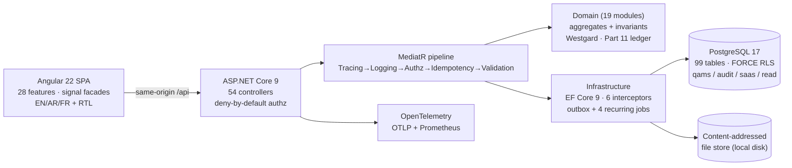

# NT.QAMS — AS-BUILT Review · Document 01 · Executive Product and Maturity Assessment

| Field | Value |
|---|---|
| Series / contract | AS-BUILT Review per [`00_REVIEW_MANIFEST.md`](00_REVIEW_MANIFEST.md) (v1.1) |
| Owner prompt | 01 — Executive Product and Maturity Assessment |
| Commit reviewed | `d74d4bff733d49361a1b4da1e1b3ef3e8338af06` (`master`) — **identical to the manifest baseline; no drift** |
| Working tree at review | Same pre-existing dirty state as manifest §1.2, plus the untracked review folder `docs/as-built-review/` itself |
| Review date | 2026-08-02 |
| Method | Static source inspection only (no execution); 6 parallel evidence sweeps + 18 completed adversarial verifications (13 CONFIRMED, 5 ADJUSTED, 0 REFUTED — see Appendix B) |

**Evidence-class legend (manifest §5):** `Implemented` (behavior in code/migrations, cited) · `UI-only` · `Documentation-only` (claimed in docs/UI text only) · `Mocked` · `Missing` · `Unknown`. **Implementation-status vocabulary (pack rule 7):** **Fully Implemented / Partially Implemented / Prototype Only / Missing**. **Confidence (manifest §7):** High = ≥2 independent artifacts; Medium = single citation/inference; Low = documentation/UI only. Runtime-behavior claims cap at Medium in this static review.

---

## 1. Product purpose (inferred from code and UI only)

NT.QAMS is a **multi-tenant SaaS Quality Management System for testing/medical laboratories**, built for regulated operation (ISO/IEC 17025 discipline, 21 CFR Part 11 electronic records/signatures). This is established from code alone:

- The SPA has a **dual-plane router**: a per-lab tenant front door at `t/:tenant` ("pins the laboratory for this browser") plus **48 tenant feature routes**, and a platform control plane at `/platform/tenants` — guards redirect each audience to its plane (`frontend/src/app/app.routes.ts:7-31`, `frontend/src/app/core/role.guard.ts:11-21`). *(Verified: CONFIRMED)*
- The tenant surface is a complete laboratory QMS: nonconformances/CAPA, complaints, feedback, internal audits, quality objectives/policy, change control, management reviews, controlled documents and records, risk/conflict-of-interest/organizational context, equipment and reference standards, environmental monitoring, suppliers, personnel competency/test authorization/training — each with a Domain folder, Application folder, controller, and frontend feature (**19 Domain modules, 18 Application modules, 42 controller files containing 54 controller classes, 28 feature folders**; only `Files` intentionally lacks its own Application folder/feature). *(Verified: CONFIRMED)*
- A 16-screen **analytical-quality suite implements laboratory statistics natively in the Domain layer**: Westgard multi-rule QC (1-3s, 2-2s, R-4s, 10-x rejection; 1-2s warning — `src/NT.QAMS.Domain/AnalyticalQuality/WestgardEvaluator.cs:66-134`), ten method-validation study types, measurement-uncertainty budgets, sigma metrics, and PT/ILC enrollment with z-score grading that raises a `PtUnsatisfactory` event for downstream NC handling (`PtEnrollment.cs:34,67-89`).
- Regulated-industry intent is **executable code, not documentation**: a hash-chained append-only audit trail with chain verification, an e-signature ledger (password + salted-hashed PIN, §11.50/§11.70 fields), a security-event log (§11.10(d)), and a field-level change interceptor — all persisted to a dedicated PostgreSQL `audit` schema created by migration `20260721232300_ComplianceAndAuth.cs`. *(Verified: CONFIRMED)*
- The UI is hand-rolled **trilingual EN/AR/FR with RTL** (`frontend/src/app/core/i18n.service.ts:3-11`, ~65 key namespaces mapping 1:1 onto the module surface).

## 2. Actual technology stack and architectural style

**Stack (from manifests only, High confidence):** .NET 9 (`net9.0` × 12 projects) · ASP.NET Core WebApi · MediatR 12.4 + FluentValidation 11.11 · EF Core 9 + Npgsql (PostgreSQL 17 per compose/CI) · Asp.Versioning 8.1 · OpenTelemetry 1.17 (OTLP + Prometheus exporter `1.17.0-beta.1` — pre-release) · ClosedXML / QuestPDF exports · Angular ^22.0.8, TypeScript ~6.0.3, rxjs, zone.js — **no UI kit, no NgRx, no i18n package, no ESLint/Prettier** (`frontend/package.json`).

**Style as wired (verified):** Clean Architecture **modular monolith** with CQRS:

- MediatR pipeline registered in exact order **Tracing → Logging → Authorization → Idempotency → Validation** (`src/NT.QAMS.Application/DependencyInjection.cs:20-24`; in-code comment: "authorization decides before validation can leak request schema"). *(CONFIRMED)*
- HTTP pipeline: ForwardedHeaders → Observability → SecurityHeaders → ExceptionHandler → Authentication → RateLimiter → TenantResolution → ActiveSession → MfaEnrollmentGate → ChangeReason → Authorization → controllers, with anonymous rate-limit-exempt `/health/live|ready`, `/health`, `/metrics` (`src/NT.QAMS.WebApi/Program.cs:250-291`). **Six** custom middlewares exist as classes. *(ADJUSTED → incorporated)*
- Boundaries are **executable merge gates**, not conventions: layer-dependency rules, one-authorization-policy-per-command, an 18-module domain-boundary rule, and a source-level `user_account` query-bounding gate (`tests/NT.QAMS.Architecture.Tests/*.cs`).
- **Deliberately absent** (code-scoped negative search of `src/`, `frontend/src`, and all 12 `.csproj`): SignalR, Hangfire, Redis, Serilog, AutoMapper, and all common message brokers. Their roles are in-house: JSON console + OTel logging; hand-written DTO mapping; five in-process `BackgroundService`s; an EF-persisted outbox published in-process with `FOR UPDATE SKIP LOCKED`, backoff, and dead-lettering — **no external queue, no real-time push, no distributed cache**. Name-only mentions survive in docs/deploy files (e.g. `deploy/web.config:8` reserves a `/hubs` route "for future SignalR"). *(ADJUSTED → scoped as stated)*
- Layering discipline sample: Domain references only SharedKernel (zero packages); exactly two controllers (Files, Exports) touch the DB directly and only via the `IAppDbContext` abstraction; zero `HttpClient` imports under `frontend/src/app/features` — all HTTP sits in 44 typed `core/api` services behind signal facades.

## 3. Actual persistence model

**Verdict: relational-first; no JSON-blob shortcuts, no client-side business storage, no mock data in production paths.** *(Core figures adversarially CONFIRMED)*

| Aspect | As-built reality | Evidence | Confidence |
|---|---|---|---|
| Relational | **99 physical tables** across 4 schemas — `qams` 92, `audit` 4, `saas` 2, `read` 1 (101 `ToTable` calls; 2 are owned-type table-splits). 59 migrations create them (99 CreateTable, 0 DropTable). | `AppDbContextModelSnapshot.cs:128-7509`; migrations folder | High |
| JSON in DB | Exactly **one** `jsonb` business column (`supplier_evaluation.criteria`, domain-serialized weighted scores) + 3 infrastructure text payloads (outbox payload, hash-chained audit payload, idempotency response cache) | snapshot:5675-5678; `Hardening1_TypesAndNames.cs:24` | High |
| Browser storage | **Five localStorage keys, all UX preferences** (theme, sidebar ×2, tenant slug, language). Access token is **memory-only** (ADR-0009) with a spec asserting it never touches web storage. One carve-out outside web storage: the rotating refresh token `qams_rt` lives in an httpOnly/Secure/SameSite=Strict cookie — never script-readable. | `core/auth.service.ts:15-52`; `shell.component.ts:30-31` | High |
| Mock data | **None in production paths**: EF InMemory confined to `tests/` (0 hits under `src/`); no `HasData`; startup seeding = platform admin from config keys + LOV catalogue + system roles, all idempotent; single `environment.ts` (`production: true`, `/api`) with no `fileReplacements` — no alternate config can even be built. | `StartupSeeding.cs:53-73`; `environment.ts:1-7` | High |
| Files | Content-addressed SHA-256 objects on local disk (`{root}/{tenant}/{sha256}`), rows in `qams.file_reference`, 50 MB limit + extension allow-list + magic-byte sniffing. S3/MinIO is a comment-level aspiration (`Documentation-only`). | `LocalFileStorage.cs:8,28-57`; `FilesController.cs:20,39-53` | High |

## 4. Genuinely functional end-to-end vs UI-only

**This is an API-first system with complete vertical slices — not a UI-first prototype.** *(27/28 verdict adversarially CONFIRMED)*

- **27 of 28 feature folders have a complete UI → facade/API → controller → handler → domain → migration chain.** The 28th (`features/manual`) is an intentionally static, searchable user manual rendering the shared help dictionary — by design, not a stub. Depth corroboration: 219 `ICommandHandler` references, 84 lazy routes, 59 migrations, and a deny-by-default `AuthorizationBehavior` throwing `AUTHZ-000` on any unannotated command.
- **Six modules deep-traced hop-by-hop, all Fully Implemented**: NC/CAPA (12-action controller, 10 policy-annotated commands), Document Control (publish mints a real password+PIN e-signature via `IESignatureService`), Analytical QC (server-side Westgard verdicts stored on `qc_run` rows, hand-rolled SVG Levey-Jennings chart — CONFIRMED with dedicated domain unit tests covering every rule), Equipment (calibration/maintenance with certificate files), Role-privilege administration, Platform tenant provisioning.
- **Parity map closed both ways** — all 44 frontend API services resolve to real controller routes and all 54 controller classes have frontend consumers; zero orphans in either direction. *(Single-pass finding: its adversarial re-check aborted on an infrastructure limit — treat as High-confidence sweep evidence, not adversarially confirmed.)*
- Weakest links found (cosmetic, not prototype markers): NC state transitions use the coarse `[RequireInternalActor]` policy pending fine-grained catalogue gates (controller comment defers to "full Phase 1"); `roles` and `platform` components inject their API service directly instead of a facade.

## 5. Capabilities, gaps, and material security/compliance concerns

### 5.1 Key findings table

| Finding | Status | Evidence | Confidence | Impact |
|---|---|---|---|---|
| Full laboratory QMS module surface (19 Domain modules, 28 features) wired end-to-end | Fully Implemented | §1, §4 citations | High | The product is functionally real, not a demo |
| Native analytical statistics (Westgard QC, 10 validation study types, MU, sigma, PT/ILC) | Fully Implemented | `WestgardEvaluator.cs:66-134`; `PtEnrollment.cs:34-89`; unit tests | High | Differentiating lab-domain depth in the Domain layer |
| Part 11 ledger: hash-chained audit trail + e-signatures + security events + field-change ledger, append-only DB triggers, chain-verification endpoint | Fully Implemented | `ComplianceLedgerServices.cs:12-242`; `ComplianceAndAuth.cs:154-165`; `ComplianceController.cs:60-70` | High | Core compliance story is executable code *(CONFIRMED)* |
| Tenant isolation: 5 layers (JWT claim → middleware → EF filters → FORCE RLS via per-connection GUC → composite FKs) + boot guard refusing over-privileged DB roles | Fully Implemented | `RequestIdentity.cs:48-65`; `AppDbContext.cs:150-212`; `TenantConnectionInterceptor.cs:23-56`; `Program.cs:207-230` | High | Cross-tenant leakage is structurally, not conventionally, prevented *(CONFIRMED; boot guard defers with a warning only if DB unreachable at probe time)* |
| Deny-by-default authorization: fallback authenticated-user policy + 170-key permission catalogue on endpoints (152 uses) + fail-closed command policy gate | Fully Implemented | `Program.cs:130-137`; `RequirePermissionAttribute.cs:27-60`; `AuthorizationBehavior.cs:49-70`; `CommandPolicyTests.cs:26-38` | High | *(ADJUSTED)* Layers 1+3 are structurally fail-closed; layer 2 (`[RequirePermission]`) is opt-in per endpoint with no gate forcing its presence; queries rely on layers 1–2 only |
| Session security: rotating hashed refresh tokens, family revocation on reuse, httpOnly cookie; RFC 6238 TOTP MFA; lockout; 12-char/4-class/breach-screened passwords | Fully Implemented | `RefreshSessions.cs:101-134`; `TotpService.cs:8-44`; `UserAccount.cs:29-30`; `PasswordRules.cs:17-53` | High | Strong authn engineering |
| **MFA enforcement for privileged roles defaults OFF and the reference production compose never sets the flag** (code comment even says "on in production" — no artifact does it) | Partially Implemented | `PasswordPolicyOptions.cs:14-17`; `Infrastructure/DependencyInjection.cs:79-80`; `deploy/compose.production.yml` | High | *(CONFIRMED)* Reference deployment ships with privileged MFA off unless the operator remembers |
| Single shared symmetric HS256 `Jwt:Secret` for all tenants + platform; no kid, no rotation mechanism | Partially Implemented | `SecurityAdapters.cs:63-71`; `Program.cs:125` | High | One env var mints any identity incl. PlatformAdmin; mitigations: ≥32-char startup check, 15-min tokens, per-request DB privilege re-read |
| RLS exceptions: `qams.user_account` and `qams.outbox_event` have **no RLS** (accepted deviation B9, compensated by query bounding + architecture test); the former `security_event` gap was closed by `Hardening2` | Partially Implemented | `Hardening2_RlsGapClosure.cs:17-43`; `SCHEMA-HARDENING-REPORT.md:144-193`; `UserAccountTenantBoundTests.cs` | High | Isolation on 2 tables is "discipline, not structure" (repo's own words) |
| Secrets hygiene | Fully Implemented | empty-by-design appsettings; `${VAR:?}` placeholders in production compose; only labelled dev/CI literals | High | CLEAN verdict — no production secrets committed |
| Backend test estate: 395 static test methods; real-PostgreSQL RLS/immutability suite with **anti-skip sentinel that CI cannot bypass** | Fully Implemented | `RuntimeRolePrivilegeTests.cs:21-33`; `ci.yml:62-92` | High | *(CONFIRMED)* CI genuinely exercises RLS as a non-superuser role |
| Functional API suite runs on EF InMemory; repo admits defects escaped a green suite (VER-001); only 4 real-DB HTTP-pipeline tests compensate | Partially Implemented | `QamsWebAppFactory.cs:74`; `RegulatedFlowRealDatabaseTests.cs:10-18,92-196` | High | *(CONFIRMED)* Known, self-documented fidelity gap at the HTTP layer (DbContext-level real-PG coverage exists in IntegrationTests) |
| Frontend test coverage: ~7 of 107 components, 3 of 35 facades; the one full-stack e2e journey never runs in CI | Partially Implemented | spec inventory; `ci.yml:148`; `regulated-workflow.spec.ts:56-60` | High | The layer users sign records through is the least tested |
| Validation/assurance posture: SEC-001 pen test not performed; DOC-001 all OQ executed on a dev workstation, transcripts 12–13 **unsigned**; schema hardening never applied to a qualified installation; OPS-001 no staging load/soak | Documentation-only (open per repo's own records) | `CLAUDE.md:75-77`; `docs/validation/12-…:220-221`, `13-…:133-134`; `SCHEMA-HARDENING-REPORT.md:386-387` | High | **The gap between engineering quality and inspection-readiness** |
| Real-time push, distributed cache, object storage, external queue | Missing (by design/deferred) | §2 negative search; `LocalFileStorage.cs` comment | High | Future-work mentions exist in README/deploy docs only |

### 5.2 Documentation-only claims flagged
`CLAUDE.md`'s "460 backend tests" (static count is 395 attributed methods; consistent with Theory row expansion but unverifiable without execution); "v1.52.0" (55 git tags end at v1.51.2 — no v1.52.0 tag); production compose image tag `ntqams-webapi:1.43` lags the claimed code version; README/ONBOARDING still describe an Angular 18 / API-only state.

## 6. Maturity classification

**Classification: Pre-production.**

Criteria used: **Prototype** = UI over mock/local data; **Internal Demo** = happy paths on real persistence, no controls; **MVP** = core modules end-to-end with basic security; **Pre-production** = feature-complete, real persistence, security/compliance controls implemented and regression-gated, but release-assurance evidence (independent security testing, qualified-environment validation, operational proof) incomplete; **Production-ready** = all of the foregoing plus signed validation, independent pen test, and demonstrated operational capacity.

NT.QAMS clears the Pre-production bar comfortably (27/28 complete slices; structural tenancy; executable Part 11 ledger; CI with SCA/architecture/API-surface/RLS gates; versioned deploy artifacts and runbooks) but **fails Production-ready on its own records**: no independent pen test (SEC-001), validation executed only on a development workstation with unsigned OQ transcripts (DOC-001), no staging observability/load/soak evidence (OPS-001), and privileged MFA disabled in the reference deployment. These are assurance and operational gaps, not code gaps — which is precisely what "Pre-production" means.

## 7. Completion estimates (estimates = judgment; basis = fact)

| Area | Estimate | Factual basis (cited above) | Judgment component |
|---|---|---|---|
| Backend (domain/app/API) | ~95% | 19 modules, 219 command handlers, 54 controllers, zero orphans | Remaining: fine-grained NC transition gates, Files application layer |
| Database | ~95% | 99 tables, 59 migrations, RLS + CHECK + immutability hardening train complete | Residual: B9 deviation accepted, not planned work |
| Frontend (functionality) | ~90% | 28 features, 84 routes, full parity, trilingual/RTL | Thin areas: platform plane breadth, facade consistency |
| Security engineering | ~85% | Full authn/authz/tenancy/ledger stack in code | Open: MFA-off default, HS256 single key/no rotation, pen test pending |
| Compliance — controls in code | ~90% | All seven Part 11 control families implemented and gated | Fine-grained signature meanings per module vary |
| Compliance — validation evidence | ~40% | GAMP 5 doc set exists; OQ executed | **Nothing executed on a qualified environment; signatures missing** |
| Testing | ~65% blended | Backend ~85% (395 methods + real-PG gates); frontend ~15% (7/107 components) | InMemory fidelity gap partially compensated |
| Integrations/operations | ~70% | OTel + Prometheus + health + runbooks + backup scripts; email adapter present in `Infrastructure/Email` (inventory fact — behavior deferred to Document 10) | No staging/load proof (OPS-001); no real-time push; single-replica by ADR |
| **Overall product** | **~85% engineering-complete; materially less release-ready** | — | Release-readiness is gated by the §6 assurance items, not by missing features |

## 8. Top 10 executive risks

| # | Sev. | Risk | Evidence |
|---|---|---|---|
| 1 | **Critical** | **Validated status is not defensible today**: every OQ/validation execution ran on a development workstation, transcripts 12–13 are unsigned, and the six schema-hardening migrations have never been applied to a qualified installation (DOC-001). In a GxP inspection or enterprise procurement audit, the compliance claim fails on evidence, not on code. | `docs/validation/13-…:133-134`; `12-…:220-221`; `SCHEMA-HARDENING-REPORT.md:386-387`; `CLAUDE.md:75-77` |
| 2 | High | **No independent penetration test** (SEC-001) — all adversarial evidence is in-house (probe scripts, deny matrices). Standard buyer/auditor ask for a Part 11 product. | `CLAUDE.md:75-76`; `scripts/security-probe*.ps1` |
| 3 | High | **Privileged-role MFA enforcement ships OFF**: default false, per-tenant default false, and no deployment artifact sets the flag despite the code comment "on in production". | `PasswordPolicyOptions.cs:14-17`; `deploy/compose.production.yml` |
| 4 | High | **Single shared HS256 signing secret**, no key id, no rotation: any process holding one env var can mint PlatformAdmin identities. Mitigations exist (15-min tokens, per-request privilege re-read) but key compromise is catastrophic and rotation is operationally undefined. | `SecurityAdapters.cs:63-71`; `Program.cs:125` |
| 5 | High | **Frontend assurance gap**: ~7/107 components and 3/35 facades have specs; the only full-stack regulated-workflow e2e never executes in CI. The signing/record-keeping UI is the least-verified layer. | spec inventory; `ci.yml:148`; `regulated-workflow.spec.ts:56-60` |
| 6 | Medium | **HTTP-pipeline test fidelity**: 21 of 23 functional test classes run on EF InMemory; the repo's own VER-001 note records defects that escaped a green suite; only 4 real-DB HTTP tests compensate. | `QamsWebAppFactory.cs:74`; `RegulatedFlowRealDatabaseTests.cs:10-18` |
| 7 | Medium | **Two tables outside RLS** (`user_account`, `outbox_event`) — accepted deviation B9; isolation there depends on query discipline + an architecture test rather than the database engine. | `SCHEMA-HARDENING-REPORT.md:144-193` |
| 8 | Medium | **Operational capacity unproven** (OPS-001): no staging bring-up, no ≥100 VU load test, no 24 h soak; load harness deliberately outside the solution and never run in CI; single-replica topology by ADR-0001. | `CLAUDE.md:76`; `tests/NT.QAMS.LoadTests/…csproj:3-8` |
| 9 | Medium | **Toolchain determinism**: floating NuGet wildcards (`9.0.*` etc.), no `global.json`, no lockfiles for NuGet, `dotnet-ef` pinned at 10.0.10 (`rollForward:false`) one major ahead of the runtime — restores are not reproducible over time (manifest OBS-06). | csproj set; `.config/dotnet-tools.json` |
| 10 | Medium | **Documentation drift undermines trust in repo docs**: v1.52.0 claimed but untagged; production compose pinned to image 1.43; README/ONBOARDING describe an obsolete Angular-18/API-only state; IMPLEMENTATION_LOG's last numbered entry is v1.48.0. Each is trivial alone; together they mean repo documentation cannot be relied on without source verification (this review's operating assumption). | `git tag`; `README.md`; `compose.production.yml`; OBS-01/03/04 |

## 9. Reviewer orientation — read these five first

1. **`CLAUDE.md`** — the repo's operating law *and* its honest open-items register (SEC-001/DOC-001/OPS-001, unsigned OQ). Ten minutes here frames everything, including what the team itself does not claim.
2. **`src/NT.QAMS.WebApi/Program.cs`** — the whole host in one file: JWT validation, deny-by-default fallback policy, the six-middleware pipeline and its order, API versioning, OpenTelemetry, health endpoints, and the production DB-role boot guard (lines 104-291).
3. **`src/NT.QAMS.Application/Behaviors/AuthorizationBehavior.cs`** (with `DependencyInjection.cs:20-24`) — the fail-closed heart of the authorization model; explains why "every command must carry exactly one policy" is a merge gate.
4. **`src/NT.QAMS.Infrastructure/Persistence/Migrations/AppDbContextModelSnapshot.cs`** — the entire 99-table schema, tenancy keys, and RLS-relevant shape in a single generated file; the fastest way to grasp data scope.
5. **`frontend/src/app/app.routes.ts`** — the complete product surface: dual-plane routing, guards, and all 84 lazy routes; effectively the sitemap of what the product does.

*(Honorable mentions: `src/NT.QAMS.Infrastructure/Compliance/ComplianceLedgerServices.cs` for the Part 11 machinery; `tests/NT.QAMS.WebApi.FunctionalTests/ApiSurface.approved.txt` for the 666-line API contract.)*

## 10. Documentation completeness checklist (review artifacts)

| # | Artifact | Status |
|---|---|---|
| 00 | [`00_REVIEW_MANIFEST.md`](00_REVIEW_MANIFEST.md) | ✅ Delivered (v1.1) |
| 01 | `01_EXECUTIVE_SUMMARY.md` | ✅ **This document** |
| 02 | `02_REPOSITORY_AND_ARCHITECTURE_MAP.md` | ⬜ Pending (Prompt 02) |
| 03 | `03_BACKEND_AND_API_INVENTORY.md` | ⬜ Pending (Prompt 03) |
| 04 | `04_DATABASE_AS_BUILT_DEEP_AUDIT.md` | ⬜ Pending (Prompt 04) |
| 05 | `05_FRONTEND_AS_BUILT_DEEP_AUDIT.md` | ⬜ Pending (Prompt 05) |
| 06 | `06_BUSINESS_MODULE_COVERAGE.md` | ⬜ Pending (Prompt 06) |
| 07 | `07_WORKFLOWS_AND_BUSINESS_RULES.md` | ⬜ Pending (Prompt 07) |
| 08 | `08_SECURITY_AND_COMPLIANCE_DEEP_AUDIT.md` | ⬜ Pending (Prompt 08) |
| 09 | `09_TESTING_QUALITY_AND_CICD_AUDIT.md` | ⬜ Pending (Prompt 09) |
| 10 | `10_INTEGRATIONS_OPERATIONS_AND_OBSERVABILITY.md` | ⬜ Pending (Prompt 10) |
| 11 | `11_REQUIREMENTS_TRACEABILITY.md` | ⬜ Pending (Prompt 11) |
| 12 | `12_TECHNICAL_DEBT_AND_RISK_REGISTER.md` | ⬜ Pending (Prompt 12) |
| 13 | `13_AS_BUILT_VS_TARGET_ARCHITECTURE.md` | ⬜ Pending (Prompt 13) |
| 14 | `14_REVIEWER_ONBOARDING_GUIDE.md` | ⬜ Pending (Prompt 14) |
| 15 | `15_FINAL_RECONCILIATION_AND_QA.md` | ⬜ Pending (Prompt 15, final) |

---

## Appendix A — Manifest Appendix A observation updates (touched by this document)

| OBS | Update from this document |
|---|---|
| OBS-01 (version drift) | **Confirmed and extended**: 55 tags end at v1.51.2, no v1.52.0 tag; production compose additionally pins image `ntqams-webapi:1.43`. Carry to Docs 02/15. |
| OBS-03 (README stale) | **Confirmed** (API-only/Angular-18 narrative contradicted by source). Carry to Docs 14/15. |
| OBS-04 (Angular-18 metadata) | **Confirmed** (`frontend/package.json:4` description vs `^22.0.8` deps). Carry to Doc 05. |
| OBS-05 (LoadTests outside sln) | **Confirmed** intentional (csproj comment); no perf test runs in CI. Carry to Doc 09. |
| OBS-06 (toolchain determinism) | **Confirmed** (floating wildcards; `dotnet-ef` 10.0.10 pin). Carry to Docs 02/09/12. |
| OBS-08 (open assurance items) | **Confirmed** with primary-source citations (unsigned OQ 12/13, dev-workstation-only validation, SEC-001/OPS-001 open). Ranked as executive risks #1/#2/#8. |
| OBS-09 (dirty tree) | Unchanged at review time (same 3 modified + 3 untracked files, plus this review folder). |
| OBS-10 (pre-release Prometheus exporter) | **Confirmed** (`1.17.0-beta.1` in WebApi.csproj). Carry to Docs 02/10/12. |

OBS-02 (migration count) remains closed (59 verified again this document). OBS-07 not in this document's scope (Doc 09).

## Appendix B — Adversarial verification record

19 load-bearing claims were queued for independent adversarial re-verification against cited source; **18 completed: 13 CONFIRMED, 5 ADJUSTED (wording/precision — all corrections incorporated above), 0 REFUTED.** The 19th (frontend/backend parity, zero orphans) aborted on a tooling limit and stands on single-pass sweep evidence only. Notable adjustments absorbed: six (not five) custom middlewares; technology-absence claims scoped to code (name-only mentions exist in docs/deploy files); browser-storage claim carved out the httpOnly `qams_rt` cookie; authorization layer 2 (`[RequirePermission]`) is opt-in per endpoint rather than fail-closed; queries are gated at layers 1–2 only.

## Appendix C — Reviewer no-modification attestation (manifest §8 model)

- [x] No file under `src/`, `tests/`, `frontend/`, `scripts/`, `deploy/`, `.github/`, `.config/` was created, modified, or deleted by this review step.
- [x] No build, test, migration, restore, or package operation was executed; no database connection was opened; nothing was run.
- [x] Only read-only repository access (file reads, searches, read-only `git`) was used, including by the parallel evidence agents.
- [x] The only filesystem write is this document: `docs/as-built-review/01_EXECUTIVE_SUMMARY.md`.
- [x] No secret values are reproduced anywhere above; configuration is cited by key name only; the one CI-only literal encountered was redacted at source.
- [x] Nothing was invented: every material claim carries a source citation; claims resting on documentation alone are labelled `Documentation-only`.

---

*End of Document 01. Reviewed at manifest baseline `d74d4bf` (no drift). Next: Prompt 02 → `02_REPOSITORY_AND_ARCHITECTURE_MAP.md`.*
