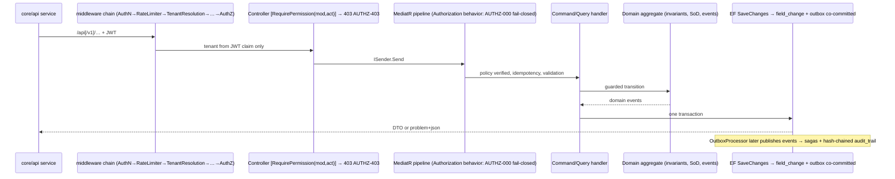

# NT.QAMS — AS-BUILT Review · Document 03 · Backend and API Inventory

| Field | Value |
|---|---|
| Series / contract | AS-BUILT Review per [`00_REVIEW_MANIFEST.md`](00_REVIEW_MANIFEST.md) (v1.1) |
| Owner prompt | 03 — Backend and API Inventory |
| Commit reviewed | `d74d4bff733d49361a1b4da1e1b3ef3e8338af06` (`master`) — **identical to the manifest baseline; no drift** |
| Review date | 2026-08-02 |
| Method | Static source inspection only; five parallel evidence agents over `src/NT.QAMS.WebApi/Controllers/**` → handlers in `src/NT.QAMS.Application/**`, cross-checked against `tests/NT.QAMS.WebApi.FunctionalTests/ApiSurface.approved.txt`; one adversarial parity re-verification |

**Evidence-class legend (manifest §5):** `Implemented` · `UI-only` · `Documentation-only` · `Mocked` · `Missing` · `Unknown`. **Status vocabulary:** Fully Implemented / Partially Implemented / Prototype Only / Missing. **Confidence:** High = ≥2 independent artifacts; Medium = single citation/inference; Low = documentation only. Runtime claims cap at Medium (nothing was executed).

---

## 1. Surface totals

| Metric | Value | Source |
|---|---|---|
| Distinct HTTP routes (unversioned) | **333** | `ApiSurface.approved.txt` (666 lines = 333 × `v{version}` mirror) |
| Controller classes | **54** across **42** `.cs` files (5 files bundle multiple controllers) | grep `: ControllerBase` |
| Application commands (`ICommand`) | **146** | grep `NT.QAMS.Application` |
| Application queries (`IQuery<>`) | **71** | grep |
| Command authorization attributes (`RequirePermissionPolicy` / `RequireInternalActor` / `RequireRole` / `AllowUnauthenticated`) | **214** | grep — every command carries exactly one (enforced by `CommandPolicyTests`) |
| FluentValidation validators | **90** | grep `AbstractValidator<>` |
| Endpoint permission gates (`[RequirePermission]`) | **152** across 38 controller files | grep |
| Anonymous endpoints (`[AllowAnonymous]`) | **7** | grep (5 on AuthController + workspace lookup; health/metrics use `.AllowAnonymous()` fluent) |
| SignalR hubs / minimal-API routes | **0** / **0** — controllers only | Doc 01 §2 negative search |

**Required summary tables** (the two shapes Prompt 03 asks for are populated per-module in §6; controllers-at-a-glance below):

| Controller/Hub group | Responsibility | Dependencies | Risk/Notes |
|---|---|---|---|
| Auth (1) | login/refresh/MFA/PIN/self-service | `ISender`, cookie `qams_rt` | 5 anonymous actions; MFA-confirm & self-service change untested |
| Improvement (5: NC, Complaints, Feedback, QualityObjectives, QualityPolicy) | quality events & CAPA | `ISender` | NC verify/close mint **no e-signature** on a signed-record module; enum-parse 500s |
| DocumentControl (1) | controlled-doc lifecycle | `ISender` | **only** controller that mints an e-signature (publish) |
| AuditManagement (1) | internal audits | `ISender` | sign-off gated on `Sign` but **mints no signature** |
| RiskGovernance (Risks, Changes, ManagementReviews, Conflicts, OrgContext) | governance registers | `ISender` | changes/reviews signed-record modules with no signature; public Jitsi link default |
| AnalyticalQuality (16) | QC + 10 study types + PT | `ISender` | sign-offs mint no signature; most child writes ungated; PT result auto-raises NC ungated |
| Resources (Equipment, ReferenceStandards, MonitoringPoints, Suppliers) | lab resources | `ISender` | calibration/reading/certificate writes ungated with regulatory downstream effects |
| People (Competencies, TestAuthorizations, TrainingAssignments, AccessReviews) | personnel | `ISender` | test-authorization grant is the strongest evidence gate; training-complete has no ownership check |
| Platform/Ops (Tenants, TenantSettings, Branches, Departments, TestCatalog, Lovs, Notifications, Sla, WorkTasks) | control plane + config | `ISender` | Tenants is the only legitimate `[Authorize(Roles=)]`; task-complete unowned |
| Reporting (1) | dashboards + Part 11 review pack | `ISender` | `quality-analytics` ~40 uncached aggregates; per-section privilege scoping |
| Compliance (1) | Part 11 ledger reads + review | `ISender` | chain-verification returns a bare-string 400 (breaks problem+json) |
| Files / Exports (2) | binary streaming / report gen | `IAppDbContext` (via abstraction) | Files download unlogged & ungated; one export inconsistently ungated |
| IdentityAccess admin (Users, UserDirectory, Roles) | user & role admin | `ISender` | admin password reset writes **no** security event & no session revocation |

## 2. API mechanics (as wired)

- **Versioning (ADR-0004):** Asp.Versioning URL-segment reader; `DefaultApiVersion 1.0`, `AssumeDefaultVersionWhenUnspecified`, `ReportApiVersions`. A custom `VersionedRouteConvention` (`Versioning/VersionedRouteConvention.cs:16`) **dual-routes** every controller: `api/…` (implicit v1.0) and `api/v1/…` both resolve — which is why `ApiSurface.approved.txt` lists each route twice. **Fully Implemented / High.**
- **Pagination:** a `PagedResponse<T>` envelope (API-004) with `page`/`pageSize`/`hasMore`, normalized via `PageRequest.Normalized`. **Applied inconsistently** — NC, risks, changes, reviews, documents, equipment, suppliers, audits, archives, competencies, training, notifications/mine, tasks/mine, reports paginate; **complaints, feedback, quality-objectives, conflicts, org-context, reference-standards, monitoring-points, all 16 analytical families, test-authorizations, and most platform lists return bare unpaged `IReadOnlyList<T>`.** Partially Implemented / High.
- **Error model:** `DomainExceptionHandler.cs:26-82` maps FluentValidation→400, `*-404`→404, `InvalidStateTransition`/`DbUpdateConcurrency`→409 (`CONCURRENCY-409`), other `DomainException`→422, `AUTH-*`→401, `AUTHZ-*`→403 — all problem+json with a traceId (ADR). **Two documented breaks:** `GET /api/compliance/chain-verification` returns `BadRequest(string)` (`ComplianceController.cs:66`), and **unmapped `ArgumentException` from `Enum.Parse` in controllers/handlers surfaces as an unhandled 500 instead of 400** (see §5.2). Partially Implemented / High.
- **Concurrency (ADR-0005):** `xmin` optimistic concurrency → 409 `CONCURRENCY-409`. Idempotency-Key replay via `IdempotencyBehavior`. **Fully Implemented / High** (corroborated by `IdempotencyTests`, `OptimisticConcurrencyTests`).
- **Rate limiting:** global limiter + auth/e-signature partitions (`AuthPolicy`, `RefreshPolicy`, `ESignaturePolicy`) → 429; health/metrics exempt. **Fully Implemented / High.**
- **OpenAPI:** `Microsoft.AspNetCore.OpenApi`, dev-only `MapOpenApi().AllowAnonymous()`; **not exposed in Production.** Many controllers omit `ProducesResponseType` (Auth/Files/Tenants declare them; most module controllers do not) — a documentation gap, not a functional one.
- **CORS:** none (ADR-0007, same-origin). **Correct by design.**

## 3. CQRS assessment

CQRS is genuine, not cosmetic: **146 commands / 71 queries**, each a MediatR request with a dedicated handler; commands mutate through domain aggregates, queries read via `IAppDbContext` projections. Findings:

- **Every command carries exactly one authorization attribute** — 214 total, enforced as a CI merge gate (`CommandPolicyTests`). This is the deny-by-default backbone and it holds. **Fully Implemented / High.**
- **Queries are deliberately un-gated in the pipeline** — the `AuthorizationBehavior` covers commands only (`AuthorizationBehavior.cs:44-47`); read authorization lives at the controller `[RequirePermission]` layer, which is **opt-in and frequently omitted** (§5.1). This is the single most consequential architectural asymmetry in the API.
- **Two authorization gates, not always aligned:** the HTTP `[RequirePermission(module, action)]` filter and the command `[RequirePermissionPolicy]` are independent. Most write commands use the coarser `[RequireInternalActor]` (any authenticated role except `ExternalAuditor`) rather than `[RequirePermissionPolicy]`, so **the fine-grained permission is enforced only by the HTTP filter when present** — a direct/internal MediatR caller bypasses it. Called out per-endpoint in §6; the audit sign-off is the clearest instance (`AuditsController` sign-off gated `Sign` at HTTP but `[RequireInternalActor]` at the command).
- **Handlers are thin; invariants live in aggregates** (per CLAUDE.md rule 6) — verified repeatedly (SoD checks, state machines, score bounds all in `Domain/`). Validators cover **90** request types, but coverage is skewed to `Create*` commands; **most `Add-child`, `Import*`, `Update*`, `Calculate*`, `SignOff*` commands have no validator** (§5.3).

## 4. Request-flow verification & frontend parity

**Parity re-verified adversarially (this document, correcting Doc 01's single-pass claim):**

> All 44 frontend `core/api/` services map to real routes (0 frontend→backend orphans). In the backend→frontend direction there is **exactly one orphan**: `PUT /api/qc/profiles/{id}/targets` (`AnalyticalQualityControllers.cs:27`, gated `AnalyticalQuality.Manage`, dispatching `UpdateQcTargetsCommand` with a **reason-for-change**) — a regulated QC-baseline mutation reachable by API with **no UI caller and no `UpdateQcTargetsRequest` TS model**. The other 332 of 333 routes have a caller; all 54 controllers have a consumer. Direct HTTP outside `core/api` comes from **two** files — `core/auth.service.ts` (Auth + TenantSettings) **and** `core/permissions.service.ts` (`GET /api/auth/me/privileges`, `PUT /api/auth/me/language`) — not one as previously stated. No facade or component issues raw HTTP.

Verdict **ADJUSTED**; recorded as finding **NB-03-01** (orphan) and **NB-03-02** (parity wording correction). Method note: `ApiSurface.approved.txt` is CRLF — naive line comparison silently mismatches every line, the likely cause of any prior miscount.

## 5. Cross-cutting findings (the load-bearing part of this inventory)

### 5.1 Part 11 e-signature manifestation is missing on most signed-record gates — **highest-value finding**

`IESignatureService` is invoked in **exactly one** application handler: document publish (`DocumentControl/Commands/DocumentCommands.cs:122`), which mints a `signature_record` after a password+PIN ceremony with content-hash binding. **Every other endpoint that closes/approves/signs a `SignedRecordLifecycle` record writes only `SignedOffBy`/timestamp fields and raises an event — no `signature_record`, no meaning, no credential ceremony:**

| Endpoint | Module registered as | Gate | Signature minted? |
|---|---|---|---|
| `POST /api/audits/{id}/sign-off` | SignedRecordLifecycle | `[RequirePermission(Audits, Sign)]` (HTTP) + `[RequireInternalActor]` (cmd) | **No** (`AuditsController` sign-off; `SignOffAuditHandler` takes no `IESignatureService`) |
| `POST /api/nonconformances/{id}/verify` & `/confirm-effectiveness` | SignedRecordLifecycle | `[RequirePermission(nc, Approve)]` | **No** |
| `POST /api/quality-policy/{id}/approve` | SignedRecordLifecycle | `[RequirePermission(quality-policy, Approve)]` | **No** (SoD enforced, no signature) |
| `POST /api/changes/{id}/approve` | SignedRecordLifecycle | `[RequirePermission(changes, Approve)]` | **No** (and no SoD either) |
| `POST /api/management-reviews/{id}/close` | SignedRecordLifecycle | `[RequirePermission(reviews, Void)]` | **No** |
| `POST /api/{study}/{id}/sign-off` × 12 AQ families + validation-studies + pt-plans/approve | Sign action | `[RequirePermission(AnalyticalQuality|ProficiencyTesting, Sign|Approve)]` | **No** (SoD-AQ-001 enforced in-domain; no signature record) |

**Status: Partially Implemented / High.** The permission catalogue models a `Sign` action and these modules as signed-record lifecycles, and SoD is genuinely enforced in the aggregates — but the **electronic-signature manifestation (21 CFR §11.50/§11.70: signed record carries the signer, meaning, and is bound to the content)** exists only for documents. For a product marketed on Part 11, this is a material compliance gap to route to Documents 08 and 12.

### 5.2 Unhandled `Enum.Parse` → 500 instead of 400

At least **14 write endpoints** parse a raw request string into a domain enum in the controller or handler with no validator and no try/catch, so a malformed value throws `ArgumentException` — which `DomainExceptionHandler` does not map — producing a **500, not a 400**. Confirmed sites: NC (`SourceType`/`EventType`/`RcaMethod`/`CapaActionType`), complaints (`Channel`), feedback (`Type`), quality-objectives (`Direction`), conflicts (`RiskLevel`/`Outcome`), org-context issues (`Type`), documents (`Bump`), audits (`Type`/`Verdict`/`Grade`), archives (`RetentionClass`), reference-standards (`Type`). **Partially Implemented / High** — functional on valid input, incorrect HTTP semantics (and a minor DoS/log-noise vector) on invalid input.

### 5.3 Ungated writes with regulatory downstream effects

The `[RequireInternalActor]`-only pattern leaves several **consequential writes reachable by any internal role**, including ones that auto-raise regulated records:

- `POST /api/proficiency-tests/{id}/result` — **auto-opens an NC** on unsatisfactory z-score; no `[RequirePermission]`, **no validator**, no test.
- `POST /api/monitoring-points/{id}/readings` — excursion **auto-opens an NC**; ungated.
- `POST /api/equipment/{id}/calibrations` — **clears an equipment lockout**; ungated, `Provider`/`Result` unbounded.
- `POST /api/qc/profiles/{id}/runs` — Westgard verdict stored; ungated; `QcOutOfControl` event has **no subscriber** and carries `Guid.Empty` tenant id (captured pre-stamp).
- `POST /api/nonconformances/{id}/actions` etc. — 7 of 10 NC writes gated only by `[RequireInternalActor]`.
- `POST /api/training-assignments/{id}/complete` and `POST /api/tasks/{id}/complete` — **no ownership check**; any authenticated user closes anyone's record (and moves the SLA figure).

**Partially Implemented / High.**

### 5.4 Sensitive reads un-gated; confidential masking by role literal

`GET /api/conflicts` (named impartiality allegations), `GET /api/management-reviews/{id}` (full minutes + meeting link, readable by `ExternalAuditor`), `GET /api/documents/{id}/signatures` (signature manifest, returns `[]` for a non-existent id), and most module lists are readable by **any authenticated tenant user** with no `*.view` gate. Complaint confidential-reporter masking uses **raw role literals** `User.IsInRole("QualityManager") || User.IsInRole("TenantAdmin")` (`ComplaintsController.cs:18-19`) — a magic-string, role-based check (violates CLAUDE.md rules 2 & 9) that a tenant's own custom privileged role cannot satisfy. **Partially Implemented / High.**

### 5.5 Admin credential operations under-logged

`POST /api/users/{id}/reset-password` writes a redacted field-change row but **emits no `SecurityEvent`** (self-service `PASSWORD_CHANGED` does) and **does not revoke the target's live refresh-token family** — an admin-forced reset leaves no security-event trail and does not sign the user out. Contrast the admin PIN issue (`/signature-pin`), which correctly writes `PIN_ADMIN_SET`. **Partially Implemented / High.**

### 5.6 Consistency nits (Low/Medium)

201-vs-200 for creates is inconsistent (many creates return `200 {id}`); `copy_number` and quality-policy `version` are non-atomic read-then-write (concurrent collision possible); `status` filters use case-sensitive `.ToString()` comparison so a wrong-case value silently returns an empty page rather than 400; `SlaDefinitions`/`quality-analytics` join on free-text `Module`/`Severity` with no catalogue check (a typo silently detaches the analytics lookup); `ArchivesController` carries unused `using`s (drift).

## 6. Endpoint inventory by module

The complete route contract is `tests/NT.QAMS.WebApi.FunctionalTests/ApiSurface.approved.txt` (333 routes; every row below maps 1:1, verified). Full per-action detail was captured for all 54 controllers; reproduced here grouped by module with the deficient/notable endpoints called out in full and the routine CRUD compressed. All routes also exist under `api/v1/…`.

### 6.1 Identity & Auth (AuthController, UsersController, UserDirectoryController, RolesController, AccessReviewsController)

**AuthController** `api/auth` · `[EnableRateLimiting(AuthPolicy)]`:

| Endpoint | AuthN/AuthZ | Response | Side effects | Validation | Tests | Status |
|---|---|---|---|---|---|---|
| POST /login | `[AllowAnonymous]` | 200 `AuthResponse` / 401 `AUTH-*` / 429 | `qams_rt` cookie, refresh family, `LOGIN_*` events, lockout | `LoginValidator` | 18+ suites | Fully |
| POST /refresh | `[AllowAnonymous]`+RefreshPolicy | 200 + rotated cookie / 401 | reuse→family revoke, `REFRESH_REUSE_DETECTED` | — | `RefreshSessionTests` | Fully |
| POST /logout | `[AllowAnonymous]` | 204 | family revoke, cookie delete, `LOGOUT` | — | `RefreshSessionTests` | Fully |
| GET /workspace/{slug} | `[AllowAnonymous]` | 200 name / 404 | none | — | `WorkspaceLookupTests` | Fully |
| POST /change-password | `[AllowAnonymous]` (expired-pw path) | 204 / 401 (AUTH-102 reuse→401) | `PasswordRotation`, `PASSWORD_CHANGED` | `ChangePasswordValidator` | **none** | Fully, untested |
| POST /mfa/enroll | `[Authorize]` | 200 secret (by design) | TOTP secret set | — | `AuthActorFunctionalTests` | Fully |
| POST /mfa/confirm | `[Authorize]` | 204 / 422 | `MFA_ENABLED` | **no** | **none** | Partially (no validator/test) |
| POST /me/change-password | `[Authorize]` | 204 | self-service rotation | `ChangeMyPasswordValidator` | **none** | Fully, untested |
| POST /signature-pin | `[Authorize]` | 204 | `PIN_SET/PIN_CHANGED` | `SetPinValidator` (`^\d{4}$`) | **none** | Fully, untested |
| GET /me/privileges | `[Authorize]` | 200 `MyPrivilegesDto` | none | — | `RolePrivilegeFlowTests` | Fully |
| PUT /me/language | `[Authorize]` | 204 | field-change | `SetMyLanguageValidator` | **none** | Fully, untested |

**Users/Roles/AccessReviews (highlights):** all `[RequirePermission(Users|RolesPrivileges|AccessReviews, …)]` + command policy. Strong: `PUT /users/{id}/assigned-role`, `/scope`, `PUT /roles/{id}/permissions` (all with `ManageRolesLockoutGuard` preventing a tenant stranding itself; proven by `RoleHandlersTests`, `RolePrivilegeFlowTests`). Gaps: **`reset-password` no security event/no session revoke** (§5.5); `POST /users/{id}/role` (legacy tier path) and `deactivate` skip the lockout guard; `PUT /users/{id}/language` accepts any ≤10-char string; **AccessReviews write actions gated on class-level `View`** not a create/manage key. `GET /users/directory` intentionally un-gated (colleague picker). All Fully except the noted Partials.

### 6.2 Improvement (NC, Complaints, Feedback, QualityObjectives, QualityPolicy)

NC/CAPA: 12 actions, full state machine (raise→submit→triage→reject→rca→plan/complete action→submit-verification→verify→confirm-effectiveness). SoD enforced in-domain (raiser≠verifier `SOD-CAPA-002`, raiser≠closer `SOD-CAPA-001`). **Gaps:** 7/10 writes `[RequireInternalActor]`-only; verify/confirm mint no signature (§5.1); enum-parse 500s on raise/rca/actions (§5.2); triage `AssigneeId` unvalidated. Sagas: complaint-validate→NC, feedback-escalate→complaint, all outbox-driven and idempotent. Notable: `GET /api/complaints` role-literal masking (§5.4); quality-policy is the only Improvement controller gating a read (`quality-policy.view` on history). Full tables captured; NC/complaints/quality-objectives Partially Implemented on the noted axes, remainder Fully.

### 6.3 Document Control (DocumentsController — 17 actions)

The compliance centerpiece. `POST /{id}/publish` mints the **only real e-signature** (`[RequirePermission(Documents, Sign)]` + `[RequirePermissionPolicy(Documents, Sign)]` + `ESignaturePolicy` rate limit; password+PIN; content hash = published file SHA-256; `ESIGN_FAILED/LOCKED/NO_PIN` events; preconditions pre-validated before minting). Recommend/reject/retire correctly gated + SoD. **Gaps:** create/submit/versions/confirm-review ungated (`[RequireInternalActor]`); `GET /{id}/signatures` ungated & returns `[]` for a missing doc; `versions` enum-parse 500 on `Bump`; controlled-copy `copy_number` non-atomic. Fully on the signing ceremony; Partially on the ungated authoring surface.

### 6.4 Audit Management (AuditsController — 7 actions)

schedule→start→checklist-answer→findings→sign-off. `findings` drives the `FindingToNcPolicy` saga (the **only application-layer saga with a test**, `FindingToNcPolicyTests`). **Notable gap (§5.1):** `sign-off` gated `Sign` at HTTP but `[RequireInternalActor]` at the command and **mints no signature** — a direct caller bypasses the Sign check. Enum-parse 500s on schedule/answer/findings. Partially Implemented.

### 6.5 Risk Governance (Risks, Changes, ManagementReviews, Conflicts, OrgContext)

Registers with mitigation/residual, change control + PIR, ISO §8.9 reviews, impartiality, and org context. **Gaps:** changes `approve` has **no SoD** (unique among approval gates) and no signature; change `close` (implemented-declaration) ungated; reviews closure no signature; `GET /management-reviews/{id}` exposes minutes to auditors; **conflicts `DeclarantId` taken from the body** (file on another's behalf) and the register is world-readable; management-review generates a **public `meet.jit.si` room** when no link supplied (`RiskGovernanceSlice.cs:373`); several `Revise*` commands lack validators. OrgContext is the best-gated of the group. Mixed Fully/Partially per §5.

### 6.6 Analytical Quality (16 controllers, 107 routes)

**Shared 7-route pattern** (list, get, create, add-child, delete-child, calculate, sign-off) across the 12 study families. Every `/calculate` is real server-side statistics in the domain (Deming/Passing-Bablok + Bland-Altman for method comparison; one-way ANOVA for precision; GUM RSS for uncertainty; Tukey+MAD for outliers; etc. — enumerated per family). **Uniform gaps:** create is `[RequirePermission(AnalyticalQuality, Create)]` and sign-off `Sign`, but **all child-add/delete/calculate carry no permission** (sole exception: uncertainty-budgets gates them `Edit`); **no sign-off mints a signature** (SoD-AQ-001 enforced in-domain at 14 sites); only `Create*` has a validator. Deltas: method-comparison & precision add unpermissioned/unvalidated `/import` (partial-success 200); sigma-assessments has no calculate/child routes but an extra `PUT /{id}`; uncertainty uses `/approve` not `/sign-off`. **PT (`ProficiencyTestsController`) has zero `[RequirePermission]`** yet `/result` auto-raises an NC (§5.3). `PtPlansController` is the only AQ controller using the `ProficiencyTesting` module. **The entire AQ surface has no functional/integration test of its HTTP routes** — only domain unit tests + the snapshot gate. Partially Implemented across the board on authz/signature/validation axes; the computations themselves are Fully Implemented and unit-tested.

### 6.7 Resources (Equipment, ReferenceStandards, MonitoringPoints, Suppliers)

Register + calibration/maintenance/checks, CRM traceability, environmental monitoring, supplier certificates/evaluations. **Gaps:** equipment calibration/maintenance/check writes ungated (calibration clears a lockout); monitoring `readings` ungated and auto-raises an NC; supplier `certificates` ungated (feeds the auto-suspend sweep); supplier `suspend` mandatory `Reason` unvalidated; enum-parse 500s (reference-standard `Type`). ReferenceStandards is the best-gated. Intermediate-check→NC, excursion→NC, finding→NC sagas all present & idempotent. Mixed Fully/Partially.

### 6.8 Platform & Operations (Tenants, TenantSettings, Branches, Departments, TestCatalog, Lovs, Notifications, Sla, WorkTasks, AccessReviews)

`POST /api/tenants` is the **only legitimate `[Authorize(Roles=PlatformAdmin)]`** (+ `[RequireRole(PlatformAdmin)]` command) — control-plane provisioning that seeds roles/LOVs under an RLS-elevated transaction; the most-tested endpoint in the suite. TenantSettings/mfa-policy gates read+write on `Manage` (no view path). **Gaps:** `Departments`/`TestCatalog` create have no validator; branch/department `deactivate` no cascade check; `Notifications` rule `EventKey` free-text (typo → dead rule); `Sla` `Module`/`Severity` free-text (typo → detached analytics); `WorkTasks` create accepts a task with no assignee (reaches nobody), and `complete` has no ownership check (§5.3). LOVs upsert-overwrites by design.

### 6.9 Reporting & Compliance (ReportsController, ComplianceController, ExportsController, FilesController)

Reports: all reads `[RequirePermission(Reports, View)]`; `quality-analytics` is one endpoint serving both the dashboard and the Part 11 §8.9.2 review pack (client-side tab), with **per-section privilege scoping and explicit honesty rules** (unviewable sections omitted and named in `scope.hiddenSections`; empty populations return `null` not `0`) — a genuinely careful implementation, though **untested end-to-end**. The weighting `PUT /quality-health-profile` is triple-gated on `reports.manage` (HTTP + command policy + UI). Compliance: 8 ledger reads/reviews gated `Compliance.View`; chain-verification recomputes the full hash chain but **returns a bare-string 400** (§2). Exports: 4 register exports (2 gated `Compliance.Export`, `review-pack` gated `ManagementReviews.Export`, **`nonconformances.xlsx` inconsistently ungated**), all log `RECORD_EXPORTED`; audit-trail export embeds a live chain-verification attestation. Files: upload allow-list + magic-byte sniff + content-addressed store (good); **download ungated by permission and writes no security/audit record** — evidence retrieval is untraceable (§5.4). Mixed Fully/Partially per the noted gaps.

---

## Appendix A — Manifest Appendix A observation updates

| OBS / NB | Update |
|---|---|
| OBS (parity, Doc 01 Appendix B open item) | **Closed via ADJUSTED** — 1 backend orphan, 0 frontend; parity wording corrected (`permissions.service.ts` is a 3rd consumer). |
| **NB-03-01** | Orphan route `PUT /api/qc/profiles/{id}/targets` — regulated QC-baseline mutation (carries reason-for-change) with no UI. Route to Docs 05/06/12. |
| **NB-03-02** | Part 11 e-signature minted **only** on document publish; audit sign-off, NC verify/close, quality-policy/change approve, review close, and all 14 AQ sign-offs manifest no `signature_record`. **Highest-value finding.** Route to Docs 08/12. |
| **NB-03-03** | ≥14 endpoints emit 500 (not 400) on a bad enum string. Route to Docs 08/12. |
| **NB-03-04** | Consequential ungated writes (PT-result→NC, monitoring-reading→NC, calibration-clears-lockout, task/training complete unowned). Route to Docs 06/08/12. |
| **NB-03-05** | Admin `reset-password` writes no security event and does not revoke sessions. Route to Docs 08/12. |
| **NB-03-06** | Complaint confidential masking by raw role literal (violates CLAUDE.md rules 2 & 9). Route to Docs 06/08. |

## Appendix B — Reviewer no-modification attestation (manifest §8 model)

- [x] No file under `src/`, `tests/`, `frontend/`, `scripts/`, `deploy/`, `.github/`, `.config/` was created, modified, or deleted.
- [x] No build, test, migration, restore, or package operation was executed; no database connection was opened; nothing was run. Evidence agents used read-only access only.
- [x] The only filesystem write is this document: `docs/as-built-review/03_BACKEND_AND_API_INVENTORY.md`.
- [x] No secret values reproduced: MFA enrollment secrets, signing PINs, passwords, and reset values are referred to by role only, never quoted; the CI-only DB password encountered was redacted at source.
- [x] Nothing invented: every material claim carries a `file:line` or `ApiSurface.approved.txt` citation; the parity correction was adversarially verified.

---

*End of Document 03. Reviewed at manifest baseline `d74d4bf` (no drift). Next: Prompt 04 → `04_DATABASE_AS_BUILT_DEEP_AUDIT.md`.*
