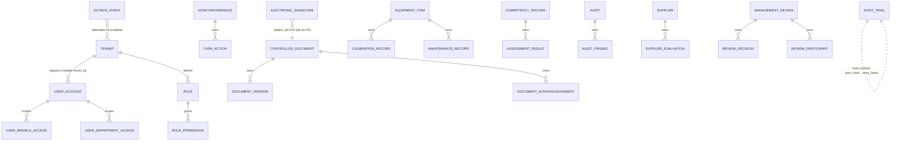

# NT.QAMS — AS-BUILT Review · Document 04 · Database & Persistence Deep Audit

| Field | Value |
|---|---|
| Series / contract | AS-BUILT Review per [`00_REVIEW_MANIFEST.md`](00_REVIEW_MANIFEST.md) (v1.1) |
| Owner prompt | 04 — Database & Persistence Deep Audit |
| Commit reviewed | `d74d4bff733d49361a1b4da1e1b3ef3e8338af06` (`master`) — **identical to the manifest baseline; no drift** |
| Review date | 2026-08-02 |
| Method | **Static reconstruction from source only — no live database connection.** Three parallel evidence agents over `src/NT.QAMS.Infrastructure/Persistence/Migrations/**` (59 migrations + `AppDbContextModelSnapshot.cs`, 7,522 lines), `Configurations/**`, `deploy/*.sql`, and `SCHEMA-HARDENING-REPORT.md`; deploy SQL read directly |

**Evidence-class legend (manifest §5):** `Implemented` · `Documentation-only` · `Missing` · `Unknown`. **Confidence:** High = ≥2 independent artifacts (e.g. migration + snapshot, or code + report). **Static-review cap:** per the manifest, RLS enforcement, trigger behavior, and row counts are **Medium** at most — the DDL is reconstructed from migrations and corroborated by the hardening report's catalog introspection, but no live `pg_catalog` read was performed here. Figures the report measured from the live catalog are labelled as such.

> **Never claim a table exists because a UI screen or doc mentions it** — every table below is evidenced by a `ToTable(...)` in the model snapshot and a `CreateTable` migration.

---

## 1. Schema reconstruction & table inventory

**99 physical tables across 4 PostgreSQL schemas**, created by 59 migrations (99 `CreateTable`, 0 `DropTable`; the 2 extra `ToTable` calls are owned-type table-splits, not tables). Confirmed against Doc 01's independently-verified count.

| Schema | Tables | Role | RLS posture |
|---|---|---|---|
| `qams` | **92** (60 top-level roots + 32 owned children) | tenant business data | FORCE RLS on all tenant-scoped tables (2 exceptions, §3) |
| `audit` | **4** (`audit_trail`, `field_change`, `security_event`, `electronic_signature`) | Part 11 append-only ledgers | FORCE RLS on all 4 (with null-tolerant write policy) |
| `saas` | **2** (`tenant`, `password_history`) | control plane / tenant registry | **no RLS by design** (control-plane schema) |
| `read` | **1** (`kpi_snapshot`) | reporting read-model | tenant-scoped |

**Structural breakdown:** 67 top-level tables (55 business aggregate roots + 1 read-model + 11 infrastructure), 32 owned child tables (all in `qams`), of which **4 are junction tables** (`role_permission`, `user_branch_access`, `user_department_access`, `review_participant`); the other 28 children are true owned detail rows (`document_version`, `capa_action`, `calibration_record`, and the measurement/reading tables under each analytical study).

**Table-split duplicates (correctly not counted as tables):** `lov_entry` (snapshot `:4627` + `:7240` owned translations) and `saas.tenant` (`:5786` + `:7509` owned `TenantSettings`).

Three modules were traced hop-by-hop in Doc 01 (Nonconformance, ControlledDocument, QualityHealthProfile) — each shows domain aggregate → EF configuration → `CreateTable` migration with RLS declared. **Fully Implemented / High.**

### 1.1 Entity-relationship overview (from migrations/entities only)


*All cross-aggregate relationships shown are enforced by **tenant-composite FKs** `(fk, tenant_id)→(id, tenant_id)` (§3.2). Dotted links are logical references stored as bare Guids with no FK (§7.3).*

## 2. Tenancy key model

| Aspect | As-built | Evidence |
|---|---|---|
| Tenant-first composite PKs `(tenant_id, id)` | **91** at v1.52.0 (88 measured at v1.51.2 by `Hardening5_CompositeKeys` + 3 new v1.52.0 tables) | `SCHEMA-HARDENING-REPORT.md:57`; `CLAUDE.md §3` |
| Single-column PKs (nullable-tenant tables) | **4**: `user_account`, `outbox_event`, `audit.security_event`, `audit.field_change` — "a key column cannot be null" | `CLAUDE.md §5` |
| Partition-readiness | tenant-first PKs + **no `UNIQUE(id)`** anywhere (illegal on a partitioned table) | `CLAUDE.md §5` |
| UUIDv7 keys | `Guid.CreateVersion7()` app-side; EF `ValueGeneratedNever` forced convention-wide | `SharedKernel/Primitives/Entity.cs:16`; `AppDbContext.cs:163-165` |

**Tenant GUC mechanism (fail-closed) — High.** `TenantConnectionInterceptor` stamps two GUCs on **every** physical connection open (so a pooled connection can never carry a prior request's tenant): `SELECT set_config('app.current_tenant', @tenant, false), set_config('app.bypass_rls', @bypass, false)` (`TenantConnectionInterceptor.cs:53-54`). With no resolved tenant, `@tenant` is the nil UUID `Guid.Empty` (`:21,55`) which matches no row — fail-closed. `@bypass='on'` only under `ICurrentTenantSetter.Elevate()` for provisioning/outbox/sweeps. Values are bound as parameters, never interpolated.

## 3. RLS coverage matrix

### 3.1 Canonical policy & totals

Every tenant-scoped table carries a `tenant_isolation` policy with FORCE RLS. The enforcing predicate (`ActivateForcedTenantRls.cs:34-44`):

```sql
CREATE POLICY tenant_isolation ON <schema>.<table>
USING      (tenant_id = NULLIF(current_setting('app.current_tenant', true),'')::uuid
            OR current_setting('app.bypass_rls', true) = 'on')
WITH CHECK (tenant_id = NULLIF(current_setting('app.current_tenant', true),'')::uuid
            OR current_setting('app.bypass_rls', true) = 'on');
-- + ENABLE ROW LEVEL SECURITY; ALTER TABLE ... FORCE ROW LEVEL SECURITY;
```

The `NULLIF(...,'')::uuid` wrapper is the fail-closed core: an unset GUC → SQL NULL → `tenant_id = NULL` is never true → zero rows.

| Metric | Value | Source (measurement) |
|---|---|---|
| FORCE-RLS tables (reviewed commit, v1.52.0) | **93** | `CLAUDE.md §3` |
| FORCE-RLS tables / policies (v1.51.2 catalog read) | 90 / 90 | `SCHEMA-HARDENING-REPORT.md:55` (live introspection) |
| RLS-parity violations among NOT-NULL-tenant tables | **0** | `SCHEMA-HARDENING-REPORT.md:56` |
| Tenant-carrying tables with **NO** RLS | **2** (`user_account`, `outbox_event`) | `SCHEMA-HARDENING-REPORT.md §8` (deviation B9) |

### 3.2 Composite tenant FKs

Confirmed in use: `FOREIGN KEY (fk, tenant_id) REFERENCES parent (id, tenant_id)`, backed by one `UNIQUE(id, tenant_id)` per parent — makes a child under another tenant's parent **structurally impossible**. Example (`Hardening4_ChildTenancy.cs:352-354`): `assessment_result(competency_id, tenant_id) → competency_record(id, tenant_id) ON DELETE CASCADE`. Report counts **36 FKs total**: 29 tenant-composite, 5 to `saas.tenant`, 2 to `user_account` (`SCHEMA-HARDENING-REPORT.md:58`).

**`Hardening6_DeferrableTenantFks`** re-created the 5 FKs to `saas.tenant` as `ON DELETE RESTRICT DEFERRABLE INITIALLY DEFERRED` — because tenant provisioning writes tenant+admin+outbox in one `SaveChanges` and PostgreSQL had rejected the outbox row (23503) on intra-transaction ordering. Deferring to COMMIT keeps the guarantee while making ordering irrelevant.

### 3.3 The audit-schema exceptions (both closed)

- **`audit.field_change`** — RLS from birth (`FieldChangeLedger.cs:50-52`), swept into FORCE by `ActivateForcedTenantRls`, write-check relaxed to allow `tenant_id IS NULL` by `RelaxAuditRlsWriteCheck` (for pre-auth events).
- **`audit.security_event`** — was the *known gap* (append-only trigger but no RLS, so the policy-driven activation skipped it). **Closed by `Hardening2_RlsGapClosure.cs:18-27`** (ENABLE + FORCE + `FOR ALL` policy with a `WITH CHECK` permitting `tenant_id IS NULL` for pre-auth failed-login events). The same migration closed a second discovered violation, `qams.ref_counter`.

The audit ledgers use a null-tolerant write policy (`tenant_id IS NULL OR tenant_id = current_setting(...) OR bypass`) so platform/pre-auth null-tenant rows can be inserted but stay invisible to ordinary tenant reads.

### 3.4 Accepted permanent deviations (from the hardening report)

| ID | Scope | Rationale | Compensating control |
|---|---|---|---|
| **B9** (accepted 2026-08-01) | No RLS on `qams.user_account` & `qams.outbox_event` | Both `tenant_id` columns are **nullable by design**; the predicate is false for NULL, so RLS would hide platform admins / break pre-tenant auth and stop the cross-tenant outbox processor | All 27 `user_account` access sites verified to be tenant-predicated / JWT-actor-keyed / tenant-derived-id-set; enforced at build time by **`UserAccountTenantBoundTests`** (9 mutation-tested cases). Report calls the residual "discipline, not structure" (`SCHEMA-HARDENING-REPORT.md:192-197`) |
| **B10** (dispositioned 2026-08-01) | 32 historical nil-tenant rows in `audit.audit_trail` (RP-D1 residue) | The ledger is append-only + hash-chained; rewriting a `tenant_id` would break the chain — the exact tamper an auditor looks for | Rows remain readable under elevation; post-v1.51.1 events stamped correctly; window closed, cannot recur (`SCHEMA-HARDENING-REPORT.md §9`) |

A related field_change NULL-tenant defect (21,209 rows) is recorded separately in report §10 and **fixed forward** in `Hardening6` (interceptor now resolves tenant via `ITenantScoped`→shadow→`IOptionallyTenantScoped`→request); historical rows kept on the same append-only reasoning.

**RLS status: Fully Implemented / High** for the mechanism and coverage as declared; the two exceptions are formally accepted with a build-time compensating gate. *Runtime enforcement itself is Medium here (static review) — it is exercised by the CI RLS integration suite (Doc 01/Doc 09), not by this document.*

## 4. EF ↔ RLS parity

Every `ITenantScoped` entity carries **both** the EF global query filter (`AppDbContext.cs:150-183` convention loop, `tenant_id == _currentTenant` + branch/dept scope) **and** a PostgreSQL FORCE RLS policy. The two-layer design is deliberate: the query filter shapes ordinary reads/writes; RLS is the backstop that also binds raw SQL and the RI checker. The only tenant-carrying tables without the RLS half are the two B9 exceptions, compensated by the architecture test. **Fully Implemented / High.**

## 5. Constraints

### 5.1 CHECK constraints — 87 (matches `CLAUDE.md §3`)

All are raw-SQL (`migrationBuilder.Sql`), none EF `AddCheckConstraint`. (A naive grep of `CHECK (` returns 127 — the extra 40 are RLS policy `WITH CHECK` clauses, not table constraints.)

| Migration | Count | Composition |
|---|---|---|
| `Phase5CheckConstraints` (`20260728073229`) | 14 | 10 range + 1 enum-domain + 3 date-ordering |
| `Hardening3_CheckDomains` (`20260731191212`) | 71 | 66 enum-domain + 5 hash-format regex |
| `QualityHealthProfile` (`20260801131521`) | 2 | 1 enum-domain + 1 range |

- **Enum-domain (68):** `value IN (...)` mirroring a C# enum. **Three spot-checks confirmed exact matches** to their domain enums: `user_account.role` (6/6 `UserRole`), `sigma_assessment.grade` (5/5 `SigmaGrade`), `nonconformance.status` (9/9 `NcStatus`, in order).
- **Range (11):** severity/likelihood/impact `BETWEEN 1 AND 5`, rpn `BETWEEN 1 AND 25`, interval `> 0`, weight `0..100`, etc.
- **Hash-format regex (5):** SHA-256 `^[0-9a-f]{64}$` on `audit_trail.prev_hash/entry_hash`, `electronic_signature.content_hash`, `file_reference.sha256`; and deliberately **uppercase** `^[0-9A-F]{64}$` on `refresh_session.token_hash` (documented divergence).
- **Date-ordering (3):** completion/sign-off `>= created_at_utc`.
- **Deliberately unconstrained open sets (documented):** `security_event.event_type`, `audit_trail.event_type`, `outbox_event.event_type`, `work_task.assignee_role`.

### 5.2 Indexes

148 indexes (**~55 unique `ux_` / ~93 non-unique `ix_`**). 13 index names are pinned via `HasDatabaseName()` using the abbreviation map (`document_acknowledgement→doc_ack`, etc.) to stay under PostgreSQL's 63-byte / EF's silent 62-byte truncation. Notable functional indexes: partial `ix_outbox_event_pending` (`processed_at IS NULL AND dead_lettered_at IS NULL`) and `ix_outbox_event_dead_letter`; unique `(tenant_id, sequence)` on `audit_trail` (chain-slot integrity); `ux_idempotency_actor_key`.

## 6. Column-type discipline (High)

| Rule | As-built |
|---|---|
| UUIDv7 PK, `ValueGeneratedNever` | `uuid` columns; convention forces `ValueGenerated.Never` on every Guid PK (`AppDbContext.cs:163-165`) |
| Enums as strings | `HasConversion<string>()` × 66 across 12 config files; **0** enum stored as int; columns render `varchar(n)` with a mirroring CHECK |
| Time | all temporal cols are `DateTimeOffset` → `timestamp with time zone`; no naked `timestamp` |
| Money | `decimal` → `numeric`; no PostgreSQL `money` type |
| Free-text sizing | ≥1000-char free text is `text` with the bound in the validator; bounded codes/refs/hashes are `varchar(n)` |
| JSON | exactly **one** `jsonb` column: `supplier_evaluation.criteria` (`snapshot:5675-5677`) |

## 7. Relationship design

### 7.1 FK graph
≈ **60 FK constraints** as-built (58 recreated as composite in `Hardening5_CompositeKeys` — 56 with `ON DELETE CASCADE` — plus the junction and later FKs). Every cross-aggregate FK is tenant-composite (§3.2).

### 7.2 Cascades & self-references
**56 cascade deletes, all intra-aggregate composition** (parent aggregate → its owned children: study→readings, equipment→calibration records, competency→assessments, NC→CAPA actions, user→access-junction rows). **Assessment: not risky** — no cascade crosses an independent aggregate boundary, and the `audit.*` ledgers have **no inbound FK at all**, so no delete can reach them. **Zero self-referencing FKs** (`refresh_session.replaced_by_id` is a bare Guid, not a self-FK).

### 7.3 Orphan / bare-Guid analysis (a real integrity characteristic)
Structural parent references are FK-backed (`equipment_id`, `audit_id`, `study_id`, `nc_id`, `competency_id`, `document_id`, the `user_*_access` joins, `department.branch_id`). **Authorship and file references are intentionally NOT FK-backed:** `created_by_user_id` (on ~55 tables), `owner_id`, `raised_by`, `signer_id`, `actor_id`, and file links `file_id`/`certificate_file_id`/`snapshot_file_id` are all nullable bare Guids with **no FK to `user_account` or a file table** (there are zero FKs to `user_account` except the two access junctions; file metadata lives outside the relational store). Even `tenant_id` is not FK-constrained on most tables — isolation is by RLS, not RI.

**Implication (route to Doc 12):** referential integrity for *authorship and file linkage is application-enforced, not database-enforced* — a `created_by_user_id` or `file_id` can dangle if the referenced user/file is removed. This is a defensible append-style-audit design choice (a user deletion must never cascade-alter a historical regulated record), but it is a characteristic a DBA must know: you cannot rely on the database to guarantee that every ledger actor still exists. **Partially structural / High.**

## 8. Normalization

**Verdict: cleanly 3NF (effectively BCNF) across the operational schema.** Tenant-first surrogate PKs; non-key attributes depend on the whole key; repeating groups pushed to child tables with composite FKs; no multi-valued columns. **1NF/2NF/3NF all hold.**

Denormalization is minimal and justified — and notably **less than commonly assumed**: this audit **could not find** cached-aggregate columns (`quality_objective` stores `target_value` only, not `current_value`; `monitoring_point` has limits but no `last_reading`; no member-count caches) — progress/latest values are computed from child rows. The only denormalizations are (a) `ref_counter.last_value` (the counter's *purpose*, per `(tenant, ref_type, year)`) and (b) `supplier_evaluation.criteria` jsonb (evaluation-scoped criteria set read/written as a whole, never independently joined). Both are controlled and appropriate. **Strength, not debt.**

## 9. Reliability & compliance structures

### 9.1 Compliance (audit schema)
- **`audit_trail`** — the hash-chained event ledger: `prev_hash varchar(64)`, `entry_hash varchar(64)`, monotonic `sequence`, with a **unique `(tenant_id, sequence)`** enforcing one entry per slot. SHA-256 hex (64 chars). Only this ledger is hash-chained.
- **`electronic_signature`** — §11.50/§11.70 manifest: `signer_id`, `signer_display`, `meaning`, `subject_ref`, `content_hash`, `signed_at_utc`. (Doc 03 NB-03-02: this table is only written on document publish.)
- **`field_change`** — per-field before/after ledger (`old_value`/`new_value varchar(4000)`, actor, action); **no hash chain**.
- **Append-only enforcement (trigger `audit.reject_mutation`):** `BEFORE UPDATE OR DELETE` on all 4 ledgers `RAISE EXCEPTION 'audit ledgers are append-only'` (`ComplianceAndAuth.cs:154-165` + `FieldChangeLedger.cs:53`). *Note: blocks UPDATE/DELETE but not TRUNCATE — the primary control is the runtime role's INSERT/SELECT-only grant (§10).*
- **Signed-record immutability (trigger `qams.reject_frozen_mutation`):** a generic guard that rejects UPDATE/DELETE only once the OLD row is already frozen (so the sign-off transition itself is still allowed), attached to **13 tables** — 12 analytical studies keyed on `state='SignedOff'` + `uncertainty_budget` on `status='Approved'` (`SignedRecordImmutability.cs:14-64`). Corroborated by `SignedRecordImmutabilityTests` against real PostgreSQL.

### 9.2 Reliability
- **`outbox_event`** — `attempts`, `next_attempt_at_utc`, `claimed_until_utc` (SKIP-LOCKED lease), `dead_lettered_at_utc`, `last_error`, `trace_parent` (W3C). No `status` column — state is derived via the two partial indexes (`Phase1OutboxResilienceAndConcurrency` + `Phase2OutboxTraceParent`).
- **`idempotency_record`** — `(actor_id, idempotency_key, request_type)` unique + `response_json` cache (`Phase4IdempotencyRecords`).
- **`refresh_session`** — `family_id` (reuse-detection revocation), `token_hash varchar(64)` (hash only), `expires_at_utc`, `revoked_at_utc`, `replaced_by_id` (`Phase7RefreshSessions`).
- **Optimistic concurrency** — PostgreSQL system `xmin` mapped as a shadow concurrency token on **57 aggregate roots** (`Property<uint>("xmin").HasColumnType("xid").IsConcurrencyToken()`, `AppDbContext.cs:113-133`; no DDL emitted). A lost update → `DbUpdateConcurrencyException` → HTTP 409 `CONCURRENCY-409`.

## 10. Roles, privileges & migration hygiene

**Two-role model (least privilege):**
- `qams_owner` — owns DB/schema, runs migrations (DDL) **only**; the app must never connect as it (a table owner can drop RLS policies and immutability triggers).
- `qams_app` — `NOSUPERUSER NOBYPASSRLS NOCREATEDB NOCREATEROLE`; runtime DML only. Grants (`harden-runtime-role.sql`): `USAGE` on schemas (no CREATE); `SELECT/INSERT/UPDATE` on business schemas but **never DELETE** except three transport/session tables (`outbox_event`, `idempotency_record`, `refresh_session`); `SELECT/INSERT` only on `audit` (append-only at the grant level too); `ref` read-only.
- **Boot guard `DatabaseRoleGuard`** — in **Production** refuses to start if `current_user` is `rolsuper`, has `rolbypassrls`, or owns any application table (`Program.cs:208-211`); in non-Production it only warns (dev runs as owner). *So the over-privileged-role refusal is Production-only by design — a caveat for DOC-001 qualified-environment validation.*

**Migration hygiene (High):** the `SELECT set_config('app.bypass_rls','on',true)` bypass pattern is present in FORCE-RLS-touching migrations' `Up()`/`Down()` (per CLAUDE.md §5 law); `Hardening6` documents the exact trap it prevents (a data-backfill silently updating zero rows / an FK add failing the RI check under FORCE RLS). 99 `CreateTable`, 0 `DropTable`; no destructive column drops without a paired validator/migration; **no EF `HasData`** — all reference data is seeded imperatively and idempotently at startup (§11).

## 11. Seed data

**Zero EF `HasData`.** All reference/config data is seeded imperatively, idempotently, and additively at startup or provisioning — never as migration inserts and never operational/regulated records:
- `StartupSeeding` — platform admin from `PlatformAdmin:Email/Password` config (skips if empty), starter LOV catalogue (RLS-elevated), system-role backfill; deferred/retried via `DeferredStartupSeeder` if the DB is unavailable.
- `SystemRoleCatalog` — 5 starter roles per tenant (Tenant Administrator, Quality Manager, Department Head, Analyst, External Auditor) as permission-key sets; `SeedMissingAsync` never restores admin-removed privileges.
- `DefaultLovCatalog` / `ProvisionTenant` — same reference data laid down at tenant creation.

## 12. Reconciliation & discrepancies

| Claim (source) | This audit | Verdict |
|---|---|---|
| `CLAUDE.md §3`: 91 composite PKs / 93 FORCE-RLS / 87 CHECK / 59 migrations / 2 deviations (B9,B10) | 91 / 93 / 87 / 59 / B9+B10 all confirmed from source | ✅ Consistent |
| `SCHEMA-HARDENING-REPORT.md`: 88 PK / 90 RLS at v1.51.2 | Consistent — v1.52.0 added 3 tenant tables (each composite-PK + FORCE-RLS) | ✅ Both true at their versions |
| Doc 01 persistence sweep loosely referenced `current_value`/`last_reading` cache columns | **Not present** — schema avoids aggregate caches | ⚠ Doc 01 wording superseded here |
| `docs/reference/NT_QMS_Database_AsBuilt.md` (Documentation-only) | Not re-derived line-by-line; use as corroboration only, source is authoritative | — |

**Target-vs-as-built schema comparison** (target: 73 tables / 5 schemas per `NT_QAMS_Database_Architecture.md`) is **deferred to Document 13** per the pack sequence — as-built is 99 tables / 4 schemas, a material delta to analyze there (the target's 5th schema and its 73-table figure predate the analytical-quality build-out).

---

## Appendix A — Manifest / prior-doc observation updates

| ID | Update |
|---|---|
| OBS-02 (migration count) | Re-confirmed 59 (a fourth independent check). |
| Doc 01 persistence note | **Corrected:** no `current_value`/`last_reading` cache columns exist; schema is aggregate-cache-free. |
| **NB-04-01** | Authorship/file references (`created_by_user_id`, `file_id`, `signer_id`, actor ids) are bare Guids with **no FK** — RI for authorship/files is application-enforced, not DB-enforced. Route to Doc 12. |
| **NB-04-02** | Append-only trigger blocks UPDATE/DELETE but **not TRUNCATE**; the compensating control is the runtime role's grant (no TRUNCATE/DELETE). Note for Docs 08/12. |
| **NB-04-03** | `DatabaseRoleGuard` over-privileged-role refusal is **Production-only**; dev/qualified environments running as owner bypass it — relevant to DOC-001. Route to Docs 08/12. |
| NB (target delta) | As-built 99 tables / 4 schemas vs target 73 / 5 — full analysis in Doc 13. |

## Appendix B — Reviewer no-modification attestation (manifest §8 model)

- [x] No file was created, modified, or deleted; **no database connection was opened**; nothing was built or run.
- [x] Only read-only access (file reads, `grep`, read-only `git`) was used, including by the three evidence agents.
- [x] The only filesystem write is this document: `docs/as-built-review/04_DATABASE_AS_BUILT_DEEP_AUDIT.md`.
- [x] No secret values reproduced: the `deploy/db-init.sql` password literals are `CHANGE_ME_*` placeholders and the `harden-runtime-role.sql` passwords are psql `:variable` parameters — none quoted; all `*_hash`/`*_secret` columns are described by name only.
- [x] Nothing invented: every table, constraint, and trigger carries a migration/snapshot citation; RLS/trigger runtime behavior is confidence-capped at Medium (static review) and cross-referenced to the CI integration suite rather than asserted as executed.

---

*End of Document 04. Reviewed at manifest baseline `d74d4bf` (no drift). Next: Prompt 05 → `05_FRONTEND_AS_BUILT_DEEP_AUDIT.md`.*
