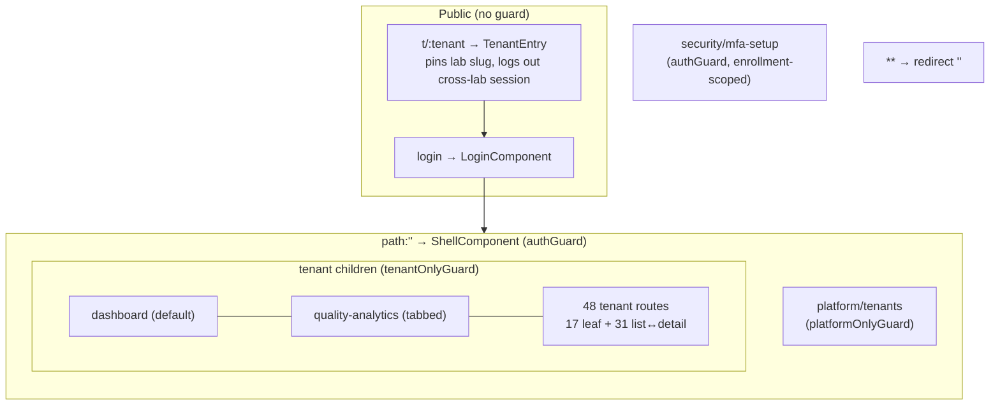
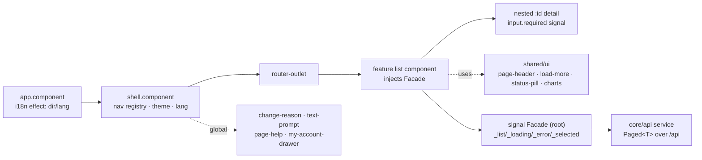

# NT.QAMS — AS-BUILT Review · Document 05 · Frontend As-Built Deep Audit

| Field | Value |
|---|---|
| Series / contract | AS-BUILT Review per [`00_REVIEW_MANIFEST.md`](00_REVIEW_MANIFEST.md) (v1.1) |
| Owner prompt | 05 — Frontend As-Built Inventory & Modernization Baseline |
| Commit reviewed | `d74d4bff733d49361a1b4da1e1b3ef3e8338af06` (`master`) — **identical to the manifest baseline; no drift** |
| Review date | 2026-08-02 |
| Method | Static source inspection only; three parallel evidence agents over `frontend/src/**`; cross-referenced to Doc 03 (parity) |

**Evidence-class legend (manifest §5):** `Implemented` · `UI-only` · `Documentation-only` · `Mocked` · `Missing` · `Unknown`. **Status vocabulary:** Fully Implemented / Partially Implemented / Prototype Only / Missing. **Confidence:** High = ≥2 artifacts; Medium = single/inference; Low = doc/UI only. *Prompt 05 note: this document describes the current UI exactly and does not propose visual/UX redesign; §11 flags preserve-vs-refactor as structural observations only.*

---

## 1. Angular / runtime / library inventory & build budgets

| Item | Value | Evidence |
|---|---|---|
| Framework | Angular **^22.0.8** (standalone + signals) | `frontend/package.json` |
| Language | TypeScript ~6.0.3, `strict:true` + `strictTemplates`/`strictInjectionParameters`/`strictInputAccessModifiers` | `tsconfig.json` |
| Runtime deps | rxjs ~7.8, zone.js ~0.15, tslib — **no UI kit, no state library, no chart library, no i18n package** | `frontend/package.json` |
| Change detection | zone-based with `provideZoneChangeDetection({eventCoalescing:true})` — **not zoneless**; **103/107 components `OnPush`** | `app.config.ts:11`; grep |
| Build budgets | initial 1 MB warn / **2 MB error**; per-component style 8 KB / 16 KB | `angular.json:32-42` |
| Router | `provideRouter(routes, withComponentInputBinding())`; **HTML5 path routing** (`<base href="/">`, no hash strategy) | `app.config.ts:14`; `index.html:6` |
| HTTP | `provideHttpClient(withXhr(), withInterceptors([authInterceptor, changeReasonInterceptor]))` | `app.config.ts:15` |
| Bootstrap | `APP_INITIALIZER` → `auth.hydrate()` (one silent refresh) | `app.config.ts:19-24` |
| `any` in production | **0 real usages** (2 false positives = `overflow-wrap:anywhere`) | grep |
| Templates/styles | **100% inline** — `templateUrl`/`styleUrls` count = **0** across `frontend/src` | grep |

**Component census:** 107 `@Component` (19,810 LOC), ~84 feature-page components + 18 shared-ui + core/shell; 35 signal facades; 44 typed API services; 2 guards; 2 interceptors; **0 pipes, 0 directives**.

## 2. Route & navigation map

**Routing model:** dual-plane SPA. `withComponentInputBinding()` binds `:id` params straight into `input.required<string>()` signal inputs — a repo-wide grep found `ActivatedRoute` used in **only one** file (`tenant-entry.component.ts`, which runs side-effects in its constructor). List↔detail routes nest the detail as a **child of the list** (master-detail: detail renders in the list's `<router-outlet>`).

- **Front door:** `t/:tenant` pins the lab for the browser (`auth.setTenantSlug`), logs out any session from a different lab, redirects to `/login`. The tenant is defined by the URL, never typed.
- **Guards:** `authGuard` (shell), `platformOnlyGuard` (control plane), `tenantOnlyGuard` (all lab modules) — the plane split is route-enforced; deeper authz is server-side.
- **Route totals:** 2 public + 1 standalone MFA + 1 platform + **48 tenant child routes** (17 leaf + 31 list-with-`:id`-detail) + wildcard.

**Navigation (`shell.component.ts:263-366`):** a `computed<NavGroup[]>`. Platform admins get **1 group** (`platform`); tenant users get **8 groups** (overview, improvement, docs, risk, resources, people, analytical [16 items], admin). **Only 6 nav items are permission-gated in the UI** — `quality-analytics`→`reports.view`, and in admin: `notification-rules`→`notifications.manage`, `compliance`→`compliance.view`, `users`→`users.view`, `roles`→`roles.view`, `access-reviews`→`access-reviews.view`. Everything else is shown to any tenant user (the guard handles the plane; the server enforces the rest). Empty groups are dropped.

## 3. Screen / module inventory

28 feature folders; **~84 active page/list/detail/chart components**. No separate dialog/drawer components inside `features/` — shared modals (change-reason, text-prompt, page-help, my-account-drawer) live in `core/`+`shell/` and mount globally.

| Screen/Feature | Route | Backend API-backed? | Persistence | Auth/Permission UX | Status |
|---|---|---|---|---|---|
| NC/CAPA | `/nonconformances` (+`:id`) | Yes (`nc-api`) | relational | tenant plane; server-gated | Fully |
| Documents | `/documents` (+`:id`) | Yes | relational + file | server-gated; publish e-sig | Fully |
| Complaints / Feedback / Objectives | `/complaints` `/feedback` `/quality-objectives` (+`:id`) | Yes | relational | tenant plane | Fully |
| Audits / Changes / Reviews | `/audits` `/changes` `/management-reviews` (+`:id`) | Yes | relational | tenant plane | Fully |
| Risks / Conflicts / Org-context | `/risks` `/conflicts` (+`:id`), `/org-context` | Yes | relational | tenant plane | Fully |
| Equipment (**tabbed**) / Std / Monitoring / Suppliers | `/equipment` `/reference-standards` `/monitoring` `/suppliers` (+`:id`) | Yes | relational + file | tenant plane | Fully |
| Competencies / Authorizations / Training | `/competencies` `/authorizations` (+`:id`), `/training` | Yes | relational | tenant plane | Fully |
| Analytical (16 registers) | `/qc` `/validation-studies` … `/pt-plans` `/proficiency-tests` (+`:id`) | Yes | relational | tenant plane | Fully |
| Dashboard / **Quality-analytics (tabbed)** | `/dashboard`, `/quality-analytics` | Yes | read-model | `reports.view` (analytics) | Fully |
| Users / Roles / Access-reviews | `/users` `/roles` `/access-reviews` | Yes | relational | `users.view`/`roles.view`/`access-reviews.view` | Fully |
| Compliance / Records / Reference-data / Notifications / Tasks | `/compliance` `/records` `/reference-data` `/notifications` `/notification-rules` `/tasks` | Yes | relational | mixed (compliance/notif gated) | Fully |
| Quality-policy / Security-settings / MFA-setup / Platform | `/quality-policy` `/settings/security` `/security/mfa-setup` `/platform/tenants` | Yes | relational | plane-gated | Fully |
| **Manual** | `/manual` | **No — static** (renders shared `HELP_TOPICS`) | none | tenant plane | **UI-only by design** |

**Two tabbed workspaces:** `equipment-detail` (calibration/maintenance/checks tabs, `role="tablist"`) and `quality-analytics` (`statistics`/`review` tabs — one fetch serving both a Quality Statistics dashboard and the ISO 17025 §8.9.2 Management Review pack).

**UI-only vs API-backed verdict:** **27 of 28 features are fully API-backed** with complete vertical slices (Doc 03 confirmed zero orphans except the one backend route `PUT /api/qc/profiles/{id}/targets` which has no UI). The 28th, `manual`, is an intentionally static searchable user manual — **not a stub**. No feature serves mocked or client-only business data (Doc 01 §3). **High.**

## 4. Component inventory (complexity)

| Component | ~LOC | Responsibility | Reuse | Refactor risk |
|---|---|---|---|---|
| `dashboard/quality-analytics.component.ts` | 657 | Statistics dashboard + §8.9.2 review pack from one fetch; branch/dept filter; weighted health-score editor | Low (page) | **High** |
| `login/login.component.ts` | 488 | Login + MFA + PIN + self-service password change (multi-step) | Low | High |
| `reference/reference-data.component.ts` | 437 | Master-data CRUD across lookup lists | Low | Med |
| `shell/shell.component.ts` | 424 | App chrome: nav registry, tenant/theme/lang, collapse state | Low (singleton) | High |
| `compliance/compliance.component.ts` | 375 | Compliance status roll-up | Low | Med |
| `organization/org-context.component.ts` | 364 | Branch/department context management | Low | Med |
| `roles/roles.component.ts` | 356 | Dynamic role/permission editor (**facade-less**) | Low | High |
| `documents/document-detail.component.ts` | 350 | Document lifecycle (versions/approvals/ack) | Low | Med |

The analytical module dominates as an *area* (16 of 35 facades) but no single analytical component tops the list (largest is `method-comparison-detail` at 289). **103/107 components are `OnPush`**; the 4 exceptions are bootstrap/shell-level (`shell.component.ts:139` deliberately eager for always-mutating chrome). Refactor risk is driven by size (inline 400-650-line template+logic+styles in one file), not by architectural violation — all are standalone, signal-based, and route through facades except the two noted skippers.

## 5. Service / facade inventory & state management

**35 signal facades, uniform pattern (High):** `@Injectable({providedIn:'root'})` root singletons holding **private writable signals** (`_list`, `_total`, `_hasMore`, `_selected`, `_loading`, `_error`) exposed as `.asReadonly()`, with `computed` derivations for UI (`openCount`, `filtered`). They inject the `core/api` service and await Observables via `firstValueFrom`; a shared `run()` wraps loading/error and `mutate()` re-fetches after a write. Error text is derived by a shared `describe()` that unwraps `HttpErrorResponse.error.title` (ProblemDetails). Load-more paging lives in the facade.

**Two documented facade-skippers** (Doc 03 NB): `roles.component.ts:171` and `platform/tenants.component.ts:106` inject their API service directly and hold component-local state — cosmetic inconsistency, not a defect.

**No third-party state library** — signals + root-singleton facades are the entire state layer. `core/models.ts` (2,237 lines) is the single shared DTO/type contract mirroring backend `Contracts`, including the `Paged<T>` envelope and `CreatedResource`.

## 6. Browser storage inventory

| Storage key | Owner | Data | Sync behavior | Risk |
|---|---|---|---|---|
| `qams.tenant.slug` | `auth.service.ts:15` | last-used lab slug for the login URL | written on tenant entry | **None** — UX convenience, explicitly "not a credential" |
| `qams.login.theme` | `login.component.ts:11` | login page dark/light | toggled on login screen | None |
| `qams.sidebar.collapsed` | `shell.component.ts:30` | nav collapse state | shell interaction | None |
| `qams.sidebar.groups` | `shell.component.ts:31` | open nav groups | shell interaction | None |
| `qams.lang` | `i18n.service.ts:14` | EN/AR/FR selection | language switch | None |

**No business record is persisted client-side; no token/PIN/password in web storage** (`localStorage.setItem` matching token/secret/password/pin/jwt = **0 hits**). The access token lives in a memory signal (ADR-0009); the refresh token is an httpOnly `Secure SameSite=Strict` cookie invisible to JS. No `sessionStorage`/`IndexedDB`/service-worker usage. **Fully Implemented / High.**

## 7. HTTP / API inventory

- **44 typed `core/api/` clients**, one per backend resource, base `` `${environment.apiBaseUrl}/<resource>` `` (`/api`, same-origin behind the proxy). One method per endpoint, no client business logic; list methods return the `Paged<T>` envelope (`items/total/page/pageSize/hasMore`, `models.ts:394`; default page size 50).
- **`auth.interceptor.ts`** — attaches the in-memory bearer; on a 401 that is not an auth endpoint, performs **one single-flight silent `auth.refresh()`** and retries, routing to `/login` only if refresh yields no token. Routine 15-min expiry never bounces the user (ADR-0009).
- **`change-reason.interceptor.ts`** — on a `DELETE` lacking `X-Change-Reason`, opens the accessible reason modal (`ChangeReasonService.request()`); on submit it adds the header, **on cancel it returns `EMPTY` so nothing is sent** (Part 11 §11.10(e)/ALCOA+). It genuinely prompts before the DELETE proceeds.
- **No global error/retry interceptor** — error normalization is per-facade; there is no retry/backoff or toast interceptor. (Note for Doc 10/12: transient network failures surface directly to the facade with no automatic retry.)
- **`permissions.service.ts`** — `can(key)` = `isPlatformAdmin() || granted().has(key)` over a `computed` Set fetched from `GET /api/auth/me/privileges` after sign-in; returns false until privileges land ("affordance, never a security boundary"). Platform admins short-circuit (tier from session, so guards resolve synchronously at bootstrap).

**Direct HTTP outside `core/api`:** exactly two files (`auth.service.ts` → Auth+TenantSettings; `permissions.service.ts` → `/auth/me/privileges`, `/auth/me/language`) — no facade or component issues raw HTTP (Doc 03 NB-03-02, re-confirmed).

## 8. i18n / RTL / theme / accessibility

- **i18n (High):** `type Lang = 'en'|'ar'|'fr'`; `Dict = Record<string,{en;ar;fr}>` **structurally requires all three languages per entry**, so strict TS makes a missing translation a compile error — a spot-audit found **zero** empty language values. ~**1,571 keys** covering every module + the `perm.*` catalogue. `t(key)` is a direct lookup that **returns the raw key on a miss with no warning and no per-key fallback language** — so the practical risk is a mistyped `t('...')` call site rendering a dotted id, not a partial dictionary (**NB-05-01**, Low). `restore()` defaults to `en` from `qams.lang`.
- **RTL (High):** an `effect` in `app.component.ts:18-19` sets `document.documentElement.dir = isRtl() ? 'rtl' : 'ltr'` (`isRtl = lang()==='ar'`); CSS reacts via `[dir="rtl"]` (Cairo font, direction flip) and per-component `:host-context([dir="rtl"])` (drawer slide direction, select caret).
- **Theme (Medium):** design tokens as `:root` CSS custom properties (`styles.css:9-78`) with an explicit **fill-vs-ink rule** — saturated tone tokens are fills that fail WCAG as a set, and a parallel **ink ramp** (`--nt-ink-*`, ≥4.5:1) carries any tone-coloured text/meter. **There is no app-wide dark theme** — dark mode exists **only on the login surface** via a local `[class.dark]` binding keyed on `qams.login.theme`; the authenticated shell has no theme switch (**NB-05-02**).
- **Accessibility (Medium):** `a11y.spec.ts` runs axe-core on **only two routes — `/login` and `/t/demo-lab`** (both unauthenticated), blocking on `serious`/`critical` (minor/moderate allowed). **No authenticated/regulated screen is axe-scanned** (~100+ components uncovered, **NB-05-03**). ARIA usage is present but light (25 aria/role occurrences in 14 shared-ui files; combobox pattern on `user-select`, tablist on equipment tabs); charts print their figures/legends so colour is never the sole cue.

## 9. Shared UI system (18 components)

`page-header`, `drawer` (RTL-aware slide-over), `load-more` (pager over the envelope), `status-pill`, `list-stats` (proportion tiles, ink ramp), `workflow-stepper`, `risk-matrix` (CSS grid heat-map), `gauge` (hand-rolled SVG), `donut-chart` (hand-rolled SVG), `bar-chart` (CSS-scaled), `audit-trail` (per-record ledger, admin/auditor only), `csv-import` (backend re-validates per row), `user-select` (combobox for 100+ directories), `lov-select`, `allocation-picker` (branch→dept cascade), `export-menu` (PDF/Excel, pulls every page of the current filter), `page-help`, `help-body`. **All charts are hand-rolled** — no chart library in `package.json`; the Levey-Jennings chart is feature-scoped (`features/analytical/`), not shared.

## 10. Performance risks

| Risk | Detail | Severity |
|---|---|---|
| **No virtual scrolling** | load-more pagination appends pages into a normal `<table>`; DOM grows unbounded as a user pages a large register (no `CdkVirtualScroll` anywhere) | Medium |
| Heavy single view | `quality-analytics` renders ~40 metrics / many gauges/donuts/tables in one route (aggregation is server-side, so mostly render cost) | Medium |
| Zone-based | still `provideZoneChangeDetection` (event-coalesced), not zoneless, despite near-universal OnPush + signals | Low |
| Bundle budget | 2 MB initial error ceiling; no lazy-loading gaps found (all features `loadComponent`-lazy) | Low |

No client-side N+1 fetch pattern; list filtering is server-side (paged envelope); chart geometry is `computed()` math, not main-thread-heavy. **Overall: healthy for the volumes a lab QMS sees; the large-register table without windowing is the one item to watch at scale.**

## 11. Preserve-as-is vs refactor (structural observation only — no redesign proposed)

- **Preserve:** the standalone/signal/OnPush architecture, the uniform facade pattern, the trilingual dictionary + RTL, the hand-rolled accessible chart set, the design-token + ink-ramp system, and the memory-only-token auth model are all sound and consistent — a modernization baseline, not debt.
- **Structural refactor candidates (size/consistency, not correctness):** the 4 largest single-file components (400-657 LOC inline template+logic+styles) would benefit from decomposition; the two facade-skippers (`roles`, `platform`) break the otherwise-uniform component→facade→service shape; a per-key i18n fallback and a global error/retry interceptor are the two missing cross-cutting affordances.

## 12. Test coverage (frontend)

**17 unit specs vs 107 components / 35 facades:** 3 facade specs (`change`, `complaints`, `quality-analytics`), 7 component specs (5 shared-ui + 2 core dialogs — **0 of ~84 feature pages**), 4 service specs (`auth`, `i18n`, `permissions`, one api), 2 interceptor specs, 1 help-parity. Coverage concentrates on cross-cutting infra; feature pages and 32/35 facades are covered only indirectly via e2e. **3 e2e specs:** `auth` + `a11y` (backend-free, **run in CI**), `regulated-workflow` (full-stack NC journey, **needs API + seed, not in CI**). Aggregate QA verdict is Document 09's; here the fact is **thin UI unit coverage of the layer users actually sign records through**. **Partially Implemented / High.**

---

## Appendix A — Observation updates

| ID | Update |
|---|---|
| OBS-04 (Angular-18 metadata) | Re-confirmed at source (`package.json` description vs `^22.0.8` deps); functional stack is Angular 22. |
| Doc 03 NB-03-01 (orphan route) | Re-confirmed from the UI side: no `UpdateQcTargetsRequest` TS model, no caller — `PUT /api/qc/profiles/{id}/targets` is genuinely UI-less. |
| **NB-05-01** | `t()` returns the raw key with no warning/fallback on a miss — mistyped call sites render dotted ids. Route to Doc 12 (Low). |
| **NB-05-02** | Dark theme exists only on the login surface; no app-wide theme switch. Route to Doc 08/14 (informational). |
| **NB-05-03** | axe a11y coverage is login-only; ~100+ authenticated screens are un-scanned. Route to Docs 09/12. |
| **NB-05-04** | No global error/retry interceptor — transient failures surface with no automatic retry. Route to Docs 10/12. |

## Appendix B — Reviewer no-modification attestation (manifest §8 model)

- [x] No file under `frontend/` (or anywhere) was created, modified, or deleted; nothing was built, served, or run.
- [x] Only read-only access (file reads, grep, read-only git) was used, including by the three evidence agents.
- [x] The only filesystem write is this document: `docs/as-built-review/05_FRONTEND_AS_BUILT_DEEP_AUDIT.md`.
- [x] No secret values reproduced; the five localStorage keys are described by name and confirmed non-secret; no token/PIN/password is quoted.
- [x] Nothing invented; every material claim carries a `file:line` citation or cross-references adversarially-verified Doc 03 evidence. No UX/visual redesign was proposed.

---

*End of Document 05. Reviewed at manifest baseline `d74d4bf` (no drift). Next: Prompt 06 → `06_BUSINESS_MODULE_COVERAGE.md`.*
