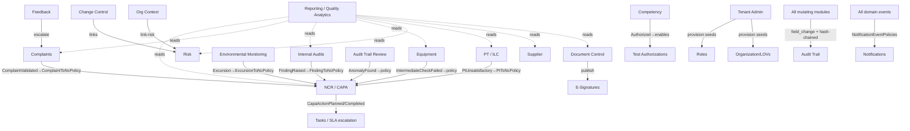

# NT.QAMS — AS-BUILT Review · Document 06 · Business Module Coverage

| Field | Value |
|---|---|
| Series / contract | AS-BUILT Review per [`00_REVIEW_MANIFEST.md`](00_REVIEW_MANIFEST.md) (v1.1) |
| Owner prompt | 06 — Business Module Coverage Inventory |
| Commit reviewed | `d74d4bff733d49361a1b4da1e1b3ef3e8338af06` (`master`) — **identical to the manifest baseline; no drift** |
| Review date | 2026-08-02 |
| Method | Synthesis of adversarially-verified evidence from Documents 03 (API/authz/signature/tests), 04 (schema/RLS), 05 (UI/facades); domain-event distribution confirmed by grep |

**Evidence-class legend (manifest §5):** `Implemented` · `UI-only` · `Documentation-only` · `Mocked` · `Missing`. **Status vocabulary:** Fully Implemented / Partially Implemented / Prototype Only / Missing. **Confidence:** High = ≥2 artifacts; the layer facts below are each carried from a prior document whose citations were verified there.

**Matrix cell key:** ✓ = present · ~ = present with a documented gap · ✗ = absent · n/a = not applicable to this module. "AuthZ" = server-enforced endpoint/command gate quality. "Audit/Sig" = audit-trail coverage / e-signature manifestation.

---

## 1. Coverage matrix

Every mutating write across every module writes an `audit.field_change` row + hash-chained `audit.audit_trail` entry (Doc 04 §9), so the **Audit** half of the last column is ✓ system-wide; the **Signature** half is ✗ except where a real `signature_record` is minted. All tenant tables carry FORCE RLS (Doc 04 §3), so **Relational DB** is ✓ with tenant isolation throughout.

| # | Module | UI | FE logic | API | Rel. DB | Blob/Local | Workflow | AuthZ | Audit/Sig | Tests | Status |
|---|---|---|---|---|---|---|---|---|---|---|---|
| 1 | **Document Control** | ✓ | ✓ facade | ✓ 17 actions | ✓ `controlled_document`,`document_version` | ✓ file link | ✓ draft→review→recommend→publish→retire | ~ create/submit/versions ungated | ✓ / **✓ e-sig on publish** (only module) | domain ✓, functional partial | Fully |
| 2 | **NCR / CAPA** | ✓ | ✓ | ✓ 12 actions | ✓ `nonconformance`,`capa_action`,`rca_record` | ✗ | ✓ 9-state machine + SoD | ~ 7/10 `[RequireInternalActor]` | ✓ / **✗ no e-sig** (signed-record module) | domain ✓ (`NonconformanceTests`) | Fully |
| 3 | **Complaints** | ✓ | ✓ | ✓ 9 actions | ✓ `complaint` (+auto-NC saga) | ✗ | ✓ ISO §7.9 lifecycle | ~ confidential mask by **role literal** | ✓ / n/a | domain ✓ (`ComplaintTests`) | Fully |
| 4 | **Feedback** | ✓ | ✓ | ✓ 6 actions | ✓ `feedback_entry` (+escalate→complaint) | ✗ | ✓ logged→reviewed→closed/escalated | ~ escalate creates complaint under `feedback.edit` | ✓ / n/a | domain ✓ | Fully |
| 5 | **Internal Audits** | ✓ | ✓ | ✓ 7 actions | ✓ `audit`,`audit_checklist_item`,`audit_finding` | ✗ | ✓ schedule→findings→sign-off + finding→NC saga | ~ sign-off `Sign` at HTTP but `[RequireInternalActor]` at cmd | ✓ / **✗ sign-off mints no sig** | domain ✓ + **`FindingToNcPolicyTests`** (only saga test) | Fully |
| 6 | **Equipment** | ✓ tabbed | ✓ | ✓ 7 actions | ✓ `equipment_item` (+children) | ✓ certificate files | ✓ register→calibrate/maintain/check→retire | ~ calibration (clears lockout) ungated | ✓ / n/a | domain ✓ | Fully |
| 6a | ↳ **Calibration** | ✓ (Equipment tab) | ✓ | ✓ `/calibrations` | ✓ `calibration_record` | ✓ `certificate_file_id` | ✓ due-date arming | ~ ungated | ✓ / n/a | domain ✓ | Fully (sub-module of Equipment) |
| 6b | ↳ **Maintenance** | ✓ (Equipment tab) | ✓ | ✓ `/maintenance` | ✓ `maintenance_record` | ✓ cert file | ✓ | ~ ungated | ✓ / n/a | snapshot only | Fully (sub-module) |
| 7 | **Reference Standards** | ✓ | ✓ | ✓ 6 actions | ✓ `reference_standard` | ✗ | ✓ register→quarantine/reactivate/retire | ✓ best-gated of resources | ✓ / n/a | domain ✓ | Fully |
| 8 | **Environmental Monitoring** | ✓ | ✓ | ✓ 8 actions | ✓ `monitoring_point`,`environmental_reading` | ✗ | ✓ limits→readings→excursion→NC saga | ~ readings (auto-NC) ungated | ✓ / n/a | domain ✓ | Fully |
| 9 | **Supplier Quality** | ✓ | ✓ | ✓ 8 actions | ✓ `supplier`,`supplier_certificate`,`supplier_evaluation` (jsonb criteria) | ✓ cert files | ✓ register→approve/suspend + SoD + eval | ~ certificates ungated | ✓ / n/a | domain ✓ (`GovernanceAndSupplierTests`) | Fully |
| 10 | **Quality Control (Westgard)** | ✓ + L-J chart | ✓ | ✓ 6 actions | ✓ `qc_profile`,`qc_run` | ✗ | ✓ server-side multi-rule verdict | ~ run capture ungated; `QcOutOfControl` **no subscriber** | ✓ / n/a | **domain ✓ (`WestgardEvaluatorTests`)**; HTTP untested | Fully |
| 11 | **Method Validation (12 study types)** | ✓ 16 registers | ✓ ~18 facades | ✓ ~90 actions | ✓ 12 study tables + children | ✗ | ✓ configure→data→calculate→sign-off + SoD-AQ-001 | ~ child writes ungated; sign-off no e-sig | ✓ / **✗ sign-offs mint no sig** | domain ✓ per study; **HTTP surface untested** | Fully (compute) / ~ (authz+sig) |
| 12 | **PT / ILC** | ✓ | ✓ | ✓ PT + PtPlan | ✓ `pt_enrollment`,`pt_plan` | ✗ | ✓ enroll→result(z-score)→auto-NC; plan approve/fulfil/close | ~ **PT controller has zero `[RequirePermission]`** | ✓ / n/a | **no domain/functional test of PT result→NC** | Partially (authz + test gaps) |
| 13 | **Quality Objectives** | ✓ | ✓ | ✓ 5 actions | ✓ `quality_objective`,`objective_update` | ✗ | ✓ define→progress→close | ~ `/progress` ungated | ✓ / n/a | domain ✓ | Fully |
| 14 | **Quality Policy** | ✓ | ✓ | ✓ 5 actions | ✓ `quality_policy` (versioned) | ✗ | ✓ draft→revise→approve + SoD | ✓ gates a read | ✓ / **✗ approve no sig** (signed-record module) | domain ✓ | Fully |
| 15 | **Change Control** | ✓ | ✓ | ✓ 8 actions | ✓ `change_request` (+PIR) | ✗ | ✓ propose→risk→approve→close→review | ~ **approve has no SoD**; close ungated | ✓ / **✗ no sig** | domain ✓ | Fully |
| 16 | **Management Review** | ✓ | ✓ | ✓ 5 actions | ✓ `management_review`,`review_decision`,`review_participant` | ✗ | ✓ schedule→decisions→close | ~ minutes readable by auditor; decision no validator | ✓ / **✗ close no sig** | domain ✓ | Fully |
| 17 | **Impartiality / Conflicts** | ✓ | ✓ | ✓ 4 actions | ✓ `conflict_declaration` | ✗ | ✓ declare→assess→close + SoD | ~ **`DeclarantId` from body**; register world-readable | ✓ / n/a | domain ✓ | Fully |
| 18 | **Org Context** | ✓ | ✓ | ✓ 8 actions | ✓ `interested_party`,`context_issue` | ✗ | ✓ register→revise→archive/close | ✓ best-gated (Revise* lacks validator) | ✓ / n/a | domain ✓ | Fully |
| 19 | **Competency** | ✓ | ✓ | ✓ 5 actions | ✓ `competency_record`,`assessment_result` | ✗ | ✓ assign→assess→authorize→revoke | ✓ Approve≠Edit segregated | ✓ / n/a | domain ✓ | Fully |
| 20 | **Test Authorizations** | ✓ | ✓ | ✓ 6 actions | ✓ `test_authorization` | ✗ | ✓ grant(evidence-chain)→suspend/reinstate/revoke | ✓ **strongest evidence gate** | ✓ / n/a | domain ✓ | Fully |
| 21 | **Training** | ✓ | ✓ | ✓ 3 actions | ✓ `training_assignment` | ✗ | ~ assign→complete | ~ **complete has no ownership check** | ✓ / n/a | snapshot only | Partially (ownership gap) |
| 22 | **Archive / Records** | ✓ | ✓ | ✓ 7 actions | ✓ `archive_entry` | ✓ snapshot file | ✓ archive→retrieve/return/dispose + legal hold | ~ retrieve/return/archive ungated | ✓ / n/a | domain ✓ (`RecordsAndSlaTests`) | Fully |
| 23 | **Users** | ✓ | ✓ | ✓ 10 actions | ✓ `user_account` (**no RLS** B9) | ✗ | ✓ onboard/re-role/scope/status/creds | ✓ gated + lockout guard | ✓ / n/a; **reset-pw no security event** | functional ✓ (`RolePrivilegeFlowTests`) | Fully |
| 24 | **Roles** | ✓ (**facade-less**) | ~ direct api | ✓ 8 actions | ✓ `role`,`role_permission` | ✗ | ✓ create→set-permissions→(de)activate + lockout guard | ✓ fully gated | ✓ / n/a | ✓ (`RoleHandlersTests`,`RolePrivilegeFlowTests`) | Fully |
| 25 | **Privileges (Permission Catalogue)** | ✓ (roles matrix) | ~ | ✓ `/roles/catalog` | n/a (code constants `PermissionCatalog`) | n/a | n/a | ✓ 170-key catalogue | n/a | ✓ (`RolePrivilegeFlowTests`) | Fully (sub-module of Roles) |
| 26 | **Notifications** | ✓ | ✓ | ✓ 5 actions | ✓ `notification_rule`,`notification_dispatch` | ✗ | ✓ rule→dispatch→read | ~ **`EventKey` free-text** (typo=dead rule) | ✓* (dispatch excluded from field-change) / n/a | ✓ (`NotificationDispatcherTests`) | Fully |
| 27 | **Tasks** | ✓ | ✓ | ✓ tasks + SLA defs | ✓ `work_task`,`sla_definition` | ✗ | ✓ create→complete; SLA escalation timers | ~ **complete no ownership check**; SLA free-text join | ✓ / n/a | ✓ (`ScheduledSweepTests`) | Partially (ownership gap) |
| 28 | **Reporting** | ✓ | ✓ | ✓ 7 read endpoints | ✓ `read.kpi_snapshot` + live aggregates | ✗ | n/a (read models) | ✓ `Reports.View`/`Manage` | n/a (reads) | ✓ (`DashboardKpiTotalsTests`) | Fully |
| 29 | **Dashboard / Quality Analytics** | ✓ tabbed | ✓ | ✓ `quality-analytics` (+health-profile) | ✓ live aggregate over ~15 tables | ✗ | n/a | ✓ per-section privilege scoping | n/a / n/a | domain ✓ (`QualityHealthProfileTests`); **endpoint untested e2e** | Fully |
| 30 | **Audit Trail** | ✓ (`audit-trail` UI + review) | ✓ | ✓ compliance reads + review | ✓ `audit.audit_trail` (hash-chained) + `audit_trail_review` | ✗ | ✓ periodic review→complete→anomaly→NC | ✓ `Compliance.View`; **chain-verify returns bare-string 400** | ✓ append-only trigger + chain verify | integration ✓ (`GovernanceTests`) | Fully |
| 31 | **E-Signatures** | ✓ (publish ceremony) | ✓ | ✓ (via publish + reads) | ✓ `audit.electronic_signature` (append-only) | ✗ | ✓ password+PIN, content-hash bind, lockout | ✓ | ✓ | domain ✓ | **Partially — table + service exist but wired ONLY to document publish (NB-03-02)** |
| 32 | **Tenant Administration** | ✓ | ~ direct api | ✓ provision + settings | ✓ `saas.tenant`,`tenant_settings` | ✗ | ✓ provision (seeds roles/LOVs, RLS-elevated) | ✓ `[Authorize(Roles=PlatformAdmin)]` (legitimate) | ✓ / n/a | **most-tested endpoint** | Fully |
| 33 | **Organization (Branches/Depts/TestCatalog/LOVs)** | ✓ (reference-data) | ✓ | ✓ 8 actions | ✓ `branch`,`department`,`test_catalog_item`,`lov_entry` | ✗ | ~ create/(de)activate | ~ Dept/TestCatalog create no validator; no cascade check | ✓ / n/a | ✓ (`DefaultLovSeedingTests`) | Fully |
| 34 | **Session Security / MFA** | ✓ (mfa-setup, security-settings) | ✓ | ✓ auth surface | ✓ `refresh_session`,`user_account` | ✗ | ✓ TOTP enroll/confirm, rotation, reuse-revoke | ✓ deny-by-default; **MFA off by default** | ✓ security events | functional ✓ (`RefreshSessionTests`) | Fully (config-off risk) |

## 2. Fully implemented modules (complete across all applicable layers)

**26 of 34 rows are Fully Implemented** with UI + facade + API + relational DB + workflow + audit trail + at least domain tests, and server-side authorization present (even where coarse): Document Control, NCR/CAPA, Complaints, Feedback, Internal Audits, Equipment (+Calibration/Maintenance), Reference Standards, Environmental Monitoring, Supplier Quality, Quality Control, Quality Objectives, Quality Policy, Change Control, Management Review, Impartiality, Org Context, Competency, Test Authorizations, Archive/Records, Users, Roles, Privileges, Notifications, Reporting, Dashboard/Quality-Analytics, Audit Trail, Tenant Administration, Organization. **This is a functionally complete laboratory QMS** — every ISO 17025 / 9001 clause area named in the target scope has a working vertical slice.

## 3. Partially implemented modules (with exact missing layer)

| Module | Present | Missing / weak layer |
|---|---|---|
| **PT / ILC** (12) | full workflow, DB, UI, auto-NC saga | **AuthZ** (controller has zero `[RequirePermission]`) + **Tests** (no domain/functional test of the result→NC path — the highest-consequence AQ write) |
| **Method Validation** (11) | all statistics + workflow + DB | **AuthZ** (child writes ungated) + **Signature** (sign-off mints no `signature_record`) + **HTTP tests** (entire AQ surface has no functional test) |
| **Training** (21) | assign/complete + DB | **AuthZ** (`complete` has no ownership check — any user closes anyone's record) + **Tests** (snapshot only) + **Validation** (assign command) |
| **Tasks** (27) | queue + SLA + DB | **AuthZ** (`complete` no ownership check; moves the SLA figure) + free-text SLA join key |
| **E-Signatures** (31) | table + `ESignatureService` + ceremony | **Wiring** — manifested on document publish only; audit sign-off, NC verify/close, quality-policy/change approve, review close, and all 14 AQ sign-offs enforce SoD but write **no signature** (NB-03-02, the review's highest-value finding) |

These are **Partially Implemented because a specific layer is thin**, not because the feature is a shell — every one persists real data through a working workflow. The consistent theme is **authorization granularity and Part 11 signature manifestation**, not missing functionality.

## 4. Prototype / UI-only modules

**One, by design:** the **Manual** (`/manual`) renders the shared `HELP_TOPICS` dictionary client-side with no backend — an intentional searchable user manual, explicitly *not* a stub (Doc 05 §3). **No module serves mocked or client-only business data** anywhere in production paths (Doc 01 §3, re-confirmed). There are **no prototype/placeholder screens** — a direct contrast to the legacy system this rebuild replaced.

## 5. Missing modules (referenced by requirements/docs, absent or folded)

- **None of the prompt's minimum module list is Missing.** The three the prompt names as standalone — **Calibration, Training, Privileges** — exist as **sub-modules** of Equipment, Competency, and Roles respectively (rows 6a/6b, 21, 25), which is a structural choice, not a gap.
- **No true absence** was found at this coverage level: every enumerated QMS capability has code. Whether the as-built module set matches the *approved target architecture* (14 bounded contexts / 27 aggregates) — including any target module deliberately deferred or added-beyond-target — is the **subject of Document 13** (target conformance) and the SRS-requirement traceability of **Document 11**; this document asserts only that no listed business module is code-absent.

## 6. Cross-module dependency diagram (actual implementation, not intended design)

Derived from the outbox-driven sagas and hard references confirmed in Docs 03/04 (all cross-module effects run through the in-process outbox; the arrows are real event/policy handlers, not design intent):

**Six modules feed NCR/CAPA** via the outbox saga fabric — NCR/CAPA is the integration hub of the QMS. Audit Trail and Notifications are the universal sinks (every write / every domain event). Reporting reads across ~15 tables but writes nothing. The graph is acyclic except for the intended NC↔SLA escalation pairing.

---

## Appendix A — Observation carry-forward

| ID | Note for later documents |
|---|---|
| NB-03-02 (e-sig) | Row 31 quantifies the gap: **1 of ~20 signed-record gates** manifests a signature. Doc 08/12. |
| NB-03-04 (ungated writes) | PT/ILC and Method Validation are the module-level embodiment; PT is the sharpest (auto-NC, zero `[RequirePermission]`, no test). Doc 08/12. |
| Test coverage | Modules with **only snapshot/no tests** at the module level: Training, Maintenance, and the entire AQ HTTP surface (PT result→NC untested). Doc 09. |
| Naming | "Calibration/Training/Privileges" are sub-modules, not standalone — a target-vs-as-built mapping note for Doc 13. |

## Appendix B — Reviewer no-modification attestation (manifest §8 model)

- [x] No file was created, modified, or deleted; nothing was built, run, or connected to a database.
- [x] Only read-only access was used (this document is a synthesis of Docs 03-05 plus one read-only grep).
- [x] The only filesystem write is this document: `docs/as-built-review/06_BUSINESS_MODULE_COVERAGE.md`.
- [x] No secret values reproduced.
- [x] Nothing invented — every matrix cell traces to an adversarially-verified finding in Documents 03, 04, or 05; no UI label or SRS claim was treated as proof of implementation.

---

*End of Document 06. Reviewed at manifest baseline `d74d4bf` (no drift). Next: Prompt 07 → `07_WORKFLOWS_AND_BUSINESS_RULES.md`.*
