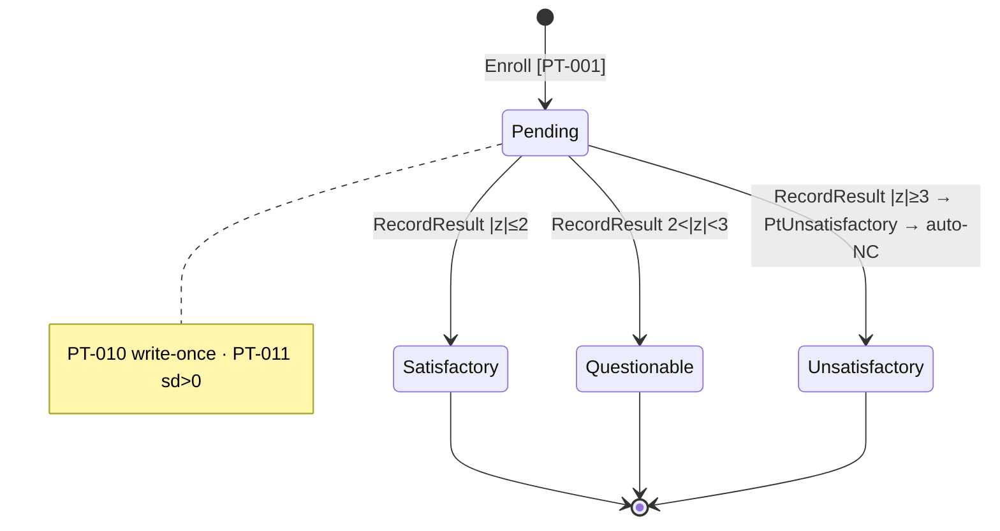
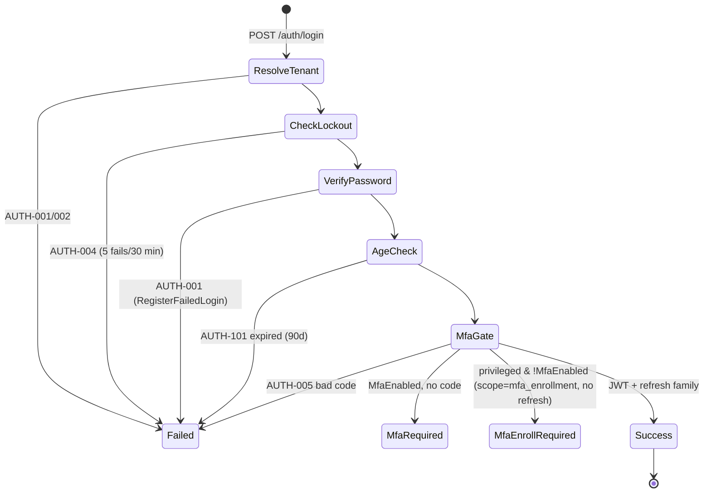

# NT.QAMS — AS-BUILT Review · Document 07 · Workflows, User Journeys & Business Rules

| Field | Value |
|---|---|
| Series / contract | AS-BUILT Review per [`00_REVIEW_MANIFEST.md`](00_REVIEW_MANIFEST.md) (v1.1) |
| Owner prompt | 07 — Workflows, User Journeys & Business Rules |
| Commit reviewed | `d74d4bff733d49361a1b4da1e1b3ef3e8338af06` (`master`) — **identical to the manifest baseline; no drift** |
| Review date | 2026-08-02 |
| Method | Static extraction from domain aggregates (`src/NT.QAMS.Domain/**`) + command handlers; four evidence agents (one re-run after a mid-stream stall); state enums and error codes read directly from source |

**Evidence-class legend (manifest §5):** `Implemented` · `Missing`. **Status vocabulary:** Fully Implemented / Partially Implemented / Prototype Only / Missing. **Confidence:** High = enum + transition + guard all cited from the aggregate. *Workflows are drawn **only where the aggregate encodes a real state machine** — not because a doc/diagram exists (per Prompt 07).* **Enforcement layer is the domain aggregate throughout** — invariants live inside the aggregate (CLAUDE.md rule 6), verified repeatedly below.

---

## 1. Workflow catalog

| Workflow | Trigger | States | AuthZ (HTTP / cmd) | Audit / Signature | Persistence | Status | Missing controls |
|---|---|---|---|---|---|---|---|
| **NCR/CAPA** | raise NC | 9: Draft→Raised→Assigned→Rca→ActionPlan→PendingVerification→EffectivenessCheck→Closed/Rejected | ~ 7/10 `[RequireInternalActor]` only | audit ✓ / **no e-sig** | `nonconformance`,`capa_action` | Fully | fine-grained gates; e-sig on verify/close |
| **Document lifecycle** | create doc | doc: Draft/Published/Obsolete · version: Draft/UnderReview/Approved/Published/Obsolete | ~ create/submit/versions ungated | audit ✓ / **e-sig ✓ on publish** | `controlled_document`,`document_version` | Fully | authoring gates |
| **Internal Audit** | schedule | Scheduled→InProgress→SignedOff | ~ sign-off `Sign` (HTTP) / `[RequireInternalActor]` (cmd) | audit ✓ / **no e-sig on sign-off** | `audit`,`audit_finding` | Fully | e-sig + cmd-policy on sign-off |
| **Complaint** | log | Logged→Acknowledged→Validated/Invalid→Investigating→OutcomeLogged→Resolved→Closed | ~ confidential mask by role literal | audit ✓ / n/a | `complaint` | Fully | permission-based masking |
| **Change Control** | propose | Proposed→Approved/Rejected→Closed→Reviewed | ~ close ungated; **approve no SoD** | audit ✓ / **no e-sig** | `change_request` | Fully | SoD on approve; e-sig |
| **Management Review** | schedule | Scheduled→Closed | ~ minutes auditor-readable | audit ✓ / **no e-sig** | `management_review`,`review_decision` | Fully | e-sig at close; decision validator |
| **Risk** | assess | Identified→Mitigating→Closed | ~ residual gated `Approve` | audit ✓ / n/a | `risk_item`,`mitigation_action` | Fully | residual-score validator |
| **Competency** | assign | PendingTraining→Evaluated→Authorized→Revoked (auto-requalify) | ✓ Approve≠Edit | audit ✓ / n/a | `competency_record`,`assessment_result` | Fully | — |
| **Test Authorization** | grant | Active→Suspended→(Reinstate)→Revoked/Expired | ✓ strongest evidence gate | audit ✓ / n/a | `test_authorization` | Fully | — (⚠ AUTHZ- code→HTTP mapping, §4) |
| **Quality Policy** | draft | Draft→Active→Superseded | ✓ (+ SoD) | audit ✓ / **no e-sig** (signed-record module) | `quality_policy` | Fully | e-sig at approve |
| **Impartiality/Conflict** | declare | Declared→Assessed→Closed | ~ `DeclarantId` from body; register open | audit ✓ / n/a | `conflict_declaration` | Fully | server-set declarant; read gate |
| **Archive/Records** | archive | Archived⇄Retrieved→Disposed (+ legal-hold flag) | ~ retrieve/return/archive ungated | audit ✓ / n/a | `archive_entry` | Fully | gates on circulation |
| **Audit-Trail Review** | open | Open→Completed (anomaly→NC) | ✓ `Compliance.View`(+Create/Approve) | audit ✓ / n/a | `audit_trail_review` | Fully | — |
| **Analytical study** (10 families) | configure | DataEntry⇄Calculated→SignedOff | ~ child writes ungated | audit ✓ / **no e-sig on sign-off** | 10 study tables | Fully (compute) | gates + e-sig + HTTP tests |
| ↳ ValidationStudy | configure | ProtocolConfigured→DataEntered⇄StatsCalculated→SignedOff | ~ | audit ✓ / no e-sig | `validation_study` | Fully | as above |
| ↳ SigmaAssessment | create | Draft→SignedOff (recompute inline) | ~ | audit ✓ / no e-sig | `sigma_assessment` | Fully | as above |
| ↳ UncertaintyBudget | create | Draft⇄Calculated→Approved | ✓ child writes gated `Edit` | audit ✓ / no e-sig | `uncertainty_budget` | Fully | e-sig at approve |
| **Quality Control** | create profile | no enum (IsActive; run keyed on Westgard Outcome) | ~ run capture ungated | audit ✓ / n/a | `qc_profile`,`qc_run` | Fully | gate on run capture; `QcOutOfControl` has no subscriber |
| **PT / ILC enrollment** | enroll | Pending→Satisfactory/Questionable/Unsatisfactory (write-once) | ~ **zero `[RequirePermission]`** | audit ✓ / n/a | `pt_enrollment` (+auto-NC) | Partially | permission gate; **no test** on result→NC |
| **PT Plan** | create | Draft→Approved→Closed (+ SoD) | ~ fulfilments ungated | audit ✓ / no e-sig | `pt_plan` | Fully | gate on fulfilment |
| **Equipment / calibration** | register | resource lifecycle (in-service⇄quarantined→retired; EQP guards) | ~ calibration ungated (clears lockout) | audit ✓ / n/a | `equipment_item`+children | Fully | gate on calibration |
| **Authentication (login)** | POST /auth/login | branch: SUCCESS / FAILED / MFA_REQUIRED / MFA_ENROLL_REQUIRED | `[AllowUnauthenticated]` + rate limit | security events ✓ | `user_account`,`refresh_session` | Fully | MFA off by default (config) |
| **Refresh-session rotation** | POST /auth/refresh | active→rotated→revoked (family) | `[AllowUnauthenticated]` + rate limit | security events ✓ (reuse detection) | `refresh_session` | Fully | — |
| **Tenant provisioning** | POST /tenants | Provisioning→Active⇄Suspended→Terminated | `[Authorize(Roles=PlatformAdmin)]` | audit ✓ | `saas.tenant` + seeds | Fully | — |
| **Notifications** | domain event | event-driven (no state machine) | ~ `EventKey` free-text | dispatch (excluded from field-change) | `notification_rule`,`notification_dispatch` | Fully | catalogue-check on EventKey |
| **Reporting/Dashboard** | GET | read-model (no state machine) | ✓ `Reports.View`/`Manage` | n/a (reads) | `kpi_snapshot`+live aggregates | Fully | — |
| **Data load/save (generic)** | any command | not a domain state machine — the CQRS pipeline (Doc 03 §2: Tracing→Logging→Authz→Idempotency→Validation) + `field_change`+`outbox` co-commit | per-command policy | audit ✓ | all tables | Fully | — |

## 2. Workflow state diagrams (evidenced only)

### 2.1 NCR / CAPA (`Improvement/Nonconformance.cs`)
```mermaid
stateDiagram-v2
  [*] --> Draft
  Draft --> Raised : Submit [NC-010]
  Raised --> Assigned : Triage [NC-011]
  Raised --> Rejected : Reject [NC-012, reason]
  Assigned --> Rca : RecordRca [NC-014]
  Rca --> Rca : RecordRca
  Rca --> ActionPlan : PlanCapaAction [NC-016]
  ActionPlan --> ActionPlan : PlanCapaAction / CompleteAction
  ActionPlan --> PendingVerification : SubmitForVerification [NC-018; NC-019/020 need ≥1 complete action]
  PendingVerification --> EffectivenessCheck : Verify(pass) [NC-021; SOD-CAPA-002 raiser≠verifier]
  PendingVerification --> ActionPlan : Verify(fail)
  EffectivenessCheck --> Closed : ConfirmEffectiveness(effective) [NC-022; SOD-CAPA-001 raiser≠closer]
  EffectivenessCheck --> ActionPlan : ConfirmEffectiveness(not)
  Rejected --> [*]
  Closed --> [*]
```
SoD enforced in-domain (raiser≠verifier, raiser≠closer); **no e-signature** minted despite `nc` being a signed-record module (NB-03-02). Six upstream modules auto-raise NCs via outbox sagas (Doc 06 §6).

### 2.2 Document lifecycle (`DocumentControl/ControlledDocument.cs`)
```mermaid
stateDiagram-v2
  state "version: Draft" as VD
  state "UnderReview" as UR
  state "Approved" as AP
  state "Published" as PB
  [*] --> VD : Create
  VD --> UR : SubmitForReview [DOC-010]
  UR --> AP : Recommend [DOC-011; SOD-DOC-001 author≠reviewer]
  UR --> VD : RejectVersion [DOC-012, reason DOC-013]
  AP --> VD : RejectVersion
  AP --> PB : Publish [DOC-014; SOD-DOC-002; **mints e-signature (password+PIN, content-hash)**]
  PB --> VD : DraftNewVersion [DOC-016 in-flight, DOC-017 not published]
  PB --> [*] : Retire → doc Obsolete [DOC-018]
```
**The only workflow that manifests a real `signature_record`** — via `IESignatureService` in the app handler after pre-validating state (Doc 03 §6.3). Prior published version → Obsolete on publish.

### 2.3 Complaint (`Improvement/Complaint.cs`)
```mermaid
stateDiagram-v2
  [*] --> Logged
  Logged --> Acknowledged : Acknowledge [CMP-010]
  Acknowledged --> Validated : RecordValidationVerdict(justified) [CMP-011] → saga raises NC
  Acknowledged --> Invalid : RecordValidationVerdict(unjustified)
  Validated --> Investigating : StartInvestigation [CMP-012]
  Investigating --> OutcomeLogged : LogOutcome [CMP-013]
  OutcomeLogged --> Resolved : Resolve [CMP-014]
  Resolved --> Closed : Close [CMP-015; **CMP-020 blocked while linked NC open**]
  Invalid --> [*]
  Closed --> [*]
```

### 2.4 Internal Audit (`AuditManagement/Audit.cs`)
```mermaid
stateDiagram-v2
  [*] --> Scheduled : Schedule
  Scheduled --> InProgress : Start [AUD-010; AUD-011 needs checklist]
  InProgress --> InProgress : AnswerChecklistItem / RaiseFinding(→NC saga) [AUD-019]
  InProgress --> SignedOff : SignOff [AUD-017 all answered; AUD-018 NC findings acked]
  SignedOff --> [*]
  note right of SignedOff : immutable (AUD-020); no e-signature minted
```

### 2.5 Change Control (`RiskGovernance/ChangeAndReview.cs`)
```mermaid
stateDiagram-v2
  [*] --> Proposed : Propose [CHG-002 impact analysis]
  Proposed --> Proposed : LinkRiskAssessment [CHG-010]
  Proposed --> Approved : Approve [CHG-011; CHG-012 needs linked risk; **NO SoD**]
  Proposed --> Rejected : Reject [CHG-013/014 reason]
  Approved --> Closed : Close [CHG-015]
  Closed --> Reviewed : RecordPostImplementationReview [CHG-020/021]
  Rejected --> [*]
  Reviewed --> [*]
```
**Unique gap:** `Approve` never checks approver≠proposer — the only approval gate in the system without SoD (Doc 03).

### 2.6 Analytical study — canonical 3-state (10 families) + variants
```mermaid
stateDiagram-v2
  [*] --> DataEntry : Configure/Create
  DataEntry --> DataEntry : Add*/Remove* [RequireEditable + Invalidate]
  DataEntry --> Calculated : Calculate [min-data guards]
  Calculated --> DataEntry : Add*/Remove* [Invalidate reopens]
  Calculated --> SignedOff : SignOff [SOD-AQ-001 preparer≠signer]
  SignedOff --> [*]
  note right of SignedOff : immutable (RequireEditable throws *-01x); DB trigger backstop; NO e-signature
```
Variants: **ValidationStudy** = 4-state (`ProtocolConfigured→DataEntered⇄StatsCalculated→SignedOff`, append-only replicates); **SigmaAssessment** = 2-state (`Draft→SignedOff`, σ recomputed inline via `SetInputs`, no `Calculate`); **UncertaintyBudget** = 3-status (`Draft⇄Calculated→Approved`, uses `Approve` not `SignOff`). All 14 enforce `SOD-AQ-001`; **none mints a signature**; immutability is enforced both in-aggregate and by the `reject_frozen_mutation` DB trigger (Doc 04 §9).

### 2.7 PT enrollment (`AnalyticalQuality/PtEnrollment.cs`)

Highest-consequence AQ write (auto-raises an NC) yet the PT controller has **zero `[RequirePermission]`** and **no test** on this path (Doc 03/06).

### 2.8 Authentication & session

**Refresh rotation:** `active --Rotate--> rotated` (successor in same family); presenting a rotated token → **whole family revoked + `REFRESH_REUSE_DETECTED`** → `AUTH-008`. **Tenant lifecycle:** `Provisioning→Active⇄Suspended→Terminated` (`TENANT-010/012/013`); provisioning seeds roles+LOVs under RLS elevation in one transaction.

### 2.9 Other evidenced state machines (compact)
- **Risk:** `Identified→Mitigating→Closed` (`RSK-005` residual required, `RSK-006` actions complete, `RSK-007` closed-immutable).
- **Competency:** `PendingTraining→Evaluated(≥80)→Authorized→Revoked`; `ExpireIfDue`→PendingTraining (auto-requalify); `SOD-COMP-001`.
- **Test Authorization:** `Active→Suspended→(Reinstate)→Revoked/Expired`; grant enforces the full evidence chain + `SOD-AUTHZ-001`.
- **Quality Policy:** `Draft→Active→Superseded` (`QP-010/011/012`, `SOD-QP-001`).
- **Conflict:** `Declared→Assessed→Closed` (`COI-010/012`, `SOD-COI-001`).
- **Archive:** `Archived⇄Retrieved→Disposed` + legal-hold flag (`ARC-002` snapshot, `ARC-013` permanent, `ARC-014` pre-expiry, `ARC-015` on-hold block).
- **Audit-Trail Review:** `Open→Completed` (`ATR-011` conclusion required; anomaly→NC saga).
- **Management Review:** `Scheduled→Closed` (`MRV-004`); minutes immutable at close.

## 3. Journeys required by the prompt (coverage confirmation)

| Journey | As-built | Status |
|---|---|---|
| Authentication | §2.8 login state machine + lockout + MFA branches | Fully |
| Tenant registration/onboarding | `ProvisionTenant` — tenant + admin + roles + LOVs in one RLS-elevated transaction | Fully |
| Data load/save | CQRS command pipeline + `field_change`/`outbox` co-commit (not a domain state machine) | Fully |
| Document lifecycle | §2.2 (with Part 11 e-signature on publish) | Fully |
| NCR/CAPA lifecycle | §2.1 | Fully |
| Equipment/calibration | register→calibrate/maintain/check→retire (EQP-010/012/014/020 guards); calibration clears lockout | Fully (calibration ungated) |
| Training/competency | §2.9 competency + training assign/complete (complete has no ownership check) | Fully / ~ |
| Audit | §2.4 | Fully |
| Complaint | §2.3 | Fully |
| Notification | event-driven from domain events via `NotificationEventPolicies` → `notification_dispatch` (no state machine) | Fully |
| Report/dashboard | read-model + live aggregates; `quality-analytics` per-section scoping (no state machine) | Fully |

## 4. Business-rule catalog

Structured error codes are pervasive: **~263 domain throws across 48 files + ~246 application throws across 52 files**, 40 code families (Doc 07 grep). Error-code → HTTP mapping (`DomainExceptionHandler.cs:26-82`, top-down): concurrency→409 · FluentValidation→400 · `InvalidStateTransition`→409 · `AUTH-*`→401 · `AUTHZ-*`→403 · `*-404`→404 · other `DomainException`→422.

### 4.1 Segregation of Duties — complete set

| Rule | Module | Enforced where | Severity if bypassed |
|---|---|---|---|
| **SOD-AQ-001** preparer≠signer (14 AQ aggregates) | AnalyticalQuality | `AggregateRoot.EnsureSignerIsNotPreparer` (`SharedKernel/Primitives/AggregateRoot.cs:36-42`), called from every study/plan sign-off/approve | Critical |
| SOD-DOC-001 author≠reviewer | DocumentControl | `ControlledDocument.cs:122` | High |
| SOD-DOC-002 author≠approver | DocumentControl | `ControlledDocument.cs:156` (+ app `DocumentCommands.cs:145`) | High |
| SOD-CAPA-001 raiser≠closer | Improvement | `Nonconformance.cs:268` | High |
| SOD-CAPA-002 raiser≠verifier | Improvement | `Nonconformance.cs:245` | High |
| SOD-SUP-001 registrant≠approver | SupplierQuality | `Supplier.cs:91` | High |
| SOD-COI-001 declarant≠assessor | RiskGovernance | `ConflictDeclaration.cs:72` | High |
| SOD-COMP-001 trainee≠assessor/authorizer | Competency | `CompetencyRecord.cs:91,108` | High |
| SOD-AUTHZ-001 grantee≠granter | Competency | `TestAuthorization.cs:43` | High |
| SOD-QP-001 preparer≠approver | Improvement | `QualityPolicy.cs:78` | High |

> **Notable gap (Doc 03):** Change Control `Approve` has **no SoD** — the only approval gate in the system where the approver may equal the proposer.

### 4.2 Signed-record immutability (Critical/High)

`MV-010` (validation study), `MU-011` (uncertainty budget), `SIG-010/011` (sigma), and the 10 canonical study codes (`RI-012`/`PR-013`/`OUT-012`/`MC-013`/`LOT-013`/`ICP-014`/`CAR-014`/`DL-014`/`INT-014`/`LIN-013`), plus `AUD-020` (audit), `RSK-007` (risk), `ATR-010`/`UAR-010` (reviews), `OBJ-013` (objective) — all enforce "a signed/closed record is immutable" in-aggregate, backed by the `reject_frozen_mutation` DB trigger on 13 tables (Doc 04). **Bypass severity: Critical** (post-signature tampering of regulated records).

### 4.3 Reason-for-change (mandatory reason) — High

`QC-012` (QC targets), `QHP-001` (quality-health weights), `ARC-030` (legal hold), `ATR-011` (review conclusion), `DOC-013`/`NC-013`/`CHG-014` (rejection reasons), `TENANT-011`/`SUP-012`/`RS-011`/`AUTHZ-011`/`AUTHZ-015`/`COMP-014`/`CMP-003` (suspension/quarantine/revocation/verdict reasons). Plus the transport-level `X-Change-Reason` middleware gate on every DELETE (Doc 03 §5.1). **Part 11 §11.10(e)/ALCOA+.**

### 4.4 Key validation / range & precondition rules (representative)

`MV-002/013` (TEa>0, ≥2 replicates), `PT-011` (sd>0), `QC-002` (target sd>0), `MC-010` (≥2 pairs), `RSK-005/006` (residual + complete actions before close), `NC-019/020` (≥1 complete CAPA before verify), `AUD-011/012/017` (checklist before start, verdict required, all answered before sign-off), `ARC-002` (immutable snapshot to archive), `PTP-011/014` (non-empty plan approvable, closure summary), `TASK-002` (task needs assignee). Severity Med–High (invalid statistics / premature closure).

### 4.5 Rule findings

- **NB-07-01 (⚠ error-code prefix collision):** `Competency/TestAuthorization.cs` uses `AUTHZ-*` codes for *domain* rules. Those thrown as plain `DomainException` (`AUTHZ-011`, `AUTHZ-015` — reason-required rules) map to **403** by the prefix handler rather than the semantically-correct 422; the state-transition ones (`AUTHZ-010/012/014`) escape only because they throw `InvalidStateTransitionException`→409. A client sees a validation failure as "forbidden." Route to Doc 08/12 (Low-Med).
- **NB-07-02:** the `SOD-AQ-001` guard `EnsureSignerIsNotPreparer` is a **no-op when `CreatedByUserId` is null** (preparer unknown) — an accepted residual for legacy rows, but means SoD is not enforced on records lacking provenance. Route to Doc 08/12.
- **NB-07-03:** PT enrollment banding uses strict `>` for the Questionable upper bound and `≥` for Unsatisfactory — a boundary at exactly |z|=3 grades Unsatisfactory (correct), but worth noting as a documented threshold decision.

## 5. Assessment

The workflow layer is a genuine strength: **every regulated record is a guarded state machine with invariants inside the aggregate**, transitions carry structured error codes, SoD is enforced on all 10 approval/sign-off pairs (except Change-approve), and immutability is defended in both the aggregate and a DB trigger. The consistent shortfalls are the ones already surfaced: **Part 11 e-signature manifestation exists on document publish only** (every other sign-off records signer fields but mints no `signature_record`), **authorization on several consequential transitions is coarse** (`[RequireInternalActor]`), and **PT-result→NC is the sharpest instance** (ungated + untested). None of these is a missing workflow — they are gaps *within* working workflows, routed to Documents 08 and 12.

---

## Appendix A — Observation carry-forward

| ID | Note |
|---|---|
| NB-03-02 (e-sig) | Quantified across workflows here: 1 of ~20 sign-off/approve transitions mints a signature (document publish). Doc 08/12. |
| NB-07-01 | `AUTHZ-*` domain codes on TestAuthorization mis-map to 403. Doc 08/12. |
| NB-07-02 | SoD guard is a no-op when preparer id is null. Doc 08/12. |
| Change-approve no SoD | Only approval gate without segregation of duties. Doc 08/12. |

## Appendix B — Reviewer no-modification attestation (manifest §8 model)

- [x] No file was created, modified, or deleted; nothing was built, run, or connected to a database.
- [x] Only read-only access (file reads, grep, read-only git) was used, including by the evidence agents (one re-run after an API stall — the re-run produced the same class of citations).
- [x] The only filesystem write is this document: `docs/as-built-review/07_WORKFLOWS_AND_BUSINESS_RULES.md`.
- [x] No secret values reproduced (auth/session workflows describe handling only; no credential, PIN, or TOTP secret quoted).
- [x] Nothing invented — every state enum, transition, and rule carries an aggregate `file:line`; no state machine was drawn from a doc/diagram without source evidence.

---

*End of Document 07. Reviewed at manifest baseline `d74d4bf` (no drift). Next: Prompt 08 → `08_SECURITY_AND_COMPLIANCE_DEEP_AUDIT.md`.*
