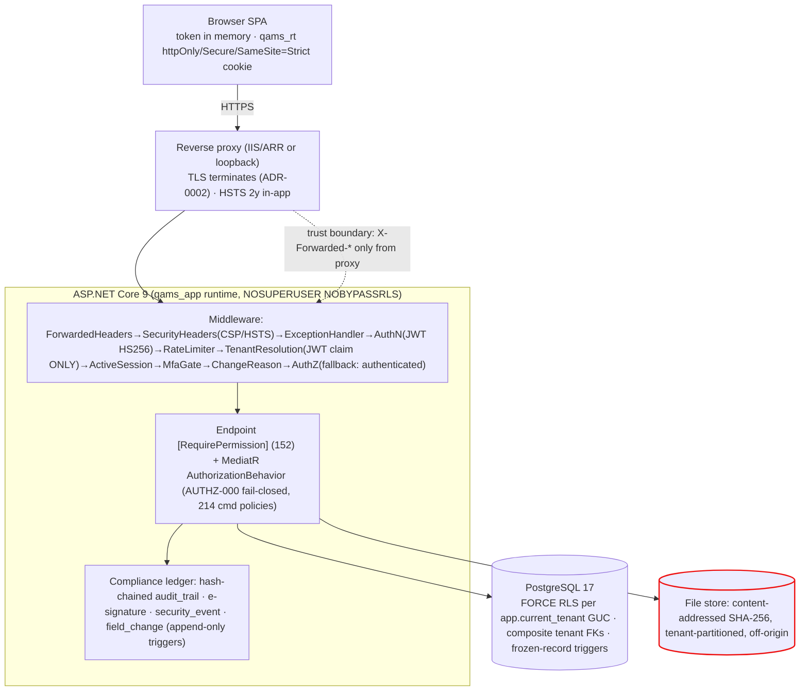

# NT.QAMS — AS-BUILT Review · Document 08 · Security & Compliance Deep Audit

| Field | Value |
|---|---|
| Series / contract | AS-BUILT Review per [`00_REVIEW_MANIFEST.md`](00_REVIEW_MANIFEST.md) (v1.1) |
| Owner prompt | 08 — Security & Compliance Deep Audit |
| Commit reviewed | `d74d4bff733d49361a1b4da1e1b3ef3e8338af06` (`master`) — **identical to the manifest baseline; no drift** |
| Review date | 2026-08-02 |
| Method | **Source-code-only** audit (no execution, no exploitation, no fixes). Two fresh evidence agents ran the Prompt-08 special searches + input/injection/file/logging surface; consolidated with adversarially-verified findings from Docs 01, 03, 04, 07 |

**Evidence-class legend (manifest §5).** **Confidence:** High = ≥2 artifacts. **Static-review cap:** RLS/trigger/rate-limit *enforcement behavior* is Medium here (reconstructed from source + cross-referenced to the CI integration suite; not executed). **Redaction:** every secret value is redacted — existence and handling only. This is a security *design-and-evidence* review, not a penetration test.

---

## 1. Executive security posture

The application security **engineering** is strong and internally consistent: deny-by-default authorization at three layers, five-layer tenant isolation ending in FORCE RLS, a hash-chained append-only audit trail with DB-trigger immutability, rotating reuse-detecting refresh sessions, and a locked-down JSON-API CSP. **Both evidence agents found zero code-level BLOCKERs.** The material risk is **assurance, not code**: no independent penetration test, validation executed only on a dev workstation with unsigned OQ transcripts, and the Part 11 electronic-signature *manifestation* wired to one workflow. These are the release-gating items — and the repository's own `CLAUDE.md` lists them as open.

*Trust boundaries: (1) browser↔proxy TLS; (2) proxy↔API forwarded-header trust; (3) API↔DB via the least-privilege `qams_app` role under FORCE RLS; (4) per-request tenant boundary from the validated JWT claim. The file store is flagged — download crosses the tenant boundary correctly but without a permission gate or access log (§4 SEC-03).*

## 2. Special searches (Prompt-08 mandated) — results

| # | Search | Result | Verdict |
|---|---|---|---|
| 1 | Hardcoded secrets / default users | Production appsettings secret keys **empty**; only dev/CI/test-fixture *labelled* literals exist (dev DB/JWT values `<REDACTED>`, CI DB value `<REDACTED>`, `db-init.sql` non-value placeholders instructing replacement); prod compose uses `${VAR:?}`; `Deploy-FullStack.ps1` generates random secrets | **OK** — 0 production secrets |
| 2 | `[AllowAnonymous]` / debug / Swagger | Exactly 5 (`login`, `workspace/{slug}`, `refresh`, `logout`, `change-password`) + fluent anon on health/metrics; **`MapOpenApi` is dev-only** (`Program.cs:258-261`); fallback policy = `RequireAuthenticatedUser` | **OK** |
| 3 | CORS / AllowAnyOrigin+Credentials | **Zero** `AddCors`/`UseCors`/`AllowAnyOrigin` in `src/` (ADR-0007 same-origin); `AllowedHosts:"*"` is host-filtering, not CORS | **OK** |
| 4 | localStorage tokens | Token in memory signal (ADR-0009); only 5 non-secret UX keys; a spec asserts token never in web storage | **OK** |
| 5 | DB superuser connections | Runtime = `qams_app NOSUPERUSER NOBYPASSRLS`; `DatabaseRoleGuard` refuses Production boot on superuser/bypassrls/table-owner | **OK** |
| 6 | `IgnoreQueryFilters` / RLS bypass | 29 `IgnoreQueryFilters` — **all** cross-tenant sweep/KPI/notification/seed reads; every `Elevate()` is provisioning/outbox/sweep/seeding; bypass mechanism lives only in the interceptor | **OK — all justified** |
| 7 | Tenant id from request | `TenantResolutionMiddleware` reads **only** the validated JWT `tenant_id` claim; headers/query "explicitly banned" (comment); all `Request.Headers/Query` reads are non-tenant (`X-Change-Reason`, `X-Correlation-Id`, `Idempotency-Key`) | **OK** |
| 8 | Weak/default signing key | HS256, ≥32-char startup guard, no fallback/default secret; **single shared symmetric key, no `kid`/rotation** (design note → SEC-05) | **OK w/ note** |
| 9 | Security headers + CSP | CSP `default-src 'none'; frame-ancestors 'none'; base-uri 'none'; form-action 'none'`; `nosniff`; `X-Frame-Options: DENY`; `Referrer-Policy: no-referrer`; HSTS `max-age=63072000; includeSubDomains` (all envs but Dev) | **OK** |
| 10 | JWT validation params | issuer/audience/lifetime/signing-key all validated; `ClockSkew=1min`; `MapInboundClaims=false` | **OK** |

## 3. Control audit (source-confirmed)

| Control area | As-built | Evidence |
|---|---|---|
| Authentication | JWT HS256 with full validation; login with tenant resolve→lockout→credential→password-aging (AUTH-101)→MFA branch | `Program.cs:104-128`; `Login.cs:39-147` |
| Password policy | 12 chars / 4 classes / breach-list screen; 90-day aging; 5-deep reuse ban (AUTH-102) | `PasswordRules.cs`; `Login.cs:219-253` |
| Lockout | 5 attempts / 30 min, counts login+MFA+e-sign failures | `UserAccount.cs:29-30,209-218` |
| MFA | hand-rolled RFC 6238 TOTP, enrollment-scoped session gate | `TotpService.cs`; `RequestIdentity.cs:170-196` |
| Sessions | rotating hashed refresh family, reuse→family revocation, httpOnly/Secure/SameSite=Strict `qams_rt` | `RefreshSessions.cs:101-134`; `AuthController.cs:92-100` |
| Authorization | fallback authenticated-user + 170-key `[RequirePermission]` (152 uses) + fail-closed `AuthorizationBehavior` (AUTHZ-000, 214 cmd policies) | Doc 03 §3; `AuthorizationBehavior.cs:49-70` |
| Tenant isolation | JWT claim → context → EF filters → FORCE RLS (per-conn GUC, fail-closed nil UUID) → composite FKs | Doc 04 §2-3 |
| SQL injection | every raw-SQL site parameterized (`set_config`, `RefCounter`, outbox, advisory lock, role guard) — 1 `FromSql`, bound | Agent 2 §1 |
| Mass assignment | request binding is DTO records only; **no `[FromBody]` on any entity**; no polymorphic STJ | Agent 2 §2 |
| Part 11 audit trail | per-tenant SHA-256 hash chain, append-only trigger, `VerifyChainAsync` endpoint | Doc 04 §9; `ComplianceLedgerServices.cs` |
| E-signature | password+PIN dual-component (§11.200), lockout, content-hash binding, append-only ledger | `ComplianceLedgerServices.cs:86-142` |
| Rate limiting | global 300/min + auth 10/min (per IP) + e-sign 10/min (per actor) + refresh 60/min → 429 | `RateLimiting.cs`; `Program.cs:150-157` |
| Logging hygiene | field-change redaction list (`password/secret/pin/hash/token`); request log = path only, no bodies/headers/tokens | `FieldChangeInterceptor.cs:34`; `ObservabilityMiddleware.cs:99-105` |
| Supply chain / CI | NuGet vuln gate (High/Crit), npm audit allowlist, Trivy image scan, non-root assertion, RLS suite forced-on | `.github/workflows/ci.yml` |

## 4. Findings register

Severity reflects compliance/data-integrity/security consequence. **"Release blocker?"** = should block a *production, regulated* go-live. No finding is a code-execution BLOCKER; the blockers are assurance items the repo already tracks.

| ID | Sev | Area | Exact evidence | Exploit / failure scenario | Impact | Violated target req. | Required remediation | Blocker? |
|---|---|---|---|---|---|---|---|---|
| **SEC-001** | High | Pen test | `CLAUDE.md:75`; in-house probes only (`scripts/security-probe*.ps1`) | No independent adversarial validation of the live system | Unverified real-world exposure; standard buyer/auditor ask | GAMP 5 / customer security due-diligence | Commission an independent penetration test | **Yes** |
| **DOC-001** | High | Validation | `docs/validation/12-…:220-221`, `13-…:133-134`; `SCHEMA-HARDENING-REPORT.md:386` | Every OQ ran on a dev workstation; transcripts 12/13 unsigned; hardening never applied to a qualified install | Validated status not defensible in a GxP inspection | 21 CFR §11.10(a); GAMP 5 | Execute/sign OQ on a qualified environment | **Yes** |
| **SEC-01** | High | Part 11 e-sig | Doc 03 NB-03-02; Doc 07 §1 — `IESignatureService` invoked only in `DocumentCommands.cs:122` | Audit sign-off, NC verify/close, quality-policy/change approve, review close, 14 AQ sign-offs write signer fields but **no `signature_record`** | §11.50/§11.70 signing manifestation absent on ~19 of ~20 gates | 21 CFR §11.50, §11.70 | Mint a signature ceremony on all signed-record transitions | **Yes** (for Part 11 scope) |
| **SEC-02** | High | MFA default | `PasswordPolicyOptions.cs:14-17`; `deploy/compose.production.yml` (no key) | Privileged-role MFA enforcement defaults **off**; reference prod compose never sets it | Privileged accounts single-factor unless operator remembers | §11.10(d) / security best practice | Default-on in reference prod, or fail-closed doc | **Yes** |
| **SEC-03** | High | File download | `FilesController.cs:59-72` — `[Authorize]` only, no `[RequirePermission]`, no security event | Any tenant user iterates `GET /api/files/{guid}` and pulls evidence for modules they can't view — **no access record** | Unauthorized + untraceable regulated-evidence retrieval | §11.10(d) access limiting / audit | Add module `[RequirePermission]` gate + `SecurityEvent` on download | No (fix pre-GA) |
| **SEC-04** | Med-High | Ungated writes | Doc 03 §5.3 — PT `/result` (auto-NC) has zero `[RequirePermission]`; monitoring `/readings`; calibration | Any internal role triggers regulated auto-NC / clears an equipment lockout | Over-broad write authority on consequential actions | §11.10(g) authority checks | Add fine-grained gates; replace `[RequireInternalActor]` | No |
| **SEC-05** | Med | JWT key | `SecurityAdapters.cs:63-71`; `Program.cs:125` | Single shared HS256 secret, no `kid`, no rotation; one env var mints any identity incl. PlatformAdmin | Key compromise catastrophic; no zero-downtime rotation | Key-management best practice | Introduce key id + rotation (or asymmetric RS256) | No |
| **SEC-06** | Med | Admin reset | Doc 03 §5.5 — `reset-password` no `SecurityEvent`, no session revoke | Admin-forced reset leaves no security trail; target's live sessions persist | Missing audit of a credential event; stale sessions | §11.10(e) / §11.300 | Emit `SecurityEvent` + revoke the user's refresh family | No |
| **SEC-07** | Med | AV scan | `FileContentPolicy.cs:18,28-29` — allow-list + magic-byte, **no malware/macro scan** | A signature-valid ZIP/OLE carries a malicious macro doc | Malware stored/redistributed (attachment-only download lowers browser risk) | Defense-in-depth | Integrate content/AV scanning on upload | No |
| **SEC-08** | Med | RLS deviation B9 | `SCHEMA-HARDENING-REPORT.md §8` — `user_account`,`outbox_event` no RLS | Isolation on 2 tenant tables is "discipline, not structure" | Query-discipline dependency (compensated by architecture test) | §11.10(d) | Accepted permanent deviation; monitor via the test | No (accepted) |
| **SEC-09** | Med | Confidential masking | Doc 03 §5.4 — `ComplaintsController.cs:18-19` role literals | A tenant's custom privileged role can't satisfy the hard-coded literal check | Confidential complainant data mis-masked | CLAUDE.md rules 2 & 9 | Replace literals with a permission check | No |
| **SEC-10** | Low-Med | HTTP mis-map | Doc 07 NB-07-01 — `TestAuthorization.cs` `AUTHZ-*` domain codes | Validation failures (reason-required) return **403** not 422 | Misleading error semantics to clients | API error-contract | Rename the domain codes off the `AUTHZ-` prefix | No |
| **SEC-11** | Low-Med | Trigger scope / boot guard | Doc 04 NB-04-02/03 — append-only trigger allows TRUNCATE; `DatabaseRoleGuard` Production-only | Owner-role TRUNCATE could wipe a ledger; dev/qualified env running as owner bypasses the guard | Ledger-integrity edge; least-privilege only in prod | §11.10(c) protection | Deny TRUNCATE at role level (already implied by grant); run guard in qualified env | No |
| **SEC-12** | Low | Referential integrity | Doc 04 NB-04-01 — authorship/file refs bare Guid, no FK | A deleted user/file leaves dangling `created_by`/`file_id` | Authorship RI is app-enforced, not DB-enforced | Data integrity | Accept (append-audit design) or add nullable FKs | No |
| **SEC-13** | Low | SoD null gap | Doc 07 NB-07-02 — `EnsureSignerIsNotPreparer` no-op when preparer id null | A record lacking provenance can be self-signed | SoD not enforced on provenance-less rows | §11.10(g) | Require non-null preparer before sign-off | No |
| **OPS-001** | Med | Ops assurance | `CLAUDE.md:76` — no staging observability/load/soak | Production capacity, alerting, single-replica behavior unproven | Operational readiness unverified | Ops readiness | Staging bring-up + ≥100 VU load + 24h soak | No |

## 5. 21 CFR Part 11 mapping (source-confirmed vs open)

| Clause | Control | Status |
|---|---|---|
| §11.10(a) validation | GAMP 5 doc set exists; **execution on qualified env open (DOC-001)** | Partially (evidence gap) |
| §11.10(b) accurate copies / export | Excel/PDF exports, audit-trail export with chain attestation | Implemented |
| §11.10(c) record protection / retention | append-only ledgers, archive + legal hold, no runtime DELETE on regulated rows | Implemented |
| §11.10(d) limiting access | deny-by-default authz, RLS, security events — **but MFA-off default (SEC-02), file download ungated (SEC-03)** | Partially |
| §11.10(e) audit trail | per-tenant hash-chained trail + field-change ledger + reason-for-change | Implemented |
| §11.10(g) authority checks | permission catalogue + SoD — **coarse on some writes (SEC-04), one gate no SoD, null-preparer gap (SEC-13)** | Partially |
| §11.50 / §11.70 signature manifestation & linking | content-hash-bound signature — **document publish only (SEC-01)** | Partially |
| §11.100 unique to one individual | per-user credentials + PIN, no shared accounts in model | Implemented |
| §11.200 signing components | password + PIN dual-component with lockout | Implemented |
| §11.300 identification controls | aging, reuse ban, lockout, PIN issuance events | Implemented |

## 6. ISO/IEC 17025 & 9001 evidence (module-mapped)

Personnel/competency/authorization (§6.2 → Competency, Test Authorizations), equipment (§6.4), metrological traceability (§6.5 → Reference Standards), external providers (§6.6 → Suppliers), assurance of results/QC/PT (§7.7 → Westgard QC, PT/ILC), complaints (§7.9), nonconforming work (§7.10 → NC/CAPA), control of data/records (§7.11 → RLS, audit trail, archive), impartiality (§4.1 → Conflicts), management review (§8.9 → Reviews + Quality Analytics pack), documents/records (§8.3/§8.4 → Document Control) — **all have working, tested code** (Docs 06/07). ISO 9001 objectives/policy/context/change (§6.2/§5.2/§4/§6.3) likewise. The ISO functional coverage is complete; the gaps are the cross-cutting Part 11 signature/authz items above, not missing clause areas.

## 7. Ranked residual concerns (feeds Document 12)

1. **DOC-001 — validation not inspection-ready** (High, blocker): dev-workstation-only, unsigned OQ, hardening never on a qualified install.
2. **SEC-001 — no independent penetration test** (High, blocker).
3. **SEC-01 — Part 11 e-signature on one workflow only** (High): ~19 of ~20 signed-record gates mint no signature.
4. **SEC-02 — privileged MFA off by default** in the reference deployment (High).
5. **SEC-03 — file download ungated + unlogged** (High, pre-GA fix): the one concrete, easily-closed code gap surfaced fresh here.
6. **SEC-05 — single HS256 key, no rotation** (Med).
7. **SEC-04 / SEC-06 / SEC-09 — coarse write authz, un-audited admin reset, role-literal masking** (Med).
8. **OPS-001 — operational assurance unproven** (Med).

---

## Appendix A — Observation carry-forward

| ID | Note |
|---|---|
| **NB-08-01** (new) | File **download** (`FilesController.cs:59-72`) is permission-ungated and writes no security event — unauthorized + untraceable evidence retrieval. **The one concrete, easily-fixable code gap.** Route to Doc 12 (High, pre-GA). |
| **NB-08-02** (new) | No malware/AV scan on uploaded ZIP/OLE containers (`FileContentPolicy.cs`). Route to Doc 12 (Med, defense-in-depth). |
| **NB-08-03** (new) | `ForwardedHeaders` trusts `X-Forwarded-*` with default known-proxy config — ensure the deployment restricts these to the real proxy or IP-keyed rate limits can be diluted. Route to Docs 10/12 (Low). |
| NB-03-02/04/05/06, NB-04-01/02/03, NB-07-01/02 | All confirmed and folded into the §4 register (SEC-01/03/04/06/09/10/11/12/13). |
| SEC-001/DOC-001/OPS-001 | Confirmed open from the repo's own records; the two release blockers. |

## Appendix B — Reviewer no-modification attestation (manifest §8 model)

- [x] No file was created, modified, or deleted; nothing was built, run, exploited, or connected to a database. This is a source-only review — no penetration testing was performed.
- [x] Only read-only access (file reads, grep, read-only git) was used, including by the two evidence agents.
- [x] The only filesystem write is this document: `docs/as-built-review/08_SECURITY_AND_COMPLIANCE_DEEP_AUDIT.md`.
- [x] **All secret values redacted** — the special searches report existence and handling only; no password, PIN, JWT secret, connection string, or TOTP secret is reproduced; the CI-only literal encountered was redacted at source.
- [x] Nothing invented — every finding carries a `file:line` or a prior-document cross-reference; runtime-enforcement claims are confidence-capped and cross-referenced to the CI integration suite rather than asserted as executed.

---

*End of Document 08. Reviewed at manifest baseline `d74d4bf` (no drift). Next: Prompt 09 → `09_TESTING_QUALITY_AND_CICD_AUDIT.md`.*
