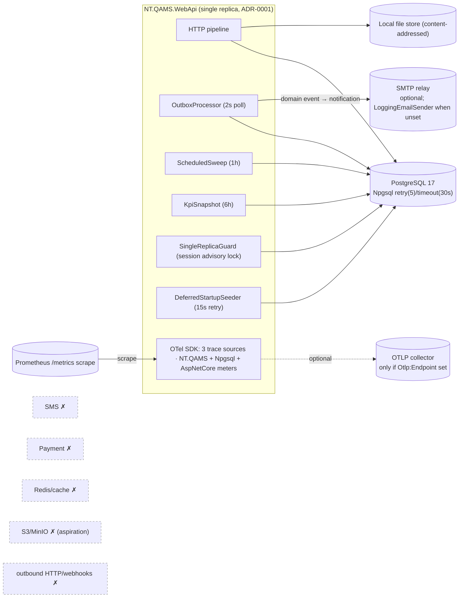

# NT.QAMS — AS-BUILT Review · Document 10 · Integrations, Operations & Observability

| Field | Value |
|---|---|
| Series / contract | AS-BUILT Review per [`00_REVIEW_MANIFEST.md`](00_REVIEW_MANIFEST.md) (v1.1) |
| Owner prompt | 10 — Integrations, Jobs, Observability & Operations |
| Commit reviewed | `d74d4bff733d49361a1b4da1e1b3ef3e8338af06` (`master`) — **identical to the manifest baseline; no drift** |
| Review date | 2026-08-02 |
| Method | Static inspection only; one focused agent over `src/NT.QAMS.Infrastructure/{Email,Jobs,Persistence/Outbox,Observability,Health}/**`, `Program.cs`, and `deploy/observability/**`; cross-referenced with Docs 02/04/09 |

**Evidence-class legend (manifest §5).** **Confidence:** High = source-cited. **Static cap:** runtime job/alert behavior is Medium (reconstructed from source + config, not executed). **Redaction:** config **keys** only; no secret values.

---

## 1. Integration topology (what actually talks to the outside)

The application has an intentionally minimal egress surface: **PostgreSQL (required)** and **SMTP (optional, best-effort)**, plus optional **OTLP export**. Everything else commonly seen in a SaaS QMS is **absent by design**.

## 2. Integrations register (required table)

| Integration | Direction | Code evidence | Config (keys only) | Resilience | Tenant safety | Status | Risks |
|---|---|---|---|---|---|---|---|
| **PostgreSQL** | outbound (required) | `AppDbContext`; `DependencyInjection.cs:51-53` | `ConnectionStrings:Postgres` | `EnableRetryOnFailure(5, 10s)` + `CommandTimeout(30s)`; execution-strategy-wrapped | FORCE RLS per-connection GUC | Fully Implemented | — |
| **SMTP / email** | outbound (optional) | `Email/SmtpEmailSender.cs:22-34`; null `LoggingEmailSender:38-49`; DI selects by `Smtp:Host` (`DependencyInjection.cs:104-111`) | `Smtp:Host/Port/From/Ssl/User/Password` | **None at SMTP layer** — no timeout, no retry/backoff, no circuit breaker; single attempt; failure swallowed + recorded | recipients resolved tenant-scoped before send; sender is tenant-agnostic singleton | Fully Implemented (best-effort) | No send-timeout, no retry/re-drive; **NB-10-01** |
| **OTLP export** | outbound (optional) | `Program.cs:67-70,82,91` | `Otlp:Endpoint` | exporter added only if endpoint set | N/A | Fully Implemented (opt-in) | traces/logs terminate at collector `debug` exporter — no persistent backend wired (**NB-10-02**) |
| **File storage** | local disk | `Storage/LocalFileStorage.cs` (singleton `IFileStorage`) | `FileStorage:RootPath` | content-addressed dedupe; atomic move | tenant-partitioned key `{tenantId:N}/{sha256}` | Fully Implemented | S3/MinIO is interface-swap **aspiration only** (comment) |
| **SMS** | — | none | — | — | — | **Missing** (absent) | — |
| **Payment/Stripe** | — | none | — | — | — | **Missing** (absent) | — |
| **Redis / distributed cache** | — | none (no `IDistributedCache`) | — | — | — | **Missing** (absent) | — |
| **Outbound HTTP / webhooks** | — | no `HttpClient`/`AddHttpClient` in `src` | — | — | — | **Missing** (absent) | — |
| **SignalR / real-time push** | — | none (Doc 01 §2) | — | — | — | **Missing** (absent) | `/hubs` proxy route reserved unused (Doc 02) |

**Notification delivery path (domain event → email), best-effort but fully recorded:** outbox publishes a domain event → `NotificationEventPolicies` (11 event types, single handler set, `NotificationPolicies.cs:24-162`) → `NotificationDispatcher` sets tenant, **dedupes by `SourceEventId`** (idempotent under at-least-once outbox), matches active `NotificationRules` by role, writes one `notification_dispatch` feed row per recipient (**SaveChanges first**), then attempts email per row — `MarkEmailSent`/`MarkEmailFailed(error)` + Warning log, persisted. In-app feed is the durable guarantee; email is a courtesy. Default rules seeded per tenant on provisioning. **Fully Implemented / High.**

## 3. Background jobs register (required table)

Five in-process `IHosted­Service`s (no external scheduler; Hangfire/Quartz absent). Advisory-lock keys centralized in `AdvisoryLockKeys.cs`.

| Job | Trigger / cadence | Work performed | Failure behavior | Audit / telemetry | Tests | Status |
|---|---|---|---|---|---|---|
| **OutboxProcessor** | 2s poll (immediate re-drain if batch full); 30s stats; 1h purge | claims due rows `FOR UPDATE SKIP LOCKED` + 2-min lease (batch 50), publishes in-process, appends hash-chained audit row in same SaveChanges | per-event exponential backoff (5/10/20/40s + jitter), **dead-letter after 5 attempts** + ERROR log; loop catch = crash-loop safe; lease reclaims crashed claimant | `QamsDiagnostics.Outbox` span parented on persisted `TraceParent`; counters `outbox.processed/failed/dead_lettered` + backlog/age gauges | `OutboxProcessorTests`, `TracePropagationTests`, `OutboxResilienceTests` (real PG) | Fully Implemented |
| **ScheduledSweepService** | 1h (15s startup delay) | cross-tenant compliance sweep: calibration-due, lockout, competency/authorization/reference-standard expiry, supplier cert suspension, doc review-due, escalation advance — proposes guarded transitions via outbox | loop catch logs ERROR + delays interval (crash-loop safe); idempotent (declined proposal = no-op); next run retries | `QamsDiagnostics.Jobs` span; `RecordJobSuccess("compliance-sweep")` liveness gauge | `ScheduledSweepTests` | Fully Implemented |
| **KpiSnapshotService** | 6h (20s startup delay) | upserts one `read.kpi_snapshot` per active tenant per day (8 KPIs) | loop catch logs ERROR + delays interval; idempotent (updates today's row) | `QamsDiagnostics.Jobs` span; `RecordJobSuccess("kpi-snapshot")` gauge | **indirect only** (`DashboardKpiTotalsTests`) — no dedicated unit test (**NB-10-03**) | Fully Implemented |
| **SingleReplicaGuardService** | acquire-once, hold for lifetime; 60s re-probe if contended | holds a **session** `pg_try_advisory_lock`; second replica → prominent Warning (ADR-0001 "unsupported") | no-DB → quiet return; probe error → Warning, degrades gracefully; lock dies with process | Warning/Info logs only (no metric) | `ReadinessAndTopologyTests` (real PG) | Fully Implemented (detect-and-warn, not enforce) |
| **DeferredStartupSeeder** | runs only if inline seed deferred; 15s retry | completes platform-admin + LOV + role backfill when DB was unreachable at boot | **only DB-unavailability defers** (classified); a genuine fault logs ERROR and is **not** retried — never takes the host down | Info/Warning/Error logs | `StartupSeedingResilienceTests`, `DefaultLovSeedingTests` | Fully Implemented (OPS-010) |

**Job concurrency safety:** the two data-mutating sweeps use `AdvisoryLock.TryRunExclusiveAsync` (transaction-scoped `pg_try_advisory_xact_lock`, execution-strategy-wrapped) for leader election; the outbox uses `SKIP LOCKED` claim leases. So even though ADR-0001 assumes one replica, a mis-deployed second replica cannot double-process — a real defense-in-depth strength.

## 4. Observability

- **Traces:** AspNetCore (filters `/health`+`/metrics`) + Npgsql + three custom sources — `NT.QAMS.Application` (MediatR `TracingBehavior`), `NT.QAMS.Outbox`, `NT.QAMS.Jobs`; the outbox parents delivery spans on the persisted `traceparent`, so **HTTP→MediatR→EF→Outbox share one trace** (Phase 2 wiring).
- **Metrics** (Prometheus `/metrics` + `NT.QAMS` meter, `QamsMetrics.cs`): counters `qams.outbox.processed/failed/dead_lettered`; gauges `qams.outbox.backlog`, `…dead_letters`, `…oldest_pending_age_seconds`, and per-job `qams.job.last_success_timestamp_seconds{job=…}` liveness — plus AspNetCore RED and Npgsql pool.
- **Logs:** Production replaces console with `AddJsonConsole` (scopes, UTC); one canonical per-request completion record (service/env/method/path/status/outcome/duration/tenant/user/correlation — no bodies/tokens, Doc 08 §4). OTLP log export only if `Otlp:Endpoint` set.

### 4.1 Health & monitoring coverage matrix

| Signal | Endpoint / mechanism | Anonymous / RL-exempt | Covers | Gap |
|---|---|---|---|---|
| Liveness | `/health/live` + `/health` (no checks) | yes | process up; DB outage does **not** flip liveness (recycles traffic, not the process) | — |
| Readiness | `/health/ready` → `PostgresReadinessHealthCheck` (`SELECT 1`, 5s timeout) → 503 | yes | DB reachability | only PG probed (no SMTP/disk readiness — acceptable) |
| Metrics | `/metrics` Prometheus | yes | RED, outbox health, job liveness, pool | — |
| Alerts (`deploy/observability/alert.rules.yml`) | Prometheus rules | — | OutboxDeadLetter (>0/1m, page), OutboxBacklogAge (>10min, page), ComplianceSweepStalled (>2h, page), KpiSnapshotStalled (>12h, warn), HighServerErrorRate (5xx>5%, page), HighRequestLatencyP95 (>2s, warn) | trace/log backend not wired (NB-10-02) |
| Dashboard | Grafana `nt-qms-overview.json` | — | RED, error rate, p50/95/99, outbox dead-letters + backlog/age, job liveness, Npgsql pool | — |
| Trace backend | OTLP collector | — | metrics forwarded to Prometheus | **traces/logs → `debug` exporter only** (NB-10-02) |
| Audit (compliance, not ops) | hash-chained `audit_trail` (7-yr record) | — | tamper-evident event history | logs retained ≥35d hot, not the compliance record |

The observability stack (`deploy/observability/compose.observability.yml`: otel-collector 0.109.0, Prometheus v2.54.1, Grafana 11.2.0) is **defined and provisioned** but is a local/staging bring-up — running it in a qualified staging environment is the open **OPS-001** item.

## 5. Operational resilience

| Control | As-built | Evidence |
|---|---|---|
| Single-replica topology | ADR-0001; `SingleReplicaGuardService` session advisory lock warns on a 2nd replica; jobs made concurrency-safe anyway (SKIP LOCKED + advisory election) | §3 |
| DB retry/timeout | `EnableRetryOnFailure(5, 10s)` + 30s command timeout; user transactions inside the execution strategy | `DependencyInjection.cs:51-53` |
| Graceful degradation | readiness 503 (not process death) on DB loss; startup seeding **defers** rather than crash-loops; role guard treats unreachable DB as readiness, not fatal | `Program.cs:224-285`; §3 B.5 |
| Least-privilege boot gate | Production refuses to boot on SUPERUSER/BYPASSRLS/owner DB role (TENANT-004) | `Program.cs:207-222` |
| Backup | `deploy/backup.sh` — `pg_dump --format=custom --compress=9` + file-store tar + SHA-256 manifest; `set -euo pipefail`; prompts encrypt+off-site+verify | `deploy/backup.sh` |
| Restore + DR | `deploy/restore.sh` — `pg_restore --clean --no-owner`; **5 mandatory post-restore verifications** (health, RLS isolation, audit hash-chain verify, signature/row counts vs manifest, sampled file SHA-256) before opening traffic; `BACKUP-RESTORE-DR.md` full procedure incl. PITR/WAL | `deploy/restore.sh`, `BACKUP-RESTORE-DR.md` |

## 6. Findings & gaps

| ID | Sev | Finding | Evidence |
|---|---|---|---|
| **NB-10-01** | Med | SMTP has no send-timeout, no retry/backoff, no automated re-drive — email is best-effort. Failures are recorded (feed row + `EmailStatus` + error) and visible in the dispatch monitor, but a transient SMTP outage silently drops the email (in-app feed persists). | `SmtpEmailSender.cs`; `NotificationDispatcher.cs:87-99` |
| **NB-10-02** | Med | OTLP **traces and logs terminate at the collector's `debug` exporter** — no persistent trace/log backend (Tempo/Loki) is wired; only the metrics path is end-to-end. Distributed-trace retention is unavailable until a backend is configured. | `deploy/observability/otel-collector.yaml` |
| **NB-10-03** | Low | `KpiSnapshotService` has no dedicated unit test (only indirect `DashboardKpiTotalsTests`). | Doc 09 T-5 area |
| **OPS-001** | Med | The observability stack is defined but **not validated in a qualified staging environment**, and no load/soak has been run (repo's own open item). | `CLAUDE.md:76` |
| NB-08-03 | Low | `X-Forwarded-*` trust must be restricted to the real proxy or IP-keyed rate limits dilute (carried from Doc 08). | `Program.cs:147-148` |

**Positive notes:** the outbox is a genuinely production-grade reliable-messaging implementation (SKIP LOCKED leasing, exponential backoff, dead-letter, retention purge, trace propagation, real-PG resilience tests); job liveness is a first-class metric with matching alerts; the restore script's mandatory post-restore compliance verifications (audit-chain + RLS + checksum) are unusually thorough for a QMS.

## 7. Assessment

For a modular monolith the operational engineering is **mature and honest about its constraints**: no external message broker, cache, or scheduler — the transactional outbox + `SKIP LOCKED` + advisory-lock election deliver reliable in-process eventing that is safe even under an accidental second replica, and the health/metrics/alert/dashboard chain is complete for metrics. The real gaps are (1) email is best-effort with no re-drive, (2) trace/log telemetry has no persistent backend yet, and (3) the whole observability + capacity story is **unproven in a qualified staging environment (OPS-001)** — an operational-assurance gap, not a code defect, consistent with the review's recurring theme.

---

## Appendix A — Observation carry-forward

| ID | Note |
|---|---|
| OBS-10 (pre-release Prometheus exporter) | The Prometheus exporter is `1.17.0-beta.1` (Doc 02) — a pre-release package on the production metrics path. Doc 12. |
| SignalR reserved route | `/hubs` reverse-proxy route reserved but no hub exists (Doc 02). Informational. |
| OPS-001 | Confirmed: observability stack defined, never validated in staging; no load/soak. Doc 12 (Med). |
| **NB-10-01/02/03** | New this document — SMTP best-effort, OTLP trace/log backend unwired, KpiSnapshot untested. Doc 12. |

## Appendix B — Reviewer no-modification attestation (manifest §8 model)

- [x] No file was created, modified, or deleted; nothing was built, run, scheduled, or connected to a database/SMTP/collector.
- [x] Only read-only access (file reads, grep, read-only git) was used, including by the evidence agent.
- [x] The only filesystem write is this document: `docs/as-built-review/10_INTEGRATIONS_OPERATIONS_AND_OBSERVABILITY.md`.
- [x] No secret values reproduced — SMTP/DB/OTLP config cited by key name only.
- [x] Nothing invented — every integration, job, metric, and alert carries a `file:line` or config-file citation; runtime behavior is confidence-capped (static review).

---

*End of Document 10. Reviewed at manifest baseline `d74d4bf` (no drift). Next: Prompt 11 → `11_REQUIREMENTS_TRACEABILITY.md`.*
