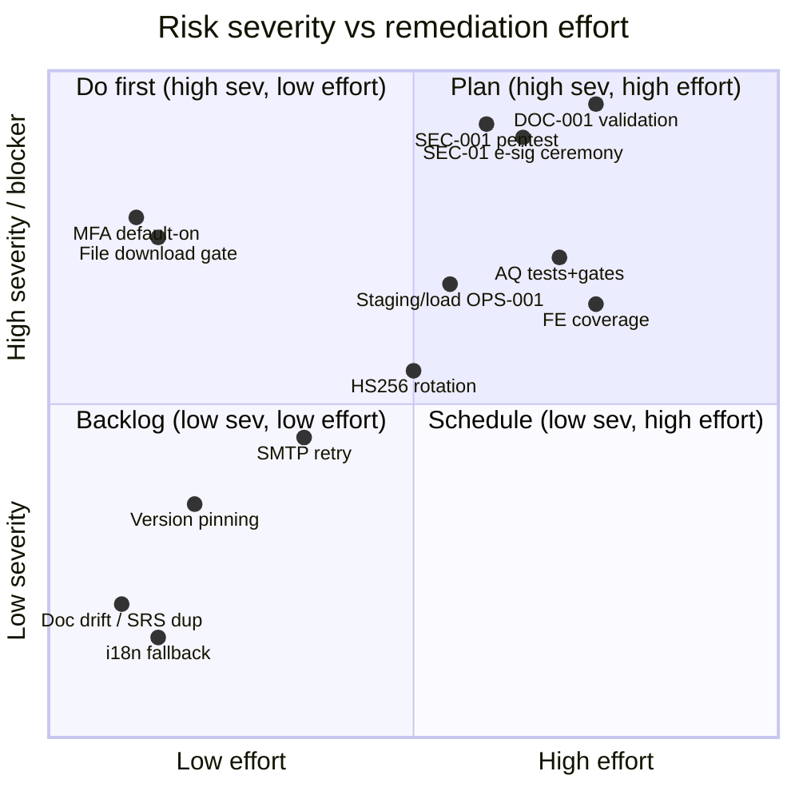

# NT.QAMS — AS-BUILT Review · Document 12 · Technical Debt & Risk Register

| Field | Value |
|---|---|
| Series / contract | AS-BUILT Review per [`00_REVIEW_MANIFEST.md`](00_REVIEW_MANIFEST.md) (v1.1) |
| Owner prompt | 12 — Technical Debt, Risk & Release-Blocker Register |
| Commit reviewed | `d74d4bff733d49361a1b4da1e1b3ef3e8338af06` (`master`) — **identical to the manifest baseline; no drift** |
| Review date | 2026-08-02 |
| Method | Consolidation of **only evidence-backed** findings from Documents 01–11; every register entry traces to a cited finding. No generic best practices are listed without a code/source tie. |

**Scope rule (Prompt 12):** every item is tied to specific source evidence via its owning review document. **Severity** = Critical / High / Med / Low by compliance + data-integrity + security + operability + maintainability impact. **Release blocker** = should block a *production, regulated* go-live.

---

## 1. Critical blockers — must resolve before a regulated production go-live

Of the three originally listed, **RISK-03 is now CLOSED** (2026-08-07 — the Part 11 e-signature ceremony was propagated to every regulated sign-off gate; see the closure note below). **Two remain open** — RISK-01/DOC-001 and RISK-02/SEC-001 — both **assurance blockers the repository itself lists as open** (`CLAUDE.md:75-77`), not code defects but they gate a validated release.

| ID | Blocker | Why it blocks | Evidence |
|---|---|---|---|
| **RISK-01 / DOC-001** | Validation not executed on a qualified environment; OQ transcripts 12/13 **unsigned**; schema hardening never applied to a qualified install | Validated status is not defensible in a GxP inspection today | Doc 08 §4; `docs/validation/12-…:220-221`, `13-…:133-134` |
| **RISK-02 / SEC-001** | No independent penetration test (in-house probes only) | Standard buyer/auditor requirement for a Part 11 product | Doc 08 §4; `CLAUDE.md:75` |
| **RISK-03 / SEC-01 (NB-03-02)** — ✅ **CLOSED 2026-08-07** | ~~21 CFR Part 11 e-signature manifestation on document publish only~~ — **RESOLVED:** the signing ceremony now mints a `signature_record` on **every** regulated sign-off gate (NC verify/close, 14 AQ sign-offs incl. PtPlan, audit sign-off, quality-policy/change approve, management-review close, the 4 borderline SoD gates, and both periodic-review completions) | §11.50/§11.70 **now satisfied** across all signed-record transitions | Closed on `dev` (`ddd1551`…`3d43849`); `docs/validation/06-…` §A.13–A.19, URS-123–128 |

*RISK-03 was the single highest-value code change in the review; it is now **CLOSED** (2026-08-07). The ceremony was propagated from document-publish to all ~20 signed-record gates, reusing the existing `Sign` action and in-domain SoD — each handler pre-validates its state/SoD gates before minting, so a refused sign-off leaves no signature. Engineering-complete and verified (backend 478 + frontend 95 green; live-PostgreSQL proofs: wrong PIN → SIG-001, missing-key → AUTHZ-403). The remaining obligation is QA's execution and signature of the validation records for URS-123–128 (which belongs under RISK-01/DOC-001, not RISK-03).*

## 2. Full risk register

| ID | Category | Sev | Evidence (doc) | Current impact | Likely failure/exploit | Affected module(s) | Recommended action | Priority | Blocker |
|---|---|---|---|---|---|---|---|---|---|
| RISK-01 | Compliance | Crit | Doc08 DOC-001 | Unvalidated for GxP | Inspection failure | All | Execute + sign OQ on qualified env | P0 | **Yes** |
| RISK-02 | Security | Crit | Doc08 SEC-001 | Unverified real-world exposure | Undiscovered vuln | All | Commission independent pentest | P0 | **Yes** |
| RISK-03 | Compliance | Crit | Doc03 NB-03-02 | ✅ **CLOSED 2026-08-07** — ceremony minted on all signed-record gates | — (resolved) | Audits, NC, QP, Change, Review, AQ | ~~Mint signature ceremony on all signed-record transitions~~ **Done** (`ddd1551`…`3d43849`) | P0 | **CLOSED** |
| RISK-04 | Security | High | Doc08 SEC-02 | Privileged MFA off in reference prod | Single-factor privileged accounts | IdentityAccess | Default-on in reference prod compose | P1 | Yes |
| RISK-05 | Security | High | Doc08 NB-08-01/SEC-03 | File **download** ungated + unlogged | Tenant user pulls unviewable evidence, no trace | Files | Add `[RequirePermission]` + SecurityEvent on download | P1 | Pre-GA |
| RISK-06 | Testing | High | Doc09 T-1 | 107 AQ routes functionally untested; **PT-result→NC ungated + untested** | Regression in regulated auto-NC undetected | AnalyticalQuality | Add functional/integration tests + permission gates for AQ | P1 | Pre-GA |
| RISK-07 | Operations | Med-High | Doc08/10 OPS-001 | Observability/capacity unproven in staging; no load/soak; 7 alerts never deployed | Undetected prod saturation | Ops | Staging bring-up + ≥100 VU load + 24h soak; deploy alerts | P1 | No |
| RISK-08 | Testing | High | Doc05/09 T-2 | FE unit coverage 7/107 comp, 3/35 facade; a11y login-only | UI defect in signing surface undetected | Frontend | Add facade/component specs; axe on authed screens | P1 | No |
| RISK-09 | Security | Med | Doc08 SEC-05 | Single shared HS256 key, no `kid`/rotation | Key compromise mints any identity; no zero-downtime rotation | Auth | Introduce key id + rotation (or RS256) | P2 | No |
| RISK-10 | Authorization | Med-High | Doc03 SEC-04 | Consequential writes `[RequireInternalActor]`-only (PT result, monitoring reading, calibration clears lockout) | Over-broad write authority | AQ, Facility, Equipment, NC | Replace with fine-grained `[RequirePermission]` | P2 | No |
| RISK-11 | Compliance | Med | Doc03 SEC-06 | Admin `reset-password` no SecurityEvent + no session revoke | Untraceable credential reset; stale sessions | IdentityAccess | Emit SecurityEvent + revoke refresh family | P2 | No |
| RISK-12 | Testing | Med-High | Doc09 T-3 | Full-stack regulated e2e not in CI | Broken end-to-end journey merges green | Frontend/e2e | Run `regulated-workflow.spec.ts` in CI vs seeded API | P2 | No |
| RISK-13 | Testing | Med | Doc09 T-4/VER-001 | 21/22 functional classes on EF InMemory; defects escaped a green suite | RLS/FK/CHECK gaps pass InMemory | WebApi tests | Expand real-PG HTTP coverage | P2 | No |
| RISK-14 | Reliability | Med | Doc10 NB-10-01 | SMTP best-effort, no timeout/retry/re-drive | Transient outage silently drops emails | Notifications | Add send-timeout + retry/re-drive | P2 | No |
| RISK-15 | Operations | Med | Doc10 NB-10-02 | OTLP traces/logs → `debug` exporter only | No distributed-trace retention | Observability | Wire Tempo/Loki backend | P2 | No |
| RISK-16 | Architecture/Authorization | Med | Doc07 (change-approve) | Change `Approve` has **no SoD** — only approval gate without it | Proposer approves own change | RiskGovernance | Add proposer≠approver check | P2 | No |
| RISK-17 | Security | Med | Doc08 SEC-07 | No malware/AV scan on ZIP/OLE uploads | Malicious macro doc stored | Files | Integrate content/AV scanning | P2 | No |
| RISK-18 | Data | Med | Doc04 NB-04-01 | Authorship/file refs bare Guid, no FK | Dangling `created_by`/`file_id` on delete | All | Accept (append-audit) or add nullable FKs | P3 | No |
| RISK-19 | Frontend | Med | Doc05 (perf) | No virtual scrolling; load-more grows DOM unbounded | Large-register UI slowdown at scale | Frontend | Add windowing for large registers | P3 | No |
| RISK-20 | Maintainability | Med | Doc02 OBS-06 | Floating NuGet wildcards, no global.json, `dotnet-ef 10.0.10` vs net9 | Non-reproducible restores; EF CLI needs .NET 10 | Build | Pin versions + add global.json (or CPM) | P2 | No |
| RISK-21 | Compliance | Med | Doc11 NB-11-01 | Repo RTM overstates URS-020-022 & URS-038-040; understates NFR-SEC-17/18 | Traceability record inaccurate | Docs | Reconcile RTM next revision | P3 | No |
| RISK-22 | Testing | Med | Doc09 T-6/NB-09-02 | No coverage gate (backend or frontend) | Coverage silently regresses | CI | Add coverage thresholds | P3 | No |
| RISK-23 | Security | Low-Med | Doc07 NB-07-01 | `TestAuthorization` `AUTHZ-*` domain codes → HTTP 403 not 422 | Validation error reads as forbidden | Competency | Rename codes off `AUTHZ-` prefix | P3 | No |
| RISK-24 | Compliance | Low-Med | Doc04 NB-04-02 | Append-only trigger allows TRUNCATE (grant compensates) | Owner-role TRUNCATE could wipe ledger | ComplianceLedger | Deny TRUNCATE explicitly at role level | P3 | No |
| RISK-25 | Security | Low-Med | Doc04 NB-04-03 | `DatabaseRoleGuard` Production-only | Dev/qualified env as owner bypasses guard | Infrastructure | Run guard in qualified env too | P2 (ties to DOC-001) | No |
| RISK-26 | Compliance | Low-Med | Doc07 NB-07-02 | SoD guard no-op when `CreatedByUserId` null | Provenance-less record self-signable | AnalyticalQuality | Require non-null preparer before sign-off | P3 | No |
| RISK-27 | Operations | Low | Doc08 NB-08-03 | `X-Forwarded-*` trust default config | Spoofed XFF dilutes IP-keyed rate limits | WebApi | Restrict forwarded headers to real proxy | P2 (deploy) | No |
| RISK-28 | Frontend | Low | Doc05 NB-05-01 | i18n `t()` returns raw key on miss, no warn/fallback | Mistyped key renders dotted id | Frontend | Add dev-mode warning / fallback | P3 | No |
| RISK-29 | Reliability | Low | Doc10 NB-10-03 | `KpiSnapshotService` untested | Snapshot regression undetected | Jobs | Add unit test | P3 | No |
| RISK-30 | Testing | Low-Med | Doc09 NB-09-01 | Only last migration round-trips | Older migration Down() breakage undetected | Migrations | Full-chain round-trip test | P3 | No |
| RISK-31 | Maintainability | Low | Doc02 OBS-01/03/04 | Doc drift: v1.52 untagged, README/ONBOARDING Angular-18, compose image 1.43 | Repo docs unreliable without source check | Docs | Update stale docs + tag v1.52.0 | P3 | No |
| RISK-32 | Maintainability | Low | Doc02 OBS-10 | Prometheus exporter `1.17.0-beta.1` (pre-release) on prod path | Beta dependency in production | WebApi | Move to stable when released | P3 | No |
| RISK-33 | Maintainability | Low | Doc05 (large files) | 4 components 400-657 LOC (quality-analytics 657, login 488, shell 424, roles 356) | Harder to maintain/test | Frontend | Decompose largest pages | P3 | No |
| RISK-34 | Frontend | Low | Doc05 NB-05-04 | No global error/retry interceptor | Transient failures surface unretried | Frontend | Add retry/error interceptor | P3 | No |
| RISK-35 | Maintainability | Low | Doc02 NB-02-01 | `NT_QMS_Complete_SRS_Sameh.html` byte-identical dup, untracked | Confusing duplicate artifact | Docs | Remove duplicate | P4 (quick win) | No |

## 3. Technical-debt hotspots

- **Largest files:** `quality-analytics.component.ts` (657 LOC), `login.component.ts` (488), `shell.component.ts` (424), `roles.component.ts` (356) — inline template+logic+styles; decomposition candidates (RISK-33).
- **Direct-DB coupling:** only 2 controllers (Files, Exports) touch data directly, and via the `IAppDbContext` abstraction — **not** a hotspot; the concern is instead **facade-skippers** (`roles`, `platform` inject API services directly, RISK-33-adjacent).
- **Weak-test hotspots:** the entire Analytical-Quality HTTP surface (RISK-06), 7 Application slices + 2 Domain modules with zero unit tests, ~84 feature components with zero specs (RISK-08).
- **Blob/serialized state:** minimal and controlled — one `jsonb` column + 3 infra text payloads (Doc 04); **not** a debt hotspot (a strength).
- **Duplicate logic:** the 12 analytical study families share a near-identical lifecycle but are separate aggregates (intentional DDD boundary, not copy-paste debt); the one true duplicate is the SRS HTML file (RISK-35).
- **Toolchain determinism:** floating versions + no global.json + `dotnet-ef` major-version pin (RISK-20) — the highest-value maintainability fix.

## 4. Risk heat map

## 5. Dependency-aware remediation order

1. **RISK-04 (MFA default-on), RISK-05 (file download gate), RISK-35/31/28 (doc/dup/i18n quick wins), RISK-20 (version pinning)** — low-effort, high-value; independent; do first.
2. **RISK-03 (e-signature ceremony)** — ✅ **DONE (2026-08-07).** The core Part 11 code fix; unblocked the compliance half of a validated release. Was sequenced before RISK-01 for the reason in the note below.
3. **RISK-06 + RISK-10 (AQ tests + gates), RISK-08/12/13 (test estate), RISK-16/11/23/26 (authz/SoD/code hygiene)** — code hardening; several share the AQ module and should batch.
4. **RISK-07 + RISK-25 + RISK-15 (staging observability/load, guard in qualified env, trace backend)** — operational assurance; prerequisite for OPS-001 closure.
5. **RISK-01 (signed validation on qualified env) + RISK-02 (pentest)** — **executed last**, once the code hardening (2-3) and ops assurance (4) are in place, so the qualified-environment run and pentest exercise the fixed system. Validating before the fixes would waste the qualified run.

*Dependency note: running the qualified-environment OQ (RISK-01) before RISK-03/06/10 lands would produce signed evidence of a system still missing signatures on most gates — so the sequence above is not arbitrary.*

## 6. Risks introduced by the current design vs inherited prototype limitations

**Design-choice risks (this rebuild's deliberate trade-offs):**
- Single shared HS256 key (RISK-09) — chosen simplicity over rotation.
- Coarse `[RequireInternalActor]` on some writes (RISK-10) — a documented "full Phase 1" deferral.
- `[RequireInternalActor]` command policy instead of `[RequirePermissionPolicy]` on audit sign-off etc. — leaves fine-grained authz to the HTTP filter only.
- ~~e-signature wired to one workflow (RISK-03) — the ceremony pattern exists but wasn't propagated.~~ **Resolved 2026-08-07:** the ceremony is now propagated to every signed-record gate.
- Two RLS-exempt tables (B9) — a formally accepted structural deviation.
- SMTP best-effort / no external queue (RISK-14) — modular-monolith simplicity.

**Inherited/environmental (not this rebuild's code):**
- DOC-001 / SEC-001 / OPS-001 — validation/pentest/staging are *process* gaps, not code.
- Toolchain floating versions (RISK-20) — a setup choice, easily corrected.
- **Notably NOT inherited:** the legacy system's UI-first-with-weak-backend problem is *gone* — this rebuild is API-first with complete vertical slices (Doc 06), no mocked data, clean 3NF schema, guarded state machines. The rebuild eliminated the inherited prototype limitations rather than carrying them forward.

## 7. Quick wins (low effort, high value — separated from structural items)

| Item | Effort | Value |
|---|---|---|
| RISK-04 MFA default-on in reference prod compose | S (config) | High (closes a privileged-account gap) |
| RISK-05 file download `[RequirePermission]` + SecurityEvent | S | High (closes SEC-03) |
| RISK-11 SecurityEvent + session-revoke on admin reset | S | Med |
| RISK-20 global.json + pin versions | S | Med-High (determinism) |
| RISK-23 rename `AUTHZ-*` domain codes | S | Med (correct HTTP semantics) |
| RISK-31/35 update stale docs, tag v1.52.0, delete SRS dup | S | Med (repo-doc trust) |
| RISK-28 i18n dev-mode missing-key warning | S | Low-Med |

**Structural items** (larger, sequenced per §5): RISK-03 (e-sig ceremony), RISK-06/08 (test estate), RISK-07 (staging/load), RISK-09 (key rotation), RISK-19 (virtual scroll), RISK-33 (component decomposition).

---

## Appendix A — Manifest observation disposition (all OBS/NB rolled up)

Every Appendix-A observation and `NB-xx` finding from Docs 01–11 is now carried into a RISK-ID above (or closed): OBS-01/03/04→RISK-31; OBS-02 closed (migration count verified); OBS-05→RISK (LoadTests, in RISK-06/T-7 area); OBS-06→RISK-20; OBS-07→Doc09 (docs, not tests); OBS-08→RISK-01/02/07; OBS-09 (dirty tree) informational; OBS-10→RISK-32; NB-02-01→RISK-35; NB-03-02→RISK-03; NB-03-04→RISK-10; NB-03-05→RISK-11; NB-03-06→RISK (complaint masking, folded into SEC-09 register — add as RISK-36 if tracked separately); NB-04-01→RISK-18; NB-04-02→RISK-24; NB-04-03→RISK-25; NB-05-01→RISK-28; NB-05-02 informational; NB-05-03→RISK-08; NB-05-04→RISK-34; NB-07-01→RISK-23; NB-07-02→RISK-26; NB-08-01→RISK-05; NB-08-02→RISK-17; NB-08-03→RISK-27; NB-09-01→RISK-30; NB-09-02→RISK-22; NB-10-01→RISK-14; NB-10-02→RISK-15; NB-10-03→RISK-29; NB-11-01→RISK-21. *(NB-03-06 complaint role-literal masking = **RISK-36**, Med, Improvement module — replace literals with a permission check.)*

## Appendix B — Residual unknowns (static-review limits)

This review could not determine, by static analysis: actual test pass/fail and coverage % (no execution); real RLS/trigger/rate-limit *runtime* behavior (cross-referenced to the CI suite, not run here); live performance under load (dev-box figures only); CI pass/fail history; backup/restore drill effectiveness. These are precisely the DOC-001/SEC-001/OPS-001 items — the register is honest that its runtime-dependent rows rest on source + the CI integration suite, not on an executed qualified run.

## Appendix C — Reviewer no-modification attestation (manifest §8 model)

- [x] No file was created, modified, or deleted; nothing was built, run, or connected to a database.
- [x] Only read-only synthesis of Documents 01–11 (no new source reads required).
- [x] The only filesystem write is this document: `docs/as-built-review/12_TECHNICAL_DEBT_AND_RISK_REGISTER.md`.
- [x] No secret values reproduced.
- [x] Nothing invented — every register row cites its owning review document and the underlying `file:line`; no generic best practice appears without a code tie.

---

*End of Document 12. Reviewed at manifest baseline `d74d4bf` (no drift). Next: Prompt 13 → `13_AS_BUILT_VS_TARGET_ARCHITECTURE.md`.*
