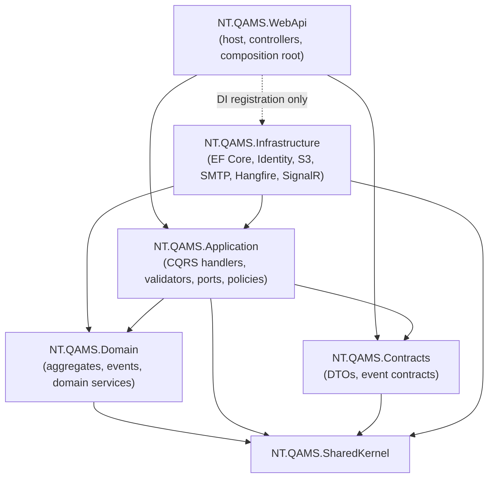
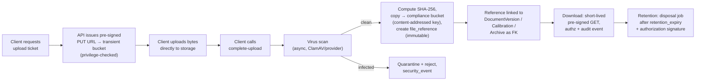

# NT.QAMS — Application Architecture & Implementation Blueprint

| | |
|---|---|
| **Product** | NT.QAMS — Multi-tenant SaaS Quality Assurance Management System |
| **Target stack** | .NET 9 · ASP.NET Core · Clean Architecture · CQRS/MediatR · EF Core 9 + PostgreSQL 17 · Angular 18 · SignalR · Hangfire · Redis |
| **Sources of truth** | `NT_QAMS_Product_Inventory.md` · `NT_QAMS_Domain_Model.md` (14 bounded contexts, 27 aggregates) · `NT_QAMS_Database_Architecture.md` (73 tables, 5 schemas) |
| **Scope** | Application architecture, CQRS design, API surface, security architecture, event architecture, implementation roadmap & sizing. **No production code.** |
| **Audience** | The senior development team that will build it; the architect review board that will hold them to it. |

**Overall style decision (made once, applies everywhere): a modular monolith.** One deployable ASP.NET Core application, with bounded contexts as **enforced internal modules** (namespace + architecture-test boundaries), not microservices. Rationale: the product's scale ceiling (hundreds of lab tenants, modest write rates) never justifies distributed-system costs; the compliance burden (Part 11 validation) multiplies per deployable; and the domain model's context boundaries give us clean extraction seams if one module ever earns independent deployment (the only realistic candidate: Analytical Quality's QC ingestion). This is a deliberate rejection of both the as-built "one 25,000-line component" extreme and the fashionable microservices extreme.

---

# PHASE 1 — CLEAN ARCHITECTURE STRUCTURE

## 1.1 Solution layout

```
NT.QAMS.sln
├── src/
│   ├── NT.QAMS.SharedKernel          (class library)
│   ├── NT.QAMS.Domain                (class library — module folders per bounded context)
│   ├── NT.QAMS.Application           (class library — module folders per bounded context)
│   ├── NT.QAMS.Contracts             (class library — API DTOs, integration event contracts)
│   ├── NT.QAMS.Infrastructure        (class library — persistence, identity, storage, jobs, realtime)
│   └── NT.QAMS.WebApi                (ASP.NET Core host — composition root)
└── tests/
    ├── NT.QAMS.Architecture.Tests    (dependency & module-boundary enforcement)
    ├── NT.QAMS.Domain.UnitTests
    ├── NT.QAMS.Application.UnitTests
    ├── NT.QAMS.Infrastructure.IntegrationTests   (Testcontainers PostgreSQL — real RLS)
    └── NT.QAMS.WebApi.FunctionalTests             (end-to-end API, multi-tenant denial suites)
```

Inside `Domain` and `Application`, one folder per bounded context: `Improvement/`, `DocumentControl/`, `AuditManagement/`, `AnalyticalQuality/`, `Equipment/`, `Competency/`, `RiskGovernance/`, `SupplierQuality/`, `Records/`, `Organization/`, `IdentityAccess/`, `Tenancy/`, `Notifications/`, `ComplianceLedger/`. ⚔ *Why folders, not 14 project pairs:* 28+ csproj files buy compile-time isolation at the price of solution sludge and cross-cutting friction; the same isolation is enforced cheaper by `NT.QAMS.Architecture.Tests` (NetArchTest-style rules: "Domain.Improvement may not reference Domain.DocumentControl", "Application may not reference Infrastructure"). Boundary violations fail CI, not code review.

## 1.2 Project responsibilities & reference rules

| Project | Responsibilities | May reference | Forbidden |
|---|---|---|---|
| **SharedKernel** | The 3-item shared kernel (`TenantId`, `UserRef`, `LocalizedText`) + base abstractions: `AggregateRoot`, `Entity`, `ValueObject`, `IDomainEvent`, `Result`/error types, `ITenantScoped`, clock abstraction | nothing | everything else; **no business logic ever** |
| **Domain** | Aggregates, value objects, domain events, domain services, state machines, invariants, SoD rules — one folder per context | SharedKernel | EF Core, MediatR, ASP.NET, any Infrastructure/Application type, other contexts' internals (cross-context = events + refs only) |
| **Application** | CQRS commands/queries/handlers, validators, policies/process managers, port interfaces (`IApplicationDbContext` per module slice, `IFileStorage`, `IEmailSender`, `IESignatureVerifier`, `ICurrentTenant`, `ICurrentUser`), authorization requirements | Domain, SharedKernel, Contracts | Infrastructure, EF Core concrete types, ASP.NET types |
| **Contracts** | Request/response DTOs, integration-event payloads, SignalR message contracts, privilege-code constants — the API's published language, versionable | SharedKernel (ids only) | Domain (DTOs never expose aggregates) |
| **Infrastructure** | EF Core DbContext + configurations + interceptors (tenant, audit, outbox), migrations, RLS session management, ASP.NET Identity + JWT + MFA, S3 storage adapter, SMTP adapter, Stripe ACL, Hangfire jobs, SignalR hub, projection workers, Redis cache | Application (implements its ports), Domain, SharedKernel | WebApi |
| **WebApi** | Controllers (thin: bind → send → map), middleware pipeline, auth wiring, DI composition root, OpenAPI, health checks | Application, Contracts, Infrastructure (composition root only) | direct DbContext/EF usage in controllers |
| **Tests** | As named; Architecture.Tests is a first-class citizen — it *is* the module boundary | respective targets | — |

## 1.3 Dependency diagram



The arrows are the law: dependencies point inward; Domain knows nothing about persistence, transport, or scheduling. Infrastructure *implements* Application's ports (dependency inversion) — the dotted WebApi→Infrastructure edge exists solely so the composition root can register implementations.

## 1.4 Request pipeline (one shape for every command)

`Controller → MediatR → [Logging → Authorization(privilege) → Validation(FluentValidation) → TenantGuard → UnitOfWork+Outbox] → Handler → Aggregate → SaveChanges (tenant-stamp + audit-trail + outbox interceptors, one transaction)` — then the outbox dispatcher publishes domain events to in-process policy handlers, projections, SignalR, and Hangfire continuations. Pipeline behaviors make the cross-cutting rules unskippable; a handler cannot forget authorization the way the as-built controllers did.

---

# PHASE 2 — APPLICATION MODULE MAPPING

| Bounded context | Application module | Depends on (via contracts/events only) |
|---|---|---|
| Tenancy & Billing (G2) | `Tenancy` | — (root of the world); Stripe via ACL port |
| Identity & Access (G1) | `IdentityAccess` | Tenancy (tenant lifecycle events) |
| Organization & Reference (S4) | `Organization` | Tenancy (seeding on provision) |
| Document Control (C2) | `DocumentControl` | Organization (OrgUnitRef), IdentityAccess (authz, signatures), Files |
| Improvement — NC/CAPA/Complaints (C1) | `Improvement` | Organization, IdentityAccess, Notifications (SLA arming via events) |
| Audit Management (C3) | `AuditManagement` | Improvement (FindingRaised → NC event loop), Organization |
| Analytical Quality (C4) | `AnalyticalQuality` | Organization (TestRef), Equipment (lockout events), Improvement (PtUnsatisfactory → NC) |
| Equipment & Calibration (C5) | `Equipment` | Organization, Files (certificates) |
| Competency & Training (C6) | `Competency` | DocumentControl (DocumentPublished → training), IdentityAccess |
| Risk & Governance (S1) | `RiskGovernance` | Organization; Reporting read models (review input packs) |
| Supplier Quality (S2) | `SupplierQuality` | Improvement (SupplierIncident → NC), Files |
| Records & Retention (S3) | `Records` | all quality modules (archive by ref), Files |
| Notification & Escalation (G3) | `Notifications` | consumes everyone's events; SMTP/SignalR ports |
| Compliance Ledger (G4) | `ComplianceLedger` | consumes everyone's events; append-only |
| *(read side)* | `Reporting` | projections over all modules' events |

**Rule:** a module's Application code may send another module's *public commands* or subscribe to its *events*, but never touch its Domain types or tables. Architecture tests enforce it.

---

# PHASE 3 — CQRS DESIGN

## 3.1 CQRS boundaries — what the split means here

- **Write model** = the aggregates from the Domain Model, loaded whole, mutated only via state-machine methods, persisted with optimistic concurrency. Commands return ids/refs, never rich payloads.
- **Read model** = the `read` schema projections + purpose-built EF `AsNoTracking` queries. Queries never load aggregates and never trigger domain logic.
- **One database, two schemas** — this is CQRS-as-discipline, not event sourcing. ⚔ *Event sourcing is explicitly rejected:* Part 11 needs a tamper-evident trail, which the audit ledger provides at a fraction of ES's operational cost; replayable state adds nothing a lab QMS needs.
- **Background operations** are commands too — Hangfire jobs and event policies dispatch the same MediatR commands users do (e.g. the calibration sweep sends `MarkCalibrationDue`), so every state change flows through the same guarded pipeline. Jobs never touch the DbContext directly.

## 3.2 Per-module command/query inventory (named exhaustively for the core; representative for admin modules)

| Module | Commands (count) | Queries (count) | Read models |
|---|---|---|---|
| **Improvement** | RaiseNc, SubmitNc, TriageNc, RejectNc, RecordRca, PlanCapaAction, CompleteCapaAction, SubmitNcForVerification, VerifyNc, RecordEffectivenessCheck, CloseNc, ReopenNc, LogComplaint, AcknowledgeComplaint, ValidateComplaint, RecordComplaintOutcome, ResolveComplaint, CloseComplaint (**18**) | NcList (filter/page), NcDetail, NcActivity, CapaBoard (open actions by owner/due), ComplaintList, ComplaintDetail (**6**) | `nc_list_item`, `capa_board_item`, `record_activity` |
| **DocumentControl** | CreateDocument, DraftNewVersion, SubmitForReview, RecommendVersion, RejectVersion, PublishVersion, MakeObsolete, UpdateTrainingMatrix (**8**) | DocumentList, DocumentDetail, VersionHistory, PendingApprovals, TrainingMatrix (**5**) | `document_register`, `pending_approvals` |
| **AuditManagement** | CreateAuditProgram, ScheduleAudit, StartAudit, AnswerChecklistItem, RaiseFinding, AcknowledgeFindingNc, SignOffAuditReport (**7**) | ProgramOverview, AuditList, AuditDetail (checklist+findings), FindingRegister (**4**) | `audit_calendar`, `finding_register` |
| **AnalyticalQuality** | ConfigureValidationStudy, EnterMeasurementSeries, VoidSeries, RecalculateStudy, SignOffStudy, CreateQcProfile, RecordQcRun, LogQcTroubleshooting, EnrollPt, RecordPtResult (**10**) | StudyList, StudyDetail, LeveyJenningsWindow, QcRunLog, PtScorecard, AnalytePerformance (**6**) | `mv_qc_levey_jennings`, `pt_scorecard` |
| **Equipment** | RegisterEquipment, LogCalibration, LogMaintenance, MarkCalibrationDue (system), LockOutEquipment (system), RetireEquipment (**6**) | EquipmentList, EquipmentDetail, CalibrationSchedule, DueList (**4**) | `calibration_status_board` |
| **Competency** | AssignTraining, CompleteTraining, ScoreAssessment, AuthorizeCompetency, RevokeCompetency, ExpireCompetency (system) (**6**) | CompetencyMatrix (person×subject), TrainingQueue, CompetencyDetail, ExpiryForecast (**4**) | `competency_matrix` |
| **RiskGovernance** | AssessRisk, AddMitigationAction, CloseRisk, ProposeChange, ApproveChange, CloseChange, ScheduleReview, RecordReviewDecision, CloseReview (**9**) | RiskRegister (heat map), RiskDetail, ChangeList, ReviewList, ReviewDetail (**5**) | `risk_heatmap` |
| **SupplierQuality** | RegisterSupplier, ApproveSupplier, SuspendSupplier, AddCertificate, RecordEvaluation, RecordSupplierIncident (**6**) | SupplierList, SupplierDetail, EvaluationHistory (**3**) | `mv_supplier_scorecard` |
| **Records** | ArchiveRecord, RetrieveRecord, ReturnRecord, AuthorizeDisposal (**4**) | ArchiveList, ArchiveDetail, RetentionForecast (**3**) | — |
| **Organization** | Create/Update/Deactivate × Branch, Department; UpsertTestCatalogItem, DeactivateTestCatalogItem; UpsertLovEntry, DeactivateLovEntry (**10**) | OrgTree, TestCatalog, LovByCategory, LovAdmin (**4**) | — (reference data reads direct) |
| **IdentityAccess** | RegisterUser, UpdateUserProfile, DeactivateUser, AssignRoles, SetOrgScope, CreateRole, UpdateRolePrivileges, EnrollMfa, ConfirmMfa, SetSignaturePin, RevokeSession, UnlockUser (**12**) | UserList, UserDetail, RoleList, PrivilegeMatrix, ActiveSessions (**5**) | `privilege_cache` (Redis) |
| **Tenancy** | SubmitProvisioningRequest, VerifyContact, ApproveProvisioning, RejectProvisioning, SuspendTenant, ReactivateTenant, UpdateTenantSettings, ChangePlan, ProcessStripeWebhook (**9**) | TenantList, TenantDetail, ProvisioningQueue, SubscriptionStatus (**4**) | control-plane reads |
| **Notifications** | UpsertNotificationRule, UpsertTemplate, UpsertSlaDefinition, SendTestEmail, RetryDispatch, CompleteWorkTask (**6**) | RuleList, TemplateList, DispatchMonitor, MyTasks, SlaDefinitions, EscalationBoard (**6**) | `my_tasks`, `dispatch_monitor` |
| **ComplianceLedger** | — (append via event consumers only) (**0**) | RecordTrail (by subject), SignatureLog, ChainVerificationReport, SecurityEvents (**4**) | ledger *is* the read model |
| **Reporting** | — (**0**) | DashboardKpis, QualityStatistics, TrendSeries, SlaCompliance, NcPareto, ReviewPackData, ExportPage, KpiHistory (**8**) | `mv_dashboard_kpis`, `read.kpi_snapshot`, `mv_sla_compliance`, `mv_nc_pareto` |

## 3.3 Totals

| Metric | Count |
|---|---|
| Commands | **111** |
| Queries | **71** |
| Command/query handlers | 182 |
| Event handlers (policies, projectors, ledger appenders, notification dispatch) | ≈ **40** |
| **Total MediatR handlers** | **≈ 222** |
| Validators (1 per command, a few per complex query) | ≈ **115** |

---

# PHASE 4 — APPLICATION SERVICES

⚔ **Challenge first:** in a CQRS system, per-module "WorkflowService" classes (`DocumentWorkflowService`, `NCRWorkflowService`, …) are an anti-pattern — they re-centralize what handlers + aggregates already own, and they rot into the God-objects this rebuild exists to escape. The workflow *is* the aggregate's state machine; the handler is its transaction script. Application services exist only where something genuinely doesn't fit one handler: multi-aggregate processes, external coordination, and cross-cutting capabilities. That yields two families:

## 4.1 Process managers (event-driven policies — the real "workflow services")

| Process manager | Module | Purpose / responsibilities | Dependencies |
|---|---|---|---|
| `ComplaintToNcProcess` | Improvement | On `ComplaintValidated`: send RaiseNc (source=Complaint), write back nc_id | Improvement commands |
| `FindingToNcProcess` | Improvement / AuditManagement | On `FindingRaised(grade=NC)`: RaiseNc (source=Audit); on `NcRaised(source=Audit)`: AcknowledgeFindingNc — closes the sign-off gate loop | both modules' commands |
| `PtFailureProcess` | AnalyticalQuality → Improvement | On `PtUnsatisfactory`: RaiseNc (source=PT) | Improvement commands |
| `TrainingAssignmentPolicy` | Competency | On `DocumentPublished`: create TrainingAssignments per training matrix | DocumentControl contracts, Competency commands |
| `EquipmentGatePolicy` | AnalyticalQuality | On `EquipmentLockedOut`/`ReturnedToService`: open/close result-entry gate per instrument | Equipment events |
| `EscalationProcess` | Notifications | On SLA-armed events (CapaActionPlanned, ComplaintLogged, WorkTask overdue): arm/advance/cancel EscalationTimers via SlaClock; on `SlaBreached`: ladder notifications + flag projections | SlaClock, Notification dispatch |
| `NotificationDispatchPolicy` | Notifications | On any ★event with a matching NotificationRule: resolve recipients, render template, enqueue dispatch (email via outbox job, in-app via SignalR) | rule/template stores, SMTP port, hub |
| `LedgerAppender` | ComplianceLedger | On every domain event / signature: append workflow_history & signature ledger rows | ledger store |
| `ProjectionEngine` (per read model) | Reporting | On events: update read.* projections; nightly KPI snapshot | read store |
| `ProvisioningOrchestrator` | Tenancy | Saga: approve → create tenant → seed admin+roles (IdentityAccess) → seed org defaults (Organization) → activate → notify; compensates on failure | Tenancy, IdentityAccess, Organization commands |

## 4.2 Cross-cutting application services (capabilities behind ports)

| Service | Purpose | Responsibilities | Dependencies |
|---|---|---|---|
| `ESignatureApplicationService` | The only path to a signature | Verify MFA-fresh session + PIN (via domain `ESignatureService`), mint SignatureEnvelope, persist ledger record, return envelope to the calling handler | IdentityAccess, ComplianceLedger |
| `FileStorageService` | Attachment/document lifecycle façade | Issue upload tickets, drive scan→promote pipeline, register file_reference, issue download URLs (privilege-checked) | S3 port, virus-scan port |
| `ExportService` | PDF/Excel generation | Render register exports & report packs from read models (QuestPDF/ClosedXML behind ports); enforce export audit event | Reporting queries, ComplianceLedger |
| `CurrentTenant` / `CurrentUser` accessors | Ambient request identity | Resolve from JWT once per request; feed EF interceptors, RLS session config, authorization | JWT middleware |
| `PrivilegeEvaluator` | AuthZ decisions | `can(user, privilege, orgScope)` with Redis-cached privilege sets, invalidated on `PrivilegeMatrixChanged` | IdentityAccess store, Redis |

---

# PHASE 5 — DOMAIN SERVICES

(From the Domain Model §8 — restated here as the implementable contract.)

| Domain service | Inputs | Outputs | Rules |
|---|---|---|---|
| `ReferenceNumberGenerator` | tenant, ref type, date | issued `ReferenceNumber` | Atomic counter per (tenant, type, year); same transaction as the insert; never reused, never recomputed |
| `SegregationOfDutiesPolicy` | rule id, identities in play (raiser/closer, author/approver, auditor/owner, assessor/trainee, creator/approver) | pass / typed violation (e.g. `SOD-CAPA-001`) | The 5 SoD rules; evaluated inside aggregate transitions; violations are domain errors surfaced as 403-class API problems |
| `ESignatureService` (domain half) | signer identity, PIN proof, meaning statement, subject ref + content hash | `SignatureEnvelope` | PIN valid + session MFA-fresh (≤ configurable minutes); envelope immutable; meaning statement mandatory (Part 11 §11.50) |
| `SlaClock` | armed event, SlaDefinition, tenant working calendar | deadline; escalation level transitions | Working-hours arithmetic; ladder 0→1 (+24h owner) →2 (+48h dept head) →3 (+72h QM); cancel on subject closure |
| `WestgardEvaluator` | new QC value, profile targets/rules, run window | `WestgardVerdict` | 1-3s, 2-2s, R-4s, 10-x reject; 1-2s warn-only; verdict computed once at insert, stored as fact |
| `ZScoreCalculator` | result, assigned value, SD | `ZScore` + `PerformanceCategory` | abs(z) ≤ 2 satisfactory; 2–3 questionable; ≥ 3 unsatisfactory → emits PT failure |
| `EquipmentLockoutPolicy` | schedule, last calibration, grace, tenant lead-days | proposed transition (due / lockout / none) | Sweep proposes, aggregate disposes; lockout emits the gate event |
| `RetentionPolicy` | retention class, archive date | expiry date; disposal eligibility | Disposal only after expiry + authorization signature; bulk-archive eligibility query (>5y) |
| `RiskScoringRules` (VO factories) | likelihood, impact (both explicit) | RPN; residual RPN | 1–5 ranges; residual > 12 emits HighResidualRisk; no defaults |

---

# PHASE 6 — API DESIGN

## 6.1 Conventions

REST, tenant-scoped routes under `/api/…` (tenant from JWT — never from URL/header ⚔, correcting the as-built spoofable header). **Workflow transitions are verbs-as-subresources**: `POST /api/nonconformances/{id}/triage`, `/verify`, `/close` — not `PUT` on a status field, because transitions carry payloads (signatures, comments) and map 1:1 to commands. Queries are `GET` with filter/paging contracts from `Contracts`. Errors: RFC 7807 problem details, domain errors carry machine-readable codes (`SOD-CAPA-001`).

## 6.2 Controller inventory

| Module | Controllers | Main endpoints (representative) |
|---|---|---|
| Tenancy (control plane) | `ProvisioningController`, `TenantsAdminController`, `SubscriptionsController`, `StripeWebhookController` | request wizard POSTs; approve/reject; suspend/reactivate; settings; webhook intake |
| IdentityAccess | `AuthController`, `UsersController`, `RolesController`, `SessionsController` | login (+MFA), refresh, logout; user CRUD-ish + role assignment + org scope; privilege matrix; session revoke |
| Organization | `BranchesController`, `DepartmentsController`, `TestCatalogController`, `LovsController` | create/update/deactivate; trees & lists |
| DocumentControl | `DocumentsController` | create, draft version, submit/recommend/reject/publish/obsolete, register, detail, versions, pending approvals, training matrix |
| Improvement | `NonconformancesController`, `ComplaintsController` | raise…close transitions (9), CAPA subresource, activity; complaint lifecycle (6) |
| AuditManagement | `AuditProgramsController`, `AuditsController` | program CRUD; schedule/start/answer/finding/sign-off; registers |
| AnalyticalQuality | `ValidationStudiesController`, `QcController`, `PtController` | study wizard transitions; profile CRUD + run intake + LJ window; enrollment + results |
| Equipment | `EquipmentController` | register, calibration/maintenance logs, retire, due list, status board |
| Competency | `CompetenciesController`, `TrainingAssignmentsController` | assign, complete, score, authorize, revoke; matrix, queue |
| RiskGovernance | `RisksController`, `ChangeRequestsController`, `ManagementReviewsController` | assess/mitigate/close; propose/approve/close; schedule/decide/close |
| SupplierQuality | `SuppliersController` | register, approve/suspend, certificates, evaluations, incidents |
| Records | `ArchivesController` | archive, retrieve, return, authorize disposal, retention forecast |
| Notifications | `NotificationAdminController`, `WorkTasksController` | rules/templates/SLA defs, test email, retry; my-tasks queue, complete |
| ComplianceLedger | `ComplianceController` | record trail, signature log, chain verification report, security events |
| Reporting | `DashboardController`, `ReportsController` | KPIs, statistics, trends, Pareto, SLA, review pack data, exports (PDF/XLSX) |
| Files | `FilesController` | upload ticket, complete/scan status, download (pre-signed) |
| Platform | `HealthController` (+ OpenAPI/Scalar dev-only) | liveness/readiness |

## 6.3 Totals & categories

| Metric | Estimate |
|---|---|
| Controllers | **≈ 32** |
| Endpoints | **≈ 200** (111 command + 71 query + ~18 auth/files/webhook/health) |
| — CRUD-ish (reference/admin data) | ≈ 55 |
| — Workflow (state transitions + signatures) | ≈ 75 |
| — Reporting/read | ≈ 50 |
| — Administration/platform | ≈ 20 |

---

# PHASE 7 — AUTHORIZATION ARCHITECTURE

## 7.1 Authentication

JWT access tokens (15 min) + rotating refresh tokens bound to `user_session` rows (revocable server-side — admin force-logout works within one access-token lifetime; privileged operations check the session registry live). **MFA (TOTP) mandatory for all active accounts** (resolved contradiction). Lockout: 5 failures → 30 min. Login, MFA events, lockouts → `security_event`. Token claims: `sub`, `tenant_id`, `session_id`, display name — **no roles or privileges in the token** ⚔: privilege sets change mid-session (the spec demands "applies instantly"), so tokens carry identity and the server resolves authorization per request from the Redis-cached `PrivilegeEvaluator` (invalidated on `PrivilegeMatrixChanged`).

## 7.2 Authorization model — three layers

1. **Privilege gate (coarse):** every command/query declares a required `PrivilegeCode` (`OBJECT.ACTION`, the ~70-code catalog); a MediatR authorization behavior evaluates it before validation. Deny by default — a handler without a declared privilege fails an architecture test.
2. **Org scope (row-level):** `user_org_scope` grants restrict reads/writes to branches/departments; applied in query filters and checked on write commands.
3. **Domain rules (fine):** SoD and state-machine guards inside aggregates — authorization the *matrix* can't express (e.g. "closer ≠ raiser") lives in the domain, not in policy config.

## 7.3 Canonical roles & role–permission matrix (seed defaults; tenant-editable)

| Privilege family (examples) | Platform Admin | Tenant Admin | Quality Manager | Lab Director | Dept Head | Analyst | Equipment Owner | External Auditor |
|---|---|---|---|---|---|---|---|---|
| TENANT.* (provision, suspend, plans) | ✔ | — | — | — | — | — | — | — |
| USER.*, ROLE.MANAGE, LAB.CONFIG | — | ✔ | — | — | — | — | — | — |
| DOC.CREATE / DOC.REVIEW / DOC.APPROVE / DOC.OBSOLETE | — | — | ✔ (approve) | ✔ | ✔ (review) | create | — | view |
| NCR.CREATE / TRIAGE / INVESTIGATE / ACTION_PLAN / VERIFY / CLOSE / REOPEN | — | — | triage•verify•close•reopen | view all | investigate•plan | create | — | view |
| AUDIT.PLAN / EXECUTE / SIGNOFF | — | — | ✔ | ✔ (signoff) | — | — | — | view |
| EQUIP.REGISTER / CALIB_SCHED / CALIB_LOG / RETIRE | — | — | ✔ | — | ✔ | log | ✔ | view |
| COMP.ASSIGN / SCORE / AUTHORIZE / REVOKE | — | — | authorize•revoke | — | score | complete own | — | view |
| QC.RUN_LOG / MV.SIGNOFF / PT.RECORD | — | — | signoff | ✔ | ✔ | log | — | view |
| RISK.* / CHANGE.APPROVE / REVIEW.CHAIR | — | — | ✔ | chair•approve | propose | — | — | view |
| SUP.REGISTER / APPROVE / EVALUATE | — | — | approve•evaluate | — | — | register | — | view |
| ARCHIVE.* / DISPOSAL.AUTHORIZE | — | — | ✔ | authorize | — | — | — | view |
| NOTIF.CONFIG / SLA.CONFIG | — | ✔ | ✔ | — | — | — | — | — |
| LEDGER.VIEW / SECURITY.VIEW | — | ✔ | ✔ | ✔ | — | — | — | ✔ (ledger) |

**Context access matrix:** Platform Admin touches only Tenancy (never tenant quality data — enforced by role grants *and* by the control-plane DB role split). External Auditor: read-only, time-boxed accounts, exports logged. All other roles: per matrix above, org-scoped.

## 7.4 Compliance restrictions

- **Approval restrictions:** every Approve/Verify/Close/SignOff command requires (a) the privilege, (b) SoD pass, (c) a fresh `SignatureEnvelope` — three independent layers; the API cannot express an unsigned approval.
- **Part 11:** signature = authenticated MFA session + per-user PIN + meaning statement; signature records immutable; signed content hash-linked. Changing the privilege matrix, revoking sessions, and every signature attempt (success or failure) land in `security_event`.
- **Unknown role ⇒ no access** — the as-built "default to manager" fallback is explicitly banned and covered by a functional test.

---

# PHASE 8 — EVENT ARCHITECTURE

## 8.1 Event taxonomy & flow

- **Domain events** — raised by aggregates, collected by the DbContext, written to `outbox_event` in the same transaction, then dispatched in-process (MediatR notifications) by the outbox processor. At-least-once; consumers idempotent (natural keys: event id).
- **Integration events** — the same stream, but with `Contracts` payloads; today's only true external consumers are SignalR clients and (future) webhooks — the modular monolith keeps everything else in-process.
- **SignalR** (tenant-group hub): `NotificationReceived` (bell), `WorkTaskAssigned`, `RecordChanged {module, id, ref}` (targeted list refresh), `KpiUpdated`. ⚔ Replaces the as-built firehose `TenantDataUpdated` ("re-download everything") with targeted invalidation.
- **Hangfire jobs** (all dispatch commands through the pipeline; no direct DB access): `OutboxDispatcher` (continuous), `CalibrationSweep` (daily), `DocumentReviewSweep` (daily), `CompetencyExpirySweep` (daily), `SupplierCertSweep` (daily), `SlaEscalationTick` (5 min), `KpiSnapshot` (nightly), `MatViewRefresh` (5–15 min tiered), `RetentionPurge` (nightly: dispatch logs, sessions, outbox), `HashChainVerifier` (nightly), `EmailSender` (queue drain, retries w/ backoff).

## 8.2 Key event routing table

| Event | Producer | Consumers |
|---|---|---|
| `NcRaised` | Improvement | Notifications (rule: severity-routed), Ledger, Projections, `FindingToNcProcess` (ack when source=Audit) |
| `CapaActionPlanned` | Improvement | `EscalationProcess` (arm SLA timer), Notifications, Ledger |
| `NcClosed` | Improvement | Escalation (cancel timers), Complaint close-gate re-check, Projections, Ledger |
| `ComplaintValidated` | Improvement | `ComplaintToNcProcess`, Notifications, Ledger |
| `DocumentPublished` | DocumentControl | `TrainingAssignmentPolicy`, Notifications, Projections, Ledger |
| `DocumentVersionObsoleted` | DocumentControl | Watermark job (derived file), Ledger |
| `FindingRaised` | AuditManagement | `FindingToNcProcess`, Notifications, Ledger |
| `AuditReportSignedOff` | AuditManagement | Ledger (lock), Projections, Notifications |
| `CalibrationDue` / `EquipmentLockedOut` / `ReturnedToService` | Equipment | Notifications + WorkTask; `EquipmentGatePolicy` (AQ gate); Projections; Ledger |
| `QcOutOfControl` | AnalyticalQuality | Notifications, release-gate projection, Ledger |
| `PtUnsatisfactory` | AnalyticalQuality | `PtFailureProcess`, Notifications, Ledger |
| `CompetencyExpiring` / `Expired` | Competency | Notifications (trainee+manager), authorization checks, Projections |
| `HighResidualRisk` | RiskGovernance | Notifications (QM), dashboard projection |
| `SupplierCertificateExpiring` / `SupplierSuspended` | SupplierQuality | Notifications (purchaser), Projections, Ledger |
| `SlaBreached` / `EscalationTriggered` | Notifications | Notifications (ladder), WorkTask creation, overdue-flag projections |
| `SignatureCaptured` | ESignature service | Ledger (signature record) |
| `TenantProvisioned` | Tenancy | IdentityAccess (seed admin), Organization (seed defaults), Notifications (welcome) |
| `PrivilegeMatrixChanged` | IdentityAccess | `PrivilegeEvaluator` cache invalidation, security_event |
| *(every state transition)* | all workflow aggregates | `LedgerAppender` (workflow_history), `ProjectionEngine`, `NotificationDispatchPolicy` (rule-matched) |

**The one structural rule** (repeated because it is the rebuild's most important habit change): producers never call Notifications, the Ledger, SignalR, or email inline. They commit state + outbox; everything reactive hangs off the stream. This is what makes API-originated, job-originated, and UI-originated changes behave identically — the exact property the prototype lacked.

# PHASE 9 — FILE STORAGE ARCHITECTURE

## 9.1 Design (application view of the DB architecture's storage decision)

S3-compatible object storage (AWS S3 / MinIO on-prem / Azure via gateway) behind an `IFileStorage` port; the DB holds only `file_reference` rows. Two buckets: a **compliance bucket** (WORM/object-lock, versioning on — signed documents, certificates, evidence) and a **transient bucket** (upload staging, generated exports with TTL).

## 9.2 Complete lifecycle



- **Attachments vs documents:** same pipeline; documents get the full version/signature treatment, generic attachments (evidence photos, RCA files) just get a reference + parent FK.
- **Versioning:** a new document version = new upload + new object + new `file_reference`; **originals never overwritten** — the signed bytes are provably the signed bytes (SHA-256 in the signature record).
- **Retention:** `RetentionPolicy` + `archive_entry`; only the `qams_retention` role deletes, only after expiry + authorization, disposal logged.
- **Watermarking (FR-DOC-03):** obsolete versions get a *derived* "OBSOLETE — UNCONTROLLED" object generated by a job and stored as a separate reference — the signed original is untouched.
- **Metadata** (on `file_reference`): storage key, SHA-256, size, MIME, original filename, uploader, scan status/date, bucket. Direct client↔storage transfer keeps large files off the app tier entirely — the direct correction of base64-in-JSON.

---

# PHASE 10 — REPORTING ARCHITECTURE

## 10.1 Layers (application view of the DB reporting design)

1. **Dashboards** — Angular reads `read.*` projections / materialized views only; never aggregates over operational tables. KPI cards + drill-through map to `DashboardKpis` / `QualityStatistics` queries.
2. **Read models** — outbox-fed projections (`nc_list_item`, `capa_board_item`, `competency_matrix`, `risk_heatmap`, `record_activity`, …) and `read.kpi_snapshot` (daily rows → **real** trend history, ending fabricated PRNG trends).
3. **Analytics / materialized views** — `mv_dashboard_kpis`, `mv_sla_compliance`, `mv_qc_levey_jennings`, `mv_nc_pareto`, `mv_supplier_scorecard`, `mv_management_review_pack`; refreshed `CONCURRENTLY` on tiered schedules; forensic/heavy queries hit the read replica.
4. **KPIs** — the Quality Health Score model (weighted sub-scores) computed in the projection layer from real events; each KPI query declares its source view + freshness stamp shown in the UI.

## 10.2 Exports & scheduled reports

- **PDF** — server-side via a rendering port (e.g. QuestPDF); the Management Review Pack and register exports are first-class, not browser-print. Every export emits an audit event (who exported what).
- **Excel** — real XLSX via a spreadsheet port (e.g. ClosedXML), not the as-built HTML-as-`.xls` trick.
- **Scheduled reports** — Hangfire jobs render packs on cadence, store to the transient bucket, and dispatch a notification with a pre-signed link; the review pack additionally freezes its inputs into `review_input_snapshot` so the reviewed evidence is preserved.
- **Expensive reports** (QC trends, SLA compliance, review pack) — served from materialized views/snapshots, never computed interactively.

---

# PHASE 11 — IMPLEMENTATION ROADMAP

Delivery principle: **build the spine before the organs.** Foundation + Identity/Tenancy + one vertical slice (Documents) proves the whole architecture (RLS, CQRS, outbox, signatures, files, audit) end-to-end before the module factory scales. Each phase ships a *demonstrable, tenant-isolated, audited* increment.

| Phase | Purpose | Depends on | Key deliverables | Primary risk & mitigation |
|---|---|---|---|---|
| **0 — Foundation** | Prove the architecture skeleton with one trivial aggregate | — | Solution + 6 projects; architecture tests; DbContext + tenant/audit/outbox interceptors; RLS + low-priv roles; MediatR pipeline (authz/validation/UoW); Testcontainers harness; CI (build+test+arch-tests+**cross-tenant-denial** suite); one reference module (QamsEntity-equivalent) walking skeleton | Getting RLS + pipeline wrong here poisons everything → invest in the multi-tenant denial test suite as the definition of done |
| **1 — Identity + Tenancy** | Who can log in, and the tenant lifecycle | 0 | JWT+MFA+lockout+sessions; user/role/privilege model + `PrivilegeEvaluator` (Redis); provisioning saga; control-plane role split; security_event | Auth is load-bearing for all authz → penetration-test this phase before proceeding |
| **2 — Document Control** | The first full compliance vertical slice | 0,1 | Full doc lifecycle + versioning; **ESignature service + ledger** (built here, reused everywhere); **file pipeline** (built here); workflow_history; SoD rule #2; DocumentPublished event | Signatures + files are the two hardest cross-cutting capabilities — deliberately front-loaded so every later module inherits them proven |
| **3 — NCR + CAPA (+ Complaints)** | The core quality engine | 0,1,2 | 9-state NC machine, CAPA/RCA/effectiveness, complaints, SLA arming + escalation, notification dispatch policy | Richest aggregate + first heavy event choreography → model the state machine test-first |
| **4 — Audit Management** | Audit execution + the finding→NC loop | 0,1,2,3 | Programs/audits/checklists/findings; FindingToNcProcess ↔ NcRaised ack loop; report lock | First cross-context saga — proves the event contract; test the ack-loop for stuck sign-offs |
| **5 — Equipment** | Calibration + lockout gate | 0,1,2 | Equipment lifecycle, calibration/maintenance, CalibrationSweep, lockout events | Time/sweep-driven state → deterministic clock abstraction for tests |
| **6 — Competency** | Training + authorization | 0,1,2 (DocumentPublished) | Competency machine, training assignment policy, expiry sweep | Depends on doc events — validate the training-matrix junction early |
| **7 — Risk + Change + Mgmt Review** | Governance rituals | 0,1,2 | Risk register/heatmap, change (risk-gated approval), management review (+ input snapshots) | Interlocking rules (change needs risk) → encode as aggregate invariants, not UI checks |
| **8 — Supplier Quality** | External-party lifecycle | 0,1,2,3 (incident→NC) | Supplier approval, certificates + expiry sweep, evaluations | Straightforward; low risk |
| **9 — Analytical Quality** | The differentiator (MV/QC/PT) | 0,1,2,5 (equipment gate) | Validation studies + CLSI stats, QC profiles/runs (partitioned) + Westgard, PT + z-score→NC | Statistical correctness + QC write volume → validate math against reference datasets; partition from day one. (Sequenced late deliberately: highest-value, but depends on Equipment + a proven platform) |
| **10 — Compliance & Reporting** | Make it demonstrable & sellable | all | Full ledger UIs, chain verifier, projections/mat views, dashboards, PDF/XLSX exports, scheduled packs, KPI snapshots | Reporting is easy to under-invest in → but it is the demo surface; the fabricated-data ban is the acceptance criterion |

*(Compliance Ledger, Notifications, Organization, Records are not standalone phases — Ledger + Notifications + Organization are built inside Phase 0–3 as shared capabilities and hardened in Phase 10; Records rides Phase 10.)*

---

# PHASE 12 — IMPLEMENTATION SIZE

| Module | Commands | Queries | Services (proc mgr + app) | Controllers | DTOs (rough) | Validators |
|---|---|---|---|---|---|---|
| Tenancy | 9 | 4 | 1 saga | 4 | ~24 | 9 |
| IdentityAccess | 12 | 5 | 1 | 4 | ~28 | 12 |
| Organization | 10 | 4 | — | 4 | ~20 | 10 |
| DocumentControl | 8 | 5 | — (+ shared ESig/File) | 1 | ~22 | 8 |
| Improvement | 18 | 6 | 3 processes | 2 | ~38 | 18 |
| AuditManagement | 7 | 4 | 1 process | 2 | ~22 | 7 |
| AnalyticalQuality | 10 | 6 | 2 policies | 3 | ~34 | 10 |
| Equipment | 6 | 4 | — | 1 | ~18 | 6 |
| Competency | 6 | 4 | 1 policy | 2 | ~18 | 6 |
| RiskGovernance | 9 | 5 | — | 3 | ~26 | 9 |
| SupplierQuality | 6 | 3 | — | 1 | ~18 | 6 |
| Records | 4 | 3 | — | 1 | ~12 | 4 |
| Notifications | 6 | 6 | 2 processes | 2 | ~22 | 6 |
| ComplianceLedger | 0 | 4 | 1 appender | 1 | ~12 | — |
| Reporting | 0 | 8 | projection engine | 2 | ~30 | — |
| **Totals** | **111** | **71** | **~15 services/processes** | **~33** | **~360 DTOs** | **~111** |

Plus cross-cutting: ~40 event handlers, ~11 Hangfire jobs, ~5 capability services, ~205 DB indexes (from DB phase). **Rough engineering scale: a disciplined senior team of 4–6 delivering Phases 0–4 in ~1 quarter, full build across ~9–12 months** — the module factory accelerates sharply after Phase 2 proves the pattern.

---

# PHASE 13 — ARCHITECT REVIEW

**1. Scalable?** Yes for the target: modular monolith on one cluster + read replica scales to hundreds of tenants; the outbox/projection split absorbs read load; the heaviest module (Analytical Quality QC ingestion) has a clean extraction seam if it ever needs independent scaling. Scaling is vertical-then-shard-by-tenant, not premature distribution.

**2. Enterprise SaaS suitable?** Yes: four-layer tenant isolation, single-pass migrations, per-request tenant identity from JWT, hybrid dedicated-DB tier for premium contracts, control-plane separation. The provisioning saga makes onboarding a first-class, auditable flow instead of the as-built localStorage simulation.

**3. CQRS suitable?** Yes, and *appropriately* scoped — CQRS-as-discipline (two schemas, outbox projections), not event sourcing. Commands flow through one guarded pipeline; reads never touch aggregates; background jobs use the same commands as users.

**4. 21 CFR Part 11 suitable?** The architecture delivers the system-level controls the DB substrate enables: mandatory MFA + PIN signatures with meaning statements, hash-linked signed content, immutable ledgers, deny-by-default authorization, complete security-event capture, and no path to an unsigned approval. Formal compliance still requires validation documentation (IQ/OQ/PQ) and SOPs — architecture makes it *demonstrable*.

**5. Biggest implementation risks:** (1) RLS/tenant-session discipline — one leak is catastrophic; mitigated by making cross-tenant-denial tests the Phase-0 definition of done. (2) Legacy blob-data migration — schemaless, inconsistent; a dedicated cleansing project, not a script. (3) Statistical correctness in Analytical Quality — validate against reference datasets. (4) Event-choreography debugging (stuck sagas, projection lag) — needs correlation ids, outbox-depth alarms, and idempotent consumers from day one.

**6. Over-engineering risks:** microservices (rejected), event sourcing (rejected), per-context csproj proliferation (rejected for folders+arch-tests), full temporal tables (rejected), speculative full-text search infra (deferred), a generic rules engine for SoD (rejected — rules live in aggregates). The standing danger is building framework before the second module proves the pattern — hence the walking-skeleton-first roadmap.

**7. Under-engineering risks:** treating authorization as `[Authorize]` only (the as-built failure — mitigated by the three-layer model + arch-tests); skimping on the outbox/idempotency (leads to lost notifications); under-investing in reporting (it is the demo/sales surface); weak signature/ledger implementation (the entire compliance claim rests on it — hence front-loaded in Phase 2).

**8. Build first:** Phase 0 foundation + Phase 1 identity/tenancy + Phase 2 Document Control as one proven vertical slice — it exercises every cross-cutting concern (RLS, CQRS, outbox, signatures, files, audit, SoD) on real functionality before scaling the module factory.

**9. Postpone:** Analytical Quality (Phase 9 — highest value but depends on a proven platform + Equipment), a real AI copilot (excluded from domain; later, as a read-model assistant behind an LLM ACL), LIMS/EHS (out of scope), the dedicated-DB hybrid tier (build shared-schema first; add isolation when a contract demands it), advanced full-text search.

**10. Executive summary (CTO/CEO):**

> The prior phases established that NT.QAMS is today a polished prototype with no defensible foundation. This blueprint defines how to build the real product: a **modular-monolith .NET 9 application** in Clean Architecture, with the domain's 14 bounded contexts as enforced internal modules, CQRS through a single guarded request pipeline, and an event-driven backbone (transactional outbox → projections, notifications, real-time, jobs) that makes UI-, API-, and job-triggered changes behave identically.
>
> The design is deliberately right-sized — no microservices, no event sourcing, no speculative infrastructure — because the product's scale is hundreds of laboratory tenants, and every extra deployable multiplies the regulatory validation burden. It is engineered around the three things the prototype got dangerously wrong: **tenant isolation** (now four independent layers, with cross-tenant-denial tests as the build's acceptance gate), **authorization** (now deny-by-default privilege + org-scope + domain-rule layers, replacing browser-only checks), and **compliance** (immutable hash-linked ledgers, mandatory MFA + PIN electronic signatures with meaning statements — no code path can produce an unsigned approval).
>
> Delivery is sequenced spine-first: a foundation and one complete, audited vertical slice (Identity → Tenancy → Document Control) prove the entire architecture — including the two hardest capabilities, electronic signatures and file handling — before the module factory scales. A senior team of 4–6 reaches that proof point in roughly a quarter and a full build in 9–12 months, with the highest-value differentiator (analytical quality: method validation, QC/Westgard, proficiency testing) sequenced late precisely because it depends on a platform already proven trustworthy. The result is a system that is not just feature-complete but *auditable, isolable, and validatable* — the properties an ISO 17025 / 21 CFR Part 11 lab actually buys.

---

# PHASE K — AI-ASSISTED DELIVERY ANALYSIS

**Premise:** the build is executed AI-first by **1 AI-assisted software engineer** (Claude Code, Cursor, ChatGPT, Copilot-class tooling, automated test/doc generation) under **1 Technical Lead** (architecture, review, governance). The AI is not autonomous; the engineer owns every merged line.

**One sentence of context that should govern all expectations:** *the current NT.QAMS prototype is itself the output of unsupervised AI-first development* — mock fallbacks reporting success, hardcoded credentials and PINs, fabricated dashboard data, and a backend that fails against a real database. The lesson is not "AI can't build this"; it is that **AI velocity without engineering governance produces convincing non-products.** Everything below assumes the governance half is real.

## K1 — Engineering Role Breakdown (AI-assisted developer)

| Responsibility | % effort | AI leverage | Notes |
|---|---|---|---|
| Backend implementation — CQRS handlers, validators, DTOs, EF mappings | 22% | **Very high** | The most patterned work in the codebase (222 handlers follow ~6 shapes); AI generates, engineer reviews against the blueprint |
| Angular frontend rebuild (modular app replacing the 25k-line component) | 18% | High | Component/service generation strong; UX state machines and RTL/i18n details need human care |
| Reviewing & correcting AI output | 12% | — | A first-class engineering activity, not overhead; grows with generation volume |
| Testing — unit, integration (Testcontainers/RLS), functional, cross-tenant denial suites | 12% | Medium-high | AI drafts tests well; *deciding what must be proven* (isolation, SoD, signatures) is human |
| Database implementation — migrations, RLS policies, partitions, indexes | 8% | Medium | Highly specified by the DB architecture doc; RLS verification is manual and non-negotiable |
| Debugging & integration hardening (outbox, SignalR, Hangfire, sagas) | 8% | Low-medium | Distributed-behavior bugs are where AI assistance is weakest |
| Security & compliance implementation (authz layers, e-signatures, ledgers, security events) | 7% | Low-medium | AI drafts; correctness is a human sign-off with the Tech Lead |
| API & contracts (controllers, OpenAPI, problem details) | 5% | Very high | Thin, mechanical layer |
| CI/CD, environments, deployment support | 4% | Medium | Pipeline-as-code generates well; environment truth is manual |
| Prompt/context engineering & architecture-artifact maintenance | 2% | — | Keeping the four blueprint documents as the AI's working context is what makes generation converge |
| Documentation generation & upkeep | 2% | Very high | |
| **Total** | **100%** | | |

**Technical Lead (≈ 0.4–0.5 FTE):** phase-gate reviews, architecture-test rule ownership, security/compliance sign-off, domain decisions with the product owner, unblocking design ambiguities before they become generated code.

## K2 — AI Productivity Impact

Baseline (Scenario A, traditional): from Phase 13 — a senior team of 4–6 for 9–12 months ⇒ **≈ 50–55 person-months** for the full build (backend, Angular, compliance hardening, migration tooling).

| Dimension | A: Traditional | B: AI-assisted | Improvement |
|---|---|---|---|
| Boilerplate (handlers/DTOs/validators/mappings/controllers) | ~40% of effort | generated, review-only | **−70–80%** in that band |
| Documentation | ~5% | generated from artifacts | **−60–70%** |
| Test authoring | ~15% | AI-drafted, human-directed | **−40–50%** |
| Implementation overall | 50–55 PM | **20–24 PM** | **−55–60% effort** |
| Review/debug/validation | ~15% of A | roughly constant absolute, so a *larger share* of B | ~0% (this is the floor) |
| Calendar (1 dev + lead model) | n/a for A | 14–18 months | — |
| Team-size equivalence | 4–6 seniors | 1 dev + 0.5 lead ≈ **2.5–3 traditional devs** | — |

The honest shape of the curve: AI compresses the *typing-shaped* 60–70% of this project dramatically because the architecture is unusually well-specified (that was the point of the four blueprint documents); it barely compresses the 30–40% that is judgment-shaped — isolation proofs, statistical validation, compliance sign-off, integration debugging.

## K3 — Implementation Duration Comparison

| Scenario | Estimated duration (calendar) | Person-months | Risk level |
|---|---|---|---|
| 1 — Single developer, no AI | 42–50 months | 45–50 | **Extreme** — multi-year solo build; obsolescence + burnout; effectively not viable |
| 2 — Single developer + AI, no lead | 18–24 months | 20–24 | **High** — velocity without independent review recreates the prototype's failure mode; bus factor 1 |
| 3 — **Single developer + AI + Technical Lead** | **14–18 months** | 20–24 dev + 6–8 lead | **Moderate** — the review loop converts speed into product; bus factor remains the residual risk |
| 4 — 3 developers, no AI | 16–20 months | 50–58 (coordination overhead) | Moderate |
| 5 — 3 developers + AI (+ lead) | **8–11 months** | 26–32 | **Moderate-low** — fastest credible path; parallelizes frontend / backend / analytical-quality math |

## K4 — Effective Team Size Equivalent

A strong AI-assisted developer under a technical lead, on **this specific project** (highly patterned CQRS, exhaustively pre-specified by the blueprint artifacts):

| Estimate | Equivalent traditional developers | Assumptions |
|---|---|---|
| Conservative | **2.0×** | Tooling friction, heavy review burden, integration debugging dominates mid-project |
| **Realistic** | **2.5–3.0×** | Blueprint docs used as standing AI context; module factory effect after Phase 2; disciplined phase gates |
| Aggressive | **4.0–4.5×** | Everything goes right: stable prompts/patterns, little rework, lead reviews never bottleneck. Do not staff a plan on this number |

Why this project multiplies well: 222 handlers in ~6 repeating shapes, a table-by-table DB spec, a named-command CQRS inventory, and existing trilingual UI content to port. Why it doesn't multiply infinitely: RLS proofs, Part 11 sign-off, Westgard/CLSI statistical validation, and saga debugging are constant-time human work regardless of tooling.

## K5 — Executive Summary for Management

- **Is this realistically deliverable by one AI-assisted developer?** Yes — *with the Technical Lead and phase gates*, in 14–18 months (Case 3). Without the lead: not recommended; the existing prototype is the documented result of exactly that configuration.
- **What risks remain despite AI?** (1) Bus factor of one — a single resignation stalls the program; mitigate with the lead's continuity and the blueprint artifacts as durable knowledge. (2) Plausible-but-wrong generated code — AI's characteristic defect is code that looks right and reviews clean but embeds a subtle behavioral error (the `0000` PIN class of bug); mitigate with the cross-tenant-denial and SoD test suites as merge gates, not post-hoc QA. (3) Review bottleneck — one lead reviewing one prolific generator; mitigate with architecture tests automating the mechanical half of review. (4) Compliance sign-off cannot be compressed — IQ/OQ/PQ validation is calendar time.
- **What cannot be delegated to AI?** Tenant-isolation verification, security posture, e-signature/Part 11 correctness, statistical algorithm validation against reference datasets, production incident response, and every *decision* — scope, sequencing, trade-offs, "is this actually correct for a lab."
- **What still requires senior engineering judgment?** Aggregate boundaries when reality diverges from the model; eventual-consistency windows per saga; performance triage; knowing when generated code should be rejected wholesale rather than patched.
- **Recommended staffing model:** **1 senior AI-assisted engineer (full-time) + 1 Technical Lead (0.4–0.5 FTE) + purchased-by-the-day specialist review at three gates** (security review after Phase 1, statistical validation in Phase 9, compliance/QA validation in Phase 10). If the 14–18-month calendar is commercially too slow, the correct accelerator is Case 5 (add 1–2 AI-assisted developers to parallelize Angular and Analytical Quality), not skipping gates.

## K6 — Final Project Delivery Estimate

| Model | Duration | Effort (PM) | Cost vs traditional | Delivery risk | Quality & maintainability considerations |
|---|---|---|---|---|---|
| Without AI (team of 4–6) | 9–12 months | 50–55 | baseline | Moderate | Conventional; quality set by team discipline |
| With AI (1 dev, no lead) | 18–24 months | 20–24 | **−55–60% cost** | **High** | Unreviewed AI throughput historically produced this product's prototype; maintainability depends entirely on one person's standards |
| **With AI + Technical Lead (recommended)** | **14–18 months** | **26–32 total** | **−40–50% cost** | **Moderate** | Blueprint-governed generation + gates yields *more* consistent code than a mixed human team (one set of patterns, enforced by architecture tests); documentation stays current because it is generated from the same artifacts |

> ## AI-Assisted Delivery Assessment for NT.QAMS
>
> NT.QAMS is an unusually good candidate for AI-first delivery: the four architecture artifacts specify the system down to named commands, tables, events, and policies, and ~60–70% of the implementation is highly patterned work that AI tooling generates reliably under review. A single strong AI-assisted engineer governed by a part-time Technical Lead can credibly deliver the full product in **14–18 months at roughly half the traditional cost** — equivalent to a 2.5–3-developer traditional team.
>
> The decisive success factor is not the AI tooling but the **governance loop around it**: architecture tests and cross-tenant/SoD test suites as merge gates, phase-gate reviews, and three purchased specialist checkpoints (security, statistics, compliance). The existing prototype stands as this project's own evidence of what AI-first development produces without that loop — impressive screens over hardcoded PINs and simulated success. Fund the engineer *and* the governance; the plan is sound. If time-to-market outweighs cost, scale to three AI-assisted developers and deliver in 8–11 months rather than compromising the gates.

---

*Designed 2026-07-21 from the Product Inventory, Domain Model, and Database Architecture. Next phases (implementation): physical schema & EF Core mapping conventions, API contract specification (OpenAPI), and the blob-store data-migration plan.*


---

# PHASE 7 — HQMS HOSPITAL EXTENSION, AS-BUILT ADDENDUM (2026-08)

Twelve new Application slices joined the solution (`IncidentReporting`, `QualityIndicators`, `Accreditation`, `AuditManagement/AuditProgramSlice`, `PatientExperience`, `Committees`, `Integration`, `PatientSafety`, `InfectionControl`, `TrainingManagement`, `MortalityReview`, `Credentialing`, `EnvironmentOfCare`) plus extension slices for Equipment (M14), SupplierQuality (M16), RiskGovernance change-control (M18) and DocumentControl R&U (M01). All follow the slice shape of §Phase-1 (commands/queries + validators + handlers over `IAppDbContext`). Open items below cite the 2026-08-28 audit register.

**Authorization.** Seven new permission modules were minted (`incidents`, `indicators`, `standards`, `surveys`, `committees`, `integration`, `patient-safety`, `infection-control`, `mortality-review`, `credentialing`, `environment-of-care`) and three modules were reused (`risks`→FMEA, `audits`→programmes, `training`→M12 catalogue). Every controller action is `[RequirePermission]`-gated or a recorded entry in the shrink-only `tests/NT.QAMS.Architecture.Tests/UngatedActions.approved.txt` snapshot (the as-built decision record for the pre-auth surface, the deliberately open incident intake, and the legacy read endpoints). Command-tier policies mirror the endpoints for the incident workflow and the M14/M16 additions (remediated M-09; `WorkflowCommandPolicyTests` pins the mirrors). **[open: M-07 — SystemRoleCatalog grants, upgrade release note, and the four role-matrix suites still owe the 11 new modules; XC-05's remaining legacy-attribute commands in RiskGovernance are untouched pending the same decision].**

**Ceremonies.** Part 11 signing ceremonies exist for incident close/sentinel (M02), change approve/ratify (M18 — SoD pre-checks precede `SignAsync` since M-01's remediation), and supplier approve. Committee minutes approval, credentialing decisions and CAR effectiveness close are permission-gated but unsigned **[open: M-16/PPL-22 — the signed-gate list needs one product ruling]**.

**Cross-module reads.** The Phase-2 rule ("never touch another module's Domain types or tables") is contradicted as-built by M08/M09/M10 reading `db.PatientStays` for rate denominators; the shared accrual arithmetic now lives in `SharedKernel.WindowedDays` (M-03), but the read itself awaits an ADR **[open: M-04]**. No Application-layer boundary test exists yet — `ModuleBoundaryTests` guards the Domain assembly only.

**Events & notifications.** Six of the new contexts raise no domain events, two declared events are never raised, and the incident escalation/sentinel notifications documented in the aggregate have no `INotificationHandler` subscribers **[open: M-06]** — the outbox/ledger sees only what §Phase-4's interceptors capture for those records.

*Addendum recorded 2026-08-28; the audit register is the source of truth for open items.*
