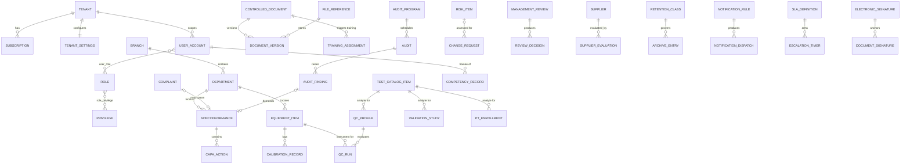
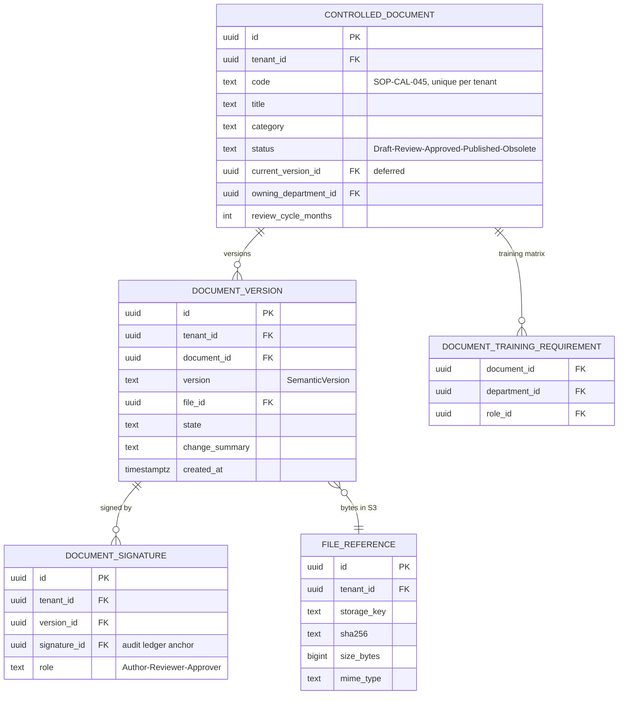
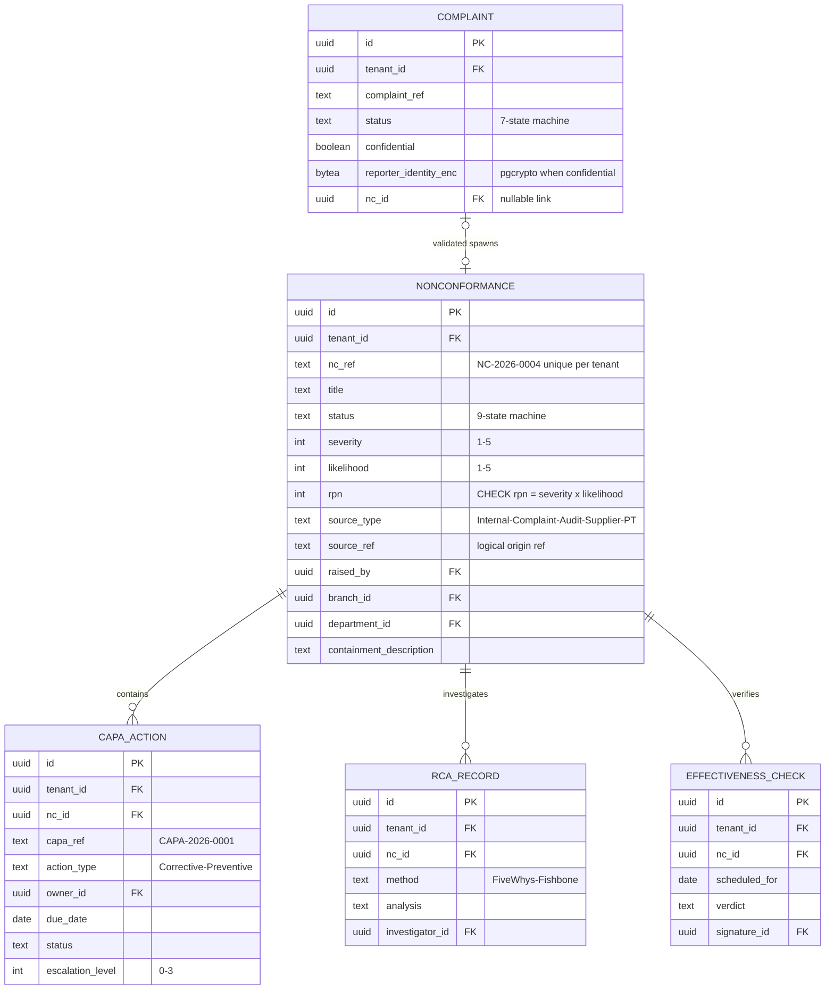
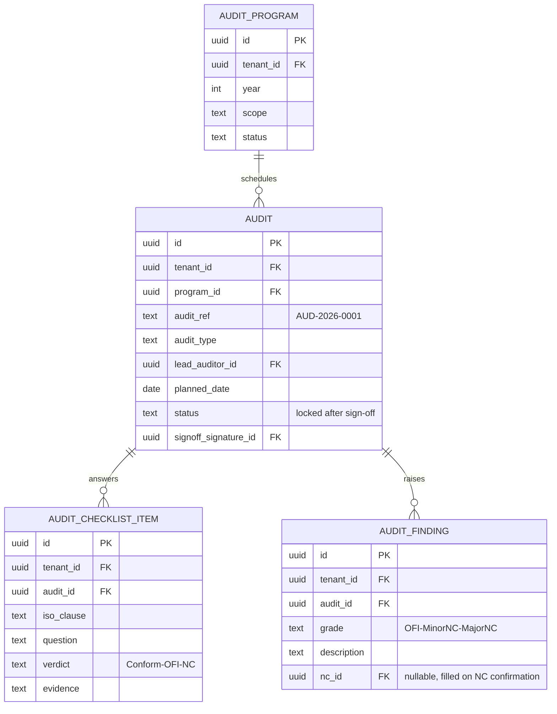
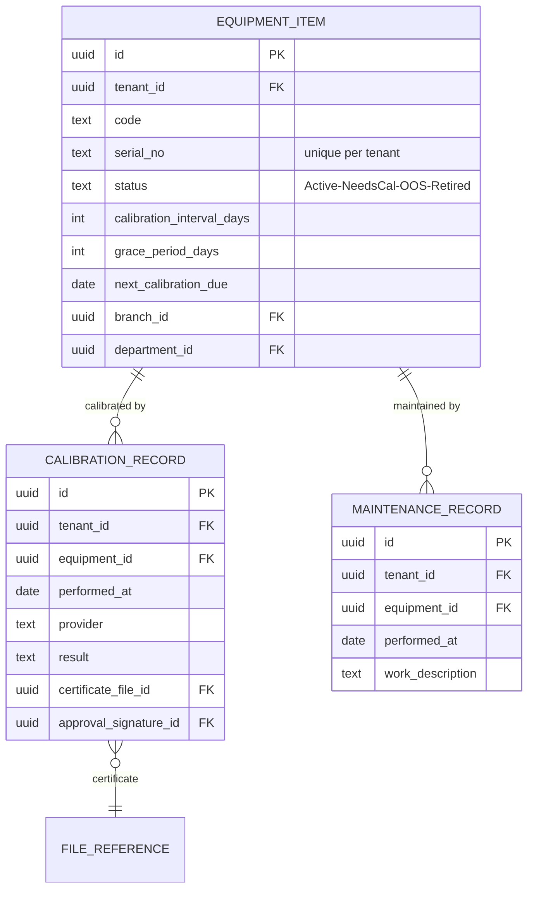
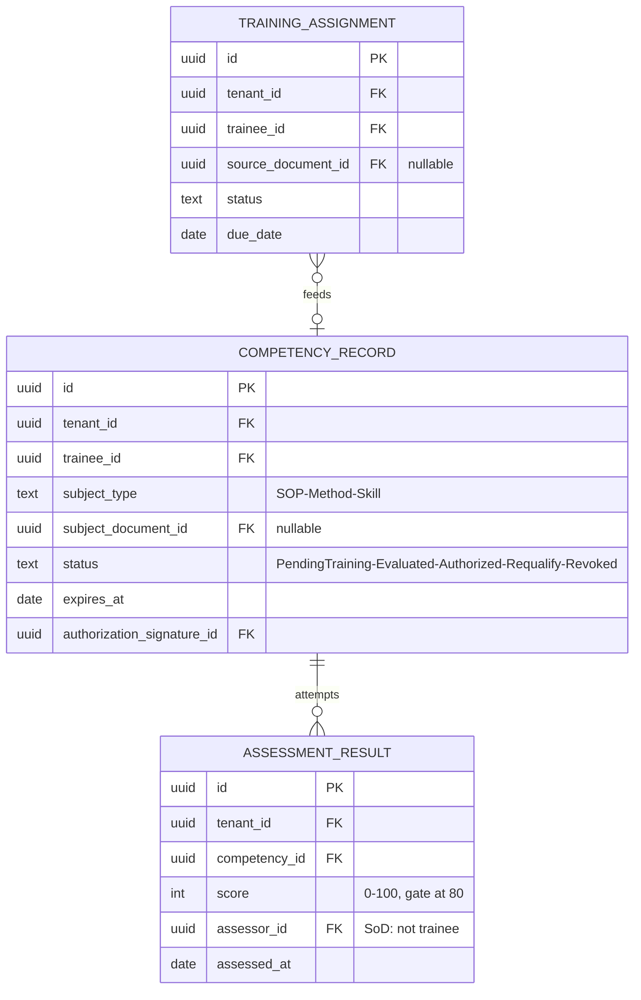
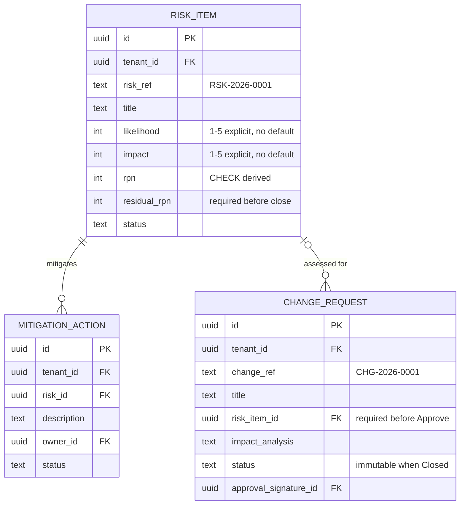
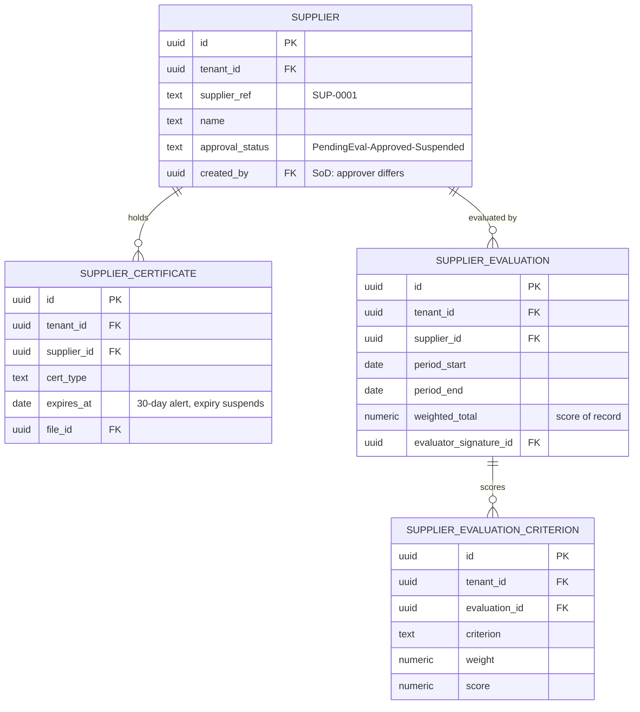

# NT.QAMS — Production Database Architecture & Enterprise ERD

| | |
|---|---|
| **Product** | NT.QAMS — Multi-tenant SaaS Quality Assurance Management System |
| **Target stack** | PostgreSQL 17 · .NET 9 · EF Core 9 (Npgsql) · Clean Architecture · CQRS |
| **Compliance targets** | ISO 9001:2015 · ISO/IEC 17025:2017 · 21 CFR Part 11 (electronic records & signatures) |
| **Sources of truth** | `NT_QAMS_Product_Inventory.md` (as-built reality) · `NT_QAMS_Domain_Model.md` (target-state DDD model: 14 bounded contexts, 27 aggregates) |
| **Scope** | Database strategy, data model, multi-tenancy, ERDs. **No DDL, no EF classes, no migrations** — those are the next phase's deliverables, generated *from* this design. |

**Reading guide:** the design is derived from the domain model's aggregates, not from the 28 UI screens. Where the UI or the legacy spec implied a table that the domain doesn't justify, that assumption is challenged in place (marked ⚔).

**Schema layout used throughout:**

| PostgreSQL schema | Contents | RLS | Writable by app role |
|---|---|---|---|
| `saas` | Control plane: tenants, plans, subscriptions, provisioning | No (control-plane role only) | `qams_control` role only |
| `qams` | All tenant business data (34 root + 23 child + 4 junction tables) | **Yes — every table** | `qams_app` (INSERT/UPDATE, DELETE only where policy allows) |
| `ref` | Platform-wide reference catalogs (privileges, retention classes, ref types) | No (read-only to tenants) | migration role only |
| `audit` | Append-only compliance ledgers | Yes (tenant-scoped reads) | `qams_app` **INSERT only** — no UPDATE/DELETE grant exists |
| `read` | CQRS projections & materialized views | Yes | projection worker role |

---

# PHASE 1 — DATABASE STRATEGY

## 1.1 Multi-Tenancy Strategy

### Evaluation

| Dimension | A. Shared DB + Shared Schema (tenant_id + RLS) | B. Shared DB + Schema-per-Tenant | C. Database-per-Tenant |
|---|---|---|---|
| **Isolation strength** | Logical (RLS-enforced at the engine, below the app) | Logical+ (namespace separation, same engine) | Physical (strongest) |
| **Security blast radius** | One RLS bug/misconfig can expose cross-tenant rows — mitigated by 3 defense layers (below) | Search-path bugs replace RLS bugs; same class of risk, less mature tooling | Connection-string bug exposes one tenant only |
| **Cost per tenant** | Near zero marginal cost; one connection pool | Moderate: catalog bloat (74 tables × N tenants), pooling fragmented per search_path | High: instance/DB per tenant, N× backups, N× monitoring |
| **Scalability ceiling** | Thousands of tenants on one cluster; scale by read replicas, then shard by tenant_id ranges | PostgreSQL degrades noticeably past ~5–10k schemas (pg_catalog, autovacuum, pg_dump) | Scales linearly in cost; operationally heavy past ~50 DBs without automation |
| **Migration impact** | **One migration, one deploy** — every tenant upgrades atomically | N migrations per release; partial-failure states (tenant 37 on v1.4, rest on v1.5) | Same as B but worse: N databases to migrate, version drift is guaranteed at scale |
| **Noisy neighbor** | Shared buffers/IO — needs statement timeouts + per-tenant rate limiting at app tier | Same as A | Fully isolated |
| **Tenant backup/restore/export** | Hard part: logical export by tenant_id (solvable: per-tenant COPY scripts keyed on RLS) | Easy: dump one schema | Trivial: dump one DB |
| **EF Core fit** | Excellent — one model, global query filters + RLS | Poor–moderate: model per search_path, migration tooling fights you | Good, but N contexts/connection strings to manage |
| **Compliance story** | RLS policy + low-privilege role is a documented, auditable control; regulator-friendly | Acceptable | Strongest paper story; often demanded by government/enterprise labs |

### ⚖ Recommendation: **A — Shared database + shared schema + `tenant_id` + PostgreSQL RLS**, with a **hybrid escape hatch to C** for premium/regulated tenants.

**Why A:** NT.QAMS's market is small-to-mid accredited labs (10–200 users each). Marginal tenant cost and single-pass migrations dominate the economics; the compliance requirement is met by *provable row isolation*, not physical separation. Option B is strictly dominated here: it has A's blast-radius class with C's migration pain, and PostgreSQL's per-schema overhead punishes exactly the "many small tenants" shape this product has.

**The hybrid escape hatch:** the domain model's `Tenant` already carries an optional `ConnectionString`. Enterprise/government tenants who contractually demand physical isolation get a dedicated database provisioned from the *same* schema definition and the *same* migration pipeline. This must be an exception (target < 5% of tenants), priced accordingly (Enterprise plan), because every dedicated DB re-introduces the version-drift and backup burden of option C.

**Non-negotiable controls** (each one is a direct correction of an as-built failure found in the Product Inventory):

1. The application connects as **`qams_app`**, a low-privilege role — never `postgres`. (As-built connects as superuser, which silently bypasses RLS.)
2. **RLS enabled + a tenant policy on every table in `qams`, `audit`, `read`** — not just two tables as-built. Policy pattern: `USING (tenant_id = current_setting('app.current_tenant', true)::uuid)`. `FORCE ROW LEVEL SECURITY` set so even the table owner is bound.
3. `app.current_tenant` is set **per transaction** (`set_config(..., true)` = transaction-local), from the JWT claim only. (As-built sets it per connection and also accepts tenant from an HTTP header/query — with pooled connections, connection-scoped settings leak across requests; header-derived tenant is spoofable.) ⚔
4. Control-plane tables (`saas.*`) live outside RLS and outside `qams_app`'s grants entirely; the API's tenant-facing role cannot read other tenants' subscription data even by SQL injection.
5. Every tenant-scoped table's **primary key is `(id)` but every unique business constraint and every FK includes/derives `tenant_id`** — composite uniques like `(tenant_id, nc_ref)` and composite FKs `(tenant_id, parent_id)` so a corrupted FK can never point across tenants. This is defense layer 3 (schema-level), after RLS (engine-level) and EF global filters (app-level).

## 1.2 Audit Strategy

Two distinct problems, two distinct mechanisms — collapsing them is the classic mistake:

**Layer 1 — Row change tracking (`audit.audit_trail`).** Every INSERT/UPDATE on business tables writes one entry: actor, tenant, table, row id, action, changed-columns diff (JSONB, before/after values), UTC timestamp from the **database clock** (never the app server's), plus a per-tenant **hash chain**: `entry_hash = SHA-256(prev_entry_hash ‖ canonical_payload)`. The chain makes truncation or in-place tampering detectable (Part 11 "tamper-evident"; NFR-SEC-03). Written by the EF `SaveChanges` interceptor in the *same transaction* as the change — an audit entry without its change, or a change without its entry, must be impossible. ⚔ *Challenge to the common "audit via triggers" assumption:* triggers capture the row but not the actor/reason (Postgres doesn't know the JWT user). Interceptor-based capture carries full actor context; the DB-level guarantee is preserved by grants (below), not by triggers. A minimal safety-net trigger remains on `audit.*` tables themselves to reject UPDATE/DELETE even from misconfigured roles.

**Layer 2 — Business event ledgers.** State transitions, signatures, and security events are *domain facts*, not row diffs, and auditors ask for them in domain language ("show me every approval on SOP-CAL-045"). These get dedicated tables: `audit.workflow_history`, `audit.electronic_signature`, `audit.security_event` (Phase 7).

**What gets audited:**
- All writes to every `qams.*` business table (Layer 1).
- Every state transition of every workflow aggregate (Layer 2).
- Every electronic signature with its meaning statement (Layer 2).
- Security events: login success/failure, lockout, MFA challenge results, session revocation, privilege-matrix changes, RLS policy violations (attempted cross-tenant access), export/download of controlled documents.
- Control-plane actions: provisioning, suspension, plan changes (into a control-plane trail, tenant-visible on request).

**What does NOT get audited (and why):**
- **Reads** — except the security-relevant ones listed above. Full read-auditing would multiply write volume ~50× for negligible compliance value; 17025/Part 11 require records of *changes and signings*, not page views.
- `audit.*` itself — no audit-of-audit; integrity comes from the hash chain + INSERT-only grants.
- `read.*` projections and materialized views — derived data, rebuildable, never a record of truth.
- `qams.notification_dispatch`, `qams.user_session` row churn — operational telemetry with its own retention, not quality records.
- `qams.outbox_event` — infrastructure plumbing.

**Historical data:** current-state tables + `workflow_history` reconstruct any record's past states. Full temporal tables (`_history` copies of every table) are **rejected** ⚔ — they double the schema for a need the diff-based trail already covers; if a specific module later needs point-in-time reconstruction at scale (candidate: `controlled_document`), add a history table for that module only.

**Retention:** audit entries live **at least as long as the records they describe** (ISO 17025 record-retention; the tenant's retention class ceiling, default ≥ 5 years, medical contexts up to 10+). Monthly partitions; partitions past retention are detached and archived to object storage (never dropped silently — disposal itself is a logged event). `notification_dispatch`: 90 days (per spec). `security_event`: 2 years minimum. `user_session`: 90 days after expiry.

## 1.3 Soft Delete Strategy

⚔ *Challenge to the blanket "add IsDeleted everywhere" convention:* in a regulated QMS, deletion is mostly a **domain state**, not a row flag. Four data classes:

| Class | Tables (examples) | Policy |
|---|---|---|
| **Immutable compliance records** | `audit.*` (all four), `document_signature`, `calibration_record`, `assessment_result`, `pt_result`, `validation_replicate`, closed/signed rows of every workflow table | **No delete of any kind, ever.** No `deleted_at` column — its absence is the guarantee. DB enforcement: no DELETE grant to `qams_app` + guard trigger rejecting DELETE, and UPDATE guard on signed/closed rows (allow-list of mutable columns only). "Removal" = state transition (Rejected, Obsolete, Superseded, Revoked) or archival (S3 context). |
| **Workflow records in pre-signature states** | Draft NCs, draft documents, draft risks, unsubmitted change requests | **Soft delete** (`deleted_at`, `deleted_by`) — a lab tech may discard a mis-raised draft; the row stays for the trail. EF global filter hides them; RLS unaffected. Hard delete prohibited. |
| **Reference & configuration data** | `branch`, `department`, `lov_entry`, `test_catalog_item`, `notification_rule`, `role` | **Deactivation** (`is_active`, `deactivated_at`) — never deleted because historical records reference them (FK RESTRICT). "Delete" in the UI = deactivate. |
| **Purgeable telemetry** | `notification_dispatch`, expired `user_session`, processed `outbox_event`, detached audit partitions past retention | **Hard delete by scheduled retention job** — the only legitimate DELETE in the system, executed by a dedicated `qams_retention` role, itself logged as a retention event. |

## 1.4 File Storage Strategy

| Option | Verdict | Reasoning |
|---|---|---|
| Database blobs (`bytea`/LO) | **Rejected** | Bloats backups and WAL, poisons shared buffers, makes per-tenant export enormous, no CDN/streaming. The as-built system's base64-in-JSON is this option's worst form and is already the proven failure mode. |
| Azure Blob Storage | Viable | Excellent if the platform commits to Azure. But NT.QAMS demonstrably deploys on-premises (IIS/Windows for government labs) — a hard Azure dependency breaks the on-prem story. |
| **S3-compatible object storage** | **✔ Recommended** | One API, three deployments: AWS S3 (cloud), **MinIO (on-prem/air-gapped labs)**, Azure via S3 gateway. Matches the product's actual deployment spectrum. |

**Design:** all file bytes live in object storage; the database holds `qams.file_reference` — one row per immutable stored object: storage key (content-addressed: `tenant/{tenant_id}/{sha256}`), SHA-256 hash, size, MIME type, original filename, uploader, scan status. Rules: (1) **immutable** — a new version of a document is a new object + new reference, never an overwrite; (2) the SHA-256 in the DB is the integrity anchor Part 11 wants — a signed document version's bytes are provably the bytes that were signed; (3) access via short-lived pre-signed URLs, authorized by the app (privileges + RLS), never public buckets; (4) bucket versioning + object lock (WORM) on the compliance bucket; (5) deletion only via the retention job, aligned with `archive_entry` disposal; (6) obsolete-version watermarking (FR-DOC-03) produces a *derived* object linked as a separate reference — the signed original is never modified.

## 1.5 Reference Number Generation Strategy

**Format registry** (stored in `ref.ref_type`, per-tenant overridable prefix):

| Type | Format | Example | Resets |
|---|---|---|---|
| Nonconformance | `NC-YYYY-NNNN` | NC-2026-0001 | yearly |
| CAPA action | `CAPA-YYYY-NNNN` | CAPA-2026-0001 | yearly |
| Internal audit | `AUD-YYYY-NNNN` | AUD-2026-0001 | yearly |
| Document | `DOC-…` / category prefix (`SOP-CAL-045` pattern kept: `{CAT}-{DEPT}-NNN`) | SOP-CAL-045 | never (documents outlive years) |
| Complaint | `CMP-YYYY-NNNN` | CMP-2026-0001 | yearly |
| Risk | `RSK-YYYY-NNNN` | RSK-2026-0001 | yearly |
| Change request | `CHG-YYYY-NNNN` | CHG-2026-0001 | yearly |
| Management review | `MRV-YYYY-NN` | MRV-2026-01 | yearly |
| Supplier | `SUP-NNNN` | SUP-0001 | never |
| PT enrollment | `PT-YYYY-NNNN` | PT-2026-0001 | yearly |
| Archive entry | `ARC-YYYY-NNNN` | ARC-2026-0001 | yearly |

**Mechanism:** `qams.ref_counter (tenant_id, ref_type, year, last_value)` with a single atomic statement per issue: `UPDATE … SET last_value = last_value + 1 WHERE tenant_id=? AND ref_type=? AND year=? RETURNING last_value` — executed **inside the same transaction** as the row insert. The row lock serializes issuance per (tenant, type, year); a rolled-back insert rolls the counter back with it, so numbering is **gapless within the tenant's committed history**.

⚔ *Why the alternatives fail:*
- `COUNT(*) + 1` (as-built): read-then-write race — two concurrent raises get the same ref; deletes renumber history, which is traceability destruction in an accredited lab.
- Native PostgreSQL sequences: non-transactional (gaps on rollback — explainable but avoidable), and per-(tenant × type × year) sequence proliferation pollutes the catalog; no clean yearly reset.
- UUID-only: correct for PKs (we use them), useless for humans and assessors — refs are the lingua franca of audits.
- *Contention note:* the counter row is a serialization point per tenant/type/year — at QAMS volumes (a very busy lab raises tens of NCs a day, not thousands a second) this is deliberate and harmless. `qc_run` and other high-frequency rows do **not** get business refs for exactly this reason. ⚔

---

# PHASE 2 — ENTITY TO TABLE MAPPING

## 2.1 Aggregate Roots → Tables (27 aggregates from the Domain Model → 34 root tables)

| # | Aggregate (context) | Table(s) | Notes |
|---|---|---|---|
| 1 | Tenant (G2) | `saas.tenant` + `saas.tenant_settings` | Settings split 1:1 — different write cadence & sensitivity; control plane, no RLS |
| 2 | Subscription (G2) | `saas.subscription` | Stripe ids as opaque ACL columns; `saas.plan` lookup holds tier entitlements |
| 3 | ProvisioningRequest (G2) | `saas.provisioning_request` + `saas.provisioning_step` | Step child = saga log for the orchestrator |
| 4 | UserAccount (G1) | `qams.user_account` (+ `qams.user_credential_history`) | Single user model (kills QamsUser/IdentityUser duplication). MFA + PIN credential columns live here (hashes only); credential history child for Part 11 password/PIN reuse rules |
| 5 | Role (G1) | `qams.role` + `qams.role_privilege` (junction → `ref.privilege`) | Privilege catalog is platform-owned reference data, versioned |
| 6 | UserSession (G1) | `qams.user_session` | Token hash, revocation flag |
| 7 | Branch (S4) | `qams.branch` | Deactivation, never delete |
| 8 | Department (S4) | `qams.department` | FK → branch (real FK at last — as-built was free text) |
| 9 | TestCatalogItem (S4) | `qams.test_catalog_item` | |
| 10 | LovEntry (S4) | `qams.lov_entry` | `(tenant_id, category, code)` unique; trilingual name columns |
| 11 | ControlledDocument (C2) | `qams.controlled_document` + `qams.document_version` + `qams.document_signature` | Signature rows reference `audit.electronic_signature` (the ledger record) — the child table binds sig→version→role |
| 12 | Nonconformance (C1) | `qams.nonconformance` + `qams.capa_action` + `qams.rca_record` + `qams.effectiveness_check` | Containment = columns on root (single VO, no lifecycle) |
| 13 | Complaint (C1) | `qams.complaint` | `nc_id` nullable FK (link by reference); reporter identity columns encrypted (pgcrypto) when confidential |
| 14 | AuditProgram (C3) | `qams.audit_program` | |
| 15 | Audit (C3) | `qams.audit` + `qams.audit_checklist_item` + `qams.audit_finding` | Finding carries nullable `nc_id` back-ref filled by the cross-context confirmation |
| 16 | ValidationStudy (C4) | `qams.validation_study` + `qams.validation_series` + `qams.validation_replicate` + `qams.validation_result` | Series immutable (void-and-replace); result rows are derivable snapshots kept for recompute history |
| 17 | QcProfile (C4) | `qams.qc_profile` | Target mean/SD/lot + active rule set |
| 18 | QcRun (C4) | `qams.qc_run` (partitioned monthly) + `qams.qc_troubleshooting_entry` | Separate aggregate = separate high-volume table; verdict stored per run |
| 19 | PtEnrollment (C4) | `qams.pt_enrollment` + `qams.pt_result` | z-score + derived performance category on result |
| 20 | EquipmentItem (C5) | `qams.equipment_item` + `qams.calibration_record` + `qams.maintenance_record` | Certificate = FK → file_reference |
| 21 | CompetencyRecord (C6) | `qams.competency_record` + `qams.assessment_result` | Assessment attempts are append-only children |
| 22 | TrainingAssignment (C6) | `qams.training_assignment` | High-volume, separate root per domain model |
| 23 | RiskItem (S1) | `qams.risk_item` + `qams.mitigation_action` | L/I/RPN + residual columns, CHECK 1–5, no defaults |
| 24 | ChangeRequest (S1) | `qams.change_request` | `risk_item_id` FK required before Approve (enforced in domain; DB keeps it nullable with a CHECK tied to status) |
| 25 | ManagementReview (S1) | `qams.management_review` + `qams.review_decision` + `qams.review_input_snapshot` | Input snapshots = frozen refs/hashes of the reviewed read models |
| 26 | Supplier (S2) | `qams.supplier` + `qams.supplier_certificate` | |
| 27 | SupplierEvaluation (S2) | `qams.supplier_evaluation` + `qams.supplier_evaluation_criterion` | Criterion scores normalized (weighted total stored + derivable) |
| 28 | ArchiveEntry (S3) | `qams.archive_entry` | Snapshot = FK → file_reference; retention class → `ref.retention_class` |
| 29 | NotificationRule (G3) | `qams.notification_rule` | Recipient spec as constrained JSONB (role/user/contextual selectors) |
| 30 | MessageTemplate (G3) | `qams.message_template` | Localized subject/body — JSONB per language (templates are render-only, never queried by language) |
| 31 | MessageDispatch (G3) | `qams.notification_dispatch` | 90-day retention, purge job |
| 32 | SlaDefinition (G3) | `qams.sla_definition` | module + severity → target working hours |
| 33 | EscalationTimer (G3) | `qams.escalation_timer` | Armed by events; level 0–3; deadline computed by SlaClock |
| 34 | WorkTask (G3) | `qams.work_task` | "My Tasks" queue |
| 35 | AuditTrailEntry (G4) | `audit.audit_trail` (partitioned) | Hash-chained, INSERT-only |
| 36 | SignatureRecord (G4) | `audit.electronic_signature` | The Part 11 ledger — every envelope everywhere |

Supporting infrastructure tables (no aggregate — deliberately): `qams.file_reference`, `qams.ref_counter`, `qams.outbox_event` (transactional outbox feeding G3/G4/read projections), `qams.document_training_requirement` (junction driving the C2→C6 policy), `audit.workflow_history`, `audit.security_event`, `ref.privilege`, `ref.ref_type`, `ref.retention_class`, `saas.plan`.

## 2.2 Internal Entities → Tables

| Entity | Parent aggregate | Table |
|---|---|---|
| CapaAction | Nonconformance | `qams.capa_action` |
| RcaRecord | Nonconformance | `qams.rca_record` |
| EffectivenessCheck | Nonconformance | `qams.effectiveness_check` |
| DocumentVersion | ControlledDocument | `qams.document_version` |
| SignatureSet (per version/role) | ControlledDocument | `qams.document_signature` |
| ChecklistItem | Audit | `qams.audit_checklist_item` |
| Finding | Audit | `qams.audit_finding` |
| MeasurementSeries / replicates | ValidationStudy | `qams.validation_series`, `qams.validation_replicate` |
| StatisticalResult | ValidationStudy | `qams.validation_result` |
| TroubleshootingEntry | QcRun | `qams.qc_troubleshooting_entry` |
| PtResult | PtEnrollment | `qams.pt_result` |
| CalibrationRecord | EquipmentItem | `qams.calibration_record` |
| MaintenanceRecord | EquipmentItem | `qams.maintenance_record` |
| AssessmentResult | CompetencyRecord | `qams.assessment_result` |
| MitigationAction | RiskItem | `qams.mitigation_action` |
| Decision | ManagementReview | `qams.review_decision` |
| InputPack snapshot | ManagementReview | `qams.review_input_snapshot` |
| CertificateRecord | Supplier | `qams.supplier_certificate` |
| EvaluationCriterion score | SupplierEvaluation | `qams.supplier_evaluation_criterion` |
| ProvisioningStep | ProvisioningRequest | `saas.provisioning_step` |
| CredentialHistory | UserAccount | `qams.user_credential_history` |

## 2.3 Table categories

- **Aggregate-root tables (34):** listed in §2.1.
- **Child tables (21):** listed in §2.2.
- **Junction tables (4):** `role_privilege`, `user_role`, `user_org_scope` (user ↔ branch/department grants), `document_training_requirement` (document ↔ role/department training matrix).
- **Lookup tables (5):** `ref.privilege`, `ref.ref_type`, `ref.retention_class`, `saas.plan`, `qams.lov_entry` (tenant-owned lookup; doubles as business data).
- **Compliance ledgers (4):** `audit.audit_trail`, `audit.electronic_signature`, `audit.workflow_history`, `audit.security_event`.
- **Infrastructure (3):** `file_reference`, `ref_counter`, `outbox_event`.
- **Read/projection (2 tables + 6 materialized views):** Phase 8.

⚔ *Challenges applied while mapping* (assumptions from the legacy spec/UI that did **not** become tables): the UI's `NcTimelineLog` (replaced by `workflow_history` + `audit_trail`); a `QamsEntities` table (scaffold sample — deleted); `TenantStorages` (the blob store — retired, exists only as a migration source); per-module "settings" tables implied by UI toggle screens (normalized into `notification_rule` + `sla_definition`); a `UserSessions`-style decorative table separate from real session management; "approval_history" as a mutable table (Phase 7 — it's a projection).

---

# PHASE 3 — COMPLETE DATABASE INVENTORY

## 3.1 Per-module inventory

| Module (bounded context) | Main tables | Child tables | Lookup/junction used |
|---|---|---|---|
| Tenancy & Billing (G2) | tenant, subscription, provisioning_request | tenant_settings, provisioning_step | plan |
| Identity & Access (G1) | user_account, role, user_session | user_credential_history | ref.privilege; junctions: role_privilege, user_role, user_org_scope |
| Organization & Reference (S4) | branch, department, test_catalog_item, lov_entry | — | — |
| Document Control (C2) | controlled_document | document_version, document_signature | junction: document_training_requirement |
| Improvement — NC/CAPA (C1) | nonconformance | capa_action, rca_record, effectiveness_check | lov_entry (severity/source categories) |
| Improvement — Complaints (C1) | complaint | — | lov_entry (channels, categories) |
| Audit Management (C3) | audit_program, audit | audit_checklist_item, audit_finding | — |
| Analytical Quality (C4) | validation_study, qc_profile, qc_run, pt_enrollment | validation_series, validation_replicate, validation_result, qc_troubleshooting_entry, pt_result | test_catalog_item (analytes/methods) |
| Equipment & Calibration (C5) | equipment_item | calibration_record, maintenance_record | — |
| Competency & Training (C6) | competency_record, training_assignment | assessment_result | — |
| Risk & Governance (S1) | risk_item, change_request, management_review | mitigation_action, review_decision, review_input_snapshot | — |
| Supplier Quality (S2) | supplier, supplier_evaluation | supplier_certificate, supplier_evaluation_criterion | — |
| Records & Retention (S3) | archive_entry | — | ref.retention_class |
| Notification & Escalation (G3) | notification_rule, message_template, notification_dispatch, sla_definition, escalation_timer, work_task | — | — |
| Compliance Ledger (G4) | audit_trail, electronic_signature, workflow_history, security_event | — | — |
| Infrastructure | file_reference, ref_counter, outbox_event | — | ref.ref_type |
| Reporting (read schema) | record_activity, kpi_snapshot (+6 mat. views) | — | — |

## 3.2 Totals

| Category | Count |
|---|---|
| Business tables (roots + children, saas+qams) | **55** (34 roots + 21 children) |
| Lookup tables | **5** |
| Junction tables | **4** |
| Audit/compliance tables | **4** |
| Workflow-engine tables (escalation_timer, work_task, outbox_event) | **3** (escalation_timer & work_task also counted in business roots — category overlap noted) |
| Notification tables | **4** (rule, template, dispatch, sla_definition) |
| Reporting tables | **2** physical + **6** materialized views |
| Infrastructure | **3** (file_reference, ref_counter, outbox_event) |
| **Total physical tables** | **≈ 73** (+6 materialized views) |

---

# PHASE 4 — RELATIONSHIP DESIGN

## 4.1 Relationships by module

**Cascade policy (global):** `ON DELETE RESTRICT` is the default everywhere. `ON DELETE CASCADE` is permitted **only inside an aggregate boundary** (root → its child tables), and only where the root itself is deletable — which, per §1.3, means draft-state soft deletes; since soft delete never issues SQL DELETE, **in practice no CASCADE fires in production**. Cross-aggregate and cross-context references are always RESTRICT (or logical refs). This single rule eliminates the entire class of "deleted a branch, lost 4,000 NCs" incidents.

| Parent | Child | Relationship | Notes |
|---|---|---|---|
| **Tenancy / Identity** | | | |
| saas.tenant | saas.tenant_settings | 1:1 | shared PK |
| saas.tenant | saas.subscription | 1:N | |
| saas.plan | saas.subscription | 1:N | RESTRICT |
| saas.provisioning_request | saas.provisioning_step | 1:N | in-aggregate |
| saas.tenant | qams.* (every tenant-scoped table) | 1:N | `tenant_id` FK — logical umbrella, enforced by RLS + FK |
| qams.user_account | qams.user_credential_history | 1:N | in-aggregate |
| qams.user_account ↔ qams.role | via qams.user_role | **M:N** | |
| qams.role ↔ ref.privilege | via qams.role_privilege | **M:N** | |
| qams.user_account ↔ branch/department | via qams.user_org_scope | **M:N** | org-scoping grants |
| **Organization** | | | |
| qams.branch | qams.department | 1:N | RESTRICT |
| qams.branch / qams.department | every workflow root (nonconformance, audit, equipment_item, …) | 1:N | `branch_id`/`department_id` FKs — replaces as-built free text |
| **Documents** | | | |
| qams.controlled_document | qams.document_version | 1:N | + `current_version_id` 1:1 back-pointer (deferred FK; §5) |
| qams.document_version | qams.document_signature | 1:N | one row per role (author/reviewer/approver) |
| audit.electronic_signature | qams.document_signature | 1:1 | ledger anchor |
| qams.file_reference | qams.document_version | 1:N | immutable file objects |
| qams.controlled_document ↔ role/department | via qams.document_training_requirement | **M:N** | drives training policy |
| **Improvement** | | | |
| qams.nonconformance | qams.capa_action | 1:N | in-aggregate |
| qams.nonconformance | qams.rca_record | 1:N | in-aggregate |
| qams.nonconformance | qams.effectiveness_check | 1:N | in-aggregate |
| qams.complaint | qams.nonconformance | 1:0..1 | nullable `nc_id` on complaint (link by ref) |
| qams.user_account | nonconformance (raised_by), capa_action (owner) | 1:N | RESTRICT |
| **Audit Mgmt** | | | |
| qams.audit_program | qams.audit | 1:N | |
| qams.audit | qams.audit_checklist_item | 1:N | in-aggregate |
| qams.audit | qams.audit_finding | 1:N | in-aggregate |
| qams.audit_finding | qams.nonconformance | 1:0..1 | nullable `nc_id` back-ref (see 4.3) |
| **Analytical Quality** | | | |
| qams.validation_study | qams.validation_series | 1:N | |
| qams.validation_series | qams.validation_replicate | 1:N | |
| qams.validation_study | qams.validation_result | 1:N | recompute history |
| qams.qc_profile | qams.qc_run | 1:N | high-volume; partitioned child side |
| qams.qc_run | qams.qc_troubleshooting_entry | 1:N | |
| qams.pt_enrollment | qams.pt_result | 1:N | |
| qams.test_catalog_item | validation_study, qc_profile, pt_enrollment | 1:N | analyte/method anchor |
| **Equipment** | | | |
| qams.equipment_item | qams.calibration_record | 1:N | in-aggregate |
| qams.equipment_item | qams.maintenance_record | 1:N | in-aggregate |
| qams.file_reference | qams.calibration_record (certificate) | 1:N | |
| qams.equipment_item | qams.qc_run | 1:N | instrument anchor |
| **Competency** | | | |
| qams.competency_record | qams.assessment_result | 1:N | append-only |
| qams.user_account | competency_record (trainee), training_assignment | 1:N | |
| qams.controlled_document | qams.training_assignment | 1:0..N | assignment source (nullable — manual assignments exist) |
| **Risk & Governance** | | | |
| qams.risk_item | qams.mitigation_action | 1:N | in-aggregate |
| qams.risk_item | qams.change_request | 1:0..N | required-before-approve (status-conditional CHECK) |
| qams.management_review | qams.review_decision | 1:N | |
| qams.management_review | qams.review_input_snapshot | 1:N | |
| qams.review_decision | qams.work_task | 1:0..N | decisions spawn tasks |
| **Supplier** | | | |
| qams.supplier | qams.supplier_certificate | 1:N | |
| qams.supplier | qams.supplier_evaluation | 1:N | separate aggregate, RESTRICT |
| qams.supplier_evaluation | qams.supplier_evaluation_criterion | 1:N | |
| **Records / Notification / Compliance** | | | |
| ref.retention_class | qams.archive_entry | 1:N | |
| qams.file_reference | qams.archive_entry (snapshot) | 1:1 | |
| qams.notification_rule | qams.notification_dispatch | 1:N | |
| qams.message_template | qams.notification_rule | 1:N | |
| qams.sla_definition | qams.escalation_timer | 1:N | |
| qams.user_account | qams.work_task (assignee) | 1:N | |
| audit.electronic_signature | (document_signature, and referenced by ref from every signed row) | 1:N logical | subject refs are polymorphic (table + row id), not FKs — see 4.3 |

## 4.2 Totals

- **Foreign keys:** ≈ **118** (54 in-aggregate/child FKs, ≈ 40 cross-reference FKs to user_account/branch/department/test_catalog/file_reference, ≈ 12 junction FKs, ≈ 12 control-plane/lookup FKs). Every tenant-scoped FK is composite `(tenant_id, id)` per §1.1 control 5.
- **Relationships:** ≈ **95** distinct (≈ 3 one-to-one, ≈ 86 one-to-many, ≈ 4 many-to-many via junctions, plus 2 polymorphic logical refs).

## 4.3 Cascade & circularity risks

1. **`controlled_document.current_version_id` ↔ `document_version.document_id`** — a real 1:1/1:N cycle. Resolved: `current_version_id` nullable + deferred constraint; insert version first, then point. Standard, but must be documented or EF will fight it.
2. **`audit_finding.nc_id` ↔ `nonconformance` (source=Audit)** — potential cycle if NC also carried `finding_id`. Resolved per the domain model: **one physical FK only** (finding → NC, nullable); NC records its origin as `(source_type, source_ref)` — a typed logical reference, not an FK. The cross-context guarantee is the event loop, not referential integrity.
3. **Polymorphic subject refs** (`audit.*` ledgers, `work_task.subject`, `archive_entry.source_record`) — deliberately **not** FKs (a ledger must outlive and never block its subject; FKs to 30 tables is unmaintainable). Risk: dangling refs. Mitigation: refs carry `(table_name, row_id, business_ref)` — the human-readable business ref makes the ledger self-sufficient even if the subject is archived. This is a *considered* denormalization (Phase 5).
4. **`branch`/`department`/`user_account` RESTRICT fan-out** — deactivation instead of deletion (§1.3) makes RESTRICT conflicts unreachable in normal operation.
5. **No CASCADE across aggregate boundaries anywhere** — verified by the table above.

---

# PHASE 5 — NORMALIZATION REVIEW

## 5.1 Verdict

**Yes — the design satisfies 3NF**, with **seven deliberate, documented denormalizations**, each chosen for integrity or performance and each with a stated guard against drift. (1NF: all columns atomic — JSONB used only for genuinely document-shaped values, listed below. 2NF: all tables keyed on surrogate `id`; no partial dependencies possible. 3NF: no transitive dependencies except the declared exceptions.)

## 5.2 Deliberate denormalizations (the honest list)

| # | Denormalization | Why | Drift guard |
|---|---|---|---|
| 1 | `rpn` stored on `risk_item` / `nonconformance` although derivable (L×I) | Indexable dashboard filter ("RPN > 12") | `CHECK (rpn = likelihood * impact)` — the DB itself forbids drift |
| 2 | `current_version_id` + `status` on `controlled_document` (derivable from versions) | Every list query needs it; joining versions for every grid row is wasteful | Updated in the same transaction as version transitions (aggregate invariant) |
| 3 | Business ref (e.g. `NC-2026-0004`) copied into ledger/subject refs (`audit_trail`, `work_task`, `archive_entry`) | Ledgers must be self-describing across time (subject may be archived) | Refs are immutable after issue — copy of an immutable value cannot drift |
| 4 | `performance_category` stored on `pt_result` (derivable from z-score) | Category boundaries could change; the *assigned* category at evaluation time is the record of fact | Regulatory framing: stored value is the historical truth, recomputation is not desired |
| 5 | `weighted_total` on `supplier_evaluation` (derivable from criteria) | Same as 4 — the score of record | Recompute-and-compare check in the domain layer on write |
| 6 | Trilingual columns `name_en/name_ar/name_fr` on `lov_entry`, `test_catalog_item`, `branch`, `department` (vs a normalized translation table) ⚔ | 3 languages are a **product constant** (design system, docs, UI); a translation table adds a join to every dropdown for zero flexibility gained. If a 4th language ever ships, it is a migration, and that's acceptable | CHECK: `name_en` non-empty (fallback anchor) |
| 7 | Westgard verdict + rule outcomes stored per `qc_run` (derivable from window recompute) | The verdict *at time of evaluation* is the compliance fact; window recomputation after profile edits must not rewrite history | Append-only rows; profile changes take effect forward-only (effective-dated profile columns) |
| — | JSONB columns (bounded use): `audit_trail.changes` (diff), `notification_rule.recipient_spec`, `message_template.body`, `review_input_snapshot.payload`, `outbox_event.payload` | Genuinely schema-flexible documents; never used for relational facts | Validated by JSON schema at the app layer; never joined on |

## 5.3 Redundancy / duplication risks by module (and their resolution)

- **Improvement:** severity/category vocabularies could fork between NC and Complaint — both bind to shared `lov_entry` categories. Timeline data duplicated between UI-era logs and ledgers — resolved: the ledger is the *only* store, `read.record_activity` is its projection.
- **Documents:** file bytes duplicated across versions — content-addressed storage (same SHA = same object) dedupes at the store.
- **Analytical Quality:** analyte/method/unit strings repeated across studies/profiles/PT — normalized to `test_catalog_item`.
- **Identity:** the as-built dual user records (QamsUser vs IdentityUser) are collapsed to one `user_account`; role facts exist only in `user_role`.
- **Organization:** branch/department names denormalized *nowhere* — always joined via FK; the as-built free-text copies are the anti-pattern this schema exists to kill.
- **Notification:** template bodies duplicated per rule — resolved: rules reference `message_template` (1:N), overrides are a rule-level JSONB patch, not a copy.

---

# PHASE 6 — INDEXING STRATEGY

## 6.1 Global decisions

- **Primary keys: UUIDv7** (time-ordered) for all root/child tables. ⚔ Versus the obvious alternatives: `bigserial` leaks record counts across tenants and complicates future sharding/merge; random UUIDv4 shreds B-tree locality (the classic write-amplification mistake); UUIDv7 gives global uniqueness *and* append-friendly index locality. Generated app-side (EF value generators) so ids exist before commit for outbox/event use.
- **`tenant_id` leads every secondary index** on tenant-scoped tables — with RLS injecting `tenant_id = …` into every plan, a non-tenant-leading index is nearly useless.
- **Partial indexes for hot workflow states** — dashboards ask "what's open," not "what exists": e.g. index on `(tenant_id, due_date)` `WHERE status NOT IN ('CLOSED','REJECTED')` for capa_action; equivalent partials for NC, complaint, work_task, escalation_timer, training_assignment. Small, hot, cheap to maintain.
- **Search:** `pg_trgm` GIN indexes on the few genuinely searched text columns (nonconformance title, document title+code, complaint subject, supplier name, equipment name/serial). Full `tsvector` search is *deferred* until a real cross-module search requirement lands ⚔ — speculative search infrastructure is index bloat.
- **Audit partitions:** BRIN on `occurred_at` (append-only = perfectly correlated), B-tree `(tenant_id, subject_table, subject_id)` for "show me this record's history."

## 6.2 By table category

| Category | Index pattern | Approx. count |
|---|---|---|
| Operational roots (34) | PK + unique business key `(tenant_id, ref/code)` + 2–3 secondary (`(tenant_id, status)`, `(tenant_id, branch_id/department_id)`, owner/assignee) + partial hot-state where applicable | ≈ 34 PK + 30 unique + 75 secondary/partial |
| Child tables (21) | PK + `(tenant_id, parent_id)` (covers the only access path) + occasional date index (calibration_record next_due, effectiveness_check scheduled_for) | ≈ 21 PK + 25 secondary |
| Junctions (4) | Composite PK (both FKs) + reverse-lookup index | ≈ 8 |
| Workflow (escalation_timer, work_task, outbox_event) | Partial indexes on pending states: `(deadline) WHERE fired = false`, `(tenant_id, assignee, status)`, `(created_at) WHERE processed = false` | ≈ 8 |
| Audit ledgers (4, partitioned) | BRIN time + `(tenant_id, subject)` B-tree + `(tenant_id, actor)` on security_event | ≈ 12 (× partitions, managed) |
| Lookup (5) | PK + natural-key unique | ≈ 10 |
| Search (GIN/trgm) | 6 columns | 6 |
| Reporting (2 + mat views) | Unique index per mat view (required for `REFRESH CONCURRENTLY`) + query-shape indexes | ≈ 10 |

**Total estimate: ≈ 205–225 indexes** (excluding per-partition duplicates). Budget rule: every index must name the query it serves; unindexed-FK check and `pg_stat_user_indexes` usage review are release-gate items.

---

# PHASE 7 — COMPLIANCE TABLES

| Table | Design essentials | Why required (clause anchor) |
|---|---|---|
| `audit.audit_trail` | Append-only, monthly-partitioned. Columns: id, tenant_id, actor (user id + display snapshot), subject (table, row id, business ref), action, changes JSONB (before/after), occurred_at (DB clock, UTC), prev_hash, entry_hash. INSERT-only grants; guard trigger; per-tenant hash chain; chain-verification job runs nightly and logs result to security_event | 21 CFR Part 11 §11.10(e) computer-generated, time-stamped audit trails; ISO 17025 8.4 control of records; NFR-SEC-03 tamper-evidence |
| `audit.electronic_signature` | One row per signature act: signer id + name snapshot, **meaning statement** ("I approve SOP-CAL-045 v3.0 as Quality Manager"), subject ref, credential type (PIN-over-MFA-session), signed_at, content hash of the signed payload (e.g. the document version's file SHA-256). Immutable | Part 11 §11.50 signature manifestation (name, date/time, meaning) and §11.70 signature/record linking — the content hash **is** the link |
| `audit.workflow_history` | One row per state transition of any workflow aggregate: subject ref, from_state, to_state, actor, transition name, comment, optional signature_id FK, occurred_at | ISO 17025 assessors reconstruct lifecycles ("who moved this NC to Closed and when"); also feeds SLA measurement (state-duration analytics) without touching operational tables |
| **Approval history** | ⚔ **Not a table — a projection.** An "approval" *is* a workflow transition joined to its electronic signature. A dedicated mutable approval table would be a second source of truth that can contradict the ledgers. Delivered as `read.approval_history` view over `workflow_history ⋈ electronic_signature` | Same clauses as above — served without dual-write risk |
| `qams.notification_dispatch` (history) | Recipient, channel, template, rendered subject, status (Queued/Sent/Failed), error detail, attempts, sent_at. 90-day retention purge | ISO 17025 7.9/8.7 expect evidence that notifications/escalations occurred (complaint acknowledgments, overdue alerts); operational rather than permanent record — hence its own retention |
| `qams.archive_entry` + `ref.retention_class` (retention records) | Archive entry: source ref, snapshot file FK, retention class FK, retention_expiry, state (Archived/Retrieved/Disposed), disposal signature_id. Disposal transitions recorded in workflow_history | ISO 17025 8.4.2 retention periods; disposal itself must be authorized and evidenced |
| `audit.security_event` | Event type (login ok/fail, lockout, MFA fail, session revoked, privilege change, cross-tenant attempt, export), actor, IP/user-agent, tenant, detail JSONB, occurred_at. 2-year retention | Part 11 §11.10(d) limiting system access + ISO 17025 7.11.2; also the landing zone for RLS-violation alarms and the hash-chain verifier's reports |

---

# PHASE 8 — REPORTING ARCHITECTURE

## 8.1 Three layers

1. **Operational database (`qams`)** — normalized, RLS-protected, serves commands and simple per-record queries. Dashboards do **not** aggregate over it directly beyond trivial counts.
2. **Read models (`read` schema)** — CQRS projections fed by the **transactional outbox** (`qams.outbox_event` written in the same transaction as the aggregate change; a projector worker consumes and updates projections; SignalR pushes ride the same stream). Two physical projection tables:
   - `read.record_activity` — per-record unified timeline (replaces the UI's hand-rolled NcTimelineLog): projection of workflow_history + audit_trail + dispatch events.
   - `read.kpi_snapshot` — daily per-tenant KPI rows (open NCs, overdue CAPAs, calibration compliance %, doc-review due, training compliance %, complaint TAT, Quality Health Score inputs) — append-only, which makes **trend charts real historical data** instead of the as-built seeded-PRNG fabrication. ⚔
3. **Analytics layer — materialized views (6)**, refreshed `CONCURRENTLY` on schedule (5–15 min for dashboards, nightly for packs): `mv_dashboard_kpis` (current-state counters), `mv_sla_compliance` (state-duration vs sla_definition, from workflow_history), `mv_qc_levey_jennings` (per profile: last-N runs with mean/SD bands — windowed, not full-history), `mv_nc_pareto` (category/branch/source breakdowns), `mv_supplier_scorecard`, `mv_management_review_pack` (the review pack's data spine).

## 8.2 Expensive reports & their treatment

| Report | Why expensive | Treatment |
|---|---|---|
| Levey-Jennings / QC trends | qc_run is the biggest table; window stats per profile | Partitioned source + windowed mat view; never scan full history interactively |
| SLA/TAT compliance | State-duration math across workflow_history with working-hours calendars | Pre-computed per-transition durations in mv_sla_compliance; working-hours calc at projection time, not query time |
| Management Review Pack | Touches every module | Assembled from mat views + kpi_snapshot only; the "input snapshot" then frozen into review_input_snapshot (so the reviewed pack is preserved) |
| Quality Health Score trend | Multi-module weighted score over time | Computed daily into kpi_snapshot — a 12-month trend is 365 rows |
| Audit-trail forensics ("everything user X touched in March") | Large partitioned scans | BRIN + partition pruning; forensic queries run on a read replica |

**Placement rule:** dashboards read `read.*` only; the Angular client never aggregates; heavy ad-hoc/forensic reporting goes to a **read replica** (also the DR component).

---

# PHASE 9 — PERFORMANCE REVIEW (future bottlenecks & mitigations)

| Bottleneck | Growth driver | Mitigation |
|---|---|---|
| **Audit trail growth** | Every write, forever; the largest object in the system within a year | Monthly partitions from day one + BRIN; detach-and-archive past retention; diff-only JSONB (never full-row copies); no read auditing |
| **QC run volume** | Instrument-frequency inserts (an active lab: 10⁴–10⁵ runs/analyte/year) | Own aggregate/table, monthly partitions, no business ref numbers (no counter contention), windowed mat views for charts, verdict computed once at insert |
| **Notification dispatch** | Every event × recipients | 90-day hard purge; partial index on pending only; email sending async via outbox (never in the business transaction) |
| **Large documents** | SOP PDFs, certificates, evidence uploads | Zero bytes in the DB (S3 + file_reference); content-addressed dedupe; pre-signed URL downloads bypass the app tier |
| **NCR/CAPA dashboard queries** | Every user's landing page hits "open items" | Partial hot-state indexes + mv_dashboard_kpis; landing page = one projection read |
| **Equipment history** | Calibration/maintenance rows accrete for decades | Append-only children with `(tenant_id, equipment_id, performed_at DESC)` index; list views window to recent-N; full history is a detail-page query |
| **Escalation timer sweeps** | Scheduler scans deadlines continuously | Single partial index `(deadline) WHERE fired = false` — the sweep reads only the live frontier |
| **Outbox backlog** | Projector downtime → unbounded growth | Processed rows purged aggressively; backlog depth is a first-class health metric with alerting |
| **RLS overhead** | Policy predicate on every query | Predicate is an indexed equality on the leading index column; measured overhead low single-digit %; the non-negotiable trade for engine-level isolation |
| **Connection pool vs per-transaction tenant GUC** | Pooled connections must not leak tenant | Transaction-scoped `set_config(..., true)` (auto-reset at commit) — correctness by construction, negligible cost |

---

# PHASE 10 — DATABASE SIZING

## 10.1 Object counts (design totals)

| Metric | Estimate |
|---|---|
| Physical tables | **≈ 73** (+ 6 materialized views) |
| Columns | **≈ 870** (roots avg ≈ 14, children avg ≈ 9, ledgers ≈ 12) |
| Foreign keys | **≈ 118** |
| Indexes | **≈ 205–225** |
| CHECK constraints | **≈ 90** (status enums via CHECK-or-domain, score ranges 1–5 / 0–100, rpn = l×i, conditional-by-state rules) |
| Unique constraints | **≈ 45** (per-tenant business keys, natural keys on lookups) |
| Triggers | **≈ 10** (append-only guards, signed-row column allow-lists, updated_at) |
| Partitioned tables | 3 (audit_trail, qc_run, notification_dispatch) |

## 10.2 Classification: **Medium-Large enterprise OLTP** — deliberately.

~73 tables places NT.QAMS above small-business apps (10–30) and well below ERP sprawl (500+). ⚔ This is the *correct* size: the legacy spec's 22-table data dictionary was too small (it flattened aggregates and had no compliance ledgers), while converting all 28 UI modules × grids to tables would have produced 150+ anemic tables. The domain model is what keeps the count honest.

## 10.3 Volume model (per tenant, per year — planning figures)

| Profile | NCs/yr | QC runs/yr | Audit trail rows/yr | 5-yr DB footprint (excl. files) |
|---|---|---|---|---|
| Small lab (≤ 25 users) | ~200 | ~50k | ~500k | < 2 GB |
| Mid lab (≤ 100 users) | ~1,000 | ~500k | ~5M | ~15 GB |
| Enterprise / multi-branch | ~5,000 | ~2M+ | ~25M | ~75 GB |

A single PostgreSQL 17 cluster with one read replica comfortably carries **hundreds of mixed tenants**; the first scale action is moving the heaviest tenants to the hybrid dedicated-DB tier (§1.1), not resharding.

---

# PHASE 11 — ERD DESIGN

## 11.1 High-Level ERD (aggregate roots and load-bearing references only)

## 11.2 Document Control

## 11.3 NCR / CAPA (+ Complaints)

## 11.4 Audit Management

## 11.5 Equipment & Calibration

## 11.6 Competency & Training

## 11.7 Risk & Change Control

## 11.8 Supplier Quality

*(Analytical Quality's ERD follows the same pattern — validation_study → series → replicate, qc_profile → qc_run, pt_enrollment → pt_result — omitted as a diagram since §11.1 and Phase 2 fully specify it.)*

---

# PHASE 12 — FINAL ARCHITECT REVIEW

**1. Enterprise-scale suitable?** Yes, for this product's real shape: hundreds of mixed tenants on one cluster, partitioned high-volume tables, read replica for analytics, hybrid dedicated-DB tier for outliers. It is *not* designed for millions of tenants or 10⁵ writes/sec — that would be over-engineering a lab QMS.

**2. 3NF compliant?** Yes — with seven documented denormalizations (Phase 5.2), each either CHECK-guarded, immutable-by-nature, or a regulatory "value of record." Nothing is denormalized by accident.

**3. CQRS suitable?** Yes: normalized write side, transactional outbox, `read` schema projections, materialized views. The critical properties: outbox in the same transaction (no lost events), projections rebuildable (never sources of truth), dashboards never touch operational tables.

**4. Multi-tenant SaaS suitable?** Yes — four independent layers (EF filter → transaction-scoped GUC + RLS → composite tenant FKs → low-privilege roles), single-pass migrations, per-tenant export path, hybrid isolation tier for premium contracts.

**5. 21 CFR Part 11 suitable?** The database provides the required substrate: tamper-evident hash-chained trail (§11.10(e)), signature manifestation with meaning (§11.50), signature–record linking via content hash (§11.70), access-control evidence (security_event), credential history. Part 11 compliance is a *system* property — the application must deliver MFA, session controls, and validated procedures on top; the schema makes those demonstrable rather than aspirational.

**6. Biggest database risks (ranked):**
1. **RLS session-variable discipline** — one code path that sets the tenant GUC wrong (or a pooled connection reusing a stale one) is the worst-case incident. Mitigation: transaction-scoped GUC only, integration tests that *prove* cross-tenant reads fail, RLS-violation alarms.
2. **Audit-trail write amplification** — every business write is ≥2 writes. Accepted cost of compliance; partitioning + diff-only payloads keep it linear.
3. **Migration of blob-store legacy data** — the JSON blobs are schemaless and internally inconsistent; expect a dedicated cleansing project (the as-built `SyncToRelationalTableAsync` is a starting sketch, not a solution).
4. **Counter-table contention misuse** — safe at business-record rates; fatal if someone routes a high-frequency table through it. Rule: telemetry-rate tables never get business refs.
5. **Materialized-view staleness misread as fact** — dashboards must display refresh timestamps; the review pack must snapshot its inputs (it does — review_input_snapshot).
6. **Polymorphic ledger refs dangling** — accepted by design; business-ref snapshots keep ledgers self-describing.

**7. Top 10 design mistakes to avoid (project-specific):**
1. Connecting as a superuser/owner role ("RLS is on" means nothing then — the as-built system's exact mistake).
2. Setting the tenant GUC per-connection instead of per-transaction under pooling.
3. Adding `IsDeleted` to compliance tables instead of prohibiting DELETE outright.
4. Storing file bytes (or base64) in the database "just for small files."
5. `COUNT+1` reference numbers, or exposing sequence gaps to auditors without an explanation.
6. CASCADE deletes crossing aggregate boundaries.
7. Auditing reads, or auditing the audit tables — volume suicide for zero compliance gain.
8. One giant `status` history table per module (the workflow_history + projections pattern exists precisely to avoid 15 bespoke timeline tables).
9. Letting dashboards aggregate over operational tables "temporarily."
10. Modeling UI screens as tables — 28 modules ≠ 28+ table clusters; the aggregate model is the contract.

**8/9. Versus the current prototype:**

| Dimension | As-built prototype | Target design |
|---|---|---|
| Business tables | 3 physical (+ 22 phantom entities without migrations) | 73 physical, all migrated, all owned by aggregates |
| Persistence model | One JSON blob per module per tenant, last-writer-wins | Normalized 3NF rows, optimistic concurrency per aggregate |
| Tenant isolation | RLS on 2 tables, app connects as superuser, tenant accepted from HTTP header | RLS on all tables, low-privilege roles, JWT-only transaction-scoped tenant, composite tenant FKs |
| Integrity | No FKs to org data (free text), no CHECKs, magic strings | 118 FKs, ~90 CHECKs, typed state machines |
| Audit/compliance | Hand-rolled timeline strings, hardcoded user 'arfa', no signatures | Hash-chained trail + signature ledger + workflow history, DB-clock timestamps |
| Numbering | count+1 (races, renumbering) | Atomic per-tenant counters, gapless committed history |
| Files | Base64 inside JSON blobs | S3-compatible store, content-addressed, hash-linked to signatures |
| Reporting | Client-side over mocks, fabricated trends | Outbox → projections → materialized views; real history in kpi_snapshot |
| Deletes | Whole-blob overwrite could silently drop anything | Class-based policy; compliance records physically undeletable |

**10. Executive summary (CEO/CTO):**

> The current NT.QAMS database is a demo substrate: three real tables and a JSON blob store, with tenant isolation that is bypassed by its own connection settings. It cannot pass a customer security review, an ISO 17025 assessment, or a Part 11 inspection, and no incremental patching will change that — the persistence model itself is the gap.
>
> The target design replaces it with a **73-table PostgreSQL architecture derived from the domain model**: shared-schema multi-tenancy enforced by database-level row security with a documented dedicated-database tier for premium contracts; a tamper-evident, hash-chained audit trail and electronic-signature ledger that make Part 11 claims demonstrable; class-based deletion policy under which compliance records are physically undeletable; files in object storage cryptographically linked to signatures; and a CQRS reporting layer whose dashboards show real historical data — the prototype currently fabricates its trend lines, which is the single largest credibility risk in front of a lab customer.
>
> Sizing is deliberately mid-scale: one PostgreSQL cluster carries hundreds of laboratory tenants; costs scale with revenue tiers. The main delivery risks are disciplined engineering items (tenant-session handling, legacy blob-data migration), not open research questions. This design is the contract for the rebuild's persistence layer; schema DDL, EF Core mapping, and the migration plan are the next phase and are mechanical from here.

---

*Designed 2026-07-21 from `NT_QAMS_Domain_Model.md` and `NT_QAMS_Product_Inventory.md`. Next phases: physical schema & EF Core mapping conventions · blob-store data migration plan · API contract design.*

---

# PHASE 6 — HQMS HOSPITAL EXTENSION, AS-BUILT ADDENDUM (2026-08)

The HQMS train added **19 migrations** (60 → 79), taking the from-zero build to **144 tables** across `qams/saas/audit/read`, **134 of them FORCE-RLS** with zero NOT-NULL-tenant tables unprotected (verified from an empty database by both the EF path and the idempotent `deploy/migrations.sql`, table-parity 144 = 144; 2026-08-27 evidence in the conformance report). Every new table follows the hardened conventions: tenant-first composite PK, owned-child shadow `tenant_id` + composite ownership FK, enum-derived CHECK domains, the in-migration FORCE-RLS recipe, reversible `Down()`.

**Recorded debts (audit register, open):** cross-aggregate reference columns carry **no FK** (`integration_message.endpoint_id`, `meeting.committee_id`, `survey_response.survey_id/department_id`, `survey_answer.question_id`, `evidence_link.standard_set_id/element_id`, `planned_audit.scheduled_audit_id`) — M-08; **five FK constraint names were silently EF-truncated at 62 chars** (indicator_measurement, equipment_safety_notice, document_audience_department, practitioner_privilege, training_session_attendance) — M-14, pin via the §CLAUDE.md abbreviation map before any sibling FK collides; ~24 free-text `varchar(≥1000)` columns re-entered the schema against hardening 1.2 — N-05; FMEA rating/RPN and a few other numeric domains lack CHECKs — N-05; `incident`, `meeting`, `survey_response` are not yet registered with `frozen_immutability` despite frozen states — M-05.

**Rollback note:** `20260826210742_ChangeControlEmergencyPathway.Down()` now fails fast with an actionable message when any `change_request` row is `ImplementedPendingRatification` (M-21 remediated; proven by an executed Down/Up round-trip on a seeded throwaway database).

*Addendum recorded 2026-08-28; the audit register is the source of truth for open items.*
