# NT.QAMS — Target-State Domain Model (DDD)

| | |
|---|---|
| **Product** | NT.QAMS — Multi-tenant SaaS Quality Assurance Management System (ISO/IEC 17025:2017, ISO 9001:2015, 21 CFR Part 11) |
| **Scope** | QAMS product + SaaS control plane. **LIMS and EHS are explicitly excluded** per product-owner decision. |
| **Design basis** | Target state. Sources of truth: the SRS state machines and business rules, validated against what the as-built UI proved works. Spec contradictions are resolved explicitly (§10.3). |
| **Companion document** | `NT_QAMS_Product_Inventory.md` (reverse-engineering report, 2026-07-21) |
| **Status** | Design — no code, no schema, no API contracts (follow-up phases) |

---

## 1. Executive Summary & Method

The as-built system has **no domain model in any meaningful sense**: 24 anemic entity classes with magic-string statuses, no invariants, no events, no aggregate boundaries, and two competing persistence models (an unused relational scaffold and the JSON-blob store actually in use). Every business rule that exists lives in a 25,000-line UI component. This document designs the domain model the product needs, so the substantial specification corpus and the UI-proven workflows can be rebuilt on defensible foundations.

**Method:**
1. **Subdomain classification first.** What makes an ISO 17025 QAMS win deals is disciplined quality workflows and analytical quality statistics — those are Core. Tenancy, identity, notifications and audit trail are necessary but undifferentiated — Generic. The rest is Supporting.
2. **Contexts are drawn along ubiquitous-language boundaries, not module boundaries.** The current system has 28 sidebar modules; a context per module would create 28 anemic mini-CRUDs — exactly the mistake the scaffold backend already made. Where two modules share a language and a consistency need, they share a context (e.g. NC + CAPA + Complaints). Where one module hides two languages (Notifications config vs SLA escalation), the context is split accordingly — here they share one context because both speak "who must be told, by when, or else."
3. **Aggregates are consistency boundaries, not object graphs.** Each aggregate is sized by the invariants that must hold transactionally, and nothing else. Cross-aggregate rules become domain events plus policies.
4. **Every weak as-built decision is challenged in §10** with its target-state remedy — this is a required deliverable, not an appendix.

**Inventory at a glance:** 14 bounded contexts (6 core, 4 supporting, 4 generic) · 27 aggregates · ~30 value objects · ~60 domain events · 9 domain services · 1 downstream read-model family (Reporting & Analytics).

---

## 2. Bounded Contexts

### 2.1 Core domain — where NT.QAMS must be excellent

| # | Context | Contains (today's modules) | Why this grouping |
|---|---|---|---|
| C1 | **Improvement Management** | NC & CAPA, Complaints | NC, CAPA and Complaints share one ubiquitous language — *deviation, triage, investigation, root cause, corrective action, effectiveness, closure* — and one regulatory heartbeat (ISO 8.7 + 7.9). A complaint is a deviation with an external reporter and a confidentiality rule; when validated it spawns an NC. Splitting them would force a chatty, artificial integration between two halves of one process. CAPA is **not** its own context: a CAPA action has no meaning or lifecycle outside its nonconformance. |
| C2 | **Document Control** | Document Control (SOP) | Self-contained language: *draft, version, review, approval, publication, obsolescence, controlled copy, watermark*. Strong transactional invariants (exactly one published version; author ≠ approver) that belong in one aggregate. |
| C3 | **Audit Management** | Internal Audits | *Program, plan, checklist, conformity, OFI, finding, report lock.* Findings graded "NC" cross the boundary as events — Audit Management does not manage the resulting nonconformance, it only knows one was demanded. |
| C4 | **Analytical Quality** | Method Validation, QC/Westgard, PT/ILC | All three answer the same question — *is our measurement process statistically fit for purpose?* — in one language: analyte, level, lot, mean, SD, bias, z-score, control rule, acceptance criterion. They share reference data (analytes, methods, TEa) and one expert audience (QC managers). This is the product's differentiator against generic QMS tools, hence Core. Three aggregates, one context. |
| C5 | **Equipment & Calibration** | Equipment & Calibration | *Calibration schedule, grace period, out-of-service, lockout, certificate.* The auto-lockout rule (FR-GOV-01/FR-EQUIP-LOCK) is a hard state-machine invariant. Publishes lockout events consumed by Analytical Quality. |
| C6 | **Competency & Training** | Competency & Training | *Assignment, assessment, score gate, authorization, requalification, revocation.* The ≥80% + assessor-signature gate (FR-GOV-02) is a transactional invariant. Subscribes to `DocumentPublished` to create (re)training assignments. |

### 2.2 Supporting domain — necessary, standard shapes

| # | Context | Contains | Why this grouping |
|---|---|---|---|
| S1 | **Risk & Governance** | Risk Register, Change Control, Management Review | Three governance rituals with interlocking rules: a change requires a risk assessment before approval; a management review consumes risk and change registers as inputs; all three produce tracked decisions/actions. Each is a small aggregate; none justifies a context alone. The shared language is *assessment, decision, action item, sign-off, immutable minutes*. **Trade-off acknowledged:** if risk-based thinking grows into quantitative risk analytics, Risk graduates to its own context — the aggregate boundary makes that extraction cheap. |
| S2 | **Supplier Quality** | Supplier Evaluation | *Approval status, evaluation score, certificate expiry, suspension.* Distinct external-party lifecycle; kept out of Improvement Management because supplier approval is a standing status, not a deviation workflow (supplier-caused deviations are NCs in C1 referencing a SupplierRef). |
| S3 | **Records & Retention** | Quality Archive | *Retention class, archive, retrieve, disposal authorization.* Deliberately generic over source record types — it stores references + snapshots, never live aggregates. |
| S4 | **Organization & Reference Data** | Branches, Departments, Test Catalog, LOVs | The published language everyone else conforms to: `OrgUnitRef`, `TestRef`, `LovRef`, `LocalizedText`. Almost no behavior; its value is referential integrity, which the as-built system completely lacks (free-text BranchId/DeptId everywhere). |

### 2.3 Generic domain — buy/standardize, don't innovate

| # | Context | Contains | Notes |
|---|---|---|---|
| G1 | **Identity & Access** | Users, Roles & Privileges, Sessions, MFA, PIN credentials | One user model (kills the as-built `QamsUser` vs `IdentityUser` duplication). Owns the `OBJECT.ACTION` privilege catalog and org-unit scoping. Serves authorization decisions to every context — decisions are enforced in the application layer, never in the browser. |
| G2 | **Tenancy & Billing** *(control plane)* | Tenants, Subscriptions, Provisioning, Tenant Settings | The only non-tenant-scoped context. Talks to Stripe strictly through an anti-corruption layer. Tenant lifecycle events gate everything downstream. |
| G3 | **Notification & Escalation** | Notification Settings & Monitor, SLA & TAT configs, My Tasks Queue | One language: *who must be told, through which channel, by when — and what happens when the clock runs out.* Owns notification rules, templates, dispatch log, SLA definitions, escalation timers (+24/48/72 h ladder), and the work-task queue those escalations feed. Purely reactive: subscribes to domain events, never invoked inline by other contexts (§10, challenge 9). |
| G4 | **Compliance Ledger** | System Audit Trail, e-signature records | Append-only, tamper-evident (hash-chained) record of every significant action and every electronic signature (21 CFR Part 11). Open-host service: all contexts write to it via events; nothing ever updates or deletes. Replaces the hand-rolled `NcTimelineLog`. |

**Reporting & Analytics is deliberately NOT a bounded context.** Quality Statistics, the Management Review Pack, and SLA/TAT analytics are read models — projections built from the domain events of other contexts. They own no aggregates, enforce no invariants, and must never be a source of truth. This also retires the as-built statistics engine's fabricated data (seeded-PRNG trends), because projections are computed from real events or not shown at all.

---

## 3. Context Map

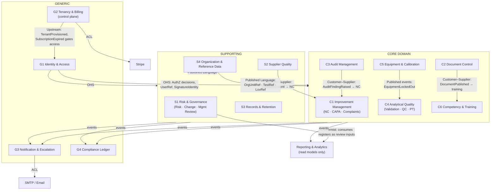

**Integration pattern register:**

| Relationship | Pattern | Contract |
|---|---|---|
| S4 → all quality contexts | **Published Language** | `OrgUnitRef`, `TestRef`, `LovRef`, `LocalizedText` are the only way to reference org structure and catalogs. Consumers validate refs at write time; S4 publishes deactivation events. |
| G1 → all contexts | **Open-Host Service** | Authorization queries (`can(user, privilege, orgScope)`) and `SignatureIdentity` verification. No context stores role/privilege logic locally. |
| G2 → all tenant contexts | **Upstream / event gate** | `TenantProvisioned`, `TenantSuspended`, `SubscriptionExpired` open/close the tenant's world. Tenant contexts are conformist to tenancy decisions. |
| C3 → C1, S2 → C1 | **Customer–Supplier** | C1 guarantees an NC will be opened for every NC-graded finding / validated supplier incident (event + saga-style follow-up, see §7). |
| C2 → C6 | **Customer–Supplier** | New published version of a training-relevant document creates training assignments. |
| C5 → C4 | **Published events** | `EquipmentLockedOut` / `EquipmentReturnedToService`; C4 refuses result entry against locked equipment. |
| All → G4, all → G3 | **Open-Host Service (event intake)** | Fire-and-forget append (G4) and subscription rules (G3). Neither ever calls back into a producer. |
| G2 → Stripe, G3 → SMTP | **Anti-Corruption Layer** | Stripe objects and SMTP details never leak into domain language. |
| Shared kernel (all) | **Minimal by design** | Exactly three items: `TenantId`, `UserRef`, `LocalizedText`. Everything else travels as published language or events. Keeping the kernel this small is deliberate — shared kernels are the most expensive coupling to unwind. |

---

## 4. Aggregates by Context

Notation: **AR** = aggregate root · E = internal entity · VO = value object. "Invariants" are rules the aggregate enforces transactionally; anything cross-aggregate is an event + policy.

### C1 Improvement Management

**Nonconformance (AR)** — the central aggregate of the product.
- Contains: `RcaRecord` (E, one per investigation round, method = 5-Whys | Fishbone | other), `CapaAction` (E, type CORRECTIVE | PREVENTIVE, owner, due date), `EffectivenessCheck` (E, scheduled date, verdict), `ContainmentAction` (VO).
- Key VOs: `NcRef`, `Severity` (1–5), `Likelihood` (1–5), `RiskPriorityNumber` (derived, §6), `SourceType` (Internal | Complaint | Audit | Supplier | PT), `SlaTarget`.
- Invariants:
  1. State transitions only along the canonical machine (§5.2); every transition demands the corresponding privilege and, for Verify/Close, a `SignatureEnvelope`.
  2. Cannot enter `PendingVerification` with any open `CapaAction`.
  3. Cannot `Close` without a passed `EffectivenessCheck`.
  4. SoD: the closing signer ≠ the raising user (checked via `SegregationOfDutiesPolicy`, rejected inside the aggregate).
  5. `Rejected` is reachable only from `Raised`.
- Sizing rationale: CAPA actions and effectiveness checks are *inside* the root because invariants 2–3 are transactional ("close" must atomically see all actions' states). RCA rounds stay inside because loop-backs (failed verification reopens the action plan) mutate NC state and RCA state together. This is the correct place to be a "large" aggregate; contention is low (one NC is worked by few people).

**Complaint (AR)**
- Key VOs: `ComplaintRef`, `Channel`, `ConfidentialityFlag` (drives reporter-identity encryption at rest + `can_view_confidential` privilege), `NcRef?` (link by reference, never by object).
- States: Logged → Acknowledged → Validated → Investigating → OutcomeLogged → Resolved → Closed (+ Invalid from Validated-gate).
- Invariants: acknowledgment deadline tracked via SLA event; **cannot Close while the linked NC is open** — enforced as a policy that subscribes to `NonconformanceClosed` (eventual consistency, because NC lives in another aggregate; the Close command checks a locally-projected NC status and the policy heals races). Validation verdict "justified" **must** emit `ComplaintValidated`, which C1's own policy turns into an NC.

### C2 Document Control

**ControlledDocument (AR)**
- Contains: `DocumentVersion` (E: `SemanticVersion` VO, `FileReference` VO, change summary, status Draft | UnderReview | Published | Obsolete), `SignatureSet` (VOs: `SignatureEnvelope` per role Author | Reviewer | Approver).
- Key VOs: `DocumentCode` (e.g. `SOP-CAL-045`, unique per tenant), `DocCategory`, `ReviewCycle` (e.g. SOP expiry reminder window).
- Invariants:
  1. Exactly **one** version in `Published` at any time; publishing version *n* atomically obsoletes *n−1* (and emits `DocumentVersionObsoleted` → watermarking is a downstream file-processing concern, not an aggregate concern).
  2. SoD: author of the draft cannot be its Reviewer or Approver (FR-DOC-02).
  3. Publish requires complete `SignatureSet` (reviewer + approver envelopes).
  4. Version numbers strictly increase; major/minor bump rule (+1.0 re-issue / +0.1 revision) enforced by `SemanticVersion` factory.
- Note: the *file bytes* live behind `FileReference` (storage port). The aggregate owns document *control*, not document *content*.

### C3 Audit Management

**AuditProgram (AR)** — the annual/periodic plan: schedule entries, scope, auditor assignments. Small; exists so schedule changes don't contend with live audit execution.

**Audit (AR)**
- Contains: `ChecklistItem` (E: clause ref, question, verdict Conform | OFI | NC, evidence note), `Finding` (E: grade OFI | Minor NC | Major NC, description, `NcRef?` back-reference filled when C1 confirms).
- Key VOs: `AuditRef`, `IsoClauseRef`, `AuditType` (Internal | External-hosted).
- Invariants:
  1. Cannot move to `Reporting` with unanswered checklist items.
  2. Every NC-graded finding must have `FindingRaised` emitted before report sign-off; sign-off is blocked while any finding lacks an acknowledged NC reference (completed by the cross-context confirmation event, §7).
  3. Report sign-off (`SignatureEnvelope`, lead auditor + QM) **locks** the audit record (immutable thereafter).
  4. SoD: an auditor cannot own CAPA actions arising from their own findings (checked when C1 assigns owners — the rule lives in `SegregationOfDutiesPolicy`, the data to check it travels in the event).

### C4 Analytical Quality

**ValidationStudy (AR)**
- Contains: `ProtocolConfiguration` (VO: CLSI protocol EP05/EP06/EP09/EP17, analyte, method, acceptance targets incl. `TotalAllowableError`), `MeasurementSeries` (VO: immutable ordered replicate sets), `StatisticalResult` (VO: computed regression/precision/bias outputs), sign-off `SignatureEnvelope`.
- States: ProtocolConfigured → DataEntered → StatsCalculated → SignedOff (locked).
- Invariants: data entry closed after calculation unless explicitly reopened (which voids results); sign-off locks the study; results must be recomputed if any series changes — enforced by keeping `StatisticalResult` derivable-only (never hand-set).

**QcProfile (AR)** — analyte + instrument + control level + lot: target mean/SD, active Westgard rule set, effective dates. Referenced by id from runs.

**QcRun (AR — deliberately separate)** — one control measurement: value, timestamp, operator, `WestgardVerdict` (VO: rule outcomes, InControl | Warning | OutOfControl), troubleshooting log entry refs.
- Sizing rationale: QC runs arrive at instrument frequency (potentially hundreds/day/analyte). Folding them into `QcProfile` would serialize all writes for an analyte behind one optimistic-concurrency token. Runs are individually consistent (a verdict depends on the profile's rule set + a *window* of prior runs, evaluated by `WestgardEvaluator` reading a projection — not by locking the profile).
- Invariant: an `OutOfControl` run demands a troubleshooting entry + a passing re-run before results release resumes for that analyte (release gate enforced where results are released — out of scope here; the event contract is this context's obligation).

**PtEnrollment (AR)** — PT scheme + analyte + cycle. Contains `PtResult` (E: submitted value, provider target, `ZScore` VO, `PerformanceCategory` derived: |z|≤2 satisfactory · 2<|z|<3 questionable · |z|≥3 unsatisfactory).
- Invariant: unsatisfactory result **must** emit `PtUnsatisfactory` → C1 policy opens an NC (spec: FR-GOV-03 finally gets a home).

### C5 Equipment & Calibration

**EquipmentItem (AR)**
- Contains: `CalibrationRecord` (E: date, provider, certificate `FileReference`, result), `MaintenanceRecord` (E).
- Key VOs: `EquipmentCode`, `SerialNumber` (unique per tenant), `CalibrationSchedule` (interval + grace period), `EquipmentStatus`.
- Invariants:
  1. Canonical machine: Active → NeedsCalibration (due date reached) → OutOfService (grace exhausted) → Active (calibration record + certificate logged and approved).
  2. Return to Active **requires** a new `CalibrationRecord` with certificate + approver signature.
  3. Status transitions to NeedsCalibration/OutOfService are driven by the scheduled sweep (application-layer job) but *validated and applied by the aggregate* — the job proposes, the aggregate disposes. Emits `EquipmentLockedOut` / `EquipmentReturnedToService`.

### C6 Competency & Training

**CompetencyRecord (AR)** — one per (person, competency subject e.g. SOP/method).
- Contains: `AssessmentResult` (VO: score 0–100, assessor `UserRef`, date), authorization `SignatureEnvelope` (assessor PIN), `ExpiryWindow` VO.
- States: PendingTraining → Evaluated → Authorized → (Expired → Requalify | Revoked).
- Invariants: Authorized requires latest score ≥ 80 **and** assessor signature **and** assessor ≠ trainee (SoD rule 4); score < 80 loops to PendingTraining; expiry emits `CompetencyExpiring` (30-day lead) then `CompetencyExpired`.

**TrainingAssignment (AR)** — created by policy on `DocumentPublished` (for staff whose role/department matches the document's training matrix) or manually. States: Assigned → Completed → AssessmentLinked. Small, high-volume, hence separate from CompetencyRecord.

### S1 Risk & Governance

**RiskItem (AR)** — `RiskScore` VO (Likelihood 1–5 × Impact 1–5 = RPN; **no defaults** — both must be explicitly assessed, §10 challenge 12), `MitigationAction` (E), residual `RiskScore`. Invariant: closure requires residual score recorded; residual RPN > 12 emits `HighResidualRisk`.

**ChangeRequest (AR)** — impact analysis, `RiskAssessmentRef` (**required before Approve** — invariant), approval `SignatureEnvelope`, implementation notes. Closed change is immutable.

**ManagementReview (AR)** — participants, `InputPack` (VO: snapshot refs of the read-model reports reviewed — snapshots, so the reviewed evidence is preserved even as live data moves), `Decision` (E) each optionally spawning a `WorkTask` in G3. Invariant: minutes immutable after close + chair signature.

### S2 Supplier Quality

**Supplier (AR)** — profile, `ApprovalStatus` (PendingEvaluation → Approved → Suspended), `CertificateRecord` (E: type, expiry). Invariants: SoD rule 5 (creator ≠ approver); certificate expiry emits `SupplierCertificateExpiring` (30-day lead) and expiry auto-suspends (policy applies, aggregate validates).

**SupplierEvaluation (AR)** — periodic scored evaluation (criteria scores → weighted total), evaluator signature. Separate root: evaluations are historical records that must not be locked behind the supplier profile's concurrency, and they accrete forever.

### S3 Records & Retention

**ArchiveEntry (AR)** — `SourceRecordRef` (context + aggregate type + ref), content snapshot `FileReference`, `RetentionClass` VO (class → retention duration), `RetentionExpiry` (computed from archive date), state Archived ⇄ Retrieved → Disposed. Invariants: a source record is archivable once; disposal only after retention expiry **and** disposal authorization signature.

### S4 Organization & Reference Data

**Branch (AR)**, **Department (AR)** — org units with codes; deactivation emits events (consumers must not accept refs to deactivated units for new records). **TestCatalogItem (AR)** — test code, methodology, department, TAT. **LovEntry (AR)** — category + code + `LocalizedText`. All small CRUD-with-rules aggregates; their value is being the *only* mint for `OrgUnitRef` / `TestRef` / `LovRef`.

### G1 Identity & Access

**UserAccount (AR)** — identity, credential refs, `MfaEnrollment` VO (TOTP; **required for all active accounts** — contradiction resolved §10.3), `PinCredential` VO (4-digit, salted-hashed, per user; used only through `ESignatureService`), `LockoutState` VO (5 failures → 30-min lock, FR-AUTH-02), profile prefs (language, theme), role memberships (by `RoleRef`), org-unit scope grants.

**Role (AR)** — name + set of `PrivilegeGrant` VOs (`PrivilegeCode` = `OBJECT.ACTION` from the canonical catalog) + org-scope template. The ~70-privilege catalog is a versioned reference list owned here.

**UserSession (AR)** — token hash, device/IP, revocation flag. Admin revocation invalidates JWT immediately (session check on privileged operations).

### G2 Tenancy & Billing (control plane — not tenant-scoped)

**Tenant (AR)** — identifier (URL slug, immutable after provisioning), display name, status (Provisioning → Active → Suspended → Terminated), `TenantSettings` VO (password expiry days, calibration reminder days, SOP expiry months, default language, timezone).

**Subscription (AR)** — `PlanTier` VO (Free | Pro | Enterprise → entitlements), period, `Money` VO, Stripe customer/subscription ids held as opaque ACL refs. Events: `SubscriptionExpired`, `PlanChanged` (entitlement gates evaluated by consumers).

**ProvisioningRequest (AR)** — the admin-portal wizard made real: org details, contact verification state, decision (approve → orchestrated provisioning, §6), audit of who approved.

### G3 Notification & Escalation

**NotificationRule (AR)** — trigger event type (e.g. `NC_CREATED`), recipient spec (roles | users | entity-contextual: owner/assignee/participant), channels (InApp | Email | Both), template ref. **MessageTemplate (AR)** — localized subject/body with placeholders. **MessageDispatch (AR)** — one delivery attempt log: status, error, retry count (90-day retention). **SlaDefinition (AR)** — module + severity → target working hours. **EscalationTimer (AR)** — armed by events (e.g. `CapaActionAssigned`), deadline from SlaDefinition, ladder level 0→1 (+24 h, owner) →2 (+48 h, dept head) →3 (+72 h, QM), each step emits `EscalationTriggered` + creates a `WorkTask`. **WorkTask (AR)** — the "My Tasks" queue item: subject ref, assignee, due, state Pending → Completed (auto-escalates at 3 days overdue).

### G4 Compliance Ledger

**AuditTrailEntry (AR, append-only)** — actor, action verb (INSERT | UPDATE | DELETE | SIGN_OFF | LOGIN | …), subject ref, before/after digest, timestamp, **hash chained to the previous entry per tenant** (tamper evidence; the writing identity has no UPDATE/DELETE grant on this store — NFR-SEC-03). **SignatureRecord (AR, append-only)** — the durable Part 11 record of every `SignatureEnvelope` applied anywhere: signer, meaning ("I approve SOP-CAL-045 v3.0"), subject ref, timestamp, verification hash.

---

## 5. Aggregate & State-Machine Diagrams

### 5.1 Nonconformance aggregate

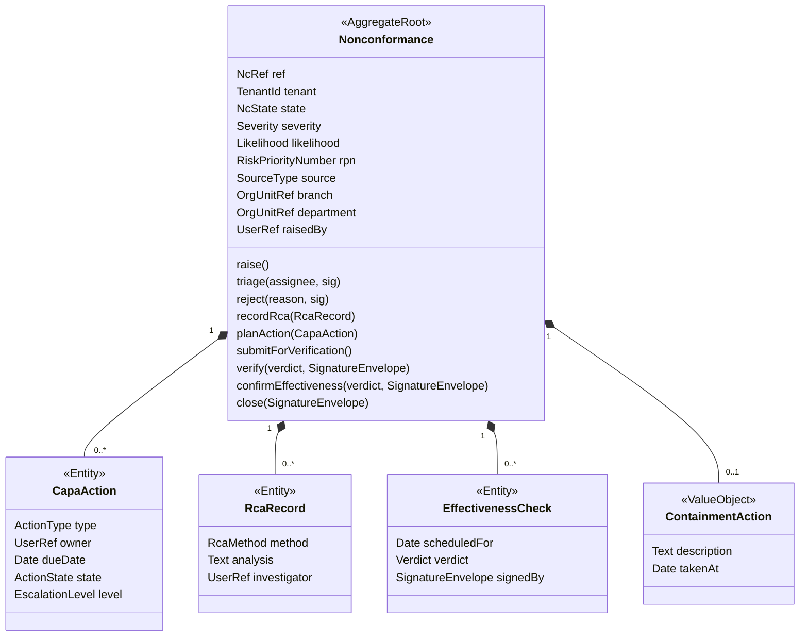

### 5.2 Canonical NCR state machine (resolved: SRS 9-state diagram wins over the 4-state doc text and UI)

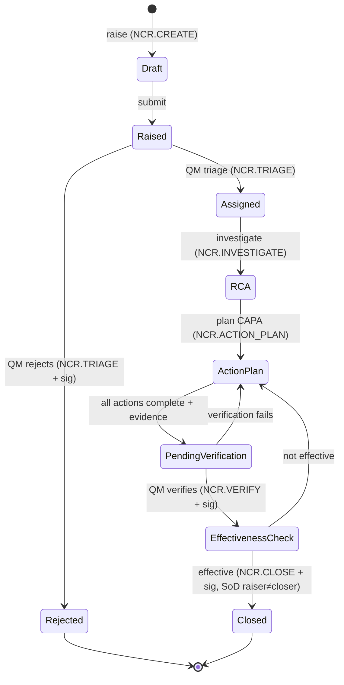

*Resolution note:* the as-built UI's 4-state flow (OPEN → CAPA_IN_PROGRESS → VERIFICATION → CLOSED) proved users can operate a linear flow; the target machine keeps that happy path linear while adding the states regulators actually ask about (triage/rejection, RCA as a first-class stage, effectiveness loop-backs). The UI's "reopen" becomes a guarded `Closed → ActionPlan` administrative transition with mandatory justification + signature (not shown above; privilege `NCR.REOPEN`, new — flagged for the privilege catalog).

### 5.3 ControlledDocument aggregate & lifecycle

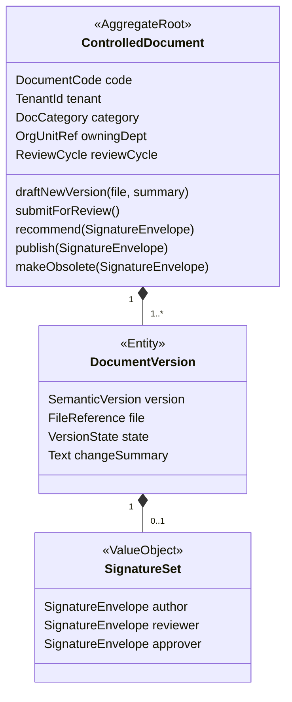

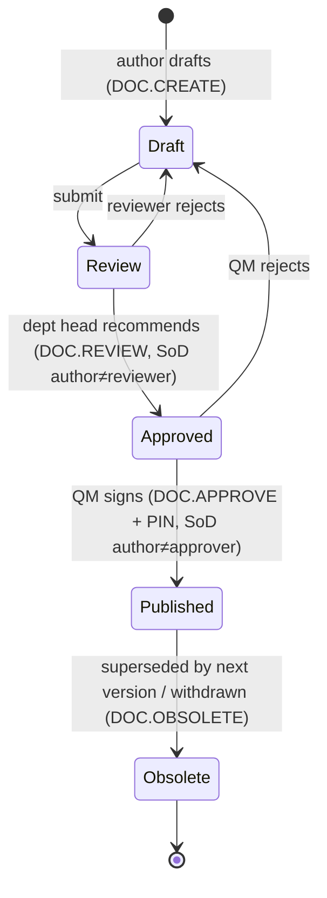

### 5.4 Audit aggregate

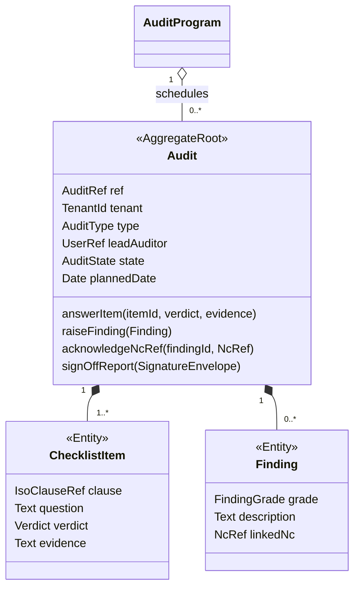

### 5.5 EquipmentItem aggregate & lifecycle

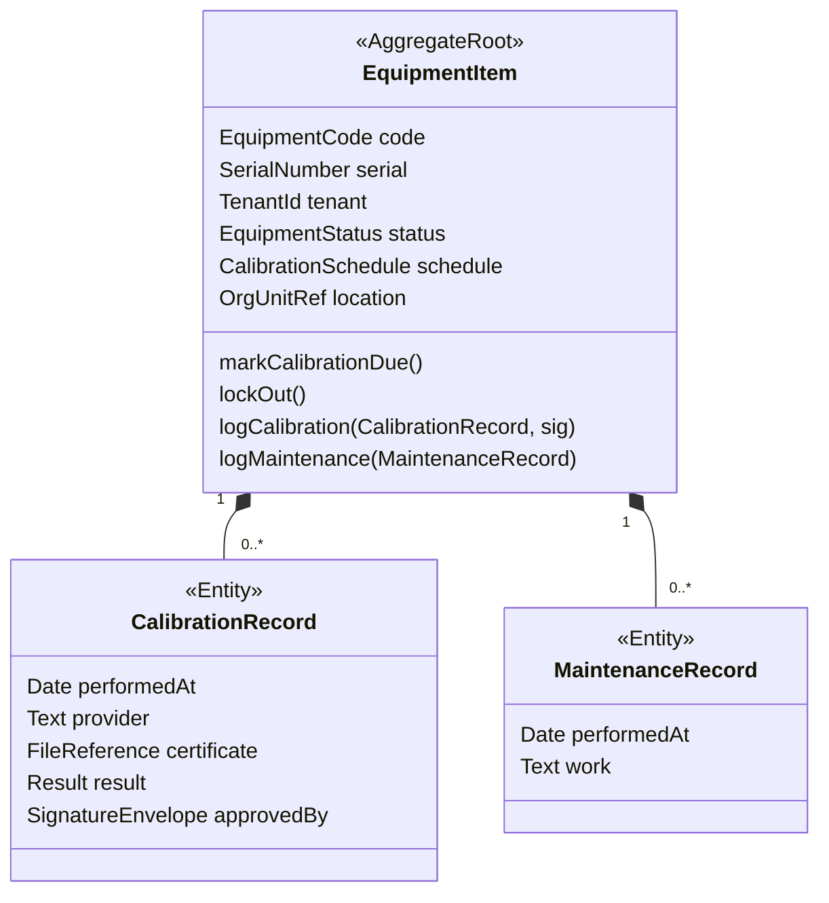

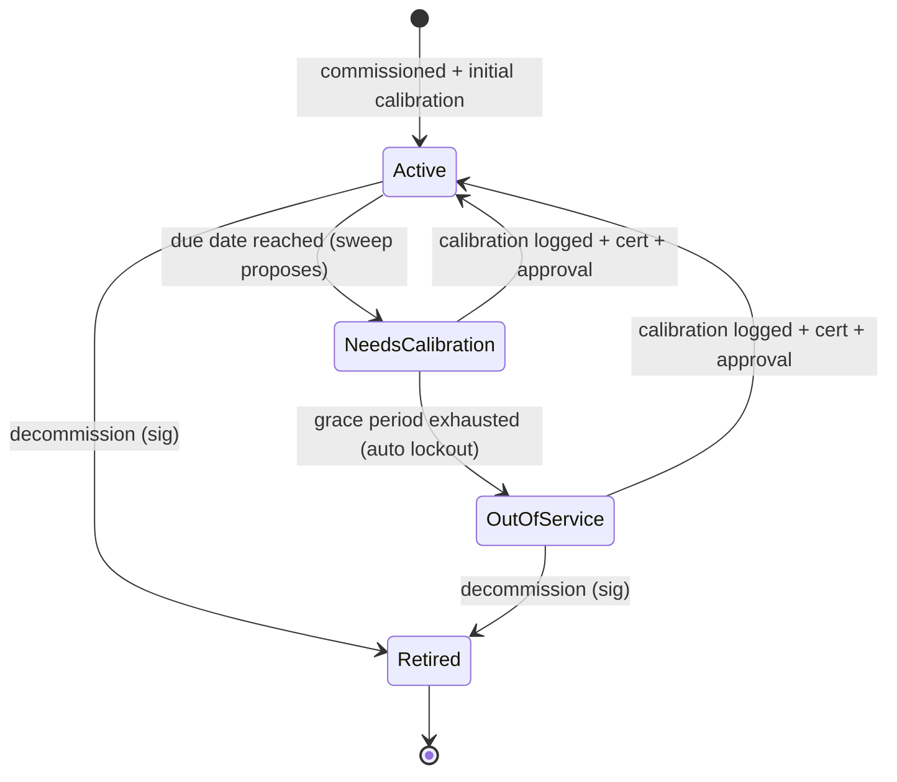

### 5.6 Competency & QC & Validation state machines

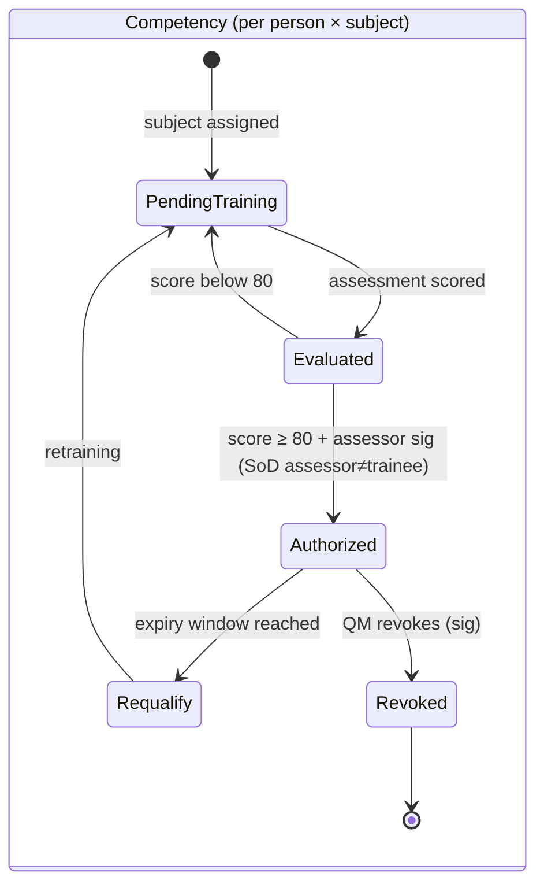

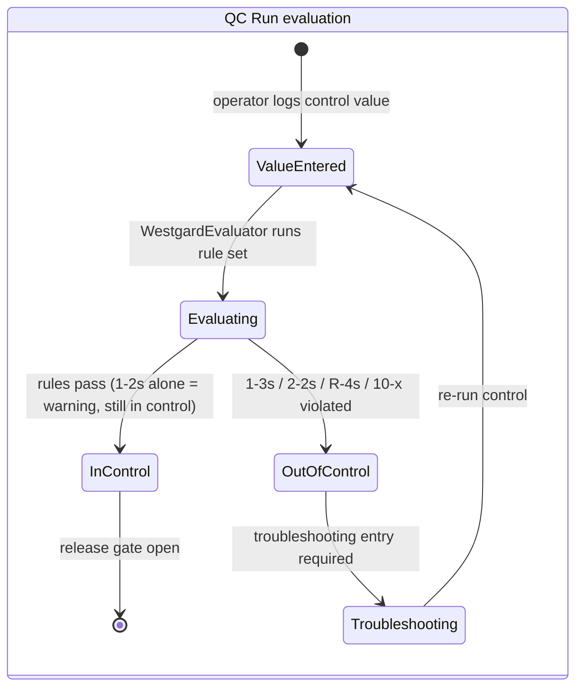

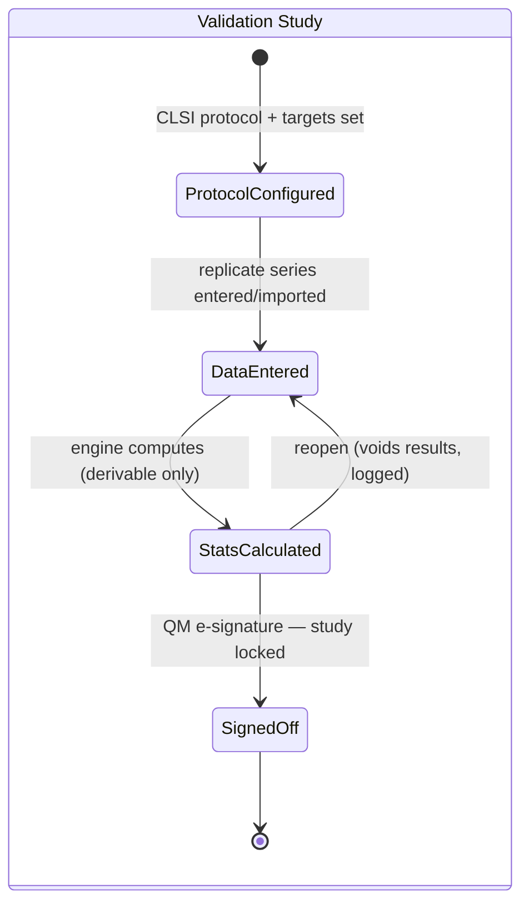

### 5.7 Tenancy control plane

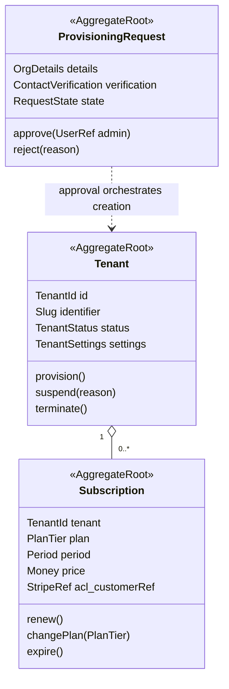

---

## 6. Entities vs Value Objects Catalog

**Shared kernel (three items only):** `TenantId` · `UserRef` · `LocalizedText { en, ar, fr; fallback → en }`.

**Cross-context value objects (defined once, in the owning context, consumed as published language):**

| VO | Owner | Definition & rules |
|---|---|---|
| `OrgUnitRef` (BranchRef/DeptRef) | S4 | Opaque validated reference; minted only by S4; consumers reject refs to deactivated units for new records. Replaces free-text BranchId/DeptId. |
| `TestRef`, `LovRef` | S4 | Same pattern for catalog/list values. |
| `SignatureEnvelope` | G4 (schema) / G1 (identity) | { signer UserRef, meaning statement, subject ref, UTC timestamp, verification hash }. Produced only by `ESignatureService`; immutable; always mirrored to G4.SignatureRecord. |
| `PrivilegeCode` | G1 | `OBJECT.ACTION` from the versioned catalog (~70 codes; the ~11 documented ones are seeds, the rest derived from the UI matrix: 28 modules × View/Create/Edit/Approve/Delete, then de-duplicated into meaningful codes). |
| `FileReference` | (infrastructure port, schema shared) | { storage key, filename, content hash, size, mime }. Content lives behind a storage port — never base64-in-JSON. |

**Per-context highlights (entity vs VO decision stated where it's non-obvious):**

| Context | Entities (identity matters, mutable) | Value Objects (equality by value, immutable) |
|---|---|---|
| C1 | CapaAction, RcaRecord, EffectivenessCheck | NcRef, Severity, Likelihood, RiskPriorityNumber (factory: S×L, both mandatory), SourceType, ContainmentAction, SlaTarget |
| C2 | DocumentVersion | DocumentCode, SemanticVersion (bump rules in factory), SignatureSet, ReviewCycle, DocCategory |
| C3 | ChecklistItem, Finding | AuditRef, IsoClauseRef, Verdict, FindingGrade |
| C4 | PtResult | ProtocolConfiguration, MeasurementSeries (immutable — corrections create a new series, old one voided with reason), StatisticalResult (derivable-only), ZScore, PerformanceCategory (derived from ZScore), WestgardVerdict, ControlTarget (mean/SD/lot), TotalAllowableError |
| C5 | CalibrationRecord, MaintenanceRecord | EquipmentCode, SerialNumber, CalibrationSchedule (interval + grace), EquipmentStatus |
| C6 | — (TrainingAssignment is its own AR) | AssessmentResult (score 0–100), ExpiryWindow |
| S1 | MitigationAction, Decision | RiskScore (L, I, RPN derived; no defaults), RiskAssessmentRef, InputPack (snapshot refs) |
| S2 | CertificateRecord | ApprovalStatus, EvaluationScore (weighted criteria) |
| S3 | — | SourceRecordRef, RetentionClass (class → duration map), RetentionExpiry |
| G1 | — | MfaEnrollment, PinCredential (exactly 4 digits, salted hash, never comparable in plaintext), LockoutState, PrivilegeGrant |
| G2 | — | Slug, PlanTier (→ entitlement set), Money, Period, TenantSettings, StripeRef (opaque ACL token) |
| G3 | — | RecipientSpec, ChannelSet, SlaTargetHours (working-hours aware), EscalationLevel (0–3), TemplatePlaceholders |
| G4 | — | ActionVerb, HashChainLink, SignatureEnvelope (see above) |

**Why `MeasurementSeries` and `StatisticalResult` are VOs, not entities:** a replicate set has no lifecycle — it is evidence. If it could be edited in place, the signed statistics above it would silently rot. Immutability + void-and-replace is the Part 11-compatible shape.

**Why `NcTimelineLog` does not exist in the target model:** the as-built hand-rolled timeline (string timestamps, hardcoded user `'arfa'`) is replaced by domain events projected into a per-record activity view, with the authoritative trail in G4. One source of truth, zero drift.

---

## 7. Domain Events Catalog

Naming: past tense, tenant-scoped, carrying refs not object graphs. ★ = triggers a cross-context policy.

| Context | Events | Cross-context reactions |
|---|---|---|
| C1 | NcRaised★, NcTriaged, NcRejected, RcaRecorded, CapaActionPlanned★, CapaActionCompleted, CapaVerificationFailed, NcVerified, NcEffectivenessConfirmed, NcClosed★, NcReopened★, ComplaintLogged★, ComplaintAcknowledged, ComplaintValidated★, ComplaintResolved, ComplaintClosed | NcRaised → G3 notify (severity-routed; high-impact NCs alert directors), G4 append. CapaActionPlanned → G3 arms EscalationTimer per SlaDefinition. NcClosed → C1 complaint-closure gate re-check; S3 eligible for archive. ComplaintValidated → C1 policy opens NC (source=Complaint). |
| C2 | DocumentDrafted, DocumentSubmittedForReview, DocumentRecommended, DocumentPublished★, DocumentRejected, DocumentVersionObsoleted★, DocumentReviewDue★ | DocumentPublished → C6 policy creates TrainingAssignments per training matrix; G3 notify. DocumentVersionObsoleted → file-processing applies "OBSOLETE — UNCONTROLLED" watermark (FR-DOC-03). DocumentReviewDue (from sweep vs ReviewCycle) → G3 notify + WorkTask. |
| C3 | AuditScheduled★, AuditStarted, ChecklistCompleted, FindingRaised★, AuditReportSignedOff★ | FindingRaised(grade=NC) → C1 opens NC (source=Audit) and replies with NcOpenedForFinding★ → C3 `acknowledgeNcRef` (this closes the guarantee loop; sign-off stays blocked until every NC-graded finding is acknowledged). AuditScheduled → G3 notify auditees. |
| C4 | ValidationStudySignedOff, QcRunEvaluated, QcOutOfControl★, QcReturnedToControl, PtResultRecorded, PtUnsatisfactory★ | QcOutOfControl → G3 notify + release gate closes for analyte. PtUnsatisfactory → C1 opens NC (source=PT). |
| C5 | CalibrationDue★, EquipmentLockedOut★, CalibrationLogged, EquipmentReturnedToService★, EquipmentRetired | CalibrationDue (30-day lead per TenantSettings) → G3 notify owner + WorkTask. EquipmentLockedOut → C4 refuses QC/validation entry against the item; G3 notify. |
| C6 | TrainingAssigned, AssessmentScored, CompetencyAuthorized, CompetencyExpiring★, CompetencyExpired★, CompetencyRevoked | CompetencyExpiring (30-day) → G3 notify trainee + manager. CompetencyExpired → authorization checks in consuming workflows fail. |
| S1 | RiskAssessed, HighResidualRisk★, RiskClosed, ChangeProposed, ChangeApproved★, ChangeClosed, ReviewScheduled★, ReviewClosed★ | HighResidualRisk (RPN>12) → G3 dashboard alert + notify QM. ChangeApproved → G3 WorkTasks for implementation steps. ReviewClosed → Decisions spawn WorkTasks; minutes locked. |
| S2 | SupplierApproved, SupplierSuspended★, SupplierCertificateExpiring★, EvaluationRecorded, SupplierIncidentRecorded★ | CertificateExpiring → G3 notify purchaser; expiry → policy suspends. SupplierIncidentRecorded → C1 opens NC (source=Supplier). |
| S3 | RecordArchived, RecordRetrieved, RecordDisposed | All → G4. |
| G1 | UserRegistered, RoleAssigned, PrivilegeMatrixChanged★, UserLockedOut, SessionRevoked★, SignatureVerified | PrivilegeMatrixChanged → sessions re-evaluated (changes apply to live sessions). SessionRevoked → JWT invalid on next privileged call. |
| G2 | ProvisioningRequested★, TenantProvisioned★, TenantSuspended★, SubscriptionExpired★, PlanChanged★ | TenantProvisioned → G1 seeds tenant-admin account + default roles; S4 seeds default LOVs. TenantSuspended/SubscriptionExpired → access gate closes (read-only or lockout per policy). |
| G3 | NotificationDispatched, DispatchFailed, SlaBreached★, EscalationTriggered★, TaskCompleted | SlaBreached → EscalationTriggered ladder (+24 h owner → +48 h dept head → +72 h QM), each step notifies + flags the source record Overdue (projection). |
| G4 | (terminal — consumes everything, emits nothing) | |

**Event-flow rule:** G3 and G4 are pure downstream consumers; no context ever *commands* them inline. This single rule eliminates the as-built pattern where the UI called the notification engine synchronously inside workflow methods.

---

## 8. Domain Services

| Service | Context | Responsibility & why it is not aggregate behavior |
|---|---|---|
| `ReferenceNumberGenerator` | one per numbered context | Issues `NC-2026-004`-style refs from a **per-tenant, per-type, per-year database sequence**. Not aggregate behavior because uniqueness spans all instances; the as-built `count+1` approach is a race condition and renumbers after deletes. |
| `SegregationOfDutiesPolicy` | shared policy, rules owned by each context | Evaluates the 5 SoD rules: (1) NC closer ≠ raiser; (2) document author ≠ reviewer/approver; (3) auditor ≠ CAPA owner for own findings; (4) assessor ≠ trainee; (5) supplier approver ≠ creator. Called by aggregates at transition time with the identities in play; identity facts come from G1. Rejection is a domain error (e.g. `SOD-CAPA-001`), not a UI hint. |
| `ESignatureService` | G1 + G4 | Verifies the actor's `PinCredential` (+ session freshness), mints an immutable `SignatureEnvelope` bound to a meaning statement and subject ref, appends `SignatureRecord` to G4. The only path to a signature — aggregates receive envelopes, never PINs. |
| `SlaClock` / `EscalationService` | G3 | Computes deadlines in **working hours** from `SlaDefinition`, arms/advances `EscalationTimer`s, emits `SlaBreached`/`EscalationTriggered`. Cross-aggregate and time-driven, hence a service + scheduled job pair. |
| `WestgardEvaluator` | C4 | Evaluates 1-3s / 2-2s / R-4s / 10-x (reject) and 1-2s (warn) over the run window for a profile; returns `WestgardVerdict`. Stateless calculation over a projection of recent runs — exactly what a domain service is for. |
| `ZScoreCalculator` | C4 | z = (result − assigned value) / SD, → `PerformanceCategory`. Trivial but centralized so PT and ILC agree. |
| `EquipmentLockoutPolicy` | C5 | Decides due/grace/lockout from `CalibrationSchedule` + TenantSettings lead times; invoked by the daily sweep; the aggregate applies the transition. |
| `RetentionPolicy` | S3 | Maps `RetentionClass` → durations, computes expiry, decides disposal eligibility; supports the ">5 years bulk archive" rule as a query it owns. |
| `ProvisioningOrchestrator` | G2 | Saga: approve request → create Tenant → seed G1 admin + roles → seed S4 defaults → activate → notify. Multi-context, compensating on failure — a process manager, listed here because provisioning *is* domain behavior for a SaaS. |

Deliberately **not** domain services: RPN computation (a `RiskPriorityNumber` factory — pure function of one aggregate's data), version bumping (`SemanticVersion` factory), localized fallback (`LocalizedText` behavior).

---

## 9. Roles → Context Mapping

The three incompatible role vocabularies in the docs are reconciled into one canonical set (mapping shown so existing documents remain readable):

| Canonical role | SRS names it | Product doc names it | MV module names it | Primary contexts |
|---|---|---|---|---|
| **Platform Administrator** | SysAdmin | Admin (SaaS) | — | G2, G1 (cross-tenant); no access to tenant quality data |
| **Tenant Administrator** | — (implied) | Admin | — | G1, S4, G3 config within tenant |
| **Quality Manager** | QualityManager (QM) | QA Officer | QC Manager | C1–C6 approve/close, S1–S3, G3 rules — the power user |
| **Lab Director** | LabDirector | — | Director | Sign-offs: management review chair, high-severity visibility |
| **Department Head** | TechManager | Section Manager | Section Head | Reviews (C2), investigations (C1), dept-scoped approvals |
| **Analyst / Technician** | Analyst | Lab Technician | Technician | Raise NCs, log QC runs, complete training, log calibrations |
| **Equipment Owner** | EquipmentOwner | — | — | C5 schedules/logs (a *responsibility assignment*, typically held alongside Analyst/Dept Head) |
| **External Auditor** | — | Guest / External Auditor | — | Read-only registers, trails, dossiers; time-boxed accounts |

Privileges remain `OBJECT.ACTION` codes granted to roles (G1); roles are tenant-editable but the canonical set ships as seed data. The as-built UI's three roles (manager/tech/auditor) map onto Quality Manager / Analyst / External Auditor — evidence the canonical set is operable.

---

## 10. Design Challenges — Weak Decisions, Called Out

### 10.1 As-built decisions rejected in the target model

| # | Weak decision (as built) | Why it is weak | Target-state remedy |
|---|---|---|---|
| 1 | Magic-string statuses everywhere; the UI, backend defaults and docs disagree on the state sets | No transition guards; illegal states representable; three sources of truth already diverged | Typed state machines per aggregate (§5); transitions are the **only** mutators; each guarded by privilege + (where spec'd) signature |
| 2 | `BranchId`/`DeptId` as free text on every record | Zero referential integrity; renames orphan every record; row-level scoping built on strings | `OrgUnitRef` minted/validated by S4 (published language); deactivation events; scoping evaluated in G1 against refs |
| 3 | NC ref = `count + 1` | Race condition under concurrency; renumbering after deletes destroys traceability — fatal in an audit | `ReferenceNumberGenerator` per tenant/type/year sequence; refs never reused |
| 4 | Universal e-sign PIN `0000`; timeline author hardcoded `'arfa'` | Not an electronic signature in any Part 11 sense; attribution fiction | Per-user `PinCredential` + `ESignatureService` + immutable `SignatureEnvelope` mirrored to G4; meaning statement bound to every signature |
| 5 | Dual persistence: unused relational scaffold + JSON-blob store as real backend | Two half-models, no invariants enforceable in either; blob writes are whole-module last-writer-wins | One relational model per aggregate; blob store retired (its 9-key sync code is the seed of the data migration) |
| 6 | Authorization entirely client-side; backend is binary `[Authorize]`; unknown roles default to full manager rights | Any authenticated caller can do anything; the default-to-manager fallback is privilege escalation by typo | G1 as authorization OHS; every command checks `PrivilegeCode` + org scope server-side; deny-by-default |
| 7 | `CapaAction` not tenant-scoped; `NcTimelineLog` with string timestamps | Child rows escape tenant filters; timeline is unverifiable narrative | CAPA/RCA/checks live **inside** the NC aggregate (tenancy via root); timeline replaced by domain events + G4 ledger |
| 8 | `QamsUser` (decorative role string) parallel to `IdentityUser` | Two user records drift; the decorative role is what the UI trusts | Single `UserAccount` aggregate in G1; role membership is the only role fact |
| 9 | Notifications dispatched inline from UI workflow methods | Business rules about who-must-know live in a browser; nothing fires for API-originated changes | G3 subscribes to domain events; producers never call it |
| 10 | Files as base64 data-URLs inside JSON blobs | Blob bloat, no dedup/virus-scan/streaming; documents of record inside a mutable blob | `FileReference` VO + storage port; content-hash for integrity |
| 11 | `NameEn/NameAr/NameFr` column triplets | Language explosion hardcoded into every schema and query | `LocalizedText` VO (shared kernel) with declared fallback |
| 12 | Risk defaults Likelihood=Impact=3 (RPN 9 appears without any assessment) | Fabricated risk data — worse than none | `RiskScore` factory requires explicit L and I; no defaults |
| 13 | Statistics engine fabricates trends (seeded PRNG, hardcoded 0.72 ratios) | Compliance dashboards showing invented numbers is an audit finding waiting to happen | Reporting = projections from real events only; unmeasurable metrics render as "insufficient data", never simulated |
| 14 | SLA configs stored but no engine; escalation ladder documented, unbuilt | Config UI without behavior is a false promise to the QM | `SlaClock` + `EscalationTimer` in G3 as first-class aggregates/services (§8) |

### 10.2 Challenges to the *specification* (not just the code)

1. **The 32-module structure is a UI taxonomy, not a domain decomposition.** Designing one context per module (or one aggregate per grid) would reproduce the scaffold backend's anemia at higher cost. This model deliberately regroups (28 modules → 14 contexts; traceability in §11).
2. **"~70 atomic privileges" with only 11 enumerated** is not a permission model — it's an aspiration. The target model makes the catalog a versioned artifact in G1, seeded from the UI's proven 28×5 matrix, then rationalized; new privileges (e.g. `NCR.REOPEN`) require catalog changes, not string invention.
3. **The spec puts Hangfire sweeps in charge of state.** A job flipping statuses directly would bypass invariants. Resolved: sweeps *propose*, aggregates *decide* (see C5). This is a small change in wording and a large change in integrity.
4. **`TenantSettings` mixes concerns** (password expiry = G1 policy; calibration lead = C5 policy; default language = UX). Kept as one VO in G2 for administration convenience, but each consuming context reads its own slice as configuration — no context writes another's policy.
5. **The docs' "Simulated Translation" for LOVs** should be dropped as a feature claim: either integrate a real MT provider behind an ACL (future) or require manual trilingual entry (current). A simulation in a compliance product erodes trust in everything else.

### 10.3 Spec-vs-spec contradictions — resolved

| Contradiction | Resolution | Rationale |
|---|---|---|
| NCR machine: 9-state diagram vs 4-state doc text vs 4-state UI | **9-state canonical** (§5.2), linear happy path preserved | The extra states are exactly what ISO 8.7 assessors probe (triage, RCA, effectiveness); UI proved the linear path is usable |
| Three role vocabularies | Canonical 8-role set (§9) with mapping table | Preserves every documented persona; tenant-editable roles keep flexibility |
| PIN "exactly 4 digits" vs "4+ digits" | **Exactly 4** in `PinCredential`, per the dominant spec — but PIN is a *signing* factor layered on an authenticated MFA session, so its entropy is not the security boundary | Part 11 signature = identity (session+MFA) + intent (PIN + meaning statement) |
| MFA "all accounts" vs "managers only" | **All active accounts** (FR-AUTH-01 wording wins) | 17025 labs handle patient-adjacent data; partial MFA leaves the raise/log accounts (the majority) weak |
| 22 PascalCase tables vs lowercase per-module table names | Neither is authoritative; persistence follows the aggregate design here | The data dictionary was generated from two different sources; schema design is a follow-up phase deliverable |
| API appendix (generic endpoints only) vs per-module route claims | Per-context APIs follow aggregates | Follow-up phase; the generic `QamsEntities` module is a scaffold to delete, not a pattern |

---

## 11. Traceability — Product Inventory Modules → Bounded Contexts

| Inventory module (§3.1) | Context | Inventory module | Context |
|---|---|---|---|
| Quality Dashboard | Reporting (read models) | Users Management | G1 |
| Document Control | C2 | Roles & Privileges Matrix | G1 |
| NC & CAPA | C1 | LOVs | S4 |
| Complaints | C1 | Branches / Departments | S4 |
| Internal Audit | C3 | Test Catalog | S4 |
| Competency & Training | C6 | System Audit Trail | G4 |
| Equipment & Calibration | C5 | Active User Sessions | G1 |
| Risk & Opportunity | S1 | Notification Settings/Monitor | G3 |
| Change Control | S1 | SLA & TAT Analytics | G3 (config/engine) + Reporting (views) |
| Management Review | S1 | My Tasks Queue | G3 |
| Supplier Quality | S2 | User Manual | (content asset — no context) |
| PT / ILC | C4 | Profile Settings | G1 |
| Quality Archive | S3 | AI Quality Copilot | (excluded from domain model — an application-layer assistant over read models; no aggregates; future ACL to an LLM provider) |
| Quality Statistics / Review Pack | Reporting (read models) | Method Validation / QC & Westgard | C4 |
| Admin portal: tenants, provisioning, billing, plans | G2 | LIMS / EHS | **excluded by scope decision** |

**Requirement coverage:** FR-AUTH-01/02 → G1 (`MfaEnrollment`, `LockoutState`) · FR-DOC-01 → C2 machine · FR-DOC-02/FR-DOC-SOD → SoD rule 2 · FR-DOC-03 → `DocumentVersionObsoleted` watermark reaction · FR-CAPA-01 → C1 machine + privileges · FR-CAPA-02/FR-CAPA-RPN → `RiskPriorityNumber`/`RiskScore` factories · FR-CAPA-03 → G3 escalation ladder · FR-GOV-01/FR-EQUIP-LOCK → C5 lockout + C4 gate · FR-GOV-02/FR-TRAIN-SCORE → C6 authorization invariant · FR-GOV-03 → `ZScoreCalculator` + `PtUnsatisfactory` · NFR-SEC-03 → G4 hash chain + no-update grants.

---

## 12. What This Model Deliberately Defers

- **Persistence schema, API contracts, module-by-module migration plan** — next phases; the aggregate boundaries here are their input.
- **Read-model catalog for Reporting & Analytics** — needs a KPI-by-KPI pass against the statistics engine to separate real metrics from fabricated ones (§10.1 challenge 13 sets the rule).
- **AI Copilot** — excluded from the domain; if revived, it is an application service over read models with an LLM ACL, never a writer.
- **Eventual-consistency SLAs per policy** (e.g. how quickly a validated complaint must materialize an NC) — an operational decision to make with the product owner; the model marks every such edge with ★ in §7.

---

*Designed 2026-07-21 from `NT_QAMS_Product_Inventory.md` (reverse-engineering of QMS.zip v1.5.0). Companion phases: target architecture, persistence & API design, migration roadmap.*

---

## 12. HQMS Hospital Extension — As-Built Addendum (2026-08)

The `feature/hqms-hospital-modules` train (baseline v1.54.0 → `d5cf5a4`+) added **12 bounded contexts** and extended four existing aggregates, taking the domain from 18 to **30 contexts**. `ModuleBoundaryTests` now covers all 30 pairwise plus an exhaustiveness gate (an unlisted context fails the build). This addendum records the as-built state; items marked **[open: X]** are unresolved findings from the 2026-08-28 conformance audit (`E:\QMS\NT_QAMS_HQMS_Audit_Register_2026-08-28.md`) and are the audit register's truth, not this document's aspiration.

| Context | Aggregates (owned children) | Key rules & codes | Domain events |
|---|---|---|---|
| IncidentReporting (M02) | `Incident` (+ContributingFactor, +IncidentTimelineEntry) | 6-state machine Reported→…→Closed/Rejected; SOD-INC-001 reporter≠closer; Part 11 ceremonies on Close/DeclareSentinel; anonymous intake stores a SHA-256 follow-up-reference hash only — **[open: B-01 — audit stamping currently re-attaches the reporter identity]** | 6 raised; escalation/sentinel notification handlers **[open: M-06 — none subscribed]** |
| QualityIndicators (M06) | `QualityIndicator` (+IndicatorMeasurement); `IndicatorSpc` (pure) | one measurement per period (IND-016) **[open: M-17 — period not normalised to frequency]**; direction-aware grading; Nelson R1–R4 | IndicatorMeasured, IndicatorBreached |
| Accreditation (M07) | `StandardSet` (+StandardElement); `EvidenceLink` | weighted readiness (N/A excluded); typed evidence must reference a real in-tenant record (EVD-003/EVD-004 — remediated M-15); `Other` = external evidence, no id | EvidenceLinked **[open: M-06 — declared, never raised]** |
| AuditManagement (M05 adds) | `AuditProgram` (+PlannedAudit) | coverage %, quarter plan; reuses `audits` permission module | AuditProgramActivated/Closed |
| PatientExperience (M11) | `SatisfactionSurvey` (+SurveyQuestion); `SurveyResponse` (+SurveyAnswer) | Likert 1–5 in domain + CHECK; survey Open gate | SurveyOpened/Closed; SurveyResponseSubmitted **[open: M-06 — never raised]** |
| Committees (M17) | `Committee` (+CommitteeMember); `Meeting` (+AgendaItem, +MeetingAttendance, +MeetingDecision) | quorum gate at Hold **[open: M-16 — attendance not validated against membership; disbanded committee can still meet; minutes approval unsigned]** | CommitteeCreated…, MeetingHeld, MinutesApproved |
| Integration (M24) | `IntegrationEndpoint`; `IntegrationMessage` (inbox, tenant+endpoint dedup); `PatientStay` (ADT projection) | endpoint health w/ InterfaceUnhealthy at 3 failures; **windowed day accrual is canonical in `SharedKernel.WindowedDays`** (M-03 remediated — clamped to asOf, shared by M08/M09/M10/M24) **[open: M-12 — inbox is not store-first; RawPayload retention/PHI stance pending ADR]** | InterfaceUnhealthy |
| PatientSafety (M08) | `PatientSafetyEvent` | falls / pressure injuries; HAPI = PI ∧ HospitalAcquired | SafetyEventReviewed (Close silent **[open: M-06]**) |
| InfectionControl (M09) | `HaiCase`; `DeviceExposure` | HaiType→device mapping; device-days accrual (canonical) **[open: M-18 — no reject/void transition; rates count unreviewed cases]** | HaiCaseReviewed |
| TrainingManagement (M12) | `TrainingCourse`; `TrainingSession` (+SessionAttendance) | pass-mark grading at record **[open: M-20 — ValidityMonths not computed; sessions schedulable against Draft/Retired courses]** | — **[open: M-06]** |
| MortalityReview (M10) | `MortalityReview`; `ComplicationCase` | classification-driven path; SoD second reviewer (MRT-014) **[open: M-18/N-06 — no reject path; dissent has no consequence; code not `SOD-*`]** | — **[open: M-06]** |
| Credentialing (M13) | `Practitioner` (+LicenceCredential, +Privilege) | evidence gate (verified licence + granted privilege); point-of-care `HasActivePrivilege` **[open: M-19 — PSV independence unimplemented; evidence currency unchecked; appointment lapse ignored; `PrivilegeStatus.Expired` unreachable]** | — **[open: M-06]** |
| EnvironmentOfCare (M15) | `SafetyRound` (+RoundFinding); `Drill` | round lifecycle; drill score 0–100 with effectiveness tiers ≥85/≥60 **[open: M-22 — no findings→CAPA hand-off]** | — **[open: M-06]** |

**Extensions of existing aggregates:** `EquipmentItem` += DowntimeEvent (one open at a time, availability calc) + SafetyNotice recall register (M14) · `Supplier` += SupplierContract (SLA register) + SupplierCar loop + outsourced-clinical-service flags (M16) · `ChangeRequest` += emergency pathway (`ImplementedPendingRatification`, `Ratify` with SoD CHG-032, impact routing with CHG-016 — **SoD pre-checks now run before the signature is minted**, M-01 remediated) (M18) · `ControlledDocument` += Read-and-Understand audience scope (M01).

**Boundary note:** M08/M09/M10 Application queries read `PatientStays` (Integration's projection) directly for rate denominators. This contradicts §Phase-2's cross-module rule and awaits an ADR **[open: M-04]** — until decided, treat it as a recorded exception, not a precedent. The org-scope columns (`BranchId`/`DepartmentId`) on eight HQMS aggregates do not implement `IAllocatable` **[open: M-02 — decision pending: tenant-wide by design vs omission]**.

*Addendum recorded 2026-08-28 during the HQMS conformance audit; source of truth for open items is the audit register.*
