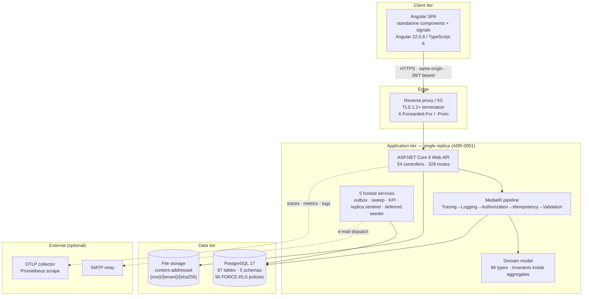

# NT.QMS — Production Software Requirements Specification
## Document 01 · Software Requirements Specification (as-built)

> Conventions, identifier schemes and the glossary are in
> [Document 00](00-SRS-Index-and-Conventions.md). Read it first.

---

# 1. Introduction

## 1.1 Purpose

NT.QMS is a multi-tenant, browser-delivered Quality Management System for testing, calibration and
medical laboratories. It replaces paper and spreadsheet quality systems with a single controlled,
audit-trailed, electronically-signed record set that satisfies the record-integrity obligations of
21 CFR Part 11, EU GMP Annex 11, ISO/IEC 17025, ISO 15189 and ISO 9001.

This document specifies the system **as it is built**. It is the engineering baseline for
maintenance, re-implementation, validation and audit.

## 1.2 Product scope

The system covers the complete quality loop — **detect → record → investigate → act → verify →
close → retain** — across 34 functional modules (Document 02), and adds an analytical-quality
subsystem (13 statistical study types plus Westgard QC and measurement-uncertainty budgeting) that
most general QMS products do not contain.

### In scope (built and shipping)

| Area | Modules |
|---|---|
| Improvement | Nonconformance/CAPA, complaints, customer feedback, quality objectives, quality policy |
| Governance | Change control, management review, risk register, conflicts of interest, organisational context, user-access review |
| Documents & records | Controlled documents with versioning/acknowledgement/controlled copies, archive & retention with legal hold |
| Assurance | Internal & external-hosted audits with checklists and findings |
| Resources | Equipment & calibration, reference standards, environmental monitoring, suppliers |
| People | Competency records, training assignments, per-test authorisations, user administration |
| Analytical quality | Westgard QC, method validation, method comparison, precision, linearity, detection limit, reference interval, carryover, interference, lot comparison, instrument comparability, outlier screening, sigma metrics, measurement uncertainty |
| Proficiency testing | PT plans and PT/ILC enrolments with z-scoring |
| Operations | Tasks & SLA escalation, notifications (in-app + e-mail), reporting & KPI snapshots |
| Compliance | Audit-trail ledger, field-change ledger, security-event log, electronic signatures, hash-chain verification, audit-trail review, XLSX/PDF exports |
| Administration | Branches, departments, test catalogue, lists of values, roles & privilege matrix, tenant settings |
| Platform | Tenant provisioning and listing (control plane) |

### Explicitly out of scope (not built)

These are named because the previous SRS or common expectation implies them; **none exist in the
code**:

- LIMS / sample-management / result-reporting (NT.QMS references a *test catalogue*, not samples).
- Instrument or LIS interfacing of any kind (no drivers, no HL7/ASTM, no "LIS loopback fetch").
- PDF rendering or watermarking of controlled documents (files are stored and served byte-for-byte).
- Real-time push (no SignalR/WebSocket); the SPA polls or refetches on navigation.
- Payment, billing or subscription management.
- Native mobile applications.
- Offline operation.

## 1.3 Definitions

See [Document 00 §0.6](00-SRS-Index-and-Conventions.md#06-glossary).

## 1.4 References

| Ref | Document |
|---|---|
| R1 | `docs/adr/ADR-0001 … ADR-0009` — binding architecture decisions |
| R2 | `docs/reference/NT_QAMS_Domain_Model.md`, `NT_QAMS_Database_Architecture.md`, `NT_QAMS_Application_Architecture.md` — design-time architecture ("law") |
| R3 | `docs/reference/NT_QMS_Database_AsBuilt.md`, `NT_QMS_Load_Test_Report.md` |
| R4 | `docs/validation/` — GAMP 5 CSV set (VMP, URS, FRA, IQ/OQ/PQ, RTM, VSR, execution records) |
| R5 | `deploy/DEPLOY.md`, `BACKUP-RESTORE-DR.md`, `OBSERVABILITY.md`, `harden-runtime-role.sql` |
| R6 | `CLAUDE.md` — standing engineering rules |
| R7 | `NT_QMS_SRS.html` — the superseded v1.0 SRS |

---

# 2. Overall description

## 2.1 Product perspective

NT.QMS is a **single-deployment, multi-tenant SaaS**: one application instance and one PostgreSQL
database serve many laboratories, with tenant isolation enforced in two independent layers.

### Deployment topology constraint

**ADR-0001 fixes the system at a single application replica.** A `SingleReplicaGuardService` takes a
PostgreSQL advisory lock at start-up; a second instance that fails to acquire it logs a warning and
retries every 60 s. Scale-out is a design change, not a configuration change — see
[Document 11 §11.6](11-Architecture-Constraints.md).

## 2.2 Product functions (summary)

| # | Function | Detail |
|---|---|---|
| F1 | Authenticate a laboratory user against their tenant and issue a short-lived access token plus a rotating refresh session | Doc 02 `AUTH` |
| F2 | Enforce role- and privilege-based authorisation on every command, deny-by-default | Doc 09 §9.4 |
| F3 | Isolate every tenant's data at both ORM and database level | Doc 09 §9.5 |
| F4 | Capture, route and close quality events through guarded state machines | Doc 06 |
| F5 | Record an immutable, hash-chained audit trail of every change with actor, time and reason | Doc 02 `CLD` |
| F6 | Apply 21 CFR Part 11 electronic signatures at controlled gates | Doc 09 §9.6 |
| F7 | Compute analytical-quality statistics and grade them against acceptance criteria | Doc 03 §3.6 |
| F8 | Age records over time and raise the resulting quality events automatically | Doc 06 §6.14 |
| F9 | Notify responsible people in-app and by e-mail, per configurable rules | Doc 02 `NTF` |
| F10 | Export regulated record sets for inspection | Doc 08 §8.9 |
| F11 | Retain, hold and dispose records under a retention policy | Doc 02 `ARC` |
| F12 | Provision and administer tenants from a control plane | Doc 02 `PLT` |

## 2.3 Actors

### 2.3.1 Human actors (system roles)

`UserRole` — `src/NT.QAMS.Domain/IdentityAccess/UserAccount.cs`. Exactly six values; the JWT `role`
claim carries the name verbatim.

| Role | Tenant member? | Purpose | Characteristic reach |
|---|---|---|---|
| **PlatformAdmin** (0) | **No** | Operates the control plane | Tenant provisioning/listing only. Redirected away from tenant modules by `platformOnlyGuard`. Holds no tenant privileges; `ActiveSessionMiddleware` sets a distinct platform-admin privilege state. |
| **TenantAdmin** (1) | Yes | Laboratory system administrator | Everything inside their tenant, including users, roles, tenant settings, MFA policy |
| **QualityManager** (2) | Yes | Owns the quality system | Approves, verifies, closes, signs; reads compliance ledgers; runs audit-trail and access reviews |
| **DepartmentHead** (3) | Yes | Owns a department's work | Granted approver-level permission keys by convention (archiving, competency sign-off, documents, controlled copies). **Note:** the `Roles.QmDeptAdmin` constant is now dead code — reach is decided by the tenant's privilege configuration, not by a role list on the endpoint (see Doc 09 §9.4) |
| **Analyst** (4) | Yes | Performs laboratory work | Raises records, enters data, completes assigned actions; cannot approve or sign at controlled gates |
| **ExternalAuditor** (5) | Yes (guest) | Inspects | **Read-only by construction** — the default command policy `[RequireInternalActor]` (193 of 215 commands) excludes this role outright; a write command reachable by it fails the `CommandPolicyTests` CI gate |

Beyond these six built-in roles, a tenant may define **custom roles** (`qams.role`) whose privilege
set is any subset of the 171 permission keys. A user carries both a built-in `Role` (in the token)
and an optional assigned custom `RoleId` (resolved per request).

### 2.3.2 Organisational scope

Any user may additionally be scoped to a set of branches and departments
(`user_branch_access`, `user_department_access`). `OrgScopeGuardInterceptor` and the `IAllocatable`
interface restrict scoped users to records allocated to their branches/departments. An empty scope
means unrestricted within the tenant.

### 2.3.3 System actors

| Actor | Nature | Documented in |
|---|---|---|
| **Outbox processor** | Hosted service; publishes domain events at-least-once | Doc 06 §6.15 |
| **Compliance sweep** | Hourly hosted service; time-based record ageing across 8 aggregates | Doc 06 §6.14 |
| **KPI snapshot service** | 6-hourly hosted service; materialises KPI rows | Doc 02 `RPT` |
| **Single-replica sentinel** | Advisory-lock holder; warns on a second instance | Doc 10 §10.4 |
| **Deferred startup seeder** | Retries platform-admin bootstrap + LOV backfill every 15 s when the database was unreachable at boot | Doc 10 §10.3 |
| **Reverse proxy** | Terminates TLS, forwards client address and scheme | Doc 10 §10.5 |
| **SMTP relay** | Optional; absent ⇒ e-mail is logged not sent | Doc 04 CFG-21 |
| **OTLP collector / Prometheus** | Optional telemetry sink | Doc 10 §10.7 |

## 2.4 Operating environment

| Layer | Technology | Version (as built) | Notes |
|---|---|---|---|
| Runtime | .NET | 9.0 | `net9.0` target across all projects |
| Web framework | ASP.NET Core | 9 | Minimal hosting model, `Program.cs` composition root |
| Mediator | MediatR | **pinned 12.4.\*** | v13 changes the licence and the pipeline `next()` signature — a hard pin, see Doc 11 AC-13 |
| Validation | FluentValidation | — | 88 validators |
| ORM | EF Core + Npgsql | 9 | snake_case naming convention |
| Database | PostgreSQL | 17 | 97 tables, 5 schemas |
| SPA | Angular | **22.0.8** | standalone components, signals; **repository documentation still says 18 — drift, see GAP** |
| Language (SPA) | TypeScript | 6.0.3 | strict mode, `any` forbidden |
| SPA runtime deps | zone.js 0.15.1 | | |
| Node (build/CI) | Node 24 | | Angular 22 requires ≥ 20.19; CI must use Node 24 (npm 10 misreads the npm-11 lockfile) |
| Telemetry | OpenTelemetry | — | traces + metrics + logs; Prometheus exporter |
| Test | xUnit, Karma/Jasmine, Playwright | — | 436 backend · 74 frontend unit · 6 e2e (last recorded) |
| Host OS (verified) | Windows 10/Server + IIS | — | `deploy/iis`, `web.config`, `publish-win-x64` |
| Host OS (authored, unverified) | Linux container | — | `Dockerfile`, `compose.production.yml` — **`[Not Executed]`** on this machine (no Docker) |

## 2.5 Design and implementation constraints

| ID | Constraint | Source |
|---|---|---|
| CON-A | Clean Architecture layering is enforced by a test suite (`NT.QAMS.Architecture.Tests`) — Domain references nothing; Application references Domain + SharedKernel; Infrastructure/WebApi may reference inward only | `tests/NT.QAMS.Architecture.Tests` |
| CON-B | Every command must declare an authorisation policy attribute; an unannotated command fails CI | `CommandPolicyTests` |
| CON-C | The public API surface is snapshot-gated: any route change must update `ApiSurface.approved.txt` in the same commit | `tests/NT.QAMS.WebApi.FunctionalTests/ApiSurface.approved.txt` |
| CON-D | Every `ITenantScoped` table must carry both an EF global query filter and a PostgreSQL FORCE-RLS policy, added in its own migration | `CLAUDE.md` §5, Doc 09 §9.5 |
| CON-E | Tenant-scoped tables use a **tenant-first composite primary key** `(tenant_id, id)` and **must not** declare `UNIQUE(id)` — the schema is partition-ready | Schema hardening Phase 5 |
| CON-F | Primary keys are UUIDv7, `ValueGeneratedNever`; enums persist as strings; money is `decimal`; time is `DateTimeOffset` from the injected `IClock` (never `DateTime.Now`) | `CLAUDE.md` §5 |
| CON-G | Single application replica (ADR-0001) | ADR-0001 |
| CON-H | TLS terminates at the proxy; the app emits HSTS but does not itself serve TLS (ADR-0002) | ADR-0002 |
| CON-I | Same-origin deployment — **CORS is deliberately not configured** (ADR-0007) | ADR-0007 |
| CON-J | Persistence port is `IAppDbContext` exposing `DbSet`s — no repository abstraction (ADR-0008) | ADR-0008 |
| CON-K | Access tokens live only in SPA memory; refresh is an httpOnly cookie (ADR-0009) | ADR-0009 |
| CON-L | Optimistic concurrency uses PostgreSQL `xmin`; there is no `row_version` column (ADR-0005) | ADR-0005 |
| CON-M | No magic strings/numbers, no dead code, no TODOs, no mocks in production paths; XML doc comments on public domain/application types | `CLAUDE.md` §2 |

## 2.6 Assumptions and dependencies

| ID | Statement | Type |
|---|---|---|
| A-01 | A reverse proxy terminates TLS and sets `X-Forwarded-For`/`X-Forwarded-Proto`. Without it, rate limiting partitions on the proxy's address and every client shares one budget. | Dependency |
| A-02 | The SPA and API are served from the **same origin**. Cross-origin deployment will fail: no CORS policy is registered, and the refresh cookie is `SameSite=Strict`. | Dependency (ADR-0007) |
| A-03 | PostgreSQL is reachable. On loss, `/health/ready` returns 503, `/health/live` stays 200, and start-up seeding defers rather than crashing. | Dependency |
| A-04 | The runtime database role is **not** superuser, **not** `BYPASSRLS`, and **not** the table owner. Production refuses to boot otherwise (`DatabaseRoleGuard`). Development logs a warning and continues — **the dev database is owned by `qams_app`, so dev deliberately runs with RLS weakened relative to production.** | Dependency |
| A-05 | System clock is accurate and UTC-based; all timestamps are `DateTimeOffset` UTC from `IClock`. | Assumption |
| A-06 | Laboratory users operate an evergreen desktop browser. No browser matrix is declared anywhere in the repository. **`[Needs Business Confirmation]`** | Assumption |
| A-07 | `FileStorage:RootPath` is a durable, backed-up volume. The default (`{AppBaseDirectory}/data/files`) is **inside the deployment folder** and would be lost on a clean redeploy. | Assumption / risk |
| A-08 | E-mail is optional. With `Smtp:Host` unset the system binds `LoggingEmailSender` and notifications are written to the log only — **silently, with no operator warning**. | Dependency |
| A-09 | Tenant slugs are stable and never reused; a slug is a public identifier appearing in URLs (`/t/{slug}`). | Assumption |
| A-10 | The laboratory owns its retention schedule; the system offers only three retention classes (5 years, 10 years, permanent). **`[Needs Business Confirmation]`** whether these satisfy every jurisdiction the product is sold into. | Assumption |
| A-11 | Validation status: the GAMP 5 documentation set is complete and 18 OQ cases have been executed and recorded, but **formal signed IQ/OQ/PQ execution by the customer's QA is pending**. No claim of a validated state is made by the software. | Dependency |

---

# 3. External interface requirements

## 3.1 User interfaces

Full specification in [Document 05](05-Screen-Specification.md). Summary:

- Single-page application, 46 routes, 100 components, all standalone with signal-based state.
- Three interface languages: **English, Arabic (RTL), French (LTR)**; direction switches with the
  language. Language resolves in the order **user preference → role default → tenant default**.
- Shell provides grouped navigation matching the eight permission groups, a workspace pill, language
  selector, notifications, and the user menu.
- Shared UI primitives: page header, drawer, workflow stepper, status pill, list stats/meters,
  load-more pager, audit-trail viewer, LOV select, user select, allocation picker, CSV import,
  change-reason dialog, text-prompt dialog, contextual help.

## 3.2 Hardware interfaces

None. The system interfaces with no laboratory instrument, no card reader, no biometric device and
no printer driver.

## 3.3 Software interfaces

| Interface | Direction | Protocol | Failure behaviour |
|---|---|---|---|
| PostgreSQL 17 | Out | Npgsql / TCP | 5 retries with backoff, 30 s command timeout; readiness fails |
| SMTP relay | Out | SMTP | Dispatch marked `Failed` with the error text on the dispatch row; **no retry of the e-mail itself** |
| OTLP collector | Out | gRPC/HTTP | Best-effort; absence is not an error |
| Prometheus | In | HTTP scrape of `/metrics` | Anonymous, rate-limit exempt |
| Local file system | Bi | File I/O | Missing object raises `FileNotFoundException` → 500 |

## 3.4 Communications interfaces

- HTTPS at the proxy; HTTP inside the trust boundary.
- JSON (`application/json`) request/response; `multipart/form-data` for uploads; `problem+json` for
  every error; XLSX and PDF binary for exports.
- Custom headers: `X-Change-Reason` (required on DELETE), `Idempotency-Key` (optional replay
  protection), `X-Correlation-Id` (echoed; generated when absent), `Retry-After` (on 429).

---

# 4. Non-functional requirements

## 4.1 Performance

| ID | Requirement | Evidence / measured value |
|---|---|---|
| **NFR-PERF-01** | Authenticated read endpoints shall complete within **p95 < 500 ms** under a 50-concurrent-user read mix. | **PASS.** Measured 2026-07-28 on a single box also hosting the database and load generator: `GET /api/nonconformances` p95 104.7 ms (750.6 rps), `/api/documents` 101.4 ms, `/api/audits` 85.9 ms, `/api/risks` 85.8 ms; **0.00 % errors** across 91,404 requests. `docs/reference/NT_QMS_Load_Test_Report.md` |
| **NFR-PERF-02** | Error rate under that load shall stay below 0.1 %. | **PASS** — 0.00 %. |
| **NFR-PERF-03** | Readiness, login and list latency on a dev box: p95 20.6 ms / 69.6 ms / 6.3 ms respectively. | `scripts/perf-smoke.ps1` |
| **NFR-PERF-04** | List endpoints shall not materialise unbounded result sets: every paged list uses the API-004 envelope with a server-side page size, and read queries use `AsNoTracking`. | 13 paged lists; shared `qams-load-more` footer |
| **NFR-PERF-05** | The global rate limit (`RateLimit:GlobalPermitPerMinute`, default **300/min per client address**) is an **abuse ceiling, not a concurrency ceiling**. It must be sized to legitimate peak concurrency per site, especially where a laboratory shares one NAT address. | Load-test finding 1 |
| | **Not specified / not measured:** write-path throughput (the `--with-writes` mix exists but was never run), 24-hour soak behaviour, multi-node contention, real-network latency. **`[Not Executed]`** | Load report "Limitations" |

> **Gap vs previous SRS:** the old SRS asserted "95 % of API requests < 200 ms" and "Dapper report
> queries < 500 ms" and "Redis cache hit ratio ≥ 85 %". There is **no Dapper and no Redis** in this
> system. See [GAP-32/33](13-Implementation-vs-SRS-Gap-Analysis.md).

## 4.2 Reliability

| ID | Requirement | Implementation |
|---|---|---|
| **NFR-REL-01** | Transient database faults shall be retried transparently. | `EnableRetryOnFailure(maxRetryCount: 5, maxRetryDelay: 10 s)` |
| **NFR-REL-02** | No statement shall hang a request thread indefinitely. | `CommandTimeout(30)` seconds |
| **NFR-REL-03** | Domain-event publication shall be at-least-once and survive process restart. | Transactional outbox; rows written in the same transaction as the aggregate change |
| **NFR-REL-04** | Failed event delivery shall back off and eventually dead-letter rather than spin. | 5 attempts; exponential backoff from a 5 s base; `SKIP LOCKED` claim with a 2-minute lease; batch of 50; 2 s poll |
| **NFR-REL-05** | Dead-lettered events shall be visible and replayable. | `qams.outbox_event.dead_lettered_at_utc`; ERROR log; `qams.outbox.dead_lettered` counter; replay by clearing the dead-letter stamp and attempt count |
| **NFR-REL-06** | Concurrent edits shall not silently overwrite. | `xmin` optimistic concurrency → HTTP 409 `CONCURRENCY-409` (ADR-0005) |
| **NFR-REL-07** | Duplicate submission of the same command shall not duplicate its effect. | `Idempotency-Key` header + `IdempotencyBehavior` + persisted replay store |
| **NFR-REL-08** | A database outage at cold start shall not crash-loop the process. | `StartupSeeding.TryRunAsync` defers on connectivity failure; `DeferredStartupSeeder` retries every 15 s; only connectivity defers — real faults still propagate (OPS-010) |
| **NFR-REL-09** | Exactly one instance shall run scheduled work. | Advisory-lock leader election on the sweep; single-replica sentinel |

## 4.3 Availability

| ID | Requirement | Implementation |
|---|---|---|
| **NFR-AVL-01** | Liveness shall be independent of the database. `/health/live` performs **no checks** — a database outage must recycle traffic, not the process. | `Program.cs:280` |
| **NFR-AVL-02** | Readiness shall be database-backed. `/health/ready` returns 503 while PostgreSQL is unreachable. | `PostgresReadinessHealthCheck` |
| **NFR-AVL-03** | `/health` remains as a legacy liveness alias. | `Program.cs:286` |
| **NFR-AVL-04** | Probes and the metrics scrape are exempt from rate limiting. | `.DisableRateLimiting()` on all four endpoints |
| **NFR-AVL-05** | No availability target (SLA %) is defined anywhere in the repository. **`[Needs Business Confirmation]`** | — |

## 4.4 Recoverability

| ID | Requirement | Implementation |
|---|---|---|
| **NFR-RCV-01** | RPO ≤ 5 minutes, RTO ≤ 4 hours. | `deploy/BACKUP-RESTORE-DR.md` |
| **NFR-RCV-02** | Continuous WAL archiving with point-in-time recovery plus a nightly logical dump. | `deploy/backup.sh` |
| **NFR-RCV-03** | Every restore shall be followed by mandatory verification **including audit-trail hash-chain verification**. | `deploy/restore.sh`, `GET /api/compliance/chain-verification` |
| **NFR-RCV-04** | File storage must be backed up separately — it is **not** in the database dump. | Doc 07 FS-04 |
| **NFR-RCV-05** | A restore drill has **not** been executed in this environment. **`[Not Executed]`** | — |

## 4.5 Maintainability

| ID | Requirement | Implementation |
|---|---|---|
| **NFR-MNT-01** | Layer boundaries are machine-enforced, not conventional. | `NT.QAMS.Architecture.Tests` (24 tests) |
| **NFR-MNT-02** | Authorisation coverage is machine-enforced: every command carries a policy. | `CommandPolicyTests` |
| **NFR-MNT-03** | The public API surface cannot drift silently. | `ApiSurface.approved.txt` snapshot gate (652 lines) |
| **NFR-MNT-04** | Module boundaries cannot be crossed silently. | module-boundary merge gate |
| **NFR-MNT-05** | Migrations must round-trip (`Up`/`Down`) and the audit trail must resist tampering. | migration round-trip + audit-tamper tests |
| **NFR-MNT-06** | Test baseline: **436 backend tests, 0 skipped**; 74 frontend unit specs; 6 Playwright e2e. | Last recorded green run |
| **NFR-MNT-07** | Feature code is organised as vertical slices, one file per feature area, so a change touches one place. | `src/NT.QAMS.Application/**/*Slice.cs` |
| **NFR-MNT-08** | Error codes are structured and centralised; role names are constants; QC limits are configuration. | `Roles.cs`, `WestgardLimits`, 411 structured codes |

## 4.6 Scalability

| ID | Statement |
|---|---|
| **NFR-SCL-01** | **Vertical only.** The application is fixed at one replica (ADR-0001). |
| **NFR-SCL-02** | The database schema is **partition-ready**: 88 tenant-scoped tables carry a tenant-first composite primary key and no `UNIQUE(id)`, which is the precondition for PostgreSQL declarative partitioning by tenant. Partitioning is **not** applied. |
| **NFR-SCL-03** | Read scaling via replicas is not implemented; there is no read/write split. |
| **NFR-SCL-04** | Tenant count is unbounded by design but untested beyond the development dataset. **`[Not Executed]`** |
| **NFR-SCL-05** | Rate-limit partitioning is by **client IP address** for the global/auth/refresh policies and by **actor (`sub` claim)** for the e-signature policy — a shared NAT address therefore shares one global budget (see NFR-PERF-05). |

## 4.7 Observability, logging and monitoring

| ID | Requirement | Implementation |
|---|---|---|
| **NFR-OBS-01** | Production logs shall be structured JSON with scopes, UTC timestamps, ISO-8601 (`"O"`) format. | `Program.cs:38-47` — **only when `ASPNETCORE_ENVIRONMENT=Production`** |
| **NFR-OBS-02** | Every response shall carry a correlation identifier; every `ProblemDetails` shall carry `traceId` and `correlationId`. | `ObservabilityMiddleware`, `CustomizeProblemDetails` |
| **NFR-OBS-03** | One trace shall span HTTP → MediatR → EF/Npgsql → outbox/jobs. `traceparent` is persisted on outbox rows so asynchronous delivery joins the originating trace. | OTel sources: `ApplicationDiagnostics`, `QamsDiagnostics.Outbox`, `QamsDiagnostics.Jobs` |
| **NFR-OBS-04** | Health and metrics traffic shall be excluded from traces. | `options.Filter` on ASP.NET instrumentation |
| **NFR-OBS-05** | Metrics shall be exposed at `GET /metrics` in Prometheus format, and over OTLP when configured. | `AddPrometheusExporter()` |
| **NFR-OBS-06** | The following domain instruments shall exist under meter `NT.QAMS`: `qams.outbox.processed`, `.failed`, `.dead_lettered`, `qams.outbox.backlog`, `qams.outbox.oldest_pending_age_seconds`, `qams.outbox.dead_letters`, `qams.job.last_success_timestamp_seconds{job}`. | `QamsMetrics.cs` |
| **NFR-OBS-07** | Seven actionable alerts are **specified** (error rate > 5 %/5 m; p95 > 2 s/10 m; dead-letters > 0; backlog age > 600 s; sweep liveness > 7200 s; snapshot liveness > 43200 s; readiness non-200). | `deploy/OBSERVABILITY.md` |
| | **The alert set has never been deployed or observed firing** — the observability stack in `deploy/observability/` was authored but never brought up (no Docker on the build host). **`[Not Executed]`** — residual risk R-7. | |

## 4.8 Security

Full specification in [Document 09](09-Security-Specification.md). NFR summary:

| ID | Requirement |
|---|---|
| **NFR-SEC-01** | Tenant isolation shall be enforced in two independent layers: EF global query filter **and** PostgreSQL FORCE row-level security keyed on the `app.current_tenant` GUC, set on every connection open, fail-closed to nil. |
| **NFR-SEC-02** | Records in a signed terminal state shall be physically immutable: a `BEFORE UPDATE/DELETE` trigger rejects mutation on 12 analytical study roots and approved uncertainty budgets. |
| **NFR-SEC-03** | The audit trail shall be append-only and hash-chained, and shall accept null-tenant appends (pre-authentication events). |
| **NFR-SEC-04** | Every `DELETE` shall be refused without a reason (`400 CHANGE-REASON-REQUIRED`), and the reason shall be persisted on the ledger row in the same transaction. |
| **NFR-SEC-05** | Passwords: ≥ 12 characters, upper + lower + digit + symbol, checked against an offline breached/common-password blocklist, maximum 200 characters; history depth 5; maximum age 90 days (both configurable). |
| **NFR-SEC-06** | Accounts shall lock for **30 minutes after 5 consecutive failed attempts**; the same counter throttles failed e-signature attempts. |
| **NFR-SEC-07** | MFA shall be TOTP (RFC 6238), **optional per tenant**, default **off**, with a platform-wide fallback switch. |
| **NFR-SEC-08** | Access tokens shall live only in SPA memory; refresh shall use a rotating httpOnly `Secure SameSite=Strict` cookie scoped to `/api/auth`, stored SHA-256-only, with reuse detection revoking the whole family. |
| **NFR-SEC-09** | Every authenticated request shall re-check the account's active state and role against the database (401 `AUTH-006`/`AUTH-007`). |
| **NFR-SEC-10** | Uploads shall pass an extension allow-list **and** content sniffing; the client's declared content type shall never be trusted or stored. |
| **NFR-SEC-11** | Response headers shall include a deny-everything CSP, `X-Content-Type-Options: nosniff`, `X-Frame-Options: DENY`, `Referrer-Policy: no-referrer`, and (outside Development) HSTS `max-age=63072000; includeSubDomains`. |
| **NFR-SEC-12** | Rate limits: 300/min global per client, 10/min on `/api/auth/*`, 60/min on refresh, 10/min per actor on e-signature ceremonies; rejection is 429 with `Retry-After: 60`. |
| **NFR-SEC-13** | Production shall refuse to start if the database role is over-privileged. |
| **NFR-SEC-14** | Dependency scanning (.NET SCA, npm SCA, Trivy image scan) shall gate every merge, failing on High/Critical. |
| **NFR-SEC-15** | **An independent penetration test on a staging environment has not been performed.** A dev-instance self-assessment (24 probes, 0 findings) exists but is explicitly not a substitute. **`[Not Executed]`** |

## 4.9 Localisation

| ID | Requirement |
|---|---|
| **NFR-LOC-01** | Three languages: `en`, `ar`, `fr`. Arabic renders right-to-left; direction switches with language. |
| **NFR-LOC-02** | Language resolution order: user preference (`user_account.preferred_language`) → role default (`role.default_language`) → tenant default. Settable via `PUT /api/auth/me/language`, `PUT /api/users/{id}/language`, and role configuration. |
| **NFR-LOC-03** | Reference data (`LovEntry`) carries a `LocalizedText` value object so list values are translatable per tenant. |
| **NFR-LOC-04** | Translation is delivered by an in-app `I18nService` with typed dictionaries — **not** ngx-translate, and not JSON asset files. |

## 4.10 Accessibility

| ID | Requirement |
|---|---|
| **NFR-A11Y-01** | Automated `axe` accessibility checks run in CI on every build (always-on, not opt-in). |
| **NFR-A11Y-02** | Real violations found by that gate were fixed: a missing form label and a serious contrast failure on the login screen. |
| **NFR-A11Y-03** | `window.prompt`-based dialogs were replaced with accessible in-app dialogs for the change-reason and password-reset flows. |
| **NFR-A11Y-04** | Statistic tiles do not encode meaning in colour alone: the seven tone tokens failed contrast as a categorical palette (gold 1.80:1, teal 2.58:1, red↔orange ΔE 8.9 for normal vision), so tone is carried by meter fills and rails while values use AA-contrast ink steps. |
| **NFR-A11Y-05** | No formal WCAG conformance level is claimed. **`[Needs Business Confirmation]`** |

## 4.11 Resource usage

| ID | Statement |
|---|---|
| **NFR-RES-01** | No memory, CPU or disk budget is declared anywhere in the repository. **`[Needs Business Confirmation]`** |
| **NFR-RES-02** | Disk growth is driven by: uploaded evidence files (content-addressed, deduplicated by SHA-256), the append-only ledgers (`audit.field_change` already holds 19,296 null-tenant rows in the dev dataset), and outbox rows (purged after `Outbox:RetentionDays`, default 30). |
| **NFR-RES-03** | Connection-pool usage is observable via the Npgsql meter; no pool size is configured, so Npgsql defaults apply. |
| **NFR-RES-04** | The container image runs as a **non-root** user; CI asserts the non-root uid and volume writability. |

## 4.12 Compliance and data integrity (ALCOA+)

| Attribute | How the system delivers it |
|---|---|
| **Attributable** | Every mutation carries `CreatedByUserId`/actor from the JWT `sub` claim, stamped by `AuditStampInterceptor`; never client-supplied. |
| **Legible** | Ledger rows are structured per-field before/after values, readable through the compliance UI and XLSX export. |
| **Contemporaneous** | Timestamps come from the injected `IClock` at the moment of the transaction; `DateTime.Now` is banned. |
| **Original** | The field-change ledger retains the original value alongside the new one; signed records are physically immutable. |
| **Accurate** | Domain invariants reject impossible states at the aggregate boundary, before persistence. |
| **Complete** | Every DELETE is a logical void with a mandatory reason; nothing is silently removed. |
| **Consistent** | Hash chaining links ledger rows; `chain-verification` proves the sequence. |
| **Enduring** | Append-only tables; retention classes; legal hold blocks disposal regardless of retention. |
| **Available** | Exports (`audit-trail.xlsx` with an integrity-attestation sheet, `signatures.xlsx`, `nonconformances.xlsx`, `review-pack.pdf`); export events are themselves logged as `RECORD_EXPORTED`. |

---

# 5. System-level acceptance criteria

These are the top-level acceptance tests for the system as a whole. Per-requirement criteria are in
Documents 02 and 12.

| ID | Given | When | Then |
|---|---|---|---|
| **AT-SYS-01** | Two active tenants A and B, and a user of A | The user issues any tenant-scoped query | Only rows with `tenant_id = A` return — proven with the database GUC set, **and** proven again by `psql` as the owning role (FORCE RLS binds the owner) |
| **AT-SYS-02** | A signed-off analytical study | A raw `UPDATE` or `DELETE` is issued directly in SQL | PostgreSQL rejects it via `qams.reject_frozen_mutation()` |
| **AT-SYS-03** | Any record | A `DELETE` is issued without `X-Change-Reason` | 400 `CHANGE-REASON-REQUIRED`; with the header, 204 and the ledger row carries the reason |
| **AT-SYS-04** | A user who prepared a record | That same user attempts the approval/sign gate | 422 with the module's `SOD-*` code |
| **AT-SYS-05** | An authenticated user | An administrator deactivates the account | The **next** request with the same still-valid token returns 401 `AUTH-006` |
| **AT-SYS-06** | A valid refresh cookie | It is presented twice (replay) | The whole refresh family is revoked; the session is dead |
| **AT-SYS-07** | An `ExternalAuditor` token | Any write command is attempted | 403 problem+json; the CI `CommandPolicyTests` gate also fails if such a path is ever introduced |
| **AT-SYS-08** | PostgreSQL stopped | Probes are polled | `/health/live` 200, `/health/ready` 503; on restore, readiness returns to 200 and deferred seeding completes **without a process restart** |
| **AT-SYS-09** | A production environment whose DB role is superuser/owner/BYPASSRLS | The application starts | It refuses to boot |
| **AT-SYS-10** | Any 6 roles × the full endpoint set | Each role calls each endpoint | No role ever receives 401 or 5xx from a role gate; every denial is 403 problem+json (`RoleEndpointMatrixTests`) |
