# NT.QMS — Production Software Requirements Specification
## Document 02 · Part 1 — Functional Specification: Quality, Improvement & Documents

> Part 1 of 4. See also
> [Part 2 — Resources, People & Governance](02-2-Functional-Specification-Resources-People-Governance.md),
> [Part 3 — Analytical Quality & Proficiency Testing](02-3-Functional-Specification-Analytical-Quality.md),
> [Part 4 — Operations, Administration, Platform & Cross-Cutting](02-4-Functional-Specification-Operations-and-Platform.md).
> Conventions: [Document 00](00-SRS-Index-and-Conventions.md).

Each module is specified with the same 17-section template:
**Purpose · Business goal · Actors · Inputs · Outputs · Dependencies · Workflow · Business rules ·
Validation rules · Error cases · Edge cases · Configuration · Performance · Security · Limitations ·
Future improvements · Acceptance criteria.**

---

# M-01 · Nonconformance & CAPA (`NC`)

## Purpose
Records any departure from a requirement — internal deviation, out-of-specification result,
out-of-trend signal, audit finding, complaint outcome, supplier failure or PT failure — and drives it
through investigation, corrective/preventive action, verification and effectiveness confirmation to a
locked closure.

## Business goal
Satisfy ISO/IEC 17025 §7.10 (nonconforming work) and §8.7 (corrective action) and 21 CFR Part 11
§11.10(g): no quality failure is closed without a recorded root cause, completed actions, an
independent verification and a documented effectiveness judgement.

## Actors
| Actor | Capability |
|---|---|
| Analyst / any tenant user | Raise, submit, record RCA, plan CAPA actions, complete own actions, submit for verification |
| Quality Manager / Tenant Admin | Triage (assign), reject, verify, confirm effectiveness |
| External Auditor | Read only |
| **System** | Raises NCs automatically from 6 source policies (audit finding, complaint validation, PT failure, QC/equipment intermediate-check failure, environmental excursion, competency lapse) |

## Inputs
`title` (≤300, required), `description` (≤4000), `severity` 1–5, `likelihood` 1–5, `sourceType`
(`Internal | Complaint | Audit | Supplier | ProficiencyTest`), `eventType`
(`Nonconformity | Deviation | OutOfSpecification | OutOfTrend`, default `Nonconformity`),
optional `sourceRef`, optional branch/department allocation. Later inputs: assignee, rejection reason,
RCA method + analysis, CAPA action (type, details, owner, due date), verification pass/fail,
effectiveness true/false.

## Outputs
- Persisted `Nonconformance` aggregate with generated reference `NcRef`.
- Computed **RPN**.
- Domain events: `NcRaised`, `NcTriaged`, `NcRejected`, `CapaActionPlanned`, `CapaActionCompleted`,
  `NcVerified`, `NcClosed`.
- Notification dispatches per notification rules; SLA/escalation timers.
- Ledger rows for every field change.
- XLSX export `nonconformances.xlsx`.

## Dependencies
`ORG` (branch/department for allocation), `USER` (assignee, owner), `NTF`, `TASK`/SLA, `CLD` (ledger),
`ARC` (archival), and the six upstream source policies listed under Actors.

## Workflow
State machine `WF-01` — see [Document 06 §6.1](06-Workflow-Specification.md).

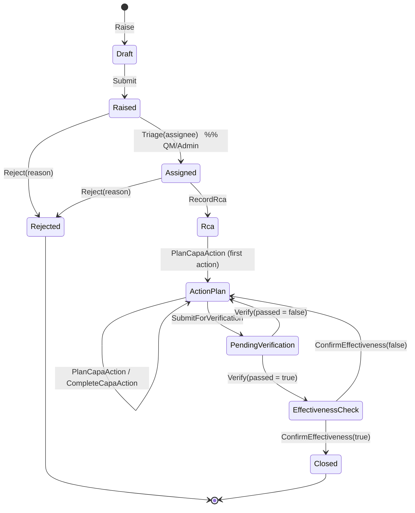

Two loop-backs exist: a failed verification and a failed effectiveness check both return the record to
`ActionPlan` so further actions can be planned. Neither is a dead end.

## Business rules
| ID | Rule | Code location |
|---|---|---|
| **BR-NC-01** | `Rpn = Severity × Likelihood`, computed at raise time and never client-supplied. | `Nonconformance.Raise` |
| **BR-NC-02** | Severity and likelihood must each be explicitly assessed on a 1–5 scale. | `NC-002` |
| **BR-NC-03** | A nonconformance may not be **verified** by the person who raised it. | `SOD-CAPA-002` in `Verify` |
| **BR-NC-04** | A nonconformance may not be **closed** by the person who raised it. | `SOD-CAPA-001` in `ConfirmEffectiveness` |
| **BR-NC-05** | At least one CAPA action must exist before verification can be requested. | `NC-019` |
| **BR-NC-06** | All CAPA actions must be `Completed` before verification can be requested. | `NC-020` |
| **BR-NC-07** | A CAPA action may be completed once; a second completion is refused. | `CAPA-002` |
| **BR-NC-08** | RCA may only be recorded from `Assigned`; CAPA actions only from `Rca`/`ActionPlan`. | `NC-014`, `NC-016` |
| **BR-NC-09** | Rejection requires a written reason and is terminal. | `NC-013` |
| **BR-NC-10** | The four quality-event types share **one** workflow; `eventType` is a classification, not a variant workflow. A deeper phased OOS (Phase I/II) investigation is **not** implemented. | `QualityEventType` |
| **BR-NC-11** | Automatic NC creation is driven by six domain policies; each stamps `sourceType` and `sourceRef` so the origin is traceable. | `FindingToNcPolicy`, `ComplaintToNcPolicy`, `PtToNcPolicy`, `IntermediateCheckToNcPolicy`, `ExcursionToNcPolicy`, `CompetencyLapseAuthorizationPolicy` |

## Validation rules
| ID | Field | Rule |
|---|---|---|
| VR-NC-01 | `Title` | required, ≤ 300 |
| VR-NC-02 | `Description` | ≤ 4000 |
| VR-NC-03 | `Severity` | integer, inclusive 1–5 |
| VR-NC-04 | `Likelihood` | integer, inclusive 1–5 |
| VR-NC-05 | `RejectNc.Reason` | required, ≤ 1000 |
| VR-NC-06 | `RecordRca.Analysis` | required, ≤ 8000 |
| VR-NC-07 | `PlanCapaAction.Details` | required, ≤ 2000 |
| VR-NC-08 | `PlanCapaAction.OwnerId` | required, non-empty GUID |

## Error cases
| Code | HTTP | Message |
|---|---|---|
| `NC-001` | 422 | Title is required. |
| `NC-002` | 422 | Severity and likelihood must each be 1-5 and explicitly assessed. |
| `NC-013` | 422 | A rejection reason is required. |
| `NC-014` | 409 | Cannot record RCA in state {Status}. |
| `NC-015` | 422 | RCA analysis text is required. |
| `NC-016` | 409 | Cannot plan CAPA actions in state {Status}. |
| `NC-017` | 422 | Action details are required. |
| `NC-019` | 422 | At least one CAPA action is required before verification. |
| `NC-020` | 422 | All CAPA actions must be completed before verification. |
| `NC-404` | 404 | Nonconformance not found. |
| `CAPA-001` | 404 | CAPA action not found on this nonconformance. |
| `CAPA-002` | 409 | Action is already completed. |
| `SOD-CAPA-001` | 422 | Segregation of duties: the raiser cannot close their own nonconformance. |
| `SOD-CAPA-002` | 422 | Segregation of duties: the raiser cannot verify their own nonconformance. |

## Edge cases
- **Legacy/system-raised records have no known preparer.** `EnsureSignerIsNotPreparer` is a **no-op**
  when `CreatedByUserId` is null, so SoD cannot be enforced on records created before that column
  existed or by a system policy with no human actor. This is a deliberate, documented residual
  (F-05b) — it means an SoD bypass is theoretically possible on such records.
- A failed verification loops to `ActionPlan`, so the same NC can cycle indefinitely; there is **no
  loop counter or escalation on repeated failure**.
- Deleting a CAPA action is not possible — only completion. There is no "cancel action".
- `sourceRef` is free text and is not validated against the referenced record's existence.

## Configuration
None module-specific. SLA target hours per module/severity come from `SlaDefinition`
(see [Part 4 · M-27](02-4-Functional-Specification-Operations-and-Platform.md)).

## Performance
`GET /api/nonconformances` is paged (`page`, `pageSize` default 50) and measured at **p95 104.7 ms /
750.6 rps** at 50 concurrent users. Filters: `status`, `search`, `eventType`.

## Security
- `Triage`, `Verify`, `ConfirmEffectiveness` require `nc.approve`; `Reject` requires `nc.void`.
- `Raise`, `Submit`, `RecordRca`, `PlanCapaAction`, `CompleteCapaAction`, `SubmitForVerification`
  carry command policies allowing ordinary tenant actors.
- Records are `IAllocatable`; a branch/department-scoped user sees only their allocation.
- Every field change lands in `audit.field_change` with actor, timestamp and (on delete) reason.

## Limitations
| ID | Limitation |
|---|---|
| LIM-NC-01 | No 5-Whys or Fishbone **structured** capture: `RcaMethod` is an enum (`FiveWhys`/`Fishbone`/`Other`) and `Analysis` is a single free-text field. The previous SRS promised interactive 5-Whys flows and Fishbone diagram inputs — **not built**. |
| LIM-NC-02 | No phased OOS investigation (Phase I lab-error check → Phase II full investigation). |
| LIM-NC-03 | No effectiveness-check **interval**: effectiveness is confirmed immediately by a human, not scheduled for a later date. |
| LIM-NC-04 | No file/evidence attachment directly on a CAPA action (files attach at document/equipment level only). |
| LIM-NC-05 | No bulk operations, no NC merge, no duplicate detection. |

## Future improvements
Structured RCA capture; effectiveness-check scheduling with a due date and reminder; repeat-failure
escalation; per-action evidence attachment; duplicate/near-duplicate detection at raise time.

## Acceptance criteria
- **AT-FR-NC-01** — Raising with severity 4 and likelihood 3 yields `Rpn = 12`.
- **AT-FR-NC-02** — The raiser calling `verify` receives 422 `SOD-CAPA-002`; a different QM succeeds.
- **AT-FR-NC-03** — `submit-verification` with one incomplete action returns 422 `NC-020`.
- **AT-FR-NC-04** — `verify(passed=false)` returns the record to `ActionPlan`, not to `Closed`.

---

# M-02 · Complaints (`CMP`)

## Purpose
Logs and resolves customer complaints from first contact to closure, with an explicit
justified/unjustified validation gate and automatic escalation to a nonconformance when justified.

## Business goal
ISO/IEC 17025 §7.9 — a documented complaints process, with the decision on validity recorded and
complaints resolved by people not involved in the activity complained about.

## Actors
Any tenant user (log); Quality Manager/Admin (validate, close); complaint handlers (acknowledge,
investigate, log outcome, resolve).

## Inputs
`channel` (`Phone | Email | Portal | InPerson | Letter`), `complainantName` (≤300),
`complainantContact` (≤300, optional), `confidential` flag, `subject` (≤300), `description` (≤4000).
Then: validation verdict (justified true/false) + reason (≤2000); investigation outcome (≤4000);
resolution (≤4000).

## Outputs
`Complaint` aggregate with `ComplaintRef`; events `ComplaintLogged`, `ComplaintAcknowledged`,
`ComplaintValidated`, `ComplaintResolved`, `ComplaintClosed`; an automatically raised NC when
validated as justified (`ComplaintToNcPolicy`); `LinkedNcId` back-reference.

## Dependencies
`NC` (auto-raise + closure interlock), `NTF`, `FBK` (feedback escalates into a complaint).

## Workflow
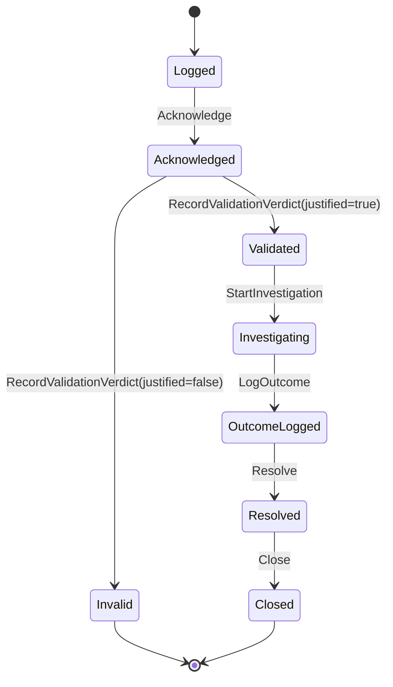

## Business rules
| ID | Rule | Code |
|---|---|---|
| **BR-CMP-01** | A complaint validated as **justified** automatically raises a linked nonconformance with `sourceType = Complaint`. | `ComplaintToNcPolicy` on `ComplaintValidated` |
| **BR-CMP-02** | A complaint **cannot be closed while its linked NC is still open**. | `CMP-020` |
| **BR-CMP-03** | Every validation verdict — justified or not — requires a written reason. | `CMP-003` |
| **BR-CMP-04** | `confidential` is captured at logging and is a permanent property of the record. **`[Needs Business Confirmation]`** — the flag is stored but no code path restricts visibility based on it. |
| **BR-CMP-05** | Acknowledgement stamps `AcknowledgedAtUtc`; the elapsed time from `LoggedAtUtc` is the acknowledgement responsiveness measure. No target is enforced in the aggregate. |

## Validation rules
`ComplainantName` required ≤300; `ComplainantContact` ≤300; `Subject` required ≤300; `Description`
required ≤4000; `Validate.Reason` required ≤2000; `LogOutcome.Outcome` required ≤4000;
`Resolve.Resolution` required ≤4000.

## Error cases
`CMP-001` complainant name required · `CMP-002` subject and description required · `CMP-003`
validation verdict reason required · `CMP-004` investigation outcome required · `CMP-005` resolution
required · `CMP-020` linked NC must be closed first · `CMP-404` not found.

## Edge cases
- A complaint validated as **not** justified goes straight to `Invalid` and never enters
  investigation — there is no appeal or re-open path.
- If the auto-raised NC is *rejected* (not closed), `CMP-020` still blocks closure until the NC
  reaches `Closed`. A rejected NC is terminal but is **not** `Closed`, so **the complaint can become
  permanently unclosable**. **`[Needs Business Confirmation]`** — this is a real interlock defect; see
  [TD](14-Technical-Debt-Report.md).
- `confidential` does not hide the complainant's name from any reader with `complaints.view`.

## Configuration
None.

## Performance
`GET /api/complaints` supports a `status` filter; **not paged** (returns the full filtered set).

## Security
`acknowledge`/`start-investigation`/`outcome`/`resolve` require `complaints.edit`; `validate`
requires `complaints.approve`; `close` requires `complaints.void`. Logging a complaint is open to any
tenant actor.

## Limitations
No customer-facing portal (the `Portal` channel value is a manual classification, not an integration);
no acknowledgement SLA enforcement; no anonymised handling for `confidential = true`; list is unpaged.

## Future improvements
Enforce an acknowledgement SLA timer; honour `confidential` by masking complainant identity; fix the
rejected-NC closure interlock; add paging.

## Acceptance criteria
- **AT-FR-CMP-01** — Validating justified creates an NC whose `sourceType = Complaint` and whose id is
  written back to `LinkedNcId`.
- **AT-FR-CMP-02** — Closing while the linked NC is open returns 422 `CMP-020`.

---

# M-03 · Customer feedback (`FBK`)

## Purpose
Captures non-complaint customer voice — compliments, suggestions and dissatisfaction — reviews it, and
escalates dissatisfaction into the formal complaints process when warranted.

## Business goal
ISO/IEC 17025 §8.6 / ISO 9001 §9.1.2 — obtain and use feedback from customers as an input to
improvement and management review.

## Actors
Any tenant user (log); quality staff (review, close); quality staff with `feedback.edit` (escalate).

## Inputs
`source` (≤100), `channel` (≤100), `type` (`Compliment | Suggestion | Dissatisfaction`),
`subject` (≤300), `details` (≤4000), optional `satisfactionScore` 1–5, `receivedOn`.

## Outputs
`FeedbackEntry` with `FeedbackRef`; on escalation a `Complaint` and a `ComplaintId` back-link;
contributes the "Avg. Satisfaction" statistic on the feedback register.

## Dependencies
`CMP` (escalation target), `RPT` (satisfaction statistic).

## Workflow
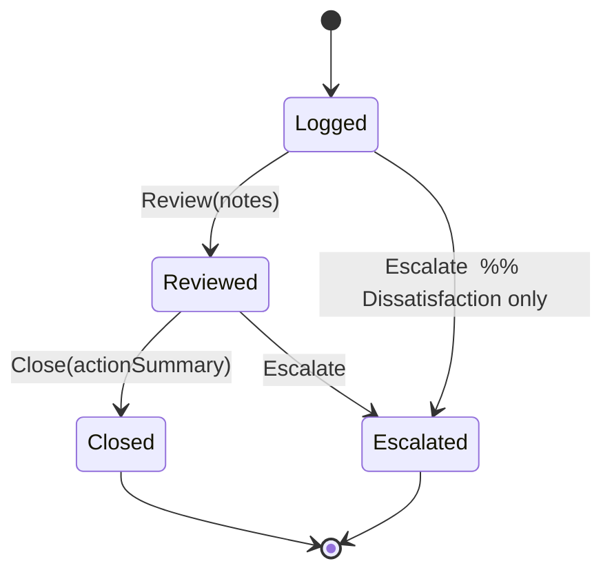

## Business rules
| ID | Rule | Code |
|---|---|---|
| **BR-FBK-01** | **Only `Dissatisfaction` feedback may be escalated** to a complaint. A compliment or suggestion cannot. | `FBK-014` |
| **BR-FBK-02** | Closed feedback cannot be escalated. | `FBK-015` |
| **BR-FBK-03** | Closure requires an action summary — "or the reason none was needed" — so a no-action decision is still evidenced. | `FBK-013` |
| **BR-FBK-04** | The satisfaction score is a 1–5 scale and is optional. | `FBK-003`, validator `.When(score is not null)` |
| **BR-FBK-05** | Review must precede closure. | `FBK-012` |

## Validation rules
`Source` required ≤100; `Channel` required ≤100; `Type` required; `Subject` required ≤300;
`Details` required ≤4000; `SatisfactionScore` 1–5 when supplied; `ReviewNotes` required ≤2000;
`ActionSummary` required ≤2000.

## Error cases
`FBK-001` · `FBK-002` · `FBK-003` · `FBK-010` only logged feedback can be reviewed · `FBK-011` review
notes required · `FBK-012` only reviewed feedback can be closed · `FBK-013` action summary required ·
`FBK-014` only dissatisfaction can be escalated · `FBK-015` state cannot escalate · `FBK-404`.

## Edge cases
- "Avg. Satisfaction" is a **mean, not a count**, and the shared statistic tile component is
  explicitly forbidden from drawing a proportion meter for it (no valid denominator).
- Escalation is one-way; there is no de-escalation.

## Configuration
None.

## Performance
`GET /api/feedback` filters by `status` and `type`; unpaged.

## Security
`review`, `escalate` → `feedback.edit`; `close` → `feedback.void`; logging open to tenant actors.

## Limitations
No survey capture, no automated satisfaction sampling, no trend analysis beyond the register average.

## Future improvements
Periodic satisfaction trending; link feedback themes to quality objectives.

## Acceptance criteria
- **AT-FR-FBK-01** — Escalating a `Compliment` returns 422 `FBK-014`.
- **AT-FR-FBK-02** — Closing without review returns 409 `FBK-012`.

---

# M-04 · Quality objectives (`OBJ`)

## Purpose
Defines measurable quality objectives with a target, direction and period, tracks periodic progress
measurements, and closes each objective against the evidence.

## Business goal
ISO 9001 §6.2 / ISO 17025 §8.6 — quality objectives must be measurable, monitored and evaluated.

## Actors
Quality Manager / Tenant Admin (define, close); objective owner and quality staff (record progress).

## Inputs
`title` (≤300), `description` (≤2000), `metric` (≤300), `unit` (≤30), `targetValue`,
`direction` (`AtLeast | AtMost`), `ownerId`, `periodStart`, `periodEnd`. Progress: `measuredOn`,
`value`, `comment` (≤1000).

## Outputs
`QualityObjective` with `ObjectiveRef`; a series of `ObjectiveProgressUpdate` child records; closure
status `Achieved | Missed | Cancelled` with a closure note.

## Dependencies
`USER` (owner), `MRV` (objectives are a management-review input), `RPT`.

## Workflow
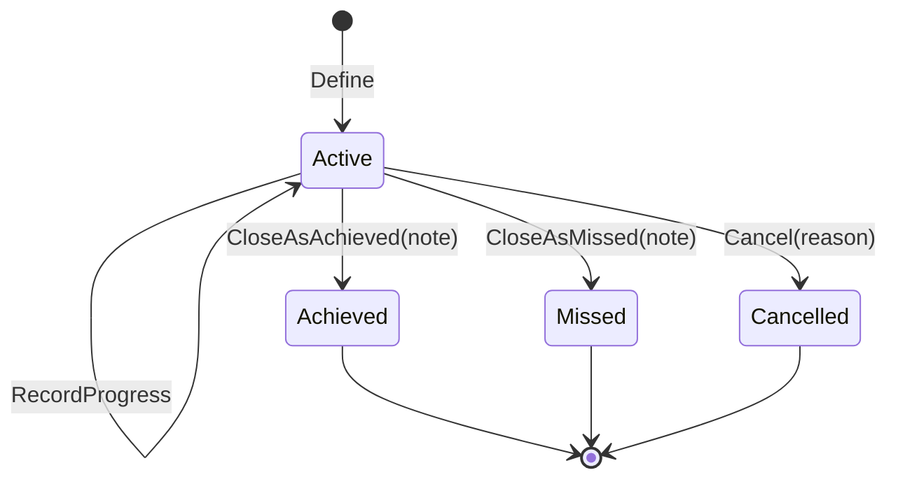

## Business rules
| ID | Rule | Code |
|---|---|---|
| **BR-OBJ-01** | **An objective cannot be declared `Achieved` unless the latest recorded measurement actually meets the target in the declared direction.** The system refuses to accept a claim that contradicts its own evidence. | `OBJ-011` |
| **BR-OBJ-02** | `Direction = AtLeast` ⇒ achieved when `latest ≥ target`; `AtMost` ⇒ achieved when `latest ≤ target`. | `QualityObjective.CloseAsAchieved` |
| **BR-OBJ-03** | Period end must fall after period start. | `OBJ-002` |
| **BR-OBJ-04** | Progress may only be recorded while `Active`. | `OBJ-010` |
| **BR-OBJ-05** | A closed objective is immutable. | `OBJ-013` |
| **BR-OBJ-06** | Every closure requires a note, whatever the outcome. | `OBJ-012` |

## Validation rules
`Title` required ≤300; `Description` ≤2000; `Metric` required ≤300; `Unit` ≤30; `Direction` required;
`OwnerId` required; `Comment` ≤1000; `Note` required ≤2000.

## Error cases
`OBJ-001` · `OBJ-002` · `OBJ-010` · `OBJ-011` (evidence contradicts the claim) · `OBJ-012` · `OBJ-013`
· `OBJ-014` outcome must be Achieved/Missed/Cancelled · `OBJ-404`.

## Edge cases
- With **no** progress measurements recorded, `CloseAsAchieved` cannot succeed (there is no latest
  measurement meeting the target) — the objective must be closed as `Missed` or `Cancelled`.
  **`[Needs Business Confirmation]`** whether that is the intended outcome for an objective that was
  met but never measured in-system.
- The rule uses only the **latest** measurement, not a period average or trend.

## Configuration
None.

## Performance
`GET /api/quality-objectives` filters by `status`; unpaged.

## Security
`define` → `objectives.create`; `close` → `objectives.void`; progress open to tenant actors with the
module's create/edit rights.

## Limitations
No cascade to departmental sub-objectives; no automatic metric feed from KPI data (progress is manual);
no target revision history (revising means closing and re-defining).

## Future improvements
Auto-populate progress from the KPI snapshot series where the metric maps to a known KPI.

## Acceptance criteria
- **AT-FR-OBJ-01** — `AtLeast 95` with latest measurement 92 → `CloseAsAchieved` returns 422 `OBJ-011`.

---

# M-05 · Quality policy (`QP`)

## Purpose
Maintains the organisation's controlled quality-policy statement as a versioned, approved record with
exactly one version in force at any time.

## Business goal
ISO 9001 §5.2 / ISO 17025 §8.2 — a documented quality policy, approved by top management, available
and communicated.

## Actors
Quality Manager / Tenant Admin (draft, revise, approve); **all tenant users** may read the active
policy.

## Inputs
`statement` (≤8000); on approval, `effectiveDate`.

## Outputs
`QualityPolicy` with `PolicyRef` and an integer `Version`; event `QualityPolicyApproved`.

## Dependencies
`USER` (approver identity), `CLD`.

## Workflow
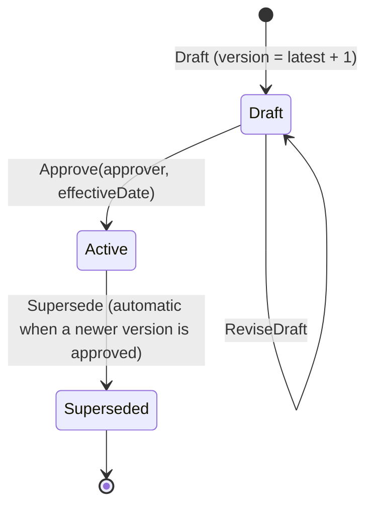

## Business rules
| ID | Rule | Code |
|---|---|---|
| **BR-QP-01** | Version number is the tenant's latest version + 1, computed server-side. | `DraftQualityPolicyHandler` |
| **BR-QP-02** | **The approver must not be the author** (segregation of duties). | `SOD-QP-001` |
| **BR-QP-03** | Approving a policy **automatically supersedes** every other `Active` policy, so exactly one is ever in force. | `QualityPolicyWorkflowHandlers.Handle(ApproveQualityPolicyCommand)` |
| **BR-QP-04** | Only a `Draft` may be edited; `Active` and `Superseded` are immutable — a change is a new version. | `QP-012` |
| **BR-QP-05** | The active policy is readable by **every** authenticated tenant user regardless of privilege, because a policy that cannot be read cannot be communicated. | `GET /api/quality-policy/active` carries no permission attribute |

## Validation rules
`Statement` required ≤ 8000 on both draft and revise.

## Error cases
`QP-001` statement required · `QP-002` version must be positive · `QP-010` only a draft can be
approved · `QP-011` only an active policy can be superseded · `QP-012` only a draft can be edited ·
`QP-404` · `SOD-QP-001` · `TENANT-000` no tenant context · `AUTH-003` no authenticated user.

## Edge cases
- The supersede sweep runs inside the approval transaction and iterates **all** other active policies
  — defensive against a historical data state with more than one active row.
- There is no "withdraw approval": an approved policy can only be superseded by approving a newer one.

## Configuration
None.

## Performance
Two reads: `active` (single row) and the full history list. Both trivial.

## Security
`list` → `quality-policy.view`; `draft` → `.create`; `revise` → `.edit`; `approve` → `.approve`.
`active` is deliberately ungated beyond authentication.

## Limitations
No file attachment (the policy is text, not a PDF); no acknowledgement tracking for the policy itself
(unlike controlled documents, which do have read-and-understand receipts); no scheduled review date.

## Future improvements
Reuse the document-acknowledgement mechanism for the quality policy; add a periodic review cycle.

## Acceptance criteria
- **AT-FR-QP-01** — The author approving their own draft receives 422 `SOD-QP-001`.
- **AT-FR-QP-02** — Approving v2 leaves v1 `Superseded` and exactly one row `Active`.

---

# M-06 · Internal & external audits (`AUD`)

## Purpose
Plans audits, executes them against an ISO-clause checklist, records findings graded OFI/Minor/Major,
links non-conformity findings to nonconformance records, and closes with an electronic sign-off.

## Business goal
ISO/IEC 17025 §8.8 — internal audits at planned intervals, with results reported and nonconformities
actioned.

## Actors
Quality Manager / Tenant Admin (schedule, sign off); lead auditor and audit team (start, answer
checklist, raise findings); External Auditor (read).

## Inputs
`title` (≤300), `type` (`Internal | ExternalHosted`), `leadAuditorId`, `plannedDate`, `checklist`
(≥1 item, each with ISO clause and question). Execution: per item `verdict`
(`Conform | Ofi | NonConform`) + `evidence` (≤2000); findings: `grade` (`Ofi | MinorNc | MajorNc`) +
`description` (≤4000).

## Outputs
`Audit` with `AuditRef`, child `AuditChecklistItem` and `AuditFinding` collections; events
`AuditScheduled`, `FindingRaised`, `AuditSignedOff`; automatically raised NCs for NC-graded findings.

## Dependencies
`NC` (`FindingToNcPolicy`), `ORG` (branch/department allocation), `USER`, `CLD`.

## Workflow
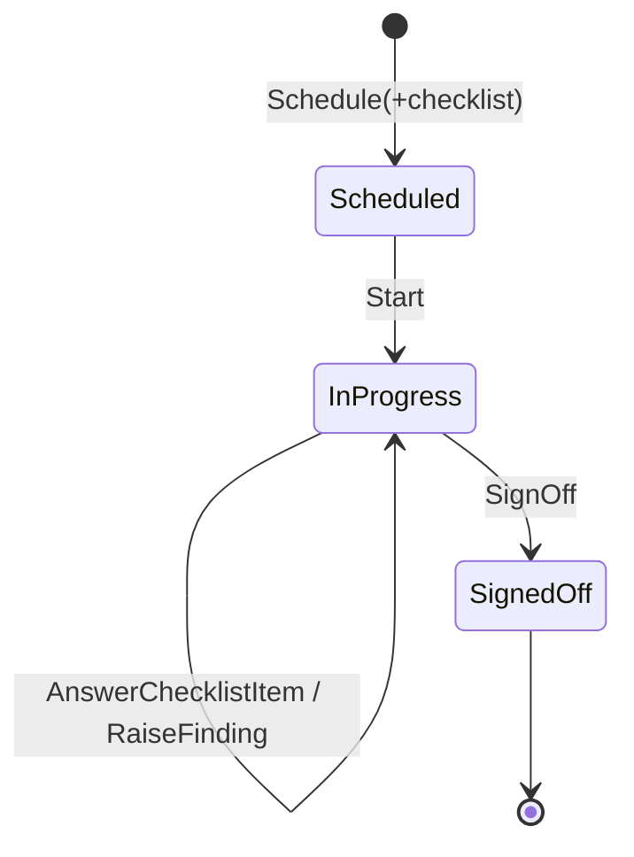

## Business rules
| ID | Rule | Code |
|---|---|---|
| **BR-AUD-01** | An audit needs **at least one checklist item before it can start**. | `AUD-011` |
| **BR-AUD-02** | **Every checklist item must be answered before sign-off.** | `AUD-017` |
| **BR-AUD-03** | **Every NC-graded finding must have its nonconformance acknowledged before sign-off** — the count of unacknowledged findings is reported in the refusal. | `AUD-018` |
| **BR-AUD-04** | An `Ofi`-graded finding **does not** carry a nonconformance. | `AUD-016` |
| **BR-AUD-05** | A `MinorNc` or `MajorNc` finding automatically raises a nonconformance with `sourceType = Audit`, and the NC id is written back onto the finding. | `FindingToNcPolicy` on `FindingRaised`; `AcknowledgeFindingNc` |
| **BR-AUD-06** | A signed-off audit is immutable. | `AUD-020` |
| **BR-AUD-07** | Sign-off is an electronic signature gate requiring `audits.sign`. | `[RequirePermission(Audits, Sign)]` |

## Validation rules
`Title` required ≤300; `LeadAuditorId` required; `Checklist` non-empty ("An audit needs at least one
checklist item."); `Evidence` ≤2000; `Description` required ≤4000.

## Error cases
`AUD-001` · `AUD-002` · `AUD-010` cannot start in state · `AUD-011` · `AUD-012` verdict required ·
`AUD-013` checklist item not found · `AUD-014` · `AUD-015` finding not found · `AUD-016` · `AUD-017` ·
`AUD-018` · `AUD-019` cannot {action}: audit is {status} · `AUD-020` · `AUD-404`.

## Edge cases
- The checklist is supplied **whole at scheduling time**; there is no add-item-later endpoint on a
  scheduled audit (`AddChecklistItem` exists on the aggregate but is only reachable through
  `ScheduleAuditCommand`). Adding a question mid-audit is impossible.
- An audit whose findings' NCs are rejected still counts them as "acknowledged" (acknowledgement is
  the *linking*, not the NC outcome), so sign-off proceeds.
- `AuditType.ExternalHosted` means an external body auditing this laboratory; the workflow is
  identical to internal.

## Configuration
None. Checklist content is caller-supplied; **there is no clause library or checklist template store.**

## Performance
`GET /api/audits` is paged (`page`, `pageSize` default 50), filter `status`. Measured p95 85.9 ms.

## Security
`schedule` → `audits.create`; `sign-off` → `audits.sign`; start/answer/finding carry ordinary command
policies.

## Limitations
| ID | Limitation |
|---|---|
| LIM-AUD-01 | No checklist template library — every audit's questions are typed in at scheduling. The previous SRS promised "renders questions based on selected ISO clauses"; **not built**. |
| LIM-AUD-02 | No audit programme/annual-plan object; audits are individual records with a planned date. |
| LIM-AUD-03 | No auditor-independence check (an auditor may audit their own department). |
| LIM-AUD-04 | No audit report generation (the review-pack PDF export is for management review, not audits). |

## Future improvements
Checklist templates per ISO clause set; annual audit programme; auditor-independence rule; audit
report export.

## Acceptance criteria
- **AT-FR-AUD-01** — Sign-off with one unanswered checklist item returns 422 `AUD-017`.
- **AT-FR-AUD-02** — Sign-off with a `MajorNc` finding whose NC is not yet linked returns 422 `AUD-018`
  naming the count.

---

# M-07 · Change control (`CHG`)

## Purpose
Governs proposed changes to the management system: proposal with impact analysis, mandatory risk
linkage, approval, implementation closure, and a post-implementation effectiveness review.

## Business goal
ISO/IEC 17025 §8.2.4 / EU GMP Annex 11 §4 — changes to the management system are planned, risk-assessed
and reviewed for effectiveness.

## Actors
Any tenant user (propose); Quality Manager / Tenant Admin (link risk, approve, reject, close, review).

## Inputs
`title` (≤300), `impactAnalysis` (≤4000); `riskItemId`; rejection reason (≤1000); implementation notes
(≤4000); PIR: `effective` (bool) + `notes` (≤4000).

## Outputs
`ChangeRequest` with `ChangeRef`; events `ChangeApproved`, `ChangePostImplementationReviewed`.

## Dependencies
`RSK` (mandatory linked risk assessment), `CLD`.

## Workflow
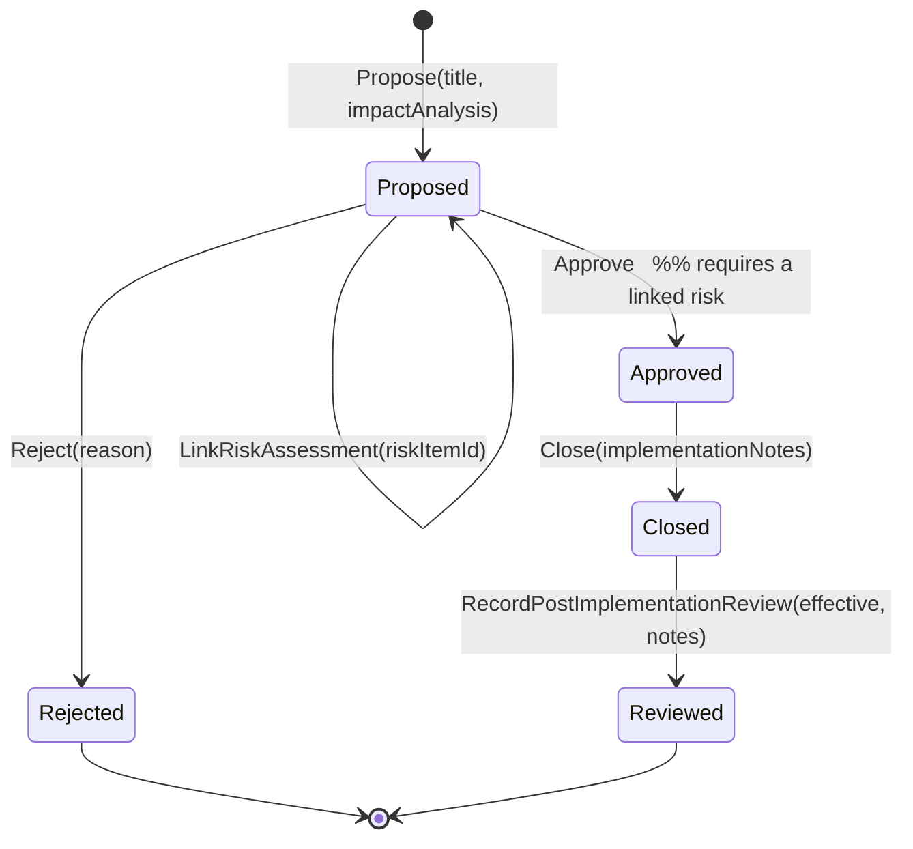

## Business rules
| ID | Rule | Code |
|---|---|---|
| **BR-CHG-01** | **A change cannot be approved without a linked risk assessment.** | `CHG-012` |
| **BR-CHG-02** | An impact analysis is mandatory at proposal. | `CHG-002` |
| **BR-CHG-03** | The post-implementation review is only available from `Closed`, and is terminal. | `ChangeStatus.Reviewed` |
| **BR-CHG-04** | PIR notes are mandatory; the effectiveness verdict alone is not evidence. | `CHG-021` |
| **BR-CHG-05** | Approval carries the SoD guard shared by all analytical/governance sign-offs. | `EnsureSignerIsNotPreparer` |

## Validation rules
`Title` required ≤300; `ImpactAnalysis` required ≤4000; `Reject.Reason` required ≤1000;
`Close.ImplementationNotes` required ≤4000; `Review.Notes` required ≤4000.

## Error cases
`CHG-001` · `CHG-002` · `CHG-012` · `CHG-014` · `CHG-021` · `CHG-404`. Re-reviewing a `Reviewed`
change returns 409.

## Edge cases
- The route is `/api/changes`, **not** `/api/change-requests` — a naming inconsistency with the
  aggregate name that is pinned by the API-surface gate.
- A rejected change is terminal; there is no re-propose from the same record.

## Configuration
None.

## Performance
`GET /api/changes` filter `status`; unpaged.

## Security
Approve and post-implementation review → `changes.approve`; reject → `changes.void`. Whichever tenant roles hold those keys are the roles that get through — the endpoint no longer names roles.

## Limitations
No change categories or risk-based routing (all changes follow one path); no implementation task
breakdown; no scheduled PIR reminder — the review must be initiated manually.

## Future improvements
Change classification (minor/major) with differentiated approval; scheduled PIR due date feeding the
task queue.

## Acceptance criteria
- **AT-FR-CHG-01** — Approving without `riskItemId` returns 422 `CHG-012`.
- **AT-FR-CHG-02** — Full chain propose → link → approve → close → review returns 204 at each step;
  empty PIR notes returns 400; re-review returns 409.

---

# M-08 · Management review (`MRV`)

## Purpose
Schedules management reviews, records decisions with owners and due dates, and closes the review with
immutable minutes.

## Business goal
ISO/IEC 17025 §8.9 / ISO 9001 §9.3 — top management reviews the management system at planned
intervals; outputs include decisions and actions.

## Actors
Quality Manager / Tenant Admin.

## Inputs
`title` (≤300), `reviewDate`, `participants` (≤2000); decisions: `description`, `ownerId`, `dueDate`;
closure: `minutes` (≤20000).

## Outputs
`ManagementReview` with `ReviewRef` and child `ReviewDecision` records; event `ReviewClosed` carrying
the decision count; PDF export `review-pack/{reviewId}.pdf`.

## Dependencies
`USER` (chair, decision owners), `RPT`/KPI (review inputs), `Exports`.

## Workflow
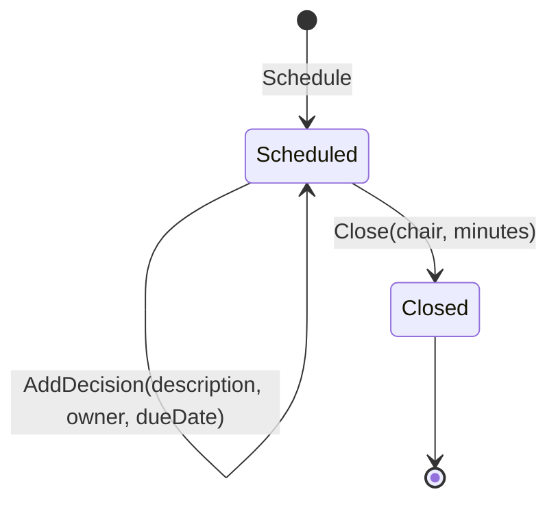

## Business rules
| ID | Rule | Code |
|---|---|---|
| **BR-MRV-01** | Minutes are mandatory to close. | `MRV-003` |
| **BR-MRV-02** | **Closed minutes are immutable** — no decision may be added and no field changed after closure. | `MRV-004` |
| **BR-MRV-03** | Closure records the chair's identity (`ClosedBy`) and emits the decision count. | `ReviewClosed` |

## Validation rules
`Title` required ≤300; `Participants` required ≤2000; `Minutes` required ≤20000.

## Error cases
`MRV-001` · `MRV-002` · `MRV-003` · `MRV-004` · `MRV-404`.

## Edge cases
- Decisions carry an owner and due date but are **not** turned into `WorkTask` records automatically —
  they do not appear in "My tasks". **`[Needs Business Confirmation]`**: this is very likely intended
  to be linked and is currently a gap.
- The review pack PDF is generated on demand from the current state, not snapshotted at closure.

## Configuration
None. The review interval is not modelled.

## Performance
Trivial volumes.

## Security
Schedule → `reviews.create`; add decision → `reviews.edit`; close → `reviews.void`; export → `reviews.export`. The export is a `RECORD_EXPORTED` security event.

## Limitations
No standing agenda/input checklist (ISO 17025 §8.9.2 lists 13 required inputs — none are enforced);
decisions do not create tasks; no review-interval tracking.

## Future improvements
Enforce the §8.9.2 input checklist; materialise decisions as work tasks; track review periodicity.

## Acceptance criteria
- **AT-FR-MRV-01** — Adding a decision to a closed review returns 409 `MRV-004`.

---

# M-09 · Document control (`DOC`)

## Purpose
Controls the lifecycle of quality-system documents: draft → review → approval → publication, with
version bumping, periodic review, read-and-understand acknowledgement, numbered controlled-copy
distribution, and retirement.

## Business goal
ISO/IEC 17025 §8.3 (control of documents) and 21 CFR Part 11 §11.10(k) (revision and change control of
documentation).

## Actors
Any tenant user (create draft, submit, draft new version); reviewers with `documents.approve`
(recommend, reject); approvers with `documents.sign` (publish, confirm periodic review); holders of
`documents.edit` (issue/close controlled copies); `documents.void` (retire); **all users** (acknowledge).

## Inputs
`code` (≤40, pattern `^[A-Za-z0-9][A-Za-z0-9-]*$`), `title` (≤300), `category` (≤50),
`fileId` (required), `changeSummary` (≤1000), `reviewCycleMonths` (default 24).
New version: `fileId`, `changeSummary`, `bump` (`Major | Minor`).
Controlled copy: `holder`, `copyNumber`; closure outcome `Returned | Destroyed`.

## Outputs
`ControlledDocument` with a `DocumentVersion` collection; `DocumentAcknowledgement` receipts;
`DocumentControlledCopy` register; events `DocumentSubmittedForReview`, `DocumentRecommended`,
`DocumentVersionRejected`, `DocumentPublished`, `DocumentVersionObsoleted`, `DocumentRetired`,
`DocumentReviewDue`, `DocumentReviewConfirmed`, `DocumentAcknowledged`, `ControlledCopyClosed`.

## Dependencies
`FILE` (every version binds a stored file), `USER`, `NTF`, `COMP` (competency records may reference a
document), `CLD`.

## Workflow
Document status is `Draft | Published | Obsolete`; each **version** carries its own state
`Draft | UnderReview | Approved | Published | Obsolete | Rejected`.

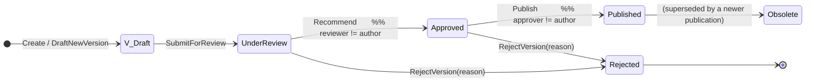

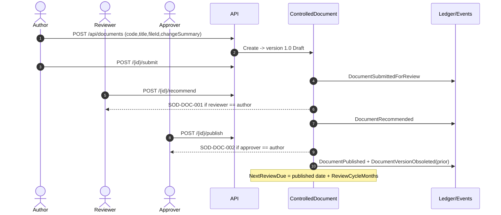

## Business rules
| ID | Rule | Code |
|---|---|---|
| **BR-DOC-01** | Document code must match `^[A-Za-z0-9][A-Za-z0-9-]*$` — letters, digits and hyphens (e.g. `SOP-CAL-045`). | validator |
| **BR-DOC-02** | Document code is **unique per tenant**. | `DOC-003` |
| **BR-DOC-03** | **The author cannot review their own document.** | `SOD-DOC-001` |
| **BR-DOC-04** | **The author cannot approve/publish their own document.** | `SOD-DOC-002` |
| **BR-DOC-05** | Only one version may be in progress at a time; a second draft is refused until the first is published or rejected. | `DOC-016` |
| **BR-DOC-06** | Only a **published** document can be revised into a new version. | `DOC-017` |
| **BR-DOC-07** | A **retired** document cannot receive new versions. | `DOC-015` |
| **BR-DOC-08** | Publishing a new version **obsoletes the prior published version** automatically. | `DocumentVersionObsoleted` raised ×2 sites |
| **BR-DOC-09** | Version numbering is `Major.Minor`; the bump kind is chosen by the author when drafting. | `VersionBump` |
| **BR-DOC-10** | `NextReviewDue` is set from publication + `ReviewCycleMonths` (default **24**). The hourly sweep raises `DocumentReviewDue` once (`ReviewDueRaised` prevents repeats). | `MarkReviewDueIfReached`, `DocumentReviewDuePolicy` |
| **BR-DOC-11** | Only a **published** document undergoes periodic review confirmation. | `DOC-020` |
| **BR-DOC-12** | Acknowledgement ("read and understand") is **pinned to the published version label**; publishing a new version re-opens the acknowledgement for everyone. | `DocumentAcknowledgement` unique `(tenant, document, version, user)` |
| **BR-DOC-13** | Acknowledgement is **idempotent** — repeating it returns success without creating a second receipt. | `AcknowledgeDocumentCommand` |
| **BR-DOC-14** | Only a **published** document can be acknowledged. | `ACK-010` |
| **BR-DOC-15** | A controlled copy may be issued only against a **published** document and is pinned to that version label. | `CCP-020` |
| **BR-DOC-16** | Closing a controlled copy is **one-shot and immutable**, and the outcome must be `Returned` or `Destroyed`. | `CCP-003`, `CCP-010` |
| **BR-DOC-17** | Copy numbers are caller-supplied positive integers. | `CCP-002` |

## Validation rules
`Code` required ≤40 + pattern; `Title` required ≤300; `Category` ≤50; `FileId` required;
`ChangeSummary` ≤1000; `RejectVersion.Reason` required ≤1000; controlled-copy `holder` required.

## Error cases
`DOC-001` · `DOC-002` · `DOC-003` code in use · `DOC-012` no version awaiting review/approval, or
cannot reject in state · `DOC-013` · `DOC-015` · `DOC-016` · `DOC-017` · `DOC-018` already obsolete ·
`DOC-020` · `DOC-404` · `SOD-DOC-001` · `SOD-DOC-002` · `ACK-001..003`, `ACK-010` · `CCP-001..003`,
`CCP-010`, `CCP-020`, `CCP-404`.

## Edge cases
- **No PDF rendering and no watermarking.** Files are stored and returned byte-for-byte. The previous
  SRS's "diagonal red OBSOLETE — UNCONTROLLED watermark" does **not** exist. An obsolete version's file
  is still downloadable through `GET /api/files/{id}` if its id is known.
- The coverage query for `GET /{id}/acknowledgements` materialises receipts and then maps user display
  names **in memory** — a cross-`DbSet` `.Join` to users did not translate in EF Core and produced a
  500. Do not "optimise" it back into a single query.
- A document with `reviewCycleMonths = 0` would be perpetually due. **`[Assumption]`** — no validator
  bounds this value; the default is 24.
- Controlled-copy numbers are not enforced unique per document.

## Configuration
`reviewCycleMonths` is a per-document input, default 24 (constructor default, not configuration).

## Performance
`GET /api/documents` is paged with `status` and `search` filters; measured p95 101.4 ms.

## Security
Review/reject → `documents.approve`; publish and periodic-review confirmation → `documents.sign`;
controlled copies → `documents.edit`; retire → `documents.void`; acknowledgement open to all
authenticated tenant users. `GET /{id}/signatures` returns the e-signature manifest for the document.

## Limitations
| ID | Limitation |
|---|---|
| LIM-DOC-01 | No document rendering, preview, watermarking or PDF manipulation. |
| LIM-DOC-02 | No folder/tree taxonomy — `category` is a flat string. The previous SRS's "SOP tree directory" is **not built**. |
| LIM-DOC-03 | No full-text search inside documents; `search` matches metadata only. |
| LIM-DOC-04 | Acknowledgement is not *enforced* — nothing blocks a user who has not acknowledged a mandatory SOP from working. |
| LIM-DOC-05 | No distribution list; controlled copies are issued one at a time to a free-text holder. |
| LIM-DOC-06 | No document-to-training linkage beyond the optional `documentId` on a competency record. |

## Future improvements
Watermark/stamp on download for obsolete versions; hierarchical categories; acknowledgement
enforcement gates; distribution lists; document-driven training assignment.

## Acceptance criteria
- **AT-FR-DOC-01** — Author calling `recommend` gets 422 `SOD-DOC-001`; a different reviewer succeeds.
- **AT-FR-DOC-02** — Publishing v2 sets v1's version state to `Obsolete` and emits
  `DocumentVersionObsoleted`.
- **AT-FR-DOC-03** — `my-acknowledgement` returns false → `acknowledge` 200 → true with a timestamp →
  repeat `acknowledge` 200 and still one receipt.
- **AT-FR-DOC-04** — Issuing a controlled copy against a `Draft` document returns 422 `CCP-020`.

---

# M-10 · Records, archive & retention (`ARC`)

## Purpose
Archives a completed record with an immutable content snapshot, tracks retrieval and return, enforces
a retention schedule, supports legal hold, and authorises disposal.

## Business goal
ISO/IEC 17025 §8.4 (control of records; retention periods) and 21 CFR Part 11 §11.10(c) (protection of
records throughout the retention period).

## Actors
Holders of the `records.*` permission keys — conventionally Quality Manager, Department Head and Tenant Admin — for archive, retrieve, return, disposal and legal hold.

## Inputs
`sourceModule` (≤60), `sourceRef` (≤60), **`snapshotFileId` (required)**,
`retentionClass` (`FiveYears | TenYears | Permanent`), `archivedOn`. Legal hold: `reason` (≤1000).

## Outputs
`ArchiveEntry` with `ArchiveRef`, computed `RetentionExpiry`, state and hold flags; events
`RecordDisposed`, `ArchiveLegalHoldPlaced`, `ArchiveLegalHoldReleased`.

## Dependencies
`FILE` (snapshot), every source module (as the thing archived), `CLD`.

## Workflow
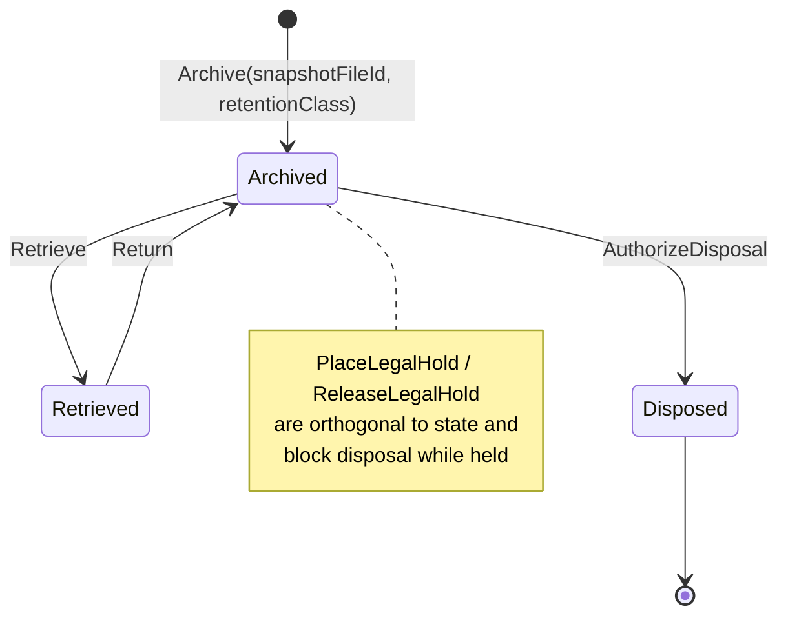

## Business rules
| ID | Rule | Code |
|---|---|---|
| **BR-ARC-01** | **An archive entry cannot be created without an immutable content snapshot file.** | `ARC-002` |
| **BR-ARC-02** | The same `(sourceModule, sourceRef)` cannot be archived twice. | `ARC-020` |
| **BR-ARC-03** | `RetentionExpiry` derives from `archivedOn` + the retention class (5 or 10 years); `Permanent` has no expiry. | `ArchiveEntry.Archive` |
| **BR-ARC-04** | **Permanent-retention records can never be disposed.** | `ARC-013` |
| **BR-ARC-05** | Disposal before the retention expiry is refused, and the refusal states the expiry date. | `ARC-014` |
| **BR-ARC-06** | **A legal hold blocks disposal regardless of retention expiry.** | `ARC-015` |
| **BR-ARC-07** | Placing a legal hold requires a reason and records who placed it. | `ARC-030` |
| **BR-ARC-08** | A disposed record cannot be retrieved or placed on hold. | `ARC-010`, `ARC-031` |
| **BR-ARC-09** | Releasing a hold that is not in place is refused. | `ARC-032` |
| **BR-ARC-10** | Releasing a legal hold is a `DELETE` and therefore requires the `X-Change-Reason` header. | `ChangeReasonMiddleware` |

## Validation rules
`SourceModule` required ≤60; `SourceRef` required ≤60; `SnapshotFileId` required with the explicit
message *"An immutable content snapshot is required to archive a record (F-14)."*;
`PlaceLegalHold.Reason` required ≤1000.

## Error cases
`ARC-001` · `ARC-002` · `ARC-010` · `ARC-011` · `ARC-012` · `ARC-013` · `ARC-014` · `ARC-015` ·
`ARC-020` · `ARC-030` · `ARC-031` · `ARC-032` · `ARC-404`.

## Edge cases
- The `snapshot_file_id` column is **physically nullable** to accommodate one legacy development row,
  even though the domain now requires it. A hand-inserted null would bypass BR-ARC-01.
- Archiving does **not** delete or lock the source record — it is a parallel retention register, not a
  move operation. Nothing prevents the source from continuing to change after archival.
  **`[Needs Business Confirmation]`**
- Retention classes are a fixed three-value enum; a jurisdiction requiring, say, 7 years cannot be
  represented.

## Configuration
None — retention classes are compiled-in enum values.

## Performance
`GET /api/archives` unpaged.

## Security
Disposal and both legal-hold operations require `records.void`; archive/retrieve/return carry ordinary command policies. Disposal emits `RecordDisposed` into the ledger.

## Limitations
No automatic archival trigger (archiving is always a manual act); no disposal certificate output; no
retention schedule per record type; snapshot integrity is not re-verified at disposal time.

## Future improvements
Configurable retention schedules per source module; scheduled disposal candidacy report; snapshot hash
re-verification before disposal; disposal certificate export.

## Acceptance criteria
- **AT-FR-ARC-01** — Archiving without `snapshotFileId` returns 422 `ARC-002`.
- **AT-FR-ARC-02** — Disposal of a held record returns 422 `ARC-015`; after release (with
  `X-Change-Reason`) and past expiry, disposal succeeds and emits `RecordDisposed`.
- **AT-FR-ARC-03** — Disposal of a `Permanent` record returns 422 `ARC-013` at any date.
