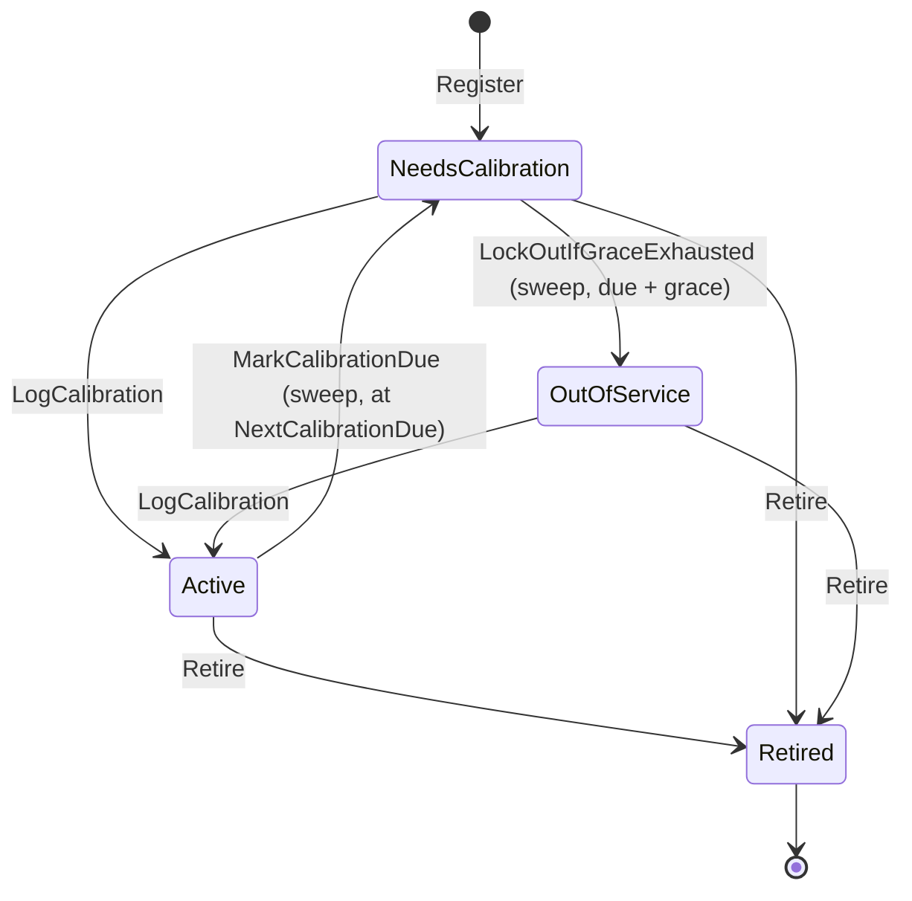
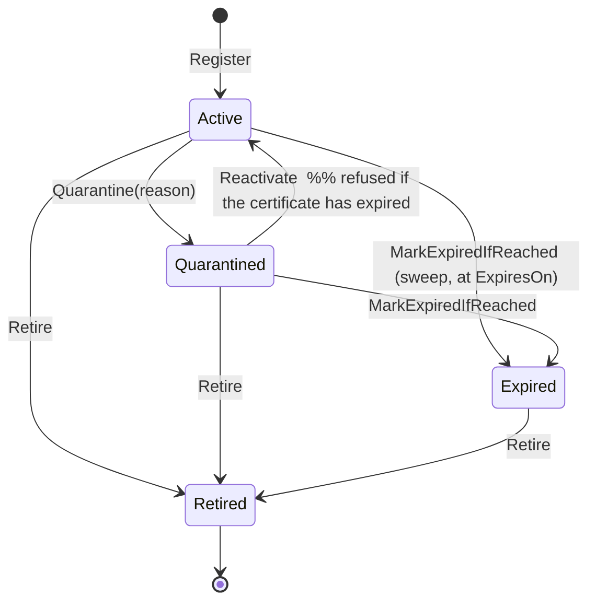
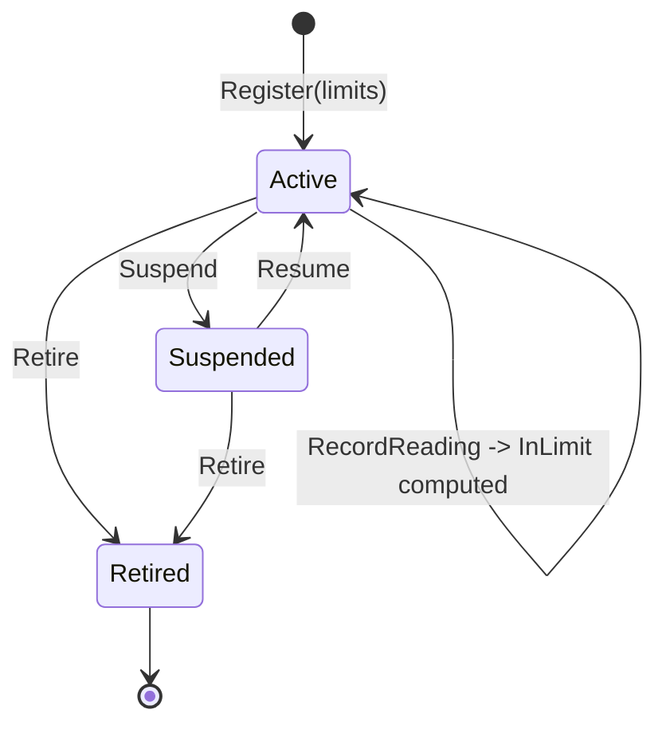
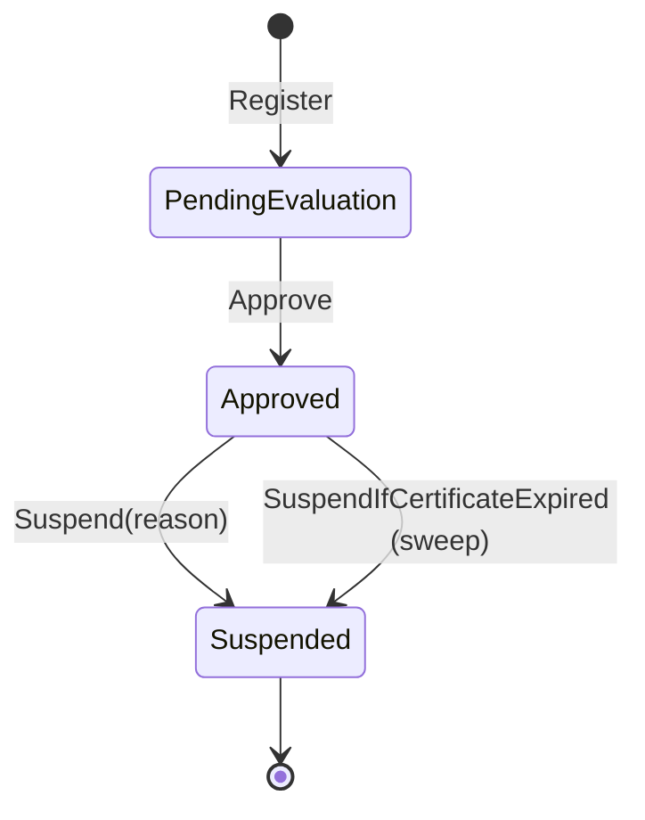
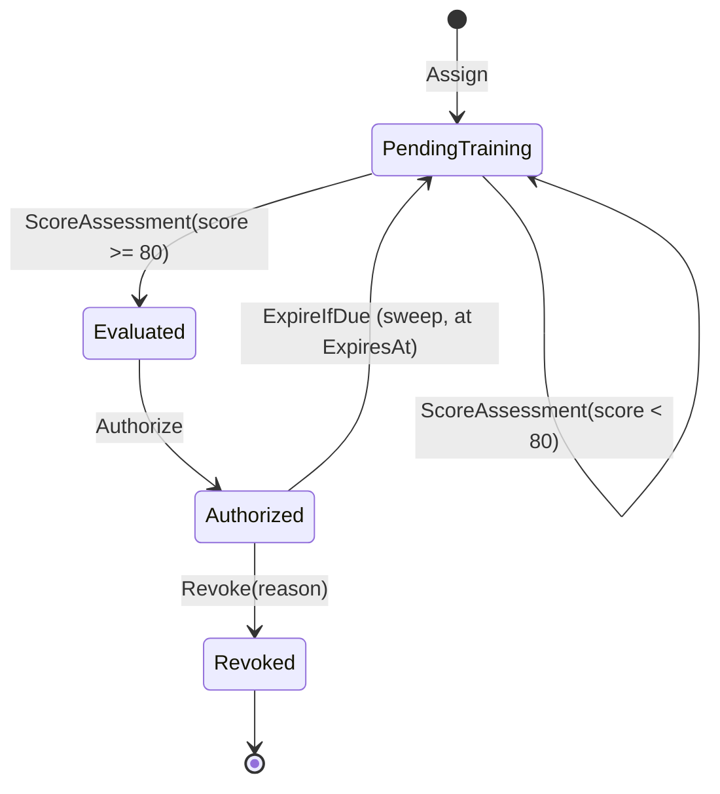
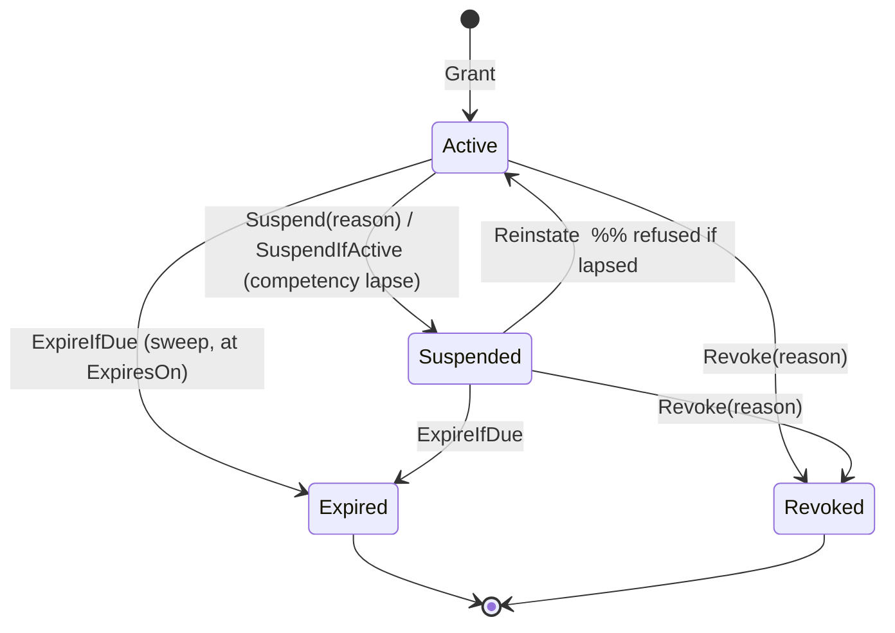
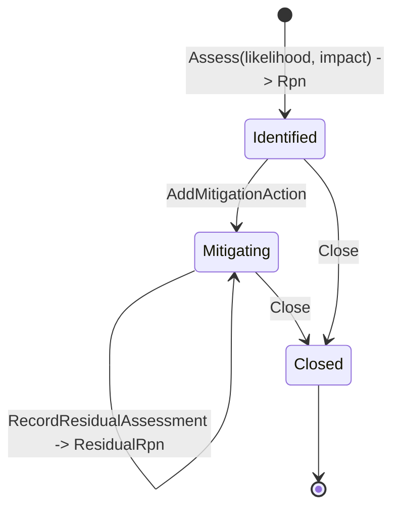
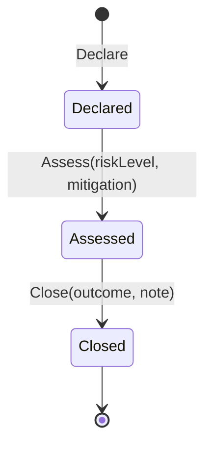
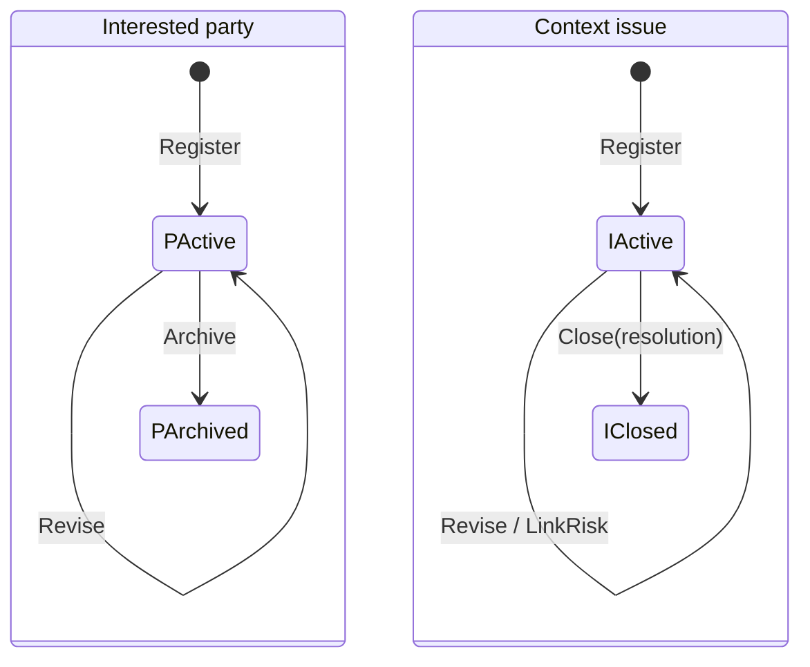

# NT.QMS — Production Software Requirements Specification
## Document 02 · Part 2 — Functional Specification: Resources, People & Governance

> Part 2 of 4. [Part 1](02-1-Functional-Specification-Quality-and-Improvement.md) ·
> [Part 3](02-3-Functional-Specification-Analytical-Quality.md) ·
> [Part 4](02-4-Functional-Specification-Operations-and-Platform.md) ·
> [Conventions](00-SRS-Index-and-Conventions.md)

---

# M-11 · Equipment & calibration (`EQP`)

## Purpose
Registers laboratory equipment, schedules and records calibration on a fixed interval with a grace
period, logs maintenance and intermediate checks, and takes equipment out of service automatically
when the grace period is exhausted.

## Business goal
ISO/IEC 17025 §6.4 — equipment must be calibrated, its calibration status identifiable, and equipment
that has been subjected to overloading, mishandling or has given suspect results must be taken out of
service.

## Actors
Any tenant user (register, log calibration/maintenance/checks); `equipment.void` holders (retire);
**System** (calibration-due marking and lock-out via the hourly sweep).

## Inputs
`code`, `name` (≤200), `serialNumber` (≤100), `location`, `calibrationIntervalDays` (1–3650),
`gracePeriodDays` (0–365). Calibration: `performedAt`, `provider`, `result`, optional
`certificateFileId`. Maintenance: `performedAt`, `workDescription` (≤2000). Intermediate check:
`performedOn`, `performedById`, `checkType` (≤200), `passed`, optional `referenceStandardId`,
`remarks` (≤2000).

## Outputs
`EquipmentItem` with a status and `NextCalibrationDue`; child `CalibrationRecord`,
`MaintenanceRecord`, `IntermediateCheck` collections; events `CalibrationDue`, `EquipmentLockedOut`,
`EquipmentReturnedToService`, `EquipmentRetired`, `IntermediateCheckFailed`; an automatically raised
NC on a failed intermediate check.

## Dependencies
`FILE` (calibration certificate), `RS` (a check may cite a reference standard), `NC`
(`IntermediateCheckToNcPolicy`), `NTF`, `ORG` (allocation), the hourly sweep.

## Workflow — `WF-05`

## Business rules
| ID | Rule | Code |
|---|---|---|
| **BR-EQP-01** | New equipment starts in `NeedsCalibration` — it is not usable until first calibrated. | `Register` |
| **BR-EQP-02** | `NextCalibrationDue = LastCalibrationAt + CalibrationIntervalDays`, recomputed at every calibration. | `LogCalibration` |
| **BR-EQP-03** | At `NextCalibrationDue` the sweep sets `NeedsCalibration` and raises `CalibrationDue`. | `MarkCalibrationDue` |
| **BR-EQP-04** | **At `NextCalibrationDue + GracePeriodDays` the sweep forces `OutOfService` and raises `EquipmentLockedOut`.** This is the automatic lock-out. | `LockOutIfGraceExhausted` |
| **BR-EQP-05** | Logging a calibration on out-of-service equipment returns it to `Active` and raises `EquipmentReturnedToService`. | `LogCalibration` |
| **BR-EQP-06** | Serial number is unique per tenant. | `EQP-004` |
| **BR-EQP-07** | Retired equipment accepts no calibration, maintenance or intermediate check. | `EQP-010`, `EQP-012`, `EQP-020` |
| **BR-EQP-08** | **A failed intermediate check automatically raises a nonconformance.** | `IntermediateCheckToNcPolicy` on `IntermediateCheckFailed` |
| **BR-EQP-09** | **An intermediate check may only cite an active, in-date reference standard.** A quarantined, expired or retired standard is refused. | `RS-020` |
| **BR-EQP-10** | Calibration interval 1–3650 days; grace period 0–365 days. | validator |

## Validation rules
`Name` required ≤200; `SerialNumber` required ≤100; `CalibrationIntervalDays` 1–3650;
`GracePeriodDays` 0–365; `WorkDescription` required ≤2000; `CheckType` required ≤200;
`Remarks` ≤2000.

## Error cases
`EQP-001` · `EQP-002` · `EQP-003` · `EQP-004` · `EQP-010` · `EQP-011` calibration result required ·
`EQP-012` · `EQP-013` · `EQP-014` · `EQP-020` · `EQP-021` · `EQP-404` · `RS-020` · `FILE-404`
certificate file not found.

## Edge cases
- Lock-out is **status-only**. Nothing in the system prevents an out-of-service instrument from being
  named in a QC run, a study or a result — `Instrument` fields are free text, not foreign keys to
  `EquipmentItem`. The previous SRS's "block its selection" is therefore **not enforced**.
- A calibration logged with a **past** `performedAt` recomputes `NextCalibrationDue` from that past
  date, which can immediately re-trigger the due state on the next sweep.
- The sweep runs hourly, so lock-out happens within one hour of the grace expiry, not at the instant.
- Grace period 0 means lock-out on the same sweep tick as the due date.

## Configuration
None. Interval and grace are per-item inputs.

## Performance
`GET /api/equipment` paged, `status` filter.

## Security
Retire → `equipment.void`. Register/log operations carry ordinary command policies. Equipment is
`IAllocatable`.

## Limitations
Free-text instrument references elsewhere in the system (no referential link); no calibration
certificate parsing; no calibration-due notification lead time (the event fires on the due date, not
before); no equipment hierarchy or sub-components; no usage log.

## Future improvements
Foreign-key instrument references so lock-out actually blocks use; configurable pre-due reminder lead
time; calibration supplier linkage to the supplier register.

## Acceptance criteria
- **AT-FR-EQP-01** — Given interval 365 and grace 30, an item calibrated on day 0 becomes
  `NeedsCalibration` on day 365 and `OutOfService` on day 395.
- **AT-FR-EQP-02** — A failed intermediate check creates an NC with `sourceType = Internal` linked by
  `sourceRef`.
- **AT-FR-EQP-03** — Citing a quarantined standard in a check returns 422 `RS-020`.

---

# M-12 · Reference standards (`RS`)

## Purpose
Registers certified reference materials, reference standards and working standards with their
traceability chain and certificate expiry; manages quarantine, reactivation, automatic expiry and
retirement.

## Business goal
ISO/IEC 17025 §6.5 (metrological traceability) and §6.4 — calibrations must be anchored to a
traceable, in-date standard.

## Actors
`reference-standards.create` (register); `.edit` (quarantine); `.approve` (reactivate); `.void`
(retire); **System** (expiry via the hourly sweep).

## Inputs
`standardRef`, `name` (≤300), `type` (`CertifiedReferenceMaterial | ReferenceStandard |
WorkingStandard`), **`traceableTo` (≤500, required)**, `manufacturer` (≤200), `lotNumber` (≤100),
`certificateNumber` (≤100), `certifiedValue` (≤200), `uncertaintyStatement` (≤200), `receivedOn`,
`expiresOn`. Quarantine: `reason` (≤1000).

## Outputs
`ReferenceStandard` with status; events `ReferenceStandardQuarantined`, `ReferenceStandardExpired`.

## Dependencies
`EQP` (intermediate checks cite standards), the hourly sweep, `ORG` (allocation).

## Workflow — `WF-06`

## Business rules
| ID | Rule | Code |
|---|---|---|
| **BR-RS-01** | **The traceability chain is mandatory** — "an untraceable standard cannot anchor calibrations". | `RS-002` |
| **BR-RS-02** | Expiry date must fall after the received date. | `RS-003` |
| **BR-RS-03** | The sweep sets `Expired` at `ExpiresOn` and raises `ReferenceStandardExpired`. | `MarkExpiredIfReached` |
| **BR-RS-04** | **An expired certificate cannot be reactivated** — a replacement must be registered. | `RS-013` |
| **BR-RS-05** | Only an active standard can be quarantined; only a quarantined one can be reactivated. | `RS-010`, `RS-012` |
| **BR-RS-06** | Quarantine requires a reason. | `RS-011` |
| **BR-RS-07** | Only an active, in-date standard may be cited by an equipment intermediate check. | `RS-020` |

## Validation rules
`Name` required ≤300; `TraceableTo` required ≤500; `Manufacturer` ≤200; `LotNumber` ≤100;
`CertificateNumber` ≤100; `CertifiedValue` ≤200; `UncertaintyStatement` ≤200; `Reason` required ≤1000.

## Error cases
`RS-001` · `RS-002` · `RS-003` · `RS-010` · `RS-011` · `RS-012` · `RS-013` · `RS-014` · `RS-020` ·
`RS-404`.

## Edge cases
- A standard with **no** `expiresOn` never expires automatically.
- Quarantine does not cascade: measurements already anchored to a now-quarantined standard are not
  flagged or re-examined. **`[Needs Business Confirmation]`** — a real-world quarantine usually
  triggers an impact assessment of work performed since.
- `certifiedValue` and `uncertaintyStatement` are **free text**, not numeric — they cannot feed the
  uncertainty budget module automatically.

## Configuration
None.

## Performance
`GET /api/reference-standards` `status` filter; unpaged.

## Security
As per the actor table; standards are `IAllocatable`.

## Limitations
No certificate file attachment on the standard itself (only equipment calibration has one); no
consumption/stock tracking; no automatic impact assessment on quarantine; no numeric certified value.

## Future improvements
Attach the certificate file; structured certified value + uncertainty to feed measurement-uncertainty
budgets; retrospective impact list on quarantine.

## Acceptance criteria
- **AT-FR-RS-01** — Registering without `traceableTo` returns 422 `RS-002`.
- **AT-FR-RS-02** — Reactivating a standard past `ExpiresOn` returns 422 `RS-013`.

---

# M-13 · Environmental monitoring (`ENV`)

## Purpose
Registers monitoring points (temperature, humidity, pressure, …) with acceptance limits, records
readings, and raises an excursion event — and a nonconformance — whenever a reading falls outside
limits.

## Business goal
ISO/IEC 17025 §6.3 — facility and environmental conditions must be monitored, controlled and recorded
where they affect result validity.

## Actors
`monitoring-points.create` (register); `.edit` (limits, suspend, resume); any tenant user (record
reading); `.void` (retire).

## Inputs
`pointRef`, `name` (≤200), `location` (≤200), `parameter` (≤100), `unit` (≤30), `lowLimit`,
`highLimit`. Reading: `value`, `atUtc`, `recordedById`, `remark` (≤1000).

## Outputs
`MonitoringPoint` with child `EnvironmentalReading` records each carrying a computed `InLimit` flag;
event `EnvironmentalExcursionDetected`; automatically raised NC.

## Dependencies
`NC` (`ExcursionToNcPolicy`), `NTF`, `ORG` (allocation).

## Workflow — `WF-07`

## Business rules
| ID | Rule | Code |
|---|---|---|
| **BR-ENV-01** | **At least one acceptance limit (low or high) is required** — a point with no limits cannot detect an excursion. | `ENV-003` |
| **BR-ENV-02** | When both limits are set, low must be below high. | `ENV-004` |
| **BR-ENV-03** | `InLimit` is computed at recording time from the limits then in force and **frozen on the reading**, so a later limit change does not retroactively re-grade history. | `RecordReading` |
| **BR-ENV-04** | An out-of-limit reading raises `EnvironmentalExcursionDetected`, which **automatically raises a nonconformance**. | `ExcursionToNcPolicy` |
| **BR-ENV-05** | Readings can only be recorded on an `Active` point. | `ENV-011` |
| **BR-ENV-06** | A retired point cannot be re-baselined (limits changed). | `ENV-010` |

## Validation rules
`Name` required ≤200; `Location` ≤200; `Parameter` required ≤100; `Unit` required ≤30;
`Remark` ≤1000.

## Error cases
`ENV-001` · `ENV-002` · `ENV-003` · `ENV-004` · `ENV-010` · `ENV-011` · `ENV-012` · `ENV-013` ·
`ENV-014` · `ENV-404`.

## Edge cases
- Every excursion raises an NC — **there is no de-bounce, no stabilisation window and no
  consecutive-reading requirement.** A sensor oscillating around a limit will generate one NC per
  reading. **`[Needs Business Confirmation]`** — this is the most likely source of alert fatigue in
  the system.
- Readings are recorded manually; there is no data-logger or sensor ingestion path.
- `atUtc` is caller-supplied, so back-dated readings are accepted without bound.

## Configuration
None.

## Performance
`GET /api/monitoring-points` `status` filter; unpaged. Reading history is loaded with the detail view.

## Security
As per the actor table; points are `IAllocatable`.

## Limitations
No automated data capture; no excursion de-bounce; no trend/statistical monitoring; no scheduled
reading reminders; readings cannot be corrected (no amend path, only the ledger).

## Future improvements
Excursion de-bounce (N consecutive readings or a duration window); scheduled reading tasks; data-logger
ingestion endpoint.

## Acceptance criteria
- **AT-FR-ENV-01** — Registering with neither limit returns 422 `ENV-003`.
- **AT-FR-ENV-02** — A reading above `highLimit` marks `InLimit = false` and creates an NC.
- **AT-FR-ENV-03** — Changing limits afterwards does not change the stored `InLimit` of past readings.

---

# M-14 · Supplier quality (`SUP`)

## Purpose
Registers external providers, tracks their certificates and expiry, approves them for use, records
periodic weighted evaluations, and suspends them on failure or certificate expiry.

## Business goal
ISO/IEC 17025 §6.6 — externally provided products and services must be suitable, and suppliers must be
evaluated, selected, monitored and re-evaluated.

## Actors
Any tenant user (register, add certificate); `suppliers.approve` (approve, record evaluation);
`suppliers.void` (suspend); **System** (certificate-expiry suspension via the hourly sweep).

## Inputs
`supplierRef`, `name` (≤200), `supplierType`. Certificate: `certificateType`, `expiresAt`, optional
`fileId`. Evaluation: `periodStart`, `periodEnd`, `criteria` (≤50 items of criterion/weight/score).

## Outputs
`Supplier` with status and child `CertificateRecord`s; `SupplierEvaluation` records with a
`WeightedTotal`; events `SupplierApproved`, `SupplierSuspended`.

## Dependencies
`FILE` (certificate), the hourly sweep, `NC` (a supplier failure may be an NC source), `ORG`.

## Workflow — `WF-08`

## Business rules
| ID | Rule | Code |
|---|---|---|
| **BR-SUP-01** | **The registrant cannot approve their own supplier.** | `SOD-SUP-001` |
| **BR-SUP-02** | **An expired certificate automatically suspends the supplier** on the next sweep. | `SuspendIfCertificateExpired`, `SupplierSuspended` raised at 2 sites |
| **BR-SUP-03** | Only an approved supplier can be suspended. | `SUP-011` |
| **BR-SUP-04** | Evaluation `WeightedTotal = Σ(weight × score) / Σ(weight)`; weights must sum to a positive value. | `SUP-022` |
| **BR-SUP-05** | Scores must be 0–100 and weights non-negative. | `SUP-023` |
| **BR-SUP-06** | An evaluation needs at least one criterion and **at most 50**. | `SUP-021`, validator |
| **BR-SUP-07** | Evaluation period end must not precede its start. | `SUP-020` |

## Validation rules
`Name` required ≤200; `Criteria` non-empty and ≤50 items.

## Error cases
`SUP-001` · `SUP-002` · `SUP-010` already approved · `SUP-011` · `SUP-012` · `SUP-020` · `SUP-021` ·
`SUP-022` · `SUP-023` · `SUP-404` · `SOD-SUP-001`.

## Edge cases
- There is **no un-suspend / re-approve path**: `Suspended` is terminal in the aggregate. A supplier
  suspended for an expired certificate cannot be restored after renewing the certificate — a new
  supplier record is required. **`[Needs Business Confirmation]`** — this is very likely a defect.
- A supplier can be approved with **no certificate at all**.
- Evaluations do not gate approval status — a catastrophic evaluation score does not suspend anyone.

## Configuration
None. No evaluation pass threshold exists.

## Performance
`GET /api/suppliers` paged, `status` filter.

## Security
Approve and evaluate → `suppliers.approve`; suspend → `suppliers.void`. `IAllocatable`.

## Limitations
No reinstatement path; no approved-supplier-list enforcement anywhere else in the system (nothing
checks supplier status when equipment or consumables are used); no evaluation schedule/reminder; no
evaluation threshold.

## Future improvements
Reinstatement after certificate renewal; evaluation due-date scheduling; minimum acceptable weighted
score with automatic suspension.

## Acceptance criteria
- **AT-FR-SUP-01** — The registrant approving their own supplier returns 422 `SOD-SUP-001`.
- **AT-FR-SUP-02** — A certificate whose `expiresAt` passes causes suspension within one sweep cycle.
- **AT-FR-SUP-03** — 51 evaluation criteria returns 400 from the validator.

---

# M-15 · Competency (`COMP`)

## Purpose
Assigns a competency subject (an SOP, a method) to a person, records assessment scores, authorises the
person for a defined validity period, expires the authorisation automatically, and supports revocation.

## Business goal
ISO/IEC 17025 §6.2 — personnel must be competent, competence must be evaluated, and authorisation to
perform specific activities must be documented and current.

## Actors
`competencies.create` (assign); `.edit` (score assessment); `.approve` (authorise); `.void` (revoke);
**System** (expiry via the hourly sweep).

## Inputs
`traineeId`, `subject` (≤300), optional `documentId`, `validityMonths` (1–60).
Assessment: `score` (0–100), `assessorId`, timestamp. Revocation: `reason` (≤1000).

## Outputs
`CompetencyRecord` with status, `ExpiresAt`, child `AssessmentResult` records; events
`CompetencyAuthorized`, `CompetencyExpired`, `CompetencyRevoked`; downstream suspension of dependent
test authorisations.

## Dependencies
`DOC` (optional subject document), `USER`, `AUTHZ` (competency evidences a test authorisation), the
hourly sweep, `NC` (`CompetencyLapseAuthorizationPolicy`).

## Workflow — `WF-09`

## Business rules
| ID | Rule | Code |
|---|---|---|
| **BR-COMP-01** | **The pass mark is 80.** A score ≥ 80 moves the record to `Evaluated`; a score below leaves it `PendingTraining` (retraining required). | `CompetencyRecord.PassMark = 80` |
| **BR-COMP-02** | **Only an `Evaluated` competency can be authorised** — authorisation without a passing assessment is impossible. | `COMP-012` |
| **BR-COMP-03** | **A trainee cannot assess their own competency**, and **cannot authorise their own competency**. | `SOD-COMP-001` (both sites) |
| **BR-COMP-04** | `ExpiresAt = authorisation date + ValidityMonths`; validity is 1–60 months. | `Authorize`, `COMP-002` |
| **BR-COMP-05** | The sweep expires an authorisation at `ExpiresAt`, returning the record to `PendingTraining` and raising `CompetencyExpired`. | `ExpireIfDue` |
| **BR-COMP-06** | **Competency expiry or revocation suspends every dependent test authorisation** and raises a nonconformance. | `CompetencyLapseAuthorizationPolicy`; `TestAuthorization.SuspendIfActive` |
| **BR-COMP-07** | Only an `Authorized` competency can be revoked, and revocation requires a reason. | `COMP-013`, `COMP-014` |
| **BR-COMP-08** | Scores are 0–100. | `COMP-011` |

## Validation rules
`TraineeId` required; `Subject` required ≤300; `ValidityMonths` 1–60; `Reason` required ≤1000.

## Error cases
`COMP-001` · `COMP-002` · `COMP-010` cannot score in state · `COMP-011` · `COMP-012` · `COMP-013` ·
`COMP-014` · `COMP-404` · `SOD-COMP-001`.

## Edge cases
- **The pass mark of 80 is a hard-coded constant, not configuration.** A laboratory whose procedure
  uses a different threshold cannot change it. **`[Needs Business Confirmation]`** — see
  [TD](14-Technical-Debt-Report.md).
- Expiry returns the record to `PendingTraining`, so the assessment history is retained but the person
  must be re-assessed and re-authorised.
- There is no advance-warning event before expiry — the lapse is detected at the moment it happens.
- The previous SRS's "4-digit signature PIN" on competency authorisation is **not** enforced at this
  endpoint; the PIN ceremony is used by the e-signature service where invoked, not here.

## Configuration
None. `PassMark` is `CON-` (see [Document 04](04-Configuration-Reference.md)).

## Performance
`GET /api/competencies` paged with `traineeId` and `status` filters.

## Security
As per the actor table.

## Limitations
Hard-coded pass mark; no pre-expiry warning; no training-matrix view by department (the register is
per-record); no evidence file on the assessment.

## Future improvements
Configurable pass mark per tenant or per subject; pre-expiry reminder lead time; attach assessment
evidence.

## Acceptance criteria
- **AT-FR-COMP-01** — Score 79 leaves the record `PendingTraining`; score 80 makes it `Evaluated`.
- **AT-FR-COMP-02** — The trainee authorising their own record returns 422 `SOD-COMP-001`.
- **AT-FR-COMP-03** — Expiry of an authorised competency suspends its dependent test authorisations.

---

# M-16 · Training assignments (`TRN`)

## Purpose
A lightweight queue of training obligations: subject, optional document, trainee and due date, marked
complete when done.

## Business goal
ISO/IEC 17025 §6.2.5(b) — training needs identified and training provided.

## Actors
`training.create` (assign); the trainee or any authorised user (complete).

## Inputs
`traineeId`, `subject`, optional `documentId`, `dueDate`.

## Outputs
`TrainingAssignment` with `Completed` and `CompletedAtUtc`.

## Dependencies
`DOC`, `USER`, `COMP` (conceptually — but **not linked in code**).

## Workflow
`Pending → Completed` (one-way; `TRN-002` refuses a second completion).

## Business rules
| ID | Rule |
|---|---|
| **BR-TRN-01** | Training completion is a one-way, one-time transition. `TRN-002` |
| **BR-TRN-02** | A training subject is required. `TRN-001` |
| **BR-TRN-03** | **Completing a training assignment does not create, score or advance a competency record.** The two modules are independent. **`[Needs Business Confirmation]`** |

## Validation rules
Subject required (domain-level).

## Error cases
`TRN-001` · `TRN-002` · `TRN-404`.

## Edge cases
- Overdue training is **not** escalated, notified or blocked — the due date is informational.
- `includeCompleted=false` (default) hides completed items from the queue.

## Configuration
None.

## Performance
`GET /api/training-assignments` paged with `traineeId` and `includeCompleted`.

## Security
Assign → `training.create`; complete carries an ordinary command policy.

## Limitations
No link to competency; no overdue escalation; no training records/evidence; no recurring training.

## Future improvements
Link completion to competency assessment; overdue escalation into the task/SLA engine; recurring
training schedules driven by document publication.

## Acceptance criteria
- **AT-FR-TRN-01** — Completing twice returns 409 `TRN-002`.

---

# M-17 · Test authorisations (`AUTHZ`)

## Purpose
Grants a named person authorisation to perform, review-and-release, or train others on a specific
catalogue test, evidenced by a current competency record, for a bounded period.

## Business goal
ISO/IEC 17025 §6.2.6 — the laboratory must authorise personnel to perform specific laboratory
activities, and keep records of that authorisation.

## Actors
`test-authorizations.create` (grant); `.edit` (suspend); `.approve` (reinstate); `.void` (revoke);
**System** (expiry and competency-lapse suspension).

## Inputs
`userId`, `testCatalogItemId`, `competencyRecordId`, `scope`
(`Perform | ReviewAndRelease | Train`), `grantedOn`, `expiresOn`. Suspension/revocation: `reason`
(≤1000).

## Outputs
`TestAuthorization` with status; events `TestAuthorizationExpired`, `TestAuthorizationRevoked`.

## Dependencies
`COMP` (evidencing competency), `ORG` (test catalogue), `USER`, the hourly sweep.

## Workflow — `WF-10`

## Business rules
| ID | Rule | Code |
|---|---|---|
| **BR-AUTHZ-01** | **Users cannot grant their own test authorisations.** | `SOD-AUTHZ-001` |
| **BR-AUTHZ-02** | **The evidencing competency must belong to the same person.** | `AUTHZ-003` |
| **BR-AUTHZ-03** | **Only a current, `Authorized` competency can evidence an authorisation.** | `AUTHZ-004` |
| **BR-AUTHZ-04** | **The target catalogue test must be active.** | `AUTHZ-002` |
| **BR-AUTHZ-05** | **A duplicate authorisation (same person + test + scope) already in force is refused.** | `AUTHZ-005` |
| **BR-AUTHZ-06** | Expiry must fall after the grant date. | `AUTHZ-001` |
| **BR-AUTHZ-07** | A lapsed (expired) authorisation cannot be reinstated — a new grant against a current competency is required. | `AUTHZ-013` |
| **BR-AUTHZ-08** | Suspension and revocation both require a reason. | `AUTHZ-011`, `AUTHZ-015` |

## Validation rules
`UserId`, `TestCatalogItemId`, `CompetencyRecordId`, `Scope` all required; reasons required ≤1000.

## Error cases
`AUTHZ-001` · `AUTHZ-002` · `AUTHZ-003` · `AUTHZ-004` · `AUTHZ-005` · `AUTHZ-010` · `AUTHZ-011` ·
`AUTHZ-012` · `AUTHZ-013` · `AUTHZ-014` · `AUTHZ-015` · `AUTHZ-404`.

> **Naming collision warning:** the `AUTHZ-` prefix is used for **two unrelated things** — test
> authorisations (`AUTHZ-001…015`, `AUTHZ-404`) and the **command-authorisation pipeline**
> (`AUTHZ-000` deny-by-default, `AUTHZ-002` role not permitted, `AUTHZ-008` unknown permission key).
> `AUTHZ-002` in particular carries two entirely different messages depending on origin. See
> [TD](14-Technical-Debt-Report.md).

## Edge cases
- The three scopes are **not differentiated anywhere downstream** — nothing checks that a person
  holding only `Perform` is prevented from reviewing and releasing. The scope is a record, not a gate.
  **`[Needs Business Confirmation]`**
- Reinstatement is only possible from `Suspended`, and only if not lapsed.

## Configuration
None.

## Performance
`GET /api/test-authorizations` with `userId` and `status` filters; unpaged. The SPA renders it as an
authorisation matrix.

## Security
As per the actor table.

## Limitations
Scope has no enforcement effect; no bulk grant; no expiry warning; the authorisation matrix screen has
no proportion meter (no valid denominator).

## Future improvements
Enforce scope at the point of use; bulk grant by test or by person; pre-expiry notification.

## Acceptance criteria
- **AT-FR-AUTHZ-01** — Granting against another person's competency returns 422 `AUTHZ-003`.
- **AT-FR-AUTHZ-02** — Granting a duplicate (same person/test/scope) returns 422 `AUTHZ-005`.

---

# M-18 · User administration (`USER`)

## Purpose
Creates and administers tenant user accounts: identity, built-in role, assigned custom role,
organisational scope, interface language, activation state and password reset.

## Business goal
21 CFR Part 11 §11.10(d) (limiting system access to authorised individuals) and §11.300 (controls over
identification codes and passwords).

## Actors
`users.manage` (everything); `users.view` (list); any authenticated user (directory read).

## Inputs
`email` (≤320, valid address), `displayName` (≤150), `role`, `initialPassword` (strong-password rules).
Then: `role` change, `assignedRoleId`, `branchIds[]` + `departmentIds[]`, `language` (≤10),
`newPassword`.

## Outputs
`UserAccount`; events `UserLockedOut`, `UserRoleAssigned`, `UserScopeChanged`.

## Dependencies
`ROLE` (custom role assignment), `ORG` (branch/department scope), `AUTH`, `CLD`.

## Business rules
| ID | Rule | Code |
|---|---|---|
| **BR-USER-01** | E-mail is unique per tenant. | `USER-008` |
| **BR-USER-02** | **Platform administrators cannot belong to a tenant**, and **tenant users cannot be made platform administrators.** The two identity classes are disjoint. | `USER-003`, `USER-004`, `USER-005` |
| **BR-USER-03** | Passwords must satisfy the shared strong-password rules (≥12 chars, upper+lower+digit+symbol, ≤200, not on the breached/common blocklist). | `PasswordRules.StrongPassword()` |
| **BR-USER-04** | A new password must differ from the last *N* passwords, where *N* = `PasswordPolicy:HistoryDepth` + 1 (default 6). | `AUTH-102` |
| **BR-USER-05** | An **inactive** custom role cannot be assigned. | `ROLE-008` |
| **BR-USER-06** | Deactivating a user takes effect on their **next request**, not at token expiry. | `ActiveSessionMiddleware` → `AUTH-006` |
| **BR-USER-07** | Changing a user's built-in role invalidates their existing session on the next request. | `AUTH-007` |
| **BR-USER-08** | An empty branch/department scope means **unrestricted within the tenant**; a non-empty scope restricts visibility of `IAllocatable` records. | `SetScope`, `UserScopeChanged` |
| **BR-USER-09** | The user directory (`GET /api/users/directory`) is readable by any authenticated tenant user — it powers assignee pickers — and returns display identity only. |

## Validation rules
`Email` required, valid, ≤320; `DisplayName` required ≤150; `Role` required; `InitialPassword` /
`NewPassword` strong; `Language` ≤10; `BranchIds`/`DepartmentIds` non-null.

## Error cases
`USER-001` · `USER-002` · `USER-003` · `USER-004` · `USER-005` · `USER-006` · `USER-007` unknown role ·
`USER-008` · `USER-010` · `USER-404` · `ROLE-008` · `AUTH-102`.

## Edge cases
- There is **no user-deletion endpoint** — accounts are deactivated, never removed (correct for Part 11).
- Password reset is performed by an administrator and sets a new password directly; **there is no
  self-service "forgot password" flow and no e-mailed reset link.**
- The reset password is delivered out-of-band by whatever means the administrator chooses; the UI uses
  an accessible masked text-prompt dialog.
- E-mail is not verified — no confirmation link exists.

## Configuration
`PasswordPolicy:MaxAgeDays` (default 90), `PasswordPolicy:HistoryDepth` (default 5).

## Performance
`GET /api/users` unpaged (tenant user counts are small).

## Security
All mutations require `users.manage`. Password hashing uses the ASP.NET Core identity hasher. See
[Document 09](09-Security-Specification.md).

## Limitations
No self-service password reset; no e-mail verification; no user import; no session listing or
per-session revoke UI (the previous SRS's "Active Session Monitor" with IP/device/revoke is **not
built** — revocation is global-per-user via deactivation, or per-family via refresh reuse detection).

## Future improvements
Self-service reset with e-mailed token; e-mail verification; an administrative session list backed by
`qams.refresh_session`.

## Acceptance criteria
- **AT-FR-USER-01** — Creating a tenant user with role `PlatformAdmin` returns 422 `USER-005`.
- **AT-FR-USER-02** — After deactivation, the same still-valid token returns 401 `AUTH-006`.
- **AT-FR-USER-03** — Re-using one of the last 6 passwords returns 422 `AUTH-102`.

---

# M-19 · Roles & privilege matrix (`ROLE`)

## Purpose
Defines tenant-scoped custom roles whose privilege set is any subset of the 170 code-defined permission
keys, presented as a module × action matrix.

## Business goal
21 CFR Part 11 §11.10(d)/(g) — authority checks; least privilege configurable by the laboratory without
a code change.

## Actors
`roles.view` (read catalogue and roles); `roles.manage` (create, rename, set permissions,
deactivate/reactivate).

## Inputs
`name` (≤80), `description` (≤500), `defaultLanguage` (≤10), `permissionKeys[]`;
`SetPermissions` additionally requires `reason` (≤500).

## Outputs
`Role` aggregate with a permission set; events `RoleCreated`, `RoleRenamed`, `RolePermissionsChanged`
(carrying the granted/revoked deltas **and the reason**), `RoleDeactivated`, `RoleReactivated`.

## Dependencies
`PermissionCatalog` (code-defined key set), `USER` (assignment).

## Business rules
| ID | Rule | Code |
|---|---|---|
| **BR-ROLE-01** | **Permissions are code-defined, not data-defined.** An administrator may grant and revoke, but cannot invent a key; an unknown key is rejected when the role is saved. | `ROLE-005`, `PermissionCatalog.IsKnown` |
| **BR-ROLE-02** | Permission keys are `{module}.{action}` in lower case (e.g. `nc.approve`) and are persisted verbatim as a **stable contract**. | `PermissionCatalog.Key` |
| **BR-ROLE-03** | **A permission change that would leave no active user able to manage roles and privileges is refused** — the system cannot be locked out of its own administration. | `ROLE-006` |
| **BR-ROLE-04** | **System roles cannot be renamed or deactivated.** | `ROLE-003`, `ROLE-004` |
| **BR-ROLE-05** | Role names are unique per tenant (normalised). | `ROLE-007` |
| **BR-ROLE-06** | **Every permission change requires a reason**, recorded on the `RolePermissionsChanged` event. | validator + `SetPermissions(keys, reason)` |
| **BR-ROLE-07** | A role may carry a `defaultLanguage`, which is the second step of the language-resolution chain. | `Role.SetDefaultLanguage` |
| **BR-ROLE-08** | The matrix is **module × action**, not endpoint-by-endpoint, deliberately: a new endpoint inherits an existing meaning rather than being silently ungoverned. | `PermissionCatalog` doc comment |

### Permission model
31 modules × their applicable actions = **171 keys**. Action sets are:

| Set | Actions |
|---|---|
| `SignedRecordLifecycle` | View, Create, Edit, Approve, Void, **Sign**, Export |
| `FullRecordLifecycle` | View, Create, Edit, Approve, Void, Export |
| `ReadOnlyModule` | View, Export |
| `ConfigurationModule` | View, Manage |
| Analytical quality | View, Create, Edit, Approve, Void, Sign, Export, **Manage** (all 8) |
| Compliance | View, Create, Approve, Export |
| Org context | View, Create, Edit, Void, Export |
| Tasks | View, Create, Edit, Manage |
| Notifications | View, Manage |
| Organisation | View, Create, Edit, Manage |

## Validation rules
`Name` required ≤80; `Description` ≤500; `DefaultLanguage` ≤10; `PermissionKeys` non-null;
`Reason` required ≤500.

## Error cases
`ROLE-001` · `ROLE-002` · `ROLE-003` · `ROLE-004` · `ROLE-005` unknown keys (listed) · `ROLE-006`
lock-out guard · `ROLE-007` duplicate name · `ROLE-008` inactive role cannot be assigned · `ROLE-009`
seeded role unavailable · `ROLE-404`.

## Edge cases
- The **built-in `UserRole` enum and the custom-role permission set are two parallel authorisation
  mechanisms.** Controllers gate on `[Authorize(Roles=…)]` (built-in) *and* `[RequirePermission(…)]`
  (custom). A user therefore needs to satisfy both where both are present. This dual model is the
  single most confusing aspect of the authorisation design — see
  [Document 09 §9.4](09-Security-Specification.md).
- `GET /api/roles/catalog` returns the full module × action catalogue for rendering the matrix, so the
  UI never hard-codes keys.

## Configuration
None.

## Performance
Trivial.

## Security
All mutations `roles.manage`; a privilege change is a `RolePermissionsChanged` ledger event with the
reason.

## Limitations
No role templates or cloning; no per-record (row-level) permissions beyond branch/department scope; no
effective-permission preview for a given user (only `GET /api/auth/me/privileges` for oneself).

## Future improvements
Role cloning; an administrator "view effective permissions of user X" query; reconcile the dual
role/permission model.

## Acceptance criteria
- **AT-FR-ROLE-01** — Saving a role with key `nc.frobnicate` returns 422 `ROLE-005` naming the key.
- **AT-FR-ROLE-02** — Removing `roles.manage` from the last role that has it returns 422 `ROLE-006`.

---

# M-20 · Risk register (`RSK`)

## Purpose
Records risks with an initial likelihood × impact score, tracks mitigation actions, records a residual
assessment, and closes the risk.

## Business goal
ISO 9001 §6.1 / ISO/IEC 17025 §8.5 — risks and opportunities must be addressed, actions planned and
their effectiveness evaluated.

## Actors
Any tenant user (assess, add/complete mitigation); `risks.approve` (record residual); `risks.void`
(close).

## Inputs
`title` (≤300), `category`, `likelihood` 1–5, `impact` 1–5. Mitigation: `description`, `ownerId`,
`dueDate`. Residual: `likelihood`, `impact`.

## Outputs
`RiskItem` with `Rpn` and `ResidualRpn`, child `MitigationAction`s; events `HighResidualRisk`,
`RiskClosed`.

## Dependencies
`CHG` (a change requires a linked risk), `CTX` (a context issue may link a risk), `USER`, `RPT`
(high-residual-risk KPI), `ORG`.

## Workflow — `WF-11`

## Business rules
| ID | Rule | Code |
|---|---|---|
| **BR-RSK-01** | `Rpn = Likelihood × Impact`, both explicitly assessed 1–5. | `RSK-002` |
| **BR-RSK-02** | **A residual assessment is mandatory before a risk can be closed.** | `RSK-005` |
| **BR-RSK-03** | **All mitigation actions must be completed before closure.** | `RSK-006` |
| **BR-RSK-04** | A closed risk is immutable. | `RSK-007` |
| **BR-RSK-05** | A high residual RPN raises `HighResidualRisk`, which feeds the KPI `HighResidualRisks` and notification rules. | `RecordResidualAssessment` |

## Validation rules
`Title` required ≤300; `Likelihood` 1–5; `Impact` 1–5; `Description` required for mitigation.

## Error cases
`RSK-001` · `RSK-002` · `RSK-003` · `RSK-004` mitigation action not found · `RSK-005` · `RSK-006` ·
`RSK-007` · `RSK-404`.

## Edge cases
- The "high" residual threshold is **inside the aggregate**, not configuration. **`[Needs Business
  Confirmation]`** on the exact cut-off used for `HighResidualRisk`.
- A mitigation action, once completed, cannot be re-opened.
- Risk closure does not require the residual RPN to be *lower* than the initial RPN.

## Configuration
None.

## Performance
`GET /api/risks` paged, `status` filter; measured p95 85.8 ms.

## Security
Residual → `risks.approve`; close → `risks.void`. `IAllocatable`.

## Limitations
Fixed 5×5 matrix with no configurable scale or risk-appetite bands; no opportunity register (only
risks); no risk-treatment strategy field (accept/avoid/transfer/mitigate).

## Future improvements
Configurable scoring matrix and appetite thresholds; treatment strategy; opportunities.

## Acceptance criteria
- **AT-FR-RSK-01** — Closing without a residual assessment returns 422 `RSK-005`.
- **AT-FR-RSK-02** — Closing with an incomplete mitigation action returns 422 `RSK-006`.

---

# M-21 · Conflicts of interest / impartiality (`COI`)

## Purpose
Records declared conflicts of interest, assesses their risk level with a documented mitigation, and
closes them with an outcome.

## Business goal
ISO/IEC 17025 §4.1 — impartiality: risks to impartiality must be identified on an ongoing basis and
eliminated or minimised.

## Actors
Any tenant user (declare, including on behalf of a declarant); `conflicts.approve` (assess);
`conflicts.void` (close).

## Inputs
`declarantId`, `description` (≤2000), `relatedParty` (≤300), `declaredOn`.
Assessment: `riskLevel` (`Low | Medium | High`), `mitigation` (≤2000).
Closure: `outcome` (`Accepted | Mitigated | Withdrawn`), `closureNote` (≤2000).

## Outputs
`ConflictDeclaration`; event `HighImpartialityRiskDeclared` when the assessed level is `High`.

## Dependencies
`USER`, `NTF`.

## Workflow — `WF-12`

## Business rules
| ID | Rule | Code |
|---|---|---|
| **BR-COI-01** | **Declarants cannot assess their own conflict.** | `SOD-COI-001` |
| **BR-COI-02** | A mitigation — "or the justification that none is needed" — is mandatory at assessment. | `COI-011` |
| **BR-COI-03** | A `High` risk level raises `HighImpartialityRiskDeclared` carrying the mitigation text. | `Assess` |
| **BR-COI-04** | Only a declared conflict can be assessed; only an assessed one can be closed. | `COI-010`, `COI-012` |
| **BR-COI-05** | Closure requires a note. | `COI-013` |

## Validation rules
`DeclarantId` required; `Description` required ≤2000; `RelatedParty` required ≤300;
`RiskLevel` required; `Mitigation` required ≤2000; `ClosureNote` required ≤2000.

## Error cases
`COI-001` · `COI-010` · `COI-011` · `COI-012` · `COI-013` · `COI-404` · `SOD-COI-001`.

## Edge cases
- A conflict is closed with an outcome but has **no re-review cycle** — impartiality risks are not
  periodically revisited.
- Nothing prevents a person with an open `High` conflict from acting on the related work; the record is
  documentary, not an enforcement gate.

## Configuration
None.

## Performance
`GET /api/conflicts` `status` filter; unpaged.

## Security
Assess → `conflicts.approve`; close → `conflicts.void`.

## Limitations
No periodic re-declaration cycle; no enforcement effect; no linkage to the audits or test-authorisation
modules where impartiality actually bites.

## Future improvements
Annual re-declaration campaign; block audit assignment where a `High` conflict exists with the audited
department.

## Acceptance criteria
- **AT-FR-COI-01** — The declarant assessing their own conflict returns 422 `SOD-COI-001`.

---

# M-22 · Organisational context (`CTX`)

## Purpose
Two registers: **interested parties** (who they are, what they need, what requirements follow) and
**context issues** (internal/external issues affecting the QMS, with an assessed impact and optional
risk linkage).

## Business goal
ISO 9001 §4.1 (understanding the organisation and its context) and §4.2 (needs and expectations of
interested parties).

## Actors
`org-context.create` / `.edit` / `.void`.

## Inputs
**Party:** `name` (≤200), `category` (≤100), `needsAndExpectations` (≤4000),
`relevantRequirements` (≤4000), `reviewedOn`.
**Issue:** `type` (`Internal | External`), `category` (≤100), `description` (≤4000),
`impact` (≤4000); `riskId` for linkage; `resolution` (≤4000) for closure.

## Outputs
`InterestedParty` (Active/Archived) and `ContextIssue` (Active/Closed) registers.

## Dependencies
`RSK` (issue → risk linkage).

## Workflow

## Business rules
| ID | Rule | Code |
|---|---|---|
| **BR-CTX-01** | The needs and expectations field is mandatory — "they are the point of the register". | `IP-002` |
| **BR-CTX-02** | An archived party is frozen; a new entry must be registered instead of editing. | `IP-010` |
| **BR-CTX-03** | A context issue requires category, description **and an assessed impact on the QMS**. | `CTX-001`, `CTX-002` |
| **BR-CTX-04** | A closed issue is frozen. | `CTX-010` |
| **BR-CTX-05** | Closing an issue requires a resolution. | `CTX-003` |
| **BR-CTX-06** | An issue may link **one** risk (`LinkedRiskId`). | `LinkRisk` |

## Validation rules
As per Inputs; all length limits enforced by validators.

## Error cases
`IP-001` · `IP-002` · `IP-010` · `IP-011` · `IP-404` · `CTX-001` · `CTX-002` · `CTX-003` · `CTX-010` ·
`CTX-404`.

## Edge cases
- The org-context register screen intentionally has **no proportion meters** on its statistic tiles —
  there is no meaningful denominator.
- Party review dates are recorded but no periodic review reminder exists.

## Configuration
None.

## Performance
Both lists unpaged; small volumes.

## Security
Create/edit/void per the permission set (`View, Create, Edit, Void, Export`).

## Limitations
No SWOT/PESTLE structure; one risk per issue; no review cycle enforcement.

## Future improvements
Periodic context-review campaign feeding management review; multiple risk links.

## Acceptance criteria
- **AT-FR-CTX-01** — Editing an archived party returns 409 `IP-010`.

---

# M-23 · User access review (`UAR`)

## Purpose
A periodic recertification of who has access: open a review, examine accounts, and complete it with a
snapshot of the active-account count, a changes-required flag and a written conclusion.

## Business goal
21 CFR Part 11 §11.10(d) and general access governance — periodic review that access remains
appropriate.

## Actors
Holders of `access-reviews.view` (class-level gate) — conventionally Quality Manager and Tenant Admin. Open and complete.

## Inputs
None to open. To complete: `changesRequired` (bool) and `conclusion` (≤4000).

## Outputs
`UserAccessReview` with `ReviewRef`, `AccountsReviewed` (snapshotted at completion), status; event
`UserAccessReviewCompleted`.

## Dependencies
`USER` (the active-account count).

## Workflow
`Open → Completed` (immutable thereafter).

## Business rules
| ID | Rule | Code |
|---|---|---|
| **BR-UAR-01** | **A written conclusion is mandatory** — "'reviewed' without a statement is not evidence". | `UAR-011` |
| **BR-UAR-02** | The active tenant account count is **snapshotted at completion**, so the review states what was actually reviewed. | `AccessReviewSlice` |
| **BR-UAR-03** | A completed review is immutable. | `UAR-010` |

## Validation rules
`Conclusion` required ≤4000.

## Error cases
`UAR-010` · `UAR-011` · `UAR-404`.

## Edge cases
- The review does not enumerate or attach the actual account list — only the **count** is snapshotted.
  An auditor cannot later see *which* accounts existed at review time from this record alone (though
  the ledger can reconstruct it). **`[Needs Business Confirmation]`**
- No periodicity is enforced; opening a review is entirely manual.

## Configuration
None.

## Performance
Trivial.

## Security
Class-level `[RequirePermission(AccessReviews, View)]`; the built-in role list is not consulted.

## Limitations
No account-by-account attestation; no scheduled cadence; no per-account action tracking.

## Future improvements
Line-by-line attestation with per-account keep/revoke decisions; scheduled cadence with a task.

## Acceptance criteria
- **AT-FR-UAR-01** — Completing with an empty conclusion returns 400; a second completion returns 409
  `UAR-010`; a successful completion records the active-account count.

---

# M-24 · Compliance ledger, audit trail & e-signatures (`CLD`)

## Purpose
The regulated-record spine: an append-only field-change ledger, an append-only security-event log, an
electronic-signature register, a hash-chain integrity verification, and a periodic audit-trail review
process.

## Business goal
21 CFR Part 11 §11.10(b)(c)(e) and §11.200 — secure, computer-generated, time-stamped audit trails
retaining original values; electronic signatures with two components; record copies available for
inspection.

## Actors
`compliance.view` (read audit trail, field changes, signatures, security events,
chain verification); `compliance.create` (open an audit-trail review); `compliance.approve` (complete
one). **Every actor in the system** writes to the ledger implicitly.

## Inputs
Read filters: `subject`, `entityId`, `take` (default 200). Review: `periodStart`, `periodEnd`;
completion: `eventsReviewed`, `fieldChangesReviewed`, `anomaliesFound`, `conclusion` (≤4000).

## Outputs
- `audit.field_change` rows: entity, field, old value, new value, actor, timestamp, **reason**,
  tenant.
- `audit.security_event` rows: event type, actor, outcome, detail.
- Signature register rows.
- `GET /api/compliance/chain-verification` → integrity verdict.
- `AuditTrailReview` records; event `AuditTrailAnomalyFound`.
- Exports: `audit-trail.xlsx` (with a live **Integrity Attestation** sheet and the reason column),
  `signatures.xlsx`.

## Dependencies
Every module (as the source of changes), `FieldChangeInterceptor`, `AuditStampInterceptor`,
`ESignatureService`, `SecurityEventLog`, `Exports`.

## Business rules
| ID | Rule | Code |
|---|---|---|
| **BR-CLD-01** | Every tracked mutation writes a per-field before/after ledger row **in the same transaction** as the change. | `FieldChangeInterceptor` |
| **BR-CLD-02** | The actor is taken from the validated JWT, never from the request body. | `AuditStampInterceptor` + `ICurrentUser` |
| **BR-CLD-03** | Timestamps come from the injected `IClock`; `DateTime.Now` is banned by the standing rules. | `CLAUDE.md` §5 |
| **BR-CLD-04** | Ledger rows are **append-only**, enforced by a database trigger, not only by application code. | audit-tamper tests |
| **BR-CLD-05** | **Audit ledgers must accept null-tenant appends.** A failed pre-authentication login writes a ledger row with no tenant; the RLS `WITH CHECK` on `audit.*` is therefore `(tenant_id IS NULL OR tenant_id = GUC OR bypass)`, while `qams.*` stays strict. Without this, a wrong-password login returned **500 instead of 401**. | migration `RelaxAuditRlsWriteCheck` |
| **BR-CLD-06** | Ledger rows are hash-chained; `chain-verification` recomputes and reports integrity. Chain hashes are computed over the **database-read (microsecond-truncated) timestamps**, not the in-memory values. | `VerifyChainQuery` |
| **BR-CLD-07** | An electronic signature requires **two components**: the account password **and** the 4-digit PIN. | `ESignatureService`, `SIG-001`, `SIG-002` |
| **BR-CLD-08** | **Every failed signing is logged as `ESIGN_FAILED`** and counts against the same lockout counter as failed logins; a locked account is refused with `SIG-003`. | `ESignatureService` |
| **BR-CLD-09** | E-signature ceremonies are rate-limited **per actor** (not per address) at 10/minute. | `RateLimiting.ESignaturePolicy` |
| **BR-CLD-10** | Every export writes a `RECORD_EXPORTED` security event. | `ExportService` |
| **BR-CLD-11** | An audit-trail review requires a written conclusion; period end must not precede start; a completed review is immutable. | `ATR-001`, `ATR-010`, `ATR-011` |
| **BR-CLD-12** | A review recording `anomaliesFound = true` raises `AuditTrailAnomalyFound`. | `AuditTrailReview.Complete` |
| **BR-CLD-13** | **Signed records are physically immutable**: a `BEFORE UPDATE/DELETE` trigger (`qams.reject_frozen_mutation()`) rejects mutation on the 12 analytical study roots in state `SignedOff` and on `uncertainty_budget` in status `Approved`. The transition *into* the signed state is allowed; everything after is not. | migration `SignedRecordImmutability` |

## Validation rules
`Conclusion` required ≤4000; `take` bounded by the caller (default 200).

## Error cases
`ATR-001` · `ATR-010` · `ATR-011` · `ATR-404` · `SIG-001` PIN not set or incorrect · `SIG-002`
password incorrect · `SIG-003` account temporarily locked after repeated failed signings · `SIG-404`
signer not found.

## Edge cases
- **`audit.security_event` has the append-only trigger but no RLS policy.** Both RLS migrations
  iterated `pg_policies` and therefore skipped a table that had none, so its store reads are **not
  tenant-filtered**. This is a known, unfixed gap — see [Document 09](09-Security-Specification.md)
  and [Document 14](14-Technical-Debt-Report.md).
- The development dataset contains **19,296 null-tenant `field_change` rows** (retained deliberately —
  the table is append-only).
- Audit rows are invisible in `psql` unless the session sets the tenant GUC or
  `set_config('app.bypass_rls','on')`.
- `take` is unbounded upward by the API — a caller may request an arbitrarily large page.

## Configuration
None module-specific.

## Performance
All reads are `take`-bounded; the chain verification walks the whole chain and is the one potentially
expensive compliance query. No measurement exists. **`[Not Executed]`**

## Security
Reads require `compliance.view`; exports require `compliance.export`. `ExternalAuditor` is expected to hold the read keys — inspection is the point — while `[RequireInternalActor]` keeps it out of every write command.

## Limitations
| ID | Limitation |
|---|---|
| LIM-CLD-01 | `audit.security_event` is not tenant-filtered (no RLS policy). |
| LIM-CLD-02 | No audit-trail *archival* or partitioning strategy — the ledger grows without bound. |
| LIM-CLD-03 | Chain verification walks the **whole** chain for a tenant on every call — an O(n) scan over an append-only table with no bound and no incremental checkpoint. It does return `(Ok, Verified, BrokenAtSequence)`, so the first divergent row **is** identified. |
| LIM-CLD-04 | No signature-manifest export per record type beyond documents and the global `signatures.xlsx`. |

## Future improvements
Add an RLS policy to `audit.security_event`; time-partition the ledgers; add incremental chain
checkpoints so verification does not rescan the whole ledger; scheduled audit-trail review cadence.

## Acceptance criteria
- **AT-FR-CLD-01** — A void with `X-Change-Reason` produces a `Deleted` ledger row carrying that reason.
- **AT-FR-CLD-02** — A wrong password on login returns **401**, not 500, and writes a null-tenant
  ledger row.
- **AT-FR-CLD-03** — A raw `UPDATE` on a `SignedOff` study row is rejected by the database.
- **AT-FR-CLD-04** — 6 failed signings within a minute return `SIG-003` and log 6 `ESIGN_FAILED` events.
