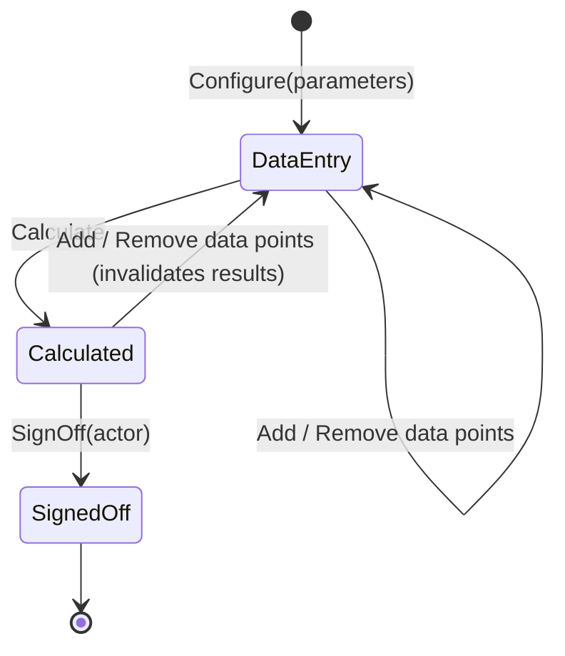
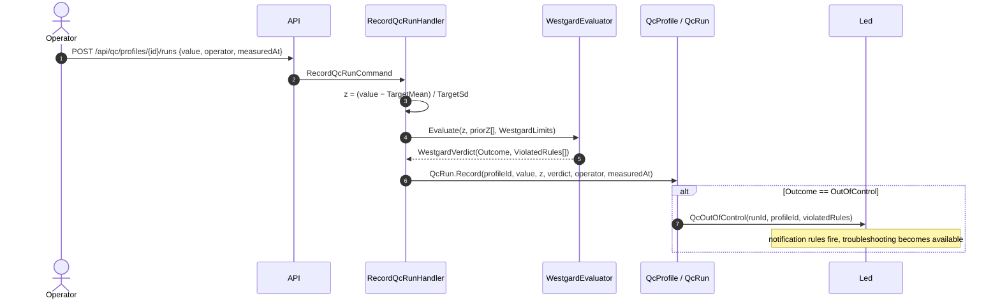
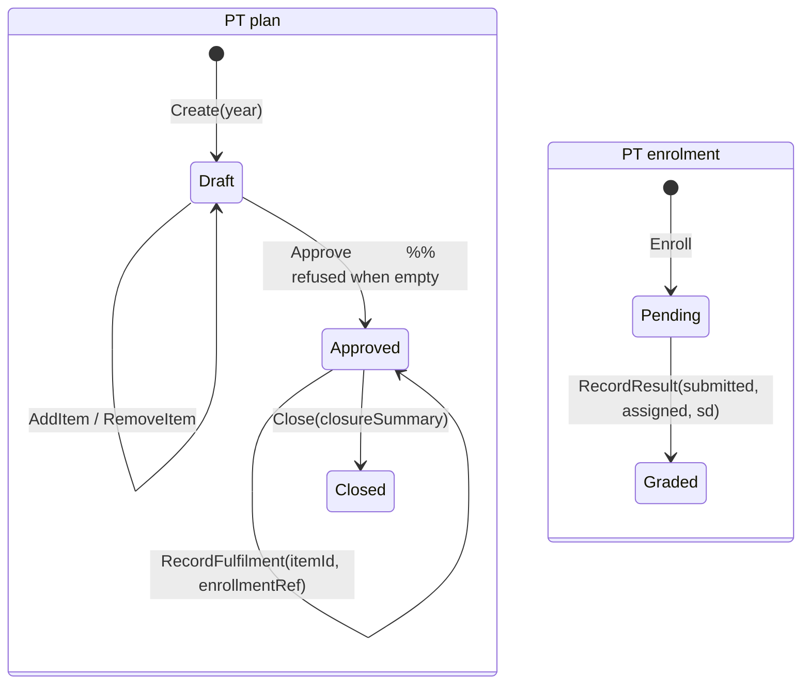

# NT.QMS — Production Software Requirements Specification
## Document 02 · Part 3 — Functional Specification: Analytical Quality & Proficiency Testing

> Part 3 of 4. [Part 1](02-1-Functional-Specification-Quality-and-Improvement.md) ·
> [Part 2](02-2-Functional-Specification-Resources-People-Governance.md) ·
> [Part 4](02-4-Functional-Specification-Operations-and-Platform.md) ·
> [Conventions](00-SRS-Index-and-Conventions.md)

This part specifies the analytical-quality subsystem: statistical quality control, twelve study types,
measurement-uncertainty budgeting, and proficiency testing. **The calculation specifications here are
normative** — they are the algorithms as implemented, stated precisely enough to reimplement.

---

# 3.0 The common study pattern

Twelve of the modules in this part are **studies** and share one structure. Specifying it once avoids
repeating it twelve times.

## Shared lifecycle — `WF-13`



## Shared rules (apply to all twelve unless a module overrides)

| ID | Rule |
|---|---|
| **BR-AQ-01** | A study is created in `DataEntry` by a `Configure` factory that fixes its acceptance parameters. |
| **BR-AQ-02** | Data points may be added and removed only while the study is **editable** (`DataEntry` or `Calculated`). |
| **BR-AQ-03** | `Calculate` requires the module's minimum data and writes the derived statistics, moving the study to `Calculated`. |
| **BR-AQ-04** | **Only a `Calculated` study can be signed off** (`{PREFIX}-01x`). |
| **BR-AQ-05** | **A signed-off study is immutable** at the domain level (`{PREFIX}-01x`) **and at the database level** — `qams.reject_frozen_mutation()` is a `BEFORE UPDATE/DELETE` trigger on all twelve study roots. |
| **BR-AQ-06** | Sign-off is a segregation-of-duties gate: `EnsureSignerIsNotPreparer(signer, "SOD-AQ-001")`. |
| **BR-AQ-07** | Sign-off records `SignedOffBy` and `SignedOffAtUtc` and raises a module-specific signed-off domain event. |
| **BR-AQ-08** | **Removing a data point is an HTTP `DELETE`** and therefore requires the `X-Change-Reason` header — every void of analytical evidence carries a recorded justification. |
| **BR-AQ-09** | Adding or removing a point on a `Calculated` study returns it to `DataEntry`, invalidating the results. **`[Assumption]`** — inferred from `RequireEditable()` permitting both states; confirm the exact state reset per module. |
| **BR-AQ-10** | Study references (`StudyRef`, `ScreeningRef`, `AssessmentRef`, `BudgetRef`) are generated server-side by `IReferenceNumberGenerator` from a per-tenant sequence and a module prefix. |
| **BR-AQ-11** | Analyte ≤ 200 chars and required; unit ≤ 50; percentage acceptance criteria are `> 0` and (for most) `≤ 50`. |
| **BR-AQ-12** | All twelve studies share **one** permission module, `analytical-quality`, with all eight actions. |

## Shared API shape

| Verb | Route | Purpose |
|---|---|---|
| `GET` | `/api/{studies}` | list (filter `state`) |
| `GET` | `/api/{studies}/{id}` | detail with computed results |
| `POST` | `/api/{studies}` | configure (`analytical-quality.create`) |
| `POST` | `/api/{studies}/{id}/{points}` | add a data point |
| `DELETE` | `/api/{studies}/{id}/{points}/{pointId}` | remove a data point (**`X-Change-Reason` required**) |
| `POST` | `/api/{studies}/{id}/calculate` | run the calculation |
| `POST` | `/api/{studies}/{id}/sign-off` | sign off (`analytical-quality.sign`) |

Two studies additionally accept bulk import: `POST /api/method-comparisons/{id}/pairs/import` and
`POST /api/precision-studies/{id}/measurements/import` (CSV).

---

# M-25 · Statistical quality control — Westgard (`AQ.QC`)

## Purpose
Maintains QC profiles (analyte × instrument × control lot with a target mean and SD), records daily QC
runs, grades each run against the Westgard multi-rule set, and captures troubleshooting for
out-of-control runs.

## Business goal
ISO/IEC 17025 §7.7 / ISO 15189 — monitor the validity of results using internal quality control, and
act on out-of-control conditions before releasing results.

## Actors
`analytical-quality.manage` (create profile, update targets); any authorised user (record run, log
troubleshooting).

## Inputs
Profile: `analyte` (≤100), `instrument` (≤100), `controlLot`, `targetMean`, `targetSd` (> 0).
Target change: `targetMean`, `targetSd`, **`reason` (≤500, required)**, `effectiveFrom`.
Run: `value`, `operator`, `measuredAt`. Troubleshooting: `note` (≤2000).

## Outputs
`QcProfile`; `QcRun` rows carrying the **frozen** `ZScore`, `Outcome` and `ViolatedRules`; event
`QcOutOfControl`.

## Dependencies
`WestgardLimits` configuration, `NC` (an out-of-control run is an NC source), `NTF`.

## Workflow — `WF-14`


## Calculation specification — Westgard multi-rule

`z = (value − TargetMean) / TargetSd`, evaluated against `WestgardLimits`
(`WarningSd` default **2**, `RejectSd` default **3**, `RangeSd` default **4**, `RunLength` default
**10**). Rule labels are **derived from the configured limits**, so the default output is byte-identical
to the canonical labels.

| Rule | Condition | Outcome | Label emitted |
|---|---|---|---|
| **1-3s** | `abs(z) > RejectSd` | Reject | `1-3s` |
| **2-2s** | this value **and the immediately prior one** both exceed the **same** `±WarningSd` limit (same sign) | Reject | `2-2s` |
| **R-4s** | `abs(z − priorZ) > RangeSd` **and** the pair lies on opposite sides | Reject | `R-4s` |
| **10-x** | `RunLength` consecutive values all on the same side of the mean | Reject | `10-x` |
| **1-2s** | `abs(z) > WarningSd`, **only when no rejection rule fired** | Warning | `1-2s` |
| *(none)* | otherwise | InControl | — |

`WestgardLimits.Validated()` refuses a configuration where any limit is ≤ 0, where
`WarningSd >= RejectSd`, or where `RunLength < 2` — the application will not start.

## Business rules
| ID | Rule | Code |
|---|---|---|
| **BR-QC-01** | **The verdict is computed at entry time and frozen on the run.** Later runs change the window statistics but never re-grade a past verdict — a released result stands on the QC judgement in force when it was made. | `WestgardVerdict` doc comment |
| **BR-QC-02** | **A QC target change requires a reason.** | `QC-012` |
| **BR-QC-03** | **Target changes are forward-only** — the effective date cannot precede the current one. | `QC-013` |
| **BR-QC-04** | Target changes stamp `TargetEffectiveFromUtc` and `LastTargetChangeReason`; the full history lives in the field-change ledger. | `UpdateTargets` |
| **BR-QC-05** | **Troubleshooting notes apply only to out-of-control runs.** | `QC-010` |
| **BR-QC-06** | A troubleshooting note is required when logged. | `QC-011` |
| **BR-QC-07** | Target SD must be positive (a zero SD makes z undefined). | `QC-002` |
| **BR-QC-08** | An out-of-control run raises `QcOutOfControl` carrying the violated-rule list. | `QcProfile.cs` |

## Validation rules
`Analyte` required ≤100; `Instrument` required ≤100; `TargetSd` > 0; `Reason` required ≤500;
`Note` required ≤2000.

## Error cases
`QC-001` · `QC-002` · `QC-010` · `QC-011` · `QC-012` · `QC-013` · `QC-404`.

## Edge cases
- `GET /api/qc/profiles/{id}/runs?take=60` defaults to the **last 60 runs** — the Levey-Jennings chart
  window. Older runs are not returned unless `take` is raised.
- The prior-z window used for the 2-2s / R-4s / 10-x rules is drawn from the profile's run history; a
  back-dated `measuredAt` does **not** re-order the evaluation window. **`[Assumption]`** — the window
  is built from persisted order, so out-of-order entry can mis-evaluate the multi-rules.
- Deactivating a profile (`QcProfile.Deactivate`) exists on the aggregate but has **no endpoint** —
  see Limitations.

## Configuration
`AnalyticalQuality:Westgard:WarningSd | RejectSd | RangeSd | RunLength` — see
[Document 04 CFG-08…11](04-Configuration-Reference.md).

## Performance
Run history is bounded by `take`; the multi-rule evaluation is O(RunLength).

## Security
Profile creation and target changes require `analytical-quality.manage`.

## Limitations
| ID | Limitation |
|---|---|
| LIM-QC-01 | **`QcProfile.Deactivate()` is unreachable** — no command, no endpoint. A profile cannot be retired. **`[Dead / Unused]`** |
| LIM-QC-02 | No control-level concept (L1/L2/L3): a level is modelled by creating separate profiles. The previous SRS's level selector is **not built** as a first-class field. |
| LIM-QC-03 | No cumulative/moving statistics (no rolling mean/SD recalculation, no peer-group comparison). |
| LIM-QC-04 | Westgard limits are **global to the deployment**, not per profile or per tenant. |
| LIM-QC-05 | No result-release interlock: an out-of-control run does not block anything downstream. |

## Future improvements
Per-profile Westgard limit overrides; profile deactivation endpoint; control-level field; rolling
statistics with target re-derivation proposals.

## Acceptance criteria
- **AT-FR-QC-01** — A value at z = 3.5 yields `OutOfControl` with `["1-3s"]`.
- **AT-FR-QC-02** — Two consecutive values at z = +2.3 yield `OutOfControl` with `["2-2s"]`.
- **AT-FR-QC-03** — A single value at z = 2.3 with an in-control predecessor yields `Warning` `["1-2s"]`.
- **AT-FR-QC-04** — Changing targets without a reason returns 422 `QC-012`; with an earlier effective
  date, 422 `QC-013`.

---

# M-26 · Analytical studies (twelve types)

All twelve follow §3.0. Each subsection gives the module's **parameters, minimum data, calculation and
verdict**.

---

## 26.1 · Method validation study (`MV`) — `/api/validation-studies`

**Parameters:** `analyte` (≤100), `protocol` (≤30, a CLSI protocol name), `totalAllowableError` (TEa, > 0).
**Data:** replicates of `level` (Low/Mid/High), `measured`, optional `reference`.
**Minimum:** 2 replicates.
**States:** `ProtocolConfigured → DataEntered → StatsCalculated → SignedOff` (this module has its own
four-state enum rather than the shared three).

**Calculation:**
```
mean      = average(measured)                       ; refuse if mean == 0  (MV-014)
variance  = Σ(m − mean)² / (n − 1)
sd        = √variance
CV%       = round( sd / |mean| × 100 , 3 )
MeanBias% = round( average( (measured − reference)/reference × 100 ) , 3 )   ; only replicates with reference > 0
TotalError = |MeanBias%| + 1.65 × CV%                ; one-sided 95 %
Passed     = TotalError ≤ TotalAllowableError
```

**Rules:** statistics must be calculated before sign-off (`MV-015`); a signed-off study is immutable
(`MV-010`); a replicate level is required (`MV-011`).
**Errors:** `MV-001`, `MV-002`, `MV-010`…`MV-015`, `MV-404`.
**Limitation:** the "CLSI protocol" is a free-text label ≤30 chars — **no protocol-specific logic runs**.
The previous SRS's four protocol cards (EP05/EP09/EP06/EP17) map to *separate modules* in this system
(precision, method comparison, linearity, detection limit), not to a protocol switch here.

---

## 26.2 · Precision study (`PR`) — `/api/precision-studies`

**Parameters:** `analyte`, `unit`, `level` (≤100), optional `claimedRepeatabilityCvPct`,
`claimedWithinLabCvPct` (positive when given).
**Data:** measurements of `runLabel` + `value`; replicates are grouped by run label.
**Minimum:** ≥ **2 runs** (`PR-010`), each with ≥ **2 replicates** (`PR-011`).

**Calculation — one-way ANOVA (CLSI EP05 style):**
```
k   = number of runs ; n = total measurements ; grand = mean(all)
SSwithin  = Σ_runs Σ_i (x_i − runMean)²          dfWithin  = n − k
SSbetween = Σ_runs len(run) × (runMean − grand)²  dfBetween = k − 1
MSwithin  = SSwithin / dfWithin                  ; repeatability variance
MSbetween = SSbetween / dfBetween
n₀        = ( n − Σ len(run)² / n ) / dfBetween  ; = common replicate count when balanced
betweenVar = max( 0 , (MSbetween − MSwithin) / n₀ )

RepeatabilitySd = √MSwithin
BetweenRunSd    = √betweenVar
WithinLabSd     = √( MSwithin + betweenVar )
each CV%        = sd / grand × 100
MeetsRepeatabilityClaim = RepeatabilityCvPct ≤ claimedRepeatabilityCvPct   (null when no claim)
MeetsWithinLabClaim     = WithinLabCvPct     ≤ claimedWithinLabCvPct       (null when no claim)
```
**Note:** `betweenVar` is floored at zero — a negative between-run variance estimate (possible when
`MSbetween < MSwithin`) is reported as zero, not as a negative variance.

**Errors:** `PR-001`, `PR-002`, `PR-003` (run label required), `PR-010`…`PR-013`, `PR-404`.
**Import:** `POST /{id}/measurements/import` accepts a CSV batch.

---

## 26.3 · Method comparison study (`MC`) — `/api/method-comparisons`

**Parameters:** `analyte`, `unit`, `referenceMethod` (X, ≤200), `testMethod` (Y, ≤200).
**Data:** measurement pairs (`referenceValue`, `testValue`, optional `sampleId`); values must be
positive (`MC-003`).
**Minimum:** 2 pairs (`MC-010`); **40 pairs is the documented recommendation**
(`RecommendedMinimumPairs = 40`, CLSI EP09) but is **not enforced**.

**Calculation:**
```
Pearson r = Sxy / √(Sxx · Syy)                     ; refuse if Sxx == 0 or Syy == 0 (MC-011)

Deming regression, λ = 1 (ordinary Deming):
  slope     = ( Syy − λ·Sxx + √( (Syy − λ·Sxx)² + 4·λ·Sxy² ) ) / (2·Sxy)
  intercept = meanY − slope · meanX

Passing–Bablok: non-parametric median-of-pairwise-slopes fit
  (slope, intercept) = PassingBablok(x, y)

Bland–Altman agreement on d_i = y_i − x_i :
  MeanBias              = mean(d)
  BiasSd                = sample SD of d
  LimitOfAgreementLower = MeanBias − 1.96 · BiasSd      [Assumption: standard ±1.96 SD]
  LimitOfAgreementUpper = MeanBias + 1.96 · BiasSd
```

**Errors:** `MC-001`…`MC-003`, `MC-010`…`MC-013`, `MC-404`.
**Import:** `POST /{id}/pairs/import` (CSV).
**Limitation:** there is **no acceptance verdict** — the study reports statistics but does not grade
pass/fail against a criterion. Interpretation is the signer's judgement.

---

## 26.4 · Linearity study (`LIN`) — `/api/linearity-studies`

**Parameters:** `analyte`, `unit`, `method` (≤300), `allowableDeviationPct` (> 0, ≤ 50).
**Data:** measurements of `assignedValue` (must be positive, `LIN-003`) and `measuredValue`.
**Minimum:** **4 distinct levels** (`MinimumLevels = 4`; the message notes EP06 recommends 5–9).

**Calculation:**
```
Levels are grouped by assigned value; x = assigned, y = mean(measured) per level.
slope     = Sxy / Sxx                     ; refuse if Sxx == 0 (LIN-011)
intercept = meanY − slope·meanX
r         = Sxy / √(Sxx·Syy)              ; 1 when Syy == 0
Per-level deviation is assessed against allowableDeviationPct.
IsLinear  = every level passes.

Verified AMR (analytical measuring range):
  When the full range fails, sub-ranges are REFITTED on their own levels
  (EP06 range-restriction practice) — because a nonlinear extreme also distorts
  the full-range fit. AmrLow/AmrHigh = the passing contiguous window with the
  MOST levels; ties broken by the wider span.
```

**Errors:** `LIN-001`…`LIN-003`, `LIN-010`…`LIN-013`, `LIN-404`.

---

## 26.5 · Detection limit study (`DL`) — `/api/detection-limit-studies`

**Parameters:** `analyte`, `unit`, `method` (≤300), `loqCvTargetPct` (> 0, ≤ 50).
**Data:** measurements of kind `Blank` (no assigned value — `DL-004`) or `LowLevel` (positive assigned
concentration required — `DL-003`).
**Minimum:** **10 blank replicates** and **10 low-level replicates**; every low-level sample needs ≥ 2
replicates so a within-sample SD can be pooled (`DL-012`).

**Calculation (CLSI EP17):** with `Z = 1.645` (one-sided 95 %)
```
BlankMean = mean(blanks)
BlankSd   = sample SD(blanks)
LoB       = BlankMean + Z · BlankSd

Pooled low-level SD: for each assigned-value group with ≥ 2 replicates,
  SSwithin += Σ(v − groupMean)² ; dfWithin += n − 1
  PooledLowSd = √( SSwithin / dfWithin )
LoD       = LoB + Z · PooledLowSd

LoQ (functional sensitivity) = the LOWEST assigned level that meets the CV goal
            (loqCvTargetPct) at or above the LoD; null when no level qualifies.
```
All results rounded to 4 decimals.

**Errors:** `DL-001`…`DL-004`, `DL-010`…`DL-014`, `DL-404`.

---

## 26.6 · Reference interval study (`RI`) — `/api/reference-interval-studies`

**Parameters:** `analyte`, `unit`, `population` (≤150), `source` (≤300 — required "for traceability"),
`claimedLower`, `claimedUpper` (upper must exceed lower, `RI-003`).
**Data:** reference samples (`value`, optional `subjectRef`).
**Minimum:** **20 samples** (`RecommendedSampleCount = 20`, CLSI EP28-A3c).

**Calculation — verification of a claimed interval:**
```
outside = count( value < ClaimedLower OR value > ClaimedUpper )
allowed = floor( sampleCount × AllowedOutsideFraction )      ; AllowedOutsideFraction = 0.10
Verdict = outside ≤ allowed ? Verified : Rejected
```
This is **verification of a transferred interval**, not de-novo interval derivation — the system never
computes percentiles to establish a new interval.

**Errors:** `RI-001`…`RI-003`, `RI-010`…`RI-012`, `RI-404`.

---

## 26.7 · Carryover study (`CAR`) — `/api/carryover-studies`

**Parameters:** `analyte`, `unit`, `allowableCarryoverPct` (> 0, ≤ 50).
**Data:** readings of kind `High` or `Low`, each with a `sequence`.
**Minimum:** ≥ 1 high reading, ≥ 3 low readings ("first low + steady state").

**Calculation:**
```
meanHigh  = mean(High readings)
firstLow  = the Low reading with the LOWEST sequence
steadyLow = mean(remaining Low readings, ordered by sequence)
refuse if meanHigh == steadyLow                                  (CAR-012)
Carryover% = (firstLow − steadyLow) / (meanHigh − steadyLow) × 100
Passes     = |Carryover%| ≤ allowableCarryoverPct
```

**Errors:** `CAR-001`, `CAR-002`, `CAR-010`…`CAR-014`, `CAR-404`.

---

## 26.8 · Interference study (`INT`) — `/api/interference-studies`

**Parameters:** `analyte`, `unit`, `allowableBiasPct` (> 0, ≤ 100 — note the wider bound than the other
modules).
**Data:** control readings (`AddControl(value)`) and test readings (`AddTest(interferent, value)` — the
interferent name is required, `INT-003`).
**Minimum:** **3 control replicates**; ≥ 1 interferent test set.

**Calculation:**
```
controlMean = mean(controls)     ; refuse if zero (INT-012)
Tests are grouped by interferent.
InterferentCount = number of distinct interferents
For each interferent: bias% vs controlMean; SignificantInterference when |bias%| > allowableBiasPct
SignificantCount = count of interferents with significant interference
```

**Errors:** `INT-001`…`INT-003`, `INT-010`…`INT-014`, `INT-404`.

---

## 26.9 · Lot comparison study (`LOT`) — `/api/lot-comparisons`

**Parameters:** `analyte`, `unit`, `currentLot` (≤60), `newLot` (≤60), `allowableBiasPct` (> 0, ≤ 50).
**Data:** paired samples (`currentLotValue`, `newLotValue`, optional `sampleId`); values must be
positive (`LOT-004`).
**Minimum:** **3 pairs**.

**Calculation:**
```
meanCurrent = mean(currentLotValue)   ; refuse if zero (LOT-011)
meanNew     = mean(newLotValue)
MeanBias%   = (meanNew − meanCurrent) / meanCurrent × 100
Passes      = |MeanBias%| ≤ allowableBiasPct
```

**Errors:** `LOT-001`…`LOT-004`, `LOT-010`…`LOT-013`, `LOT-404`.

---

## 26.10 · Instrument comparability study (`ICP`) — `/api/instrument-comparabilities`

**Parameters:** `analyte`, `unit`, `referenceInstrument` (≤100), `allowableBiasPct` (> 0, ≤ 50).
**Data:** readings of `instrument`, `sampleId`, `value` (both identifiers required, `ICP-004`).

**Calculation:**
```
Reference readings are indexed by sampleId (case-insensitive instrument matching).
refuse if the reference instrument has no readings          (ICP-010)
refuse if there is no non-reference instrument              (ICP-011)
refuse if ANY instrument shares no sample with the reference (ICP-012)
Per non-reference instrument: paired bias% against the reference on shared samples;
  Comparable = |bias%| ≤ allowableBiasPct
InstrumentCount    = number of non-reference instruments
NonComparableCount = how many failed
```

**Errors:** `ICP-001`…`ICP-004`, `ICP-010`…`ICP-014`, `ICP-404`.

---

## 26.11 · Outlier screening (`OUT`) — `/api/outlier-screenings`

**Parameters:** `dataset` (≤200), `unit`. *(No acceptance criterion — this is a diagnostic.)*
**Data:** points of `value` and optional `label`.
**Minimum:** **4 points**.

**Calculation:**
```
mean, sample SD, median
Q1 = quantile(0.25) ; Q3 = quantile(0.75) ; IQR = Q3 − Q1
TukeyLower = Q1 − 1.5 · IQR
TukeyUpper = Q3 + 1.5 · IQR
MAD        = median( |v − median| )
OutlierCount = count of points flagged by IsOutlier(value, mean, sd, median, mad, q1, q3, iqr)
```
The flagging function combines the z-score, the **robust MAD-based** score and the Tukey fence — a
multi-criteria screen rather than a single test. **`[Assumption]`** — the exact combination logic lives
in the private `IsOutlier` helper; the reported `TukeyLower/Upper` bounds and `OutlierCount` are the
contractual outputs.

**Errors:** `OUT-001`, `OUT-010`…`OUT-012`, `OUT-404`.

---

## 26.12 · Sigma metric assessment (`SIG`) — `/api/sigma-assessments`

**Parameters:** `analyte`, `unit`, `allowableTotalErrorPct` (> 0), `biasPct`, `cvPct` (> 0 — "sigma is
undefined at zero imprecision", `SIG-003`).
**States:** `Draft → SignedOff` (a two-state variant — there is no separate `Calculated`; the sigma is
computed on every `SetInputs`).
**Endpoints:** `PUT /api/sigma-assessments/{id}` updates the inputs; `POST /{id}/sign-off`.

**Calculation:**
```
numerator  = AllowableTotalErrorPct − |BiasPct|
SigmaValue = numerator ≤ 0 ? 0 : round( numerator / CvPct , 2 )
```

**Grade table (decision table):**

| Sigma | Grade | QC recommendation emitted |
|---|---|---|
| ≥ 6 | `WorldClass` | 1:3s, N=2, R=1 — a single rule with minimal QC (world-class capability). |
| ≥ 5 | `Excellent` | 1:3s / 2:2s / R:4s, N=2, R=1 — a short multirule. |
| ≥ 4 | `Good` | 1:3s / 2:2s / R:4s / 4:1s, N=4, R=1 — full multirule. |
| ≥ 3 | `Marginal` | 1:3s / 2:2s / R:4s / 4:1s / 8:x, N=6 — maximum multirule QC. |
| < 3 | `Unacceptable` | *(see `QcRecommendation` for the sub-3 text)* |

> The recommended QC rule sets in this table reference rules (`4:1s`, `8:x`) that the **Westgard
> evaluator does not implement**. The recommendation is advisory text, not an executable configuration.

**Rules:** a signed-off assessment is immutable (`SIG-010`); already signed off (`SIG-011`).
**Errors:** `SIG-001`…`SIG-003`, `SIG-010`, `SIG-011`, `SIG-404`.
> **Prefix collision:** `SIG-001/002/003` are used **both** for sigma-assessment validation **and** for
> e-signature failures (incorrect PIN, incorrect password, locked account). Two entirely different
> meanings share three codes. See [Document 14](14-Technical-Debt-Report.md).

---

## 26.13 · Measurement uncertainty budget (`MU`) — `/api/uncertainty-budgets`

**Purpose:** builds a GUM-style uncertainty budget from Type A and Type B components and expands it.
**Parameters:** `analyte` (≤200), `method` (≤300), `unit`, `level` (≤100), `coverageFactor` k
(**1–4**, "k=2 ≈ 95 %"), optional `targetExpandedUncertainty` (positive when set).
**Data:** components of `name` (≤300), `type` (`TypeA | TypeB`), `relativeStandardUncertainty` (≥ 0),
optional `source` (≤500).
**States:** `Draft → Calculated → Approved` (uses **`Approve`**, not `SignOff`).
**Minimum:** ≥ 1 component (`MU-007`).

**Calculation (root-sum-square):**
```
u_c = √( Σ u_i² )                     over all components' relative standard uncertainties
U   = k · u_c                          rounded to 4 decimals
MeetsTarget = TargetExpandedUncertainty is set ? (U ≤ target) : null
```

**Rules:** only a calculated budget can be approved (`MU-010`); **an approved budget is immutable —
"create a successor budget to revise"** (`MU-011`), enforced by the database trigger as well.
**Errors:** `MU-001`…`MU-007`, `MU-010`, `MU-011`, `MU-404`.
**Limitation:** components are **relative** standard uncertainties only; there is no sensitivity
coefficient, no distribution/divisor helper (rectangular ÷√3, triangular ÷√6), and no absolute-value
input. The analyst must pre-convert every contribution to a relative standard uncertainty by hand.

---

# M-27 · Proficiency testing & PT plans (`PT`)

## Purpose
Two related capabilities: an **annual PT plan** (which schemes and analytes will be enrolled, how many
cycles, and whether they were fulfilled) and **PT enrolments** with z-score performance grading.

## Business goal
ISO/IEC 17025 §7.7.2 — participate in interlaboratory comparison or proficiency testing where
available and appropriate; monitor performance and act on unsatisfactory results.

## Actors
`proficiency-testing.create` (create plan, add lines, enrol); `.approve` (approve plan);
`.void`/`.edit` (close plan, record fulfilment, record results).

## Inputs
**Plan:** `year`; lines of `scheme` (≤200), `analyte` (≤200), `provider` (≤200), `plannedCycles`
(**1–52**), `notes` (≤1000); closure `closureSummary` (≤4000).
**Enrolment:** `ptRef`, `scheme`, `analyte`, `cycle`; result: `submitted`, `assigned`,
`standardDeviation` (> 0).

## Outputs
`PtPlan` (Draft/Approved/Closed) with `PtPlanItem` lines carrying `PlannedCycles`, `FulfilledCycles`
and `LastEnrollmentRef`; `PtEnrollment` with `ZScore` and `Performance`; event `PtUnsatisfactory`;
automatically raised NC.

## Dependencies
`NC` (`PtToNcPolicy`), `NTF`, `RPT` (the `PtUnsatisfactory` KPI).

## Workflow — `WF-15`


## Calculation specification — z-score
```
z = (submitted − assigned) / standardDeviation      ; sd must be > 0 (PT-011)
ZScore = round(z, 3)
absZ = |z|
Performance = absZ ≥ 3 ? Unsatisfactory
            : absZ > 2 ? Questionable
            :            Satisfactory
```
`QuestionableThreshold = 2`, `UnsatisfactoryThreshold = 3` — **hard-coded constants**, matching
ISO 13528 convention.

> Note the asymmetry: `absZ == 2` grades **Satisfactory** (strict `>` for Questionable) while
> `absZ == 3` grades **Unsatisfactory** (inclusive `≥`). This is deliberate but easy to misread.

## Business rules
| ID | Rule | Code |
|---|---|---|
| **BR-PT-01** | **An unsatisfactory PT result (|z| ≥ 3) automatically raises a nonconformance** with `sourceType = ProficiencyTest`. | `PtUnsatisfactory` → `PtToNcPolicy` |
| **BR-PT-02** | **A PT result may be recorded once** — a second attempt is refused. | `PT-010` |
| **BR-PT-03** | **One PT plan per tenant per year.** | `PTP-020` |
| **BR-PT-04** | **An empty plan cannot be approved** — at least one scheme/analyte line is required. | `PTP-011` |
| **BR-PT-05** | **An approved plan is frozen**: lines cannot be edited; only fulfilment is recorded. | `PTP-015` |
| **BR-PT-06** | Fulfilment can only be recorded against an **approved** plan. | `PTP-012` |
| **BR-PT-07** | **A pending enrolment is not fulfilment** — an enrolment with no result cannot be counted. | `PTP-021` |
| **BR-PT-08** | Closing a plan requires a closure summary covering **coverage and gaps**. | `PTP-014` |
| **BR-PT-09** | Planned cycles per line: 1–52. | validator |

## Validation rules
`Scheme` required ≤200; `Analyte` required ≤200; `Provider` ≤200; `PlannedCycles` 1–52;
`Notes` ≤1000; `ClosureSummary` required ≤4000.

## Error cases
`PT-001`, `PT-010`, `PT-011`, `PT-404` · `PTP-001`…`PTP-003`, `PTP-010`…`PTP-015`, `PTP-020`,
`PTP-021`, `PTP-404`.

## Edge cases
- A `Questionable` result (2 < |z| < 3) raises **no** event and no NC — it is recorded and visible but
  triggers nothing. **`[Needs Business Confirmation]`** — many laboratories require investigation of
  questionable results too.
- `FulfilledCycles` can exceed `PlannedCycles`; nothing caps it.
- The PT plan register screen has **no proportion meter** (fulfilled/planned is available per line but
  is not surfaced as a page-level statistic).
- `PtEnrollment` is not linked to a plan line by foreign key — fulfilment is recorded by writing the
  enrolment **reference string** onto the line (`LastEnrollmentRef`).

## Configuration
None. The z-score thresholds are hard-coded constants (`CON-`, [Document 04](04-Configuration-Reference.md)).

## Performance
`GET /api/pt-plans` and `/api/proficiency-tests` unpaged.

## Security
Plan approval `proficiency-testing.approve`; the module shares `FullRecordLifecycle` actions.

## Limitations
| ID | Limitation |
|---|---|
| LIM-PT-01 | Only z-score grading. No z′, no zeta score, no En number — so **calibration ILCs (which conventionally use En) cannot be graded correctly**. |
| LIM-PT-02 | Questionable results trigger nothing. |
| LIM-PT-03 | No PT provider register or scheme catalogue (both are free text). |
| LIM-PT-04 | No trend analysis across cycles for the same scheme/analyte. |
| LIM-PT-05 | The plan-to-enrolment link is a string reference, not a relation. |

## Future improvements
En-number and zeta-score grading for calibration comparisons; questionable-result investigation
trigger; multi-cycle trending; provider/scheme reference data.

## Acceptance criteria
- **AT-FR-PT-01** — submitted 12, assigned 10, sd 1 → z = 2.0 → `Satisfactory` (boundary).
- **AT-FR-PT-02** — submitted 13, assigned 10, sd 1 → z = 3.0 → `Unsatisfactory`, raises an NC.
- **AT-FR-PT-03** — Recording a result twice returns 409 `PT-010`.
- **AT-FR-PT-04** — Approving a plan with no lines returns 422 `PTP-011`; a second plan for the same
  year returns 422 `PTP-020`.
