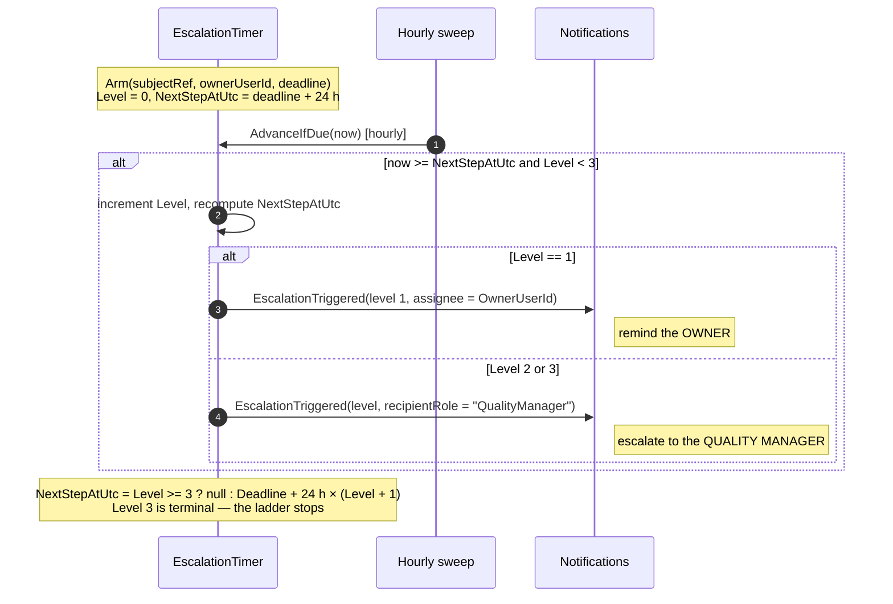
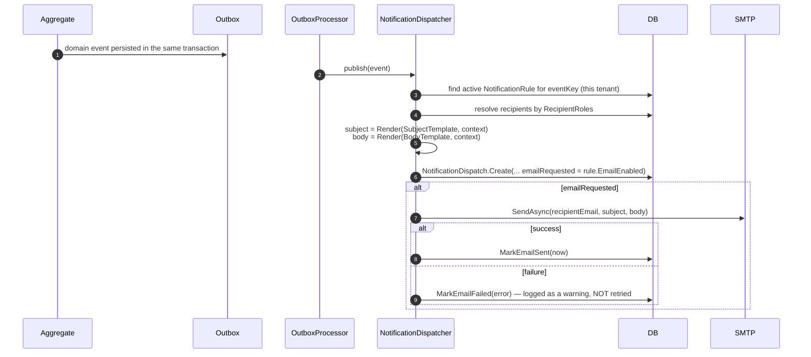
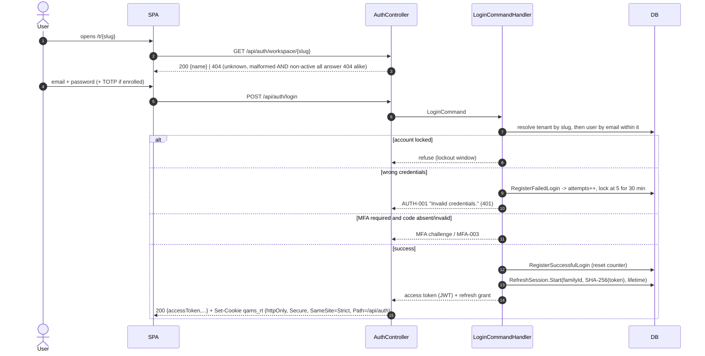
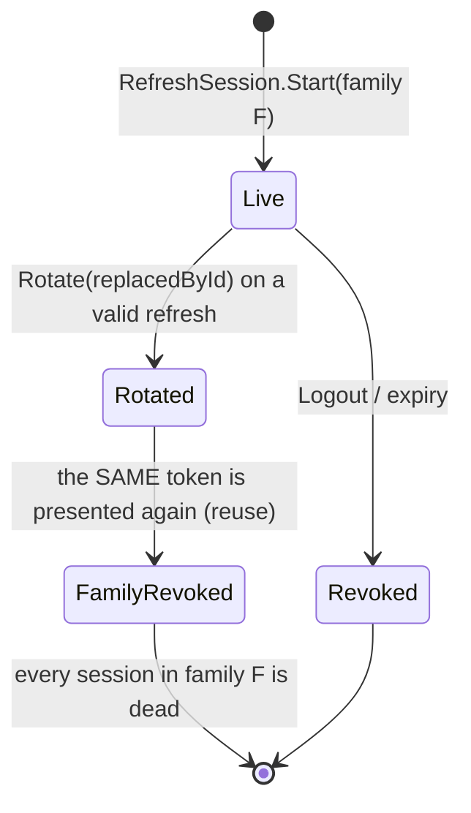

# NT.QMS — Production Software Requirements Specification
## Document 02 · Part 4 — Functional Specification: Operations, Administration, Platform & Cross-Cutting

> Part 4 of 4. [Part 1](02-1-Functional-Specification-Quality-and-Improvement.md) ·
> [Part 2](02-2-Functional-Specification-Resources-People-Governance.md) ·
> [Part 3](02-3-Functional-Specification-Analytical-Quality.md) ·
> [Conventions](00-SRS-Index-and-Conventions.md)

---

# M-28 · Tasks, SLA definitions & escalation (`TASK`)

## Purpose
A personal work queue (`WorkTask`), a per-module/severity SLA target table (`SlaDefinition`), and an
automatic three-level escalation ladder (`EscalationTimer`) that chases overdue work.

## Business goal
ISO/IEC 17025 §8.7.1 — corrective actions must be taken *in a timely manner*; the escalation ladder
makes lateness visible to progressively senior people.

## Actors
`tasks.create` (create a task); the assignee (complete); `tasks.manage` (define SLA targets);
**System** (escalation ladder advancement in the hourly sweep).

## Inputs
Task: `subject`, optional `subjectRef`, **either** `assigneeUserId` **or** `assigneeRole`, `dueDate`.
SLA: `module`, `severity`, `targetHours` (> 0).

## Outputs
`WorkTask` (Pending/Completed); `SlaDefinition` upserts; `EscalationTimer` records; event
`EscalationTriggered`; `GET /api/reports/sla-compliance`.

## Dependencies
Every module that creates work; `NTF` (the `SLA_ESCALATED` notification key); the hourly sweep.

## Escalation specification — `WF-16`



### The escalation timing table (extracted from code)

| Level | Fires at | Recipient |
|---:|---|---|
| 1 | `Deadline + 24 h` | the **owner** (`OwnerUserId`) |
| 2 | `Deadline + 48 h` | role **`QualityManager`** |
| 3 | `Deadline + 72 h` | role **`QualityManager`** |
| — | `Level >= 3` → `NextStepAtUtc = null` | ladder terminates; no further escalation |

`EscalationTimer.EscalationRole = "QualityManager"` is a **hard-coded string constant**, not
configuration and not a `Roles.*` reference. The previous SRS's "+48 h to Dept Head" is **not what the
code does** — level 2 goes to the Quality Manager, not a department head.

Because the sweep runs hourly, escalation fires within one hour of each threshold, not at the instant.

## Business rules
| ID | Rule | Code |
|---|---|---|
| **BR-TASK-01** | **A task must be assigned to a user or a role** — an unassigned task is refused. | `TASK-002` |
| **BR-TASK-02** | Completion is one-way and one-time. | `TASK-003` |
| **BR-TASK-03** | SLA target hours must be positive. | `SLA-002` |
| **BR-TASK-04** | `GET /api/tasks/mine` returns the caller's tasks — by user id **and** by their role. **`[Assumption]`** |
| **BR-TASK-05** | The escalation ladder has exactly three levels and then stops. | `AdvanceIfDue` |
| **BR-TASK-06** | `Cancel()` deactivates a timer (used when the underlying work completes). |

## Validation rules
`Module` required; `Severity` required; `TargetHours` > 0; subject required (domain).

## Error cases
`TASK-001` · `TASK-002` · `TASK-003` · `TASK-404` · `SLA-001` · `SLA-002`.

## Edge cases
- **`SlaDefinition` and `EscalationTimer` are not wired together in the domain.** The SLA table stores
  target hours per module/severity; the timer takes an absolute `deadline`. Nothing in the aggregates
  derives the timer's deadline from the SLA table. **`[Needs Business Confirmation]`** — verify where
  (if anywhere) timers are armed from SLA targets.
- Management-review decisions and CAPA action due dates do **not** create `WorkTask` rows.
- There is no task-list-for-others view; only "mine".
- Level 3 is terminal — permanently overdue work eventually stops being escalated.

## Configuration
None. The 24/48/72-hour ladder and the `QualityManager` recipient are compiled-in.

## Performance
`GET /api/tasks/mine` and `/api/notifications/mine` are paged.

## Security
`tasks.create` / `tasks.manage`.

## Limitations
Escalation ladder timings and recipient role are not configurable; SLA targets are stored but their
enforcement path is unclear; no team/queue views; no task reassignment.

## Future improvements
Derive timer deadlines from `SlaDefinition`; configurable ladder; make decisions and CAPA actions
first-class tasks; team queues.

## Acceptance criteria
- **AT-FR-TASK-01** — A task with neither `assigneeUserId` nor `assigneeRole` returns 422 `TASK-002`.
- **AT-FR-TASK-02** — A timer armed with deadline `T` fires level 1 at ≥ `T+24 h`, level 2 at ≥ `T+48 h`
  to `QualityManager`, level 3 at ≥ `T+72 h`, then never again.

---

# M-29 · Notifications (`NTF`)

## Purpose
Turns domain events into in-app notifications and (optionally) e-mails, driven by tenant-configurable
rules that map an event key to recipient roles and message templates.

## Business goal
Make quality events actionable: the responsible role learns about the event without having to poll a
register.

## Actors
Any authenticated user (read own notifications, mark read); `notifications.manage` (rules, dispatch
monitor).

## Inputs
Rule: `eventKey` (≤50), `recipientRoles` (comma-separated, ≥1), `emailEnabled`,
`subjectTemplate` (≤400), `bodyTemplate` (≤4000).

## Outputs
`NotificationRule`; `NotificationDispatch` rows (Queued/Sent/Failed) with `ReadByRecipient`;
`GET /api/notifications/mine`, `/monitor`.

## Dependencies
Outbox (events arrive asynchronously), `USER` (recipient resolution by role), `IEmailSender`,
`Smtp:Host` configuration.

## The event-key catalogue (extracted from `NotificationPolicies`)

| Event key | Raised by |
|---|---|
| `NC_RAISED` | a nonconformance is raised (from any source) |
| `DOC_PUBLISHED` | a controlled document version is published |
| `DOC_REVIEW_DUE` | the sweep reaches a document's `NextReviewDue` |
| `EQUIP_CALIB_DUE` | the sweep reaches an equipment item's `NextCalibrationDue` |
| `EQUIP_LOCKED_OUT` | the sweep exhausts an equipment item's grace period |
| `STD_EXPIRED` | a reference standard's certificate expires |
| `COMP_EXPIRED` | a competency authorisation lapses |
| `SUP_SUSPENDED` | a supplier is suspended (manually or by certificate expiry) |
| `RISK_HIGH_RESIDUAL` | a residual assessment yields a high residual RPN |
| `COI_HIGH` | a conflict of interest is assessed as `High` |
| `SLA_ESCALATED` | an escalation timer advances a level |

**Eleven event keys.** Any other domain event has no notification path.

## Dispatch specification — `WF-17`


**Template rendering** is literal token substitution: every `{key}` in the subject or body is replaced
with the context value, case-insensitively (`Render` → `result.Replace("{" + key + "}", value,
OrdinalIgnoreCase)`). There is no expression language, no formatting, no conditionals, and **an unknown
token is left in the output verbatim**.

## Business rules
| ID | Rule | Code |
|---|---|---|
| **BR-NTF-01** | A rule needs an event key, at least one recipient role and a subject template. | `NTF-001`, `NTF-002`, `NTF-003`, `NTF-004` |
| **BR-NTF-02** | Rules are **per tenant** — each laboratory configures its own routing and wording. | `NotificationRule : ITenantScoped` |
| **BR-NTF-03** | An in-app dispatch row is always created; the e-mail is an **additional** channel controlled by `EmailEnabled`. | `NotificationDispatch.Create` |
| **BR-NTF-04** | **A failed e-mail is recorded on the dispatch row (status `Failed` + error text) and logged as a warning. It is never retried.** The in-app notification still exists. | `NotificationDispatcher` |
| **BR-NTF-05** | With `Smtp:Host` unset the system binds `LoggingEmailSender`: e-mails are written to the log and marked `Sent`. **There is no operator warning that mail is not actually leaving the system.** | `DependencyInjection.cs:104-111` |
| **BR-NTF-06** | Deactivating a rule stops future dispatches; existing ones are untouched. | `NotificationRule.Deactivate` |

## Validation rules
`EventKey` required ≤50; `SubjectTemplate` required ≤400; `BodyTemplate` required ≤4000.

## Error cases
`NTF-001` · `NTF-002` · `NTF-003` · `NTF-004` · `NTF-404`.

## Edge cases
- **No e-mail retry.** A transient SMTP outage silently loses the e-mail channel for those events; only
  the dispatch monitor reveals it.
- **No digest/batching** — one event, one dispatch per recipient. A sensor oscillating around an
  environmental limit will e-mail every recipient on every reading (see M-13 edge cases).
- Recipient resolution is by **role name string** stored on the rule, matched against users' roles.
  A typo in a role name silently results in zero recipients.
- `RecipientEmail` may be null (in-app only).

## Configuration
`Smtp:Host` (and the rest of the SMTP block) — see [Document 04](04-Configuration-Reference.md).

## Performance
`GET /api/notifications/mine` and `/monitor` are paged.

## Security
Rules and the dispatch monitor require `notifications.manage`; the monitor exposes recipient e-mail
addresses and message bodies to administrators.

## Limitations
| ID | Limitation |
|---|---|
| LIM-NTF-01 | 11 event keys only; most domain events have no notification path. |
| LIM-NTF-02 | No e-mail retry, no dead-letter, no digest, no throttling/anti-spam. |
| LIM-NTF-03 | Silent degradation to log-only e-mail when SMTP is unconfigured. |
| LIM-NTF-04 | No user-level notification preferences (opt-out, channel choice). |
| LIM-NTF-05 | No push, SMS or webhook channels. |

## Future improvements
Retry with backoff on the e-mail leg (reuse the outbox pattern); digesting and per-user preferences; a
startup warning when `Smtp:Host` is unset outside Development; expand the event-key catalogue.

## Acceptance criteria
- **AT-FR-NTF-01** — A rule for `NC_RAISED` targeting `QualityManager` produces one dispatch per active
  QM when an NC is raised.
- **AT-FR-NTF-02** — With SMTP unreachable, the dispatch row shows `Failed` with the error and the
  in-app notification is still readable.

---

# M-30 · Reporting & KPIs (`RPT`)

## Purpose
Dashboard KPIs with real population denominators, a 90-day KPI history series, an NC Pareto analysis
and SLA-compliance reporting; plus a 6-hourly KPI snapshot job that materialises the series.

## Business goal
ISO/IEC 17025 §8.9.2 — management review inputs; ISO 9001 §9.1 — monitoring, measurement, analysis and
evaluation.

## Actors
Any authenticated tenant user (`reports` module is `View, Export` only); **System** (snapshot job).

## Inputs
`GET /api/reports/kpi-history?days=90` (default 90).

## Outputs
| Endpoint | Returns |
|---|---|
| `GET /api/reports/kpis` | current KPI counts **plus `DashboardKpiTotalsDto`** — 11 real population counts used as denominators |
| `GET /api/reports/kpi-history?days=` | the `KpiSnapshot` series |
| `GET /api/reports/nc-pareto` | NC counts grouped for Pareto analysis |
| `GET /api/reports/sla-compliance` | SLA attainment |

### The eight snapshotted KPIs (`KpiSnapshot`)
`OpenNcs`, `OverdueCapaActions`, `OpenComplaints`, `AuditsInProgress`, `EquipmentOutOfService`,
`HighResidualRisks`, `OverdueTasks`, `PtUnsatisfactory`.

## Dependencies
Every operational module (as the source of counts); the KPI snapshot hosted service.

## Snapshot job specification
| Property | Value |
|---|---|
| Interval | **6 hours** |
| Start-up delay | 20 seconds |
| Concurrency | advisory-lock leader election (`AdvisoryLockKeys.KpiSnapshot`) — exactly one instance snapshots per round |
| Tenant scope | **all `Active` tenants**, iterated under an explicit RLS **elevation** |
| Granularity | one row per tenant per **date**; an existing row for today is updated, not duplicated |
| Liveness | records `qams.job.last_success_timestamp_seconds{job="kpi-snapshot"}` |

## Business rules
| ID | Rule | Code |
|---|---|---|
| **BR-RPT-01** | KPI tiles show a proportion **only where a real denominator exists.** The dashboard gained 11 genuine population counts rather than inventing denominators. | `DashboardKpiTotalsDto` |
| **BR-RPT-02** | **No KPI may exceed its population.** Pinned by `DashboardKpiTotalsTests`. | test |
| **BR-RPT-03** | The proportion meter is opt-in per page (`ratioFromFirst`): **24 of 28 registers** use it; `org-context`, `pt-plan`, `feedback` and `authorization-matrix` deliberately have none. | `qams-list-stats` |
| **BR-RPT-04** | The statistic-tile component **refuses to meter** non-numeric values, zero wholes, or parts greater than the whole. | `qams-list-stats` |
| **BR-RPT-05** | The dashboard renders the **same shared component** as the registers, so the two cannot drift. | `qams-list-stats` |
| **BR-RPT-06** | Snapshots are date-keyed per tenant and upserted — re-running the job the same day refreshes rather than duplicates. | `SnapshotAsync` |

## Validation rules
`days` bounded only by the caller. **`[Assumption]`**

## Error cases
No module-specific error codes; failures surface as generic problem+json.

## Edge cases
- The snapshot job runs every 6 hours but writes **one row per day** — the last run of the day wins, so
  the series is an end-of-period-ish sample, not a daily average.
- A tenant provisioned mid-day gets its first snapshot on the next tick.
- `nc-pareto` and `sla-compliance` are computed live, not snapshotted.

## Configuration
None. The 6-hour interval and 20-second start delay are compiled-in.

## Performance
KPI queries are aggregate counts across the tenant's operational tables. No measurement exists for the
dashboard call. **`[Not Executed]`**

## Security
The `reports` permission module is `View, Export` only — reporting can never mutate.

## Limitations
No custom report builder; no export of the KPI series; no drill-down from a KPI to its constituent
records beyond the dashboard tile's link; no configurable KPI definitions.

## Future improvements
CSV/XLSX export of the KPI history; configurable dashboard tiles per role; drill-through.

## Acceptance criteria
- **AT-FR-RPT-01** — Every KPI value is ≤ its stated population.
- **AT-FR-RPT-02** — Two snapshot runs on the same day leave exactly one row for that tenant/date.

---

# M-31 · Organisation reference data (`ORG`)

## Purpose
The tenant's structural reference data: **branches**, **departments** (under a branch), the **test
catalogue**, and **lists of values** (localisable code lists).

## Business goal
Provide the allocation dimensions (branch/department) that scope records and users, and the controlled
vocabularies the rest of the system selects from.

## Actors
`organization.create` (create branch/department/test), `.edit` (upsert LOV), `.manage` (deactivate);
all authenticated users may read.

## Inputs
Branch: `code` (≤20), `name` (≤200), `city`. Department: `branchId`, `code`, `name`.
Test: `testCode`, `testName`, `methodology`, `turnaroundHours` (≥1).
LOV: `category` (≤50), `code` (≤50), `nameEn` (≤200) plus other-language names, `sortOrder`.

## Outputs
`Branch`, `Department`, `TestCatalogItem`, `LovEntry` (with a `LocalizedText` name).
`GET /api/branches` returns an **org tree**; `GET /api/departments?branchId=` filters.

## Dependencies
Everything `IAllocatable`; `AUTHZ` (test catalogue); the LOV backfill at start-up.

## Business rules
| ID | Rule | Code |
|---|---|---|
| **BR-ORG-01** | Branch code is unique per tenant. | `ORG-010` |
| **BR-ORG-02** | Department code is unique **within its branch**. | `ORG-012` |
| **BR-ORG-03** | A department must belong to a branch, and that branch must exist and be active. | `ORG-003`, `ORG-011` |
| **BR-ORG-04** | Test code is unique per tenant. | `ORG-013` |
| **BR-ORG-05** | Turnaround time must be at least one hour. | `ORG-007` |
| **BR-ORG-06** | A LOV entry is keyed by `(category, code)` and carries a localised name plus a sort order. | `LovEntry` |
| **BR-ORG-07** | Reference data is **deactivated, never deleted**. | `Deactivate()` on all four |
| **BR-ORG-08** | The `department → branch` foreign key is `RESTRICT` — a branch with departments cannot be removed at the database level. | schema |
| **BR-ORG-09** | A starter LOV catalogue is seeded at first start-up (`DefaultLovCatalog`) and backfilled idempotently for existing tenants. | `StartupSeeding` |

## Validation rules
Branch `Code` required ≤20, `Name` required ≤200; LOV `Category` required ≤50, `Code` required ≤50,
`NameEn` required ≤200.

## Error cases
`ORG-001`…`ORG-008`, `ORG-010`…`ORG-013`, `ORG-404`.

## Edge cases
- Deactivating a branch does **not** cascade to its departments, nor to users scoped to it.
  **`[Needs Business Confirmation]`**
- Records already allocated to a deactivated branch/department remain allocated.
- The LOV backfill runs as part of start-up seeding, which **defers** (with 15-second retries) when the
  database is unreachable at boot (OPS-010).

## Configuration
None.

## Performance
Small volumes; all reads unpaged.

## Security
Reads open to authenticated tenant users (they populate pickers); mutations per the permission set.

## Limitations
No multi-level org hierarchy (exactly two levels: branch → department); LOV categories are not
themselves managed (a category is created implicitly by writing an entry); no import/export of
reference data.

## Future improvements
Deeper org hierarchy; LOV category registry with validation of which categories the UI expects;
reference-data import.

## Acceptance criteria
- **AT-FR-ORG-01** — A duplicate branch code returns 422 `ORG-010`.
- **AT-FR-ORG-02** — Creating a department under an inactive branch returns 422 `ORG-011`.

---

# M-32 · Tenant settings (`TEN`)

## Purpose
Per-tenant policy configuration. Currently one policy is exposed: whether MFA is required for
privileged roles.

## Actors
`TenantAdmin` (`tenant-settings.manage`).

## Inputs / outputs
`GET|PUT /api/tenant-settings/mfa-policy` ↔ `TenantSettings.RequireMfaForPrivilegedRoles`
(column `require_mfa_privileged`, default **false**).

## Business rules
| ID | Rule |
|---|---|
| **BR-TEN-01** | MFA for privileged roles is **per tenant and default off**. |
| **BR-TEN-02** | Platform administrators are not tenant members, so they fall back to the **global** `Security:RequireMfaForPrivilegedRoles` configuration key (default false). |
| **BR-TEN-03** | Turning the policy on issues an enrolment-scoped token (`scope=mfa_enrollment`) to a privileged user who has not enrolled; that session can reach **only** the two MFA-enrolment endpoints. |

## Edge cases
- The `TenantSettings` value object holds more than this one flag structurally, but **only the MFA
  policy is exposed through the API**. Other settings are not administrable. **`[Assumption]`**
- All tenants in the development dataset have the policy **off**.

## Limitations
A single exposed setting; no per-tenant branding, retention, locale default, or password-policy
override.

## Future improvements
Expose tenant default language, password-policy overrides, retention defaults and branding.

## Acceptance criteria
- **AT-FR-TEN-01** — Enabling the policy forces a privileged non-enrolled user's next session into
  enrolment scope and 403 `MFA-ENROLL-REQUIRED` on any other endpoint.

---

# M-33 · Platform control plane (`PLT`)

## Purpose
Cross-tenant administration: provision a new laboratory tenant with its first administrator, and list
tenants.

## Actors
**`PlatformAdmin` only.** A platform administrator is not a member of any tenant and is redirected away
from tenant modules by `platformOnlyGuard`.

## Inputs
`identifier` (the slug), `name`, `adminEmail`, `adminDisplayName`, `adminPassword` (strong).

## Outputs
`Tenant` (Provisioning → Active), its first `TenantAdmin` user, seeded roles and reference data;
event `TenantProvisioned`; `201 Created`.

## Business rules
| ID | Rule | Code |
|---|---|---|
| **BR-PLT-01** | The tenant slug must be **2–N characters of lower-case letters, digits and single hyphens, starting and ending with a letter or digit.** | `TENANT-002` |
| **BR-PLT-02** | The slug is unique across the platform. | `TENANT-005` |
| **BR-PLT-03** | The first administrator's password must satisfy the shared strong-password rules. | `PasswordRules.StrongPassword()` |
| **BR-PLT-04** | Provisioning runs under an explicit **RLS elevation** — it is one of only five trusted cross-tenant code paths. | `ICurrentTenantSetter.Elevate()` |
| **BR-PLT-05** | Tenant lifecycle: `Provisioning → Active → Suspended → Active`, and `Terminated` (terminal). Only an active tenant can be suspended; only a suspended one reactivated. | `TENANT-010`, `TENANT-012`, `TENANT-013` |
| **BR-PLT-06** | Suspension requires a reason. | `TENANT-011` |

## Error cases
`TENANT-001`…`TENANT-005`, `TENANT-010`…`TENANT-013`, `TENANT-404`.
Plus `TENANT-000` ("A tenant context is required.") — thrown **41 times** across the codebase as the
universal guard whenever a tenant-scoped operation finds no resolved tenant.

## Edge cases
- **Tenant suspension, reactivation and termination exist in the domain but have no HTTP endpoint.**
  The only platform routes are `POST /api/tenants` and `GET /api/tenants`. Lifecycle management is
  therefore database-only today. **`[Dead / Unused]`** at the API layer.
- Provisioning is not idempotent beyond the slug-uniqueness check.
- There is no tenant de-provisioning or data export.

## Limitations
No tenant suspend/terminate API; no usage metering; no tenant-level backup/export; no self-service
sign-up.

## Future improvements
Expose the tenant lifecycle endpoints; per-tenant data export for offboarding.

## Acceptance criteria
- **AT-FR-PLT-01** — Slug `Demo_Lab` returns 422 `TENANT-002`; `demo-lab` succeeds; a duplicate returns
  422 `TENANT-005`.
- **AT-FR-PLT-02** — A tenant user calling `/api/tenants` is refused; a platform admin succeeds.

---

# M-34 · Authentication & session (`AUTH`)

## Purpose
Sign-in against a tenant, optional TOTP second factor, short-lived access tokens, rotating refresh
sessions with reuse detection, self-service password change, e-signature PIN management, and the
caller's own effective privileges.

## Business goal
21 CFR Part 11 §11.10(d) and §11.300; ADR-0009 session-security model.

## Actors
Anonymous (workspace lookup, login, refresh, logout, change-password); authenticated (MFA enrol/confirm,
PIN, privileges, language).

## Endpoints
| Route | Auth | Notes |
|---|---|---|
| `GET /api/auth/workspace/{slug}` | anonymous | returns the laboratory **name only** |
| `POST /api/auth/login` | anonymous | `{tenantIdentifier, email, password, mfaCode?}` |
| `POST /api/auth/refresh` | anonymous | cookie **is** the credential; own rate-limit policy |
| `POST /api/auth/logout` | anonymous | revokes the family, clears the cookie |
| `POST /api/auth/change-password` | **anonymous by design** | so an *expired* password can still be changed; the handler verifies full credentials |
| `POST /api/auth/mfa/enroll` · `/mfa/confirm` | authenticated | the only two routes an enrolment-scoped session may reach |
| `POST /api/auth/signature-pin` | authenticated | sets the 4-digit e-signature PIN |
| `GET /api/auth/me/privileges` | authenticated | permission keys, working scope, language |
| `PUT /api/auth/me/language` | authenticated | own interface language |

The whole controller carries the strict `auth` rate-limit policy (10/min per client address); refresh
overrides it with 60/min.

## Sign-in specification — `WF-02`


## Refresh & reuse detection — `WF-03`


## Business rules
| ID | Rule | Code |
|---|---|---|
| **BR-AUTH-01** | **Access tokens live only in SPA memory** (ADR-0009). Default lifetime 15 minutes per the ADR; **the shipped configuration is `Jwt:ExpiryMinutes = 120`** — a documented drift. |
| **BR-AUTH-02** | The refresh token is a rotating **httpOnly, Secure, SameSite=Strict** cookie named `qams_rt`, path-scoped to `/api/auth` so it rides no other request. |
| **BR-AUTH-03** | Refresh tokens are stored **SHA-256-hashed only**; the plaintext exists only in the cookie. | `RefreshSession.TokenHash` |
| **BR-AUTH-04** | **Presenting an already-rotated refresh token revokes the entire family.** | reuse detection |
| **BR-AUTH-05** | Refresh session lifetime = `Auth:RefreshTokenDays`, default **14 days**, validated positive at start-up. |
| **BR-AUTH-06** | **5 failed attempts lock the account for 30 minutes.** The same counter is incremented by failed e-signature attempts. | `UserAccount.MaxFailedAttempts = 5`, `LockoutMinutes = 30` |
| **BR-AUTH-07** | The tenant is resolved **only from the validated JWT's `tenant_id` claim** — never from a header or query string. | `TenantResolutionMiddleware` |
| **BR-AUTH-08** | The JWT keeps claim names verbatim (`sub`, `name`, `tenant_id`); inbound claim remapping is disabled. Reading only `NameIdentifier` was the v1.0 production bug. | `MapInboundClaims = false` |
| **BR-AUTH-09** | Clock skew tolerance is **1 minute**. |
| **BR-AUTH-10** | The workspace lookup answers **404 identically** for unknown, malformed and non-active slugs, so tenant existence cannot be probed. |
| **BR-AUTH-11** | MFA is **TOTP RFC 6238**, works with any authenticator app, enrolment returns the secret plus an `otpauth://` URI. |
| **BR-AUTH-12** | The e-signature PIN is exactly **4 digits** (`^[0-9]{4}$`). |
| **BR-AUTH-13** | Client-side idle timeout is **30 minutes** (`auth.service`), independent of token lifetime. |
| **BR-AUTH-14** | `GET /api/auth/me/privileges` is the SPA's authorisation source for showing/hiding UI; **the server re-enforces independently on every request.** |

## Error cases
`AUTH-000` (refresh-session invariants) · `AUTH-001` invalid credentials · `AUTH-003` authenticated user
required (thrown **51 times** — the universal actor guard) · `AUTH-006` session no longer valid ·
`AUTH-007` permissions changed · `AUTH-008` session revoked · `AUTH-009` session expired · `AUTH-102`
password reuse · `MFA-001`…`MFA-003` · `PIN-001` · `MFA-ENROLL-REQUIRED` (403) · `CHANGE-REASON-REQUIRED`
(400) · `CONCURRENCY-409`.

## Edge cases
- `change-password` is anonymous: it accepts tenant + e-mail + current password + new password. This is
  deliberate (an expired password must still be changeable) and is protected by the strict auth rate
  limit, but it is also an **unauthenticated credential-verification oracle** — see
  [Document 09](09-Security-Specification.md).
- Live refresh over plain HTTP on localhost fails because the `Secure` flag blocks the cookie jar; the
  functional tests are the proof of the flow.
- `logout` is anonymous and idempotent — presenting no cookie still returns 204.

## Configuration
`Jwt:Issuer | Audience | Secret | ExpiryMinutes`, `Auth:RefreshTokenDays`,
`Security:RequireMfaForPrivilegedRoles`, `RateLimit:AuthPermitPerMinute | RefreshPermitPerMinute`.

## Performance
Login measured at **p95 69.6 ms** on the development box.

## Security
See [Document 09](09-Security-Specification.md) in full.

## Limitations
No SSO/SAML/OIDC; no WebAuthn; no self-service password reset; no "remember this device"; no
administrative session listing.

## Future improvements
OIDC federation; WebAuthn as a second factor; self-service reset; administrative session inventory
backed by `qams.refresh_session`.

## Acceptance criteria
- **AT-FR-AUTH-01** — 5 wrong passwords lock the account; the 6th attempt with the *correct* password
  still fails for 30 minutes.
- **AT-FR-AUTH-02** — Replaying a rotated refresh token kills the whole family.
- **AT-FR-AUTH-03** — `GET /api/auth/workspace/{unknown}` and `{malformed}` both return 404 with an
  identical body.

---

# M-35 · File storage & evidence (`FILE`)

## Purpose
Accepts evidence uploads, validates them by extension **and** content signature, stores them
content-addressed, and serves them back by id.

## Actors
Any authenticated tenant user.

## Endpoints
`POST /api/files` (multipart, returns `201` + `FileUploadedDto`); `GET /api/files/{id}`.

## Storage specification
```
{FileStorage:RootPath}/{tenantId:N}/{sha256}
default root = {AppContext.BaseDirectory}/data/files
```
Upload streams to `{tenantDir}/.upload-{guid:N}.tmp` while hashing with SHA-256, then **moves** into
place. If the final path already exists the temp file is deleted — identical content deduplicates
naturally. On any failure the temp file is removed.

## Allow-list and content sniffing (`FileContentPolicy`)
Inspects the **first 512 bytes**.

| Extension | Stored canonical content type | Signature checked |
|---|---|---|
| `.pdf` | `application/pdf` | `25 50 44 46` |
| `.png` | `image/png` | `89 50 4E 47` |
| `.jpg`, `.jpeg` | `image/jpeg` | `FF D8 FF` |
| `.docx` | `…wordprocessingml.document` | ZIP `50 4B 03 04` |
| `.xlsx` | `…spreadsheetml.sheet` | ZIP `50 4B 03 04` |
| `.doc` | `application/msword` | OLE `D0 CF 11 E0 A1 B1 1A E1` |
| `.xls` | `application/vnd.ms-excel` | OLE |
| `.csv` | `text/csv` | *(text)* rejected if any NUL byte in the window |
| `.txt` | `text/plain` | *(text)* rejected if any NUL byte in the window |

## Business rules
| ID | Rule | Code |
|---|---|---|
| **BR-FILE-01** | A file is accepted only when its extension is on the allow-list **and** its leading bytes match that type's signature. A renamed executable fails the sniff. | `FileContentPolicy.Inspect` |
| **BR-FILE-02** | **The client's `Content-Type` is never trusted or stored** — the canonical type for the extension is stored, so a file can never replay with an attacker-chosen media type. | same |
| **BR-FILE-03** | Storage is content-addressed by SHA-256: identical content lands on the same path (deduplication), and a crash never leaves a partial object at a final key. | `LocalFileStorage.SaveAsync` |
| **BR-FILE-04** | Files are partitioned **per tenant directory**. |
| **BR-FILE-05** | An empty file is refused. | `FILE-002` |
| **BR-FILE-06** | A missing stored object raises `FileNotFoundException`. |

## Error cases
`FILE-001` file name required · `FILE-002` file is empty · `FILE-404` uploaded/certificate/snapshot
file not found · allow-list refusal (400 with the allowed extension list) · signature-mismatch refusal.

## Edge cases
- **There is no maximum upload size enforced in application code.** Only the host's request-body limit
  applies (Kestrel/IIS default). **`[Needs Business Confirmation]`** — see
  [Document 14](14-Technical-Debt-Report.md).
- **Deduplication is cross-record but tenant-scoped**: two records in the same tenant referencing
  identical content share one blob. Deleting one `FileReference` would orphan or break the other —
  **there is no reference counting and no delete path**, so today this is latent rather than active.
- **Files are never deleted.** No retention, no cleanup, no orphan collection.
- `GET /api/files/{id}` serves the stored canonical content type; there is no inline/attachment
  disposition control, no watermarking, no access-scoped signed URL.
- **`[Assumption]`** — authorisation on download is "authenticated tenant user"; the file's tenant is
  enforced by the `FileReference` row's RLS, so cross-tenant download is blocked by tenancy rather than
  by a per-record permission check.

## Configuration
`FileStorage:RootPath` (CFG-20).

## Security
See [Document 09 §9.9](09-Security-Specification.md). The default root is **inside the deployment
directory** and would be lost on a clean redeploy — a real operational risk (A-07).

## Limitations
No size limit; no virus scanning; no retention/cleanup; no reference counting; no object-store adapter
in use (the interface is ready for S3/MinIO but only the local adapter is registered).

## Future improvements
Explicit max-size configuration; AV scanning hook; an S3/MinIO adapter; reference counting before any
future delete path; signed time-limited download URLs.

## Acceptance criteria
- **AT-FR-FILE-01** — An `.exe` renamed to `.pdf` is refused with a signature-mismatch message.
- **AT-FR-FILE-02** — Uploading identical content twice yields the same storage key and one blob.
- **AT-FR-FILE-03** — A `.csv` containing a NUL byte in the first 512 bytes is refused.

---

# M-36 · Exports (`CLD.Export`)

## Purpose
Produces inspection-ready record sets.

| Endpoint | Format | Permission | Contents |
|---|---|---|---|
| `GET /api/exports/nonconformances.xlsx` | XLSX | *(NC register read)* | the NC register |
| `GET /api/exports/audit-trail.xlsx?take=1000` | XLSX | `compliance.export` | audit trail + field changes **+ a live Integrity Attestation sheet** (the `VerifyChainQuery` result) **+ the reason-for-change column** |
| `GET /api/exports/signatures.xlsx?take=1000` | XLSX | `compliance.export` | the electronic-signature manifest |
| `GET /api/exports/review-pack/{reviewId}.pdf` | PDF | `reviews.export` | management-review pack: the review, dashboard KPIs and the NC Pareto |

## Business rules
| ID | Rule |
|---|---|
| **BR-EXP-01** | **Every export writes a `RECORD_EXPORTED` security event** — who exported what, when. |
| **BR-EXP-02** | The audit-trail export carries a **live integrity attestation** computed at export time, so the exported copy states whether the chain verified. |
| **BR-EXP-03** | XLSX is the only tabular export format. A parallel CSV endpoint set was built and then **deliberately reverted** — do not reintroduce one. |
| **BR-EXP-04** | Exports default to `take = 1000` rows. |

## Edge cases
- `take` is caller-controlled and unbounded upward — a large export is a potential resource concern
  with no guard. **`[Needs Business Confirmation]`**
- The review pack is generated from current state, not the state at review closure.

## Limitations
Four exports only; no scheduled/emailed exports; no full-database inspection export.

## Acceptance criteria
- **AT-FR-EXP-01** — Each export produces a valid PK-zip (XLSX) or PDF and writes one
  `RECORD_EXPORTED` security event.

---

# M-37 · Cross-cutting request pipeline

Not a user-facing module, but a set of behaviours every request passes through. Specified here because
a rebuild must reproduce it exactly. Full detail in
[Document 11](11-Architecture-Constraints.md) and [Document 08](08-API-Specification.md).

## HTTP middleware order (from `Program.cs`)
```
UseForwardedHeaders
  → ObservabilityMiddleware        (correlation id, canonical completion log)
  → SecurityHeadersMiddleware      (CSP, nosniff, DENY, no-referrer, HSTS)
  → UseExceptionHandler            (DomainExceptionHandler → problem+json)
  → [Development only] MapOpenApi
  → UseAuthentication
  → UseRateLimiter                 (after auth so the e-sign policy can key on the actor)
  → TenantResolutionMiddleware     (tenant_id claim → ICurrentTenantSetter)
  → ActiveSessionMiddleware        (DB re-check + privilege resolution)
  → MfaEnrollmentGateMiddleware    (enrolment-scoped sessions confined)
  → ChangeReasonMiddleware         (DELETE requires X-Change-Reason)
  → UseAuthorization
  → MapControllers
```

## MediatR pipeline order
`Tracing → Logging → Authorization → Idempotency → Validation → Handler`

| Behaviour | Effect |
|---|---|
| **Tracing** | opens an activity per request, joining the HTTP trace |
| **Logging** | structured request/response logging |
| **Authorization** | **deny-by-default**: a command with no policy attribute is refused with `AUTHZ-000`; an unknown permission key is `AUTHZ-008`; a disallowed role is `AUTHZ-002` |
| **Idempotency** | when an `Idempotency-Key` header is present, a replayed command returns the stored result instead of re-executing |
| **Validation** | FluentValidation; failures become 400 problem+json with per-field detail |

## EF Core interceptor order
```
TenantConnectionInterceptor   ← MUST be first: sets app.current_tenant / app.bypass_rls on connection open
AuditStampInterceptor         ← stamps CreatedByUserId / actor
TenantStampInterceptor        ← stamps TenantId on new tenant-scoped rows
FieldChangeInterceptor        ← writes the per-field ledger rows (+ the change reason)
OutboxInterceptor             ← writes domain events to the outbox in the same transaction
OrgScopeGuardInterceptor      ← enforces branch/department scope
```

**Ordering is load-bearing**: the tenant GUCs must be set before any query the other interceptors
trigger, or RLS will filter their own reads.

## Acceptance criteria
- **AT-FR-PIPE-01** — A command type with no policy attribute is refused at runtime with `AUTHZ-000`
  *and* fails `CommandPolicyTests` at build time.
- **AT-FR-PIPE-02** — Two identical POSTs with the same `Idempotency-Key` produce one effect and two
  identical responses.
- **AT-FR-PIPE-03** — Every error response, including framework 401/403, is `application/problem+json`
  carrying `traceId` and `correlationId`.

---

# M-38 · Quality analytics & Quality Health Score (`RPT.QA`)

> **Baseline note.** This module was **added to the working tree while this specification was being
> written** and is **uncommitted** at the time of analysis (`git status` shows the modified files
> below). It is specified here because it is present in the code; a reader comparing against a
> committed revision may not find it.
>
> Changed/added files: `Application/Reporting/QualityAnalyticsQuery.cs` (new, 552 lines) ·
> `Domain/Reporting/QualityHealthProfile.cs` (new) · `Domain/Authorization/PermissionCatalog.cs` ·
> `WebApi/Controllers/ReportsController.cs` · `Infrastructure/Persistence/{AppDbContext,
> Configurations/ReportingConfigurations, Migrations/AppDbContextModelSnapshot}.cs` ·
> `Application/Abstractions/IAppDbContext.cs` · `tests/…/ApiSurface.approved.txt` ·
> frontend `app.routes.ts`, `shell.component.ts`, `core/{models,i18n.service,nav-icons}.ts`,
> `core/api/reports-api.service.ts`, `features/dashboard/quality-analytics.{component,facade}.ts`.

## Purpose
Computes every quality-analytics section from live operational rows, and maintains a per-tenant
weighting profile for a composite **Quality Health Score**. It backs both the *Quality Statistics*
view and the ISO/IEC 17025 §8.9.2 *management-review* view — deliberately from **one** definition
rather than two parallel ones.

## Business goal
ISO/IEC 17025 §8.9.2 — management review inputs must be assembled from the operating record.
The score is a **governance figure**, so how it is computed is itself controlled information.

## Actors
`reports.view` (read the analytics and the profile); **`reports.manage`** (tune the weighting).

> `reports` previously carried the read-only action pair (`View, Export`). It now carries
> **`View, Export, Manage`** — the third action was added specifically because *"tuning the weighting
> is a privileged act distinct from reading the analytics."* This is why the permission-key total moved
> from 170 to **171**.

## Endpoints (3 new; 6 new routable paths)

| Verb | Route | Permission | Purpose |
|---|---|---|---|
| `GET` | `/api/reports/quality-analytics?branchId=&departmentId=` | `reports.view` | every section the caller may see, optionally narrowed |
| `GET` | `/api/reports/quality-health-profile` | `reports.view` | the tenant's score weighting |
| `PUT` | `/api/reports/quality-health-profile` | `reports.view` *(HTTP gate)* | change the weighting — **requires a reason** |

## Domain model

`QualityHealthProfile : AggregateRoot, ITenantScoped` — **one profile per tenant**, holding a
collection of `QualityHealthWeight(category, weight)`.

**Nine categories** (`QualityHealthCategory`): `DocumentControl`, `NonconformanceCapa`, `Complaints`,
`InternalAudit`, `Equipment`, `Competency`, `ProficiencyTesting`, `SupplierQuality`, `Risk`.

Each category maps to **one section of the report and one §8.9.2 management-review input**, so the
score and the review pack derive from the same components.

## Business rules

| ID | Rule | Code |
|---|---|---|
| **BR-QA-01** | **A section the caller cannot view is not computed and not returned.** Hiding it client-side would still ship the figures to the browser. | `GetQualityAnalyticsHandler` rule 1 |
| **BR-QA-02** | **An empty population yields `null`, never zero.** *"No documents yet"* and *"no documents current"* are different facts, and only one of them is a finding. | rule 2 |
| **BR-QA-03** | **A branch/department filter is applied only to records that carry that attribution.** Sections over unattributed records are returned **unnarrowed** and named in `QualityAnalyticsScopeDto.UnscopedSections`, so a filtered view never implies a precision it does not have. Currently unattributed: `documentControl`, `competency`, `proficiencyTesting`. | rule 3 |
| **BR-QA-04** | Weights are **relative, not percentages** — the score is a weighted mean over the categories that actually contributed, so weights need not sum to any total. | `QualityHealthWeight` |
| **BR-QA-05** | A weight of **zero excludes** the category from the score entirely. | same |
| **BR-QA-06** | A weight must be between 0 and `MaxWeight`. | `QHP-003` |
| **BR-QA-07** | **At least one category must carry a non-zero weight.** | `QHP-004` |
| **BR-QA-08** | **The profile holds only the weighting. The achieved score is computed from live rows at request time and is never stored** — a stored score would be a second source of truth that could silently diverge from the records it claims to summarise. | aggregate doc comment |
| **BR-QA-09** | **Every weighting change requires a reason** and raises `QualityHealthWeightsChanged(Changes[], Reason)`, so it lands in the tamper-evident audit trail. `Changes` holds one entry per category in the form `Category:old→new`. | `QHP-00x` |
| **BR-QA-10** | A change that alters nothing raises **no** event. | `if (changed.Count == 0) return;` |
| **BR-QA-11** | Review-due horizons are bucketed at **30 / 60 / 90 days** (`Near`/`Mid`/`Far`). | constants |
| **BR-QA-12** | `WeightFor(category)` returns **zero** when the profile predates that category — a new category is opt-in, never silently weighted. | `WeightFor` |

## Error cases
`QHP-001` … `QHP-004` (weight range, at-least-one-non-zero, and two further invariants at
`QualityHealthProfile.cs:104` and `:112`).

## Edge cases
- The `PUT` endpoint's HTTP gate is `reports.view`, while the *intent* recorded in the permission
  catalogue is that tuning requires `reports.manage`. **`[Needs Business Confirmation]`** — verify
  whether the `Manage` action is enforced by the command policy; the HTTP attribute alone reads as
  `View`.
- Sections listed in `UnscopedSections` are returned **unfiltered** even when a branch filter is
  supplied. A reader who misses that field will over-interpret the numbers.
- `null` is a meaningful value throughout this payload and must not be coerced to `0` by any client.

## Security
Section-level authorisation is applied **server-side, before computation** (BR-QA-01) — this is the
correct pattern and the only one in the system that gates *parts of a response* rather than the whole
endpoint.

## Limitations
No historical score series (the score is computed live, never snapshotted); no per-category drill-down
endpoint; the weighting is tenant-wide, not per branch.

## Acceptance criteria
- **AT-FR-QA-01** — A caller without `documents.view` receives a payload with **no** `documentControl`
  section at all (not an empty one).
- **AT-FR-QA-02** — A tenant with zero documents receives `null` for the document metrics, not `0`.
- **AT-FR-QA-03** — Filtering by branch returns `documentControl`, `competency` and
  `proficiencyTesting` **unnarrowed**, and names them in `UnscopedSections`.
- **AT-FR-QA-04** — Setting every weight to zero returns 422 `QHP-004`.
- **AT-FR-QA-05** — A weighting change with no actual difference raises no `QualityHealthWeightsChanged`.
