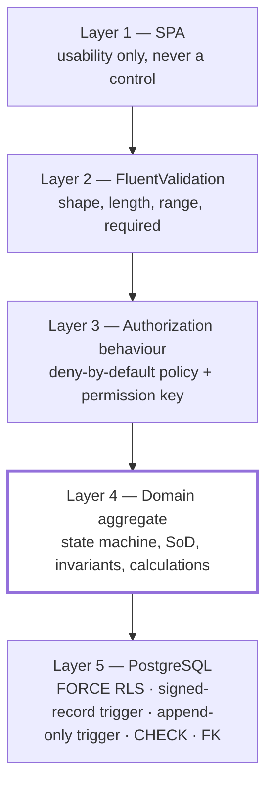

# NT.QMS — Production Software Requirements Specification
## Document 03 · Business Rules, Decision Tables & Error Catalogue

> [Conventions](00-SRS-Index-and-Conventions.md) · Module rules in context:
> [02-1](02-1-Functional-Specification-Quality-and-Improvement.md) ·
> [02-2](02-2-Functional-Specification-Resources-People-Governance.md) ·
> [02-3](02-3-Functional-Specification-Analytical-Quality.md) ·
> [02-4](02-4-Functional-Specification-Operations-and-Platform.md)

This document is the **cross-cutting** rule reference: rules that span modules, the decision tables
that encode them, and the complete catalogue of all **416 refusal codes**. Module-local rules are
specified in Document 02 and are not repeated here — they are cross-referenced.

---

# 3.1 Where business rules live (and why it matters)

NT.QMS enforces rules at **five distinct layers**. A rebuild that collapses them into one loses the
guarantees.



| Layer | What belongs here | What must **never** be only here |
|---|---|---|
| 1 · SPA | disabling a button, hiding a nav item | any rule with a compliance consequence |
| 2 · Validators | required, length, numeric range, regex | state transitions, SoD, cross-record rules |
| 3 · Pipeline | who may execute a command | what the command may do to a record |
| 4 · Domain | **all business invariants** | — |
| 5 · Database | isolation, immutability, referential integrity | rules a user should get a readable message for |

**Standing rule (`CLAUDE.md` §2.6):** *the domain protects itself* — invariants live inside the
aggregate, not in validators or handlers. A validator that duplicates a domain rule is acceptable (it
produces a nicer message); a rule that exists **only** in a validator is a defect.

---

# 3.2 Universal rules (apply system-wide)

| ID | Rule | Enforced by | Refusal |
|---|---|---|---|
| **BR-U-01** | Every request that mutates data must carry an authenticated actor. | `ICurrentUser` guard in handlers | `AUTH-003` (thrown at **51** sites) |
| **BR-U-02** | Every tenant-scoped operation must have a resolved tenant. | `CurrentTenant`, `TenantStampInterceptor` | `TENANT-000` (thrown at **41** sites) |
| **BR-U-03** | A command with **no** authorisation policy attribute is denied at runtime and fails the build gate. | `AuthorizationBehavior` + `CommandPolicyTests` | `AUTHZ-000` |
| **BR-U-04** | A command declaring a permission key not in `PermissionCatalog` is denied. | `AuthorizationBehavior` | `AUTHZ-008` |
| **BR-U-05** | **Every `DELETE` requires the `X-Change-Reason` header**, and the reason is stamped onto the ledger row in the same transaction. | `ChangeReasonMiddleware` + `FieldChangeInterceptor` | `CHANGE-REASON-REQUIRED` (400) |
| **BR-U-06** | Concurrent modification of the same row is detected and refused rather than silently overwritten. | `xmin` optimistic concurrency (ADR-0005) | `CONCURRENCY-409` (409) |
| **BR-U-07** | A repeated command carrying the same `Idempotency-Key` returns the stored result instead of re-executing. | `IdempotencyBehavior` | — |
| **BR-U-08** | Timestamps come from the injected `IClock`; `DateTime.Now` is forbidden. | standing rule + review | — |
| **BR-U-09** | Actor identity comes from the validated JWT `sub` claim; a client-supplied actor field is never trusted. | `AuditStampInterceptor`, `HttpCurrentUser` | — |
| **BR-U-10** | Every mutation writes per-field before/after rows to the append-only ledger in the same transaction. | `FieldChangeInterceptor` | — |
| **BR-U-11** | Enum values persist as **strings**, not ordinals, so a reordered enum cannot silently re-interpret stored data. | EF `HasConversion<string>()` | — |
| **BR-U-12** | Primary keys are UUIDv7, generated by the application (`ValueGeneratedNever`). | EF configuration | — |
| **BR-U-13** | Every error response is RFC 7807 `application/problem+json` carrying `traceId` and `correlationId` — including framework 401/403. | `DomainExceptionHandler`, `ProblemAuthorizationResultHandler`, `CustomizeProblemDetails` | — |
| **BR-U-14** | An authenticated request whose account is inactive, or whose token role no longer matches the database, is refused. | `ActiveSessionMiddleware` | `AUTH-006` / `AUTH-007` |
| **BR-U-15** | Records implementing `IAllocatable` are filtered to the caller's branch/department scope when a scope is set. | `OrgScopeGuardInterceptor` | — |

---

# 3.3 Exception-kind → HTTP status mapping

`DomainExceptionHandler` maps the domain's exception vocabulary onto HTTP.

| Domain exception | HTTP | Semantics |
|---|---|---|
| `DomainException` | **422 Unprocessable Content** | the request is well-formed but violates a business rule |
| `InvalidStateTransitionException` | **409 Conflict** | the operation is not legal from the record's current state |
| `NotFoundException` / `*-404` codes | **404 Not Found** | the record does not exist (or is not visible to this tenant) |
| `ConflictException` | **409 Conflict** | uniqueness or concurrency conflict |
| `ForbiddenException` / `AUTHZ-*` | **403 Forbidden** | the actor may not perform this action |
| FluentValidation failure | **400 Bad Request** | shape/length/range violation, with per-field detail |
| unhandled | **500** | never carries domain detail |

**`[Assumption]`** — the exact status for each exception type is inferred from `DomainExceptionHandler`
and the observed behaviour recorded in the OQ execution records; a rebuild should treat this table as
the contract and verify it with the endpoint-contract tests.

Of the 416 codes, **`InvalidStateTransitionException`** is used for state-machine refusals
(→ 409) and `DomainException` for everything else (→ 422). The distinction is meaningful: a 409 means
*"try again from a different state"*, a 422 means *"this data can never be accepted"*.

---

# 3.4 Segregation of duties — the complete matrix

**Rule shape.** SoD is implemented as one shared aggregate method:

```csharp
AggregateRoot.EnsureSignerIsNotPreparer(Guid signerId, string code)
```

It compares the acting signer against the aggregate's stamped `CreatedByUserId` and throws with the
module's code. `CreatedByUserId` is populated by `AuditStampInterceptor` from `ICurrentUser`.

### The nine explicit SoD pairs

| Code | Rule | Prepared by | May not be done by the preparer |
|---|---|---|---|
| `SOD-CAPA-001` | the raiser cannot **close** their own nonconformance | raiser | `ConfirmEffectiveness` |
| `SOD-CAPA-002` | the raiser cannot **verify** their own nonconformance | raiser | `Verify` |
| `SOD-DOC-001` | the author cannot **review** their own document | version author | `Recommend` |
| `SOD-DOC-002` | the author cannot **approve/publish** their own document | version author | `Publish` |
| `SOD-QP-001` | the author cannot **approve** their own quality policy | drafter | `Approve` |
| `SOD-COMP-001` | a trainee cannot **assess** or **authorise** their own competency | trainee | `ScoreAssessment`, `Authorize` |
| `SOD-AUTHZ-001` | users cannot **grant** their own test authorisations | grantee | `Grant` |
| `SOD-SUP-001` | the registrant cannot **approve** their own supplier | registrant | `Approve` |
| `SOD-COI-001` | declarants cannot **assess** their own conflict | declarant | `Assess` |
| `SOD-AQ-001` | the preparer cannot **sign off** the analytical record | study preparer | all 14 analytical sign-offs/approvals |

`SOD-AQ-001` covers the twelve study types plus the uncertainty-budget approval and the change-request
approval — **14 sign-off gates from one rule**.

### The known SoD hole

> **`EnsureSignerIsNotPreparer` is a no-op when `CreatedByUserId` is null.**
>
> That is true for (a) records created before the `created_by_user_id` column was added, and (b)
> records created by a system policy with no human actor (auto-raised NCs, sweep-driven transitions).
> On such records **SoD is not enforced**. This is a deliberate, documented residual (F-05b) accepted
> at validation time, not an oversight — but it *is* a real gap, and it is listed as
> [TD](14-Technical-Debt-Report.md).

---

# 3.5 Immutability rules — what can never change again

| Record state | Domain refusal | **Database enforcement** |
|---|---|---|
| Analytical study `SignedOff` (12 types) | `{PREFIX}-01x` "A signed-off study is immutable." | ✅ `qams.reject_frozen_mutation()` BEFORE UPDATE/DELETE |
| `UncertaintyBudget` `Approved` | `MU-011` "create a successor budget to revise" | ✅ same trigger |
| `Audit` `SignedOff` | `AUD-020` | ❌ domain only |
| `ManagementReview` `Closed` | `MRV-004` "closed minutes are immutable" | ❌ domain only |
| `QualityObjective` closed | `OBJ-013` | ❌ domain only |
| `QualityPolicy` `Active`/`Superseded` | `QP-012` | ❌ domain only |
| `AuditTrailReview` `Completed` | `ATR-010` | ❌ domain only |
| `UserAccessReview` `Completed` | `UAR-010` | ❌ domain only |
| `RiskItem` `Closed` | `RSK-007` | ❌ domain only |
| `ContextIssue` `Closed` | `CTX-010` | ❌ domain only |
| `InterestedParty` `Archived` | `IP-010` | ❌ domain only |
| `DocumentControlledCopy` closed | `CCP-010` | ❌ domain only |
| `PtEnrollment` result recorded | `PT-010` | ❌ domain only |
| `PtPlan` `Approved` (lines frozen) | `PTP-015` | ❌ domain only |
| `audit.field_change`, `audit.security_event` | — | ✅ append-only trigger |

> **Asymmetry worth knowing:** only the analytical studies and uncertainty budgets are protected at the
> **database** level. Every other "immutable" state is enforced by the application only — a direct SQL
> `UPDATE` would succeed. Whether that matters depends on whether anyone can reach the database
> directly, which is exactly what `DatabaseRoleGuard` and `harden-runtime-role.sql` are for.

---

# 3.6 Calculation rules (index)

All calculation specifications are normative and live in
[Document 02 Part 3](02-3-Functional-Specification-Analytical-Quality.md). Index:

| Calculation | Where | Key constants |
|---|---|---|
| Risk priority number | `Rpn = Severity × Likelihood` (NC), `Likelihood × Impact` (Risk) | scales 1–5 |
| Westgard multi-rule verdict | §M-25 | WarningSd 2, RejectSd 3, RangeSd 4, RunLength 10 (configurable) |
| PT z-score & grading | §M-27 | Questionable > 2, Unsatisfactory ≥ 3 |
| Method-validation total error | §26.1 | `\|bias%\| + 1.65 × CV%` vs TEa |
| Precision ANOVA | §26.2 | ≥2 runs × ≥2 replicates; n₀ formula; betweenVar floored at 0 |
| Method comparison | §26.3 | Deming λ=1; Passing–Bablok; Bland–Altman ±1.96 SD |
| Linearity + verified AMR | §26.4 | ≥4 levels; sub-ranges **refitted**, widest passing window wins |
| Detection limit LoB/LoD/LoQ | §26.5 | Z = 1.645; ≥10 blanks; ≥10 low-level; ≥2 reps/level |
| Reference-interval verification | §26.6 | ≥20 samples; allowed outside = floor(n × 0.10) |
| Carryover % | §26.7 | (firstLow − steadyLow)/(meanHigh − steadyLow) × 100 |
| Interference bias % | §26.8 | ≥3 control replicates |
| Lot comparison bias % | §26.9 | ≥3 pairs |
| Instrument comparability | §26.10 | every instrument must share ≥1 sample with the reference |
| Outlier screening | §26.11 | Tukey ±1.5 × IQR + z + MAD; ≥4 points |
| Sigma metric | §26.12 | `(TEa% − \|bias%\|) / CV%`; grade bands 3/4/5/6 |
| Measurement uncertainty | §26.13 | `u_c = √Σu_i²`; `U = k · u_c`; k ∈ [1,4] |
| Supplier evaluation | 02-2 M-14 | `Σ(weight × score) / Σ(weight)`; ≤50 criteria |
| Competency pass mark | 02-2 M-15 | **80** (hard-coded) |

---

# 3.7 Decision tables

## DT-01 · Westgard QC verdict

Evaluated in order; the first matching **rejection** rule wins; `1-2s` applies only when no rejection
rule fired.

| # | Condition | Outcome | Rules emitted |
|---|---|---|---|
| 1 | `\|z\| > RejectSd` | **OutOfControl** | `1-3s` |
| 2 | `\|z\| > WarningSd` **and** `\|priorZ\| > WarningSd` **and** `sign(z) == sign(priorZ)` | **OutOfControl** | `2-2s` |
| 3 | `\|z − priorZ\| > RangeSd` **and** opposite signs | **OutOfControl** | `R-4s` |
| 4 | last `RunLength` values (incl. this) all on the same side of the mean | **OutOfControl** | `10-x` |
| 5 | none of 1–4 **and** `\|z\| > WarningSd` | **Warning** | `1-2s` |
| 6 | otherwise | **InControl** | *(none)* |

Rules 1–4 are cumulative: a single run may emit several labels.

## DT-02 · Equipment status transition (time-driven)

| Current status | `today` vs `NextCalibrationDue` | Sweep action | New status | Event |
|---|---|---|---|---|
| `Active` | `today ≥ due` | `MarkCalibrationDue` | `NeedsCalibration` | `CalibrationDue` |
| `NeedsCalibration` | `today ≥ due + grace` | `LockOutIfGraceExhausted` | `OutOfService` | `EquipmentLockedOut` |
| `NeedsCalibration` | `today < due + grace` | — | unchanged | — |
| `OutOfService` | *(any)* | `LogCalibration` (manual) | `Active` | `EquipmentReturnedToService` |
| `Retired` | *(any)* | none — all operations refused | `Retired` | — |

## DT-03 · Competency assessment outcome

| Score | Current status | New status | Can authorise? |
|---|---|---|---|
| `< 80` | `PendingTraining` | `PendingTraining` | no (`COMP-012`) |
| `≥ 80` | `PendingTraining` | `Evaluated` | yes, by a **different** person |
| any | `Authorized` | refused `COMP-010` | — |
| any | `Revoked` | refused `COMP-010` | — |

## DT-04 · PT performance grading

| `\|z\|` | Performance | Event | Downstream |
|---|---|---|---|
| `< 2` | `Satisfactory` | — | — |
| `= 2` | `Satisfactory` | — | *(boundary: strict `>` for Questionable)* |
| `> 2` and `< 3` | `Questionable` | — | **nothing happens** |
| `≥ 3` | `Unsatisfactory` | `PtUnsatisfactory` | NC auto-raised, KPI increments |

## DT-05 · Archive disposal eligibility

| Retention class | Past expiry? | Legal hold? | Disposal |
|---|---|---|---|
| `Permanent` | n/a | any | **refused** `ARC-013` |
| `FiveYears` / `TenYears` | no | any | **refused** `ARC-014` (states the expiry date) |
| `FiveYears` / `TenYears` | yes | **yes** | **refused** `ARC-015` |
| `FiveYears` / `TenYears` | yes | no | **permitted** → `Disposed`, `RecordDisposed` |
| any | any | any, state `Disposed` | **refused** `ARC-012` |

## DT-06 · Escalation ladder

| Level after advance | Fires at | Recipient | Next step |
|---:|---|---|---|
| 1 | `Deadline + 24 h` | owner (`OwnerUserId`) | `Deadline + 48 h` |
| 2 | `Deadline + 48 h` | role `QualityManager` | `Deadline + 72 h` |
| 3 | `Deadline + 72 h` | role `QualityManager` | **null — ladder ends** |

## DT-07 · Sigma grade and QC recommendation

| Sigma | Grade | Recommended QC (advisory text only) |
|---|---|---|
| `≥ 6` | WorldClass | 1:3s, N=2, R=1 |
| `≥ 5` | Excellent | 1:3s / 2:2s / R:4s, N=2, R=1 |
| `≥ 4` | Good | 1:3s / 2:2s / R:4s / 4:1s, N=4, R=1 |
| `≥ 3` | Marginal | 1:3s / 2:2s / R:4s / 4:1s / 8:x, N=6 |
| `< 3` | Unacceptable | — |

## DT-08 · Upload acceptance

| Extension on allow-list? | Signature matches? | NUL byte in first 512 (text types)? | Result |
|---|---|---|---|
| no | — | — | **refused** — lists the allowed extensions |
| yes (binary) | no | — | **refused** — "content does not match the {ext} file signature" |
| yes (binary) | yes | — | **accepted**, stored with the **canonical** content type |
| yes (text) | n/a | yes | **refused** — "content is binary, not the {ext} text format it claims" |
| yes (text) | n/a | no | **accepted** |

## DT-09 · Language resolution

| User preference set? | Assigned role default set? | Result |
|---|---|---|
| yes | any | **user preference** |
| no | yes | **role default** |
| no | no | **tenant default** |

## DT-10 · MFA requirement

| Actor | Tenant `RequireMfaForPrivilegedRoles` | Global `Security:RequireMfaForPrivilegedRoles` | Privileged role? | MFA enrolled? | Outcome |
|---|---|---|---|---|---|
| tenant user | false | any | any | any | normal session |
| tenant user | true | any | no | any | normal session |
| tenant user | true | any | yes | yes | normal session (TOTP required at login) |
| tenant user | true | any | yes | **no** | **enrolment-scoped session** — only `/mfa/enroll` and `/mfa/confirm` reachable; everything else 403 `MFA-ENROLL-REQUIRED` |
| platform admin | n/a | false | — | any | normal session |
| platform admin | n/a | true | — | no | enrolment-scoped session |

---

# 3.8 Reason-for-change rules

| ID | Rule |
|---|---|
| **BR-RC-01** | The reason travels in the `X-Change-Reason` HTTP header. |
| **BR-RC-02** | A `DELETE` **without** the header is refused with 400 `CHANGE-REASON-REQUIRED` **before it reaches a handler**. |
| **BR-RC-03** | A blank or whitespace-only reason counts as absent. |
| **BR-RC-04** | An accepted reason is placed on the request-scoped `ICurrentChangeReason` and stamped by `FieldChangeInterceptor` onto every ledger row written in that transaction (`audit.field_change.reason`, `varchar(1000)`). |
| **BR-RC-05** | Non-`DELETE` requests pass through, but the header is **still honoured if present** — so a controlled non-delete change can carry a reason too. |
| **BR-RC-06** | **Exception:** the archive *place-hold* operation sends its Part-11 reason **in the POST body**, because it is a POST. Only the *release* (a DELETE) uses the header. This asymmetry is real and easy to get wrong. |
| **BR-RC-07** | The SPA's `changeReasonInterceptor` prompts for a reason on any DELETE via an accessible dialog; cancelling or leaving it blank aborts the request client-side (`EMPTY`). |

Beyond deletes, three commands take a reason as a **first-class field** because the change itself is
regulated: `UpdateQcTargetsCommand.Reason` (`QC-012`), `SetRolePermissionsCommand.Reason`, and
`PlaceLegalHoldCommand.Reason` (`ARC-030`).

---

# 3.9 Auto-raise policies — the six event→NC bridges

Six domain policies convert an operational event into a nonconformance. These are the system's
**automatic quality detection**, and they are the reason most NCs exist.

| Policy | Trigger event | NC `sourceType` | Module |
|---|---|---|---|
| `FindingToNcPolicy` | `FindingRaised` with grade `MinorNc` or `MajorNc` (never `Ofi`) | `Audit` | 02-1 M-06 |
| `ComplaintToNcPolicy` | `ComplaintValidated` (justified only) | `Complaint` | 02-1 M-02 |
| `PtToNcPolicy` | `PtUnsatisfactory` (`\|z\| ≥ 3`) | `ProficiencyTest` | 02-3 M-27 |
| `IntermediateCheckToNcPolicy` | `IntermediateCheckFailed` | `Internal` | 02-2 M-11 |
| `ExcursionToNcPolicy` | `EnvironmentalExcursionDetected` | `Internal` | 02-2 M-13 |
| `CompetencyLapseAuthorizationPolicy` | `CompetencyExpired` / `CompetencyRevoked` | `Internal` | 02-2 M-15 |

Two further policies exist that do **not** raise NCs:
`DocumentReviewDuePolicy` (raises the `DOC_REVIEW_DUE` notification) and `EscalationTriggeredPolicy`
(raises `SLA_ESCALATED`).

All eight run **asynchronously through the outbox**, so an event that fails to produce its consequence
is retried with backoff and eventually dead-lettered — it is never silently lost.

---

# 3.10 Validation-rule conventions

Extracted from all **88** validators. These conventions are consistent enough to be requirements in
their own right.

| Field kind | Standard bound | Examples |
|---|---|---|
| Short code | ≤ 20–60 | branch code 20, LOV code 50, document code 40, archive source ref 60, lot id 60 |
| Name / title | ≤ 150–300 | display name 150, title 300, supplier name 200, standard name 300 |
| Analyte | ≤ 200 (100 in QC and method validation) | — |
| Unit | ≤ 30–50 | monitoring unit 30, objective unit 30, study unit 50 |
| Method / source | ≤ 300–500 | method 300, traceable-to 500, component source 500 |
| Reason / note | ≤ 500–2000 | QC target reason 500, role permission reason 500, rejection reason 1000, review notes 2000 |
| Description / details | ≤ 2000–4000 | conflict 2000, NC description 4000, impact analysis 4000 |
| Analysis / conclusion | ≤ 4000–8000 | conclusions 4000, RCA analysis 8000, quality-policy statement 8000 |
| Minutes | ≤ 20000 | management-review minutes |
| E-mail | ≤ 320 + `EmailAddress()` | RFC-practical maximum |
| Score / rating | `InclusiveBetween(1,5)` | severity, likelihood, impact, satisfaction |
| Percentage criterion | `> 0` and `≤ 50` (interference: `≤ 100`) | all study acceptance criteria |
| Coverage factor | `InclusiveBetween(1,4)` | uncertainty budget |
| Validity months | `InclusiveBetween(1,60)` | competency |
| Calibration interval | `InclusiveBetween(1,3650)` days | equipment |
| Grace period | `InclusiveBetween(0,365)` days | equipment |
| Planned cycles | `InclusiveBetween(1,52)` | PT plan line |
| Password | `StrongPassword()` | see §3.11 |
| PIN | `^[0-9]{4}$` | e-signature |
| Document code | `^[A-Za-z0-9][A-Za-z0-9-]*$` | "letters, digits and hyphens (e.g. SOP-CAL-045)" |
| Tenant slug | 2–N lower-case letters/digits/single hyphens, starts and ends alphanumeric | `TENANT-002` |
| Language | ≤ 10 | BCP-47-ish, **not validated against a list** |

### Column-sizing convention (schema hardening 1.2)

> Free-text columns sized **≥ 1000 are `text`** in PostgreSQL — the bound lives in the command
> validator (`MaximumLength`), **not** the column. Bounded codes, references, enum strings and hashes
> keep an explicit `varchar(n)` under 1000. **Never drop a `varchar` bound without a matching validator
> rule** — doing so removes the only length control.

---

# 3.11 Password and credential rules

`PasswordRules.StrongPassword()` — one shared rule set applied to **`RegisterUser`,
`ResetUserPassword`, `ChangePassword` and `ProvisionTenant`** (this replaced an earlier 10-vs-12
character drift between call sites).

| ID | Rule | Value |
|---|---|---|
| **BR-PWD-01** | Minimum length | **12** characters |
| **BR-PWD-02** | Maximum length | **200** characters |
| **BR-PWD-03** | Must contain upper case, lower case, a digit **and** a symbol | all four |
| **BR-PWD-04** | Must not appear on the offline common/breached-password blocklist | shipped in-repo, no network call |
| **BR-PWD-05** | Must differ from the last `HistoryDepth + 1` passwords | default **6** (`AUTH-102`) |
| **BR-PWD-06** | Maximum age | **90** days (`PasswordPolicy:MaxAgeDays`) |
| **BR-PWD-07** | Lockout | **5** failed attempts → **30** minutes |
| **BR-PWD-08** | Failed **e-signature** attempts increment the *same* counter and can lock the account | `SIG-003` |
| **BR-PWD-09** | E-signature requires **two components**: account password **and** 4-digit PIN | `SIG-001`, `SIG-002` |
| **BR-PWD-10** | An expired password can still be changed — `change-password` is deliberately anonymous | `AuthController` |

---

# 3.12 Multi-tenancy rules

| ID | Rule |
|---|---|
| **BR-MT-01** | The tenant is resolved **only** from the validated JWT `tenant_id` claim. Headers and query strings are explicitly banned as tenant sources. |
| **BR-MT-02** | `TenantConnectionInterceptor` sets `app.current_tenant` (and `app.bypass_rls`) via `set_config` on **every connection open**, **fail-closed to nil** — an unresolved tenant yields no rows rather than all rows. |
| **BR-MT-03** | Every `ITenantScoped` table carries **both** an EF global query filter **and** a PostgreSQL `ENABLE + FORCE ROW LEVEL SECURITY` policy. 90 of 97 tables. |
| **BR-MT-04** | The RLS policy shape is `USING/WITH CHECK (tenant_id = NULLIF(current_setting('app.current_tenant',true),'')::uuid OR current_setting('app.bypass_rls',true)='on')`. |
| **BR-MT-05** | **A new `ITenantScoped` table must add its RLS policy in its own migration** — EF will not. Verify with `SELECT relrowsecurity, relforcerowsecurity FROM pg_class WHERE relname='<t>'` → expect `t\|t`. |
| **BR-MT-06** | `audit.*` policies relax `WITH CHECK` to `(tenant_id IS NULL OR tenant_id = GUC OR bypass)` so pre-authentication events can append. `qams.*` stays strict. |
| **BR-MT-07** | Cross-tenant access is only via **explicit elevation** (`ICurrentTenantSetter.Elevate()`), used by exactly five trusted paths: tenant provisioning, the outbox processor, the compliance sweep, the KPI snapshot service, and the start-up LOV backfill. |
| **BR-MT-08** | Owned child rows carry a **shadow `tenant_id`** and their own RLS policy, so a child cannot be read or written outside its parent's tenant. |
| **BR-MT-09** | Cross-aggregate foreign keys are **tenant-composite** — `FOREIGN KEY (fk, tenant_id) REFERENCES parent (id, tenant_id)` — making a child under another tenant's parent structurally impossible. |
| **BR-MT-10** | Four tables are deliberately outside RLS with nullable tenant: `user_account`, `outbox_event`, `audit.security_event`, `audit.field_change`. This is accepted deviation **B9**, guarded by `UserAccountTenantBoundTests`. **`audit.security_event` additionally lacks any RLS policy** — see [Document 09](09-Security-Specification.md). |
| **BR-MT-11** | Tenant-scoped tables use a **tenant-first composite PK** `(tenant_id, id)` and must **not** declare `UNIQUE(id)`. |
| **BR-MT-12** | A migration that backfills from, or adds an FK to, a FORCE-RLS table must declare `SELECT set_config('app.bypass_rls','on',true);` at the top of **both** `Up()` and `Down()` — otherwise the backfill silently updates **zero rows** and the FK's referential-integrity check cannot see the parent. |

---

# 3.13 Retry, timeout, backoff and interval rules

Every timing constant in the system, in one place. None of these are configurable unless noted.

| Subject | Value | Configurable? | Source |
|---|---|---|---|
| Database connection retry | **5** attempts, max delay **10 s** | no | `EnableRetryOnFailure` |
| Database command timeout | **30 s** | no | `CommandTimeout(30)` |
| Outbox poll interval | **2 s** | no | `OutboxProcessor.PollInterval` |
| Outbox batch size | **50** | no | `BatchSize` |
| Outbox max attempts | **5**, then dead-letter with an ERROR log | no | `MaxAttempts` |
| Outbox backoff | exponential from a **5 s** base | no | `BackoffBase`, `ComputeBackoff` |
| Outbox claim lease | **2 min** (`SKIP LOCKED`) | no | `ClaimLease` |
| Outbox purge interval | **1 h** | no | `PurgeInterval` |
| Outbox retention | **30 days** | **yes** — `Outbox:RetentionDays` | validated positive |
| Outbox queue-stats interval | **30 s** | no | `QueueStatsInterval` |
| Compliance sweep interval | **1 h** | no | `ScheduledSweepService.Interval` |
| Compliance sweep start delay | **15 s** | no | "so migrations/bootstrap finish first" |
| KPI snapshot interval | **6 h** | no | `KpiSnapshotService.Interval` |
| KPI snapshot start delay | **20 s** | no | — |
| Single-replica sentinel retry | **60 s** | no | `RetryInterval` |
| Deferred startup seeding retry | **15 s** | no | `DeferredStartupSeeder.RetryInterval` |
| Account lockout | **5** attempts → **30 min** | no | `UserAccount` |
| Access-token lifetime | **120 min** shipped (**15 min** per ADR-0009) | **yes** — `Jwt:ExpiryMinutes` | drift, see GAP |
| Refresh-session lifetime | **14 days** | **yes** — `Auth:RefreshTokenDays` | validated positive |
| JWT clock skew | **1 min** | no | `TokenValidationParameters` |
| SPA idle timeout | **30 min** | no | `auth.service` |
| Rate limit window | **1 min** fixed window, `QueueLimit = 0` | no | `RateLimiting.Window` |
| Rate limit — global | **300**/min per client address | **yes** | `RateLimit:GlobalPermitPerMinute` |
| Rate limit — auth | **10**/min per client address | **yes** | `RateLimit:AuthPermitPerMinute` |
| Rate limit — refresh | **60**/min per client address | **yes** | `RateLimit:RefreshPermitPerMinute` |
| Rate limit — e-signature | **10**/min **per actor** | **yes** | `RateLimit:ESignaturePermitPerMinute` |
| `Retry-After` on 429 | **60** seconds | no | derived from the window |
| Escalation ladder | +24 h, +48 h, +72 h, then stop | no | `EscalationTimer` |
| HSTS max-age | **63,072,000 s** (2 years) + `includeSubDomains` | no | `SecurityHeadersMiddleware` |
| File sniff window | **512** bytes | no | `FileContentPolicy.HeaderLength` |
| Default list page size | **50** | per-request | controller defaults |
| Default compliance `take` | **200** | per-request | controller defaults |
| Default export `take` | **1000** | per-request | controller defaults |
| Default QC run window | **60** runs | per-request | controller default |
| Default KPI history | **90** days | per-request | controller default |

> **There is no cooldown, no stabilisation window, no de-bounce and no anti-spam behaviour anywhere in
> the notification path.** Every qualifying event produces a dispatch immediately. The only throttling
> in the system is HTTP rate limiting on inbound requests.

---

# 3.14 Uniqueness rules

| Scope | Unique on | Refusal |
|---|---|---|
| Platform | tenant slug | `TENANT-005` |
| Tenant | user e-mail | `USER-008` |
| Tenant | role name (normalised) | `ROLE-007` |
| Tenant | branch code | `ORG-010` |
| Branch | department code | `ORG-012` |
| Tenant | test code | `ORG-013` |
| Tenant | document code | `DOC-003` |
| Tenant | equipment serial number | `EQP-004` |
| Tenant | archive `(sourceModule, sourceRef)` | `ARC-020` |
| Tenant | PT plan year | `PTP-020` |
| Tenant | document acknowledgement `(document, version, user)` | idempotent — returns success |
| Tenant | active test authorisation `(user, test, scope)` | `AUTHZ-005` |
| Tenant | one `Active` quality policy | enforced by auto-supersede, not a constraint |
| File storage | content SHA-256 per tenant | deduplicated silently |

---

# 3.15 Complete error-code catalogue (416 codes, 60 families)

Machine-extracted from source. Codes are grouped by family prefix; within a family, numerically.
`Kind` is the exception type, which determines the HTTP status per §3.3.

**How to read a code:** `{FAMILY}-{nnn}` where `nnn < 010` is usually a *validation/invariant* refusal,
`010–0nn` a *state-transition* refusal, `020+` a *cross-record* rule, and `404` not-found. This
convention holds for most families but is **not** universally enforced.

### Known prefix collisions (fix candidates)

| Prefix | Collision |
|---|---|
| `AUTHZ-*` | **test authorisations** (`001…015`, `404`) vs the **command-authorisation pipeline** (`000`, `002`, `008`). `AUTHZ-002` carries two unrelated messages. |
| `SIG-*` | **sigma assessment** (`001`, `002`, `003`, `010`, `011`, `404`) vs **e-signature failures** (`001` PIN, `002` password, `003` locked, `404` signer). Three codes, two meanings each. |
| `AUTH-001` | reused for two distinct "invalid credentials" sites. |
| `RS-*` | reference standards — no collision, but note `RS-020` is raised from the **equipment** module. |


### Catalogue

<!-- generated: 411 distinct codes -->

**ACK**

| Code | Kind | Message(s) | First location |
|---|---|---|---|
| `ACK-001` | Domain | A document is required to record an acknowledgement. | `src/NT.QAMS.Domain/DocumentControl/DocumentAcknowledgement.cs:33` |
| `ACK-002` | Domain | An acknowledging user is required. | `src/NT.QAMS.Domain/DocumentControl/DocumentAcknowledgement.cs:38` |
| `ACK-003` | Domain | A published version is required to acknowledge. | `src/NT.QAMS.Domain/DocumentControl/DocumentAcknowledgement.cs:43` |
| `ACK-010` | Domain | Only a published document can be acknowledged. | `src/NT.QAMS.Application/DocumentControl/DocumentAcknowledgementSlice.cs:29` |

**ARC**

| Code | Kind | Message(s) | First location |
|---|---|---|---|
| `ARC-001` | Domain | Source module and reference are required. | `src/NT.QAMS.Domain/Records/ArchiveEntry.cs:54` |
| `ARC-002` | Domain | An immutable content snapshot is required to archive a record. | `src/NT.QAMS.Domain/Records/ArchiveEntry.cs:59` |
| `ARC-010` | InvalidStateTransition | A disposed record cannot be retrieved. | `src/NT.QAMS.Domain/Records/ArchiveEntry.cs:113` |
| `ARC-011` | InvalidStateTransition | Only a retrieved record can be returned. | `src/NT.QAMS.Domain/Records/ArchiveEntry.cs:123` |
| `ARC-012` | InvalidStateTransition | Record is already disposed. | `src/NT.QAMS.Domain/Records/ArchiveEntry.cs:133` |
| `ARC-013` | Domain | Permanent-retention records cannot be disposed. | `src/NT.QAMS.Domain/Records/ArchiveEntry.cs:144` |
| `ARC-014` | Domain | Retention period runs until {RetentionExpiry:yyyy-MM-dd}; disposal is not yet permitted. | `src/NT.QAMS.Domain/Records/ArchiveEntry.cs:149` |
| `ARC-015` | Domain | The record is under legal hold and cannot be disposed until the hold is released. | `src/NT.QAMS.Domain/Records/ArchiveEntry.cs:138` |
| `ARC-020` | Domain | {c.SourceModule} {c.SourceRef} is already archived. | `src/NT.QAMS.Application/Records/RecordsSlice.cs:41` |
| `ARC-030` | Domain | A reason is required to place a legal hold. | `src/NT.QAMS.Domain/Records/ArchiveEntry.cs:81` |
| `ARC-031` | InvalidStateTransition | A disposed record cannot be placed on legal hold. | `src/NT.QAMS.Domain/Records/ArchiveEntry.cs:86` |
| `ARC-032` | InvalidStateTransition | The record is not on legal hold. | `src/NT.QAMS.Domain/Records/ArchiveEntry.cs:100` |
| `ARC-404` | Domain | Archive entry not found. | `src/NT.QAMS.Application/Records/RecordsSlice.cs:81` |

**ATR**

| Code | Kind | Message(s) | First location |
|---|---|---|---|
| `ATR-001` | Domain | The review period end must not precede its start. | `src/NT.QAMS.Domain/ComplianceLedger/AuditTrailReview.cs:37` |
| `ATR-010` | InvalidStateTransition | The review is already completed and immutable. | `src/NT.QAMS.Domain/ComplianceLedger/AuditTrailReview.cs:55` |
| `ATR-011` | Domain | A written conclusion is required — 'reviewed' without findings is not evidence. | `src/NT.QAMS.Domain/ComplianceLedger/AuditTrailReview.cs:60` |
| `ATR-404` | Domain | Audit-trail review not found. | `src/NT.QAMS.Application/ComplianceLedger/AuditTrailReviewSlice.cs:57` |

**AUD**

| Code | Kind | Message(s) | First location |
|---|---|---|---|
| `AUD-001` | Domain | Audit title is required. | `src/NT.QAMS.Domain/AuditManagement/Audit.cs:84` |
| `AUD-002` | Domain | Checklist question is required. | `src/NT.QAMS.Domain/AuditManagement/Audit.cs:105` |
| `AUD-010` | InvalidStateTransition | Cannot start an audit in state {Status}. | `src/NT.QAMS.Domain/AuditManagement/Audit.cs:117` |
| `AUD-011` | Domain | An audit needs at least one checklist item before it starts. | `src/NT.QAMS.Domain/AuditManagement/Audit.cs:122` |
| `AUD-012` | Domain | A verdict is required (Conform, Ofi or NonConform). | `src/NT.QAMS.Domain/AuditManagement/Audit.cs:133` |
| `AUD-013` | Domain | Checklist item not found on this audit. | `src/NT.QAMS.Domain/AuditManagement/Audit.cs:137` |
| `AUD-014` | Domain | Finding description is required. | `src/NT.QAMS.Domain/AuditManagement/Audit.cs:148` |
| `AUD-015` | Domain | Finding not found on this audit. | `src/NT.QAMS.Domain/AuditManagement/Audit.cs:162` |
| `AUD-016` | Domain | OFI findings do not carry nonconformances. | `src/NT.QAMS.Domain/AuditManagement/Audit.cs:166` |
| `AUD-017` | Domain | All checklist items must be answered before sign-off. | `src/NT.QAMS.Domain/AuditManagement/Audit.cs:178` |
| `AUD-018` | Domain | {unacknowledged} NC-graded finding(s) await their nonconformance before sign-off. | `src/NT.QAMS.Domain/AuditManagement/Audit.cs:184` |
| `AUD-019` | InvalidStateTransition | Cannot {action}: audit is {Status}. | `src/NT.QAMS.Domain/AuditManagement/Audit.cs:199` |
| `AUD-020` | InvalidStateTransition | A signed-off audit is immutable. | `src/NT.QAMS.Domain/AuditManagement/Audit.cs:207` |
| `AUD-404` | Domain | Audit not found. | `src/NT.QAMS.Application/AuditManagement/Commands/AuditCommands.cs:88` (+1) |

**AUTH**

| Code | Kind | Message(s) | First location |
|---|---|---|---|
| `AUTH-000` | Domain | A refresh session requires an id and a user. <br>— A refresh session requires the token hash. <br>— A refresh session requires a positive lifetime. <br>— A revoked session cannot rotate. | `src/NT.QAMS.Domain/IdentityAccess/RefreshSession.cs:53` (+3) |
| `AUTH-001` | Domain | Invalid credentials. | `src/NT.QAMS.Application/IdentityAccess/Commands/Login.cs:192` (+1) |
| `AUTH-003` | Domain | An authenticated user is required. | `src/NT.QAMS.Application/AnalyticalQuality/CarryoverSlice.cs:77` (+50) |
| `AUTH-006` | Domain | Your session is no longer valid. Please sign in again. | `src/NT.QAMS.Application/IdentityAccess/Commands/RefreshSessions.cs:124` |
| `AUTH-008` | Domain | The session has been revoked. Please sign in again. | `src/NT.QAMS.Application/IdentityAccess/Commands/RefreshSessions.cs:111` |
| `AUTH-009` | Domain | The session has expired. Please sign in again. | `src/NT.QAMS.Application/IdentityAccess/Commands/RefreshSessions.cs:90` (+2) |
| `AUTH-102` | Domain | The new password must differ from the last {passwordPolicy.HistoryDepth + 1} passwords. | `src/NT.QAMS.Application/IdentityAccess/Commands/Login.cs:215` |

**AUTHZ**

| Code | Kind | Message(s) | First location |
|---|---|---|---|
| `AUTHZ-000` | Domain | Command '{typeof(TRequest).Name}' declares no authorization policy — denied. | `src/NT.QAMS.Application/Behaviors/AuthorizationBehavior.cs:52` |
| `AUTHZ-001` | Domain | An authenticated actor is required for this action. <br>— The authorization expiry must fall after the grant date. | `src/NT.QAMS.Application/Behaviors/AuthorizationBehavior.cs:60` (+2) |
| `AUTHZ-002` | Domain | Role '{role}' is not permitted to execute this action. <br>— Test {test.TestCode} is inactive — authorizations can only target active catalog tests. | `src/NT.QAMS.Application/Behaviors/AuthorizationBehavior.cs:83` (+1) |
| `AUTHZ-003` | Domain | The evidencing competency belongs to a different person. | `src/NT.QAMS.Application/Competency/AuthorizationSlice.cs:50` |
| `AUTHZ-004` | Domain | Only a current, Authorized competency can evidence a test authorization. | `src/NT.QAMS.Application/Competency/AuthorizationSlice.cs:55` |
| `AUTHZ-005` | Domain | An equivalent authorization (same person, test and scope) is already in force. | `src/NT.QAMS.Application/Competency/AuthorizationSlice.cs:63` |
| `AUTHZ-008` | Domain | Command '{typeof(TRequest).Name}' requires unknown permission '{declared.PermissionKey}'. | `src/NT.QAMS.Application/Behaviors/AuthorizationBehavior.cs:68` |
| `AUTHZ-010` | InvalidStateTransition | Only an active authorization can be suspended (current: {Status}). | `src/NT.QAMS.Domain/Competency/TestAuthorization.cs:68` |
| `AUTHZ-011` | Domain | A suspension reason is required. | `src/NT.QAMS.Domain/Competency/TestAuthorization.cs:73` |
| `AUTHZ-012` | InvalidStateTransition | Only a suspended authorization can be reinstated (current: {Status}). | `src/NT.QAMS.Domain/Competency/TestAuthorization.cs:93` |
| `AUTHZ-013` | Domain | The authorization has lapsed — grant a new one against a current competency. | `src/NT.QAMS.Domain/Competency/TestAuthorization.cs:98` |
| `AUTHZ-014` | InvalidStateTransition | A {Status} authorization cannot be revoked. | `src/NT.QAMS.Domain/Competency/TestAuthorization.cs:109` |
| `AUTHZ-015` | Domain | A revocation reason is required. | `src/NT.QAMS.Domain/Competency/TestAuthorization.cs:114` |
| `AUTHZ-404` | Domain | Test authorization not found. | `src/NT.QAMS.Application/Competency/AuthorizationSlice.cs:128` (+1) |

**CAPA**

| Code | Kind | Message(s) | First location |
|---|---|---|---|
| `CAPA-001` | Domain | CAPA action not found on this nonconformance. | `src/NT.QAMS.Domain/Improvement/Nonconformance.cs:216` |
| `CAPA-002` | InvalidStateTransition | Action is already completed. | `src/NT.QAMS.Domain/Improvement/Nonconformance.cs:53` |

**CAR**

| Code | Kind | Message(s) | First location |
|---|---|---|---|
| `CAR-001` | Domain | An analyte is required. | `src/NT.QAMS.Domain/AnalyticalQuality/CarryoverStudy.cs:76` |
| `CAR-002` | Domain | The allowable carryover must be a positive percentage (at most 50%). | `src/NT.QAMS.Domain/AnalyticalQuality/CarryoverStudy.cs:81` |
| `CAR-010` | Domain | At least one high-concentration reading is required. | `src/NT.QAMS.Domain/AnalyticalQuality/CarryoverStudy.cs:120` |
| `CAR-011` | Domain | At least {MinimumLow} low readings are required (first low + steady state). | `src/NT.QAMS.Domain/AnalyticalQuality/CarryoverStudy.cs:125` |
| `CAR-012` | Domain | The high and low steady-state means are equal — carryover cannot be computed. | `src/NT.QAMS.Domain/AnalyticalQuality/CarryoverStudy.cs:134` |
| `CAR-013` | InvalidStateTransition | Only a calculated study can be signed off (current: {State}). | `src/NT.QAMS.Domain/AnalyticalQuality/CarryoverStudy.cs:151` |
| `CAR-014` | InvalidStateTransition | A signed-off study is immutable. | `src/NT.QAMS.Domain/AnalyticalQuality/CarryoverStudy.cs:175` |
| `CAR-404` | Domain | Carryover study not found. <br>— Reading not found. | `src/NT.QAMS.Application/AnalyticalQuality/CarryoverSlice.cs:85` (+2) |

**CCP**

| Code | Kind | Message(s) | First location |
|---|---|---|---|
| `CCP-001` | Domain | A copy holder (person, role, or location) is required. | `src/NT.QAMS.Domain/DocumentControl/DocumentControlledCopy.cs:46` |
| `CCP-002` | Domain | The copy number must be positive. | `src/NT.QAMS.Domain/DocumentControl/DocumentControlledCopy.cs:51` |
| `CCP-003` | Domain | The outcome must be Returned or Destroyed. <br>— A controlled copy can only be closed as Returned or Destroyed. | `src/NT.QAMS.Application/DocumentControl/ControlledCopySlice.cs:54` (+1) |
| `CCP-010` | InvalidStateTransition | Only an issued copy can be returned or destroyed (current: {Status}). | `src/NT.QAMS.Domain/DocumentControl/DocumentControlledCopy.cs:77` |
| `CCP-020` | Domain | Only a published document can have a controlled copy issued. | `src/NT.QAMS.Application/DocumentControl/ControlledCopySlice.cs:30` |
| `CCP-404` | Domain | Controlled copy not found. | `src/NT.QAMS.Application/DocumentControl/ControlledCopySlice.cs:58` |

**CHG**

| Code | Kind | Message(s) | First location |
|---|---|---|---|
| `CHG-001` | Domain | Change title is required. | `src/NT.QAMS.Domain/RiskGovernance/ChangeAndReview.cs:48` |
| `CHG-002` | Domain | An impact analysis is required to propose a change. | `src/NT.QAMS.Domain/RiskGovernance/ChangeAndReview.cs:53` |
| `CHG-012` | Domain | A change cannot be approved without a linked risk assessment. | `src/NT.QAMS.Domain/RiskGovernance/ChangeAndReview.cs:77` |
| `CHG-014` | Domain | A rejection reason is required. | `src/NT.QAMS.Domain/RiskGovernance/ChangeAndReview.cs:91` |
| `CHG-021` | Domain | Post-implementation review notes are required. | `src/NT.QAMS.Domain/RiskGovernance/ChangeAndReview.cs:116` |
| `CHG-404` | Domain | Change request not found. | `src/NT.QAMS.Application/RiskGovernance/RiskGovernanceSlice.cs:222` (+1) |

**CMP**

| Code | Kind | Message(s) | First location |
|---|---|---|---|
| `CMP-001` | Domain | The complainant name is required. | `src/NT.QAMS.Domain/Improvement/Complaint.cs:61` |
| `CMP-002` | Domain | A complaint subject and description are required. | `src/NT.QAMS.Domain/Improvement/Complaint.cs:66` |
| `CMP-003` | Domain | A validation verdict reason is required. | `src/NT.QAMS.Domain/Improvement/Complaint.cs:104` |
| `CMP-004` | Domain | An investigation outcome is required. | `src/NT.QAMS.Domain/Improvement/Complaint.cs:130` |
| `CMP-005` | Domain | A resolution is required. | `src/NT.QAMS.Domain/Improvement/Complaint.cs:142` |
| `CMP-020` | Domain | The linked nonconformance must be closed before the complaint. | `src/NT.QAMS.Domain/Improvement/Complaint.cs:160` |
| `CMP-404` | Domain | Complaint not found. | `src/NT.QAMS.Application/Improvement/Commands/ComplaintCommands.cs:156` (+1) |

**COI**

| Code | Kind | Message(s) | First location |
|---|---|---|---|
| `COI-001` | Domain | The conflict description and the related party are required. | `src/NT.QAMS.Domain/RiskGovernance/ConflictDeclaration.cs:49` |
| `COI-010` | InvalidStateTransition | Only a declared conflict can be assessed (current: {Status}). | `src/NT.QAMS.Domain/RiskGovernance/ConflictDeclaration.cs:67` |
| `COI-011` | Domain | A mitigation (or the justification that none is needed) is required. | `src/NT.QAMS.Domain/RiskGovernance/ConflictDeclaration.cs:77` |
| `COI-012` | InvalidStateTransition | Only an assessed conflict can be closed (current: {Status}). | `src/NT.QAMS.Domain/RiskGovernance/ConflictDeclaration.cs:95` |
| `COI-013` | Domain | A closure note is required. | `src/NT.QAMS.Domain/RiskGovernance/ConflictDeclaration.cs:100` |
| `COI-404` | Domain | Conflict declaration not found. | `src/NT.QAMS.Application/RiskGovernance/ConflictSlice.cs:88` (+1) |

**COMP**

| Code | Kind | Message(s) | First location |
|---|---|---|---|
| `COMP-001` | Domain | A competency subject is required (e.g. an SOP or method). | `src/NT.QAMS.Domain/Competency/CompetencyRecord.cs:59` |
| `COMP-002` | Domain | Validity must be at least one month. | `src/NT.QAMS.Domain/Competency/CompetencyRecord.cs:64` |
| `COMP-010` | InvalidStateTransition | Cannot score an assessment in state {Status}. | `src/NT.QAMS.Domain/Competency/CompetencyRecord.cs:81` |
| `COMP-011` | Domain | Score must be between 0 and 100. | `src/NT.QAMS.Domain/Competency/CompetencyRecord.cs:86` |
| `COMP-012` | InvalidStateTransition | Only an Evaluated competency (score >= {PassMark}) can be authorized. | `src/NT.QAMS.Domain/Competency/CompetencyRecord.cs:102` |
| `COMP-013` | InvalidStateTransition | Only an Authorized competency can be revoked. | `src/NT.QAMS.Domain/Competency/CompetencyRecord.cs:134` |
| `COMP-014` | Domain | A revocation reason is required. | `src/NT.QAMS.Domain/Competency/CompetencyRecord.cs:139` |
| `COMP-404` | Domain | Competency record not found. | `src/NT.QAMS.Application/Competency/AuthorizationSlice.cs:47` (+2) |

**CTX**

| Code | Kind | Message(s) | First location |
|---|---|---|---|
| `CTX-001` | Domain | The issue category and description are required. <br>— The issue category, description, and impact are required. | `src/NT.QAMS.Domain/Organization/OrganizationContext.cs:134` (+1) |
| `CTX-002` | Domain | The assessed impact on the QMS is required. | `src/NT.QAMS.Domain/Organization/OrganizationContext.cs:139` |
| `CTX-003` | Domain | A resolution is required to close a context issue. | `src/NT.QAMS.Domain/Organization/OrganizationContext.cs:180` |
| `CTX-010` | InvalidStateTransition | The issue is closed and frozen. | `src/NT.QAMS.Domain/Organization/OrganizationContext.cs:191` |
| `CTX-404` | Domain | Context issue not found. | `src/NT.QAMS.Application/Organization/OrgContextSlice.cs:168` |

**DL**

| Code | Kind | Message(s) | First location |
|---|---|---|---|
| `DL-001` | Domain | An analyte and the method under study are required. | `src/NT.QAMS.Domain/AnalyticalQuality/DetectionLimitStudy.cs:89` |
| `DL-002` | Domain | The LoQ CV goal must be a positive percentage (at most 50%). | `src/NT.QAMS.Domain/AnalyticalQuality/DetectionLimitStudy.cs:94` |
| `DL-003` | Domain | A low-level replicate needs its sample's positive assigned concentration. | `src/NT.QAMS.Domain/AnalyticalQuality/DetectionLimitStudy.cs:113` |
| `DL-004` | Domain | Blanks carry no assigned concentration. | `src/NT.QAMS.Domain/AnalyticalQuality/DetectionLimitStudy.cs:118` |
| `DL-010` | Domain | At least {MinimumBlankReplicates} blank replicates are required. | `src/NT.QAMS.Domain/AnalyticalQuality/DetectionLimitStudy.cs:145` |
| `DL-011` | Domain | At least {MinimumLowLevelReplicates} low-level replicates are required. | `src/NT.QAMS.Domain/AnalyticalQuality/DetectionLimitStudy.cs:150` |
| `DL-012` | Domain | Low-level samples need at least two replicates each to pool a within-sample SD. | `src/NT.QAMS.Domain/AnalyticalQuality/DetectionLimitStudy.cs:178` |
| `DL-013` | InvalidStateTransition | Only a calculated study can be signed off (current: {State}). | `src/NT.QAMS.Domain/AnalyticalQuality/DetectionLimitStudy.cs:213` |
| `DL-014` | InvalidStateTransition | A signed-off study is immutable. | `src/NT.QAMS.Domain/AnalyticalQuality/DetectionLimitStudy.cs:267` |
| `DL-404` | Domain | Detection-limit study not found. <br>— Measurement not found. | `src/NT.QAMS.Application/AnalyticalQuality/DetectionLimitSlice.cs:94` (+2) |

**DOC**

| Code | Kind | Message(s) | First location |
|---|---|---|---|
| `DOC-001` | Domain | Document code is required (e.g. SOP-CAL-045). | `src/NT.QAMS.Domain/DocumentControl/ControlledDocument.cs:90` |
| `DOC-002` | Domain | Document title is required. | `src/NT.QAMS.Domain/DocumentControl/ControlledDocument.cs:95` |
| `DOC-003` | Domain | Document code '{code}' is already in use. | `src/NT.QAMS.Application/DocumentControl/Commands/DocumentCommands.cs:39` |
| `DOC-012` | InvalidStateTransition | No version is awaiting review or approval. <br>— Cannot reject a version in state {version.State}. | `src/NT.QAMS.Domain/DocumentControl/ControlledDocument.cs:134` (+1) |
| `DOC-013` | Domain | A rejection reason is required. | `src/NT.QAMS.Domain/DocumentControl/ControlledDocument.cs:143` |
| `DOC-015` | InvalidStateTransition | A retired document cannot receive new versions. | `src/NT.QAMS.Domain/DocumentControl/ControlledDocument.cs:211` |
| `DOC-016` | Domain | A version is already in progress; publish or reject it first. | `src/NT.QAMS.Domain/DocumentControl/ControlledDocument.cs:216` |
| `DOC-017` | InvalidStateTransition | Only a published document can be revised. | `src/NT.QAMS.Domain/DocumentControl/ControlledDocument.cs:220` |
| `DOC-018` | InvalidStateTransition | Document is already obsolete. | `src/NT.QAMS.Domain/DocumentControl/ControlledDocument.cs:233` |
| `DOC-020` | InvalidStateTransition | Only a published document undergoes periodic review. | `src/NT.QAMS.Domain/DocumentControl/ControlledDocument.cs:199` |
| `DOC-404` | Domain | Document not found. | `src/NT.QAMS.Application/DocumentControl/ControlledCopySlice.cs:27` (+4) |

**ENV**

| Code | Kind | Message(s) | First location |
|---|---|---|---|
| `ENV-001` | Domain | A monitoring point name is required. | `src/NT.QAMS.Domain/Facility/MonitoringPoint.cs:76` |
| `ENV-002` | Domain | The monitored parameter and its unit are required. | `src/NT.QAMS.Domain/Facility/MonitoringPoint.cs:81` |
| `ENV-003` | Domain | At least one acceptance limit (low or high) is required. | `src/NT.QAMS.Domain/Facility/MonitoringPoint.cs:107` |
| `ENV-004` | Domain | The low limit must fall below the high limit. | `src/NT.QAMS.Domain/Facility/MonitoringPoint.cs:112` |
| `ENV-010` | InvalidStateTransition | A retired monitoring point cannot be re-baselined. | `src/NT.QAMS.Domain/Facility/MonitoringPoint.cs:102` |
| `ENV-011` | InvalidStateTransition | Readings can only be recorded on an active point (current: {Status}). | `src/NT.QAMS.Domain/Facility/MonitoringPoint.cs:127` |
| `ENV-012` | InvalidStateTransition | Only an active point can be suspended (current: {Status}). | `src/NT.QAMS.Domain/Facility/MonitoringPoint.cs:150` |
| `ENV-013` | InvalidStateTransition | Only a suspended point can be resumed (current: {Status}). | `src/NT.QAMS.Domain/Facility/MonitoringPoint.cs:160` |
| `ENV-014` | InvalidStateTransition | The monitoring point is already retired. | `src/NT.QAMS.Domain/Facility/MonitoringPoint.cs:170` |
| `ENV-404` | Domain | Monitoring point not found. | `src/NT.QAMS.Application/Facility/MonitoringSlice.cs:116` (+1) |

**EQP**

| Code | Kind | Message(s) | First location |
|---|---|---|---|
| `EQP-001` | Domain | Equipment name is required. | `src/NT.QAMS.Domain/Equipment/EquipmentItem.cs:113` |
| `EQP-002` | Domain | Serial number is required. | `src/NT.QAMS.Domain/Equipment/EquipmentItem.cs:118` |
| `EQP-003` | Domain | Calibration interval must be positive; grace period non-negative. | `src/NT.QAMS.Domain/Equipment/EquipmentItem.cs:123` |
| `EQP-004` | Domain | Serial number '{serial}' is already registered. | `src/NT.QAMS.Application/Equipment/EquipmentSlice.cs:41` |
| `EQP-010` | InvalidStateTransition | Retired equipment cannot be calibrated. | `src/NT.QAMS.Domain/Equipment/EquipmentItem.cs:142` |
| `EQP-011` | Domain | A calibration result is required. | `src/NT.QAMS.Domain/Equipment/EquipmentItem.cs:147` |
| `EQP-012` | InvalidStateTransition | Retired equipment cannot receive maintenance. | `src/NT.QAMS.Domain/Equipment/EquipmentItem.cs:197` |
| `EQP-013` | Domain | Maintenance description is required. | `src/NT.QAMS.Domain/Equipment/EquipmentItem.cs:202` |
| `EQP-014` | InvalidStateTransition | Equipment is already retired. | `src/NT.QAMS.Domain/Equipment/EquipmentItem.cs:245` |
| `EQP-020` | InvalidStateTransition | Retired equipment cannot receive intermediate checks. | `src/NT.QAMS.Domain/Equipment/EquipmentItem.cs:219` |
| `EQP-021` | Domain | A check type is required. | `src/NT.QAMS.Domain/Equipment/EquipmentItem.cs:224` |
| `EQP-404` | Domain | Equipment not found. | `src/NT.QAMS.Application/Equipment/EquipmentSlice.cs:85` (+1) |

**FBK**

| Code | Kind | Message(s) | First location |
|---|---|---|---|
| `FBK-001` | Domain | A subject and details are required. | `src/NT.QAMS.Domain/Improvement/FeedbackEntry.cs:55` |
| `FBK-002` | Domain | The feedback source and channel are required. | `src/NT.QAMS.Domain/Improvement/FeedbackEntry.cs:60` |
| `FBK-003` | Domain | The satisfaction score is on a 1–5 scale. | `src/NT.QAMS.Domain/Improvement/FeedbackEntry.cs:65` |
| `FBK-010` | InvalidStateTransition | Only logged feedback can be reviewed (current: {Status}). | `src/NT.QAMS.Domain/Improvement/FeedbackEntry.cs:87` |
| `FBK-011` | Domain | Review notes are required. | `src/NT.QAMS.Domain/Improvement/FeedbackEntry.cs:92` |
| `FBK-012` | InvalidStateTransition | Only reviewed feedback can be closed (current: {Status}). | `src/NT.QAMS.Domain/Improvement/FeedbackEntry.cs:103` |
| `FBK-013` | Domain | A summary of the action taken (or the reason none was needed) is required. | `src/NT.QAMS.Domain/Improvement/FeedbackEntry.cs:108` |
| `FBK-014` | Domain | Only dissatisfaction can be escalated to a complaint. | `src/NT.QAMS.Domain/Improvement/FeedbackEntry.cs:120` |
| `FBK-015` | InvalidStateTransition | {Status} feedback cannot be escalated. | `src/NT.QAMS.Domain/Improvement/FeedbackEntry.cs:125` |
| `FBK-404` | Domain | Feedback entry not found. | `src/NT.QAMS.Application/Improvement/FeedbackSlice.cs:126` (+1) |

**FILE**

| Code | Kind | Message(s) | First location |
|---|---|---|---|
| `FILE-001` | Domain | File name is required. | `src/NT.QAMS.Domain/Files/FileReference.cs:34` |
| `FILE-002` | Domain | File is empty. | `src/NT.QAMS.Domain/Files/FileReference.cs:39` |
| `FILE-404` | Domain | Uploaded file not found. <br>— Certificate file not found. <br>— Snapshot file not found. | `src/NT.QAMS.Application/DocumentControl/Commands/DocumentCommands.cs:45` (+4) |

**ICP**

| Code | Kind | Message(s) | First location |
|---|---|---|---|
| `ICP-001` | Domain | An analyte is required. | `src/NT.QAMS.Domain/AnalyticalQuality/InstrumentComparabilityStudy.cs:73` |
| `ICP-002` | Domain | A reference instrument is required. | `src/NT.QAMS.Domain/AnalyticalQuality/InstrumentComparabilityStudy.cs:78` |
| `ICP-003` | Domain | The allowable bias must be a positive percentage (at most 50%). | `src/NT.QAMS.Domain/AnalyticalQuality/InstrumentComparabilityStudy.cs:83` |
| `ICP-004` | Domain | Both the instrument and the sample identifier are required. | `src/NT.QAMS.Domain/AnalyticalQuality/InstrumentComparabilityStudy.cs:102` |
| `ICP-010` | Domain | The reference instrument has no readings to compare against. | `src/NT.QAMS.Domain/AnalyticalQuality/InstrumentComparabilityStudy.cs:129` |
| `ICP-011` | Domain | At least one non-reference instrument is required. | `src/NT.QAMS.Domain/AnalyticalQuality/InstrumentComparabilityStudy.cs:140` |
| `ICP-012` | Domain | Every instrument must share at least one sample with the reference. | `src/NT.QAMS.Domain/AnalyticalQuality/InstrumentComparabilityStudy.cs:146` |
| `ICP-013` | InvalidStateTransition | Only a calculated study can be signed off (current: {State}). | `src/NT.QAMS.Domain/AnalyticalQuality/InstrumentComparabilityStudy.cs:198` |
| `ICP-014` | InvalidStateTransition | A signed-off study is immutable. | `src/NT.QAMS.Domain/AnalyticalQuality/InstrumentComparabilityStudy.cs:221` |
| `ICP-404` | Domain | Instrument-comparability study not found. <br>— Reading not found. | `src/NT.QAMS.Application/AnalyticalQuality/InstrumentComparabilitySlice.cs:87` (+2) |

**INT**

| Code | Kind | Message(s) | First location |
|---|---|---|---|
| `INT-001` | Domain | An analyte is required. | `src/NT.QAMS.Domain/AnalyticalQuality/InterferenceStudy.cs:77` |
| `INT-002` | Domain | The allowable bias must be a positive percentage. | `src/NT.QAMS.Domain/AnalyticalQuality/InterferenceStudy.cs:82` |
| `INT-003` | Domain | A test reading needs the interferent name. | `src/NT.QAMS.Domain/AnalyticalQuality/InterferenceStudy.cs:109` |
| `INT-010` | Domain | At least {MinimumControlReplicates} control replicates are required. | `src/NT.QAMS.Domain/AnalyticalQuality/InterferenceStudy.cs:135` |
| `INT-011` | Domain | At least one interferent test set is required. | `src/NT.QAMS.Domain/AnalyticalQuality/InterferenceStudy.cs:140` |
| `INT-012` | Domain | The control mean is zero — a percentage bias cannot be computed. | `src/NT.QAMS.Domain/AnalyticalQuality/InterferenceStudy.cs:146` |
| `INT-013` | InvalidStateTransition | Only a calculated study can be signed off (current: {State}). | `src/NT.QAMS.Domain/AnalyticalQuality/InterferenceStudy.cs:172` |
| `INT-014` | InvalidStateTransition | A signed-off study is immutable. | `src/NT.QAMS.Domain/AnalyticalQuality/InterferenceStudy.cs:214` |
| `INT-404` | Domain | Interference study not found. <br>— Measurement not found. | `src/NT.QAMS.Application/AnalyticalQuality/InterferenceSlice.cs:88` (+2) |

**IP**

| Code | Kind | Message(s) | First location |
|---|---|---|---|
| `IP-001` | Domain | The party name and category are required. <br>— The party name, category, and needs are required. | `src/NT.QAMS.Domain/Organization/OrganizationContext.cs:42` (+1) |
| `IP-002` | Domain | The needs and expectations are the point of the register — they are required. | `src/NT.QAMS.Domain/Organization/OrganizationContext.cs:47` |
| `IP-010` | InvalidStateTransition | An archived entry is frozen — register a new one instead. | `src/NT.QAMS.Domain/Organization/OrganizationContext.cs:69` |
| `IP-011` | InvalidStateTransition | The entry is already archived. | `src/NT.QAMS.Domain/Organization/OrganizationContext.cs:89` |
| `IP-404` | Domain | Interested party not found. | `src/NT.QAMS.Application/Organization/OrgContextSlice.cs:69` |

**LIN**

| Code | Kind | Message(s) | First location |
|---|---|---|---|
| `LIN-001` | Domain | An analyte and the method under study are required. | `src/NT.QAMS.Domain/AnalyticalQuality/LinearityStudy.cs:82` |
| `LIN-002` | Domain | The allowable deviation must be a positive percentage (at most 50%). | `src/NT.QAMS.Domain/AnalyticalQuality/LinearityStudy.cs:87` |
| `LIN-003` | Domain | Assigned level concentrations must be positive. | `src/NT.QAMS.Domain/AnalyticalQuality/LinearityStudy.cs:106` |
| `LIN-010` | Domain | At least {MinimumLevels} distinct levels are required (EP06 recommends 5–9). | `src/NT.QAMS.Domain/AnalyticalQuality/LinearityStudy.cs:134` |
| `LIN-011` | Domain | All levels share one assigned value — a dilution series needs a spread. | `src/NT.QAMS.Domain/AnalyticalQuality/LinearityStudy.cs:153` |
| `LIN-012` | InvalidStateTransition | Only a calculated study can be signed off (current: {State}). | `src/NT.QAMS.Domain/AnalyticalQuality/LinearityStudy.cs:190` |
| `LIN-013` | InvalidStateTransition | A signed-off study is immutable. | `src/NT.QAMS.Domain/AnalyticalQuality/LinearityStudy.cs:297` |
| `LIN-404` | Domain | Linearity study not found. <br>— Measurement not found. | `src/NT.QAMS.Application/AnalyticalQuality/LinearitySlice.cs:93` (+2) |

**LOT**

| Code | Kind | Message(s) | First location |
|---|---|---|---|
| `LOT-001` | Domain | An analyte is required. | `src/NT.QAMS.Domain/AnalyticalQuality/LotComparisonStudy.cs:74` |
| `LOT-002` | Domain | Both the current and new lot identifiers are required. | `src/NT.QAMS.Domain/AnalyticalQuality/LotComparisonStudy.cs:79` |
| `LOT-003` | Domain | The allowable bias must be a positive percentage (at most 50%). | `src/NT.QAMS.Domain/AnalyticalQuality/LotComparisonStudy.cs:84` |
| `LOT-004` | Domain | Measured values must be positive. | `src/NT.QAMS.Domain/AnalyticalQuality/LotComparisonStudy.cs:104` |
| `LOT-010` | Domain | At least {MinimumPairs} paired samples are required. | `src/NT.QAMS.Domain/AnalyticalQuality/LotComparisonStudy.cs:128` |
| `LOT-011` | Domain | The current-lot mean is zero — a percentage bias cannot be computed. | `src/NT.QAMS.Domain/AnalyticalQuality/LotComparisonStudy.cs:135` |
| `LOT-012` | InvalidStateTransition | Only a calculated study can be signed off (current: {State}). | `src/NT.QAMS.Domain/AnalyticalQuality/LotComparisonStudy.cs:151` |
| `LOT-013` | InvalidStateTransition | A signed-off study is immutable. | `src/NT.QAMS.Domain/AnalyticalQuality/LotComparisonStudy.cs:176` |
| `LOT-404` | Domain | Lot comparison not found. <br>— Sample pair not found. | `src/NT.QAMS.Application/AnalyticalQuality/LotComparisonSlice.cs:88` (+2) |

**MC**

| Code | Kind | Message(s) | First location |
|---|---|---|---|
| `MC-001` | Domain | An analyte is required. | `src/NT.QAMS.Domain/AnalyticalQuality/MethodComparisonStudy.cs:81` |
| `MC-002` | Domain | Both the reference method (X) and the test method (Y) are required. | `src/NT.QAMS.Domain/AnalyticalQuality/MethodComparisonStudy.cs:86` |
| `MC-003` | Domain | Measured values must be positive. | `src/NT.QAMS.Domain/AnalyticalQuality/MethodComparisonStudy.cs:105` |
| `MC-010` | Domain | At least two measurement pairs are required to fit a regression. | `src/NT.QAMS.Domain/AnalyticalQuality/MethodComparisonStudy.cs:134` |
| `MC-011` | Domain | The reference or test values show no spread — a regression cannot be fitted. <br>— No comparable pairs (all reference values are identical). | `src/NT.QAMS.Domain/AnalyticalQuality/MethodComparisonStudy.cs:153` (+1) |
| `MC-012` | InvalidStateTransition | Only a calculated study can be signed off (current: {State}). | `src/NT.QAMS.Domain/AnalyticalQuality/MethodComparisonStudy.cs:193` |
| `MC-013` | InvalidStateTransition | A signed-off study is immutable. | `src/NT.QAMS.Domain/AnalyticalQuality/MethodComparisonStudy.cs:281` |
| `MC-404` | Domain | Method-comparison study not found. <br>— Measurement pair not found. | `src/NT.QAMS.Application/AnalyticalQuality/MethodComparisonSlice.cs:93` (+3) |

**MFA**

| Code | Kind | Message(s) | First location |
|---|---|---|---|
| `MFA-001` | Domain | A TOTP secret is required to enroll. | `src/NT.QAMS.Domain/IdentityAccess/UserAccount.cs:231` |
| `MFA-002` | Domain | MFA has not been enrolled. | `src/NT.QAMS.Domain/IdentityAccess/UserAccount.cs:242` |
| `MFA-003` | Domain | The verification code is invalid. | `src/NT.QAMS.Application/IdentityAccess/Commands/MfaAndPin.cs:49` |

**MRV**

| Code | Kind | Message(s) | First location |
|---|---|---|---|
| `MRV-001` | Domain | Review title is required. | `src/NT.QAMS.Domain/RiskGovernance/ChangeAndReview.cs:187` |
| `MRV-002` | Domain | Decision description is required. | `src/NT.QAMS.Domain/RiskGovernance/ChangeAndReview.cs:205` |
| `MRV-003` | Domain | Minutes are required to close a management review. | `src/NT.QAMS.Domain/RiskGovernance/ChangeAndReview.cs:218` |
| `MRV-004` | InvalidStateTransition | Cannot {action} a review in state {Status} — closed minutes are immutable. | `src/NT.QAMS.Domain/RiskGovernance/ChangeAndReview.cs:231` |
| `MRV-404` | Domain | Management review not found. | `src/NT.QAMS.Application/RiskGovernance/RiskGovernanceSlice.cs:375` (+2) |

**MU**

| Code | Kind | Message(s) | First location |
|---|---|---|---|
| `MU-001` | Domain | Analyte and method are required. | `src/NT.QAMS.Domain/AnalyticalQuality/UncertaintyBudget.cs:87` |
| `MU-002` | Domain | The coverage factor k must be between 1 and 4 (k=2 ≈ 95 %). | `src/NT.QAMS.Domain/AnalyticalQuality/UncertaintyBudget.cs:92` |
| `MU-003` | Domain | The target expanded uncertainty must be positive when set. | `src/NT.QAMS.Domain/AnalyticalQuality/UncertaintyBudget.cs:97` |
| `MU-004` | Domain | A component name is required. | `src/NT.QAMS.Domain/AnalyticalQuality/UncertaintyBudget.cs:118` |
| `MU-005` | Domain | A standard uncertainty cannot be negative. | `src/NT.QAMS.Domain/AnalyticalQuality/UncertaintyBudget.cs:123` |
| `MU-006` | Domain | Component not found. | `src/NT.QAMS.Domain/AnalyticalQuality/UncertaintyBudget.cs:139` |
| `MU-007` | Domain | At least one uncertainty component is required. | `src/NT.QAMS.Domain/AnalyticalQuality/UncertaintyBudget.cs:153` |
| `MU-010` | InvalidStateTransition | Only a calculated budget can be approved (current: {Status}). | `src/NT.QAMS.Domain/AnalyticalQuality/UncertaintyBudget.cs:169` |
| `MU-011` | InvalidStateTransition | An approved budget is immutable — create a successor budget to revise. | `src/NT.QAMS.Domain/AnalyticalQuality/UncertaintyBudget.cs:182` |
| `MU-404` | Domain | Uncertainty budget not found. | `src/NT.QAMS.Application/AnalyticalQuality/UncertaintySlice.cs:108` (+1) |

**MV**

| Code | Kind | Message(s) | First location |
|---|---|---|---|
| `MV-001` | Domain | Analyte and CLSI protocol are required. | `src/NT.QAMS.Domain/AnalyticalQuality/ValidationStudy.cs:60` |
| `MV-002` | Domain | Total allowable error (TEa) must be positive. | `src/NT.QAMS.Domain/AnalyticalQuality/ValidationStudy.cs:65` |
| `MV-010` | InvalidStateTransition | A signed-off study is immutable. | `src/NT.QAMS.Domain/AnalyticalQuality/ValidationStudy.cs:82` |
| `MV-011` | Domain | A replicate level (e.g. Low/Mid/High) is required. | `src/NT.QAMS.Domain/AnalyticalQuality/ValidationStudy.cs:95` |
| `MV-012` | InvalidStateTransition | Cannot calculate statistics in state {State}. | `src/NT.QAMS.Domain/AnalyticalQuality/ValidationStudy.cs:110` |
| `MV-013` | Domain | At least two replicates are required to compute statistics. | `src/NT.QAMS.Domain/AnalyticalQuality/ValidationStudy.cs:115` |
| `MV-014` | Domain | Cannot compute CV against a zero mean. | `src/NT.QAMS.Domain/AnalyticalQuality/ValidationStudy.cs:122` |
| `MV-015` | InvalidStateTransition | Statistics must be calculated before sign-off. | `src/NT.QAMS.Domain/AnalyticalQuality/ValidationStudy.cs:148` |
| `MV-404` | Domain | Validation study not found. | `src/NT.QAMS.Application/AnalyticalQuality/ValidationAndPtSlice.cs:55` (+1) |

**NC**

| Code | Kind | Message(s) | First location |
|---|---|---|---|
| `NC-001` | Domain | Title is required. | `src/NT.QAMS.Domain/Improvement/Nonconformance.cs:125` |
| `NC-002` | Domain | Severity and likelihood must each be 1-5 and explicitly assessed. | `src/NT.QAMS.Domain/Improvement/Nonconformance.cs:130` |
| `NC-013` | Domain | A rejection reason is required. | `src/NT.QAMS.Domain/Improvement/Nonconformance.cs:170` |
| `NC-014` | InvalidStateTransition | Cannot record RCA in state {Status}. | `src/NT.QAMS.Domain/Improvement/Nonconformance.cs:182` |
| `NC-015` | Domain | RCA analysis text is required. | `src/NT.QAMS.Domain/Improvement/Nonconformance.cs:187` |
| `NC-016` | InvalidStateTransition | Cannot plan CAPA actions in state {Status}. | `src/NT.QAMS.Domain/Improvement/Nonconformance.cs:198` |
| `NC-017` | Domain | Action details are required. | `src/NT.QAMS.Domain/Improvement/Nonconformance.cs:203` |
| `NC-019` | Domain | At least one CAPA action is required before verification. | `src/NT.QAMS.Domain/Improvement/Nonconformance.cs:226` |
| `NC-020` | Domain | All CAPA actions must be completed before verification. | `src/NT.QAMS.Domain/Improvement/Nonconformance.cs:231` |
| `NC-404` | Domain | Nonconformance not found. | `src/NT.QAMS.Application/Improvement/Commands/NcWorkflowCommands.cs:106` (+1) |

**NTF**

| Code | Kind | Message(s) | First location |
|---|---|---|---|
| `NTF-001` | Domain | An event key is required (e.g. NC_RAISED). | `src/NT.QAMS.Domain/Notifications/NotificationAggregates.cs:38` |
| `NTF-002` | Domain | At least one recipient role is required. | `src/NT.QAMS.Domain/Notifications/NotificationAggregates.cs:43` |
| `NTF-003` | Domain | A subject template is required. | `src/NT.QAMS.Domain/Notifications/NotificationAggregates.cs:48` |
| `NTF-004` | Domain | Recipient roles and subject template are required. | `src/NT.QAMS.Domain/Notifications/NotificationAggregates.cs:66` |
| `NTF-404` | Domain | Notification not found. | `src/NT.QAMS.Application/Notifications/NotificationSlice.cs:105` |

**OBJ**

| Code | Kind | Message(s) | First location |
|---|---|---|---|
| `OBJ-001` | Domain | A title and a measurable metric are required. | `src/NT.QAMS.Domain/Improvement/QualityObjective.cs:75` |
| `OBJ-002` | Domain | The objective period end must fall after its start. | `src/NT.QAMS.Domain/Improvement/QualityObjective.cs:80` |
| `OBJ-010` | InvalidStateTransition | Progress can only be recorded on an active objective (current: {Status}). | `src/NT.QAMS.Domain/Improvement/QualityObjective.cs:112` |
| `OBJ-011` | Domain | The latest measurement does not meet the target — an objective cannot be declared achieved against the evidence. | `src/NT.QAMS.Domain/Improvement/QualityObjective.cs:127` |
| `OBJ-012` | Domain | A closure note is required. | `src/NT.QAMS.Domain/Improvement/QualityObjective.cs:148` |
| `OBJ-013` | InvalidStateTransition | The objective is already {Status} and immutable. | `src/NT.QAMS.Domain/Improvement/QualityObjective.cs:159` |
| `OBJ-014` | Domain | The outcome must be Achieved, Missed or Cancelled. | `src/NT.QAMS.Application/Improvement/QualityObjectiveSlice.cs:99` |
| `OBJ-404` | Domain | Quality objective not found. | `src/NT.QAMS.Application/Improvement/QualityObjectiveSlice.cs:108` (+1) |

**ORG**

| Code | Kind | Message(s) | First location |
|---|---|---|---|
| `ORG-001` | Domain | Branch code and name are required. | `src/NT.QAMS.Domain/Organization/OrganizationAggregates.cs:25` |
| `ORG-002` | Domain | Branch name is required. | `src/NT.QAMS.Domain/Organization/OrganizationAggregates.cs:41` |
| `ORG-003` | Domain | A department must belong to a branch. | `src/NT.QAMS.Domain/Organization/OrganizationAggregates.cs:65` |
| `ORG-004` | Domain | Department code and name are required. | `src/NT.QAMS.Domain/Organization/OrganizationAggregates.cs:70` |
| `ORG-005` | Domain | Department name is required. | `src/NT.QAMS.Domain/Organization/OrganizationAggregates.cs:86` |
| `ORG-006` | Domain | Test code and name are required. | `src/NT.QAMS.Domain/Organization/OrganizationAggregates.cs:111` |
| `ORG-007` | Domain | Turnaround time must be at least one hour. | `src/NT.QAMS.Domain/Organization/OrganizationAggregates.cs:116` |
| `ORG-008` | Domain | LOV category and code are required. | `src/NT.QAMS.Domain/Organization/OrganizationAggregates.cs:148` |
| `ORG-010` | Domain | Branch code '{code}' already exists. | `src/NT.QAMS.Application/Organization/OrganizationSlice.cs:32` |
| `ORG-011` | Domain | Branch not found or inactive. | `src/NT.QAMS.Application/Organization/OrganizationSlice.cs:51` |
| `ORG-012` | Domain | Department code '{code}' already exists in this branch. | `src/NT.QAMS.Application/Organization/OrganizationSlice.cs:57` |
| `ORG-013` | Domain | Test code '{code}' already exists. | `src/NT.QAMS.Application/Organization/OrganizationSlice.cs:134` |
| `ORG-404` | Domain | Catalog test not found. <br>— Branch not found. <br>— Department not found. | `src/NT.QAMS.Application/Competency/AuthorizationSlice.cs:38` (+2) |

**OUT**

| Code | Kind | Message(s) | First location |
|---|---|---|---|
| `OUT-001` | Domain | A data-set description is required. | `src/NT.QAMS.Domain/AnalyticalQuality/OutlierScreening.cs:76` |
| `OUT-010` | Domain | At least {MinimumPoints} data points are required to screen for outliers. | `src/NT.QAMS.Domain/AnalyticalQuality/OutlierScreening.cs:111` |
| `OUT-011` | InvalidStateTransition | Only a calculated screening can be signed off (current: {State}). | `src/NT.QAMS.Domain/AnalyticalQuality/OutlierScreening.cs:173` |
| `OUT-012` | InvalidStateTransition | A signed-off screening is immutable. | `src/NT.QAMS.Domain/AnalyticalQuality/OutlierScreening.cs:231` |
| `OUT-404` | Domain | Outlier screening not found. <br>— Data point not found. | `src/NT.QAMS.Application/AnalyticalQuality/OutlierScreeningSlice.cs:84` (+2) |

**PIN**

| Code | Kind | Message(s) | First location |
|---|---|---|---|
| `PIN-001` | Domain | A PIN hash is required. | `src/NT.QAMS.Domain/IdentityAccess/UserAccount.cs:252` |

**PR**

| Code | Kind | Message(s) | First location |
|---|---|---|---|
| `PR-001` | Domain | An analyte is required. | `src/NT.QAMS.Domain/AnalyticalQuality/PrecisionStudy.cs:84` |
| `PR-002` | Domain | Claimed CVs, when given, must be positive percentages. | `src/NT.QAMS.Domain/AnalyticalQuality/PrecisionStudy.cs:89` |
| `PR-003` | Domain | A run label is required — replicates are grouped by run. | `src/NT.QAMS.Domain/AnalyticalQuality/PrecisionStudy.cs:109` |
| `PR-010` | Domain | At least {MinimumRuns} runs are required. | `src/NT.QAMS.Domain/AnalyticalQuality/PrecisionStudy.cs:142` |
| `PR-011` | Domain | Every run needs at least {MinimumReplicatesPerRun} replicates. | `src/NT.QAMS.Domain/AnalyticalQuality/PrecisionStudy.cs:147` |
| `PR-012` | InvalidStateTransition | Only a calculated study can be signed off (current: {State}). | `src/NT.QAMS.Domain/AnalyticalQuality/PrecisionStudy.cs:203` |
| `PR-013` | InvalidStateTransition | A signed-off study is immutable. | `src/NT.QAMS.Domain/AnalyticalQuality/PrecisionStudy.cs:234` |
| `PR-404` | Domain | Precision study not found. <br>— Measurement not found. | `src/NT.QAMS.Application/AnalyticalQuality/PrecisionSlice.cs:93` (+3) |

**PT**

| Code | Kind | Message(s) | First location |
|---|---|---|---|
| `PT-001` | Domain | PT scheme and analyte are required. | `src/NT.QAMS.Domain/AnalyticalQuality/PtEnrollment.cs:41` |
| `PT-010` | InvalidStateTransition | A PT result has already been recorded. | `src/NT.QAMS.Domain/AnalyticalQuality/PtEnrollment.cs:62` |
| `PT-011` | Domain | The scheme standard deviation must be positive. | `src/NT.QAMS.Domain/AnalyticalQuality/PtEnrollment.cs:67` |
| `PT-404` | Domain | PT enrollment not found. | `src/NT.QAMS.Application/AnalyticalQuality/PtPlanSlice.cs:104` (+1) |

**PTP**

| Code | Kind | Message(s) | First location |
|---|---|---|---|
| `PTP-001` | Domain | A plausible plan year is required. | `src/NT.QAMS.Domain/AnalyticalQuality/PtPlan.cs:70` |
| `PTP-002` | Domain | Scheme and analyte are required for a plan line. | `src/NT.QAMS.Domain/AnalyticalQuality/PtPlan.cs:81` |
| `PTP-003` | Domain | At least one cycle must be planned per line. | `src/NT.QAMS.Domain/AnalyticalQuality/PtPlan.cs:86` |
| `PTP-010` | InvalidStateTransition | Only a draft plan can be approved (current: {Status}). | `src/NT.QAMS.Domain/AnalyticalQuality/PtPlan.cs:111` |
| `PTP-011` | Domain | An empty plan cannot be approved — add at least one scheme/analyte line. | `src/NT.QAMS.Domain/AnalyticalQuality/PtPlan.cs:116` |
| `PTP-012` | InvalidStateTransition | Fulfilment is recorded against an approved plan (current: {Status}). | `src/NT.QAMS.Domain/AnalyticalQuality/PtPlan.cs:129` |
| `PTP-013` | InvalidStateTransition | Only an approved plan can be closed (current: {Status}). | `src/NT.QAMS.Domain/AnalyticalQuality/PtPlan.cs:141` |
| `PTP-014` | Domain | A closure summary (coverage and gaps) is required. | `src/NT.QAMS.Domain/AnalyticalQuality/PtPlan.cs:146` |
| `PTP-015` | InvalidStateTransition | The approved plan is frozen — fulfilment is recorded instead of editing lines. | `src/NT.QAMS.Domain/AnalyticalQuality/PtPlan.cs:157` |
| `PTP-020` | Domain | A PT plan for {c.Year} already exists — one plan per year. | `src/NT.QAMS.Application/AnalyticalQuality/PtPlanSlice.cs:57` |
| `PTP-021` | Domain | Enrollment {enrollment.PtRef} has no result yet — a pending cycle is not fulfilment. | `src/NT.QAMS.Application/AnalyticalQuality/PtPlanSlice.cs:107` |
| `PTP-404` | Domain | PT plan not found. <br>— Plan line not found. | `src/NT.QAMS.Application/AnalyticalQuality/PtPlanSlice.cs:124` (+3) |

**QC**

| Code | Kind | Message(s) | First location |
|---|---|---|---|
| `QC-001` | Domain | Analyte and instrument are required. | `src/NT.QAMS.Domain/AnalyticalQuality/QcProfile.cs:40` |
| `QC-002` | Domain | Target SD must be positive. | `src/NT.QAMS.Domain/AnalyticalQuality/QcProfile.cs:45` (+1) |
| `QC-010` | InvalidStateTransition | Troubleshooting notes apply only to out-of-control runs. | `src/NT.QAMS.Domain/AnalyticalQuality/QcProfile.cs:144` |
| `QC-011` | Domain | A troubleshooting note is required. | `src/NT.QAMS.Domain/AnalyticalQuality/QcProfile.cs:150` |
| `QC-012` | Domain | A reason is required to change QC targets. | `src/NT.QAMS.Domain/AnalyticalQuality/QcProfile.cs:74` |
| `QC-013` | Domain | Target changes are forward-only; the effective date cannot precede the current one. | `src/NT.QAMS.Domain/AnalyticalQuality/QcProfile.cs:79` |
| `QC-404` | Domain | QC profile not found. <br>— QC run not found. | `src/NT.QAMS.Application/AnalyticalQuality/QcSlice.cs:53` (+2) |

**QP**

| Code | Kind | Message(s) | First location |
|---|---|---|---|
| `QP-001` | Domain | A policy statement is required. | `src/NT.QAMS.Domain/Improvement/QualityPolicy.cs:38` (+1) |
| `QP-002` | Domain | The policy version must be a positive number. | `src/NT.QAMS.Domain/Improvement/QualityPolicy.cs:43` |
| `QP-010` | InvalidStateTransition | Only a draft policy can be approved (current: {Status}). | `src/NT.QAMS.Domain/Improvement/QualityPolicy.cs:82` |
| `QP-011` | InvalidStateTransition | Only an active policy can be superseded. | `src/NT.QAMS.Domain/Improvement/QualityPolicy.cs:98` |
| `QP-012` | InvalidStateTransition | Only a draft policy can be edited. | `src/NT.QAMS.Domain/Improvement/QualityPolicy.cs:60` |
| `QP-404` | Domain | Quality policy not found. | `src/NT.QAMS.Application/Improvement/QualityPolicySlice.cs:89` |

**RI**

| Code | Kind | Message(s) | First location |
|---|---|---|---|
| `RI-001` | Domain | An analyte and the reference population are required. | `src/NT.QAMS.Domain/AnalyticalQuality/ReferenceIntervalStudy.cs:84` |
| `RI-002` | Domain | The source of the claimed interval is required for traceability. | `src/NT.QAMS.Domain/AnalyticalQuality/ReferenceIntervalStudy.cs:89` |
| `RI-003` | Domain | The claimed upper limit must exceed the lower limit. | `src/NT.QAMS.Domain/AnalyticalQuality/ReferenceIntervalStudy.cs:94` |
| `RI-010` | Domain | At least {RecommendedSampleCount} reference samples are required to verify a claimed interval (EP28-A3c). | `src/NT.QAMS.Domain/AnalyticalQuality/ReferenceIntervalStudy.cs:133` |
| `RI-011` | InvalidStateTransition | Only a calculated study can be signed off (current: {State}). | `src/NT.QAMS.Domain/AnalyticalQuality/ReferenceIntervalStudy.cs:156` |
| `RI-012` | InvalidStateTransition | A signed-off study is immutable. | `src/NT.QAMS.Domain/AnalyticalQuality/ReferenceIntervalStudy.cs:180` |
| `RI-404` | Domain | Reference-interval study not found. <br>— Reference sample not found. | `src/NT.QAMS.Application/AnalyticalQuality/ReferenceIntervalSlice.cs:94` (+2) |

**ROLE**

| Code | Kind | Message(s) | First location |
|---|---|---|---|
| `ROLE-001` | Domain | A role name is required. | `src/NT.QAMS.Domain/Authorization/Role.cs:88` (+1) |
| `ROLE-002` | Domain | A role name may not exceed 80 characters. | `src/NT.QAMS.Domain/Authorization/Role.cs:93` |
| `ROLE-003` | Domain | A system role cannot be renamed. | `src/NT.QAMS.Domain/Authorization/Role.cs:116` |
| `ROLE-004` | Domain | A system role cannot be deactivated. | `src/NT.QAMS.Domain/Authorization/Role.cs:160` |
| `ROLE-005` | Domain | Unknown permission key(s): {string.Join( | `src/NT.QAMS.Domain/Authorization/Role.cs:199` |
| `ROLE-006` | Domain | This change would leave no active user able to manage roles and privileges. | `src/NT.QAMS.Application/Authorization/RolesSlice.cs:48` |
| `ROLE-007` | Domain | A role named '{c.Name.Trim()}' already exists. | `src/NT.QAMS.Application/Authorization/RolesSlice.cs:89` (+1) |
| `ROLE-008` | Domain | An inactive role cannot be assigned. | `src/NT.QAMS.Application/IdentityAccess/Commands/UserManagement.cs:71` (+1) |
| `ROLE-009` | Domain | The seeded role '{name}' is not available in this workspace; assign a role explicitly. | `src/NT.QAMS.Application/Authorization/SeededRoleDefault.cs:25` |
| `ROLE-404` | Domain | Role not found. | `src/NT.QAMS.Application/Authorization/RolesSlice.cs:60` (+3) |

**RS**

| Code | Kind | Message(s) | First location |
|---|---|---|---|
| `RS-001` | Domain | A standard name is required. | `src/NT.QAMS.Domain/Equipment/ReferenceStandard.cs:55` |
| `RS-002` | Domain | The traceability chain (traceable to) is required — an untraceable standard cannot anchor calibrations. | `src/NT.QAMS.Domain/Equipment/ReferenceStandard.cs:60` |
| `RS-003` | Domain | The expiry date must fall after the received date. | `src/NT.QAMS.Domain/Equipment/ReferenceStandard.cs:65` |
| `RS-010` | InvalidStateTransition | Only an active standard can be quarantined (current: {Status}). | `src/NT.QAMS.Domain/Equipment/ReferenceStandard.cs:89` |
| `RS-011` | Domain | A quarantine reason is required. | `src/NT.QAMS.Domain/Equipment/ReferenceStandard.cs:94` |
| `RS-012` | InvalidStateTransition | Only a quarantined standard can be reactivated (current: {Status}). | `src/NT.QAMS.Domain/Equipment/ReferenceStandard.cs:106` |
| `RS-013` | Domain | An expired certificate cannot be reactivated — register a replacement standard. | `src/NT.QAMS.Domain/Equipment/ReferenceStandard.cs:111` |
| `RS-014` | InvalidStateTransition | The standard is already retired. | `src/NT.QAMS.Domain/Equipment/ReferenceStandard.cs:134` |
| `RS-020` | Domain | Standard {standard.StandardRef} is {standard.Status} — checks must use an active, in-date standard. | `src/NT.QAMS.Application/Equipment/EquipmentSlice.cs:151` |
| `RS-404` | Domain | Reference standard not found. | `src/NT.QAMS.Application/Equipment/EquipmentSlice.cs:148` (+2) |

**RSK**

| Code | Kind | Message(s) | First location |
|---|---|---|---|
| `RSK-001` | Domain | Risk title is required. | `src/NT.QAMS.Domain/RiskGovernance/RiskItem.cs:64` |
| `RSK-002` | Domain | Likelihood and impact must each be explicitly assessed 1-5. | `src/NT.QAMS.Domain/RiskGovernance/RiskItem.cs:147` |
| `RSK-003` | Domain | Mitigation description is required. | `src/NT.QAMS.Domain/RiskGovernance/RiskItem.cs:86` |
| `RSK-004` | Domain | Mitigation action not found. | `src/NT.QAMS.Domain/RiskGovernance/RiskItem.cs:99` |
| `RSK-005` | Domain | A residual assessment is required before closing a risk. | `src/NT.QAMS.Domain/RiskGovernance/RiskItem.cs:123` |
| `RSK-006` | Domain | All mitigation actions must be completed before closure. | `src/NT.QAMS.Domain/RiskGovernance/RiskItem.cs:128` |
| `RSK-007` | InvalidStateTransition | A closed risk is immutable. | `src/NT.QAMS.Domain/RiskGovernance/RiskItem.cs:139` |
| `RSK-404` | Domain | Risk not found. | `src/NT.QAMS.Application/Organization/OrgContextSlice.cs:151` (+3) |

**SCOPE**

| Code | Kind | Message(s) | First location |
|---|---|---|---|
| `SCOPE-001` | Domain | You are not permitted to work in the selected branch. | `src/NT.QAMS.Infrastructure/Persistence/Interceptors/OrgScopeGuardInterceptor.cs:55` |
| `SCOPE-002` | Domain | You are not permitted to work in the selected department. | `src/NT.QAMS.Infrastructure/Persistence/Interceptors/OrgScopeGuardInterceptor.cs:62` |
| `SCOPE-003` | Domain | One or more selected branches do not exist. | `src/NT.QAMS.Application/IdentityAccess/Commands/UserManagement.cs:268` |
| `SCOPE-004` | Domain | One or more selected departments do not exist. | `src/NT.QAMS.Application/IdentityAccess/Commands/UserManagement.cs:278` |

**SIG**

| Code | Kind | Message(s) | First location |
|---|---|---|---|
| `SIG-001` | Domain | An analyte is required. <br>— Electronic-signature PIN is not set or is incorrect. | `src/NT.QAMS.Domain/AnalyticalQuality/SigmaAssessment.cs:53` (+1) |
| `SIG-002` | Domain | The allowable total error must be a positive percentage. <br>— Account password is incorrect. | `src/NT.QAMS.Domain/AnalyticalQuality/SigmaAssessment.cs:77` (+1) |
| `SIG-003` | Domain | The CV must be a positive percentage — sigma is undefined at zero imprecision. <br>— Account is temporarily locked after repeated failed signings. | `src/NT.QAMS.Domain/AnalyticalQuality/SigmaAssessment.cs:82` (+1) |
| `SIG-010` | InvalidStateTransition | A signed-off assessment is immutable. | `src/NT.QAMS.Domain/AnalyticalQuality/SigmaAssessment.cs:72` |
| `SIG-011` | InvalidStateTransition | The assessment is already signed off. | `src/NT.QAMS.Domain/AnalyticalQuality/SigmaAssessment.cs:101` |
| `SIG-404` | Domain | Sigma assessment not found. <br>— Signer not found. | `src/NT.QAMS.Application/AnalyticalQuality/SigmaAssessmentSlice.cs:73` (+2) |

**SLA**

| Code | Kind | Message(s) | First location |
|---|---|---|---|
| `SLA-001` | Domain | Module and severity are required. | `src/NT.QAMS.Domain/Sla/SlaAndTasks.cs:20` |
| `SLA-002` | Domain | Target hours must be positive. | `src/NT.QAMS.Domain/Sla/SlaAndTasks.cs:25` (+1) |

**SOD-AUTHZ**

| Code | Kind | Message(s) | First location |
|---|---|---|---|
| `SOD-AUTHZ-001` | Domain | Segregation of duties: users cannot grant their own test authorizations. | `src/NT.QAMS.Domain/Competency/TestAuthorization.cs:43` |

**SOD-CAPA**

| Code | Kind | Message(s) | First location |
|---|---|---|---|
| `SOD-CAPA-001` | Domain | Segregation of duties: the raiser cannot close their own nonconformance. | `src/NT.QAMS.Domain/Improvement/Nonconformance.cs:268` |
| `SOD-CAPA-002` | Domain | Segregation of duties: the raiser cannot verify their own nonconformance. | `src/NT.QAMS.Domain/Improvement/Nonconformance.cs:245` |

**SOD-COI**

| Code | Kind | Message(s) | First location |
|---|---|---|---|
| `SOD-COI-001` | Domain | Segregation of duties: declarants cannot assess their own conflict. | `src/NT.QAMS.Domain/RiskGovernance/ConflictDeclaration.cs:72` |

**SOD-COMP**

| Code | Kind | Message(s) | First location |
|---|---|---|---|
| `SOD-COMP-001` | Domain | Segregation of duties: a trainee cannot assess their own competency. <br>— Segregation of duties: a trainee cannot authorize their own competency. | `src/NT.QAMS.Domain/Competency/CompetencyRecord.cs:91` (+1) |

**SOD-DOC**

| Code | Kind | Message(s) | First location |
|---|---|---|---|
| `SOD-DOC-001` | Domain | Segregation of duties: the author cannot review their own document. | `src/NT.QAMS.Domain/DocumentControl/ControlledDocument.cs:122` |
| `SOD-DOC-002` | Domain | Segregation of duties: the author cannot approve their own document. | `src/NT.QAMS.Domain/DocumentControl/ControlledDocument.cs:156` |

**SOD-SUP**

| Code | Kind | Message(s) | First location |
|---|---|---|---|
| `SOD-SUP-001` | Domain | Segregation of duties: the registrant cannot approve their own supplier. | `src/NT.QAMS.Domain/SupplierQuality/Supplier.cs:91` |

**SUP**

| Code | Kind | Message(s) | First location |
|---|---|---|---|
| `SUP-001` | Domain | Supplier name is required. | `src/NT.QAMS.Domain/SupplierQuality/Supplier.cs:57` |
| `SUP-002` | Domain | Certificate type is required. | `src/NT.QAMS.Domain/SupplierQuality/Supplier.cs:74` |
| `SUP-010` | InvalidStateTransition | Supplier is already approved. | `src/NT.QAMS.Domain/SupplierQuality/Supplier.cs:86` |
| `SUP-011` | InvalidStateTransition | Only an approved supplier can be suspended (current: {Status}). | `src/NT.QAMS.Domain/SupplierQuality/Supplier.cs:104` |
| `SUP-012` | Domain | A suspension reason is required. | `src/NT.QAMS.Domain/SupplierQuality/Supplier.cs:109` |
| `SUP-020` | Domain | Evaluation period end precedes its start. | `src/NT.QAMS.Domain/SupplierQuality/Supplier.cs:164` |
| `SUP-021` | Domain | At least one evaluation criterion is required. | `src/NT.QAMS.Domain/SupplierQuality/Supplier.cs:169` |
| `SUP-022` | Domain | Criterion weights must sum to a positive value. | `src/NT.QAMS.Domain/SupplierQuality/Supplier.cs:175` |
| `SUP-023` | Domain | Scores must be 0-100 and weights non-negative. | `src/NT.QAMS.Domain/SupplierQuality/Supplier.cs:180` |
| `SUP-404` | Domain | Supplier not found. | `src/NT.QAMS.Application/SupplierQuality/SupplierSlice.cs:68` (+1) |

**TASK**

| Code | Kind | Message(s) | First location |
|---|---|---|---|
| `TASK-001` | Domain | A task subject is required. | `src/NT.QAMS.Domain/Sla/SlaAndTasks.cs:72` |
| `TASK-002` | Domain | A task must be assigned to a user or a role. | `src/NT.QAMS.Domain/Sla/SlaAndTasks.cs:77` |
| `TASK-003` | InvalidStateTransition | Task is already completed. | `src/NT.QAMS.Domain/Sla/SlaAndTasks.cs:95` |
| `TASK-404` | Domain | Task not found. | `src/NT.QAMS.Application/Sla/SlaSlice.cs:88` |

**TENANT**

| Code | Kind | Message(s) | First location |
|---|---|---|---|
| `TENANT-000` | Domain | A tenant context is required. <br>— No tenant in context. <br>— Cannot persist tenant-scoped '{entry.Metadata.ClrType.Name}' without a resolved tenant. <br>— Cannot persist owned '{entry.Metadata.ClrType.Name}' without a resolved tenant. | `src/NT.QAMS.Application/AnalyticalQuality/CarryoverSlice.cs:29` (+40) |
| `TENANT-001` | Domain | Tenant identifier is required. | `src/NT.QAMS.Domain/Tenancy/TenantSlug.cs:25` |
| `TENANT-002` | Domain | Tenant identifier must be 2-{MaxLength} chars of lowercase letters, digits and single hyphens, starting and ending with a letter or digit. | `src/NT.QAMS.Domain/Tenancy/TenantSlug.cs:32` |
| `TENANT-003` | Domain | Tenant name is required. | `src/NT.QAMS.Domain/Tenancy/Tenant.cs:45` |
| `TENANT-004` | Domain | Tenant name must not exceed {MaxNameLength} characters. | `src/NT.QAMS.Domain/Tenancy/Tenant.cs:50` |
| `TENANT-005` | Domain | Tenant identifier '{slug}' is already in use. | `src/NT.QAMS.Application/Tenancy/Commands/ProvisionTenant.cs:48` |
| `TENANT-010` | InvalidStateTransition | Only an Active tenant can be suspended (current: {Status}). | `src/NT.QAMS.Domain/Tenancy/Tenant.cs:62` |
| `TENANT-011` | Domain | A suspension reason is required. | `src/NT.QAMS.Domain/Tenancy/Tenant.cs:68` |
| `TENANT-012` | InvalidStateTransition | Only a Suspended tenant can be reactivated (current: {Status}). | `src/NT.QAMS.Domain/Tenancy/Tenant.cs:80` |
| `TENANT-013` | InvalidStateTransition | Tenant is already terminated. | `src/NT.QAMS.Domain/Tenancy/Tenant.cs:93` |
| `TENANT-404` | Domain | Tenant not found. | `src/NT.QAMS.Application/Tenancy/Commands/TenantMfaPolicy.cs:21` (+1) |

**TRN**

| Code | Kind | Message(s) | First location |
|---|---|---|---|
| `TRN-001` | Domain | A training subject is required. | `src/NT.QAMS.Domain/Competency/CompetencyRecord.cs:168` |
| `TRN-002` | InvalidStateTransition | Training is already completed. | `src/NT.QAMS.Domain/Competency/CompetencyRecord.cs:184` |
| `TRN-404` | Domain | Training assignment not found. | `src/NT.QAMS.Application/Competency/CompetencySlice.cs:127` |

**UAR**

| Code | Kind | Message(s) | First location |
|---|---|---|---|
| `UAR-010` | InvalidStateTransition | The access review is already completed and immutable. | `src/NT.QAMS.Domain/IdentityAccess/UserAccessReview.cs:43` |
| `UAR-011` | Domain | A written conclusion is required — 'reviewed' without a statement is not evidence. | `src/NT.QAMS.Domain/IdentityAccess/UserAccessReview.cs:48` |
| `UAR-404` | Domain | Access review not found. | `src/NT.QAMS.Application/IdentityAccess/Commands/AccessReviewSlice.cs:52` |

**USER**

| Code | Kind | Message(s) | First location |
|---|---|---|---|
| `USER-001` | Domain | A valid email address is required. | `src/NT.QAMS.Domain/IdentityAccess/UserAccount.cs:91` |
| `USER-002` | Domain | Display name is required. | `src/NT.QAMS.Domain/IdentityAccess/UserAccount.cs:96` |
| `USER-003` | Domain | Platform administrators cannot belong to a tenant. | `src/NT.QAMS.Domain/IdentityAccess/UserAccount.cs:101` |
| `USER-004` | Domain | Tenant users must belong to a tenant. | `src/NT.QAMS.Domain/IdentityAccess/UserAccount.cs:106` |
| `USER-005` | Domain | Platform administrator is not a tenant role. <br>— A tenant user cannot be made a platform administrator. | `src/NT.QAMS.Application/IdentityAccess/Commands/UserManagement.cs:23` (+1) |
| `USER-006` | Domain | A password hash is required. | `src/NT.QAMS.Domain/IdentityAccess/UserAccount.cs:140` (+1) |
| `USER-007` | Domain | Unknown role '{role}'. | `src/NT.QAMS.Application/IdentityAccess/Commands/UserManagement.cs:18` |
| `USER-008` | Domain | A user with email '{email}' already exists in this tenant. | `src/NT.QAMS.Application/IdentityAccess/Commands/UserManagement.cs:59` |
| `USER-010` | Domain | A role is required. | `src/NT.QAMS.Domain/IdentityAccess/UserAccount.cs:170` |
| `USER-404` | Domain | User not found. | `src/NT.QAMS.Application/IdentityAccess/Commands/MfaAndPin.cs:23` (+4) |
