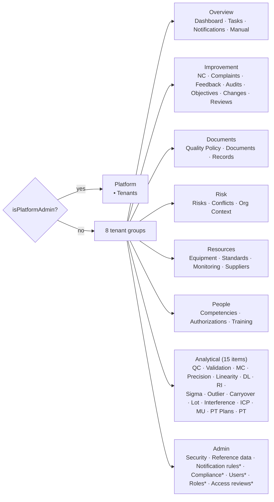

# NT.QMS — Production Software Requirements Specification
## Document 05 · Screen Specification

> [Conventions](00-SRS-Index-and-Conventions.md) · Backing endpoints:
> [Document 08](08-API-Specification.md) · Workflows the screens drive:
> [Document 06](06-Workflow-Specification.md)

The SPA is **105 standalone Angular components** across **87 route entries**. Rather than repeating an
identical description 28 times, this document specifies the **screen archetypes** first (they cover
~90 % of the surface), then the screens that deviate, then a complete machine-extracted control
inventory for every component.

---

# 5.1 Application shell (`SCR-00`)

**File:** `shell/shell.component.ts` · **Route:** `''` (wraps every authenticated route)
**Guard:** `authGuard`, then `platformOnlyGuard` / `tenantOnlyGuard` on the two child trees.

## Layout
```
┌───────────────────────────────────────────────────────────────────────┐
│ [☰] NT.QMS  [workspace pill]      [dash][tasks][bell] [EN|AR|FR] [AV] │  header
├──────────────┬────────────────────────────────────────────────────────┤
│ nav (grouped)│                                                        │
│  ▸ Overview  │                  <router-outlet>                       │
│  ▸ Improve…  │                                                        │
│  …           │                                                        │
└──────────────┴────────────────────────────────────────────────────────┘
```

## Controls

| Control | Behaviour | Persistence |
|---|---|---|
| **Burger** (`toggleSidebar`) | collapses the sidebar to a 56 px icon rail (`.nav.rail`) | `localStorage` key `SIDEBAR_COLLAPSED_KEY` (`'1'`/`'0'`) |
| **Workspace pill** | shows the laboratory **name** (from `GET /api/auth/workspace/{slug}`), not the slug — hidden for platform admins | — |
| **Quick icons** | `/dashboard`, `/tasks`, `/notifications` — hidden for platform admins | — |
| **Language switcher** | three buttons `EN | AR | FR`; the active one carries `.active`; switching sets document direction (`ar` ⇒ RTL) | `PUT /api/auth/me/language` |
| **Avatar** | up to **two uppercase initials** derived from the display name | — |
| **Sign out** | clears the in-memory access token and calls `POST /api/auth/logout` | server revokes the refresh family |
| **Group headers** | collapsible; a collapsed rail always shows items | `localStorage` `GROUPS_STATE_KEY` (JSON array of open group keys) |

## Navigation model



**Permission-driven visibility.** Only five nav items carry a `visible()` predicate — all in the Admin
group:

| Item | Shown when |
|---|---|
| Notification rules | `perms.can('notifications.manage')` |
| Compliance | `perms.can('compliance.view')` |
| Users | `perms.can('users.view')` |
| Roles | `perms.can('roles.view')` |
| Access reviews | `perms.can('access-reviews.view')` |

A group with no visible items is removed entirely.

> **Specification note — this is a real gap.** The other **39** nav items have **no** visibility
> predicate: every tenant user sees every operational module in the sidebar regardless of privilege.
> Clicking through lands on a page whose data call returns 403, so nothing leaks — but the navigation
> advertises modules the user cannot use. See [Document 14](14-Technical-Debt-Report.md) TD.

## Shell states
| State | Rendering |
|---|---|
| Platform admin | single **Platform** group; workspace pill and quick icons suppressed |
| Tenant user | eight groups, filtered as above |
| Sidebar collapsed | icon rail, labels hidden, all group items always visible |
| RTL (`ar`) | document direction flips; layout mirrors |

---

# 5.2 Screen archetypes

## Archetype A — **Register (list) page** — 28 screens

Used by every module register. Composition:

```
qams-page-header      ← title, subtitle, contextual help toggle
qams-list-stats       ← statistic tiles (+ optional proportion meters)
[filter row]          ← status/type selects + free-text search
[primary action]      ← "New …" opens a slide-over drawer
qams-drawer           ← creation form
[table]               ← rows, click → child route (detail)
qams-load-more        ← paged footer (13 of the 28 lists)
```

### States (all archetype-A screens)

| State | Trigger | Rendering |
|---|---|---|
| **Loading** | `facade.loading()` | in-place loading affordance; the table is not rendered |
| **Error** | `facade.error()` | error block with the server's problem+json `title`/`detail` |
| **Empty** | filtered result length 0 | `@empty` block on the `@for` loop |
| **Populated** | rows present | table |
| **Drawer open** | `showForm()` true | slide-over creation form overlays |
| **Submitting** | `facade.loading()` | the drawer's submit button is disabled |
| **More available** | server `total > loaded` | `qams-load-more` footer visible |

### Statistic tiles (`qams-list-stats`) — the rules

| Rule | Detail |
|---|---|
| **Colour never carries meaning alone** | the seven tone tokens failed as a categorical palette (gold 1.80:1, teal 2.58:1, red↔orange ΔE 8.9 for normal vision). Tone is carried by **meter fills and rails**; values wear AA-contrast `--nt-ink-*` steps. |
| **Proportions only with a real denominator** | `ratioFromFirst` is **opt-in per page** — used by **24 of 28** registers |
| **Deliberately meter-less** | `/org-context`, `/pt-plans`, `/feedback`, `/authorizations` — no valid whole |
| **Component refuses to meter** | non-numeric values, zero wholes, or parts greater than the whole |
| **Same component on the dashboard** | so the dashboard and the registers cannot drift |
| **Optional link** | a tile may become an anchor to a filtered view |

### The paged registers (13)
NC, documents, audits, risks, changes, management reviews, suppliers, equipment, competencies,
training assignments, archives, tasks, notifications — all share the `qams-load-more` footer with
facade `page`/`append`/`reset` semantics.

## Archetype B — **Detail page (child route `:id`)** — 26 screens

```
qams-page-header
qams-workflow-stepper   ← current state highlighted in the module's state machine
[summary card]          ← identifying fields
[state-specific action panel]  ← only the transitions legal from the current state
[child collections]     ← measurements / actions / findings / versions …
qams-audit-trail        ← per-record change history
```

**Key behaviour:** the action panel renders **only the transitions legal from the current state**.
The stepper is derived from the aggregate's state enum, so the UI and the domain state machine agree
by construction.

**Deletion of a child row** (a measurement, a reading, a pair) triggers the global
`changeReasonInterceptor`: an accessible dialog collects the reason, the request carries
`X-Change-Reason`, and cancelling or leaving it blank aborts the request client-side.

## Archetype C — **Analytical study pair** (list + detail) — 24 screens (12 modules × 2)

Archetype A + B specialised:
- **List:** configure-study drawer with the module's acceptance parameters.
- **Detail:** three-step stepper `Data entry → Calculated → Signed off`; a data-entry grid; a
  **Calculate** button; a **Sign off** button; results panel; audit trail.
- Two of them (`method-comparison-detail`, `precision-detail`) additionally embed `qams-csv-import`.

| Control | Disabled when |
|---|---|
| Add data point | state is `SignedOff` |
| Remove data point | state is `SignedOff` (and always prompts for a change reason) |
| Calculate | state is `SignedOff`, or the module's minimum data is not met (the server refuses with the module's `-010`/`-011` code) |
| Sign off | state is not `Calculated` |

---

# 5.3 Screens that deviate from the archetypes

## `SCR-01` · Tenant entry — `/t/:tenant`
**File:** `features/login/tenant-entry.component.ts` · **Anonymous**

Pins the laboratory for this browser. Reads `GET /api/auth/workspace/{slug}` and stores the slug in
`localStorage` under `qams.tenant.slug`, then routes to `/login`.
**States:** resolving · resolved (shows the laboratory **name**) · **404** (unknown, malformed *and*
non-active slugs all render identically — tenant existence cannot be probed).

## `SCR-02` · Sign-in — `/login`
**File:** `features/login/login.component.ts` · **Anonymous**

Rebuilt to a supplied design. Measured geometry at **both 1280 and 1600 px**: at 1280 the layout wraps,
so the header is a single row with controls right-aligned; `.cols` is a **fixed 946 px centred block**.

| Control | Notes |
|---|---|
| Workspace pill | the laboratory **name** resolved from the slug (e.g. slug `arfa` → "Arfa Lab") |
| E-mail, Password | required |
| **MFA code** | shown only when the server issues an MFA challenge |
| **"Sign in as platform administrator"** switch | clears the pinned tenant, switches to platform login, and on success routes to `/platform/tenants`. The admin portal is a **distinct identity**: shield pill, its own hero and copy. |
| Language switcher | available pre-authentication |

**States:** idle · submitting · **invalid credentials** (`AUTH-001`, deliberately non-specific) ·
**locked out** · **MFA challenge** · **MFA enrolment required** (routes to `/security/mfa-setup`) ·
**password expired** (routes to change-password).
**Accessibility:** the axe CI gate found and fixed a **missing form label** and a **serious contrast
violation** on this screen.

## `SCR-03` · MFA setup — `/security/mfa-setup`
**Outside the shell**, because an enrolment-scoped session (`scope=mfa_enrollment`) is barred from
every other endpoint. Shows the TOTP secret and `otpauth://` URI, then confirms with a code.

## `SCR-04` · Dashboard — `/dashboard`
KPI tiles rendered with the **same** `qams-list-stats` component as the registers, plus **11 real
population counts** (`DashboardKpiTotalsDto`) as denominators — the pinned invariant is *no KPI exceeds
its population*. Tiles may link to a filtered register.

## `SCR-05` · Platform tenants — `/platform/tenants`
Platform administrators only. Lists tenants and provisions a new one (slug, name, first administrator
+ strong password). **No suspend/reactivate/terminate controls exist** — those domain operations have
no endpoint.

## `SCR-06` · Compliance — `/compliance`
Tabbed reader over the ledgers: audit trail · field changes · signatures · security events ·
chain verification · audit-trail reviews. Carries the **XLSX export** buttons for audit trail and
signatures. Visible only with `compliance.view`; `ExternalAuditor` reaches it read-only.

## `SCR-07` · Roles & privileges — `/roles`
The **privilege matrix**: modules × actions rendered from `GET /api/roles/catalog` (never hard-coded in
the UI). Saving requires a **reason** (≤500). System roles render rename/deactivate as disabled.
A save that would remove the last `roles.manage` holder is refused server-side with `ROLE-006`.

## `SCR-08` · Users — `/users`
Register, change built-in role, assign custom role, set organisational scope
(`qams-allocation-picker`), set language, deactivate/reactivate, reset password.
**Password reset** uses the accessible **masked text-prompt dialog** (`text-prompt-dialog.component`),
which replaced a `window.prompt` (finding R-4).

## `SCR-09` · Authorization matrix — `/authorizations`
A person × test grid rather than a flat register. **Deliberately has no proportion meter.**

## `SCR-10` · Security settings — `/settings/security`
Self-service MFA enrolment for any user **plus** the tenant MFA policy toggle for `TenantAdmin`.

## `SCR-11` · Reference data — `/reference-data`
Branches, departments, test catalogue and LOV maintenance in one screen.

## `SCR-12` · Manual — `/manual`
In-app user manual. Static content, no data calls.

## `SCR-13` · Notification rules / monitor — `/notification-rules`
Rule editor (event key, recipient roles, e-mail toggle, subject/body templates) and the dispatch
monitor (queued/sent/failed with error text).

---

# 5.4 Shared UI components (17)

| Component | Purpose | Notable behaviour |
|---|---|---|
| `qams-page-header` | title, subtitle, help toggle | consistent across all pages |
| `qams-page-help` / `qams-help-body` | contextual help panel | content from `core/help/help-content.ts` |
| `qams-drawer` | slide-over form container | used by every creation form |
| `qams-list-stats` | statistic tiles + optional meters | refuses to meter invalid ratios; optional link per tile |
| `qams-load-more` | paged list footer | shared across all 13 paged lists (R-3) |
| `qams-workflow-stepper` | state-machine progress | derived from the record's state |
| `qams-status-pill` | state badge | tone + text, never colour alone |
| `qams-audit-trail` | per-record change history | reads the field-change ledger |
| `qams-lov-select` | list-of-values dropdown | localised names from `GET /api/lovs` |
| `qams-user-select` | person picker | from `GET /api/users/directory` |
| `qams-allocation-picker` | branch/department scope picker | drives `PUT /api/users/{id}/scope` |
| `qams-csv-import` | CSV batch upload | only method-comparison and precision |
| `change-reason-dialog` | accessible reason prompt | replaced `window.prompt`; blank/cancel aborts |
| `text-prompt-dialog` | accessible masked prompt | replaced the reset-password `window.prompt` |

---

# 5.5 Cross-cutting client behaviour

| Behaviour | Implementation | Effect |
|---|---|---|
| **Auth interceptor** | `core/auth.interceptor.ts` | attaches the in-memory bearer token; on 401 triggers a **single-flight silent refresh** and retries once |
| **Bootstrap refresh** | `APP_INITIALIZER` | attempts a silent refresh before the first render, so a returning user with a live refresh cookie is signed in without a login screen |
| **Change-reason interceptor** | `core/change-reason.interceptor.ts` | on any `DELETE`, prompts and attaches `X-Change-Reason`; cancel/blank aborts via `EMPTY`. Registered **after** `authInterceptor` |
| **Idle timeout** | `core/auth.service.ts` | **30 minutes** of inactivity ends the session client-side |
| **Permissions service** | `core/permissions.service.ts` | caches `GET /api/auth/me/privileges`; drives `can(key)` and `isPlatformAdmin()` |
| **i18n service** | `core/i18n.service.ts` | typed dictionaries for `en`/`ar`/`fr`; `t(key)`; sets document direction. **Not** ngx-translate, not JSON assets |
| **Guards** | `authGuard`, `platformOnlyGuard`, `tenantOnlyGuard` | route-level identity-class separation |
| **Wildcard route** | `{ path: '**', redirectTo: '' }` | unknown URLs land on the dashboard, **not** a 404 page — there is no not-found screen |

---

# 5.6 Known UI limitations, dead and incomplete controls

| ID | Finding | Evidence |
|---|---|---|
| **LIM-UI-01** | **39 of 44 nav items have no permission predicate** — the sidebar advertises modules a user cannot use. Data calls still 403. | `shell.component.ts` `groups` |
| **LIM-UI-02** | **No 404/not-found screen** — every unknown route silently redirects to the dashboard. | `app.routes.ts` |
| **LIM-UI-03** | **No tenant lifecycle controls** on the platform screen (suspend/reactivate/terminate exist in the domain, not in the API or UI). | `SCR-05` |
| **LIM-UI-04** | **No QC profile deactivation control** — `QcProfile.Deactivate()` is unreachable from the UI *and* the API. | `QcProfile.cs` |
| **LIM-UI-05** | **No session monitor.** The previous SRS specified an "Active Session Monitor" with IP, device, timestamp and per-session revoke. Not built; `qams.refresh_session` holds the data but nothing surfaces it. | — |
| **LIM-UI-06** | **No SOP tree explorer.** Document categorisation is a flat string. | `SCR` documents |
| **LIM-UI-07** | **No PDF viewer/watermarking.** Files download as stored. | — |
| **LIM-UI-08** | **No RCA structured editor** — the previous SRS's 5-Whys flow and Fishbone diagram inputs do not exist; RCA is a method enum plus one free-text area. | `nc-detail` |
| **LIM-UI-09** | **No chart components for Levey-Jennings, Passing-Bablok or Bland-Altman.** Studies present numeric results; the previous SRS's "dynamic SVG plots" are not built. **`[Assumption]`** — verified by the absence of any chart/SVG-plot component in the 100-component inventory. |
| **LIM-UI-10** | **Unpaged registers.** 15 of 28 registers load the whole filtered set (complaints, feedback, conflicts, monitoring points, reference standards, test authorisations, quality objectives, quality policy, org-context, SLA definitions, roles, users, access reviews, PT, PT plans). |
| **LIM-UI-11** | **No bulk actions anywhere** — every operation is single-record. |
| **LIM-UI-12** | **No print stylesheet or print view.** |
| **LIM-UI-13** | **No offline handling** — a lost connection surfaces as a generic error per request. |
| **LIM-UI-14** | **No client-side field-level validation mirroring** for most forms: buttons disable on `form.invalid`, but length/pattern feedback largely comes from the server's 400. |

## Accessibility posture

| Item | Status |
|---|---|
| axe checks in CI | **always-on**, every build |
| Violations found and fixed | missing label + serious contrast on login |
| `window.prompt` removal | change-reason and password-reset dialogs replaced |
| Colour-only meaning | eliminated in statistic tiles (meters + AA ink steps) |
| RTL | supported (Arabic) |
| Formal WCAG level claimed | **none** — `[Needs Business Confirmation]` |

---

# 5.7 Screen acceptance criteria

| ID | Given | When | Then |
|---|---|---|---|
| **AT-SCR-01** | any register | the filtered result is empty | the `@empty` block renders, not an empty table |
| **AT-SCR-02** | a study in `SignedOff` | the detail page loads | Add / Remove / Calculate / Sign-off controls are all unavailable |
| **AT-SCR-03** | any child-row delete | the user cancels the reason dialog | **no HTTP request is sent** |
| **AT-SCR-04** | a user without `users.view` | the shell renders | the **Users** nav item is absent |
| **AT-SCR-05** | a user without `nc.view` | the shell renders | the **Nonconformances** nav item is **still present** *(current behaviour — LIM-UI-01)* |
| **AT-SCR-06** | language set to `ar` | any page renders | document direction is RTL and the layout mirrors |
| **AT-SCR-07** | a live refresh cookie, expired access token | the SPA is reloaded | the user lands signed-in without a login screen (APP_INITIALIZER silent refresh) |
| **AT-SCR-08** | a feedback register | the stats row renders | the "Avg. Satisfaction" tile has **no** proportion meter |
| **AT-SCR-09** | the dashboard | KPI tiles render | no tile's value exceeds its stated population |
| **AT-SCR-10** | an unknown URL | it is navigated to | the user is redirected to the dashboard *(current behaviour — LIM-UI-02)* |

---

# 5.8 Complete component inventory

Machine-extracted from all 105 `*.component.ts` files. **Buttons** counts rendered `<button>` elements;
**Fields** counts `<input>`/`<select>`/`<textarea>`; **i18n keys** counts distinct `t('…')` calls.
A `*` on a field name means the element carries `required`.

<!-- 100 components -->

| # | Component | Route | LOC | Buttons | Fields | i18n keys | Shared UI / states |
|---:|---|---|---:|---:|---:|---:|---|
| 1 | `app.component.ts`<br>`AppComponent` | — | 22 | 0 | 0 | 0 | — |
| 2 | `core/change-reason-dialog.component.ts`<br>`ChangeReasonDialogComponent` | — | 91 | 2 | 1 | 5 | — |
| 3 | `core/text-prompt-dialog.component.ts`<br>`TextPromptDialogComponent` | — | 90 | 2 | 1 | 2 | — |
| 4 | `features/analytical/carryover-detail.component.ts`<br>`CarryoverDetailComponent` | `/:id` | 164 | 4 | 3 | 23 | error,stepper,audit-trail |
| 5 | `features/analytical/carryover-list.component.ts`<br>`CarryoverListComponent` | `/carryover-studies` | 146 | 3 | 5 | 21 | loading,error,stats,drawer |
| 6 | `features/analytical/detection-limit-detail.component.ts`<br>`DetectionLimitDetailComponent` | `/:id` | 275 | 4 | 3 | 31 | error,stepper,audit-trail |
| 7 | `features/analytical/detection-limit-list.component.ts`<br>`DetectionLimitListComponent` | `/detection-limits` | 159 | 3 | 6 | 23 | loading,error,stats,drawer |
| 8 | `features/analytical/instrument-comparability-detail.component.ts`<br>`InstrumentComparabilityDetailComponent` | `/:id` | 172 | 4 | 3 | 24 | error,stepper,audit-trail |
| 9 | `features/analytical/instrument-comparability-list.component.ts`<br>`InstrumentComparabilityListComponent` | `/instrument-comparabilities` | 152 | 3 | 6 | 21 | loading,error,stats,drawer |
| 10 | `features/analytical/interference-detail.component.ts`<br>`InterferenceDetailComponent` | `/:id` | 177 | 4 | 3 | 27 | error,stepper,audit-trail |
| 11 | `features/analytical/interference-list.component.ts`<br>`InterferenceListComponent` | `/interference-studies` | 148 | 3 | 5 | 20 | loading,error,stats,drawer |
| 12 | `features/analytical/levey-jennings-chart.component.ts`<br>`LeveyJenningsChartComponent` | — | 100 | 0 | 0 | 0 | — |
| 13 | `features/analytical/linearity-detail.component.ts`<br>`LinearityDetailComponent` | `/:id` | 277 | 4 | 2 | 32 | error,stepper,audit-trail |
| 14 | `features/analytical/linearity-list.component.ts`<br>`LinearityListComponent` | `/linearity-studies` | 161 | 3 | 6 | 24 | loading,error,stats,drawer |
| 15 | `features/analytical/lot-comparison-detail.component.ts`<br>`LotComparisonDetailComponent` | `/:id` | 149 | 4 | 3 | 20 | error,stepper,audit-trail |
| 16 | `features/analytical/lot-comparison-list.component.ts`<br>`LotComparisonListComponent` | `/lot-comparisons` | 157 | 3 | 7 | 23 | loading,error,stats,drawer |
| 17 | `features/analytical/method-comparison-detail.component.ts`<br>`MethodComparisonDetailComponent` | `/:id` | 289 | 5 | 3 | 26 | loading,error,stepper,audit-trail,csv-import |
| 18 | `features/analytical/method-comparison-list.component.ts`<br>`MethodComparisonListComponent` | `/method-comparisons` | 159 | 3 | 6 | 24 | loading,error,stats,drawer |
| 19 | `features/analytical/outlier-detail.component.ts`<br>`OutlierDetailComponent` | `/:id` | 152 | 4 | 2 | 22 | error,stepper,audit-trail |
| 20 | `features/analytical/outlier-list.component.ts`<br>`OutlierListComponent` | `/outlier-screenings` | 142 | 3 | 4 | 20 | loading,error,stats,drawer |
| 21 | `features/analytical/precision-detail.component.ts`<br>`PrecisionDetailComponent` | `/:id` | 240 | 5 | 2 | 30 | loading,error,stepper,audit-trail,csv-import |
| 22 | `features/analytical/precision-list.component.ts`<br>`PrecisionListComponent` | `/precision-studies` | 161 | 3 | 7 | 26 | loading,error,stats,drawer |
| 23 | `features/analytical/pt-list.component.ts`<br>`PtListComponent` | `/proficiency-tests` | 143 | 6 | 6 | 20 | loading,error,drawer |
| 24 | `features/analytical/pt-plan-detail.component.ts`<br>`PtPlanDetailComponent` | `/:id` | 219 | 5 | 8 | 25 | error,stepper,audit-trail |
| 25 | `features/analytical/pt-plan-list.component.ts`<br>`PtPlanListComponent` | `/pt-plans` | 132 | 3 | 1 | 17 | loading,error,stats,drawer |
| 26 | `features/analytical/qc-profile-detail.component.ts`<br>`QcProfileDetailComponent` | `/:id` | 151 | 4 | 3 | 17 | loading,error,stepper,audit-trail |
| 27 | `features/analytical/qc-profiles.component.ts`<br>`QcProfilesComponent` | `/qc` | 114 | 3 | 5 | 13 | loading,error,drawer |
| 28 | `features/analytical/reference-interval-detail.component.ts`<br>`ReferenceIntervalDetailComponent` | `/:id` | 226 | 4 | 2 | 25 | error,stepper,audit-trail |
| 29 | `features/analytical/reference-interval-list.component.ts`<br>`ReferenceIntervalListComponent` | `/reference-intervals` | 169 | 3 | 8 | 27 | loading,error,stats,drawer |
| 30 | `features/analytical/sigma-detail.component.ts`<br>`SigmaDetailComponent` | `/:id` | 172 | 2 | 3 | 12 | error,stepper,audit-trail |
| 31 | `features/analytical/sigma-list.component.ts`<br>`SigmaListComponent` | `/sigma-metrics` | 168 | 3 | 7 | 25 | loading,error,stats,drawer |
| 32 | `features/analytical/study-detail.component.ts`<br>`StudyDetailComponent` | `/:id` | 135 | 3 | 3 | 18 | error,stepper,audit-trail |
| 33 | `features/analytical/study-list.component.ts`<br>`StudyListComponent` | `/validation-studies` | 124 | 3 | 4 | 14 | loading,error,drawer |
| 34 | `features/analytical/uncertainty-detail.component.ts`<br>`UncertaintyDetailComponent` | `/:id` | 161 | 4 | 4 | 17 | error,stepper,audit-trail |
| 35 | `features/analytical/uncertainty-list.component.ts`<br>`UncertaintyListComponent` | `/uncertainty` | 164 | 3 | 8 | 27 | loading,error,stats,drawer |
| 36 | `features/audits/audit-detail.component.ts`<br>`AuditDetailComponent` | `/:id` | 160 | 3 | 3 | 18 | error,stepper,audit-trail |
| 37 | `features/audits/audit-list.component.ts`<br>`AuditListComponent` | `/audits` | 206 | 5 | 7 | 23 | loading,error,load-more,stats,drawer |
| 38 | `features/change/change-detail.component.ts`<br>`ChangeDetailComponent` | `/:id` | 194 | 5 | 5 | 30 | error,stepper,audit-trail |
| 39 | `features/change/change-list.component.ts`<br>`ChangeListComponent` | `/changes` | 169 | 3 | 5 | 23 | loading,error,load-more,stats,drawer |
| 40 | `features/competency/authorization-detail.component.ts`<br>`AuthorizationDetailComponent` | `/:id` | 128 | 3 | 2 | 19 | error,stepper,audit-trail |
| 41 | `features/competency/authorization-matrix.component.ts`<br>`AuthorizationMatrixComponent` | `/authorizations` | 243 | 4 | 5 | 23 | loading,error,stats,drawer |
| 42 | `features/competency/competency-detail.component.ts`<br>`CompetencyDetailComponent` | `/:id` | 143 | 3 | 2 | 20 | error,stepper,audit-trail |
| 43 | `features/competency/competency-list.component.ts`<br>`CompetencyListComponent` | `/competencies` | 135 | 3 | 4 | 14 | loading,error,load-more,drawer |
| 44 | `features/competency/training-queue.component.ts`<br>`TrainingQueueComponent` | `/training` | 132 | 4 | 4 | 16 | loading,error,load-more,drawer |
| 45 | `features/complaints/complaint-detail.component.ts`<br>`ComplaintDetailComponent` | `/:id` | 176 | 7 | 3 | 25 | error,stepper,audit-trail |
| 46 | `features/complaints/complaint-list.component.ts`<br>`ComplaintListComponent` | `/complaints` | 191 | 3 | 9 | 27 | loading,error,stats,drawer |
| 47 | `features/compliance/compliance.component.ts`<br>`ComplianceComponent` | `/compliance` | 332 | 10 | 5 | 48 | loading,error |
| 48 | `features/dashboard/dashboard.component.ts`<br>`DashboardComponent` | `/dashboard` | 175 | 0 | 0 | 25 | loading,stats |
| 49 | `features/documents/document-detail.component.ts`<br>`DocumentDetailComponent` | `/:id` | 350 | 11 | 7 | 48 | error,stepper,audit-trail |
| 50 | `features/documents/document-list.component.ts`<br>`DocumentListComponent` | `/documents` | 145 | 3 | 5 | 15 | loading,error,load-more,drawer |
| 51 | `features/equipment/equipment-detail.component.ts`<br>`EquipmentDetailComponent` | `/:id` | 243 | 4 | 10 | 31 | error,stepper,audit-trail |
| 52 | `features/equipment/equipment-list.component.ts`<br>`EquipmentListComponent` | `/equipment` | 185 | 3 | 7 | 21 | loading,error,load-more,stats,drawer |
| 53 | `features/equipment/standards-detail.component.ts`<br>`StandardsDetailComponent` | `/:id` | 116 | 3 | 1 | 21 | error,stepper,audit-trail |
| 54 | `features/equipment/standards-list.component.ts`<br>`StandardsListComponent` | `/reference-standards` | 189 | 3 | 12 | 29 | loading,error,stats,drawer |
| 55 | `features/facility/monitoring-detail.component.ts`<br>`MonitoringDetailComponent` | `/:id` | 177 | 5 | 4 | 24 | error,stepper,audit-trail |
| 56 | `features/facility/monitoring-list.component.ts`<br>`MonitoringListComponent` | `/monitoring` | 190 | 3 | 7 | 28 | loading,error,stats,drawer |
| 57 | `features/feedback/feedback-detail.component.ts`<br>`FeedbackDetailComponent` | `/:id` | 153 | 3 | 4 | 20 | error,stepper,audit-trail |
| 58 | `features/feedback/feedback-list.component.ts`<br>`FeedbackListComponent` | `/feedback` | 197 | 3 | 8 | 26 | loading,error,stats,drawer |
| 59 | `features/governance/quality-policy.component.ts`<br>`QualityPolicyComponent` | `/quality-policy` | 176 | 4 | 2 | 17 | loading,error |
| 60 | `features/login/login.component.ts`<br>`LoginComponent` | `/login` | 488 | 4 | 4 | 19 | error |
| 61 | `features/login/tenant-entry.component.ts`<br>`TenantEntryComponent` | `/t/:tenant` | 32 | 0 | 0 | 1 | — |
| 62 | `features/manual/manual.component.ts`<br>`ManualComponent` | `/manual` | 140 | 1 | 1 | 5 | help |
| 63 | `features/nc/nc-detail.component.ts`<br>`NcDetailComponent` | `/:id` | 205 | 11 | 6 | 35 | error,stepper,audit-trail |
| 64 | `features/nc/nc-list.component.ts`<br>`NcListComponent` | `/nonconformances` | 217 | 4 | 9 | 25 | loading,error,load-more,stats,drawer |
| 65 | `features/notifications/notification-admin.component.ts`<br>`NotificationAdminComponent` | `/notification-rules` | 225 | 3 | 6 | 25 | loading,error,drawer |
| 66 | `features/notifications/notifications.component.ts`<br>`NotificationsComponent` | `/notifications` | 100 | 1 | 0 | 4 | loading,load-more |
| 67 | `features/objectives/objective-detail.component.ts`<br>`ObjectiveDetailComponent` | `/:id` | 164 | 2 | 5 | 23 | error,stepper,audit-trail |
| 68 | `features/objectives/objective-list.component.ts`<br>`ObjectiveListComponent` | `/quality-objectives` | 198 | 3 | 10 | 30 | loading,error,stats,drawer |
| 69 | `features/organization/org-context.component.ts`<br>`OrgContextComponent` | `/org-context` | 341 | 8 | 9 | 38 | error,stats,drawer,audit-trail |
| 70 | `features/platform/tenants.component.ts`<br>`TenantsComponent` | `/platform/tenants` | 166 | 3 | 5 | 18 | loading,error,drawer |
| 71 | `features/records/records.component.ts`<br>`RecordsComponent` | `/records` | 163 | 8 | 5 | 25 | loading,error,load-more,drawer |
| 72 | `features/reference/reference-data.component.ts`<br>`ReferenceDataComponent` | `/reference-data` | 395 | 16 | 18 | 34 | loading,error,drawer |
| 73 | `features/review/review-detail.component.ts`<br>`ReviewDetailComponent` | `/:id` | 136 | 3 | 3 | 16 | error,stepper,audit-trail |
| 74 | `features/review/review-list.component.ts`<br>`ReviewListComponent` | `/management-reviews` | 172 | 3 | 4 | 19 | loading,error,load-more,stats,drawer |
| 75 | `features/risk/conflict-detail.component.ts`<br>`ConflictDetailComponent` | `/:id` | 170 | 2 | 4 | 14 | error,stepper,audit-trail |
| 76 | `features/risk/conflict-list.component.ts`<br>`ConflictListComponent` | `/conflicts` | 193 | 3 | 5 | 22 | loading,error,stats,drawer |
| 77 | `features/risk/risk-detail.component.ts`<br>`RiskDetailComponent` | `/:id` | 172 | 4 | 4 | 22 | error,stepper,audit-trail |
| 78 | `features/risk/risk-list.component.ts`<br>`RiskListComponent` | `/risks` | 191 | 3 | 6 | 23 | loading,error,load-more,stats,drawer |
| 79 | `features/roles/roles.component.ts`<br>`RolesComponent` | `/roles` | 338 | 6 | 4 | 24 | loading,error,drawer |
| 80 | `features/security/access-reviews.component.ts`<br>`AccessReviewsComponent` | `/access-reviews` | 131 | 2 | 2 | 17 | loading,error |
| 81 | `features/security/mfa-setup.component.ts`<br>`MfaSetupComponent` | `/security/mfa-setup` | 127 | 4 | 1 | 13 | error |
| 82 | `features/security/security-settings.component.ts`<br>`SecuritySettingsComponent` | `/settings/security` | 90 | 1 | 1 | 10 | error |
| 83 | `features/supplier/supplier-detail.component.ts`<br>`SupplierDetailComponent` | `/:id` | 220 | 6 | 8 | 30 | error,stepper,audit-trail |
| 84 | `features/supplier/supplier-list.component.ts`<br>`SupplierListComponent` | `/suppliers` | 173 | 3 | 4 | 18 | loading,error,load-more,stats,drawer |
| 85 | `features/tasks/tasks.component.ts`<br>`TasksComponent` | `/tasks` | 191 | 5 | 7 | 29 | loading,error,load-more,drawer |
| 86 | `features/users/users.component.ts`<br>`UsersComponent` | `/users` | 301 | 9 | 8 | 25 | loading,error,drawer |
| 87 | `shared/ui/allocation-picker.component.ts`<br>`AllocationPickerComponent` | — | 65 | 0 | 2 | 3 | — |
| 88 | `shared/ui/audit-trail.component.ts`<br>`AuditTrailComponent` | — | 152 | 1 | 0 | 17 | loading,error,audit-trail |
| 89 | `shared/ui/csv-import.component.ts`<br>`CsvImportComponent` | — | 163 | 2 | 3 | 13 | csv-import |
| 90 | `shared/ui/drawer.component.ts`<br>`DrawerComponent` | — | 70 | 1 | 0 | 1 | drawer |
| 91 | `shared/ui/help-body.component.ts`<br>`HelpBodyComponent` | — | 106 | 0 | 0 | 2 | help |
| 92 | `shared/ui/list-stats.component.ts`<br>`ListStatsComponent` | — | 147 | 0 | 0 | 0 | stats |
| 93 | `shared/ui/load-more.component.ts`<br>`LoadMoreComponent` | — | 48 | 1 | 0 | 2 | loading,load-more |
| 94 | `shared/ui/lov-select.component.ts`<br>`LovSelectComponent` | — | 74 | 0 | 2 | 1 | — |
| 95 | `shared/ui/page-header.component.ts`<br>`PageHeaderComponent` | — | 78 | 1 | 0 | 1 | — |
| 96 | `shared/ui/page-help.component.ts`<br>`PageHelpComponent` | — | 45 | 0 | 0 | 2 | drawer,help |
| 97 | `shared/ui/status-pill.component.ts`<br>`StatusPillComponent` | — | 32 | 0 | 0 | 0 | — |
| 98 | `shared/ui/user-select.component.ts`<br>`UserSelectComponent` | — | 234 | 2 | 1 | 5 | empty |
| 99 | `shared/ui/workflow-stepper.component.ts`<br>`WorkflowStepperComponent` | — | 75 | 0 | 0 | 0 | stepper |
| 100 | `shell/shell.component.ts`<br>`ShellComponent` | — | 412 | 4 | 0 | 6 | help |


---

## Per-screen control detail

#### `app.component.ts` — AppComponent


#### `core/change-reason-dialog.component.ts` — ChangeReasonDialogComponent

- **state signals:** reason
- **controls:**
  - `{{ i18n.t('changeReason.confirm') }}` — disabled when `reason().trim() === ''`
  - `{{ i18n.t('changeReason.cancel') }}`
- **fields:** reasonBox:textarea

#### `core/text-prompt-dialog.component.ts` — TextPromptDialogComponent

- **state signals:** value
- **controls:**
  - `{{ i18n.t('common.confirm') }}` — disabled when `value().trim() === ''`
  - `{{ i18n.t('common.cancel') }}`
- **fields:** valueBox:input

#### `features/analytical/carryover-detail.component.ts` — CarryoverDetailComponent — route `/:id`

- **state signals:** canCalculate
- **api calls:** facade.addReading, facade.calculate, facade.error, facade.loadDetail, facade.removeReading, facade.signOff
- **controls:**
  - `{{ i18n.t('car.addReading') }}` — disabled when `entryForm.invalid`
  - `✕`
  - `{{ i18n.t('car.calculate') }}` — disabled when `!canCalculate()`
  - `{{ i18n.t('mc.signOff') }}`
- **fields:** kind:select, sequence:number, value:number

#### `features/analytical/carryover-list.component.ts` — CarryoverListComponent — route `/carryover-studies`

- **state signals:** detailOpen, filtered, search, showForm, stateFilter, stats
- **api calls:** facade.create, facade.error, facade.list, facade.loadList, facade.loading
- **controls:**
  - `{{ i18n.t('car.new') }}`
  - `{{ i18n.t('qc.create') }}` — disabled when `form.invalid || facade.loading()`
  - `{{ i18n.t('nc.cancel') }}`
- **fields:** ?:input, ?:select, analyte:input, unit:input, allowableCarryoverPct:number

#### `features/analytical/detection-limit-detail.component.ts` — DetectionLimitDetailComponent — route `/:id`

- **state signals:** blankCount, concentrations, lowCount, maxCv
- **api calls:** facade.addMeasurement, facade.calculate, facade.error, facade.loadDetail, facade.removeMeasurement, facade.signOff
- **controls:**
  - `{{ i18n.t('dl.addMeasurement') }}` — disabled when `entryForm.invalid`
  - `✕`
  - `{{ i18n.t('dl.calculate') }}` — disabled when `blankCount() < 10 || lowCount() < 10`
  - `{{ i18n.t('mc.signOff') }}`
- **fields:** kind:select, assignedValue:number, measuredValue:number

#### `features/analytical/detection-limit-list.component.ts` — DetectionLimitListComponent — route `/detection-limits`

- **state signals:** detailOpen, filtered, search, showForm, stateFilter, stats
- **api calls:** facade.create, facade.error, facade.list, facade.loadList, facade.loading
- **controls:**
  - `{{ i18n.t('dl.new') }}`
  - `{{ i18n.t('qc.create') }}` — disabled when `form.invalid || facade.loading()`
  - `{{ i18n.t('nc.cancel') }}`
- **fields:** ?:input, ?:select, analyte:input, unit:input, method:input, loqCvTargetPct:number

#### `features/analytical/instrument-comparability-detail.component.ts` — InstrumentComparabilityDetailComponent — route `/:id`

- **state signals:** canCalculate
- **api calls:** facade.addReading, facade.calculate, facade.error, facade.loadDetail, facade.removeReading, facade.signOff
- **controls:**
  - `{{ i18n.t('icp.addReading') }}` — disabled when `entryForm.invalid`
  - `✕`
  - `{{ i18n.t('icp.calculate') }}` — disabled when `!canCalculate()`
  - `{{ i18n.t('mc.signOff') }}`
- **fields:** instrument:input, sampleId:input, value:number

#### `features/analytical/instrument-comparability-list.component.ts` — InstrumentComparabilityListComponent — route `/instrument-comparabilities`

- **state signals:** detailOpen, filtered, search, showForm, stateFilter, stats
- **api calls:** facade.create, facade.error, facade.list, facade.loadList, facade.loading
- **controls:**
  - `{{ i18n.t('icp.new') }}`
  - `{{ i18n.t('qc.create') }}` — disabled when `form.invalid || facade.loading()`
  - `{{ i18n.t('nc.cancel') }}`
- **fields:** ?:input, ?:select, analyte:input, unit:input, referenceInstrument:input, allowableBiasPct:number

#### `features/analytical/interference-detail.component.ts` — InterferenceDetailComponent — route `/:id`

- **state signals:** canCalculate
- **api calls:** facade.addMeasurement, facade.calculate, facade.error, facade.loadDetail, facade.removeMeasurement, facade.signOff
- **controls:**
  - `{{ i18n.t('inf.addMeasurement') }}` — disabled when `entryForm.invalid`
  - `✕`
  - `{{ i18n.t('inf.calculate') }}` — disabled when `!canCalculate()`
  - `{{ i18n.t('mc.signOff') }}`
- **fields:** kind:select, interferent:input, value:number

#### `features/analytical/interference-list.component.ts` — InterferenceListComponent — route `/interference-studies`

- **state signals:** detailOpen, filtered, search, showForm, stateFilter, stats
- **api calls:** facade.create, facade.error, facade.list, facade.loadList, facade.loading
- **controls:**
  - `{{ i18n.t('inf.new') }}`
  - `{{ i18n.t('qc.create') }}` — disabled when `form.invalid || facade.loading()`
  - `{{ i18n.t('nc.cancel') }}`
- **fields:** ?:input, ?:select, analyte:input, unit:input, allowableBiasPct:number

#### `features/analytical/levey-jennings-chart.component.ts` — LeveyJenningsChartComponent

- **state signals:** points, polyline

#### `features/analytical/linearity-detail.component.ts` — LinearityDetailComponent — route `/:id`

- **state signals:** distinctLevels, maxAssigned, maxMeasured, minAssigned, minMeasured
- **api calls:** facade.addMeasurement, facade.calculate, facade.error, facade.loadDetail, facade.removeMeasurement, facade.signOff
- **controls:**
  - `✕`
  - `{{ i18n.t('lin.addMeasurement') }}` — disabled when `measurementForm.invalid`
  - `{{ i18n.t('lin.calculate') }}` — disabled when `distinctLevels() < 4`
  - `{{ i18n.t('mc.signOff') }}`
- **fields:** assignedValue:number, measuredValue:number

#### `features/analytical/linearity-list.component.ts` — LinearityListComponent — route `/linearity-studies`

- **state signals:** detailOpen, filtered, search, showForm, stateFilter, stats
- **api calls:** facade.create, facade.error, facade.list, facade.loadList, facade.loading
- **controls:**
  - `{{ i18n.t('lin.new') }}`
  - `{{ i18n.t('qc.create') }}` — disabled when `form.invalid || facade.loading()`
  - `{{ i18n.t('nc.cancel') }}`
- **fields:** ?:input, ?:select, analyte:input, unit:input, method:input, allowableDeviationPct:number

#### `features/analytical/lot-comparison-detail.component.ts` — LotComparisonDetailComponent — route `/:id`

- **api calls:** facade.addPair, facade.calculate, facade.error, facade.loadDetail, facade.removePair, facade.signOff
- **controls:**
  - `{{ i18n.t('lot.addPair') }}` — disabled when `entryForm.invalid`
  - `✕`
  - `{{ i18n.t('lot.calculate') }}` — disabled when `s.pairs.length < 3`
  - `{{ i18n.t('mc.signOff') }}`
- **fields:** currentLotValue:number, newLotValue:number, sampleId:input

#### `features/analytical/lot-comparison-list.component.ts` — LotComparisonListComponent — route `/lot-comparisons`

- **state signals:** detailOpen, filtered, search, showForm, stateFilter, stats
- **api calls:** facade.create, facade.error, facade.list, facade.loadList, facade.loading
- **controls:**
  - `{{ i18n.t('lot.new') }}`
  - `{{ i18n.t('qc.create') }}` — disabled when `form.invalid || facade.loading()`
  - `{{ i18n.t('nc.cancel') }}`
- **fields:** ?:input, ?:select, analyte:input, unit:input, currentLot:input, newLot:input, allowableBiasPct:number

#### `features/analytical/method-comparison-detail.component.ts` — MethodComparisonDetailComponent — route `/:id`

- **state signals:** baDiffs, baMeans, importResult, scatterMax, scatterMin, showImport
- **api calls:** facade.addPair, facade.calculate, facade.error, facade.importPairs, facade.loadDetail, facade.loading, facade.removePair, facade.signOff
- **controls:**
  - `✕`
  - `{{ i18n.t('mc.addPair') }}` — disabled when `pairForm.invalid`
  - `{{ showImport() ? i18n.t('csv.hide') : i18n.t('c`
  - `{{ i18n.t('mc.calculate') }}` — disabled when `s.pairs.length < 2`
  - `{{ i18n.t('mc.signOff') }}`
- **fields:** sampleId:input, referenceValue:number, testValue:number

#### `features/analytical/method-comparison-list.component.ts` — MethodComparisonListComponent — route `/method-comparisons`

- **state signals:** detailOpen, filtered, search, showForm, stateFilter, stats
- **api calls:** facade.create, facade.error, facade.list, facade.loadList, facade.loading
- **controls:**
  - `{{ i18n.t('mc.new') }}`
  - `{{ i18n.t('qc.create') }}` — disabled when `form.invalid || facade.loading()`
  - `{{ i18n.t('nc.cancel') }}`
- **fields:** ?:input, ?:select, analyte:input, unit:input, referenceMethod:input, testMethod:input

#### `features/analytical/outlier-detail.component.ts` — OutlierDetailComponent — route `/:id`

- **api calls:** facade.addPoint, facade.calculate, facade.error, facade.loadDetail, facade.removePoint, facade.signOff
- **controls:**
  - `{{ i18n.t('out.addPoint') }}` — disabled when `entryForm.invalid`
  - `✕`
  - `{{ i18n.t('out.calculate') }}` — disabled when `s.points.length < 4`
  - `{{ i18n.t('mc.signOff') }}`
- **fields:** value:number, label:input

#### `features/analytical/outlier-list.component.ts` — OutlierListComponent — route `/outlier-screenings`

- **state signals:** detailOpen, filtered, search, showForm, stateFilter, stats
- **api calls:** facade.create, facade.error, facade.list, facade.loadList, facade.loading
- **controls:**
  - `{{ i18n.t('out.new') }}`
  - `{{ i18n.t('qc.create') }}` — disabled when `form.invalid || facade.loading()`
  - `{{ i18n.t('nc.cancel') }}`
- **fields:** ?:input, ?:select, dataset:input, unit:input

#### `features/analytical/precision-detail.component.ts` — PrecisionDetailComponent — route `/:id`

- **state signals:** btwShare, importResult, repShare, runCount, showImport
- **api calls:** facade.addMeasurement, facade.calculate, facade.error, facade.importMeasurements, facade.loadDetail, facade.loading, facade.removeMeasurement, facade.signOff
- **controls:**
  - `{{ i18n.t('prc.addReplicate') }}` — disabled when `entryForm.invalid`
  - `{{ showImport() ? i18n.t('csv.hide') : i18n.t('c`
  - `✕`
  - `{{ i18n.t('prc.calculate') }}` — disabled when `runCount() < 2`
  - `{{ i18n.t('mc.signOff') }}`
- **fields:** runLabel:input, value:number

#### `features/analytical/precision-list.component.ts` — PrecisionListComponent — route `/precision-studies`

- **state signals:** detailOpen, filtered, search, showForm, stateFilter, stats
- **api calls:** facade.create, facade.error, facade.list, facade.loadList, facade.loading
- **controls:**
  - `{{ i18n.t('prc.new') }}`
  - `{{ i18n.t('qc.create') }}` — disabled when `form.invalid || facade.loading()`
  - `{{ i18n.t('nc.cancel') }}`
- **fields:** ?:input, ?:select, analyte:input, unit:input, level:input, claimedRepeatabilityCvPct:number, claimedWithinLabCvPct:number

#### `features/analytical/pt-list.component.ts` — PtListComponent — route `/proficiency-tests`

- **state signals:** performanceFilter, resultId, showForm
- **api calls:** facade.enroll, facade.error, facade.list, facade.loadList, facade.loading, facade.recordResult
- **controls:**
  - `{{ i18n.t('pt.new') }}`
  - `{{ i18n.t('pt.enroll') }}` — disabled when `enrollForm.invalid || facade.loading()`
  - `{{ i18n.t('nc.cancel') }}`
  - `{{ i18n.t('pt.recordResult') }}`
  - `{{ i18n.t('pt.save') }}` — disabled when `resultForm.invalid`
  - `{{ i18n.t('nc.cancel') }}`
- **fields:** ?:select, analyte:input, cycle:input, submitted:number, assigned:number, standardDeviation:number

#### `features/analytical/pt-plan-detail.component.ts` — PtPlanDetailComponent — route `/:id`

- **state signals:** enrollments, resulted
- **api calls:** analyticalApi.ptEnrollments, facade.addItem, facade.approve, facade.close, facade.error, facade.loadDetail, facade.recordFulfilment, facade.removeItem
- **controls:**
  - `{{ i18n.t('ptp.approve') }}` — disabled when `p.items.length === 0`
  - `✕`
  - `{{ i18n.t('ptp.addLine') }}` — disabled when `itemForm.invalid`
  - `{{ i18n.t('ptp.count') }}` — disabled when `fulfilForm.invalid`
  - `{{ i18n.t('ptp.closeBtn') }}` — disabled when `closeForm.invalid`
- **fields:** scheme:input, analyte:input, provider:input, plannedCycles:number, notes:input, itemId:select, enrollmentId:select, closureSummary:input

#### `features/analytical/pt-plan-list.component.ts` — PtPlanListComponent — route `/pt-plans`

- **state signals:** detailOpen, showForm, stats
- **api calls:** facade.create, facade.error, facade.list, facade.loadList, facade.loading
- **controls:**
  - `{{ i18n.t('ptp.new') }}`
  - `{{ i18n.t('qc.create') }}` — disabled when `form.invalid || facade.loading()`
  - `{{ i18n.t('nc.cancel') }}`
- **fields:** year:number

#### `features/analytical/qc-profile-detail.component.ts` — QcProfileDetailComponent — route `/:id`

- **state signals:** troubleshootId
- **api calls:** facade.chartRuns, facade.error, facade.loading, facade.openProfile, facade.recordRun, facade.runs, facade.selected, facade.troubleshoot
- **controls:**
  - `{{ i18n.t('qc.record') }}` — disabled when `runForm.invalid || facade.loading()`
  - `{{ i18n.t('qc.troubleshoot') }}`
  - `{{ i18n.t('qc.saveNote') }}` — disabled when `tsForm.invalid`
  - `{{ i18n.t('nc.cancel') }}`
- **fields:** value:number, operator:input, note:input

#### `features/analytical/qc-profiles.component.ts` — QcProfilesComponent — route `/qc`

- **state signals:** detailOpen, showForm
- **api calls:** facade.createProfile, facade.error, facade.loadProfiles, facade.loading, facade.profiles
- **controls:**
  - `{{ i18n.t('qc.new') }}`
  - `{{ i18n.t('qc.create') }}` — disabled when `form.invalid || facade.loading()`
  - `{{ i18n.t('nc.cancel') }}`
- **fields:** analyte:input, instrument:input, controlLot:input, targetMean:number, targetSd:number

#### `features/analytical/reference-interval-detail.component.ts` — ReferenceIntervalDetailComponent — route `/:id`

- **state signals:** jittered, range
- **api calls:** facade.addSample, facade.calculate, facade.error, facade.loadDetail, facade.removeSample, facade.signOff
- **controls:**
  - `✕`
  - `{{ i18n.t('ri.addSample') }}` — disabled when `sampleForm.invalid`
  - `{{ i18n.t('ri.calculate') }}` — disabled when `s.samples.length < 20`
  - `{{ i18n.t('mc.signOff') }}`
- **fields:** subjectRef:input, value:number

#### `features/analytical/reference-interval-list.component.ts` — ReferenceIntervalListComponent — route `/reference-intervals`

- **state signals:** detailOpen, filtered, search, showForm, stateFilter, stats
- **api calls:** facade.create, facade.error, facade.list, facade.loadList, facade.loading
- **controls:**
  - `{{ i18n.t('ri.new') }}`
  - `{{ i18n.t('qc.create') }}` — disabled when `form.invalid || facade.loading()`
  - `{{ i18n.t('nc.cancel') }}`
- **fields:** ?:input, ?:select, analyte:input, unit:input, population:input, source:input, claimedLower:number, claimedUpper:number

#### `features/analytical/sigma-detail.component.ts` — SigmaDetailComponent — route `/:id`

- **state signals:** markerPoints
- **api calls:** facade.error, facade.loadDetail, facade.signOff, facade.updateInputs
- **controls:**
  - `{{ i18n.t('sig.recalculate') }}` — disabled when `form.invalid`
  - `{{ i18n.t('mc.signOff') }}`
- **fields:** allowableTotalErrorPct:number, biasPct:number, cvPct:number

#### `features/analytical/sigma-list.component.ts` — SigmaListComponent — route `/sigma-metrics`

- **state signals:** detailOpen, filtered, search, showForm, stateFilter, stats
- **api calls:** facade.create, facade.error, facade.list, facade.loadList, facade.loading
- **controls:**
  - `{{ i18n.t('sig.new') }}`
  - `{{ i18n.t('qc.create') }}` — disabled when `form.invalid || facade.loading()`
  - `{{ i18n.t('nc.cancel') }}`
- **fields:** ?:input, ?:select, analyte:input, unit:input, allowableTotalErrorPct:number, biasPct:number, cvPct:number

#### `features/analytical/study-detail.component.ts` — StudyDetailComponent — route `/:id`

- **state signals:** editable
- **api calls:** facade.calculate, facade.enterReplicate, facade.error, facade.loadDetail, facade.signOff
- **controls:**
  - `{{ i18n.t('val.addReplicate') }}` — disabled when `repForm.invalid`
  - `{{ i18n.t('val.calculate') }}` — disabled when `s.replicates.length < 2`
  - `{{ i18n.t('val.signOffAction') }}`
- **fields:** level:input, measured:number, reference:number

#### `features/analytical/study-list.component.ts` — StudyListComponent — route `/validation-studies`

- **state signals:** detailOpen, showForm, stateFilter
- **api calls:** facade.configure, facade.error, facade.list, facade.loadList, facade.loading
- **controls:**
  - `{{ i18n.t('val.new') }}`
  - `{{ i18n.t('val.configure') }}` — disabled when `form.invalid || facade.loading()`
  - `{{ i18n.t('nc.cancel') }}`
- **fields:** ?:select, analyte:input, protocol:input, totalAllowableError:number

#### `features/analytical/uncertainty-detail.component.ts` — UncertaintyDetailComponent — route `/:id`

- **state signals:** editable
- **api calls:** facade.addComponent, facade.approve, facade.calculate, facade.error, facade.loadDetail, facade.removeComponent
- **controls:**
  - `✕`
  - `{{ i18n.t('mu.addComponent') }}` — disabled when `componentForm.invalid`
  - `{{ i18n.t('mu.calculate') }}` — disabled when `b.components.length === 0`
  - `{{ i18n.t('mu.approve') }}`
- **fields:** name:input, type:select, relativeStandardUncertainty:number, source:input

#### `features/analytical/uncertainty-list.component.ts` — UncertaintyListComponent — route `/uncertainty`

- **state signals:** detailOpen, filtered, search, showForm, stats, statusFilter
- **api calls:** facade.create, facade.error, facade.list, facade.loadList, facade.loading
- **controls:**
  - `{{ i18n.t('mu.new') }}`
  - `{{ i18n.t('qc.create') }}` — disabled when `form.invalid || facade.loading()`
  - `{{ i18n.t('nc.cancel') }}`
- **fields:** ?:input, ?:select, analyte:input, method:input, unit:input, level:input, coverageFactor:number, targetExpandedUncertainty:number

#### `features/audits/audit-detail.component.ts` — AuditDetailComponent — route `/:id`

- **state signals:** canSignOff
- **api calls:** facade.answer, facade.error, facade.loadDetail, facade.raiseFinding, facade.signOff, facade.start
- **controls:**
  - `{{ i18n.t('audit.start') }}`
  - `{{ i18n.t('audit.signOff') }}` — disabled when `!canSignOff()`
  - `{{ i18n.t('audit.raiseFinding') }}` — disabled when `findingForm.invalid`
- **fields:** ?:select, grade:select, description:textarea

#### `features/audits/audit-list.component.ts` — AuditListComponent — route `/audits`

- **state signals:** branchFilter, detailOpen, filtered, search, showForm, stats
- **api calls:** facade.error, facade.hasMore, facade.list, facade.loadList, facade.loadMore, facade.loading, facade.schedule, facade.total, org.branchName, org.branches, org.ensureOrg
- **controls:**
  - `{{ i18n.t('audit.new') }}`
  - `＋ {{ i18n.t('audit.addItem') }}`
  - `✕` — disabled when `checklist.length === 1`
  - `{{ i18n.t('audit.schedule') }}` — disabled when `form.invalid || facade.loading()`
  - `{{ i18n.t('nc.cancel') }}`
- **fields:** ?:input, ?:select, title:input, type:select, plannedDate:date, isoClause:input, question:input

#### `features/change/change-detail.component.ts` — ChangeDetailComponent — route `/:id`

- **api calls:** facade.approve, facade.close, facade.error, facade.linkRisk, facade.loadDetail, facade.loadRiskOptions, facade.reject, facade.review, facade.riskOptions
- **controls:**
  - `{{ i18n.t('chg.link') }}` — disabled when `linkForm.invalid`
  - `{{ i18n.t('chg.approve') }}` — disabled when `!c.riskItemId`
  - `{{ i18n.t('chg.reject') }}` — disabled when `rejectForm.invalid`
  - `{{ i18n.t('chg.close') }}` — disabled when `closeForm.invalid`
  - `{{ i18n.t('chg.recordPir') }}` — disabled when `reviewForm.invalid`
- **fields:** riskItemId:select, reason:input, implementationNotes:textarea, effective:select, notes:textarea

#### `features/change/change-list.component.ts` — ChangeListComponent — route `/changes`

- **state signals:** branchFilter, detailOpen, filtered, search, showForm, stats, statusFilter
- **api calls:** facade.error, facade.hasMore, facade.list, facade.loadList, facade.loadMore, facade.loading, facade.propose, facade.total, org.branchName, org.branches, org.ensureOrg
- **controls:**
  - `{{ i18n.t('chg.new') }}`
  - `{{ i18n.t('chg.propose') }}` — disabled when `form.invalid || facade.loading()`
  - `{{ i18n.t('nc.cancel') }}`
- **fields:** ?:input, ?:select, ?:select, title:input, impactAnalysis:textarea

#### `features/competency/authorization-detail.component.ts` — AuthorizationDetailComponent — route `/:id`

- **api calls:** facade.error, facade.loadDetail, facade.reinstate, facade.revoke, facade.suspend, org.ensureDirectory, org.userName
- **controls:**
  - `{{ i18n.t('authz.suspend') }}` — disabled when `reasonForm.invalid`
  - `{{ i18n.t('authz.reinstate') }}`
  - `{{ i18n.t('authz.revoke') }}` — disabled when `revokeForm.invalid`
- **fields:** reason:input, reason:input

#### `features/competency/authorization-matrix.component.ts` — AuthorizationMatrixComponent — route `/authorizations`

- **state signals:** activeTests, detailOpen, evidence, filtered, matrixTests, matrixUsers, search, showForm, stats, statusFilter, tests
- **api calls:** competencyApi.listCompetencies, facade.error, facade.grant, facade.list, facade.loadList, facade.loading, org.ensureDirectory, org.userName, referenceApi.testCatalog
- **controls:**
  - `{{ i18n.t('authz.new') }}`
  - `{{ i18n.t('authz.grant') }}` — disabled when `form.invalid || facade.loading()`
  - `{{ i18n.t('nc.cancel') }}`
  - `{{ scopeInitial(a.scope) }}`
- **fields:** ?:input, ?:select, testCatalogItemId:select, scope:select, competencyRecordId:select

#### `features/competency/competency-detail.component.ts` — CompetencyDetailComponent — route `/:id`

- **state signals:** canScore
- **api calls:** facade.authorize, facade.error, facade.loadDetail, facade.revoke, facade.scoreAssessment
- **controls:**
  - `{{ i18n.t('comp.submitScore') }}` — disabled when `scoreForm.invalid`
  - `{{ i18n.t('comp.authorize') }}`
  - `{{ i18n.t('comp.revoke') }}` — disabled when `revokeForm.invalid`
- **fields:** score:number, reason:input

#### `features/competency/competency-list.component.ts` — CompetencyListComponent — route `/competencies`

- **state signals:** detailOpen, showForm, statusFilter
- **api calls:** facade.assignCompetency, facade.error, facade.hasMore, facade.list, facade.loadList, facade.loadMore, facade.loading, facade.total
- **controls:**
  - `{{ i18n.t('comp.new') }}`
  - `{{ i18n.t('comp.assign') }}` — disabled when `form.invalid || facade.loading()`
  - `{{ i18n.t('nc.cancel') }}`
- **fields:** ?:select, subject:input, validityMonths:number, documentId:input

#### `features/competency/training-queue.component.ts` — TrainingQueueComponent — route `/training`

- **state signals:** includeCompleted, showForm
- **api calls:** facade.assignTraining, facade.completeTraining, facade.error, facade.loadMoreTraining, facade.loadTraining, facade.loading, facade.training, facade.trainingHasMore, facade.trainingTotal
- **controls:**
  - `{{ i18n.t('train.new') }}`
  - `{{ i18n.t('comp.assign') }}` — disabled when `form.invalid || facade.loading()`
  - `{{ i18n.t('nc.cancel') }}`
  - `{{ i18n.t('train.markComplete') }}`
- **fields:** ?:checkbox, subject:input, dueDate:date, documentId:input

#### `features/complaints/complaint-detail.component.ts` — ComplaintDetailComponent — route `/:id`

- **api calls:** facade.acknowledge, facade.close, facade.error, facade.loadDetail, facade.logOutcome, facade.resolve, facade.startInvestigation, facade.validate
- **controls:**
  - `{{ i18n.t('cmpl.acknowledge') }}`
  - `{{ i18n.t('cmpl.justified') }}` — disabled when `validateForm.invalid`
  - `{{ i18n.t('cmpl.unjustified') }}` — disabled when `validateForm.invalid`
  - `{{ i18n.t('cmpl.startInvestigation') }}`
  - `{{ i18n.t('cmpl.logOutcome') }}` — disabled when `outcomeForm.invalid`
  - `{{ i18n.t('cmpl.resolve') }}` — disabled when `resolveForm.invalid`
  - `{{ i18n.t('cmpl.close') }}`
- **fields:** reason:textarea, outcome:textarea, resolution:textarea

#### `features/complaints/complaint-list.component.ts` — ComplaintListComponent — route `/complaints`

- **state signals:** branchFilter, detailOpen, filtered, search, showForm, stats, statusFilter
- **api calls:** facade.error, facade.list, facade.loadList, facade.loading, facade.log, org.branchName, org.branches, org.ensureOrg
- **controls:**
  - `{{ i18n.t('cmpl.new') }}`
  - `{{ i18n.t('cmpl.log') }}` — disabled when `form.invalid || facade.loading()`
  - `{{ i18n.t('nc.cancel') }}`
- **fields:** ?:input, ?:select, ?:select, subject:input, description:textarea, channel:select, complainantName:input, complainantContact:input, confidential:checkbox

#### `features/compliance/compliance.component.ts` — ComplianceComponent — route `/compliance`

- **state signals:** chain, error, expanded, loading, reviews, security, signatures, tab, trail, verifying
- **controls:**
  - `{{ i18n.t('exp.xlsx') }}`
  - `{{ i18n.t('cmp.verifyChain') }}` — disabled when `verifying()`
  - `{{ i18n.t('trail.title') }}`
  - `{{ i18n.t('cmp.signatures') }}`
  - `{{ i18n.t('cmp.security') }}`
  - `{{ i18n.t('atr.tab') }}`
  - `{{ i18n.t('cmp.search') }}`
  - `{{ i18n.t('exp.xlsx') }}`
  - `{{ i18n.t('atr.openBtn') }}` — disabled when `!periodStart || !periodEnd`
  - `{{ i18n.t('atr.complete') }}` — disabled when `!conclusion.trim()`
- **fields:** subject:input, periodStart:date, periodEnd:date, anomalies:checkbox, conclusion:input

#### `features/dashboard/dashboard.component.ts` — DashboardComponent — route `/dashboard`

- **state signals:** history, kpis, loading, pareto, paretoMax, sla

#### `features/documents/document-detail.component.ts` — DocumentDetailComponent — route `/:id`

- **state signals:** acks, copies, file, inFlightState, myAck, signatures
- **api calls:** docsApi.acknowledge, docsApi.acknowledgements, docsApi.closeControlledCopy, docsApi.controlledCopies, docsApi.issueControlledCopy, docsApi.myAcknowledgement, docsApi.signatures, facade.confirmReview, facade.downloadUrl, facade.draftNewVersion, facade.error, facade.loadDetail, facade.publish, facade.recommend, facade.reject, facade.retire, facade.submit
- **controls:**
  - `{{ i18n.t('doc.submit') }}`
  - `{{ i18n.t('doc.recommend') }}`
  - `{{ i18n.t('nc.reject') }}` — disabled when `rejectForm.invalid`
  - `{{ i18n.t('doc.publish') }}` — disabled when `publishForm.invalid`
  - `{{ i18n.t('doc.addVersion') }}` — disabled when `versionForm.invalid || !file()`
  - `{{ i18n.t('doc.retire') }}`
  - `{{ i18n.t('doc.confirmReview') }}`
  - `{{ i18n.t('doc.ackButton') }}`
  - `{{ i18n.t('doc.issueCopy') }}` — disabled when `!copyHolder.trim()`
  - `{{ i18n.t('doc.copyReturned') }}`
  - `{{ i18n.t('doc.copyDestroyed') }}`
- **fields:** reason:input, password:password, pin:input, bump:select, changeSummary:input, ?:file, copyHolder:input

#### `features/documents/document-list.component.ts` — DocumentListComponent — route `/documents`

- **state signals:** detailOpen, file, showForm
- **api calls:** facade.create, facade.error, facade.hasMore, facade.list, facade.loadList, facade.loadMore, facade.loading, facade.total
- **controls:**
  - `{{ i18n.t('doc.new') }}`
  - `{{ i18n.t('doc.create') }}` — disabled when `form.invalid || !file() || facade.loading()`
  - `{{ i18n.t('nc.cancel') }}`
- **fields:** code:input, title:input, reviewCycleMonths:number, changeSummary:input, ?:file

#### `features/equipment/equipment-detail.component.ts` — EquipmentDetailComponent — route `/:id`

- **state signals:** activeStandards, certificate, standards
- **api calls:** facade.downloadUrl, facade.error, facade.loadDetail, facade.logCalibration, facade.logMaintenance, facade.recordCheck, facade.retire, org.ensureDirectory, org.userName, standardsApi.list
- **controls:**
  - `{{ i18n.t('equip.retire') }}`
  - `{{ i18n.t('equip.logCal') }}` — disabled when `calForm.invalid`
  - `{{ i18n.t('equip.logMaint') }}` — disabled when `maintForm.invalid`
  - `{{ i18n.t('equip.recordCheck') }}` — disabled when `checkForm.invalid`
- **fields:** performedAt:date, provider:input, result:input, ?:file, performedAt:date, workDescription:input, performedOn:date, referenceStandardId:select, passed:select, remarks:input

#### `features/equipment/equipment-list.component.ts` — EquipmentListComponent — route `/equipment`

- **state signals:** branchFilter, detailOpen, filtered, search, showForm, stats, statusFilter
- **api calls:** facade.error, facade.hasMore, facade.list, facade.loadList, facade.loadMore, facade.loading, facade.register, facade.total, org.branchName, org.branches, org.ensureOrg
- **controls:**
  - `{{ i18n.t('equip.new') }}`
  - `{{ i18n.t('equip.register') }}` — disabled when `form.invalid || facade.loading()`
  - `{{ i18n.t('nc.cancel') }}`
- **fields:** ?:input, ?:select, ?:select, name:input, serialNumber:input, calibrationIntervalDays:number, gracePeriodDays:number

#### `features/equipment/standards-detail.component.ts` — StandardsDetailComponent — route `/:id`

- **api calls:** facade.error, facade.loadDetail, facade.quarantine, facade.reactivate, facade.retire
- **controls:**
  - `{{ i18n.t('std.retire') }}`
  - `{{ i18n.t('std.reactivate') }}`
  - `{{ i18n.t('std.quarantine') }}` — disabled when `quarantineForm.invalid`
- **fields:** reason:input

#### `features/equipment/standards-list.component.ts` — StandardsListComponent — route `/reference-standards`

- **state signals:** detailOpen, filtered, search, showForm, stats, statusFilter
- **api calls:** facade.error, facade.list, facade.loadList, facade.loading, facade.register
- **controls:**
  - `{{ i18n.t('std.new') }}`
  - `{{ i18n.t('qc.create') }}` — disabled when `form.invalid || facade.loading()`
  - `{{ i18n.t('nc.cancel') }}`
- **fields:** ?:input, ?:select, name:input, type:select, traceableTo:input, manufacturer:input, lotNumber:input, certificateNumber:input, certifiedValue:input, uncertaintyStatement:input, receivedOn:date, expiresOn:date

#### `features/facility/monitoring-detail.component.ts` — MonitoringDetailComponent — route `/:id`

- **state signals:** latest
- **api calls:** facade.error, facade.loadDetail, facade.recordReading, facade.resume, facade.retire, facade.setLimits, facade.suspend, org.ensureDirectory, org.userName
- **controls:**
  - `{{ i18n.t('env.suspendPoint') }}`
  - `{{ i18n.t('env.resumePoint') }}`
  - `{{ i18n.t('std.retire') }}`
  - `{{ i18n.t('env.record') }}` — disabled when `readingForm.invalid`
  - `{{ i18n.t('env.applyLimits') }}`
- **fields:** value:number, remark:input, lowLimit:number, highLimit:number

#### `features/facility/monitoring-list.component.ts` — MonitoringListComponent — route `/monitoring`

- **state signals:** detailOpen, filtered, search, showForm, stats, statusFilter
- **api calls:** facade.error, facade.list, facade.loadList, facade.loading, facade.register
- **controls:**
  - `{{ i18n.t('env.new') }}`
  - `{{ i18n.t('qc.create') }}` — disabled when `form.invalid || facade.loading()`
  - `{{ i18n.t('nc.cancel') }}`
- **fields:** ?:input, ?:select, name:input, location:input, unit:input, lowLimit:number, highLimit:number

#### `features/feedback/feedback-detail.component.ts` — FeedbackDetailComponent — route `/:id`

- **api calls:** facade.close, facade.error, facade.escalate, facade.loadDetail, facade.review, org.ensureDirectory, org.userName
- **controls:**
  - `{{ i18n.t('fbk.review') }}` — disabled when `reviewForm.invalid`
  - `{{ i18n.t('fbk.close') }}` — disabled when `closeForm.invalid`
  - `{{ i18n.t('fbk.escalate') }}` — disabled when `escalateForm.invalid`
- **fields:** reviewNotes:input, actionSummary:input, complainantName:input, complainantContact:input

#### `features/feedback/feedback-list.component.ts` — FeedbackListComponent — route `/feedback`

- **state signals:** detailOpen, filtered, search, showForm, stats, statusFilter, typeFilter
- **api calls:** facade.error, facade.list, facade.loadList, facade.loading, facade.log
- **controls:**
  - `{{ i18n.t('fbk.new') }}`
  - `{{ i18n.t('fbk.log') }}` — disabled when `form.invalid || facade.loading()`
  - `{{ i18n.t('nc.cancel') }}`
- **fields:** ?:input, ?:select, ?:select, type:select, subject:input, details:textarea, satisfactionScore:select, receivedOn:date

#### `features/governance/quality-policy.component.ts` — QualityPolicyComponent — route `/quality-policy`

- **state signals:** active, error, history, loading, showDraft
- **controls:**
  - `{{ i18n.t('qp.newVersion') }}`
  - `{{ i18n.t('qp.saveDraft') }}` — disabled when `!draftText.trim()`
  - `{{ i18n.t('nc.cancel') }}`
  - `{{ i18n.t('qp.approve') }}` — disabled when `!effectiveDates[p.id]`
- **fields:** draftText:textarea, effectiveDates[p.id]:date

#### `features/login/login.component.ts` — LoginComponent — route `/login`

- **state signals:** busy, dark, error, features, mfaRequired, passwordExpired, resolvedName, slugLabel, tenantSlug, workspaceInitials, workspaceName
- **controls:**
  - `{{ i18n.t('login.platformSwitch') }} &rarr;`
  - `{{ l.label }}`
  - `(icon)`
  - `{{ busy() ? i18n.t('common.loading') : i18n.t('l` — disabled when `busy()`
- **fields:** email:email*, password:password*, newPassword:password, mfaCode:input

#### `features/login/tenant-entry.component.ts` — TenantEntryComponent — route `/t/:tenant`


#### `features/manual/manual.component.ts` — ManualComponent — route `/manual`

- **state signals:** expanded, matchCount, matches, search, sections
- **controls:**
  - `{{ i18n.t(t.titleKey) }} {{ text(t.summary) }} ⌄`
- **fields:** ?:input

#### `features/nc/nc-detail.component.ts` — NcDetailComponent — route `/:id`

- **state signals:** allActionsComplete, canWork
- **api calls:** facade.completeAction, facade.confirmEffectiveness, facade.error, facade.loadDetail, facade.planAction, facade.recordRca, facade.reject, facade.submit, facade.submitForVerification, facade.triage, facade.verify
- **controls:**
  - `{{ i18n.t('nc.complete') }}`
  - `{{ i18n.t('nc.submitForTriage') }}`
  - `{{ i18n.t('nc.triage') }}` — disabled when `triageForm.invalid`
  - `{{ i18n.t('nc.reject') }}` — disabled when `rejectForm.invalid`
  - `{{ i18n.t('nc.submitVerification') }}` — disabled when `!allActionsComplete()`
  - `{{ i18n.t('nc.verifyPass') }}`
  - `{{ i18n.t('nc.verifyFail') }}`
  - `{{ i18n.t('nc.effectiveClose') }}`
  - `{{ i18n.t('nc.notEffective') }}`
  - `{{ i18n.t('nc.recordRca') }}` — disabled when `rcaForm.invalid`
  - `{{ i18n.t('nc.addAction') }}` — disabled when `actionForm.invalid`
- **fields:** reason:input, method:select, analysis:textarea, type:select, details:input, dueDate:date

#### `features/nc/nc-list.component.ts` — NcListComponent — route `/nonconformances`

- **state signals:** branchFilter, detailOpen, filtered, search, showForm, stats, statusFilter
- **api calls:** facade.error, facade.hasMore, facade.list, facade.loadList, facade.loadMore, facade.loading, facade.raise, facade.total, org.branchName, org.branches, org.ensureOrg
- **controls:**
  - `{{ i18n.t('exp.xlsx') }}`
  - `{{ i18n.t('nc.new') }}`
  - `{{ i18n.t('nc.create') }}` — disabled when `form.invalid || facade.loading()`
  - `{{ i18n.t('nc.cancel') }}`
- **fields:** ?:input, ?:select, ?:select, title:input, sourceType:select, eventType:select, severity:number, likelihood:number, description:textarea

#### `features/notifications/notification-admin.component.ts` — NotificationAdminComponent — route `/notification-rules`

- **state signals:** error, loading, monitor, rules, selectedRoles, showForm, statusFilter
- **controls:**
  - `{{ i18n.t('nrule.new') }}`
  - `{{ i18n.t('nrule.save') }}` — disabled when `form.invalid || selectedRoles().length === 0 || load`
  - `{{ i18n.t('nc.cancel') }}`
- **fields:** eventKey:select, ?:checkbox, emailEnabled:checkbox, subjectTemplate:input, bodyTemplate:textarea, ?:select

#### `features/notifications/notifications.component.ts` — NotificationsComponent — route `/notifications`

- **state signals:** hasMore, items, loading, page, total
- **controls:**
  - `{{ i18n.t('notif.markRead') }}`

#### `features/objectives/objective-detail.component.ts` — ObjectiveDetailComponent — route `/:id`

- **api calls:** facade.close, facade.error, facade.loadDetail, facade.recordProgress, org.ensureDirectory, org.userName
- **controls:**
  - `{{ i18n.t('obj.recordProgress') }}` — disabled when `progressForm.invalid`
  - `{{ i18n.t('obj.closeBtn') }}` — disabled when `closeForm.invalid`
- **fields:** measuredOn:date, value:number, comment:input, outcome:select, note:input

#### `features/objectives/objective-list.component.ts` — ObjectiveListComponent — route `/quality-objectives`

- **state signals:** detailOpen, filtered, search, showForm, stats, statusFilter
- **api calls:** facade.define, facade.error, facade.list, facade.loadList, facade.loading, org.ensureDirectory, org.userName
- **controls:**
  - `{{ i18n.t('obj.new') }}`
  - `{{ i18n.t('qc.create') }}` — disabled when `form.invalid || facade.loading()`
  - `{{ i18n.t('nc.cancel') }}`
- **fields:** ?:input, ?:select, title:input, metric:input, unit:input, targetValue:number, direction:select, periodStart:date, periodEnd:date, description:input

#### `features/organization/org-context.component.ts` — OrgContextComponent — route `/org-context`

- **state signals:** editingIssue, editingParty, error, issueOpen, issues, parties, partyOpen, resolution, riskToLink, risks, stats, tab
- **api calls:** riskApi.list
- **controls:**
  - `{{ tab() === 'parties' ? i18n.t('ctx.newParty') `
  - `{{ i18n.t('ctx.parties') }}`
  - `{{ i18n.t('ctx.issues') }}`
  - `{{ editingParty() ? i18n.t('ctx.saveRevision') :` — disabled when `partyForm.invalid`
  - `{{ i18n.t('ctx.archive') }}`
  - `{{ editingIssue() ? i18n.t('ctx.saveRevision') :` — disabled when `issueForm.invalid`
  - `{{ i18n.t('ctx.link') }}` — disabled when `!riskToLink()`
  - `{{ i18n.t('ctx.closeIssue') }}` — disabled when `!resolution().trim()`
- **fields:** name:input, needsAndExpectations:textarea, relevantRequirements:textarea, reviewedOn:date, type:select, description:textarea, impact:textarea, ?:select, ?:input

#### `features/platform/tenants.component.ts` — TenantsComponent — route `/platform/tenants`

- **state signals:** error, loading, provisioned, showForm, tenants
- **controls:**
  - `{{ i18n.t('tenants.new') }}`
  - `{{ i18n.t('tenants.provision') }}` — disabled when `form.invalid || loading()`
  - `{{ i18n.t('nc.cancel') }}`
- **fields:** identifier:input, name:input, adminEmail:email, adminDisplayName:input, adminPassword:text

#### `features/records/records.component.ts` — RecordsComponent — route `/records`

- **state signals:** showForm, snapshot, stateFilter
- **api calls:** facade.archive, facade.dispose, facade.error, facade.hasMore, facade.list, facade.loadList, facade.loadMore, facade.loading, facade.placeLegalHold, facade.releaseLegalHold, facade.retrieve, facade.return, facade.total
- **controls:**
  - `{{ i18n.t('arc.new') }}`
  - `{{ i18n.t('arc.archive') }}` — disabled when `form.invalid || !snapshot() || facade.loading()`
  - `{{ i18n.t('nc.cancel') }}`
  - `{{ i18n.t('arc.retrieve') }}`
  - `{{ i18n.t('arc.dispose') }}`
  - `{{ i18n.t('arc.return') }}`
  - `{{ i18n.t('arc.releaseHold') }}`
  - `{{ i18n.t('arc.placeHold') }}`
- **fields:** ?:select, sourceModule:select, sourceRef:input, retentionClass:select, ?:file*

#### `features/reference/reference-data.component.ts` — ReferenceDataComponent — route `/reference-data`

- **state signals:** branchFilter, branches, departments, error, loading, lovs, showForm, tab, tests
- **controls:**
  - `{{ addLabel() }}`
  - `{{ i18n.t('ref.branches') }}`
  - `{{ i18n.t('ref.departments') }}`
  - `{{ i18n.t('ref.tests') }}`
  - `{{ i18n.t('ref.lovs') }}`
  - `{{ i18n.t('ref.deactivate') }}`
  - `{{ i18n.t('ref.deactivate') }}`
  - `{{ i18n.t('cmp.search') }}`
  - `{{ i18n.t('qc.create') }}` — disabled when `branchForm.invalid || loading()`
  - `{{ i18n.t('nc.cancel') }}`
  - `{{ i18n.t('qc.create') }}` — disabled when `deptForm.invalid || loading()`
  - `{{ i18n.t('nc.cancel') }}`
  - `{{ i18n.t('qc.create') }}` — disabled when `testForm.invalid || loading()`
  - `{{ i18n.t('nc.cancel') }}`
  - `{{ i18n.t('ref.save') }}` — disabled when `lovForm.invalid || loading()`
  - `{{ i18n.t('nc.cancel') }}`
- **fields:** ?:select, lovCategory:input, code:input, name:input, city:input, branchId:select, code:input, name:input, testCode:input, testName:input, methodology:input, turnaroundHours:number, category:input, code:input, nameEn:input, nameAr:input, nameFr:input, sortOrder:number

#### `features/review/review-detail.component.ts` — ReviewDetailComponent — route `/:id`

- **state signals:** open
- **api calls:** facade.addDecision, facade.close, facade.error, facade.loadDetail
- **controls:**
  - `{{ i18n.t('exp.reviewPack') }}`
  - `{{ i18n.t('mrv.addDecision') }}` — disabled when `decisionForm.invalid`
  - `{{ i18n.t('mrv.close') }}` — disabled when `closeForm.invalid`
- **fields:** description:input, dueDate:date, minutes:textarea

#### `features/review/review-list.component.ts` — ReviewListComponent — route `/management-reviews`

- **state signals:** branchFilter, detailOpen, filtered, search, showForm, stats
- **api calls:** facade.error, facade.hasMore, facade.list, facade.loadList, facade.loadMore, facade.loading, facade.schedule, facade.total, org.branchName, org.branches, org.ensureOrg, org.userName
- **controls:**
  - `{{ i18n.t('mrv.new') }}`
  - `{{ i18n.t('mrv.schedule') }}` — disabled when `form.invalid || facade.loading()`
  - `{{ i18n.t('nc.cancel') }}`
- **fields:** ?:input, ?:select, title:input, reviewDate:date

#### `features/risk/conflict-detail.component.ts` — ConflictDetailComponent — route `/:id`

- **state signals:** error, item
- **api calls:** org.ensureDirectory, org.userName
- **controls:**
  - `{{ i18n.t('coi.assess') }}` — disabled when `assessForm.invalid`
  - `{{ i18n.t('coi.close') }}` — disabled when `closeForm.invalid`
- **fields:** riskLevel:select, mitigation:input, outcome:select, closureNote:input

#### `features/risk/conflict-list.component.ts` — ConflictListComponent — route `/conflicts`

- **state signals:** detailOpen, error, filtered, list, loading, search, showForm, stats, statusFilter
- **api calls:** org.ensureDirectory, org.userName
- **controls:**
  - `{{ i18n.t('coi.new') }}`
  - `{{ i18n.t('coi.declare') }}` — disabled when `form.invalid || loading()`
  - `{{ i18n.t('nc.cancel') }}`
- **fields:** ?:input, ?:select, relatedParty:input, description:textarea, declaredOn:date

#### `features/risk/risk-detail.component.ts` — RiskDetailComponent — route `/:id`

- **state signals:** canClose, open
- **api calls:** facade.addMitigation, facade.close, facade.completeMitigation, facade.error, facade.loadDetail, facade.recordResidual
- **controls:**
  - `{{ i18n.t('risk.complete') }}`
  - `{{ i18n.t('risk.addAction') }}` — disabled when `mitForm.invalid`
  - `{{ i18n.t('risk.recordResidual') }}` — disabled when `residualForm.invalid`
  - `{{ i18n.t('risk.close') }}` — disabled when `!canClose()`
- **fields:** description:input, dueDate:date, likelihood:number, impact:number

#### `features/risk/risk-list.component.ts` — RiskListComponent — route `/risks`

- **state signals:** branchFilter, detailOpen, filtered, search, showForm, stats, statusFilter
- **api calls:** facade.assess, facade.error, facade.hasMore, facade.list, facade.loadList, facade.loadMore, facade.loading, facade.total, org.branchName, org.branches, org.ensureOrg
- **controls:**
  - `{{ i18n.t('risk.new') }}`
  - `{{ i18n.t('risk.assess') }}` — disabled when `form.invalid || facade.loading()`
  - `{{ i18n.t('nc.cancel') }}`
- **fields:** ?:input, ?:select, ?:select, title:input, likelihood:number, impact:number

#### `features/roles/roles.component.ts` — RolesComponent — route `/roles`

- **state signals:** actions, catalog, editing, editorError, editorOpen, editorTitle, error, grantedKeys, groupedModules, loading, roles, saving
- **controls:**
  - `{{ i18n.t('roles.new') }}`
  - `{{ perms.can('roles.manage') ? i18n.t('perm.acti`
  - `{{ i18n.t('users.deactivate') }}`
  - `{{ i18n.t('users.reactivate') }}`
  - `{{ i18n.t('roles.save') }}` — disabled when `form.invalid || saving()`
  - `{{ i18n.t('nc.cancel') }}`
- **fields:** name:input, description:input, defaultLanguage:select, ?:checkbox

#### `features/security/access-reviews.component.ts` — AccessReviewsComponent — route `/access-reviews`

- **state signals:** error, loading, reviews
- **controls:**
  - `{{ i18n.t('uar.open') }}` — disabled when `loading()`
  - `{{ i18n.t('uar.complete') }}` — disabled when `!conclusion.trim()`
- **fields:** changesRequired:checkbox, conclusion:input

#### `features/security/mfa-setup.component.ts` — MfaSetupComponent — route `/security/mfa-setup`

- **state signals:** busy, done, enrollError, error, otpUri, secret
- **controls:**
  - `{{ i18n.t('mfa.backToLogin') }}`
  - `{{ i18n.t('mfa.copy') }}`
  - `{{ busy() ? i18n.t('common.loading') : i18n.t('m` — disabled when `busy() || code.trim().length < 6`
  - `{{ i18n.t('mfa.cancel') }}`
- **fields:** code:input

#### `features/security/security-settings.component.ts` — SecuritySettingsComponent — route `/settings/security`

- **state signals:** busy, error, loaded, required, saved
- **controls:**
  - `{{ i18n.t('sec.setUpMfa') }}`
- **fields:** ?:checkbox*

#### `features/supplier/supplier-detail.component.ts` — SupplierDetailComponent — route `/:id`

- **state signals:** certFile
- **api calls:** facade.addCertificate, facade.approve, facade.downloadUrl, facade.error, facade.evaluations, facade.loadDetail, facade.recordEvaluation, facade.suspend
- **controls:**
  - `{{ i18n.t('sup.approve') }}`
  - `{{ i18n.t('sup.addCert') }}` — disabled when `certForm.invalid`
  - `{{ i18n.t('sup.suspend') }}` — disabled when `suspendForm.invalid`
  - `✕` — disabled when `criteria.length === 1`
  - `{{ i18n.t('sup.addCriterion') }}`
  - `{{ i18n.t('sup.recordEvaluation') }}` — disabled when `evalForm.invalid`
- **fields:** expiresAt:date, ?:file, reason:input, periodStart:date, periodEnd:date, criterion:input, weight:number, score:number

#### `features/supplier/supplier-list.component.ts` — SupplierListComponent — route `/suppliers`

- **state signals:** branchFilter, detailOpen, filtered, search, showForm, stats, statusFilter
- **api calls:** facade.error, facade.hasMore, facade.list, facade.loadList, facade.loadMore, facade.loading, facade.register, facade.total, org.branchName, org.branches, org.ensureOrg
- **controls:**
  - `{{ i18n.t('sup.new') }}`
  - `{{ i18n.t('sup.register') }}` — disabled when `form.invalid || facade.loading()`
  - `{{ i18n.t('nc.cancel') }}`
- **fields:** ?:input, ?:select, ?:select, name:input

#### `features/tasks/tasks.component.ts` — TasksComponent — route `/tasks`

- **state signals:** showForm
- **api calls:** facade.completeTask, facade.createTask, facade.error, facade.hasMore, facade.loadMore, facade.loadSla, facade.loadTasks, facade.loading, facade.sla, facade.tasks, facade.total, facade.upsertSla
- **controls:**
  - `{{ i18n.t('task.new') }}`
  - `{{ i18n.t('task.create') }}` — disabled when `form.invalid || facade.loading()`
  - `{{ i18n.t('nc.cancel') }}`
  - `{{ i18n.t('task.complete') }}`
  - `{{ i18n.t('sla.upsert') }}` — disabled when `slaForm.invalid || facade.loading()`
- **fields:** subject:input, subjectRef:input, assigneeRole:select, dueDate:date, module:input, severity:input, targetHours:number

#### `features/users/users.component.ts` — UsersComponent — route `/users`

- **state signals:** assignableRoles, branches, departments, roles, scopeBranchIds, scopeDepartmentIds, scopeFor, scopeLanguage, showForm
- **api calls:** facade.assignRole, facade.deactivate, facade.error, facade.load, facade.loading, facade.reactivate, facade.register, facade.resetPassword, facade.setLanguage, facade.setScope, facade.users, referenceApi.branches, referenceApi.departments, rolesApi.list
- **controls:**
  - `{{ i18n.t('users.new') }}`
  - `{{ i18n.t('users.create') }}` — disabled when `form.invalid || facade.loading()`
  - `{{ i18n.t('nc.cancel') }}`
  - `{{ i18n.t('roles.save') }}` — disabled when `facade.loading()`
  - `{{ i18n.t('nc.cancel') }}`
  - `{{ i18n.t('users.scope') }}`
  - `{{ i18n.t('users.deactivate') }}`
  - `{{ i18n.t('users.reactivate') }}`
  - `{{ i18n.t('users.resetPassword') }}`
- **fields:** email:email, displayName:input, roleId:select, initialPassword:text, ?:checkbox, ?:checkbox, ?:select, ?:select

#### `shared/ui/allocation-picker.component.ts` — AllocationPickerComponent

- **api calls:** org.branches, org.departments, org.ensureOrg
- **fields:** ?:select, ?:select

#### `shared/ui/audit-trail.component.ts` — AuditTrailComponent

- **state signals:** changes, entries, error, expanded, loading
- **controls:**
  - `{{ expanded() === e.id ? i18n.t('trail.hidePaylo`

#### `shared/ui/csv-import.component.ts` — CsvImportComponent

- **state signals:** columnHint, invalidCount, raw, rows, skipHeader, validCount
- **controls:**
  - `{{ i18n.t('csv.clear') }}` — disabled when `!raw()`
  - `{{ i18n.t('csv.import') }} ({{ validCount() }})` — disabled when `validCount() === 0 || busy()`
- **fields:** ?:file, ?:textarea, ?:checkbox

#### `shared/ui/drawer.component.ts` — DrawerComponent

- **controls:**
  - `✕`

#### `shared/ui/help-body.component.ts` — HelpBodyComponent

- **state signals:** segWidth

#### `shared/ui/list-stats.component.ts` — ListStatsComponent

- **state signals:** rendered

#### `shared/ui/load-more.component.ts` — LoadMoreComponent

- **state signals:** countText
- **controls:**
  - `{{ i18n.t('common.loadMore') }}` — disabled when `loading()`

#### `shared/ui/lov-select.component.ts` — LovSelectComponent

- **state signals:** disabled, entries, value
- **api calls:** org.lovEntries, org.lovName
- **fields:** ?:select, ?:input

#### `shared/ui/page-header.component.ts` — PageHeaderComponent

- **state signals:** topic
- **controls:**
  - `(icon)`

#### `shared/ui/page-help.component.ts` — PageHelpComponent


#### `shared/ui/status-pill.component.ts` — StatusPillComponent

- **state signals:** tone

#### `shared/ui/user-select.component.ts` — UserSelectComponent

- **state signals:** disabled, filtered, open, query, selected, single, visibleTags
- **api calls:** org.directory, org.ensureDirectory, org.userName
- **controls:**
  - `@if (multiple()) { @if (selected().length === 0)` — disabled when `disabled()`
  - `{{ i18n.t('usel.clear') }}`
- **fields:** ?:text

#### `shared/ui/workflow-stepper.component.ts` — WorkflowStepperComponent

- **state signals:** activeIndex, offPath

#### `shell/shell.component.ts` — ShellComponent

- **state signals:** groups, initials, openGroups, sidebarCollapsed
- **controls:**
  - `(icon)`
  - `{{ l.label }}`
  - `{{ i18n.t('nav.signout') }}`
  - `{{ i18n.t(group.label) }}`

