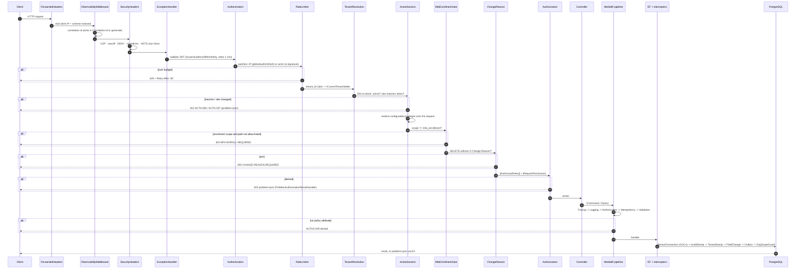
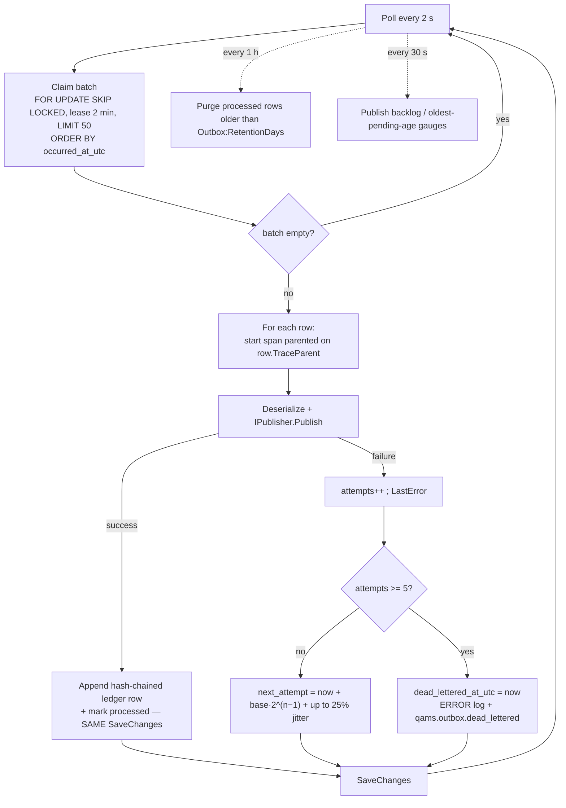
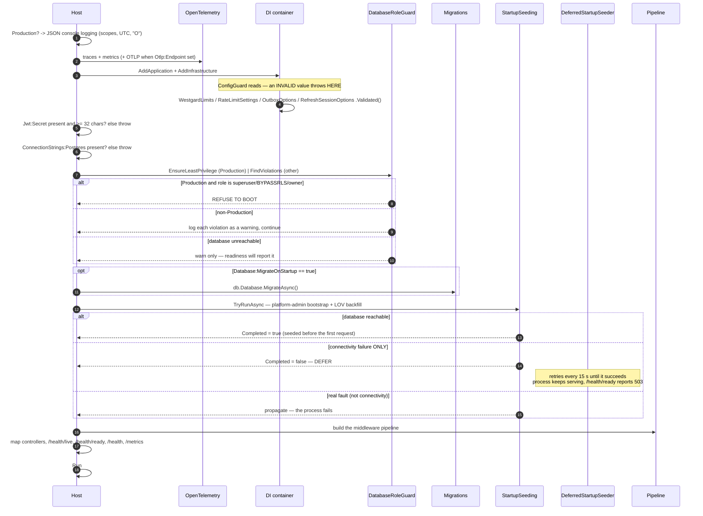
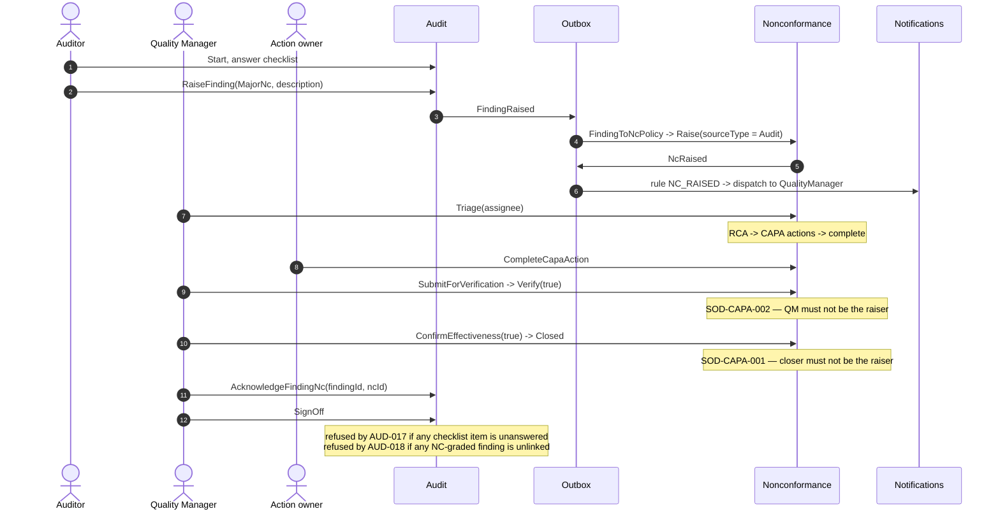
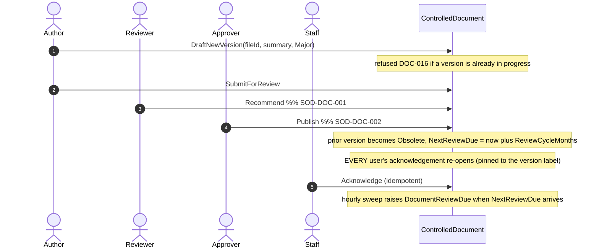
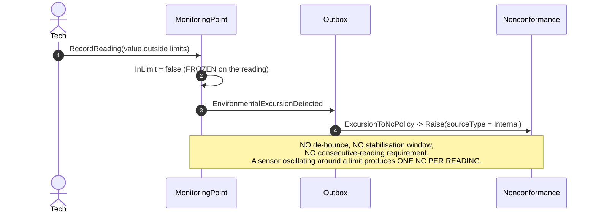
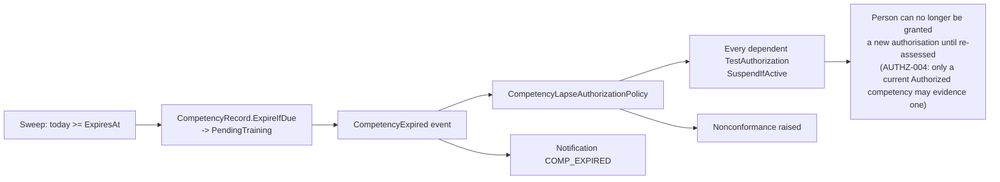

# NT.QMS — Production Software Requirements Specification
## Document 06 · Workflow Specification

> [Conventions](00-SRS-Index-and-Conventions.md) · Rules behind each transition:
> [Document 03](03-Business-Rules.md) · Module context: [Document 02](02-1-Functional-Specification-Quality-and-Improvement.md)

This document is the consolidated process reference: **every state machine as a transition table**
(the diagrams live in Document 02 with their modules), **every asynchronous process**, the
**request pipeline**, the **start-up sequence**, and **failure/recovery scenarios**.

A transition table is normative in a way a diagram is not: it states the guard, the actor, the
refusal code and the emitted event for every legal and illegal move.

---

# 6.1 State-machine index

| ID | Aggregate | States | Terminal | Diagram |
|---|---|---:|---|---|
| WF-01 | Nonconformance | 9 | Closed, Rejected | [02-1 M-01](02-1-Functional-Specification-Quality-and-Improvement.md) |
| WF-02 | Complaint | 8 | Closed, Invalid | 02-1 M-02 |
| WF-03 | FeedbackEntry | 4 | Closed, Escalated | 02-1 M-03 |
| WF-04 | QualityObjective | 4 | Achieved, Missed, Cancelled | 02-1 M-04 |
| WF-05 | QualityPolicy | 3 | Superseded | 02-1 M-05 |
| WF-06 | Audit | 3 | SignedOff | 02-1 M-06 |
| WF-07 | ChangeRequest | 5 | Rejected, Reviewed | 02-1 M-07 |
| WF-08 | ManagementReview | 2 | Closed | 02-1 M-08 |
| WF-09 | ControlledDocument + DocumentVersion | 3 + 6 | Obsolete / Retired, Rejected | 02-1 M-09 |
| WF-10 | ArchiveEntry | 3 (+ hold flag) | Disposed | 02-1 M-10 |
| WF-11 | EquipmentItem | 4 | Retired | 02-2 M-11 |
| WF-12 | ReferenceStandard | 4 | Retired | 02-2 M-12 |
| WF-13 | MonitoringPoint | 3 | Retired | 02-2 M-13 |
| WF-14 | Supplier | 3 | Suspended | 02-2 M-14 |
| WF-15 | CompetencyRecord | 4 | Revoked | 02-2 M-15 |
| WF-16 | TrainingAssignment | 2 | Completed | 02-2 M-16 |
| WF-17 | TestAuthorization | 4 | Expired, Revoked | 02-2 M-17 |
| WF-18 | Role | 2 | — | 02-2 M-19 |
| WF-19 | RiskItem | 3 | Closed | 02-2 M-20 |
| WF-20 | ConflictDeclaration | 3 | Closed | 02-2 M-21 |
| WF-21 | InterestedParty / ContextIssue | 2 / 2 | Archived / Closed | 02-2 M-22 |
| WF-22 | UserAccessReview / AuditTrailReview | 2 / 2 | Completed | 02-2 M-23/M-24 |
| WF-23 | Analytical study (×12) | 3 | SignedOff | 02-3 §3.0 |
| WF-24 | ValidationStudy | 4 | SignedOff | 02-3 §26.1 |
| WF-25 | SigmaAssessment | 2 | SignedOff | 02-3 §26.12 |
| WF-26 | UncertaintyBudget | 3 | Approved | 02-3 §26.13 |
| WF-27 | PtPlan / PtEnrollment | 3 / 2 | Closed / graded | 02-3 M-27 |
| WF-28 | WorkTask | 2 | Completed | 02-4 M-28 |
| WF-29 | EscalationTimer | 4 levels | level 3 | 02-4 M-28 |
| WF-30 | NotificationDispatch | 3 | Sent, Failed | 02-4 M-29 |
| WF-31 | DocumentControlledCopy | 3 | Returned, Destroyed | 02-1 M-09 |
| WF-32 | Tenant | 4 | Terminated | 02-4 M-33 |
| WF-33 | RefreshSession | 4 | Revoked, FamilyRevoked | 02-4 M-34 |
| WF-34 | OutboxEvent | 4 | Processed, DeadLettered | §6.4 below |

**34 state machines.** All are guarded inside their aggregate; none is enforced by a handler,
validator or UI.

---

# 6.2 Transition tables

Format: **From → To** on *Action*, guarded by *Guard*, refused with *Code*, emitting *Event*.

## WF-01 · Nonconformance & CAPA

| From | Action | To | Actor | Guard | Refusal | Event |
|---|---|---|---|---|---|---|
| — | `Raise` | Draft | any | title required; severity & likelihood 1–5 | `NC-001`, `NC-002` | — |
| Draft | `Submit` | Raised | any | — | — | `NcRaised` |
| Raised | `Triage(assignee)` | Assigned | `nc.approve` | — | — | `NcTriaged` |
| Raised / Assigned | `Reject(reason)` | **Rejected** | `nc.void` | reason required | `NC-013` | `NcRejected` |
| Assigned | `RecordRca` | Rca | any | state; analysis required | `NC-014`, `NC-015` | — |
| Rca / ActionPlan | `PlanCapaAction` | ActionPlan | any | state; details required; owner required | `NC-016`, `NC-017` | `CapaActionPlanned` |
| ActionPlan | `CompleteCapaAction` | ActionPlan | any | action exists; not already complete | `CAPA-001`, `CAPA-002` | `CapaActionCompleted` |
| ActionPlan | `SubmitForVerification` | PendingVerification | any | ≥1 action; **all** complete | `NC-019`, `NC-020` | — |
| PendingVerification | `Verify(true)` | EffectivenessCheck | `nc.approve` | **actor ≠ raiser** | `SOD-CAPA-002` | `NcVerified` |
| PendingVerification | `Verify(false)` | **ActionPlan** | `nc.approve` | actor ≠ raiser | `SOD-CAPA-002` | — |
| EffectivenessCheck | `ConfirmEffectiveness(true)` | **Closed** | `nc.approve` | **actor ≠ raiser** | `SOD-CAPA-001` | `NcClosed` |
| EffectivenessCheck | `ConfirmEffectiveness(false)` | **ActionPlan** | `nc.approve` | actor ≠ raiser | `SOD-CAPA-001` | — |

**Illegal moves** all raise `InvalidStateTransitionException` → HTTP 409 with the state named.

## WF-09 · Controlled document (version-level)

| From | Action | To | Actor | Guard | Refusal | Event |
|---|---|---|---|---|---|---|
| — | `Create` | v1.0 Draft | any | code pattern + unique; title; fileId | `DOC-001`, `DOC-002`, `DOC-003` | — |
| Draft | `SubmitForReview` | UnderReview | any | — | — | `DocumentSubmittedForReview` |
| UnderReview | `Recommend` | Approved | `documents.approve` | **actor ≠ author** | `SOD-DOC-001` | `DocumentRecommended` |
| UnderReview / Approved | `RejectVersion(reason)` | **Rejected** | `documents.approve` | reason; correct state | `DOC-012`, `DOC-013` | `DocumentVersionRejected` |
| Approved | `Publish` | Published | `documents.sign` | **actor ≠ author** | `SOD-DOC-002` | `DocumentPublished` + `DocumentVersionObsoleted`(prior) |
| Published (doc) | `DraftNewVersion(bump)` | new Draft | any | doc is Published; no version in progress; not retired | `DOC-017`, `DOC-016`, `DOC-015` | — |
| Published (doc) | `MarkReviewDueIfReached` | Published | **sweep** | `today ≥ NextReviewDue` and not already raised | — | `DocumentReviewDue` |
| Published (doc) | `ConfirmPeriodicReview` | Published | `documents.sign` | doc is Published | `DOC-020` | `DocumentReviewConfirmed` |
| any (doc) | `Retire` | **Obsolete/Retired** | `documents.void` | not already obsolete | `DOC-018` | `DocumentRetired` |

## WF-11 · Equipment (mixed manual + time-driven)

| From | Action | To | Trigger | Event |
|---|---|---|---|---|
| — | `Register` | NeedsCalibration | manual | — |
| any but Retired | `LogCalibration` | **Active** | manual | `EquipmentReturnedToService` (only when previously OutOfService) |
| Active | `MarkCalibrationDue` | NeedsCalibration | **sweep**, `today ≥ NextCalibrationDue` | `CalibrationDue` |
| NeedsCalibration | `LockOutIfGraceExhausted` | **OutOfService** | **sweep**, `today ≥ due + grace` | `EquipmentLockedOut` |
| any but Retired | `LogMaintenance` | unchanged | manual | — |
| any but Retired | `RecordIntermediateCheck` | unchanged | manual | `IntermediateCheckFailed` when `passed = false` |
| any | `Retire` | **Retired** | `equipment.void` | `EquipmentRetired` |
| Retired | any operation | — | refused `EQP-010/012/014/020` | — |

## WF-15 · Competency (with downstream cascade)

| From | Action | To | Guard | Refusal | Event | Cascade |
|---|---|---|---|---|---|---|
| — | `Assign` | PendingTraining | subject; validity 1–60 | `COMP-001`, `COMP-002` | — | — |
| PendingTraining | `ScoreAssessment(≥80)` | **Evaluated** | **assessor ≠ trainee**; 0–100 | `SOD-COMP-001`, `COMP-011` | — | — |
| PendingTraining | `ScoreAssessment(<80)` | PendingTraining | as above | — | — | — |
| Evaluated | `Authorize` | Authorized | **actor ≠ trainee** | `SOD-COMP-001`, `COMP-012` | `CompetencyAuthorized` | — |
| Authorized | `ExpireIfDue` | **PendingTraining** | **sweep**, `today ≥ ExpiresAt` | — | `CompetencyExpired` | **suspends dependent test authorisations + raises an NC** |
| Authorized | `Revoke(reason)` | **Revoked** | `competencies.void`; reason | `COMP-013`, `COMP-014` | `CompetencyRevoked` | **same cascade** |

## WF-23 · Analytical study (generic, ×12)

| From | Action | To | Guard | Refusal |
|---|---|---|---|---|
| — | `Configure` | DataEntry | module parameters valid | `{P}-001…004` |
| DataEntry / Calculated | `Add<point>` | DataEntry | editable | `{P}-01x` when signed |
| DataEntry / Calculated | `Remove<point>` | DataEntry | editable; **`X-Change-Reason` header required** | `CHANGE-REASON-REQUIRED`, `{P}-404` |
| DataEntry / Calculated | `Calculate` | **Calculated** | module minimum data met | `{P}-010`, `{P}-011`, `{P}-012` |
| Calculated | `SignOff` | **SignedOff** | **signer ≠ preparer** | `SOD-AQ-001`, `{P}-01x` |
| SignedOff | anything | — | refused in domain **and by the database trigger** | `{P}-01x` / SQL error |

## WF-34 · Outbox event

| From | Action | To | Guard |
|---|---|---|---|
| — | written in the aggregate's transaction | Pending | — |
| Pending | claimed | Claimed (lease 2 min) | `processed IS NULL AND dead_lettered IS NULL AND next_attempt <= now AND (claim lease lapsed)` |
| Claimed | publish succeeds | **Processed** | ledger row appended in the same `SaveChanges` |
| Claimed | publish fails, `attempts < 5` | Pending | `next_attempt = now + backoff` |
| Claimed | publish fails, `attempts ≥ 5` | **DeadLettered** | ERROR log + `qams.outbox.dead_lettered` metric |
| Claimed | processor crashes | Pending | lease lapses after 2 min, row is reclaimable |
| Processed | older than `Outbox:RetentionDays` | **deleted** | hourly purge |
| DeadLettered | operator clears `dead_lettered_at_utc` + `attempts` | Pending | manual replay |

---

# 6.3 Request pipeline (`WF-P1`)

**Ordering constraints that must be preserved on any rebuild:**

1. `UseRateLimiter` **after** `UseAuthentication` — the e-signature policy partitions on the `sub`
   claim, which does not exist before authentication.
2. `TenantResolution` **before** `ActiveSession` — the session check queries a tenant-filtered table.
3. `ChangeReason` **before** `UseAuthorization` — a DELETE with no reason must be refused before any
   handler or policy runs.
4. `TenantConnectionInterceptor` **first** among EF interceptors — the GUCs must be set on the
   connection before any query the other interceptors trigger, or RLS filters their own reads.
5. `ObservabilityMiddleware` **first** overall — the canonical completion log and correlation id must
   cover responses produced by the exception handler itself.

---

# 6.4 Asynchronous processes

## WF-P2 · Outbox delivery

| Property | Value | Why it is specified this way |
|---|---|---|
| Claim | `FOR UPDATE SKIP LOCKED` + lease stamp | concurrent claimants get **disjoint** rows; a crashed claimant's rows become reclaimable when the 2-minute lease lapses |
| Ordering | `ORDER BY occurred_at_utc` | causal order within the queue |
| Backoff | `5 s × 2^(attempts−1)` **plus up to 25 % additive jitter** | jitter prevents a burst of failures retrying in lock-step |
| Retry ladder | ≈5 s → 10 s → 20 s → 40 s (each +0–25 %) | 5 attempts total |
| Ledger append | in the **same** `SaveChanges` as marking processed | an event cannot be delivered without being chained into the tamper-evident trail |
| Tenancy | the batch runs **elevated** | one batch chains rows for many tenants |
| Tracing | span parented on the persisted `traceparent` | HTTP → MediatR → EF → outbox share one trace id |
| Non-PostgreSQL | the same due-filter without the cross-process lock | unit tests use the in-memory provider |

## WF-P3 · Compliance sweep (hourly)

Start-up delay **15 s** ("so migrations/bootstrap finish first"), then every **1 hour**:

```mermaid
flowchart LR
  A["Elevate (RLS bypass for this unit of work)"] --> B{"Advisory lock<br/>ComplianceSweep acquired?"}
  B -->|no| Z["skip this round<br/>(another instance is leader)"]
  B -->|yes| C["1 · Equipment: Active && due<br/>→ MarkCalibrationDue"]
  C --> D["2 · Equipment: NeedsCalibration<br/>→ LockOutIfGraceExhausted"]
  D --> E["3 · Competencies: Authorized && expired<br/>→ ExpireIfDue"]
  E --> F["4 · TestAuthorizations: Active|Suspended && expired<br/>→ ExpireIfDue"]
  F --> G["5 · Suppliers: Approved && any cert expired<br/>→ SuspendIfCertificateExpired"]
  G --> H["6 · ReferenceStandards: Active && expired<br/>→ MarkExpiredIfReached"]
  H --> I["7 · Documents: Published && !ReviewDueRaised && due<br/>→ MarkReviewDueIfReached"]
  I --> J["8 · EscalationTimers: Active && NextStep <= now<br/>→ AdvanceIfDue"]
  J --> K["ONE SaveChanges for all eight"]
  K --> L["RecordJobSuccess('compliance-sweep')"]
```

**Eight ageing operations in one transaction.** Every query uses `IgnoreQueryFilters()` because the
sweep is cross-tenant. Failures are caught, logged at ERROR (`"Scheduled sweep failed"`) and retried on
the next interval — **the loop never dies**.

Because the interval is one hour, **every time-based transition in the system has up to one hour of
latency**. That is the system's temporal resolution: calibration lock-out, competency expiry,
certificate suspension, document review-due and escalation all land within an hour of their threshold,
never at the instant.

## WF-P4 · KPI snapshot (6-hourly)

Start-up delay 20 s, then every 6 h. Elevates, takes the `KpiSnapshot` advisory lock, and for **every
`Active` tenant** upserts one row per **date** — an existing row for today is updated. Records
`qams.job.last_success_timestamp_seconds{job="kpi-snapshot"}`.

## WF-P5 · Single-replica sentinel

Attempts `AdvisoryLockKeys.SingleReplicaSentinel` at start-up. If acquired it holds it for the process
lifetime (`Task.Delay(Infinite)`). If not, it logs a warning and retries every **60 s** — a second
instance is detected and reported, not prevented.

---

# 6.5 Start-up sequence (`WF-P6`)

**OPS-010 — the crash that this design fixes.** A cold start with PostgreSQL unreachable used to
*crash*: two unconditional database reads (platform-admin bootstrap and the LOV backfill) ran before
the host listened. Every prior readiness test took the database down *after* startup, and the
functional test host swaps EF for an in-memory provider, so nothing caught it. The rule now is:

> **Only a connectivity failure defers. A real fault still propagates.**

Verified behaviour: the host starts; `/health/live` 200 and `/health/ready` 503; when PostgreSQL
returns, readiness goes 200 **and the deferred seeding completes without a restart**.

`MigrateOnStartup = true` deliberately still fails fast — it is a schema gate, and it must stay off in
production.

---

# 6.6 Failure and recovery scenarios

| # | Failure | Detection | Behaviour | Recovery | Verified |
|---|---|---|---|---|---|
| **F-01** | PostgreSQL unreachable at cold start | `PostgresReadinessHealthCheck` | `/health/live` 200, `/health/ready` **503**; seeding defers, retries every 15 s | automatic on DB return, **no restart** | ✅ OQ addendum B (OPS-010) |
| **F-02** | PostgreSQL lost while running | readiness check + Npgsql errors | in-flight requests fail with 500/503; readiness 503 sheds traffic; the **process stays alive** so a DB blip does not recycle it | automatic | partially — sandbox denies stopping the service |
| **F-03** | Transient DB fault (deadlock, timeout) | Npgsql | **5 retries, max 10 s delay**; user-initiated transactions wrap in the execution strategy | automatic | ✅ |
| **F-04** | Statement hangs | `CommandTimeout(30)` | request fails at 30 s rather than pinning a thread | automatic | ✅ |
| **F-05** | Concurrent edit of the same row | `xmin` mismatch | **409 `CONCURRENCY-409`** | client re-reads and retries | ✅ |
| **F-06** | Duplicate command submission | `Idempotency-Key` | the stored result is returned; the effect happens once | automatic | ✅ |
| **F-07** | Domain-event handler throws | outbox catch | `attempts++`, exponential backoff + jitter; after 5 attempts **dead-letter** with an ERROR log and a metric | operator clears `dead_lettered_at_utc` + `attempts` to replay | ✅ poison→dead-letter drill run live |
| **F-08** | Outbox processor crashes mid-batch | claim lease | claimed rows become reclaimable after **2 minutes** | automatic | ✅ by design |
| **F-09** | SMTP unreachable | dispatcher catch | dispatch marked **`Failed`** with the error; warning logged; **the in-app notification still exists**; **no e-mail retry** | manual | — |
| **F-10** | SMTP not configured | `Smtp:Host` empty | `LoggingEmailSender` bound — e-mails go to the log and are marked *sent*, **silently** | operator must notice | — |
| **F-11** | Second application instance started | advisory-lock sentinel | warning logged, retries every 60 s; **scheduled work stays single-leader** via per-job advisory locks | operator stops the extra instance | ✅ |
| **F-12** | Over-privileged DB role in Production | `DatabaseRoleGuard` | **refuses to boot** | fix the role per `harden-runtime-role.sql` | ✅ OQ-DEP-01 |
| **F-13** | Invalid configuration value | `ConfigGuard` / `Validated()` | **refuses to boot**, naming the key and the bad value | fix the value | ✅ |
| **F-14** | Credential guessing | auth rate limiter + lockout | 10/min per address → 429; 5 failures → **30-minute lockout**; every failure logged | automatic | ✅ — note a PG-down + burst combination locks the account for 30 minutes |
| **F-15** | PIN guessing on e-signature | e-signature limiter + shared lockout | 10/min **per actor** → 429; failures logged `ESIGN_FAILED`; the account can lock | automatic | ✅ |
| **F-16** | Refresh-token theft and replay | reuse detection | **the whole refresh family is revoked** | user signs in again | ✅ proven live |
| **F-17** | Account deactivated with a live token | `ActiveSessionMiddleware` | the **next** request returns 401 `AUTH-006` | immediate | ✅ |
| **F-18** | Malicious upload (renamed executable) | `FileContentPolicy` | refused — extension allow-list **and** signature sniff; the client's content type is never stored | — | ✅ |
| **F-19** | Missing stored file object | `LocalFileStorage.OpenReadAsync` | `FileNotFoundException` → 500 | restore from backup | — |
| **F-20** | Tenant GUC unresolved | fail-closed interceptor | queries return **no rows** rather than all rows | — | ✅ |
| **F-21** | Attempted tamper with a signed record | DB trigger | PostgreSQL rejects the `UPDATE`/`DELETE` | — | ✅ |
| **F-22** | Attempted tamper with the audit trail | append-only trigger + hash chain | rejected; `chain-verification` would report a break | — | ✅ audit-tamper tests |
| **F-23** | Data loss / corruption | — | restore per `BACKUP-RESTORE-DR.md` (WAL PITR, RPO ≤ 5 min, RTO ≤ 4 h) — **restore verification includes audit-chain verification** | manual runbook | ❌ **`[Not Executed]`** — no restore drill has been run |
| **F-24** | File storage lost | — | **files are NOT in the database dump** — they need their own backup | manual | ❌ `[Not Executed]` |

## Recovery gaps

| Gap | Impact |
|---|---|
| No e-mail retry | a transient SMTP outage permanently loses the e-mail channel for those events |
| No automated restore drill | RPO/RTO are documented, not proven |
| No file-storage backup automation | `deploy/backup.sh` covers PostgreSQL; the evidence blobs are a separate manual concern |
| Silent SMTP degradation | no operator signal when mail is log-only |
| Dead-letter replay is manual SQL | no endpoint, no UI |

---

# 6.7 End-to-end business journeys

## J-1 · Audit finding → NC → CAPA → closure

## J-2 · SOP revision and re-acknowledgement

## J-3 · Environmental excursion → NC (the alert-fatigue path)

## J-4 · Competency lapse cascade

---

# 6.8 Workflow acceptance criteria

| ID | Criterion |
|---|---|
| **AT-WF-01** | Every illegal transition returns **409** naming the current state; every rule violation returns **422** with its code. |
| **AT-WF-02** | An NC failing verification returns to `ActionPlan`, never to `Closed`. |
| **AT-WF-03** | Publishing document v2 leaves v1 `Obsolete` and re-opens acknowledgement for every user. |
| **AT-WF-04** | Equipment with interval 365 / grace 30 is `NeedsCalibration` on day 365 and `OutOfService` on day 395 — both within one sweep interval of the threshold. |
| **AT-WF-05** | A competency expiry suspends dependent test authorisations **and** raises an NC. |
| **AT-WF-06** | A poisoned outbox event dead-letters after exactly 5 attempts with an ERROR log and a metric increment. |
| **AT-WF-07** | Two instances started against one database: exactly one runs each sweep round; the other logs the sentinel warning. |
| **AT-WF-08** | Cold start with PostgreSQL down: process alive, `/health/ready` 503, seeding completes on DB return **without a restart**. |
| **AT-WF-09** | An escalation timer fires at +24 h to the owner, +48 h and +72 h to `QualityManager`, then stops. |
| **AT-WF-10** | Removing an analytical data point without `X-Change-Reason` returns 400; with it, the ledger row carries the reason. |
