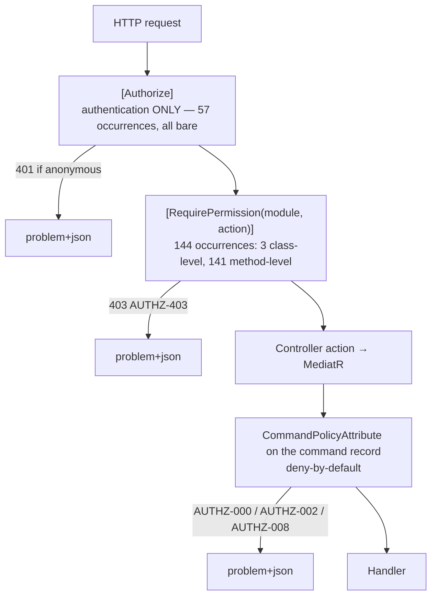

# NT.QMS — Production Software Requirements Specification
## Document 08 · API Specification

> [Conventions](00-SRS-Index-and-Conventions.md) · Authorisation model:
> [Document 09 §9.4](09-Security-Specification.md) · Business meaning of each endpoint:
> [Document 02](02-1-Functional-Specification-Quality-and-Improvement.md)

**329 route actions** across **54 controllers**, each exposed at **two paths** (unversioned and
versioned) → **658 routable paths**, pinned by the `ApiSurface.approved.txt` merge gate.

---

# 8.1 API conventions

| ID | Convention |
|---|---|
| **API-001** | **Dual routing.** Every literal `api/…` route is *also* published at `api/v{version:apiVersion}/…` by a single application-model convention (`VersionedRouteConvention`) — not by editing controllers. Controllers carry **no** version attributes, so they are implicitly **v1.0**; unversioned legacy paths keep working through `AssumeDefaultVersionWhenUnspecified`. Responses carry the reported API versions. Evolution policy: `docs/adr/ADR-0004`. |
| **API-002** | **Rate limiting** — fixed 1-minute window, `QueueLimit = 0`. Global 300/min per client address; `/api/auth/*` 10/min; `/api/auth/refresh` 60/min; e-signature ceremonies 10/min **per actor**. Rejection is **429** with `Retry-After: 60`. Health probes and `/metrics` are exempt. |
| **API-003** | **One error contract.** Every failure path emits RFC 7807 `application/problem+json` through a **single writer** (`ProblemResponse`) — including framework 401/403, which are routed through `ProblemAuthorizationResultHandler`. Anonymous-object error shapes are banned. |
| **API-004** | **Pagination envelope.** Paged lists return `{ items, total, page, pageSize }`. `PageRequest.Normalized` **clamps** out-of-range input (`page ≥ 1`, `pageSize` clamped to **1…200**) rather than erroring — a hostile `pageSize` can never become an unbounded query. Default page size **50**. |
| **API-005** | **Upload allow-list + content sniffing** — see [Document 02 M-35](02-4-Functional-Specification-Operations-and-Platform.md). |
| **API-006** | **Deny-by-default authorisation** at both the HTTP gate (`[RequirePermission]`) and the command gate (`CommandPolicyAttribute`). |
| **API-007** | **Same-origin only.** No CORS policy is registered (ADR-0007). A cross-origin client cannot call this API. |
| **API-008** | **Idempotency.** A repeated command carrying the same `Idempotency-Key` header returns the stored result instead of re-executing. |
| **API-009** | **Reason for change.** Every `DELETE` requires `X-Change-Reason`, refused with 400 `CHANGE-REASON-REQUIRED` before any handler runs. |
| **API-010** | **Correlation.** `X-Correlation-Id` is echoed if supplied, generated otherwise; every problem body carries `traceId` and `correlationId`. |
| **API-011** | **Concurrency.** `xmin`-based optimistic concurrency; a stale write returns 409 `CONCURRENCY-409` (ADR-0005). |
| **API-012** | **Surface snapshot gate.** Any route addition, removal or rename must update `tests/NT.QAMS.WebApi.FunctionalTests/ApiSurface.approved.txt` **in the same commit**, or CI fails. |

## Media types

| Direction | Type |
|---|---|
| Request (normal) | `application/json` |
| Request (upload) | `multipart/form-data` |
| Response (success) | `application/json`, or `…spreadsheetml.sheet` / `application/pdf` for exports |
| Response (error) | **`application/problem+json`** — always |

## Headers

| Header | Direction | Purpose |
|---|---|---|
| `Authorization: Bearer <jwt>` | in | access token (SPA memory only) |
| `Cookie: qams_rt=…` | in | refresh cookie — **only** on `/api/auth/*` (Path-scoped), httpOnly, Secure, SameSite=Strict |
| `X-Change-Reason` | in | **required on every DELETE**; honoured on other verbs if present |
| `Idempotency-Key` | in | optional replay protection on commands |
| `X-Correlation-Id` | in/out | echoed or generated |
| `X-Forwarded-For` / `-Proto` | in | from the reverse proxy; restores the real client address and scheme |
| `Retry-After` | out | on 429, always `60` |
| `Content-Security-Policy` | out | `default-src 'none'; frame-ancestors 'none'; base-uri 'none'; form-action 'none'` |
| `X-Content-Type-Options` | out | `nosniff` |
| `X-Frame-Options` | out | `DENY` |
| `Referrer-Policy` | out | `no-referrer` |
| `Strict-Transport-Security` | out | `max-age=63072000; includeSubDomains` — **non-Development only** |

---

# 8.2 The authorisation model (as built at v1.51)

> **This changed materially and the repository documentation has not all caught up.** The role-list
> gate has been replaced by a permission gate. A rebuild must implement the *current* model.

## Two gates, two layers



## Gate 1 — HTTP: `[RequirePermission(module, action)]`

Replaced `[Authorize(Roles = …)]` entirely. The rationale, quoted from the attribute's own
documentation:

> *"Roles are tenant data now, so the endpoint can no longer name the roles that reach it — it names
> the capability it represents, and whichever roles the laboratory has granted that capability are the
> roles that get through."*

- Checks `IUserPrivileges.Has(permissionKey)` — resolved per request by `ActiveSessionMiddleware`.
- An **unauthenticated** caller passes straight through this filter: authentication is `[Authorize]`'s
  job and runs first, so an anonymous caller sees **401**, not 403.
- A caller who is authenticated but unprivileged gets **403** with code `AUTHZ-403` — the same code and
  the same problem+json shape the framework handler emits, so the SPA has one path to handle.

**Measured usage:** 144 `[RequirePermission]` attributes — **3 at class level** (`AccessReviewsController`
and two others gate the whole controller) and **141 at method level**.

## Gate 2 — Command: `CommandPolicyAttribute`

Every one of the **215 commands** carries exactly one policy attribute. An unannotated command is
denied at runtime (`AUTHZ-000`) **and** fails the `CommandPolicyTests` CI gate.

| Policy | Count | Meaning |
|---|---:|---|
| `[RequireInternalActor]` | **193** | any authenticated internal actor — **every role except `ExternalAuditor`**. The default for write commands: *auditors read the quality ledger, they never mutate it.* |
| `[RequirePermissionPolicy(module, action)]` | **12** | only actors whose tenant-configured role grants this permission key. The composed key is validated against the catalogue, so a drifted module key **fails every call loudly** instead of denying quietly (`AUTHZ-008`). |
| `[RequireAuthenticatedActor]` | **4** | any authenticated actor **including** the external auditor — reserved for self-service account security (MFA enrolment, e-signature PIN). |
| `[AllowUnauthenticated]` | **4** | runs without an authenticated actor **by design** (login, refresh, logout, expired-password rotation). The handler carries its own credential checks. |
| `[RequireRole(...)]` | **1** | only the listed `UserRole` values. |

## What remains of the role model

| Item | Status |
|---|---|
| `[Authorize]` (bare, authentication only) | **57** occurrences — the live mechanism |
| `[Authorize(Roles = …)]` | **exactly one**: `Roles.PlatformAdmin` on `TenantsController` |
| `Roles.PlatformAdmin` | live (that one use) |
| `Roles.TenantAdmin/QualityManager/DepartmentHead/Analyst/ExternalAuditor` | **unused** |
| `Roles.QmOrAdmin`, `QmDeptAdmin`, `QmAdminAuditor`, `TenantAdminOnly` | **dead code** — referenced only as *label strings* inside `RoleEndpointMatrixTests`, never as attribute arguments |
| `UserRole` enum | still live: carried in the JWT `role` claim, re-checked every request by `ActiveSessionMiddleware`, and used by `[RequireInternalActor]` (to exclude `ExternalAuditor`) and `[RequireRole]` |

> **Consequence for a rebuild:** *"which roles can call endpoint X"* is **no longer answerable from the
> code**. It is answerable only from the tenant's own role→permission configuration. The endpoint
> declares a capability; the laboratory decides who holds it. The one exception is the platform
> control plane, which is still hard-gated on `PlatformAdmin`.

---

# 8.3 Error contract

```json
{
  "type":    "about:blank",
  "title":   "Segregation of duties: the raiser cannot verify their own nonconformance.",
  "status":  422,
  "code":    "SOD-CAPA-002",
  "traceId": "0af7651916cd43dd8448eb211c80319c",
  "correlationId": "6b2f0e1c-..."
}
```

| Field | Always present | Source |
|---|---|---|
| `status` | ✅ | per §3.3 of [Document 03](03-Business-Rules.md) |
| `title` | ✅ | the domain message |
| `code` | ✅ on domain/middleware errors | the structured refusal code (411 of them) |
| `traceId` | ✅ | `Activity.Current.TraceId`, else `HttpContext.TraceIdentifier` |
| `correlationId` | when set | `X-Correlation-Id` (echoed or generated) |
| `errors` | on validation failures | per-field FluentValidation messages |

## Status codes in use

| Status | When |
|---|---|
| 200 | successful read, or a command returning a value |
| 201 | resource created (`POST /api/tenants`, `POST /api/files`) |
| 204 | successful command with no body |
| 400 | validation failure · `CHANGE-REASON-REQUIRED` · upload refusal |
| 401 | no/invalid token · `AUTH-006` inactive account · `AUTH-007` role changed · `AUTH-008/009` session revoked/expired |
| 403 | `AUTHZ-403` insufficient privilege · `MFA-ENROLL-REQUIRED` · command-policy denial |
| 404 | `*-404` not found (**also returned for cross-tenant ids — RLS makes them invisible, not forbidden**) |
| 409 | `InvalidStateTransitionException` · `CONCURRENCY-409` |
| 422 | `DomainException` — business-rule violation |
| 429 | rate limit exceeded (`Retry-After: 60`) |
| 500 | unhandled — never carries domain detail |
| 503 | `/health/ready` when PostgreSQL is unreachable |

> **Security property:** a cross-tenant identifier returns **404, not 403** — because row-level
> security makes the row invisible, the handler genuinely cannot find it. Tenant membership is
> therefore not probeable through status codes.

---

# 8.4 Non-controller endpoints

| Route | Auth | Rate-limited | Purpose |
|---|---|---|---|
| `GET /health/live` | anonymous | **exempt** | liveness — **no checks at all**; a database outage must recycle traffic, not the process |
| `GET /health/ready` | anonymous | **exempt** | readiness — 503 while PostgreSQL is unreachable; the container `HEALTHCHECK` target |
| `GET /health` | anonymous | **exempt** | legacy liveness alias for existing probes/scripts |
| `GET /metrics` | anonymous | **exempt** | Prometheus scrape — measurements only, no tenant data |
| `GET /openapi/...` | anonymous | — | **Development only** |

---

# 8.5 Anonymous endpoints (the unauthenticated attack surface)

Exactly **five** controller routes are anonymous, all on `AuthController`, all behind the strict
10/min auth limiter (refresh gets its own 60/min policy):

| Route | Why anonymous | Risk note |
|---|---|---|
| `GET /api/auth/workspace/{slug}` | read before any credential exists | returns **the laboratory name only**; unknown, malformed and non-active slugs all answer **404 identically** so tenant state cannot be probed |
| `POST /api/auth/login` | obviously | `AUTH-001` "Invalid credentials." is deliberately non-specific |
| `POST /api/auth/refresh` | **the cookie is the credential**; the access token is expected to be expired | reuse of a rotated token revokes the whole family |
| `POST /api/auth/logout` | must work with an expired access token | idempotent; no cookie still returns 204 |
| `POST /api/auth/change-password` | **so an EXPIRED password can still be changed** | the handler verifies full credentials. **This is an unauthenticated credential-verification oracle** — see [Document 09](09-Security-Specification.md) |

---

# 8.6 Pagination

**13 endpoints** are paged; the rest return the full filtered set.

```
GET /api/nonconformances?status=Raised&search=pump&page=2&pageSize=50
→ 200 { "items": [ … ], "total": 137, "page": 2, "pageSize": 50 }
```

| Property | Value |
|---|---|
| Default page size | **50** |
| Maximum page size | **200** — clamped, never rejected |
| Minimum page | **1** — clamped |
| Total | a `COUNT` over the same filtered query |
| Ordering | applied by the query before paging (`ToPagedAsync` is a terminal operator on an **ordered** projection) |
| Legacy shape | the pre-envelope bare-array response is still served on some routes; `ContractCoverageTests` pins **both** shapes for all 13 lists |

**Paged:** nonconformances · documents · audits · risks · changes · management-reviews · suppliers ·
equipment · competencies · training-assignments · archives · tasks/mine · notifications/mine
(+ notifications/monitor).

**Not paged (returns everything):** complaints, feedback, conflicts, monitoring-points,
reference-standards, test-authorizations, quality-objectives, quality-policy, org-context (both),
sla-definitions, roles, users, users/directory, access-reviews, lovs, branches, departments,
test-catalog, proficiency-tests, pt-plans, uncertainty-budgets, and every analytical study list.

> `take`-style bounds (compliance reads 200, exports 1000, QC runs 60, KPI history 90 days) are
> **defaults, not maxima** — they are not clamped. See [Document 14](14-Technical-Debt-Report.md).

---

# 8.7 Idempotency

```
POST /api/nonconformances
Idempotency-Key: 4f1e2c9a-...
```

Handled by `IdempotencyBehavior` in the MediatR pipeline, backed by `EfIdempotencyStore`.
The header is read by `HeaderIdempotencyKeyAccessor` (registered in the WebApi); background scopes get
`NullIdempotencyKeyAccessor` because they have no HTTP context.

| Behaviour | Detail |
|---|---|
| Absent key | no replay protection — normal execution |
| First call with a key | executes, stores the result |
| Repeat with the same key | **returns the stored result; the effect happens once** |
| Scope | per key; **`[Assumption]`** the store is not purged on any schedule |

---

# 8.8 Versioning and evolution (ADR-0004)

| Rule | Detail |
|---|---|
| Current version | **v1.0** (implicit) |
| Reader | `UrlSegmentApiVersionReader` |
| Default assumed | yes — unversioned paths resolve to v1.0 |
| Reported | `ReportApiVersions = true` |
| Adding a route | must appear in `ApiSurface.approved.txt` in the same commit |
| Breaking a contract | requires a new version segment; the v1 path must keep working |
| Non-breaking additions | new optional fields, new endpoints — no version bump |

---

# 8.9 Export endpoints

| Route | Media type | Permission | Notes |
|---|---|---|---|
| `GET /api/exports/nonconformances.xlsx` | XLSX | *(NC read)* | NC register |
| `GET /api/exports/audit-trail.xlsx?take=1000` | XLSX | `compliance.export` | audit trail + field changes + **live Integrity Attestation sheet** + reason column |
| `GET /api/exports/signatures.xlsx?take=1000` | XLSX | `compliance.export` | e-signature manifest |
| `GET /api/exports/review-pack/{reviewId}.pdf` | PDF | `reviews.export` | review + dashboard KPIs + NC Pareto |

Every export writes a `RECORD_EXPORTED` security event. **XLSX is the only tabular format** — a
parallel CSV endpoint set was built and deliberately reverted; do not reintroduce one.

---

# 8.10 Contract testing

| Gate | What it proves |
|---|---|
| `ApiSurface.approved.txt` (658 lines) | no route appears, disappears or is renamed without an explicit, reviewed change |
| `RoleEndpointMatrixTests` | **6 roles × role-gated endpoints**: no role ever receives 401 or 5xx from a gate; **every denial is 403 problem+json** |
| `ContractCoverageTests` | **13 lists × (legacy + v1 envelope)**; by-id 404 problem contract |
| `CommandPolicyTests` | every command carries a policy attribute |
| Module-boundary gate | no cross-module reference outside the allowed graph |
| Migration round-trip | every migration's `Up`/`Down` reverses cleanly |
| Audit-tamper tests | the append-only ledger rejects mutation |
| axe (always-on) | SPA accessibility |
| .NET SCA / npm SCA / Trivy | dependency and image vulnerabilities, failing on High/Critical |

---

# 8.11 Known API limitations

| ID | Limitation |
|---|---|
| **LIM-API-01** | **No OpenAPI document outside Development.** `MapOpenApi()` is Development-only, so there is no published machine-readable contract for consumers. |
| **LIM-API-02** | **No CORS** — cross-origin clients are impossible by design (ADR-0007). |
| **LIM-API-03** | `take` parameters have **no enforced maximum** (only `pageSize` is clamped). |
| **LIM-API-04** | **15+ list endpoints are unpaged** and will degrade as tenant data grows. |
| **LIM-API-05** | **No `PATCH` anywhere** — partial update is not supported; edits are whole-command operations. |
| **LIM-API-06** | **Only one `DELETE` verb family exists** (analytical data points and the archive legal-hold release). Every other "removal" is a state transition, which is correct for a regulated system but means `X-Change-Reason` protects a narrower surface than "every destructive action". |
| **LIM-API-07** | **No bulk endpoints** — every operation is single-record (except the two CSV imports). |
| **LIM-API-08** | **No webhook or subscription surface** — integrations must poll. |
| **LIM-API-09** | Tenant lifecycle (suspend/reactivate/terminate) exists in the domain with **no endpoint**. |
| **LIM-API-10** | `QcProfile.Deactivate()` exists with **no endpoint**. |
| **LIM-API-11** | No API-key or service-account authentication — every caller must be a user with a JWT. |

---

# 8.12 API acceptance criteria

| ID | Given | When | Then |
|---|---|---|---|
| **AT-API-01** | any endpoint | called at `/api/x` and `/api/v1/x` | both resolve identically |
| **AT-API-02** | a paged list | `pageSize=100000` | the response uses `pageSize = 200` (clamped), not an unbounded query |
| **AT-API-03** | a paged list | `page=0` | the response uses `page = 1` |
| **AT-API-04** | any error, including framework 401/403 | it occurs | the body is `application/problem+json` with `traceId` |
| **AT-API-05** | a DELETE | sent without `X-Change-Reason` | **400 `CHANGE-REASON-REQUIRED`** before the handler runs |
| **AT-API-06** | 11 requests to `/api/auth/login` in one minute from one address | the 11th is sent | **429** with `Retry-After: 60` |
| **AT-API-07** | 301 requests to any endpoint in one minute from one address | the 301st is sent | **429** |
| **AT-API-08** | `/health/live` | PostgreSQL is stopped | still **200** |
| **AT-API-09** | `/health/ready` | PostgreSQL is stopped | **503**; returns to 200 when the database returns |
| **AT-API-10** | a tenant-B identifier | requested by a tenant-A user | **404**, never 403 |
| **AT-API-11** | an `ExternalAuditor` token | any write command | **403** — and the `CommandPolicyTests` gate independently prevents such a path from being introduced |
| **AT-API-12** | the same command twice | with an identical `Idempotency-Key` | one effect, two identical responses |
| **AT-API-13** | a stale entity | written concurrently | **409 `CONCURRENCY-409`** |
| **AT-API-14** | a route added/renamed | CI runs | the build **fails** unless `ApiSurface.approved.txt` was updated in the same commit |

---

# 8.13 Complete route catalogue

All **329** route actions, each also available at `/api/v{version}/…`. *(The catalogue table below was generated at the 326-route baseline; the three Quality-Analytics routes added during analysis are listed in §8.14.)*
**Roles** shows the HTTP-level role gate — which after the v1.51 authorisation change is
`authenticated` for everything except the platform control plane. **Permission** shows the
`[RequirePermission]` key where one is declared (absence means the action is gated only by the command
policy — see §8.2).

| # | Method | Route | Roles | Permission | Command / Query |
|---:|---|---|---|---|---|
| 1 | `GET` | `/api/access-reviews` | authenticated | — | GetAccessReviewsQuery |
| 2 | `POST` | `/api/access-reviews` | authenticated | — | OpenAccessReviewCommand |
| 3 | `POST` | `/api/access-reviews/{id:guid}/complete` | authenticated | — | CompleteAccessReviewCommand |
| 4 | `GET` | `/api/archives` | authenticated | — | GetArchivesQuery |
| 5 | `POST` | `/api/archives` | authenticated | — | ArchiveRecordCommand |
| 6 | `POST` | `/api/archives/{id:guid}/dispose` | authenticated | Records.Void | DisposeRecordCommand |
| 7 | `DELETE` | `/api/archives/{id:guid}/legal-hold` | authenticated | Records.Void | ReleaseLegalHoldCommand |
| 8 | `POST` | `/api/archives/{id:guid}/legal-hold` | authenticated | Records.Void | PlaceLegalHoldCommand |
| 9 | `POST` | `/api/archives/{id:guid}/retrieve` | authenticated | — | RetrieveRecordCommand |
| 10 | `POST` | `/api/archives/{id:guid}/return` | authenticated | — | ReturnRecordCommand |
| 11 | `GET` | `/api/audits` | authenticated | — | GetAuditsQuery |
| 12 | `POST` | `/api/audits` | authenticated | Audits.Create | ScheduleAuditCommand |
| 13 | `GET` | `/api/audits/{id:guid}` | authenticated | — | GetAuditByIdQuery |
| 14 | `POST` | `/api/audits/{id:guid}/checklist/{itemId:guid}/answer` | authenticated | — | AnswerChecklistItemCommand |
| 15 | `POST` | `/api/audits/{id:guid}/findings` | authenticated | — | RaiseFindingCommand |
| 16 | `POST` | `/api/audits/{id:guid}/sign-off` | authenticated | Audits.Sign | SignOffAuditCommand |
| 17 | `POST` | `/api/audits/{id:guid}/start` | authenticated | — | StartAuditCommand |
| 18 | `POST` | `/api/auth/change-password` | **anonymous** | — | ChangePasswordCommand |
| 19 | `POST` | `/api/auth/login` | **anonymous** | — | LoginCommand |
| 20 | `POST` | `/api/auth/logout` | **anonymous** | — | LogoutCommand |
| 21 | `PUT` | `/api/auth/me/language` | authenticated | — | SetMyLanguageCommand |
| 22 | `GET` | `/api/auth/me/privileges` | authenticated | — | GetMyPrivilegesQuery |
| 23 | `POST` | `/api/auth/mfa/confirm` | authenticated | — | ConfirmMfaCommand |
| 24 | `POST` | `/api/auth/mfa/enroll` | authenticated | — | EnrollMfaCommand |
| 25 | `POST` | `/api/auth/refresh` | **anonymous** | — | RefreshTokenCommand |
| 26 | `POST` | `/api/auth/signature-pin` | authenticated | — | SetPinCommand |
| 27 | `GET` | `/api/auth/workspace/{slug}` | **anonymous** | — | GetWorkspaceQuery |
| 28 | `GET` | `/api/branches` | authenticated | — | GetOrgTreeQuery |
| 29 | `POST` | `/api/branches` | authenticated | Organization.Create | CreateBranchCommand |
| 30 | `POST` | `/api/branches/{id:guid}/deactivate` | authenticated | Organization.Manage | DeactivateOrgUnitCommand |
| 31 | `GET` | `/api/carryover-studies` | authenticated | — | GetCarryoverStudiesQuery |
| 32 | `POST` | `/api/carryover-studies` | authenticated | AnalyticalQuality.Create | CreateCarryoverStudyCommand |
| 33 | `GET` | `/api/carryover-studies/{id:guid}` | authenticated | — | GetCarryoverStudyByIdQuery |
| 34 | `POST` | `/api/carryover-studies/{id:guid}/calculate` | authenticated | — | CalculateCarryoverCommand |
| 35 | `POST` | `/api/carryover-studies/{id:guid}/readings` | authenticated | — | AddCarryoverReadingCommand |
| 36 | `DELETE` | `/api/carryover-studies/{id:guid}/readings/{readingId:guid}` | authenticated | — | RemoveCarryoverReadingCommand |
| 37 | `POST` | `/api/carryover-studies/{id:guid}/sign-off` | authenticated | AnalyticalQuality.Sign | SignOffCarryoverCommand |
| 38 | `GET` | `/api/changes` | authenticated | — | GetChangesQuery |
| 39 | `POST` | `/api/changes` | authenticated | — | ProposeChangeCommand |
| 40 | `GET` | `/api/changes/{id:guid}` | authenticated | — | GetChangeByIdQuery |
| 41 | `POST` | `/api/changes/{id:guid}/approve` | authenticated | ChangeControl.Approve | ApproveChangeCommand |
| 42 | `POST` | `/api/changes/{id:guid}/close` | authenticated | — | CloseChangeCommand |
| 43 | `POST` | `/api/changes/{id:guid}/reject` | authenticated | ChangeControl.Void | RejectChangeCommand |
| 44 | `POST` | `/api/changes/{id:guid}/review` | authenticated | ChangeControl.Approve | ReviewChangeCommand |
| 45 | `POST` | `/api/changes/{id:guid}/risk` | authenticated | — | LinkRiskCommand |
| 46 | `GET` | `/api/competencies` | authenticated | — | GetCompetenciesQuery |
| 47 | `POST` | `/api/competencies` | authenticated | Competencies.Create | AssignCompetencyCommand |
| 48 | `GET` | `/api/competencies/{id:guid}` | authenticated | — | GetCompetencyByIdQuery |
| 49 | `POST` | `/api/competencies/{id:guid}/assessments` | authenticated | Competencies.Edit | ScoreAssessmentCommand |
| 50 | `POST` | `/api/competencies/{id:guid}/authorize` | authenticated | Competencies.Approve | AuthorizeCompetencyCommand |
| 51 | `POST` | `/api/competencies/{id:guid}/revoke` | authenticated | Competencies.Void | RevokeCompetencyCommand |
| 52 | `GET` | `/api/complaints` | authenticated | — | GetComplaintsQuery |
| 53 | `POST` | `/api/complaints` | authenticated | — | LogComplaintCommand |
| 54 | `GET` | `/api/complaints/{id:guid}` | authenticated | — | GetComplaintByIdQuery |
| 55 | `POST` | `/api/complaints/{id:guid}/acknowledge` | authenticated | Complaints.Edit | AcknowledgeComplaintCommand |
| 56 | `POST` | `/api/complaints/{id:guid}/close` | authenticated | Complaints.Void | CloseComplaintCommand |
| 57 | `POST` | `/api/complaints/{id:guid}/outcome` | authenticated | Complaints.Edit | LogComplaintOutcomeCommand |
| 58 | `POST` | `/api/complaints/{id:guid}/resolve` | authenticated | Complaints.Edit | ResolveComplaintCommand |
| 59 | `POST` | `/api/complaints/{id:guid}/start-investigation` | authenticated | Complaints.Edit | StartComplaintInvestigationCommand |
| 60 | `POST` | `/api/complaints/{id:guid}/validate` | authenticated | Complaints.Approve | ValidateComplaintCommand |
| 61 | `GET` | `/api/compliance/audit-trail` | authenticated | — | GetAuditTrailQuery |
| 62 | `GET` | `/api/compliance/audit-trail-reviews` | authenticated | — | GetAuditTrailReviewsQuery |
| 63 | `POST` | `/api/compliance/audit-trail-reviews` | authenticated | Compliance.Create | OpenAuditTrailReviewCommand |
| 64 | `POST` | `/api/compliance/audit-trail-reviews/{id:guid}/complete` | authenticated | Compliance.Approve | CompleteAuditTrailReviewCommand |
| 65 | `GET` | `/api/compliance/chain-verification` | authenticated | — | VerifyChainQuery |
| 66 | `GET` | `/api/compliance/field-changes` | authenticated | — | GetFieldChangesQuery |
| 67 | `GET` | `/api/compliance/security-events` | authenticated | — | GetSecurityEventsQuery |
| 68 | `GET` | `/api/compliance/signatures` | authenticated | — | GetSignatureLogQuery |
| 69 | `GET` | `/api/conflicts` | authenticated | — | GetConflictsQuery |
| 70 | `POST` | `/api/conflicts` | authenticated | — | DeclareConflictCommand |
| 71 | `GET` | `/api/conflicts/{id:guid}` | authenticated | — | GetConflictByIdQuery |
| 72 | `POST` | `/api/conflicts/{id:guid}/assess` | authenticated | Conflicts.Approve | AssessConflictCommand |
| 73 | `POST` | `/api/conflicts/{id:guid}/close` | authenticated | Conflicts.Void | CloseConflictCommand |
| 74 | `GET` | `/api/departments` | authenticated | — | GetDepartmentsQuery |
| 75 | `POST` | `/api/departments` | authenticated | Organization.Create | CreateDepartmentCommand |
| 76 | `POST` | `/api/departments/{id:guid}/deactivate` | authenticated | Organization.Manage | DeactivateOrgUnitCommand |
| 77 | `GET` | `/api/detection-limit-studies` | authenticated | — | GetDetectionLimitStudiesQuery |
| 78 | `POST` | `/api/detection-limit-studies` | authenticated | AnalyticalQuality.Create | CreateDetectionLimitStudyCommand |
| 79 | `GET` | `/api/detection-limit-studies/{id:guid}` | authenticated | — | GetDetectionLimitStudyByIdQuery |
| 80 | `POST` | `/api/detection-limit-studies/{id:guid}/calculate` | authenticated | — | CalculateDetectionLimitCommand |
| 81 | `POST` | `/api/detection-limit-studies/{id:guid}/measurements` | authenticated | — | AddDetectionMeasurementCommand |
| 82 | `DELETE` | `/api/detection-limit-studies/{id:guid}/measurements/{measurementId:guid}` | authenticated | — | RemoveDetectionMeasurementCommand |
| 83 | `POST` | `/api/detection-limit-studies/{id:guid}/sign-off` | authenticated | AnalyticalQuality.Sign | SignOffDetectionLimitCommand |
| 84 | `GET` | `/api/documents` | authenticated | — | GetDocumentsQuery |
| 85 | `POST` | `/api/documents` | authenticated | — | CreateDocumentCommand |
| 86 | `POST` | `/api/documents/controlled-copies/{copyId:guid}/close` | authenticated | Documents.Edit | CloseControlledCopyCommand |
| 87 | `GET` | `/api/documents/{id:guid}` | authenticated | — | GetDocumentByIdQuery |
| 88 | `POST` | `/api/documents/{id:guid}/acknowledge` | authenticated | — | AcknowledgeDocumentCommand |
| 89 | `GET` | `/api/documents/{id:guid}/acknowledgements` | authenticated | Documents.View | GetDocumentAcknowledgementsQuery |
| 90 | `POST` | `/api/documents/{id:guid}/confirm-review` | authenticated | Documents.Sign | ConfirmDocumentReviewCommand |
| 91 | `GET` | `/api/documents/{id:guid}/controlled-copies` | authenticated | — | GetControlledCopiesQuery |
| 92 | `POST` | `/api/documents/{id:guid}/controlled-copies` | authenticated | Documents.Edit | IssueControlledCopyCommand |
| 93 | `GET` | `/api/documents/{id:guid}/my-acknowledgement` | authenticated | — | GetMyDocumentAcknowledgementQuery |
| 94 | `POST` | `/api/documents/{id:guid}/publish` | authenticated | Documents.Sign | PublishDocumentCommand |
| 95 | `POST` | `/api/documents/{id:guid}/recommend` | authenticated | Documents.Approve | RecommendDocumentCommand |
| 96 | `POST` | `/api/documents/{id:guid}/reject` | authenticated | Documents.Approve | RejectDocumentVersionCommand |
| 97 | `POST` | `/api/documents/{id:guid}/retire` | authenticated | Documents.Void | RetireDocumentCommand |
| 98 | `GET` | `/api/documents/{id:guid}/signatures` | authenticated | — | — |
| 99 | `POST` | `/api/documents/{id:guid}/submit` | authenticated | — | SubmitDocumentForReviewCommand |
| 100 | `POST` | `/api/documents/{id:guid}/versions` | authenticated | — | DraftNewVersionCommand |
| 101 | `GET` | `/api/equipment` | authenticated | — | GetEquipmentQuery |
| 102 | `POST` | `/api/equipment` | authenticated | — | RegisterEquipmentCommand |
| 103 | `GET` | `/api/equipment/{id:guid}` | authenticated | — | GetEquipmentByIdQuery |
| 104 | `POST` | `/api/equipment/{id:guid}/calibrations` | authenticated | — | LogCalibrationCommand |
| 105 | `POST` | `/api/equipment/{id:guid}/checks` | authenticated | — | RecordIntermediateCheckCommand |
| 106 | `POST` | `/api/equipment/{id:guid}/maintenance` | authenticated | — | LogMaintenanceCommand |
| 107 | `POST` | `/api/equipment/{id:guid}/retire` | authenticated | Equipment.Void | RetireEquipmentCommand |
| 108 | `GET` | `/api/exports/audit-trail.xlsx` | authenticated | Compliance.Export | GetAuditTrailQuery, GetFieldChangesQuery, VerifyChainQuery |
| 109 | `GET` | `/api/exports/nonconformances.xlsx` | authenticated | — | GetNcsQuery |
| 110 | `GET` | `/api/exports/review-pack/{reviewId:guid}.pdf` | authenticated | ManagementReviews.Export | GetDashboardKpisQuery, GetNcParetoQuery, GetReviewByIdQuery |
| 111 | `GET` | `/api/exports/signatures.xlsx` | authenticated | Compliance.Export | GetSignatureLogQuery |
| 112 | `GET` | `/api/feedback` | authenticated | — | GetFeedbackQuery |
| 113 | `POST` | `/api/feedback` | authenticated | — | LogFeedbackCommand |
| 114 | `GET` | `/api/feedback/{id:guid}` | authenticated | — | GetFeedbackByIdQuery |
| 115 | `POST` | `/api/feedback/{id:guid}/close` | authenticated | Feedback.Void | CloseFeedbackCommand |
| 116 | `POST` | `/api/feedback/{id:guid}/escalate` | authenticated | Feedback.Edit | EscalateFeedbackCommand |
| 117 | `POST` | `/api/feedback/{id:guid}/review` | authenticated | Feedback.Edit | ReviewFeedbackCommand |
| 118 | `POST` | `/api/files` | authenticated | — | — |
| 119 | `GET` | `/api/files/{id:guid}` | authenticated | — | — |
| 120 | `GET` | `/api/instrument-comparabilities` | authenticated | — | GetInstrumentComparabilitiesQuery |
| 121 | `POST` | `/api/instrument-comparabilities` | authenticated | AnalyticalQuality.Create | CreateInstrumentComparabilityCommand |
| 122 | `GET` | `/api/instrument-comparabilities/{id:guid}` | authenticated | — | GetInstrumentComparabilityByIdQuery |
| 123 | `POST` | `/api/instrument-comparabilities/{id:guid}/calculate` | authenticated | — | CalculateInstrumentComparabilityCommand |
| 124 | `POST` | `/api/instrument-comparabilities/{id:guid}/readings` | authenticated | — | AddInstrumentReadingCommand |
| 125 | `DELETE` | `/api/instrument-comparabilities/{id:guid}/readings/{readingId:guid}` | authenticated | — | RemoveInstrumentReadingCommand |
| 126 | `POST` | `/api/instrument-comparabilities/{id:guid}/sign-off` | authenticated | AnalyticalQuality.Sign | SignOffInstrumentComparabilityCommand |
| 127 | `GET` | `/api/interference-studies` | authenticated | — | GetInterferenceStudiesQuery |
| 128 | `POST` | `/api/interference-studies` | authenticated | AnalyticalQuality.Create | CreateInterferenceStudyCommand |
| 129 | `GET` | `/api/interference-studies/{id:guid}` | authenticated | — | GetInterferenceStudyByIdQuery |
| 130 | `POST` | `/api/interference-studies/{id:guid}/calculate` | authenticated | — | CalculateInterferenceCommand |
| 131 | `POST` | `/api/interference-studies/{id:guid}/measurements` | authenticated | — | AddInterferenceMeasurementCommand |
| 132 | `DELETE` | `/api/interference-studies/{id:guid}/measurements/{measurementId:guid}` | authenticated | — | RemoveInterferenceMeasurementCommand |
| 133 | `POST` | `/api/interference-studies/{id:guid}/sign-off` | authenticated | AnalyticalQuality.Sign | SignOffInterferenceCommand |
| 134 | `GET` | `/api/linearity-studies` | authenticated | — | GetLinearityStudiesQuery |
| 135 | `POST` | `/api/linearity-studies` | authenticated | AnalyticalQuality.Create | CreateLinearityStudyCommand |
| 136 | `GET` | `/api/linearity-studies/{id:guid}` | authenticated | — | GetLinearityStudyByIdQuery |
| 137 | `POST` | `/api/linearity-studies/{id:guid}/calculate` | authenticated | — | CalculateLinearityCommand |
| 138 | `POST` | `/api/linearity-studies/{id:guid}/measurements` | authenticated | — | AddLinearityMeasurementCommand |
| 139 | `DELETE` | `/api/linearity-studies/{id:guid}/measurements/{measurementId:guid}` | authenticated | — | RemoveLinearityMeasurementCommand |
| 140 | `POST` | `/api/linearity-studies/{id:guid}/sign-off` | authenticated | AnalyticalQuality.Sign | SignOffLinearityCommand |
| 141 | `GET` | `/api/lot-comparisons` | authenticated | — | GetLotComparisonsQuery |
| 142 | `POST` | `/api/lot-comparisons` | authenticated | AnalyticalQuality.Create | CreateLotComparisonCommand |
| 143 | `GET` | `/api/lot-comparisons/{id:guid}` | authenticated | — | GetLotComparisonByIdQuery |
| 144 | `POST` | `/api/lot-comparisons/{id:guid}/calculate` | authenticated | — | CalculateLotComparisonCommand |
| 145 | `POST` | `/api/lot-comparisons/{id:guid}/pairs` | authenticated | — | AddLotPairCommand |
| 146 | `DELETE` | `/api/lot-comparisons/{id:guid}/pairs/{pairId:guid}` | authenticated | — | RemoveLotPairCommand |
| 147 | `POST` | `/api/lot-comparisons/{id:guid}/sign-off` | authenticated | AnalyticalQuality.Sign | SignOffLotComparisonCommand |
| 148 | `GET` | `/api/lovs` | authenticated | — | GetLovsQuery |
| 149 | `POST` | `/api/lovs` | authenticated | Organization.Edit | UpsertLovCommand |
| 150 | `GET` | `/api/management-reviews` | authenticated | — | GetReviewsQuery |
| 151 | `POST` | `/api/management-reviews` | authenticated | ManagementReviews.Create | ScheduleReviewCommand |
| 152 | `GET` | `/api/management-reviews/{id:guid}` | authenticated | — | GetReviewByIdQuery |
| 153 | `POST` | `/api/management-reviews/{id:guid}/close` | authenticated | ManagementReviews.Void | CloseReviewCommand |
| 154 | `POST` | `/api/management-reviews/{id:guid}/decisions` | authenticated | ManagementReviews.Edit | AddDecisionCommand |
| 155 | `GET` | `/api/method-comparisons` | authenticated | — | GetMethodComparisonsQuery |
| 156 | `POST` | `/api/method-comparisons` | authenticated | AnalyticalQuality.Create | CreateMethodComparisonCommand |
| 157 | `GET` | `/api/method-comparisons/{id:guid}` | authenticated | — | GetMethodComparisonByIdQuery |
| 158 | `POST` | `/api/method-comparisons/{id:guid}/calculate` | authenticated | — | CalculateMethodComparisonCommand |
| 159 | `POST` | `/api/method-comparisons/{id:guid}/pairs` | authenticated | — | AddMeasurementPairCommand |
| 160 | `POST` | `/api/method-comparisons/{id:guid}/pairs/import` | authenticated | — | ImportMeasurementPairsCommand |
| 161 | `DELETE` | `/api/method-comparisons/{id:guid}/pairs/{pairId:guid}` | authenticated | — | RemoveMeasurementPairCommand |
| 162 | `POST` | `/api/method-comparisons/{id:guid}/sign-off` | authenticated | AnalyticalQuality.Sign | SignOffMethodComparisonCommand |
| 163 | `GET` | `/api/monitoring-points` | authenticated | — | GetMonitoringPointsQuery |
| 164 | `POST` | `/api/monitoring-points` | authenticated | MonitoringPoints.Create | RegisterMonitoringPointCommand |
| 165 | `GET` | `/api/monitoring-points/{id:guid}` | authenticated | — | GetMonitoringPointByIdQuery |
| 166 | `POST` | `/api/monitoring-points/{id:guid}/limits` | authenticated | MonitoringPoints.Edit | SetMonitoringLimitsCommand |
| 167 | `POST` | `/api/monitoring-points/{id:guid}/readings` | authenticated | — | RecordReadingCommand |
| 168 | `POST` | `/api/monitoring-points/{id:guid}/resume` | authenticated | MonitoringPoints.Edit | ResumeMonitoringPointCommand |
| 169 | `POST` | `/api/monitoring-points/{id:guid}/retire` | authenticated | MonitoringPoints.Void | RetireMonitoringPointCommand |
| 170 | `POST` | `/api/monitoring-points/{id:guid}/suspend` | authenticated | MonitoringPoints.Edit | SuspendMonitoringPointCommand |
| 171 | `GET` | `/api/nonconformances` | authenticated | — | GetNcsQuery |
| 172 | `POST` | `/api/nonconformances` | authenticated | — | RaiseNcCommand |
| 173 | `GET` | `/api/nonconformances/{id:guid}` | authenticated | — | GetNcByIdQuery |
| 174 | `POST` | `/api/nonconformances/{id:guid}/actions` | authenticated | — | PlanCapaActionCommand |
| 175 | `POST` | `/api/nonconformances/{id:guid}/actions/{actionId:guid}/complete` | authenticated | — | CompleteCapaActionCommand |
| 176 | `POST` | `/api/nonconformances/{id:guid}/confirm-effectiveness` | authenticated | Nonconformances.Approve | ConfirmNcEffectivenessCommand |
| 177 | `POST` | `/api/nonconformances/{id:guid}/rca` | authenticated | — | RecordRcaCommand |
| 178 | `POST` | `/api/nonconformances/{id:guid}/reject` | authenticated | Nonconformances.Void | RejectNcCommand |
| 179 | `POST` | `/api/nonconformances/{id:guid}/submit` | authenticated | — | SubmitNcCommand |
| 180 | `POST` | `/api/nonconformances/{id:guid}/submit-verification` | authenticated | — | SubmitNcForVerificationCommand |
| 181 | `POST` | `/api/nonconformances/{id:guid}/triage` | authenticated | Nonconformances.Approve | TriageNcCommand |
| 182 | `POST` | `/api/nonconformances/{id:guid}/verify` | authenticated | Nonconformances.Approve | VerifyNcCommand |
| 183 | `GET` | `/api/notifications/mine` | authenticated | — | GetMyNotificationsQuery |
| 184 | `GET` | `/api/notifications/monitor` | authenticated | Notifications.Manage | GetDispatchMonitorQuery |
| 185 | `GET` | `/api/notifications/rules` | authenticated | Notifications.Manage | GetNotificationRulesQuery |
| 186 | `POST` | `/api/notifications/rules` | authenticated | Notifications.Manage | UpsertNotificationRuleCommand |
| 187 | `POST` | `/api/notifications/{id:guid}/read` | authenticated | — | MarkNotificationReadCommand |
| 188 | `GET` | `/api/org-context/interested-parties` | authenticated | — | GetInterestedPartiesQuery |
| 189 | `POST` | `/api/org-context/interested-parties` | authenticated | OrgContext.Create | RegisterInterestedPartyCommand |
| 190 | `PUT` | `/api/org-context/interested-parties/{id:guid}` | authenticated | OrgContext.Edit | ReviseInterestedPartyCommand |
| 191 | `POST` | `/api/org-context/interested-parties/{id:guid}/archive` | authenticated | OrgContext.Void | ArchiveInterestedPartyCommand |
| 192 | `GET` | `/api/org-context/issues` | authenticated | — | GetContextIssuesQuery |
| 193 | `POST` | `/api/org-context/issues` | authenticated | OrgContext.Create | RegisterContextIssueCommand |
| 194 | `PUT` | `/api/org-context/issues/{id:guid}` | authenticated | OrgContext.Edit | ReviseContextIssueCommand |
| 195 | `POST` | `/api/org-context/issues/{id:guid}/close` | authenticated | OrgContext.Void | CloseContextIssueCommand |
| 196 | `POST` | `/api/org-context/issues/{id:guid}/link-risk` | authenticated | OrgContext.Edit | LinkContextIssueRiskCommand |
| 197 | `GET` | `/api/outlier-screenings` | authenticated | — | GetOutlierScreeningsQuery |
| 198 | `POST` | `/api/outlier-screenings` | authenticated | AnalyticalQuality.Create | CreateOutlierScreeningCommand |
| 199 | `GET` | `/api/outlier-screenings/{id:guid}` | authenticated | — | GetOutlierScreeningByIdQuery |
| 200 | `POST` | `/api/outlier-screenings/{id:guid}/calculate` | authenticated | — | CalculateOutlierScreeningCommand |
| 201 | `POST` | `/api/outlier-screenings/{id:guid}/points` | authenticated | — | AddOutlierPointCommand |
| 202 | `DELETE` | `/api/outlier-screenings/{id:guid}/points/{pointId:guid}` | authenticated | — | RemoveOutlierPointCommand |
| 203 | `POST` | `/api/outlier-screenings/{id:guid}/sign-off` | authenticated | AnalyticalQuality.Sign | SignOffOutlierScreeningCommand |
| 204 | `GET` | `/api/precision-studies` | authenticated | — | GetPrecisionStudiesQuery |
| 205 | `POST` | `/api/precision-studies` | authenticated | AnalyticalQuality.Create | CreatePrecisionStudyCommand |
| 206 | `GET` | `/api/precision-studies/{id:guid}` | authenticated | — | GetPrecisionStudyByIdQuery |
| 207 | `POST` | `/api/precision-studies/{id:guid}/calculate` | authenticated | — | CalculatePrecisionCommand |
| 208 | `POST` | `/api/precision-studies/{id:guid}/measurements` | authenticated | — | AddPrecisionMeasurementCommand |
| 209 | `POST` | `/api/precision-studies/{id:guid}/measurements/import` | authenticated | — | ImportPrecisionMeasurementsCommand |
| 210 | `DELETE` | `/api/precision-studies/{id:guid}/measurements/{measurementId:guid}` | authenticated | — | RemovePrecisionMeasurementCommand |
| 211 | `POST` | `/api/precision-studies/{id:guid}/sign-off` | authenticated | AnalyticalQuality.Sign | SignOffPrecisionCommand |
| 212 | `GET` | `/api/proficiency-tests` | authenticated | — | GetPtEnrollmentsQuery |
| 213 | `POST` | `/api/proficiency-tests` | authenticated | — | EnrollPtCommand |
| 214 | `POST` | `/api/proficiency-tests/{id:guid}/result` | authenticated | — | RecordPtResultCommand |
| 215 | `GET` | `/api/pt-plans` | authenticated | — | GetPtPlansQuery |
| 216 | `POST` | `/api/pt-plans` | authenticated | ProficiencyTesting.Create | CreatePtPlanCommand |
| 217 | `GET` | `/api/pt-plans/{id:guid}` | authenticated | — | GetPtPlanByIdQuery |
| 218 | `POST` | `/api/pt-plans/{id:guid}/approve` | authenticated | ProficiencyTesting.Approve | ApprovePtPlanCommand |
| 219 | `POST` | `/api/pt-plans/{id:guid}/close` | authenticated | ProficiencyTesting.Void | ClosePtPlanCommand |
| 220 | `POST` | `/api/pt-plans/{id:guid}/fulfilments` | authenticated | — | RecordPtPlanFulfilmentCommand |
| 221 | `POST` | `/api/pt-plans/{id:guid}/items` | authenticated | ProficiencyTesting.Edit | AddPtPlanItemCommand |
| 222 | `DELETE` | `/api/pt-plans/{id:guid}/items/{itemId:guid}` | authenticated | ProficiencyTesting.Edit | RemovePtPlanItemCommand |
| 223 | `GET` | `/api/qc/profiles` | authenticated | — | GetQcProfilesQuery |
| 224 | `POST` | `/api/qc/profiles` | authenticated | AnalyticalQuality.Manage | CreateQcProfileCommand |
| 225 | `GET` | `/api/qc/profiles/{id:guid}/runs` | authenticated | — | GetQcRunsQuery |
| 226 | `POST` | `/api/qc/profiles/{id:guid}/runs` | authenticated | — | RecordQcRunCommand |
| 227 | `PUT` | `/api/qc/profiles/{id:guid}/targets` | authenticated | AnalyticalQuality.Manage | UpdateQcTargetsCommand |
| 228 | `POST` | `/api/qc/runs/{runId:guid}/troubleshoot` | authenticated | — | LogQcTroubleshootingCommand |
| 229 | `GET` | `/api/quality-objectives` | authenticated | — | GetQualityObjectivesQuery |
| 230 | `POST` | `/api/quality-objectives` | authenticated | QualityObjectives.Create | DefineQualityObjectiveCommand |
| 231 | `GET` | `/api/quality-objectives/{id:guid}` | authenticated | — | GetQualityObjectiveByIdQuery |
| 232 | `POST` | `/api/quality-objectives/{id:guid}/close` | authenticated | QualityObjectives.Void | CloseObjectiveCommand |
| 233 | `POST` | `/api/quality-objectives/{id:guid}/progress` | authenticated | — | RecordObjectiveProgressCommand |
| 234 | `GET` | `/api/quality-policy` | authenticated | QualityPolicy.View | GetQualityPoliciesQuery |
| 235 | `POST` | `/api/quality-policy` | authenticated | QualityPolicy.Create | DraftQualityPolicyCommand |
| 236 | `GET` | `/api/quality-policy/active` | authenticated | — | GetActiveQualityPolicyQuery |
| 237 | `PUT` | `/api/quality-policy/{id:guid}` | authenticated | QualityPolicy.Edit | ReviseQualityPolicyCommand |
| 238 | `POST` | `/api/quality-policy/{id:guid}/approve` | authenticated | QualityPolicy.Approve | ApproveQualityPolicyCommand |
| 239 | `GET` | `/api/reference-interval-studies` | authenticated | — | GetReferenceIntervalStudiesQuery |
| 240 | `POST` | `/api/reference-interval-studies` | authenticated | AnalyticalQuality.Create | CreateReferenceIntervalStudyCommand |
| 241 | `GET` | `/api/reference-interval-studies/{id:guid}` | authenticated | — | GetReferenceIntervalStudyByIdQuery |
| 242 | `POST` | `/api/reference-interval-studies/{id:guid}/calculate` | authenticated | — | CalculateReferenceIntervalCommand |
| 243 | `POST` | `/api/reference-interval-studies/{id:guid}/samples` | authenticated | — | AddReferenceSampleCommand |
| 244 | `DELETE` | `/api/reference-interval-studies/{id:guid}/samples/{sampleId:guid}` | authenticated | — | RemoveReferenceSampleCommand |
| 245 | `POST` | `/api/reference-interval-studies/{id:guid}/sign-off` | authenticated | AnalyticalQuality.Sign | SignOffReferenceIntervalCommand |
| 246 | `GET` | `/api/reference-standards` | authenticated | — | GetReferenceStandardsQuery |
| 247 | `POST` | `/api/reference-standards` | authenticated | ReferenceStandards.Create | RegisterReferenceStandardCommand |
| 248 | `GET` | `/api/reference-standards/{id:guid}` | authenticated | — | GetReferenceStandardByIdQuery |
| 249 | `POST` | `/api/reference-standards/{id:guid}/quarantine` | authenticated | ReferenceStandards.Edit | QuarantineReferenceStandardCommand |
| 250 | `POST` | `/api/reference-standards/{id:guid}/reactivate` | authenticated | ReferenceStandards.Approve | ReactivateReferenceStandardCommand |
| 251 | `POST` | `/api/reference-standards/{id:guid}/retire` | authenticated | ReferenceStandards.Void | RetireReferenceStandardCommand |
| 252 | `GET` | `/api/reports/kpi-history` | authenticated | — | GetKpiHistoryQuery |
| 253 | `GET` | `/api/reports/kpis` | authenticated | — | GetDashboardKpisQuery |
| 254 | `GET` | `/api/reports/nc-pareto` | authenticated | — | GetNcParetoQuery |
| 255 | `GET` | `/api/reports/sla-compliance` | authenticated | — | GetSlaComplianceQuery |
| 256 | `GET` | `/api/risks` | authenticated | — | GetRisksQuery |
| 257 | `POST` | `/api/risks` | authenticated | — | AssessRiskCommand |
| 258 | `GET` | `/api/risks/{id:guid}` | authenticated | — | GetRiskByIdQuery |
| 259 | `POST` | `/api/risks/{id:guid}/actions` | authenticated | — | AddMitigationCommand |
| 260 | `POST` | `/api/risks/{id:guid}/actions/{actionId:guid}/complete` | authenticated | — | CompleteMitigationCommand |
| 261 | `POST` | `/api/risks/{id:guid}/close` | authenticated | Risks.Void | CloseRiskCommand |
| 262 | `POST` | `/api/risks/{id:guid}/residual` | authenticated | Risks.Approve | RecordResidualCommand |
| 263 | `GET` | `/api/roles` | authenticated | RolesPrivileges.View | GetRolesQuery |
| 264 | `POST` | `/api/roles` | authenticated | RolesPrivileges.Manage | CreateRoleCommand |
| 265 | `GET` | `/api/roles/catalog` | authenticated | RolesPrivileges.View | GetPermissionCatalogQuery |
| 266 | `GET` | `/api/roles/{id:guid}` | authenticated | RolesPrivileges.View | GetRoleQuery |
| 267 | `PUT` | `/api/roles/{id:guid}` | authenticated | RolesPrivileges.Manage | UpdateRoleCommand |
| 268 | `POST` | `/api/roles/{id:guid}/deactivate` | authenticated | RolesPrivileges.Manage | SetRoleActiveCommand |
| 269 | `PUT` | `/api/roles/{id:guid}/permissions` | authenticated | RolesPrivileges.Manage | SetRolePermissionsCommand |
| 270 | `POST` | `/api/roles/{id:guid}/reactivate` | authenticated | RolesPrivileges.Manage | SetRoleActiveCommand |
| 271 | `GET` | `/api/sigma-assessments` | authenticated | — | GetSigmaAssessmentsQuery |
| 272 | `POST` | `/api/sigma-assessments` | authenticated | AnalyticalQuality.Create | CreateSigmaAssessmentCommand |
| 273 | `GET` | `/api/sigma-assessments/{id:guid}` | authenticated | — | GetSigmaAssessmentByIdQuery |
| 274 | `PUT` | `/api/sigma-assessments/{id:guid}` | authenticated | AnalyticalQuality.Edit | UpdateSigmaInputsCommand |
| 275 | `POST` | `/api/sigma-assessments/{id:guid}/sign-off` | authenticated | AnalyticalQuality.Sign | SignOffSigmaAssessmentCommand |
| 276 | `GET` | `/api/sla-definitions` | authenticated | — | GetSlaDefinitionsQuery |
| 277 | `POST` | `/api/sla-definitions` | authenticated | Tasks.Manage | UpsertSlaCommand |
| 278 | `GET` | `/api/suppliers` | authenticated | — | GetSuppliersQuery |
| 279 | `POST` | `/api/suppliers` | authenticated | — | RegisterSupplierCommand |
| 280 | `GET` | `/api/suppliers/{id:guid}` | authenticated | — | GetSupplierByIdQuery |
| 281 | `POST` | `/api/suppliers/{id:guid}/approve` | authenticated | Suppliers.Approve | ApproveSupplierCommand |
| 282 | `POST` | `/api/suppliers/{id:guid}/certificates` | authenticated | — | AddCertificateCommand |
| 283 | `GET` | `/api/suppliers/{id:guid}/evaluations` | authenticated | — | GetEvaluationsQuery |
| 284 | `POST` | `/api/suppliers/{id:guid}/evaluations` | authenticated | Suppliers.Approve | RecordEvaluationCommand |
| 285 | `POST` | `/api/suppliers/{id:guid}/suspend` | authenticated | Suppliers.Void | SuspendSupplierCommand |
| 286 | `POST` | `/api/tasks` | authenticated | Tasks.Create | CreateTaskCommand |
| 287 | `GET` | `/api/tasks/mine` | authenticated | — | GetMyTasksQuery |
| 288 | `POST` | `/api/tasks/{id:guid}/complete` | authenticated | — | CompleteTaskCommand |
| 289 | `GET` | `/api/tenant-settings/mfa-policy` | authenticated | — | GetTenantMfaPolicyQuery |
| 290 | `PUT` | `/api/tenant-settings/mfa-policy` | authenticated | — | SetTenantMfaPolicyCommand |
| 291 | `GET` | `/api/tenants` | authenticated | — | GetTenantsQuery |
| 292 | `POST` | `/api/tenants` | authenticated | — | ProvisionTenantCommand |
| 293 | `GET` | `/api/test-authorizations` | authenticated | — | GetTestAuthorizationsQuery |
| 294 | `POST` | `/api/test-authorizations` | authenticated | TestAuthorizations.Create | GrantTestAuthorizationCommand |
| 295 | `GET` | `/api/test-authorizations/{id:guid}` | authenticated | — | GetTestAuthorizationByIdQuery |
| 296 | `POST` | `/api/test-authorizations/{id:guid}/reinstate` | authenticated | TestAuthorizations.Approve | ReinstateTestAuthorizationCommand |
| 297 | `POST` | `/api/test-authorizations/{id:guid}/revoke` | authenticated | TestAuthorizations.Void | RevokeTestAuthorizationCommand |
| 298 | `POST` | `/api/test-authorizations/{id:guid}/suspend` | authenticated | TestAuthorizations.Edit | SuspendTestAuthorizationCommand |
| 299 | `GET` | `/api/test-catalog` | authenticated | — | GetTestCatalogQuery |
| 300 | `POST` | `/api/test-catalog` | authenticated | Organization.Create | CreateTestCommand |
| 301 | `GET` | `/api/training-assignments` | authenticated | — | GetTrainingQueueQuery |
| 302 | `POST` | `/api/training-assignments` | authenticated | Training.Create | AssignTrainingCommand |
| 303 | `POST` | `/api/training-assignments/{id:guid}/complete` | authenticated | — | CompleteTrainingCommand |
| 304 | `GET` | `/api/uncertainty-budgets` | authenticated | — | GetUncertaintyBudgetsQuery |
| 305 | `POST` | `/api/uncertainty-budgets` | authenticated | AnalyticalQuality.Create | CreateUncertaintyBudgetCommand |
| 306 | `GET` | `/api/uncertainty-budgets/{id:guid}` | authenticated | — | GetUncertaintyBudgetByIdQuery |
| 307 | `POST` | `/api/uncertainty-budgets/{id:guid}/approve` | authenticated | AnalyticalQuality.Approve | ApproveUncertaintyBudgetCommand |
| 308 | `POST` | `/api/uncertainty-budgets/{id:guid}/calculate` | authenticated | AnalyticalQuality.Edit | CalculateUncertaintyBudgetCommand |
| 309 | `POST` | `/api/uncertainty-budgets/{id:guid}/components` | authenticated | AnalyticalQuality.Edit | AddUncertaintyComponentCommand |
| 310 | `DELETE` | `/api/uncertainty-budgets/{id:guid}/components/{componentId:guid}` | authenticated | AnalyticalQuality.Edit | RemoveUncertaintyComponentCommand |
| 311 | `GET` | `/api/users` | authenticated | Users.View | GetUsersQuery |
| 312 | `POST` | `/api/users` | authenticated | Users.Manage | RegisterUserCommand |
| 313 | `GET` | `/api/users/directory` | authenticated | — | GetUserDirectoryQuery |
| 314 | `PUT` | `/api/users/{id:guid}/assigned-role` | authenticated | Users.Manage | AssignUserRoleCommand |
| 315 | `POST` | `/api/users/{id:guid}/deactivate` | authenticated | Users.Manage | SetUserActiveCommand |
| 316 | `PUT` | `/api/users/{id:guid}/language` | authenticated | Users.Manage | SetUserLanguageCommand |
| 317 | `POST` | `/api/users/{id:guid}/reactivate` | authenticated | Users.Manage | SetUserActiveCommand |
| 318 | `POST` | `/api/users/{id:guid}/reset-password` | authenticated | Users.Manage | ResetUserPasswordCommand |
| 319 | `POST` | `/api/users/{id:guid}/role` | authenticated | Users.Manage | ChangeUserRoleCommand |
| 320 | `PUT` | `/api/users/{id:guid}/scope` | authenticated | Users.Manage | SetUserScopeCommand |
| 321 | `GET` | `/api/validation-studies` | authenticated | — | GetStudiesQuery |
| 322 | `POST` | `/api/validation-studies` | authenticated | AnalyticalQuality.Create | ConfigureStudyCommand |
| 323 | `GET` | `/api/validation-studies/{id:guid}` | authenticated | — | GetStudyByIdQuery |
| 324 | `POST` | `/api/validation-studies/{id:guid}/calculate` | authenticated | — | CalculateStudyCommand |
| 325 | `POST` | `/api/validation-studies/{id:guid}/replicates` | authenticated | — | EnterReplicateCommand |
| 326 | `POST` | `/api/validation-studies/{id:guid}/sign-off` | authenticated | AnalyticalQuality.Sign | SignOffStudyCommand |


---

# 8.14 Routes added during analysis (uncommitted at baseline)

Three route actions (six routable paths) were added to the working tree while this specification was
being written and are **not** in the §8.13 catalogue table. They are specified in
[Document 02 M-38](02-4-Functional-Specification-Operations-and-Platform.md).

| # | Method | Route | Roles | Permission | Command / Query |
|---:|---|---|---|---|---|
| 327 | `GET` | `/api/reports/quality-analytics` | authenticated | Reports.View | GetQualityAnalyticsQuery |
| 328 | `GET` | `/api/reports/quality-health-profile` | authenticated | Reports.View | GetQualityHealthProfileQuery |
| 329 | `PUT` | `/api/reports/quality-health-profile` | authenticated | Reports.View | SetQualityHealthWeightsCommand |

`ApiSurface.approved.txt` was updated in the same change (652 → 658 lines), so the merge gate is
satisfied.
