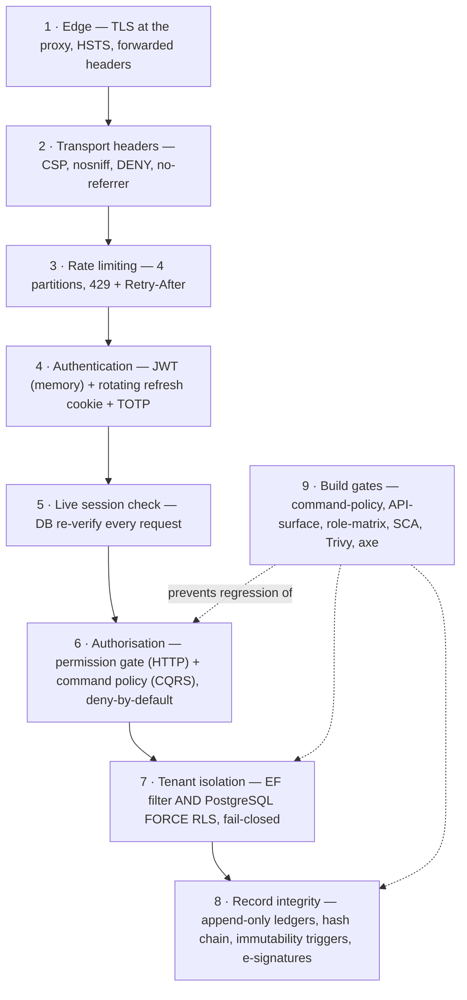
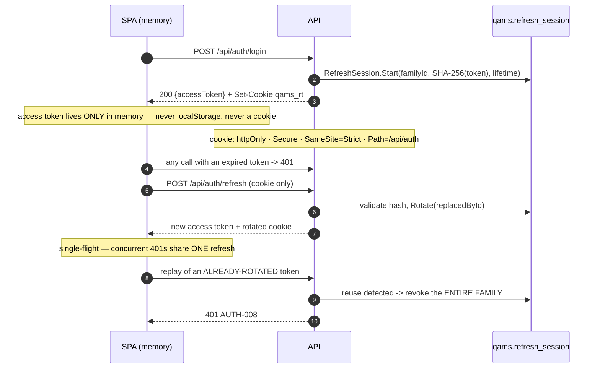

# NT.QMS — Production Software Requirements Specification
## Document 09 · Security Specification

> [Conventions](00-SRS-Index-and-Conventions.md) · Configuration:
> [Document 04](04-Configuration-Reference.md) · API contract:
> [Document 08](08-API-Specification.md)

---

# 9.1 Security model overview

Nine layers, each independently enforced. The design principle is that **no single failure removes a
control**: application logic and the database enforce tenancy and immutability separately, and the
build gates enforce that new code cannot quietly opt out.



---

# 9.2 Authentication

## SEC-01 · Credentials

| Control | Implementation |
|---|---|
| Password hashing | `Microsoft.AspNetCore.Identity.PasswordHasher<UserAccount>` (PBKDF2, framework-versioned format with embedded salt and iteration count) |
| Password rules | ≥12 chars, ≤200, upper+lower+digit+symbol, offline breached/common blocklist — **one shared rule set** across register / reset / change / provision |
| History | must differ from the last `HistoryDepth + 1` (default 6) — `AUTH-102` |
| Maximum age | 90 days (`PasswordPolicy:MaxAgeDays`) |
| Lockout | **5 failed attempts → 30 minutes** |
| Failure disclosure | `AUTH-001 "Invalid credentials."` — never distinguishes unknown user from wrong password |
| Expired-password path | `POST /api/auth/change-password` is **anonymous by design** so an expired password can still be rotated; the handler verifies full credentials |
| Self-service reset | **none** — an administrator resets, delivering the new password out of band |
| E-mail verification | **none** |

## SEC-02 · Multi-factor authentication

| Property | Value |
|---|---|
| Mechanism | **TOTP, RFC 6238** — any authenticator application |
| Scope | **optional per tenant**, default **off** (`TenantSettings.RequireMfaForPrivilegedRoles`) |
| Platform admins | fall back to the global `Security:RequireMfaForPrivilegedRoles` (default false) |
| Enrolment gate | a privileged, non-enrolled user gets a token with `scope=mfa_enrollment`; `MfaEnrollmentGateMiddleware` allows **only** `/api/auth/mfa/enroll` and `/mfa/confirm` (and their `/api/v1/` forms). Everything else → **403 `MFA-ENROLL-REQUIRED`** |
| Secret storage | `user_account.mfa_secret` |
| Recovery codes | **none** — a lost authenticator requires administrator intervention |
| Current state | every tenant in the development dataset has MFA **off** |

## SEC-03 · Session model (ADR-0009, supersedes ADR-0003)



| Control | Value |
|---|---|
| Access token | JWT HS256, **SPA memory only**, `Jwt:ExpiryMinutes` — **shipped 120, ADR-0009 specifies 15** ⚠ |
| Claims | `sub`, `name`, `tenant_id`, role, optional `scope`; **inbound claim remapping disabled** (`MapInboundClaims = false`) so what is issued is exactly what handlers read |
| Validation | issuer, audience, lifetime, signing key; clock skew **1 minute** |
| Refresh cookie | `qams_rt`, **httpOnly · Secure · SameSite=Strict · Path=/api/auth**, `IsEssential` |
| Refresh storage | **SHA-256 hash only** — the plaintext exists solely in the cookie |
| Rotation | every refresh issues a new token and marks the old one `Rotated` |
| **Reuse detection** | presenting an already-rotated token **revokes the whole family** |
| Lifetime | `Auth:RefreshTokenDays`, default **14** |
| Logout | revokes the family server-side **and** clears the cookie |
| SPA bootstrap | `APP_INITIALIZER` attempts a silent refresh before first render |
| Idle timeout | **30 minutes**, client-side |

**Why this shape:** the access token is unreadable by script (it never leaves a JS closure) and the
refresh token is unreadable by script (httpOnly) and un-sendable cross-site (`SameSite=Strict` +
`Path`). XSS can still *use* the in-memory token while the page lives, but cannot exfiltrate a durable
credential.

## SEC-04 · Live session revocation

`ActiveSessionMiddleware` re-checks **every authenticated request** against the database:

| Condition | Response |
|---|---|
| Account row missing or `IsActive = false` | **401 `AUTH-006`** — "Your session is no longer valid." |
| Token role ≠ database role | **401 `AUTH-007`** — "Your permissions have changed." |
| Otherwise | resolves the actor's configurable privileges onto the request |

> Privileges are resolved **per request**, not baked into the token, for exactly the same reason as the
> active-account check: *an administrator who revokes a privilege must have revoked it on the user's
> next request, not whenever their token happens to expire.*

Platform administrators are not tenant members, so they receive a distinct platform-admin privilege
state rather than a resolved tenant permission set.

---

# 9.3 Electronic signatures (21 CFR Part 11 §11.200)

| Requirement | Implementation |
|---|---|
| **Two distinct components** | account **password** + 4-digit **PIN** — both verified on every ceremony |
| Component storage | both hashed with the same identity hasher; the PIN as `user_account.pin_hash` |
| PIN format | exactly 4 digits (`^[0-9]{4}$`) |
| Signature manifest | signer, meaning, subject reference, **content hash**, timestamp |
| Continuous-session exemption | **not implemented** — every signing re-verifies both components |
| Failure logging | **every** failure writes `ESIGN_FAILED` with the reason (`bad-password:` / `bad-pin:`) and the subject reference |
| Throttling | the failure increments **`UserAccount.RegisterFailedLogin`** — the *same* counter as login, so repeated signing failures **lock the account** |
| Locked signer | refused `SIG-003`, and `ESIGN_LOCKED` is written |
| Rate limit | **10/minute per actor** (`sub` claim), not per address |

### Refusal codes
`SIG-404` signer not found · `SIG-003` account temporarily locked · `SIG-002` password incorrect ·
`SIG-001` PIN not set or incorrect.

> **Weakness — 4-digit PIN.** The keyspace is 10,000. The mitigations are the per-actor 10/min limiter
> and the shared 5-attempt lockout, which together make online brute force impractical. But a 4-digit
> PIN is a weak second component by modern standards and is **not configurable**. See §9.11 T-07.

---

# 9.4 Authorisation

## The current model (v1.51)

**Two independent gates.** Full detail in [Document 08 §8.2](08-API-Specification.md).

| Gate | Attribute | Count | Failure |
|---|---|---:|---|
| HTTP | `[Authorize]` (bare — authentication only) | 57 | 401 |
| HTTP | `[RequirePermission(module, action)]` | 144 (3 class, 141 method) | **403 `AUTHZ-403`** |
| HTTP | `[Authorize(Roles = Roles.PlatformAdmin)]` | **1** (control plane only) | 403 |
| CQRS | `[RequireInternalActor]` | 193 | denial |
| CQRS | `[RequirePermissionPolicy(module, action)]` | 12 | `AUTHZ-002` / `AUTHZ-008` |
| CQRS | `[RequireAuthenticatedActor]` | 4 | denial |
| CQRS | `[AllowUnauthenticated]` | 4 | n/a by design |
| CQRS | `[RequireRole(...)]` | 1 | `AUTHZ-002` |

## SEC-05 · Deny-by-default

```csharp
options.FallbackPolicy = new AuthorizationPolicyBuilder().RequireAuthenticatedUser().Build();
```
Every endpoint requires an authenticated user unless it carries `[AllowAnonymous]` or an explicit
anonymous mapping (health, metrics). At the command layer, a command with **no** policy attribute is
denied with `AUTHZ-000` — *and the omission is a build failure*, not a runtime surprise.

## SEC-06 · Permission model

- **31 modules × up to 8 actions = 171 keys**, all code-defined.
- Keys are `{module}.{action}` lower case, persisted **verbatim as a stable contract**.
- An administrator may grant and revoke but **cannot invent** a key (`ROLE-005`).
- **`ROLE-006` lock-out guard:** a change that would leave no active user able to manage roles and
  privileges is refused. The system cannot be locked out of its own administration.
- Every permission change requires a **reason**, recorded on `RolePermissionsChanged` with the
  granted/revoked deltas.
- System roles cannot be renamed or deactivated (`ROLE-003`, `ROLE-004`).

## SEC-07 · Read-only auditor by construction

`[RequireInternalActor]` — the policy on **193 of 215 commands** — excludes `ExternalAuditor` outright.
A write command reachable by that role is impossible to introduce without failing `CommandPolicyTests`.

## SEC-08 · Organisational scope

`OrgScopeGuardInterceptor` plus `IAllocatable` restrict a branch/department-scoped user to records
allocated to their scope. An empty scope means unrestricted within the tenant.

## SEC-09 · Segregation of duties

Ten explicit SoD pairs covering 14 sign-off gates — see
[Document 03 §3.4](03-Business-Rules.md). **Known hole:** `EnsureSignerIsNotPreparer` is a **no-op**
when `CreatedByUserId` is null (legacy rows and system-raised records), so SoD is not enforced there.
Accepted residual F-05b.

---

# 9.5 Tenant isolation

## SEC-10 · Two independent layers

| Layer | Mechanism | Fails how? |
|---|---|---|
| **1 — ORM** | EF Core global query filter on every `ITenantScoped` entity | bypassed by `IgnoreQueryFilters()` (used deliberately by the sweep and snapshot jobs) |
| **2 — Database** | PostgreSQL `ENABLE` **+ `FORCE`** ROW LEVEL SECURITY on **90 of 97 tables** | binds **even the table owner** — that is what `FORCE` buys |

```sql
-- The policy shape, identical on every protected table
USING / WITH CHECK (
  tenant_id = NULLIF(current_setting('app.current_tenant', true), '')::uuid
  OR current_setting('app.bypass_rls', true) = 'on'
)
```

`TenantConnectionInterceptor` calls `set_config` for both GUCs **on every connection open**, and
**fails closed to nil** — an unresolved tenant yields *no rows*, never *all rows*.

## SEC-11 · Tenant source

**Only** the validated JWT `tenant_id` claim. Headers and query strings are explicitly banned as tenant
sources — the as-built v1.0 system's spoofable path.

## SEC-12 · Controlled elevation

Cross-tenant access exists only through `ICurrentTenantSetter.Elevate()`, used by **exactly five**
trusted paths:

1. `ProvisionTenant` 2. `OutboxProcessor` 3. `ScheduledSweepService`
4. `KpiSnapshotService` 5. the start-up LOV backfill

This replaced implicit `IgnoreQueryFilters()` scattered through the codebase — elevation is now
explicit, greppable and reviewable.

## SEC-13 · Structural isolation in the schema

| Control | Detail |
|---|---|
| Composite PKs | 88 tenant-scoped tables use a tenant-first `(tenant_id, id)` PK and **no `UNIQUE(id)`** |
| Tenant-composite FKs | `FOREIGN KEY (fk, tenant_id) REFERENCES parent (id, tenant_id)` — **a child under another tenant's parent is structurally impossible**, which a single-column FK never prevented |
| Owned children | carry a **shadow `tenant_id`** and their own RLS policy |
| Audit-ledger relaxation | `audit.*` `WITH CHECK` is `(tenant_id IS NULL OR tenant_id = GUC OR bypass)` so pre-authentication events can append; `qams.*` stays strict |

> **Why the relaxation exists.** With a strict `WITH CHECK` on the audit ledgers, a **failed login**
> incremented `user_account` (which is not tenant-scoped) → wrote a null-tenant `field_change` row →
> was rejected → and the user saw **HTTP 500 instead of 401**. Lesson recorded in the migration:
> *audit ledgers must accept null-tenant appends.*

## SEC-14 · `DatabaseRoleGuard` — the deployment gate

At start-up the runtime role is inspected for three disqualifying properties:

| Violation | Why it voids isolation |
|---|---|
| `rolsuper` (SUPERUSER) | RLS is not enforced for a superuser |
| `rolbypassrls` | the same, explicitly |
| **owns (or inherits ownership of) application tables** | an owner can **drop the RLS policies and the immutability triggers** |

**Production refuses to boot** on any violation. Non-production logs each one as a warning and
continues — which is why **the development database, owned by `qams_app`, deliberately runs with
weaker isolation than production**. An unreachable database is treated as a readiness concern, not a
privilege violation.

### Verified isolation properties

| Property | Evidence |
|---|---|
| GUC filters rows **even for the owning role** | verified by `psql` as the owner — FORCE works |
| Fail-closed on nil tenant | integration test |
| Controlled bypass works | integration test |
| `WITH CHECK` blocks cross-tenant writes | integration test |
| Cross-tenant IDOR | **9/9 deep security probes, 0 findings** |

---

# 9.6 Record integrity (21 CFR Part 11 §11.10)

## SEC-15 · Append-only ledgers

| Table | Contents | Protection |
|---|---|---|
| `audit.field_change` | per-column before/after, actor, timestamp, **reason** | append-only trigger; **relaxed RLS** (accepts null tenant) |
| `audit.security_event` | auth/signature/export events | append-only trigger; **⚠ NO RLS POLICY** — see §9.11 T-01 |

## SEC-16 · Hash chain

Each audit-trail entry stores `PrevHash` and `EntryHash`, where
`EntryHash = LedgerHash.Compute(prevHash, sequence, eventId, eventType, payload, occurredAtUtc)`
starting from `LedgerHash.Genesis`.

`GET /api/compliance/chain-verification` recomputes the whole chain for the tenant and returns
`(Ok, Verified, BrokenAtSequence)` — **it identifies the first divergent row**, not merely pass/fail.

> **Implementation constraint:** chain hashes are computed over the **database-read**
> (microsecond-truncated) timestamps, not the in-memory values. A rebuild that hashes the in-memory
> `DateTimeOffset` will produce a chain that fails its own verification.

## SEC-17 · Signed-record immutability

`qams.reject_frozen_mutation()` — a `BEFORE UPDATE/DELETE` trigger on the **12 analytical study roots**
(state `SignedOff`) and `uncertainty_budget` (status `Approved`). It permits the transition *into* the
signed state and blocks every mutation after.

**This is the only immutability enforced below the application.** Ten other "immutable" states
(closed audits, closed reviews, completed access reviews, …) are domain-only — a direct SQL `UPDATE`
would succeed. That is precisely why `DatabaseRoleGuard` matters.

## SEC-18 · Reason for change

Every `DELETE` refused without `X-Change-Reason` (400 `CHANGE-REASON-REQUIRED`), and the accepted
reason is stamped onto the ledger row **in the same transaction**. Three commands additionally take a
reason as a first-class field: QC target change, role permission change, legal hold.

## SEC-19 · Attributability

The actor is taken from the validated JWT `sub` claim by `AuditStampInterceptor` and
`HttpCurrentUser`. **A client-supplied actor field is never trusted anywhere in the system.**

## SEC-20 · Security-event catalogue

| Event | Written when |
|---|---|
| `LOGIN_SUCCESS` | successful authentication |
| `LOGIN_FAILED` | failed authentication |
| `LOGIN_MFA_REQUIRED` | MFA challenge issued |
| `LOGIN_MFA_ENROLL_REQUIRED` | enrolment-scoped session issued |
| `LOGOUT` | explicit logout |
| `MFA_ENABLED` | enrolment confirmed |
| `PASSWORD_CHANGED` | password rotated |
| `ESIGN_FAILED` | signing ceremony failed (with reason) |
| `ESIGN_LOCKED` | signing attempted while locked |
| `RECORD_EXPORTED` | any of the four exports |

**Ten event types.** Notably **absent**: role/permission change (captured as a domain event and ledger
row, not a security event), user deactivation, tenant provisioning, and privilege escalation attempts
(403s are not recorded as security events).

---

# 9.7 Transport and browser security

| Header | Value | Scope |
|---|---|---|
| `Content-Security-Policy` | `default-src 'none'; frame-ancestors 'none'; base-uri 'none'; form-action 'none'` | **the API** — deny every load/embed/submit vector |
| `X-Content-Type-Options` | `nosniff` | all |
| `X-Frame-Options` | `DENY` | all |
| `Referrer-Policy` | `no-referrer` | all |
| `Strict-Transport-Security` | `max-age=63072000; includeSubDomains` | **non-Development only** |

| Control | Detail |
|---|---|
| TLS | terminates at the reverse proxy (ADR-0002); the application emits HSTS but does not serve TLS. Browsers ignore HSTS on plain HTTP, so the header is safe everywhere |
| Forwarded headers | `X-Forwarded-For` / `-Proto` honoured (loopback-trusted by default) so the client address survives for rate limiting and logs |
| CORS | **not configured — deliberately** (ADR-0007, same-origin deployment) |
| Cookies | one cookie only (`qams_rt`), httpOnly + Secure + SameSite=Strict + Path-scoped |
| CSRF tokens | **none** — and none are needed: the API is JWT-bearer (not cookie-authenticated) and the single cookie is `SameSite=Strict` and path-scoped to the refresh endpoint |

> **Note on the CSP.** This is the **API's** policy and is correctly restrictive for a JSON API. The
> **SPA** is served by the reverse proxy and therefore needs its own, different CSP — which is
> **outside this codebase**. A deployment that serves the SPA without a CSP has an unprotected
> front-end regardless of this header. See §9.11 T-06.

---

# 9.8 Rate limiting

| Policy | Permits/min | Partition | Applies to |
|---|---:|---|---|
| Global | **300** | client IP | everything |
| `auth` | **10** | client IP | the whole `AuthController` |
| `refresh` | **60** | client IP | `POST /api/auth/refresh` |
| `esignature` | **10** | **actor (`sub`)** | signing ceremonies |

Fixed 1-minute window, `QueueLimit = 0`, rejection **429 + `Retry-After: 60`**. Health probes and
`/metrics` are exempt (throttling them would break the monitoring).

> **Operational trap (measured):** with the default 300/min global limit, a single-origin load run
> returns ~50 % 429s within the first minute. That is *correct* for one abusive client but means the
> value must be sized per site — a laboratory behind one NAT address shares one budget.
>
> **Testing trap:** run the credential-burst probe **last** — it poisons the 10/min auth partition for
> the rest of the run. And a PostgreSQL-down plus rate-limit burst combination will lock the test
> account for 30 minutes.

---

# 9.9 Input and file security

| Control | Detail |
|---|---|
| Validation | 88 FluentValidation validators; length, range, pattern; failures are 400 with per-field detail |
| SQL injection | EF Core parameterisation throughout; the **only** raw SQL is the outbox claim, which uses `FromSqlInterpolated` (parameterised) |
| Upload allow-list | 10 extensions; the client's `Content-Type` is **never trusted or stored** |
| Content sniffing | first **512 bytes** checked against the type's signature; text types rejected on any NUL byte |
| Canonical type | the **extension's** canonical type is stored, so a file can never replay with an attacker-chosen media type |
| Content addressing | `{root}/{tenant}/{sha256}` — path traversal is impossible because the filename is a computed hash, not client input |
| Tenant partitioning | one directory per tenant |
| **Size limit** | ⚠ **none in application code** |
| **AV scanning** | ⚠ **none** |
| Output encoding | Angular's default contextual escaping; **no `bypassSecurityTrust*` calls** in the SPA |

---

# 9.10 Secrets and supply chain

| Control | Detail |
|---|---|
| Secrets in source | **none** — `appsettings*.json` ship every secret as an empty string |
| Development | .NET user-secrets (`nt-qams-webapi`); a fresh clone **will not start** until provisioned (by design, finding F-17) |
| Production | environment variables / secret store (`__` separator) |
| JWT key | must be ≥ 32 characters or the application refuses to start |
| .NET SCA | `dotnet list package --vulnerable` — **fails the build on High/Critical** |
| npm SCA | production dependencies vs an exception register (`.github/npm-audit-allowlist.txt`, currently **empty**) |
| Container scan | Trivy (CLI, not the action — `trivy-action@0.24.0` failed to resolve at job setup) |
| Container hardening | **non-root user**; CI asserts the non-root uid and volume writability |

### The Angular 18 → 22 upgrade

The npm gate surfaced **10 high-severity `@angular/{common,compiler,core}` ≤ 18.2.14 advisories**
(XSS / DoS / information leak) fixable only by a semver-major move. Angular was upgraded **one major at
a time** (18→19→20→21→22) via `ng update`, with build + specs green at each step and one commit per
major. Only manual fix: two deprecated `allowSignalWrites` removals. Post-upgrade
`npm audit --omit=dev` = **0 advisories**.

> **CI constraint:** the frontend job must use **Node 24** — npm 10 (Node 22) falsely rejects the
> npm-11 lockfile.

---

# 9.11 Threat assessment

Rated by likelihood × impact for a laboratory SaaS deployment.

| ID | Threat | Status | Severity | Detail |
|---|---|---|---|---|
| **T-01** | **`audit.security_event` has no RLS policy** | 🔴 **OPEN** | **High** | Both RLS migrations iterate `pg_policies` and therefore *skipped a table that had none*. Its store reads are **not tenant-filtered**. A tenant-scoped caller reaching that read path could see other tenants' security events (login failures, export events, display names). The append-only trigger is present; only isolation is missing. **Fix: one migration adding the standard policy.** |
| **T-02** | Cross-tenant data access (IDOR) | 🟢 Mitigated | — | Two layers; FORCE RLS binds the owner; 9/9 deep probes found nothing; cross-tenant ids return 404 |
| **T-03** | Privilege escalation via role editing | 🟢 Mitigated | — | Keys are code-defined; unknown keys rejected; `ROLE-006` prevents administrative lock-out; every change carries a reason and a ledger entry |
| **T-04** | Token theft (XSS) | 🟡 Partially mitigated | Medium | Access token is memory-only and the refresh cookie is httpOnly — **but** a live XSS can still use the in-memory token for the page's lifetime. Mitigated by Angular's default escaping and no `bypassSecurityTrust*`. **The SPA's own CSP is outside this codebase.** |
| **T-05** | Token replay / session fixation | 🟢 Mitigated | — | Rotating refresh with family-revoking reuse detection, proven live |
| **T-06** | **SPA served without a Content-Security-Policy** | 🟡 **Deployment-dependent** | Medium | The API's CSP does not protect the SPA. If the proxy serves the SPA without its own CSP, the front end has no script-source restriction. Not verifiable from this repository. |
| **T-07** | **4-digit e-signature PIN** | 🟡 Accepted | Medium | 10,000 keyspace. Mitigated by 10/min per-actor throttle and the shared 5-attempt lockout; **not configurable**. |
| **T-08** | **`change-password` as a credential oracle** | 🟡 Accepted | Low–Medium | Anonymous by design (expired passwords). An attacker can verify a tenant+e-mail+password triple without a session — at 10/min. Deliberate trade-off. |
| **T-09** | Credential brute force | 🟢 Mitigated | — | 10/min per address + 5-attempt/30-minute lockout + every failure logged |
| **T-10** | **No upload size limit** | 🟡 **OPEN** | Medium | Only the host body limit applies. An authenticated user can exhaust disk. |
| **T-11** | **No AV scanning on uploads** | 🟡 OPEN | Medium | The allow-list + sniff stops a renamed executable *entering*, but a genuinely malicious PDF/DOCX passes. Files are served back to users. |
| **T-12** | Audit-trail tampering | 🟢 Mitigated | — | Append-only trigger + hash chain + verification identifying the first break + audit-tamper tests |
| **T-13** | Signed-record tampering | 🟢 Mitigated | — | Database trigger on 13 tables |
| **T-14** | **Domain-only immutability on 10 other states** | 🟡 Accepted | Low | Direct SQL could mutate a closed audit or review. Mitigated entirely by `DatabaseRoleGuard` + least-privilege role. |
| **T-15** | Over-privileged database role | 🟢 Mitigated | — | Production refuses to boot; `harden-runtime-role.sql` codifies the safe role |
| **T-16** | **Dev runs with weakened isolation** | 🟡 Accepted | Low | `qams_app` owns the dev tables, so dev does not exercise FORCE RLS as production does. Deliberate and logged as a warning. |
| **T-17** | Secrets leakage | 🟢 Mitigated | — | None in source; user-secrets/env; JWT key length enforced |
| **T-18** | **`PlatformAdmin:Password` left in configuration** | 🟡 Operational | Medium | A standing bootstrap credential. Must be removed after first boot — nothing enforces this. |
| **T-19** | Dependency vulnerabilities | 🟢 Mitigated | — | Three scanners gate every merge; 0 advisories at last run |
| **T-20** | Denial of service via unbounded queries | 🟡 OPEN | Medium | `pageSize` is clamped to 200, but `take` on compliance reads/exports and `days` on KPI history are **not**; 15+ endpoints are unpaged |
| **T-21** | Notification flooding | 🟡 OPEN | Low–Medium | No de-bounce, digest or throttle: an oscillating sensor produces one NC **and one e-mail per recipient per reading** |
| **T-22** | **No independent penetration test** | 🔴 **OPEN** | **High (assurance)** | A dev-instance self-assessment (24 probes, 0 findings) exists and is **explicitly not** a staging pen test. This is the single largest remaining assurance gap. |
| **T-23** | No account-recovery path | 🟡 Accepted | Low | No self-service reset and no MFA recovery codes — a lost authenticator needs an administrator |
| **T-24** | Nav advertises unpermitted modules | 🟢 Cosmetic | Info | 39 of 44 nav items have no visibility predicate; the data calls still 403, so nothing leaks |
| **T-25** | **`Roles.cs` group constants are dead code** | 🟡 Maintenance | Low | Four group constants are referenced only as *test labels*. A future developer may believe they still gate endpoints. |

---

# 9.12 Security testing status

| Activity | Status | Result |
|---|---|---|
| `scripts/security-probe.ps1` (15 fast probes) | ✅ executed | **15/15**, 0 findings |
| `scripts/security-probe-deep.ps1` (9 deep probes) | ✅ executed | **9/9**, 0 findings — cross-tenant IDOR, **refresh reuse-detection proven LIVE**, CORS/XST |
| `RoleEndpointMatrixTests` (6 roles × endpoints) | ✅ in CI | no 401/5xx from a gate; every denial 403 problem+json |
| Audit-tamper tests | ✅ in CI | ledger rejects mutation |
| RLS integration tests | ✅ | isolation, fail-closed, bypass, `WITH CHECK` |
| .NET SCA / npm SCA / Trivy | ✅ in CI | 0 High/Critical |
| axe accessibility | ✅ in CI | real violations found and fixed |
| **Independent penetration test** | ❌ **NOT PERFORMED** | requires an independent party and a staging host |
| **Staging soak / telemetry confirmation** | ❌ **NOT PERFORMED** | no Docker host available (residual R-5/R-7) |
| **CSV re-validation** | ❌ **NOT PERFORMED** | residual R-6 |

`docs/reference/NT_QMS_Security_Assessment_Report.html` is scoped as a **DEV-INSTANCE assessment** and
explicitly states it is not a staging penetration test. A vendor attestation was **refused** rather
than fabricated — independence plus a real staging environment are prerequisites, and forging that
record would itself be a compliance failure.

### Probe execution notes (learned the hard way)
- Run the **credential burst last** — it poisons the 10/min auth partition.
- Windows PowerShell `Invoke-WebRequest` **drops a manual `Cookie` header** and mangles inline JSON;
  for cookie flows use `curl.exe` with `--data "@file"` and a temp-file header dump.

---

# 9.13 Security requirements summary

| ID | Requirement | Verified |
|---|---|---|
| SEC-R-01 | Two independent tenant-isolation layers, fail-closed | ✅ |
| SEC-R-02 | Production refuses to start on an over-privileged database role | ✅ |
| SEC-R-03 | Access tokens never persist outside memory | ✅ |
| SEC-R-04 | Refresh tokens rotate; reuse revokes the family | ✅ live |
| SEC-R-05 | Every authenticated request re-verifies account state and role | ✅ |
| SEC-R-06 | Deny-by-default at both HTTP and command layers, build-gated | ✅ |
| SEC-R-07 | The read-only auditor role cannot reach any write command | ✅ |
| SEC-R-08 | E-signatures require two components; failures are logged and throttled | ✅ |
| SEC-R-09 | Ledgers are append-only and hash-chained; verification identifies the first break | ✅ |
| SEC-R-10 | Signed analytical records are immutable **in the database** | ✅ |
| SEC-R-11 | Every DELETE carries a persisted reason | ✅ |
| SEC-R-12 | Uploads pass an allow-list and content sniff; declared type never trusted | ✅ |
| SEC-R-13 | Defensive headers on every response | ✅ |
| SEC-R-14 | Four rate-limit partitions with 429 + Retry-After | ✅ |
| SEC-R-15 | No secrets in source control | ✅ |
| SEC-R-16 | Dependency and image scanning gate every merge | ✅ |
| SEC-R-17 | `audit.security_event` is tenant-isolated | ❌ **NOT MET (T-01)** |
| SEC-R-18 | Uploads are size-bounded | ❌ **NOT MET (T-10)** |
| SEC-R-19 | Independent penetration test on staging | ❌ **NOT PERFORMED (T-22)** |

---

# 9.14 Security acceptance criteria

| ID | Given | When | Then |
|---|---|---|---|
| **AT-SEC-01** | tenants A and B | a tenant-A user queries any scoped table | only A's rows return — **verified in `psql` as the owning role**, proving FORCE |
| **AT-SEC-02** | Production + a table-owning DB role | the app starts | it **refuses to boot** |
| **AT-SEC-03** | an authenticated session | the account is deactivated | the **next** request returns 401 `AUTH-006` |
| **AT-SEC-04** | a rotated refresh token | it is replayed | the whole family is revoked |
| **AT-SEC-05** | an `ExternalAuditor` token | any write command | 403; and `CommandPolicyTests` prevents such a path existing |
| **AT-SEC-06** | 6 wrong e-signature attempts | the 6th is made | `SIG-003`, 6 `ESIGN_FAILED` events, account locked 30 min |
| **AT-SEC-07** | a signed-off study | a raw SQL `UPDATE` | PostgreSQL rejects it |
| **AT-SEC-08** | any ledger row | it is altered | `chain-verification` returns `Ok = false` **and the sequence number of the first break** |
| **AT-SEC-09** | an executable renamed `.pdf` | it is uploaded | refused with a signature-mismatch message |
| **AT-SEC-10** | any response | it is inspected | CSP, nosniff, DENY and no-referrer are present; HSTS outside Development |
| **AT-SEC-11** | the last `roles.manage` holder | that permission is removed | 422 `ROLE-006` |
| **AT-SEC-12** | a tenant-B record id | requested by a tenant-A user | **404**, never 403 |
| **AT-SEC-13** | a wrong password at login | submitted | **401** (not 500), and a null-tenant ledger row is written |
