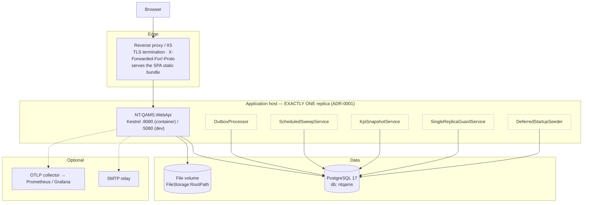
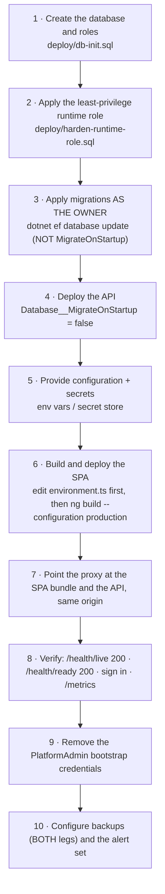

# NT.QMS — Production Software Requirements Specification
## Document 10 · Deployment Specification

> [Conventions](00-SRS-Index-and-Conventions.md) · Configuration keys:
> [Document 04](04-Configuration-Reference.md) · File layout:
> [Document 07](07-File-System-Specification.md)

---

# 10.1 Deployment topology



## DEP-01 · Single-replica constraint (ADR-0001)

The system is **not** horizontally scalable as built.

| Mechanism | Behaviour |
|---|---|
| `SingleReplicaGuardService` | takes a PostgreSQL advisory lock at start-up; holds it for the process lifetime. A second instance **logs a warning and retries every 60 s** — it is detected and reported, **not prevented** |
| Per-job advisory locks | `ComplianceSweep` and `KpiSnapshot` each take their own lock, so even if two instances run, exactly one performs each scheduled round |
| Outbox | `FOR UPDATE SKIP LOCKED` + a 2-minute claim lease makes concurrent processors safe by construction |

So a second instance is *survivable* (no duplicate scheduled work, no duplicate event delivery) but is
**not a supported configuration**. Scale-out is a design change.

---

# 10.2 Supported deployment targets

| Target | Status | Artefacts |
|---|---|---|
| **Windows Server + IIS** | ✅ **verified in this environment** | `deploy/iis/Install-NTQMS-IIS.ps1`, `Verify-NTQMS-IIS.ps1`, `web.config`, `publish-win-x64/` |
| **Windows service** | ✅ documented | `DEPLOY.md` §3 |
| **Linux container** | ⚠ **authored, never executed here** — no Docker on the build host | `src/NT.QAMS.WebApi/Dockerfile`, `deploy/compose.production.yml` |
| **Observability stack** | ⚠ **authored, never brought up** — residual R-7 | `deploy/observability/` (otel-collector, Prometheus, alert rules, Grafana) |

### Container image

```dockerfile
FROM mcr.microsoft.com/dotnet/sdk:9.0     AS build     # /src
FROM mcr.microsoft.com/dotnet/aspnet:9.0  AS runtime   # /app
EXPOSE 8080
HEALTHCHECK --interval=30s --timeout=5s --retries=3   → /health/ready
USER $APP_UID          # NON-ROOT
ENTRYPOINT ["dotnet", "NT.QAMS.WebApi.dll"]
```

CI asserts the **non-root uid** and **volume writability**, and runs a **Trivy** image scan.

---

# 10.3 Deployment procedure

## DEP-02 · Prerequisites

| Item | Requirement |
|---|---|
| .NET runtime | ASP.NET Core 9 (or a self-contained publish) |
| PostgreSQL | **17** |
| Roles | **two**: an *owner* role that owns the schema and applies migrations, and a **least-privilege non-owner runtime role** (`qams_app`) that the application connects as |
| TLS | terminated at the proxy |
| File volume | durable, backed-up, writable by the application identity |
| SMTP | optional |
| OTLP collector | optional |

## DEP-03 · Sequence



### DEP-04 · Migration policy

| Rule | Detail |
|---|---|
| **Apply migrations as the OWNER role**, never as the runtime role | the runtime role deliberately cannot alter schema |
| **Keep `Database:MigrateOnStartup = false` in production** | a deliberate residual: this path still fails fast on a schema gate |
| Preferred mechanism | the idempotent SQL script |
| ⚠ **`deploy/migrations.sql` is STALE** | it covers **migrations 1–10 of 56** while `DEPLOY.md` instructs re-running it on each upgrade. **Regenerate before any use:** `dotnet ef migrations script --idempotent` |
| Round-trip | every migration's `Up`/`Down` is CI-tested |
| RLS on new tables | a new `ITenantScoped` table **must** add its policy in its own migration — EF will not |
| Bypass in migrations | a migration that backfills from, or adds an FK to, a FORCE-RLS table **must** put `SELECT set_config('app.bypass_rls','on',true);` at the top of **both** `Up()` and `Down()`, or the backfill updates **zero rows** and the FK check cannot see the parent |

### DEP-05 · Start-up gates (the deployment will refuse to proceed)

| Gate | Failure mode |
|---|---|
| `ConnectionStrings:Postgres` absent | throws, named |
| `Jwt:Secret` absent or < 32 chars | throws, named |
| Any `ConfigGuard` key present but unparseable | throws with the key, the bad value and the expected type (`CFG-002`) |
| `WestgardLimits` / `RateLimitSettings` / `OutboxOptions` / `RefreshSessionOptions` invalid | throws |
| **Production + over-privileged DB role** | **refuses to boot** (SUPERUSER / BYPASSRLS / owns application tables) |
| Database unreachable | **does not** refuse — seeding defers, readiness reports 503 |

---

# 10.4 Health, readiness and probes

| Endpoint | Checks | Purpose |
|---|---|---|
| `GET /health/live` | **none** | process liveness. A database outage must recycle *traffic*, not the *process* — so this never fails on DB loss |
| `GET /health/ready` | PostgreSQL connectivity | **503** while unreachable. The container `HEALTHCHECK` target and the LB/orchestrator readiness gate |
| `GET /health` | none | legacy liveness alias for existing probes and scripts |
| `GET /metrics` | — | Prometheus scrape |

All four are **anonymous and rate-limit exempt**.

### Probe wiring
| Consumer | Probe | Interval |
|---|---|---|
| Container `HEALTHCHECK` | `/health/ready` | 30 s, 5 s timeout, 3 retries |
| Load balancer | `/health/ready` | site policy |
| Process supervisor | `/health/live` | site policy |
| Prometheus | `/metrics` | scrape interval |

---

# 10.5 Reverse-proxy requirements

| Requirement | Why |
|---|---|
| Terminate TLS | ADR-0002 — the application does not serve TLS |
| Set `X-Forwarded-For` and `X-Forwarded-Proto` | otherwise **every client shares one rate-limit budget** (the proxy's address) and the scheme reads as http |
| Serve the SPA **on the same origin** as the API | ADR-0007 — no CORS is configured, and the refresh cookie is `SameSite=Strict` |
| Apply a **CSP for the SPA** | the API's CSP does not protect the SPA — see [Document 09 T-06](09-Security-Specification.md) |
| Forward `/api/*` to the application | — |
| SPA fallback routing | the Angular router uses path routing; unknown paths must fall back to `index.html` |

---

# 10.6 Environment matrix

| Setting | Development | Production |
|---|---|---|
| `ASPNETCORE_ENVIRONMENT` | `Development` | **`Production`** |
| Logging | default console | **JSON console**, scopes, UTC, ISO-8601 |
| Role guard | warns and continues | **refuses to boot** |
| OpenAPI | mapped at `/openapi` (anonymous) | **not exposed** |
| HSTS | not emitted | emitted |
| DB role | `qams_app` **owns** the tables (weakened RLS — deliberate) | non-owner, non-superuser, non-BYPASSRLS |
| Secrets | .NET user-secrets | env vars / secret store |
| `MigrateOnStartup` | `true` (convenience) | **`false`** |
| `Jwt:ExpiryMinutes` | 120 | **15** (align with ADR-0009) |
| Rate limit (global) | 300 | **sized to the site's peak concurrency** |
| `FileStorage:RootPath` | default | **durable, backed-up volume** |

---

# 10.7 Observability deployment

## Logs
Production emits **structured JSON to stdout** with scopes (service, tenant, trace, correlation), UTC
timestamps in ISO-8601 `"O"`. The application writes **no log files**; retention is the host's concern
and **is not configured anywhere in the repository**.

## Traces
One trace spans HTTP → MediatR → EF/Npgsql → outbox/jobs. The `traceparent` is **persisted on outbox
rows**, so asynchronous delivery joins the originating trace. Health and metrics traffic is filtered
out. OTLP export when `Otlp:Endpoint` is set.

## Metrics — `GET /metrics` (Prometheus text)

| Metric | Meaning |
|---|---|
| `http.server.request.duration` | RED: rate, errors, latency |
| Npgsql meter (`db.client.*`) | connection-pool usage and wait |
| `qams.outbox.processed` / `.failed` / `.dead_lettered` | delivery counters |
| `qams.outbox.backlog` | live unprocessed rows |
| `qams.outbox.oldest_pending_age_seconds` | delivery lag |
| `qams.outbox.dead_letters` | rows awaiting triage |
| `qams.job.last_success_timestamp_seconds{job}` | liveness for `compliance-sweep` and `kpi-snapshot` |

## DEP-06 · The alert set (seven alerts, **defined but never deployed**)

| Alert | Condition | Action |
|---|---|---|
| Error rate | 5xx ratio > 5 % over 5 m | **page** — check the recent deploy and DB health |
| Latency | p95 `http.server.request.duration` > 2 s over 10 m | investigate slow queries / pool wait |
| **Outbox dead-letter** | `qams_outbox_dead_letters > 0` | triage `qams.outbox_event WHERE dead_lettered_at_utc IS NOT NULL`; fix, then clear `dead_lettered_at_utc` + `attempts` to replay |
| Outbox backlog age | `qams_outbox_oldest_pending_age_seconds > 600` | processor stuck or crashed |
| Sweep liveness | `time() − qams_job_last_success_timestamp_seconds{job="compliance-sweep"} > 7200` (2× interval) | sweep not running — check leader election |
| Snapshot liveness | same for `kpi-snapshot`, > 43200 (2× 6 h) | as above |
| Readiness flapping | `/health/ready` non-200 | PostgreSQL down or unreachable |

> **`[Not Executed]`** — `deploy/observability/` was authored but never brought up (no Docker on the
> build host). **No alert in this set has ever been observed firing.** Residual risk **R-7**.
> Where no metrics stack exists, the dead-letter **ERROR log** (`Outbox event … DEAD-LETTERED`) doubles
> as a log-based alert channel.

---

# 10.8 Backup and disaster recovery

| Target | Value |
|---|---|
| **RPO** | ≤ **5 minutes** (continuous WAL archiving with PITR) |
| **RTO** | ≤ **4 hours** |
| Nightly | logical dump (`pg_dump --format=custom --compress=9`) |
| **Second leg** | `tar` of the file store — **mandatory**; the database dump does **not** contain uploaded evidence |
| Manifest | SHA-256 of both artefacts |
| **Post-restore verification** | **mandatory, and includes audit-trail hash-chain verification** |
| Runbook | `deploy/BACKUP-RESTORE-DR.md`; scripts `backup.sh` / `restore.sh` |

> ⚠ `backup.sh` **warns and continues** if the file-store directory is missing, producing a **DB-only
> backup**. That is not a complete backup: every controlled-document version, calibration certificate
> and archive snapshot would be unrecoverable. Verify the path.
>
> ⚠ **No restore drill has been executed in this environment.** RPO/RTO are documented targets, not
> demonstrated capability. **`[Not Executed]`**

---

# 10.9 CI/CD pipeline

`.github/workflows/ci.yml` — triggers on push (including `master`). **Three jobs.**

## Job 1 — `build-test`
| Step | Detail |
|---|---|
| .NET | 9.0.x |
| **Service container** | `postgres:17` |
| Database preparation | creates a **NON-superuser `qams_app` role** owning `ntqms_ci`, then applies EF migrations |
| Test run | the whole solution with `QMS_ITEST_POSTGRES` set, **so the integration suite executes for real** |
| Gate note | because `QMS_ITEST_POSTGRES` is set, the **RLS suite runs** — the TENANT-004 gate is exercised, not skipped |
| .NET SCA | `dotnet list package --vulnerable` — fails on High/Critical |

## Job 2 — `frontend`
| Step | Detail |
|---|---|
| Node | **24** (required — npm 10 on Node 22 falsely rejects the npm-11 lockfile) |
| Build | `ng build --configuration production` |
| Unit | Karma/Jasmine headless |
| e2e | Playwright against a live API |
| **axe** | always-on accessibility gate |
| npm SCA | production dependencies vs `.github/npm-audit-allowlist.txt` (currently **empty**) |

## Job 3 — `container`
| Step | Detail |
|---|---|
| Build | the hardened image |
| Assert | **non-root uid** and **volume writability** |
| Scan | **Trivy** (CLI install — `trivy-action@0.24.0` failed to resolve at job setup) |

## Merge gates (any failure blocks the merge)

| Gate | Prevents |
|---|---|
| `ApiSurface.approved.txt` (658 lines) | silent API-surface drift |
| `CommandPolicyTests` | an unauthorised command |
| Module-boundary test | a cross-module reference |
| Architecture tests (24) | a layering violation |
| Migration round-trip | an irreversible migration |
| Audit-tamper tests | a mutable ledger |
| `RoleEndpointMatrixTests` | a gate that 401s or 500s instead of 403ing |
| `ContractCoverageTests` | a broken list envelope or 404 contract |
| axe | an accessibility regression |
| 3× SCA/Trivy | a vulnerable dependency or image |

## Test baseline (last recorded green run)
**436 backend tests, 0 skipped** · **74 frontend unit specs** · **6 Playwright e2e**.

> **Not in CI:** `tests/NT.QAMS.LoadTests` is **outside the solution** — run it with `dotnet run`, not
> `dotnet test`.

---

# 10.10 Operational runbook summary

| Situation | First action |
|---|---|
| "The app is not working" (dev) | **`scripts/dev-status.ps1`** — it separates the three look-alike failures: port DOWN (ERR_CONNECTION_REFUSED) · API up but readiness **503** (PostgreSQL unreachable) · both healthy (so it is credentials or tenant, not the stack) |
| Start the dev stack | `scripts/dev-up.ps1` (detached, idempotent) |
| After a code change | `scripts/dev-rebuild.ps1` — stop → build → **always restart** |
| Stop the dev stack | `scripts/dev-down.ps1` (stops **only the port owner**) |
| Outbox dead-letters | query `qams.outbox_event WHERE dead_lettered_at_utc IS NOT NULL`; fix the cause; clear `dead_lettered_at_utc` and `attempts` to replay |
| Sweep not running | check `qams_job_last_success_timestamp_seconds{job="compliance-sweep"}`; check advisory-lock contention |
| Readiness 503 | PostgreSQL is unreachable; the process is healthy and will recover without a restart |
| Rotate the JWT secret | update `Jwt:Secret`, restart — **all access tokens become invalid immediately** |
| Audit rows invisible in psql | `SELECT set_config('app.bypass_rls','on',false);` first, or set the tenant GUC |
| Build fails with a DLL lock | **stop the running API** before `dotnet build` / `dotnet ef` |
| Stale SPA after a style change | `ng build` does **not** refresh `ng serve` — restart the SPA |

### Environment gotchas recorded in-repo

| Gotcha |
|---|
| Windows PowerShell 5.1 misreads non-ASCII (em-dash, arrows, box-drawing) in UTF-8-no-BOM `.ps1` files → phantom "missing terminator" parse errors. **Keep scripts ASCII-only.** |
| PS 5.1 rejects `(if …)` as an argument value at **runtime** though it parses. |
| PS 5.1 here-strings with embedded double quotes mangle `git -m` arguments → use `git commit -F file`. |
| Playwright `reuseExistingServer` can run e2e against a **stale** dev server on :4200 — kill it first. |
| After adding EF columns, run `dotnet ef database update` before integration tests, or they fail on model↔schema drift. |
| Live refresh over plain-HTTP localhost needs a manual non-secure cookie — the `Secure` flag blocks the jar. The functional tests are the proof. |
| Dev servers must be started via `scripts/dev-up.ps1` (detached) or they die with the launching session. |

---

# 10.11 Validation and release status

| Item | Status |
|---|---|
| GAMP 5 CSV documentation set | ✅ complete — VMP, URS, FRA, IQ/OQ/PQ protocols, RTM, VSR (`docs/validation/`) |
| OQ execution | ✅ **18 cases executed and transcribed with actual results** across three execution records |
| Real defect found by that execution | **OPS-010** — cold start with PostgreSQL unreachable crashed. Fixed; 6 regression tests added |
| Engineering dry-run evidence | ✅ recorded |
| System-owner release decision | ✅ conditional approval with risk acceptance — **signature lines left BLANK** |
| **Formal signed IQ/OQ/PQ execution** | ❌ pending — execution and signature are events, not documents |
| **Supplier assessment** | ❌ pending |
| **Restore drill** | ❌ pending |
| **SOPs** | ❌ pending |
| **Independent penetration test** | ❌ pending |
| **Staging soak + alert confirmation** | ❌ pending (R-5 / R-7) |
| **CSV re-validation** | ❌ pending (R-6) |

> **No claim of a validated state is made by the software.** Remaining work before a validated go-live
> is execution and operations, not development.

---

# 10.12 Deployment acceptance criteria

| ID | Given | When | Then |
|---|---|---|---|
| **AT-DEP-01** | Production + a DB role owning application tables | the app starts | it **refuses to boot** naming the violation |
| **AT-DEP-02** | Production + a correct least-privilege role | the app starts | it boots; `/health/live` 200, `/health/ready` 200 |
| **AT-DEP-03** | PostgreSQL stopped, then started | probes are polled throughout | live stays 200; ready 503 → 200; **deferred seeding completes without a restart** |
| **AT-DEP-04** | a fresh clone with no user-secrets | `dotnet run` | it refuses to start — **by design** |
| **AT-DEP-05** | a mistyped boolean in configuration | the app starts | it refuses, quoting the key, the value and the expected type |
| **AT-DEP-06** | a container image build | CI runs | non-root uid asserted, volume writability asserted, Trivy scan clean |
| **AT-DEP-07** | a route added without updating the snapshot | CI runs | the build **fails** |
| **AT-DEP-08** | `backup.sh` with a valid file-store path | it runs | three artefacts (`.dump`, `.tar`, `.sha256`) |
| **AT-DEP-09** | a restore | it completes | verification includes an audit-chain check |
| **AT-DEP-10** | two application instances against one database | both start | the second logs the sentinel warning; **each scheduled round runs exactly once** |
