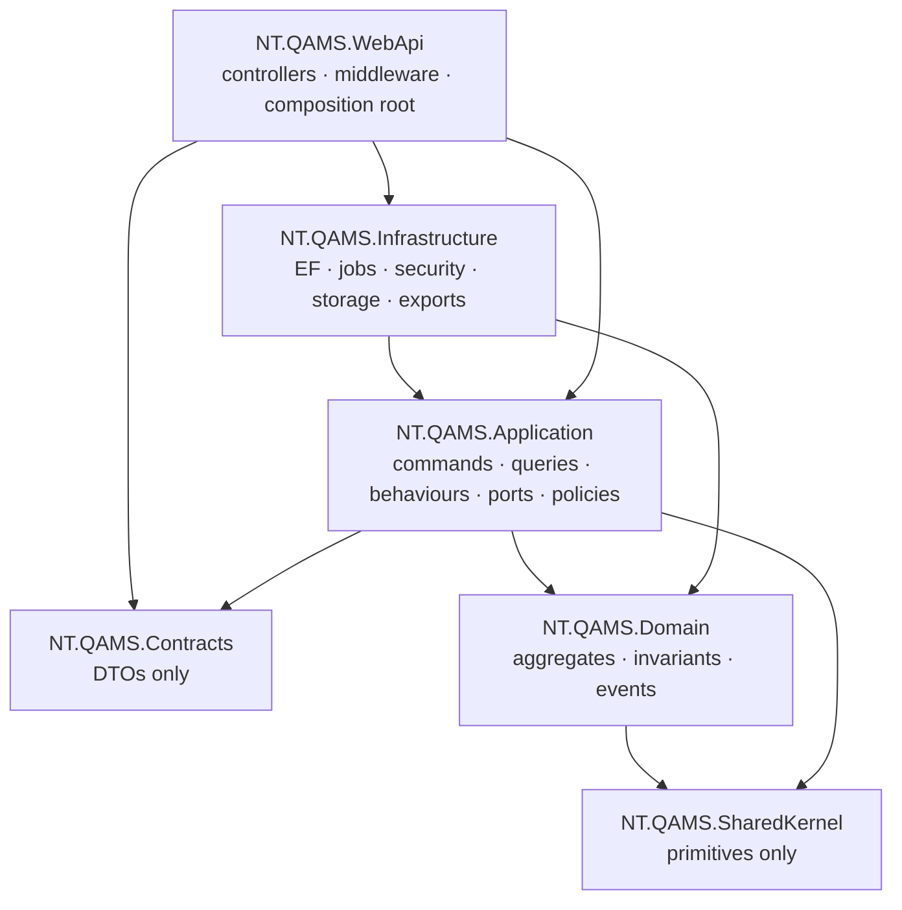

# NT.QMS — Production Software Requirements Specification
## Document 11 · Architecture Constraints

> [Conventions](00-SRS-Index-and-Conventions.md) · Deployment:
> [Document 10](10-Deployment-Specification.md) · Debt these constraints create:
> [Document 14](14-Technical-Debt-Report.md)

These are the **binding constraints** on the system. Most are enforced by an automated gate, which is
what makes them constraints rather than conventions. A rebuild that ignores them will not be the same
system.

---

# 11.1 Layering (Clean Architecture) — machine-enforced

## AC-01 … AC-06 — the enforced rules

`tests/NT.QAMS.Architecture.Tests` — these are **tests**, so a violation is a build failure.

| ID | Rule | Test |
|---|---|---|
| **AC-01** | **SharedKernel references nothing of ours and no frameworks.** It is pure primitives — 11 files, 248 lines. | `SharedKernel_references_nothing_of_ours_and_no_frameworks` |
| **AC-02** | **Domain depends only on SharedKernel.** No EF, no ASP.NET, no MediatR, no FluentValidation. | `Domain_depends_only_on_SharedKernel` |
| **AC-03** | **Application never references Infrastructure or ASP.NET Core.** It depends on *ports* it declares itself. | `Application_never_references_Infrastructure_or_AspNetCore` |
| **AC-04** | **Contracts carry no domain types.** A DTO never leaks an aggregate, an entity or a domain enum. | `Contracts_carry_no_domain_types` |
| **AC-05** | **Infrastructure never references WebApi.** | `Infrastructure_never_references_WebApi` |
| **AC-06** | **A domain module references no other domain module.** The 20 bounded contexts inside `NT.QAMS.Domain` are isolated from one another — cross-context work happens through **domain events and policies in the Application layer**, never by a direct type reference. | `A_domain_module_references_no_other_domain_module` |

> **AC-06 is the strongest and least common of these.** It is why the six event→NC bridges exist as
> `*Policy.cs` files in Application rather than as method calls between aggregates. A rebuild that
> lets `Audit` call `Nonconformance.Raise()` directly has abandoned the design.

## AC-07 · Additional enforced invariants

| ID | Rule | Test |
|---|---|---|
| **AC-07** | **Every command declares exactly one authorisation policy** — not zero, not two. | `Every_command_declares_exactly_one_authorization_policy` |
| **AC-08** | **Every `user_account` query is bounded by tenant or by identity.** `user_account` is one of the four tables deliberately outside RLS (nullable tenant), so an unbounded query over it would cross tenants. The rule is *tested against itself*: `The_rule_rejects_an_unbounded_query` and `The_rule_accepts_a_bounded_query` prove the detector works. | `UserAccountTenantBoundTests` |

---

# 11.2 Domain design constraints

| ID | Constraint | Rationale |
|---|---|---|
| **AC-09** | **The domain protects itself.** Every invariant lives *inside* the aggregate: private setters, static factory methods, guarded state machines. A rule enforced only in a validator, a handler or the UI is a defect. | a rule outside the aggregate can be bypassed by any new call path |
| **AC-10** | **DTOs live in Contracts; entities are never exposed.** | prevents the API contract from being coupled to the model |
| **AC-11** | **Enums persist as strings** (`HasConversion<string>()`). | a reordered enum can never silently re-interpret stored data |
| **AC-12** | **Primary keys are UUIDv7, `ValueGeneratedNever`** — generated by the application. | time-ordered, index-friendly, no round-trip |
| **AC-13** | **Time comes from the injected `IClock`.** `DateTime.Now` is banned. | testability, and contemporaneous ALCOA+ timestamps |
| **AC-14** | **Money is `decimal`; time is `DateTimeOffset` (UTC).** | — |
| **AC-15** | **Cross-aggregate coordination is by domain event + policy**, never a direct reference (see AC-06). | — |
| **AC-16** | **XML doc comments on public domain and application types.** | the domain is the specification |
| **AC-17** | **No magic strings or numbers.** Roles in `Roles.cs`; error codes structured (`NC-001`); QC limits in configuration; permission keys in `PermissionCatalog`. | — |
| **AC-18** | **No dead code, no TODOs, no mocks, no placeholder screens in production paths.** | — |

---

# 11.3 Multi-tenancy constraints (the "sacred" rules)

| ID | Constraint |
|---|---|
| **AC-19** | Every `ITenantScoped` entity is protected by **BOTH** an EF global query filter **AND** PostgreSQL `ENABLE + FORCE` row-level security. Either alone is insufficient. |
| **AC-20** | **A new `ITenantScoped` table MUST add its RLS policy in its own migration** — EF will not. Verify with `SELECT relrowsecurity, relforcerowsecurity FROM pg_class WHERE relname='<t>'` → expect `t\|t`. |
| **AC-21** | The tenant is resolved **only** from the validated JWT `tenant_id` claim. Header and query-string tenant sources are **banned**. |
| **AC-22** | The tenant GUC is set on **every connection open** and **fails closed to nil**. |
| **AC-23** | Cross-tenant work requires **explicit elevation** (`ICurrentTenantSetter.Elevate()`). Implicit `IgnoreQueryFilters()` for tenancy purposes is banned. |
| **AC-24** | **Tenant-first composite primary keys** `(tenant_id, id)` on all 88 tenant-scoped tables, and **no `UNIQUE(id)`** — a unique index that omits the partition key is illegal on a partitioned table, and the schema is partition-ready. |
| **AC-25** | Cross-aggregate FKs are **tenant-composite**: `FOREIGN KEY (fk, tenant_id) REFERENCES parent (id, tenant_id)`. |
| **AC-26** | Owned children declare `child.HasKey("TenantId", "Id")` plus `child.WithOwner().HasForeignKey("TenantId", "<fk>")`, and carry their own RLS policy. |
| **AC-27** | The four nullable-tenant tables (`user_account`, `outbox_event`, `audit.security_event`, `audit.field_change`) keep single-column PKs — a key column cannot be null. This is **accepted deviation B9**, guarded by AC-08. |

---

# 11.4 Persistence constraints

| ID | Constraint | Source |
|---|---|---|
| **AC-28** | **The persistence port is `IAppDbContext` exposing `DbSet`s** — there is deliberately **no repository abstraction**. Accepted coupling. | ADR-0008 |
| **AC-29** | **Optimistic concurrency uses PostgreSQL `xmin`.** There is no `row_version` column. Scaffolded `AddColumn xmin` operations must be **hand-removed** from generated migrations. | ADR-0005 |
| **AC-30** | snake_case naming convention throughout (`UseSnakeCaseNamingConvention`). | — |
| **AC-31** | **Column sizing:** free-text columns sized ≥ 1000 are `text` — the bound lives in the **command validator**, not the column. Bounded codes, refs, enum strings and hashes keep explicit `varchar(n)` under 1000. **Never drop a `varchar` bound without a matching validator rule.** | schema hardening 1.2 |
| **AC-32** | **Index naming:** PostgreSQL truncates identifiers at 63 bytes; **EF truncates client-side at 62, silently, mid-word**. Any index whose default name would exceed 62 chars must be pinned with `HasDatabaseName()` using the abbreviation map. Unique indexes use `ux_`. | schema hardening 1.4 |
| **AC-33** | **Migrations touching FORCE-RLS tables must declare a bypass** — `SELECT set_config('app.bypass_rls','on',true);` at the top of **both** `Up()` and `Down()`. FORCE RLS applies to the migration's own session **and to PostgreSQL's referential-integrity checks**: without the bypass a data backfill silently updates **zero rows** and a later `ADD CONSTRAINT ... FOREIGN KEY` fails because the RI check cannot see the parent. | hard-won |
| **AC-34** | **EF's model snapshot does not learn raw-SQL DDL.** If a migration renames or replaces a constraint via `migrationBuilder.Sql(...)`, EF still believes the old name and the *next* scaffolded migration emits a drop for a constraint that no longer exists. Reconcile generated names against `pg_constraint` before applying; `Down()` must drop what `Up()` **created**, not what it replaced. | hard-won |
| **AC-35** | Interceptor order is **load-bearing**: `TenantConnection → AuditStamp → TenantStamp → FieldChange → Outbox → OrgScopeGuard`. The tenant GUCs must be set before any query the other interceptors trigger. | — |

---

# 11.5 Application-layer constraints

| ID | Constraint |
|---|---|
| **AC-36** | **MediatR is pinned to `12.4.*`.** v13 changes the licence **and** the pipeline `next()` delegate signature — in 12.x `next()` takes no arguments, so passing a `CancellationToken` is a compile error. This is a hard pin, not a preference. |
| **AC-37** | Pipeline order is fixed: **Tracing → Logging → Authorization → Idempotency → Validation → Handler.** Authorisation precedes idempotency so an unauthorised replay is refused; validation is last so only authorised, non-replayed commands are validated. |
| **AC-38** | **Vertical slices**: one `*Slice.cs` per feature area holding its commands, validators, handlers and queries. Larger contexts split into `Commands/`, `Queries/`, `Policies/`. |
| **AC-39** | Every command carries exactly one `CommandPolicyAttribute` (AC-07). |
| **AC-40** | Validators enforce **shape** (required/length/range/pattern). They must not be the only place a business rule lives. |

---

# 11.6 Deployment and runtime constraints

| ID | Constraint | ADR |
|---|---|---|
| **AC-41** | **Exactly one application replica.** Scale-out is a design change, not configuration. | ADR-0001 |
| **AC-42** | **TLS terminates at the reverse proxy**; the application emits HSTS but does not serve TLS. | ADR-0002 |
| **AC-43** | **Same-origin deployment. CORS is deliberately not configured.** A cross-origin client is impossible. | ADR-0007 |
| **AC-44** | **Access tokens in SPA memory only**; refresh is a rotating httpOnly `Secure SameSite=Strict` cookie with family-revoking reuse detection. | ADR-0009 (supersedes ADR-0003) |
| **AC-45** | **Dual routing**: every literal `api/…` route also resolves at `api/v{version}/…`, applied centrally by a convention — never by editing controllers. | ADR-0004 |
| **AC-46** | **Outbox reliability model**: at-least-once with `SKIP LOCKED` claim leases, exponential backoff with jitter, dead-lettering at 5 attempts, retention purge. | ADR-0006 |
| **AC-47** | Production **refuses to boot** on an over-privileged database role. | — |
| **AC-48** | `Database:MigrateOnStartup` stays **off** in production; migrations run as the owner role out of band. | — |
| **AC-49** | The container runs as a **non-root** user, asserted in CI. | — |

---

# 11.7 Frontend constraints

| ID | Constraint |
|---|---|
| **AC-50** | **Strict TypeScript. `any` is banned.** |
| **AC-51** | **Standalone components with signal-based state** — no NgModules. |
| **AC-52** | **The SPA is never a security control.** Every gate it renders is re-enforced server-side; `GET /api/auth/me/privileges` drives presentation only. |
| **AC-53** | **One shared component per cross-cutting concern** — statistic tiles, load-more pager, workflow stepper, status pill, audit trail. This is why the dashboard and the registers cannot drift. |
| **AC-54** | **No colour-only meaning.** Tone rides meters and rails; values use AA-contrast ink steps. |
| **AC-55** | **Accessible dialogs, not `window.prompt`.** Both former prompts (change reason, password reset) were replaced. |
| **AC-56** | i18n is an in-app typed dictionary service — **not** ngx-translate, **not** JSON asset files. Three languages, RTL for Arabic. |
| **AC-57** | The SPA and API are same-origin; `apiBaseUrl` defaults to `'/api'` (AC-43). |

---

# 11.8 Technology constraints (fixed choices)

| Layer | Fixed to | Substitution cost |
|---|---|---|
| Runtime | .NET 9 | whole rebuild |
| Web | ASP.NET Core 9 | whole rebuild |
| Mediator | **MediatR 12.4.\*** (hard pin, AC-36) | pipeline rewrite |
| ORM | EF Core 9 + Npgsql | the port is `DbSet`-shaped (AC-28), so a swap touches every handler |
| Database | **PostgreSQL 17** | **very high** — RLS, advisory locks, `xmin`, `SKIP LOCKED`, `set_config` GUCs and triggers are all PostgreSQL-specific and load-bearing. **The system is not portable to another RDBMS.** |
| Validation | FluentValidation | localised |
| SPA | Angular 22.0.8 | whole front-end rebuild |
| Telemetry | OpenTelemetry | low |
| File storage | local filesystem via `IFileStorage` | **low — the port exists**; an S3/MinIO adapter replaces `LocalFileStorage` without touching callers |
| E-mail | `System.Net.Mail` via `IEmailSender` | low — the port exists |

> **Explicitly NOT used** (contrary to the previous SRS): Redis, Hangfire, Dapper, Mapster,
> ngx-translate, Tailwind, SignalR, Serilog/Seq, hash routing. Background work is `IHostedService`;
> mapping is hand-written projections; caching is per-request only.

---

# 11.9 Forbidden patterns

| # | Forbidden | Why | Detection |
|---|---|---|---|
| 1 | A business rule outside its aggregate | bypassable by a new call path | review |
| 2 | Tenant id from a header or query string | spoofable | review |
| 3 | `IgnoreQueryFilters()` for tenancy | silent cross-tenant leak | review — the five legitimate uses are elevated and greppable |
| 4 | A new `ITenantScoped` table without an RLS migration | half-protected table | manual verification (**not** automated — see [TD](14-Technical-Debt-Report.md)) |
| 5 | `UNIQUE(id)` on a tenant-scoped table | breaks partition-readiness | review |
| 6 | A command without a policy attribute | ungoverned write | **CI gate** |
| 7 | A route change without updating `ApiSurface.approved.txt` | silent contract drift | **CI gate** |
| 8 | A cross-domain-module reference | breaks context isolation | **CI gate** |
| 9 | `DateTime.Now` | untestable, non-UTC | review |
| 10 | An anonymous-object error body | contract drift between error paths | review — `ProblemResponse` is the single writer |
| 11 | A parallel export format (e.g. CSV alongside XLSX) | was built and **deliberately reverted** | review |
| 12 | `any` in TypeScript | — | compiler |
| 13 | `window.prompt` / `window.confirm` | inaccessible | review + axe |
| 14 | Dropping a `varchar` bound without adding a validator rule | removes the only length control | review |
| 15 | A migration touching FORCE-RLS tables without a bypass | silent zero-row backfill | review |
| 16 | Rebuilding the domain into "services" | the aggregates *are* the specification | review |

---

# 11.10 Architecture Decision Records

| ADR | Title | Status | Constraint imposed |
|---|---|---|---|
| **0001** | Single-replica API topology (until Phase-1 scale-out controls) | accepted | AC-41 |
| **0002** | TLS terminates at the reverse proxy; HSTS emitted in-app | accepted | AC-42 |
| **0003** | Access-token storage in the SPA (risk acceptance) | **superseded by 0009** | — |
| **0004** | API versioning and contract evolution | accepted | AC-45 |
| **0005** | Optimistic concurrency via PostgreSQL `xmin` | accepted | AC-29 |
| **0006** | Outbox reliability model | accepted | AC-46 |
| **0007** | Same-origin deployment; no CORS by design | accepted | AC-43 |
| **0008** | The persistence port exposes EF Core `DbSet` (accepted coupling) | accepted | AC-28 |
| **0009** | Refresh-token session model (supersedes 0003) | accepted | AC-44 |

---

# 11.11 Quality attributes these constraints deliver

| Attribute | Delivered by |
|---|---|
| **Auditability** | AC-09 (invariants in the aggregate), AC-13 (injected clock), the append-only ledgers, hash chaining |
| **Tenant safety** | AC-19…AC-27 — two layers, fail-closed, structural FKs, explicit elevation |
| **Regression resistance** | AC-01…AC-08 plus the seven CI merge gates |
| **Testability** | AC-02/03 (no framework in Domain/Application), AC-13 (clock), AC-28 (in-memory provider for unit tests) |
| **Comprehensibility** | AC-38 (vertical slices), AC-06 (isolated contexts), AC-17 (no magic values) |
| **Regulated-record integrity** | database triggers (SEC-17), reason-for-change, SoD, e-signatures |

## What these constraints deliberately sacrifice

| Sacrificed | For |
|---|---|
| **Horizontal scalability** | operational simplicity and correctness guarantees (AC-41) |
| **Database portability** | the isolation and integrity that only PostgreSQL RLS + triggers provide |
| **Cross-origin deployment** | a smaller attack surface (AC-43) |
| **Repository abstraction / ORM swappability** | less indirection, straightforward queries (AC-28, ADR-0008) |
| **Partial updates (`PATCH`)** | explicit, auditable, whole-intent commands |
| **Ad-hoc reporting flexibility** | a fixed, testable, permission-gated reporting surface |

---

# 11.12 Architecture acceptance criteria

| ID | Criterion |
|---|---|
| **AT-AC-01** | Adding a reference from `NT.QAMS.Domain` to any framework package **fails the build**. |
| **AT-AC-02** | Adding a reference from one domain module to another **fails the build**. |
| **AT-AC-03** | Adding a command without a policy attribute **fails the build**. |
| **AT-AC-04** | Adding, removing or renaming a route without updating `ApiSurface.approved.txt` **fails the build**. |
| **AT-AC-05** | An unbounded `user_account` query **fails the build**, and the detector itself is proven by two self-tests. |
| **AT-AC-06** | Exposing a domain type through `NT.QAMS.Contracts` **fails the build**. |
| **AT-AC-07** | A new tenant-scoped table without a FORCE-RLS policy is detectable by `SELECT relrowsecurity, relforcerowsecurity FROM pg_class` — **but is not currently caught by any automated gate** (see [TD](14-Technical-Debt-Report.md)). |
