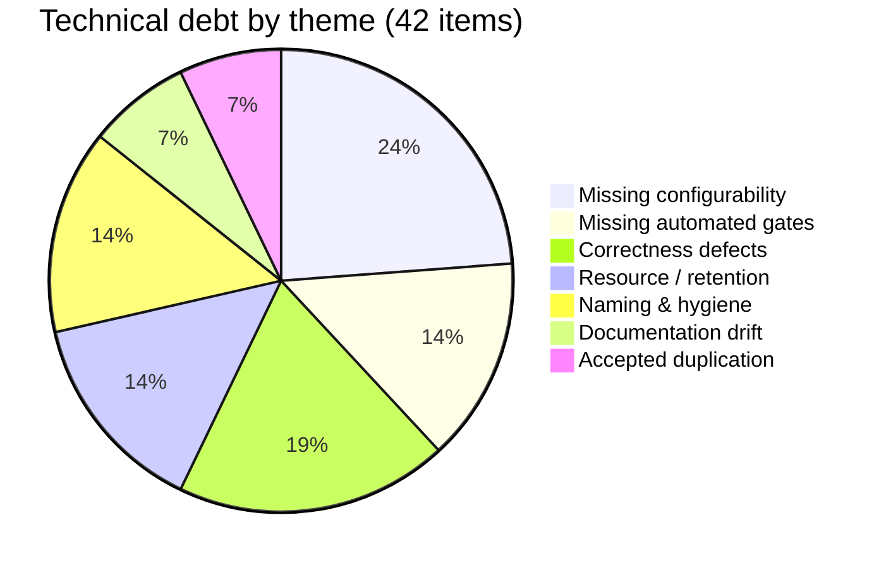

# NT.QMS — Production Software Requirements Specification
## Document 14 · Technical Debt Report

> [Conventions](00-SRS-Index-and-Conventions.md) · Prioritised remediation:
> [Document 15](15-Recommendations.md) · Defects found in the gap analysis:
> [Document 13 §13.7](13-Implementation-vs-SRS-Gap-Analysis.md)

---

# 14.1 Overall assessment

This is a **well-disciplined codebase carrying a specific, identifiable set of debts**. That is worth
stating plainly, because the list below is long and a reader could mistake length for severity.

## What is genuinely good (and therefore should not be "improved")

| Evidence | Measurement |
|---|---|
| **Zero TODO / HACK / FIXME markers** in the entire source tree | measured: `0` across all `.cs` and `.ts` |
| **Zero unauthorised commands** — every one of 215 carries a policy, machine-enforced | `CommandPolicyTests` |
| **Layering is a build gate, not a convention** — including the rare *"no domain module may reference another domain module"* rule | `LayerRulesTests` (6 rules) |
| **The API surface cannot drift** | 658-line snapshot gate |
| **Business rules live in aggregates**, not in handlers or validators | consistent across 86 domain classes |
| **Error codes are structured and exhaustive** — 416 codes, all machine-extractable | — |
| **Hard-won lessons are written down at the point of pain** — the RLS/audit 500-vs-401 lesson, the EF 62-character index truncation, the migration RLS-bypass trap, the `ng build` ≠ `ng serve` trap | code comments and `CLAUDE.md` |
| **Deliberate reversals are recorded** — the CSV export set was built and reverted, and that is documented so nobody rebuilds it | — |
| **Refusals to fabricate evidence** — a vendor pen-test attestation was declined rather than forged | — |

Debt is rated by **cost of leaving it** × **cost of fixing it**.

| Severity | Count |
|---|---:|
| 🔴 High | 5 |
| 🟠 Medium | 21 |
| 🟡 Low | 16 |
| **Total** | **42** |

---

# 14.2 High-severity debt

## TD-01 🔴 · `audit.security_event` has no row-level-security policy

| | |
|---|---|
| **What** | Both RLS migrations iterate `pg_policies` to find tables to harden. `audit.security_event` had **no** policy, so it was **skipped by both**. Its store reads are not tenant-filtered. |
| **Why it happened** | A migration that hardens "every table that already has a policy" cannot bootstrap a table that has none. A reasonable-looking loop with a blind spot. |
| **Cost of leaving** | A tenant-scoped read path over that table returns other tenants' security events — login failures, export events, display names. The append-only trigger *is* present, so integrity holds; **only isolation is missing**. |
| **Cost of fixing** | **One migration.** The policy shape is already standardised across 90 other tables. |
| **Detection** | `SELECT relrowsecurity, relforcerowsecurity FROM pg_class WHERE relname='security_event'` |

## TD-02 🔴 · No automated gate for RLS parity on new tenant tables

| | |
|---|---|
| **What** | `AC-19`/`AC-20` require every `ITenantScoped` table to carry a FORCE-RLS policy added in its own migration. **Nothing checks this.** It is a review discipline documented in three places. |
| **Why it matters** | TD-01 is the proof that the discipline can fail. The single most important invariant in a multi-tenant regulated system is the one with no gate. |
| **Cost of fixing** | **Low.** An integration test that enumerates `ITenantScoped` implementations, maps them to table names, and asserts `relrowsecurity AND relforcerowsecurity` for each. The integration project already runs against real PostgreSQL. |

## TD-03 🔴 · No independent penetration test

| | |
|---|---|
| **What** | 24 self-authored probes pass (0 findings), but they were written by the same party that wrote the system, and run against a development instance. |
| **Cost of leaving** | The largest single assurance gap. No external party has attempted to break this system. |
| **Cost of fixing** | External — needs a staging host and an independent tester. SOW and readiness checklist already exist. |

## TD-04 🔴 · No executed restore drill

| | |
|---|---|
| **What** | RPO ≤ 5 min / RTO ≤ 4 h are **documented targets**. `backup.sh` and `restore.sh` exist. **Neither has been executed end-to-end.** |
| **Cost of leaving** | An untested backup is a hypothesis. Worse: `backup.sh` *warns and continues* when the file-store path is wrong, producing a DB-only backup that looks successful — every controlled document, calibration certificate and archive snapshot would be unrecoverable. |
| **Cost of fixing** | **Low** — one scheduled drill, plus turning the file-store warning into a failure unless `--db-only` is passed explicitly. |

## TD-05 🔴 · `deploy/migrations.sql` is stale and the runbook says to use it

| | |
|---|---|
| **What** | The script covers **migrations 1–10 of 56**. `DEPLOY.md` instructs re-running it on each upgrade. |
| **Cost of leaving** | Following the documented procedure produces a **broken schema**. This is a live footgun in an operational runbook. |
| **Cost of fixing** | **Trivial** — regenerate with `dotnet ef migrations script --idempotent`, and add a CI step that regenerates and diffs it so it can never go stale again. |

---

# 14.3 Medium-severity debt

## Correctness / behavioural

| ID | Debt | Detail | Fix cost |
|---|---|---|---|
| **TD-06** 🟠 | **Complaint closure interlock is unsatisfiable for a rejected NC** | `CMP-020` requires the linked NC to be `Closed`. A *rejected* NC is terminal but never `Closed` ⇒ the complaint can never be closed. | Low — accept `Rejected` as a terminal state in the interlock |
| **TD-07** 🟠 | **Suspended suppliers cannot be reinstated** | `Suspended` is terminal. A supplier auto-suspended for an expired certificate cannot be restored after renewal — the only remedy is a new supplier record, which orphans the evaluation history. | Low — add a guarded `Reinstate` |
| **TD-08** 🟠 | **Test-authorisation scope is never enforced** | `Perform` / `ReviewAndRelease` / `Train` is recorded and never checked anywhere downstream. | Medium — needs a call site that cares |
| **TD-09** 🟠 | **No excursion de-bounce** | Every out-of-limit environmental reading raises an NC **and** a notification per recipient. A sensor oscillating at a limit produces a flood. | Low–Medium — N-consecutive or duration window |
| **TD-10** 🟠 | **E-mail is never retried** | A transient SMTP failure marks the dispatch `Failed` and is logged as a warning. The outbox pattern that protects event delivery is **not** applied to the e-mail leg. | Medium |
| **TD-11** 🟠 | **Silent degradation to log-only e-mail** | `Smtp:Host` unset ⇒ `LoggingEmailSender` binds and dispatches are marked *sent*. No operator warning. A production deployment can believe it is notifying people when it is not. | Trivial — log a startup warning outside Development |
| **TD-12** 🟠 | **Management-review decisions never become tasks** | Owner and due date are recorded; nothing chases them. | Low |
| **TD-13** 🟠 | **`SlaDefinition` and `EscalationTimer` are unwired** | SLA targets are stored per module/severity; timers take an absolute deadline. Nothing derives one from the other, so the SLA table may be decorative. | Medium — first confirm the intent |
| **TD-14** 🟠 | **`Jwt:ExpiryMinutes` = 120 contradicts ADR-0009's 15** | Configuration and the binding decision record disagree by 8×. | Trivial to change; needs a decision on which is right |
| **TD-15** 🟠 | **Tenant lifecycle has no endpoint** | `Suspend` / `Reactivate` / `Terminate` exist on the aggregate. Suspending a tenant today means editing the database. | Low |
| **TD-16** 🟠 | **SoD is a no-op when `CreatedByUserId` is null** | Legacy rows and system-raised records bypass every SoD check silently. Accepted residual F-05b — but it is a real bypass and there is no report of *which* records are affected. | Low — a query that lists them; Medium to backfill |

## Robustness / resource

| ID | Debt | Detail | Fix cost |
|---|---|---|---|
| **TD-17** 🟠 | **No maximum upload size** | Only the host body limit applies. An authenticated user can exhaust the disk. | Trivial |
| **TD-18** 🟠 | **`take` and `days` are unbounded** | `pageSize` is correctly clamped to 200. `take` (compliance reads 200, exports 1000) and `days` (KPI history 90) are **defaults, not maxima**. | Trivial — reuse the clamp pattern |
| **TD-19** 🟠 | **15+ list endpoints are unpaged** | Complaints, feedback, conflicts, monitoring points, reference standards, test authorisations, objectives, quality policy, org-context, SLA definitions, roles, users, access reviews, PT, PT plans and every analytical study list return the full filtered set. | Low each; the shared pager already exists |
| **TD-20** 🟠 | **Ledgers have no partitioning or archival** | `audit.field_change` and `audit.security_event` grow without bound — already 19,296 null-tenant rows in the dev dataset alone. Chain verification is an **O(n) full scan** with no checkpoint. | Medium |
| **TD-21** 🟠 | **No purge for expired `refresh_session` rows** | Rows accumulate past their 14-day lifetime with no cleanup job. | Trivial |
| **TD-22** 🟠 | **File blobs are never deleted** | No retention, no orphan collection, no reference counting. Disposed archive records keep their snapshot forever. **And two records can share one deduplicated blob with no counter** — so if a delete path is ever added, it will corrupt the other record. | Low now, Medium later |

## Operational

| ID | Debt | Detail | Fix cost |
|---|---|---|---|
| **TD-23** 🟠 | **The alert set has never fired** | Seven well-specified alerts; the observability stack was authored and never brought up. Alerts that have never fired are alerts that might not work. | Needs a Docker host |
| **TD-24** 🟠 | **Build output committed to version control** | `deploy/publish-win-x64/` (a full framework publish) plus two ZIPs. They bloat the repository, go stale silently, and can be deployed by mistake instead of a current build. | Trivial — delete and `.gitignore` |
| **TD-25** 🟠 | **Repository documentation contradicts the code in at least six places** | Angular 18 vs 22 · `[Authorize(Roles)]` vs `[RequirePermission]` · ~270 tests vs 436 · 93 tables/49 migrations vs 97/56 · v1.46 vs v1.51 · the stale migration script. `docs/reference/` is described as "law". | Low — but it recurs unless something checks it |
| **TD-26** 🟠 | **`ref` schema granted but never created** | `harden-runtime-role.sql` grants on a schema that does not exist, and the design docs describe it. | Trivial — remove the grant or create the schema |

---

# 14.4 Low-severity debt

## Naming and code-hygiene

| ID | Debt | Detail |
|---|---|---|
| **TD-27** 🟡 | **`AUTHZ-*` prefix collision** — test authorisations (`AUTHZ-001…015`, `404`) share a prefix with the command-authorisation pipeline (`AUTHZ-000`, `002`, `008`). **`AUTHZ-002` carries two entirely unrelated messages** depending on origin. |
| **TD-28** 🟡 | **`SIG-*` prefix collision** — sigma assessment (`SIG-001/002/003`) vs e-signature failure (`SIG-001` PIN, `SIG-002` password, `SIG-003` locked). Three codes, two meanings each. A support engineer cannot resolve a `SIG-002` without context. |
| **TD-29** 🟡 | **`Roles.cs` is 8/9 dead code.** Only `Roles.PlatformAdmin` is used (once). The four group constants (`QmOrAdmin`, `QmDeptAdmin`, `QmAdminAuditor`, `TenantAdminOnly`) survive **only as label strings inside `RoleEndpointMatrixTests`** — a future developer will reasonably believe they still gate endpoints. |
| **TD-30** 🟡 | **Route/aggregate naming mismatch** — `ChangeRequest` is served at `/api/changes`, pinned by the surface gate. |
| **TD-31** 🟡 | **117 duplicated `*-404` throw sites** with near-identical messages. Mechanical, harmless, and a candidate for one guard helper. |
| **TD-32** 🟡 | **`GovernanceControllers.cs` holds 3 controllers; `PlatformControllers.cs` holds 5** including `NotificationsController` — notifications are not a "platform" concern. |

## Duplication

| ID | Debt | Detail |
|---|---|---|
| **TD-33** 🟡 | **Twelve analytical study slices are ~85 % structurally identical** — 2,223 lines across 15 files, each repeating configure / add-point / remove-point / calculate / sign-off with different nouns. Generic-ising them would trade one duplication for one abstraction, and the current shape is very readable. **Documented as a conscious trade-off, not recommended for change.** |
| **TD-34** 🟡 | **Twelve near-identical study controllers** — same trade-off. |
| **TD-35** 🟡 | **Twelve near-identical list/detail SPA screen pairs** — same trade-off. |

## Large files

| ID | File | Lines | Note |
|---|---|---:|---|
| **TD-36** 🟡 | `frontend/src/app/core/models.ts` | **2,205** | one file for every DTO type in the SPA — a growing merge-conflict surface |
| **TD-37** 🟡 | `frontend/src/app/core/i18n.service.ts` | **1,641** | three languages × every key in one file |
| **TD-38** 🟡 | `Application/Reporting/QualityAnalyticsQuery.cs` | **552** | one handler computing nine sections; new, cohesive, watch it |
| **TD-39** 🟡 | `frontend/.../help/help-content.ts` | 917 | static content, low risk |
| **TD-40** 🟡 | `frontend/.../quality-analytics.component.ts` | 657 | new |
| **TD-41** 🟡 | `Persistence/Configurations/AnalyticalQualityConfigurations.cs` | 467 | twelve study configurations in one file — consistent with the slice pattern |

> **Backend file sizes are healthy.** The largest hand-written backend file is 552 lines and the median
> is well under 200. There are no god classes and no long methods of note: the largest domain
> aggregate is `LinearityStudy` at 303 lines, most of which is the documented AMR-refitting algorithm.

## Miscellaneous

| ID | Debt | Detail |
|---|---|---|
| **TD-42** 🟡 | **39 of 44 nav items have no permission predicate** — the sidebar advertises modules the user cannot use. Data calls still 403, so nothing leaks; it is purely a usability wart. Only the five Admin-group items are gated. |

---

# 14.5 Hard-coded values that should be configuration

Full inventory in [Document 04 §4.4](04-Configuration-Reference.md) (CON-01…CON-61). The ones a
laboratory is most likely to hit:

| Priority | Constant | Value | Why it will bite |
|---|---|---|---|
| **1** | Competency pass mark | **80** | Different laboratories use different thresholds. This one is nearly certain to be requested. |
| **2** | SPA idle timeout | **30 min** | 21 CFR Part 11 §11.10(d) automatic logoff — a site policy of 15 minutes cannot be met. |
| **3** | Account lockout | 5 attempts / 30 min | Site security policies vary. |
| **4** | Escalation ladder | +24/+48/+72 h, recipient `"QualityManager"` | The role is a **string literal**, not even a `Roles.*` reference. |
| **5** | Westgard limits | per-deployment, not per-tenant or per-profile | A multi-tenant host cannot give two laboratories different QC rules. |
| **6** | Password length/classes | 12 / upper+lower+digit+symbol | — |
| **7** | Retention classes | 5 y / 10 y / Permanent | A 7-year jurisdiction cannot be represented. |
| **8** | Detection-limit `Z` | 1.645 (one-sided 95 %) | A site wanting 99 % cannot change it. |
| **9** | PT z-thresholds | 2 / 3 | ISO 13528 convention, but not universal. |
| **10** | Sweep and snapshot intervals | 1 h / 6 h | Fine for most sites; not tunable. |

---

# 14.6 Coupling and hidden dependencies

| ID | Coupling | Assessment |
|---|---|---|
| **C-1** | **PostgreSQL is structural, not incidental** — RLS, `FORCE`, advisory locks, `xmin`, `SKIP LOCKED`, `set_config` GUCs, triggers. **The system is not portable to another RDBMS**, and that is a deliberate trade for isolation and integrity. | Accepted (ADR-0008) |
| **C-2** | **`IAppDbContext` exposes `DbSet`** — handlers are coupled to EF Core query semantics. | Accepted (ADR-0008) |
| **C-3** | **MediatR pinned to 12.4.\*** — v13 changes the licence *and* the `next()` signature. An upgrade is a pipeline rewrite. | Accepted, documented |
| **C-4** | **EF interceptor order is load-bearing and enforced only by a comment.** Reordering `TenantConnectionInterceptor` away from first silently breaks tenant isolation for the other interceptors' own reads. | 🟠 **Worth a test** |
| **C-5** | **Middleware order is load-bearing** — five ordering constraints, all documented, none tested. | 🟡 |
| **C-6** | **Free-text instrument references** — `Instrument` fields across QC and the studies are strings, not FKs to `EquipmentItem`. This is why equipment lock-out cannot block use (G-03). | 🟠 |
| **C-7** | **PT plan ↔ enrolment link is a reference string** (`LastEnrollmentRef`), not a relation. | 🟡 |
| **C-8** | **Cross-context work is correctly decoupled** via events + policies (AC-06). | ✅ **exemplary** |
| **C-9** | **28 `IgnoreQueryFilters()` uses across 8 files** — all in legitimately cross-tenant paths (sweep, snapshot, seeding, system-role catalogue, LOV backfill, notification policies, document-review policy, SLA slice), each preceded by an explicit `Elevate()`. Greppable and reviewable, but **the correctness of each is a review judgement, not a test**. | 🟡 |

---

# 14.7 Test-coverage gaps

The suite is strong (436 backend tests, 0 skipped). What it does **not** cover:

| Gap | Risk |
|---|---|
| **RLS parity for new tables** | 🔴 TD-02 — the highest-value missing test |
| **EF interceptor ordering** | 🟠 C-4 |
| **Middleware ordering** | 🟡 C-5 |
| **Write-path load** | the harness supports `--with-writes`; never run |
| **Soak / endurance** | none |
| **E-mail delivery** | SMTP never configured in any tested environment |
| **Container runtime** | image built and scanned in CI; **never run** |
| **Backup / restore** | 🔴 TD-04 |
| **Alert firing** | 🟠 TD-23 |
| **Browser matrix** | none declared, none tested |

---

# 14.8 Debt by theme

## What the shape says

- **The largest single theme is missing configurability**, not broken code. That is the signature of a
  system built quickly to one laboratory's assumptions and now needing to serve several.
- **The second is missing gates.** The team clearly believes in machine-enforced rules — nine
  constraint families are gated — but the six ungated ones are all *database-schema* disciplines, and
  TD-01 is exactly the failure that predicts.
- **Correctness defects are few and shallow.** Most are one-line state-machine adjustments
  (TD-06, TD-07) or a missing bound (TD-17, TD-18).
- **There are no architectural defects.** Nothing in this list requires re-architecting anything.
