# NT.QMS — Production Software Requirements Specification
## Document 15 · Recommendations

> [Conventions](00-SRS-Index-and-Conventions.md) · Sources:
> [Doc 13 gap analysis](13-Implementation-vs-SRS-Gap-Analysis.md) ·
> [Doc 14 technical debt](14-Technical-Debt-Report.md) ·
> [Doc 09 threats](09-Security-Specification.md)

Every recommendation traces to a finding. Effort is **S** (< 1 day), **M** (1–5 days),
**L** (> 5 days) or **EXT** (external party required).

---

# 15.0 The short version

If only five things are done, do these:

| # | Action | Why | Effort |
|---|---|---|---|
| 1 | **Add the RLS policy to `audit.security_event`** | the one open tenant-isolation hole | **S** |
| 2 | **Add an automated RLS-parity test** | the discipline that failed once will fail again | **S** |
| 3 | **Regenerate `deploy/migrations.sql` and gate it in CI** | the runbook currently instructs an action that breaks the schema | **S** |
| 4 | **Run one backup/restore drill** | RPO/RTO are hypotheses until proven once | **S** |
| 5 | **Decide the four business questions in §15.6** | MFA, obsolete-document marking, equipment lock-out, analytical charts — each is a compliance posture, not a coding task | — |

Items 1–4 together are **under two days of engineering** and close the entire high-severity list
except the penetration test.

---

# 15.1 Priority 1 — Do before the next production deployment

| ID | Recommendation | Addresses | Effort |
|---|---|---|---|
| **REC-01** | **Add a FORCE-RLS policy to `audit.security_event`** in its own migration, using the same policy shape as the other 90 tables (with the `audit.*` relaxed `WITH CHECK` that permits null-tenant appends). Verify with `SELECT relrowsecurity, relforcerowsecurity FROM pg_class`. | T-01, TD-01, G-01, FR-CLD-06 | **S** |
| **REC-02** | **Add an RLS-parity integration test.** Enumerate every `ITenantScoped` implementation, resolve its table name from the EF model, and assert `relrowsecurity AND relforcerowsecurity` plus the presence of a `tenant_isolation` policy. The integration project already runs against real PostgreSQL, so this is a single new test class. **This converts the system's most important invariant from a review discipline into a build gate.** | TD-02, AC-19/20, AT-AC-07 | **S** |
| **REC-03** | **Regenerate `deploy/migrations.sql`** (`dotnet ef migrations script --idempotent`) **and add a CI step that regenerates and diffs it**, so it can never silently go stale again. | TD-05, G-15, D-08 | **S** |
| **REC-04** | **Enforce a maximum upload size** in application code (a configurable `FileStorage:MaxUploadBytes` with a documented default), refused with a clear message rather than a host-level truncation. | T-10, TD-17, FR-FILE-03 | **S** |
| **REC-05** | **Clamp `take` and `days`** using the existing `PageRequest.Normalized` pattern. Clamp, never reject — consistent with API-004. | T-20, TD-18, LIM-API-03 | **S** |
| **REC-06** | **Resolve the token-lifetime contradiction.** `Jwt:ExpiryMinutes = 120` versus ADR-0009's 15. Either set it to 15 or amend the ADR with the reason. Do not leave configuration and the binding decision record disagreeing by 8×. | TD-14, D-05, CFG-07 | **S** |
| **REC-07** | **Warn loudly at start-up when `Smtp:Host` is unset outside Development.** Silent degradation to log-only e-mail means a production system can believe it is notifying people when it is not. | TD-11, G-11, BR-NTF-05 | **S** |
| **REC-08** | **Make `backup.sh` fail — not warn — when the file store is missing**, unless `--db-only` is passed explicitly. A backup that silently omits every controlled document should not exit 0. | TD-04, FS-R5 | **S** |
| **REC-09** | **Execute one full backup → restore → verify drill** (including audit-chain verification) and record the actual RPO/RTO achieved. | TD-04, NFR-RCV-05, F-23 | **S** |
| **REC-10** | **Remove `deploy/publish-win-x64/` and the two ZIPs from version control** and add them to `.gitignore`. | TD-24, FS-R6 | **S** |

---

# 15.2 Priority 2 — Correctness defects

| ID | Recommendation | Addresses | Effort |
|---|---|---|---|
| **REC-11** | **Fix the complaint-closure interlock** so a *rejected* linked NC also satisfies `CMP-020`. Today a complaint whose auto-raised NC was rejected can **never** be closed. | TD-06, G-02, FR-CMP-03 | **S** |
| **REC-12** | **Add supplier reinstatement.** A supplier auto-suspended for an expired certificate cannot be restored after renewal; the only remedy orphans the evaluation history. Guard it so reinstatement requires a current certificate. | TD-07, G-03, FR-SUP-03 | **S** |
| **REC-13** | **Add an excursion de-bounce** — N consecutive out-of-limit readings, or a duration window, before raising an NC. Make it configurable per monitoring point. This is the system's most likely source of alert fatigue. | TD-09, G-09, T-21, FR-ENV-02 | **M** |
| **REC-14** | **Retry the e-mail leg.** Reuse the outbox pattern that already protects event delivery: attempts, exponential backoff, dead-letter. A transient SMTP outage currently loses the channel permanently. | TD-10, G-10, FR-NTF-02 | **M** |
| **REC-15** | **Materialise management-review decisions as `WorkTask` rows.** They already carry an owner and a due date; nothing chases them. | TD-12, G-12, FR-MRV-02 | **S** |
| **REC-16** | **Decide and then wire (or delete) `SlaDefinition`.** Either derive escalation-timer deadlines from the SLA table, or remove the table. Right now it stores targets that may drive nothing. | TD-13, G-13, FR-TASK-03 | **M** |
| **REC-17** | **Expose the tenant lifecycle** (`suspend` / `reactivate` / `terminate`) as platform endpoints with the reason already required by the domain. Suspending a tenant should not mean editing the database. | TD-15, G-06, FR-PLT-02 | **S** |
| **REC-18** | **Either enforce or remove `AuthorizationScope`.** A `Perform`-only holder is not prevented from reviewing and releasing — a recorded control that does not control is worse than no control, because it reads as one in an audit. | TD-08, G-08, FR-AUTHZ-02 | **M** |
| **REC-19** | **Report the SoD-null population.** Add a query listing records where `CreatedByUserId IS NULL` on aggregates that carry SoD gates, so the residual F-05b has a measured size rather than an assumed one. | TD-16, G-20 | **S** |
| **REC-20** | **Reach the QC-profile deactivation path** — add the command and endpoint, or remove the unreachable aggregate method. | G-07, FR-AQ-07, LIM-QC-01 | **S** |

---

# 15.3 Priority 3 — Configurability

The single largest debt theme. Recommended in the order a laboratory will actually ask for them.

| ID | Recommendation | Addresses | Effort |
|---|---|---|---|
| **REC-21** | **Make the competency pass mark configurable** — per tenant, ideally per competency subject. Default 80. **The most likely first customer request.** | CON-34, FR-COMP-01 | **S** |
| **REC-22** | **Make the SPA idle timeout configurable.** 21 CFR Part 11 §11.10(d) automatic logoff is a site policy; 30 minutes is currently unchangeable. | CON-09 | **S** |
| **REC-23** | **Make lockout thresholds configurable** (attempts and duration). | CON-05, CON-06 | **S** |
| **REC-24** | **Make the escalation ladder configurable** — levels, intervals and recipient role. And replace the `"QualityManager"` **string literal** with a typed reference. | CON-32, CON-33, C-4 | **M** |
| **REC-25** | **Move Westgard limits to per-tenant (ideally per-QC-profile) scope.** A multi-tenant host currently cannot give two laboratories different QC rules. The evaluator already derives rule labels from the limits, so the mechanism exists — only the scope needs changing. | CFG-18…21, LIM-QC-04 | **M** |
| **REC-26** | **Make password length and character classes configurable**, keeping the current values as defaults. | CON-01…CON-03 | **S** |
| **REC-27** | **Make retention classes data-driven** rather than a three-value enum, so a 7-year jurisdiction can be represented. | CON-56, FR-ARC-02 | **M** |
| **REC-28** | **Make the detection-limit `Z` and the PT z-thresholds configurable**, defaulting to 1.645 / 2 / 3. | CON-37, CON-35, CON-36 | **S** |

> **Design note:** every one of these should go through `ConfigGuard`, which already implements the
> right rule — *missing falls back to the documented default; present-but-invalid refuses start-up*.
> Do not introduce a second configuration idiom.

---

# 15.4 Priority 4 — Resource, retention and scale

| ID | Recommendation | Addresses | Effort |
|---|---|---|---|
| **REC-29** | **Page the remaining 15+ list endpoints.** The shared `qams-load-more` footer and the paging envelope already exist; this is repetition, not design. | TD-19, LIM-API-04 | **M** |
| **REC-30** | **Time-partition `audit.field_change` and `audit.security_event`.** They grow without bound and are the fastest-growing tables. The schema is already partition-ready in shape. | TD-20, LIM-CLD-02 | **L** |
| **REC-31** | **Add incremental hash-chain checkpoints** so `chain-verification` does not rescan the entire ledger on every call. | TD-20, LIM-CLD-03 | **M** |
| **REC-32** | **Purge expired `refresh_session` rows** on the existing sweep. | TD-21, FS-G1 | **S** |
| **REC-33** | **Add reference counting to file storage before any delete path is ever introduced.** Deduplication means two records can share one blob; a delete without counting will corrupt the survivor. Do this *before* it is needed, not after. | TD-22, FS-G3 | **M** |
| **REC-34** | **Sweep orphaned `.upload-*.tmp` files** left by killed processes. | FS-G4 | **S** |
| **REC-35** | **Document a log-retention policy** — the application writes to stdout and nothing in the repository says what happens next. | FS-G6, NFR-OBS | **S** |
| **REC-36** | **Declare resource budgets** (memory, CPU, disk growth per tenant per year) so capacity can be planned. None exists today. | NFR-RES-01 | **M** |

---

# 15.5 Priority 5 — Assurance and hygiene

| ID | Recommendation | Addresses | Effort |
|---|---|---|---|
| **REC-37** | **Commission an independent penetration test on staging.** The SOW and readiness checklist already exist. This is the largest remaining assurance gap and cannot be closed internally. | T-22, TD-03 | **EXT** |
| **REC-38** | **Stand up the observability stack once and confirm each of the seven alerts fires.** An alert that has never fired is not an alert. | TD-23, R-7, NFR-OBS-07 | **M + host** |
| **REC-39** | **Run a 24-hour soak and the write-mix load profile** from a separate host against staging, and record the numbers as the authoritative baseline. | R-5, NFR-PERF | **M + host** |
| **REC-40** | **Test the container image at runtime**, not only at build time. It is built, scanned and asserted non-root in CI, but has never been run. | TD, DEP-02 | **S + host** |
| **REC-41** | **Add tests for the two load-bearing orderings** — EF interceptor order and middleware order. Both are enforced today only by comments, and reordering either silently breaks tenant isolation. | C-4, C-5 | **S** |
| **REC-42** | **Resolve the `AUTHZ-*` and `SIG-*` prefix collisions.** `SIG-002` means both *"the allowable total error must be positive"* and *"account password is incorrect"*; a support engineer cannot resolve it without context. Renumber the sigma-assessment family (e.g. `SGA-*`) and the test-authorisation family (e.g. `TAU-*`). Note this is a **breaking change to a documented contract** — schedule it with a version bump. | TD-27, TD-28 | **M** |
| **REC-43** | **Delete the dead `Roles.cs` group constants**, or add a comment stating they are retained only as test labels. A future developer will otherwise believe they gate endpoints. | TD-29, D-03 | **S** |
| **REC-44** | **Add permission predicates to the remaining 39 nav items.** Nothing leaks — the data calls still 403 — but the sidebar advertises modules the user cannot use. | TD-42, LIM-UI-01 | **S** |
| **REC-45** | **Add a not-found screen.** Every unknown URL currently redirects silently to the dashboard. | LIM-UI-02 | **S** |
| **REC-46** | **Reconcile `docs/reference/` with the as-built.** Six documented facts contradict the code. Since those documents are described as "law", the contradiction is load-bearing. Consider making **this SRS set** the as-built reference and marking `docs/reference/` explicitly as *design-time intent*. | TD-25, D-01…D-11 | **M** |
| **REC-47** | **Remove the `ref` schema grant** from `harden-runtime-role.sql`, or create the schema. | TD-26, G-17 | **S** |
| **REC-48** | **Formally supersede `NT_QMS_SRS.html`.** It describes a different system and would cause a rebuild to implement the wrong privilege model, the wrong error contract and the wrong escalation path. Mark it superseded and point it at this set. | Doc 13 headline | **S** |

---

# 15.6 Decisions required from the business

These are **not** engineering choices. Each needs an owner.

| ID | Decision | The situation | If the answer is "yes, enforce it" |
|---|---|---|---|
| **D1** | **Is MFA mandatory?** | The previous SRS says *"must require MFA for all active accounts"*. The system makes it **optional per tenant, default off**, and every tenant in the dev dataset has it off. If an accreditation body has been told MFA is enforced, **it is not**. | **S** — flip the default and add a platform-level override that a tenant cannot disable |
| **D2** | **Is record-level obsolescence marking sufficient?** | ISO 17025 §8.3.2 requires obsolete documents to be clearly identified. The system marks the *record* obsolete; the *file* downloads unmarked, with no watermark and no PDF processing anywhere in the codebase. | **L** — introduces a PDF-processing dependency the system currently does not have |
| **D3** | **Must equipment lock-out be enforced by software?** | Out-of-service equipment is flagged but not blocked, because instrument references are free text rather than foreign keys. The previous SRS says selection *must* be blocked. | **L** — a schema and data-migration change across QC and the studies |
| **D4** | **Are numeric-only analytical results acceptable?** | Twelve study types compute Levey-Jennings, Passing-Bablok, Bland-Altman and linearity statistics but **render no plots**. Reviewers must sign off on numbers. | **M–L** — chart components for at least LJ, PB and BA |
| **D5** | **Is a 4-digit e-signature PIN acceptable?** | 10,000 keyspace, mitigated by a per-actor 10/min limiter and the shared lockout. Not configurable. | **S** — make the length configurable with a 6-digit default |
| **D6** | **Should `Questionable` PT results (2 < \|z\| < 3) trigger anything?** | Today they are recorded and trigger nothing. Many laboratories require investigation. | **S** |
| **D7** | **Is data-at-rest encryption in place?** | The previous SRS requires AES-256 at rest. The application does no encryption; it relies entirely on the database and volume. | Deployment, not code |
| **D8** | **What is the availability target?** | None is defined anywhere. Health/readiness separation supports one; nobody has stated it. | — |
| **D9** | **What is the supported browser matrix?** | None declared, none tested. | — |
| **D10** | **What WCAG level is claimed?** | axe runs on every build and real violations were fixed, but no conformance level is claimed. | — |

---

# 15.7 Suggested sequencing

```mermaid
gantt
  dateFormat X
  axisFormat %s
  title Recommended order (relative effort units, not calendar time)

  section Sprint 1 — close the high-severity list
  REC-01 RLS on security_event        :a1, 0, 1
  REC-02 RLS parity test              :a2, 0, 1
  REC-03 Regenerate migrations.sql    :a3, 1, 1
  REC-04 Upload size limit            :a4, 1, 1
  REC-05 Clamp take/days              :a5, 2, 1
  REC-06 Token lifetime decision      :a6, 2, 1
  REC-07 SMTP startup warning         :a7, 3, 1
  REC-08 Backup fails on missing store:a8, 3, 1
  REC-09 Restore drill                :a9, 4, 1
  REC-10 Un-commit build output       :a10, 4, 1

  section Sprint 2 — correctness
  REC-11 Complaint interlock          :b1, 5, 1
  REC-12 Supplier reinstatement       :b2, 5, 1
  REC-15 Review decisions as tasks    :b3, 6, 1
  REC-17 Tenant lifecycle endpoints   :b4, 6, 1
  REC-19 SoD-null report              :b5, 7, 1
  REC-20 QC profile deactivation      :b6, 7, 1
  REC-41 Ordering tests               :b7, 8, 1
  REC-13 Excursion de-bounce          :b8, 8, 2
  REC-14 E-mail retry                 :b9, 10, 2

  section Sprint 3 — configurability
  REC-21 Competency pass mark         :c1, 12, 1
  REC-22 Idle timeout                 :c2, 12, 1
  REC-23 Lockout thresholds           :c3, 13, 1
  REC-26 Password policy              :c4, 13, 1
  REC-28 Z and z-thresholds           :c5, 14, 1
  REC-24 Escalation ladder            :c6, 14, 2
  REC-25 Per-tenant Westgard          :c7, 16, 2

  section External track (parallel, blocked on a host)
  REC-37 Penetration test             :d1, 0, 8
  REC-38 Alert confirmation           :d2, 4, 4
  REC-39 Soak + write load            :d3, 8, 4
  REC-40 Container runtime test       :d4, 4, 2
```

**The external track is genuinely parallel** and is the long pole. Start REC-37 on day one; it blocks
nothing else and nothing else blocks it.

---

# 15.8 What NOT to do

Recommendations are cheap; restraint is not. These would be mistakes.

| Do not | Why |
|---|---|
| **Do not generic-ise the twelve analytical study slices** | ~2,200 lines of structural duplication is real, but each slice is readable in isolation and the abstraction that would replace it would be harder to verify than the duplication. The regulated read of this code matters more than its line count. |
| **Do not reintroduce CSV exports** | Built once and **deliberately reverted**. XLSX is the single tabular format by decision. |
| **Do not remove the `MediatR 12.4.*` pin** without planning a pipeline rewrite | v13 changes the licence *and* the `next()` signature. |
| **Do not "simplify" the two-layer tenancy** to EF filters alone | FORCE RLS binds even the table owner. That is the property the whole compliance posture rests on. |
| **Do not add a repository abstraction over `IAppDbContext`** | Explicitly decided (ADR-0008). Reversing it touches every handler for no verified benefit. |
| **Do not scale out** without addressing ADR-0001 first | The advisory-lock sentinel *detects* a second replica; it does not make one correct. |
| **Do not "fix" the in-memory display-name mapping** in the document-acknowledgement coverage query | A cross-`DbSet` `.Join` to users **did not translate in EF Core and produced a 500**. The two-query shape is deliberate. |
| **Do not hash in-memory timestamps** in the audit chain | Chain hashes are computed over **database-read, microsecond-truncated** timestamps. Changing this breaks verification of every existing row. |
| **Do not enable `Database:MigrateOnStartup` in production** | It is a schema gate that fails fast by design. |
| **Do not convert every remaining hard-coded constant to configuration** | Several (the Tukey 1.5 multiplier, the 1.96 Bland-Altman factor, the 1.65 one-sided factor) are **statistical definitions**, not policy. Making them configurable invites a laboratory to invalidate its own statistics. |

---

# 15.9 Closing assessment

NT.QMS is a **substantially complete, well-disciplined regulated system**. The engineering is
better than the documentation: the code enforces more than the documents claim, the tests gate more
than most projects attempt, and the places where a shortcut was taken are, with few exceptions,
written down at the point where the shortcut lives.

The findings in this set fall into three honest categories:

1. **One real isolation hole** (`audit.security_event`) and **one missing gate** that would have caught
   it. Both fixable in a day.
2. **A configurability debt** that reflects a system built to one laboratory's assumptions and now
   ready to serve several.
3. **An assurance gap** — penetration test, restore drill, alert confirmation, soak — that is
   *external by nature* and cannot be closed by writing more code.

The largest single risk to this project is **not** in the code. It is that
`NT_QMS_SRS.html` remains in circulation as the specification of a system it does not describe.
A team building against it would implement the wrong privilege model, the wrong error contract, the
wrong escalation path and four features that do not exist. **REC-48 is the cheapest high-value action
in this document.**
